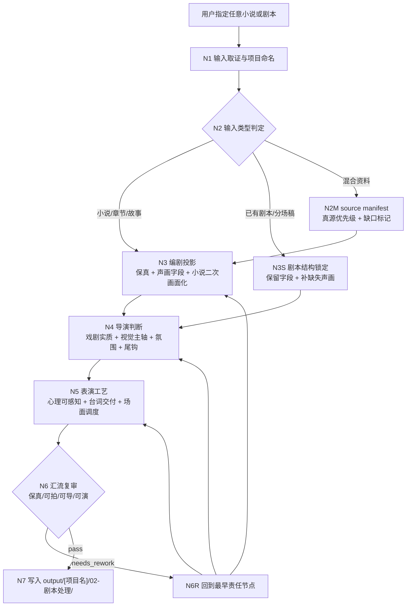
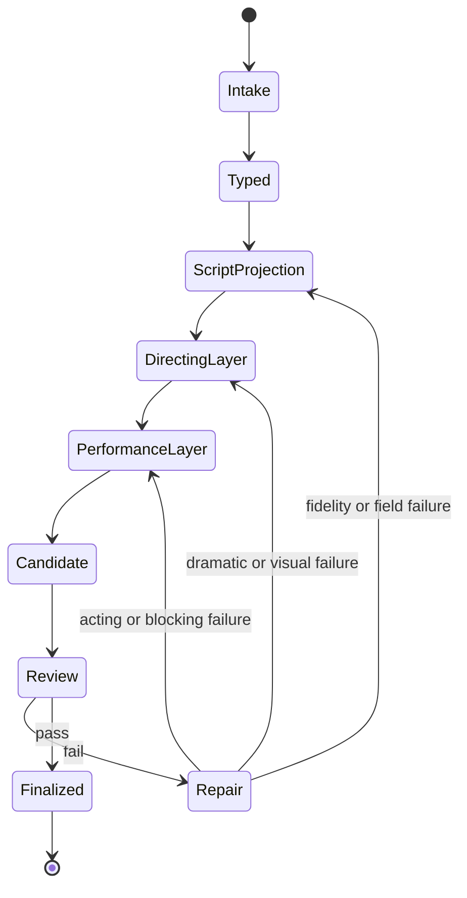
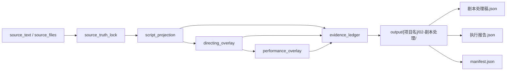
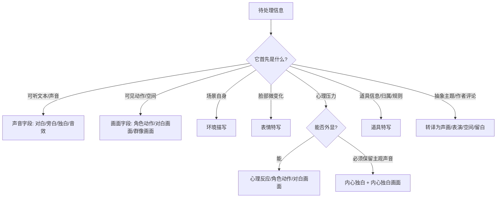
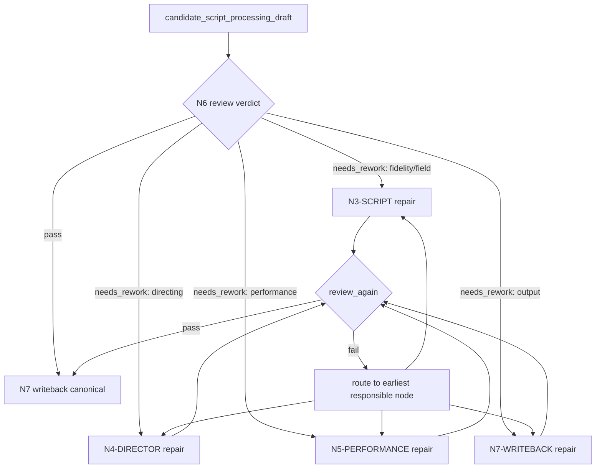

# 02-剧本处理

`02-剧本处理` 是 BYKJ AIGC 工作流的整合型单阶段 skill。它把原 `aigc/2-编剧`、`aigc/3-导演`、`aigc/4-表演` 的核心能力收束到一个 `SKILL.md` 中：先把任意小说或剧本投影为保真、可拍的剧本字段，再在同一份稿件内注入导演判断和表演工艺，最终只写入一个 canonical 输出目录：

`output/[项目名]/02-剧本处理/`

本阶段不再回写 `projects/aigc/<项目名>/2-编剧/`、`3-导演/`、`4-表演/` 三套真源；原三技能只作为能力来源和争议追溯对象，不作为 BYKJ `02` 运行时的分阶段输出真源。

## Context Loading Contract

- 每次调用 `$aigc-bykj-script-processing`、`02-剧本处理` 或本目录 `SKILL.md` 时，必须同时加载同目录 `CONTEXT.md`。
- 若本轮任务通过父级 `$aigc-bykj` 路由进入，必须先遵守父级 `SKILL.md + CONTEXT.md` 的阶段路由，再进入本阶段。
- 若用户输入绑定现有项目根，按需加载项目内稳定偏好、世界观、角色、风格、制作限制和历史稿件；若没有项目根，则只以用户指定的小说或剧本、用户显式要求和本 `SKILL.md` 为真源。
- 冲突优先级：用户显式请求 > 根 `AGENTS.md` > 父级 `aigc-bykj/SKILL.md` > 本 `SKILL.md` > 项目级长期记忆/上下文 > 本 `CONTEXT.md` > 来源技能追溯材料。
- 核心创作判断必须由 LLM 直接完成；脚本只允许承担读取、抽取、校验、格式转换、manifest 回写等机械辅助。

## Source Capability Integration

| source skill | 本阶段吸收的核心能力 | 本阶段不继承的运行时形态 |
| --- | --- | --- |
| `aigc/2-编剧` | 上游事实保真、对白冻结、声画字段分流、小说表述二次画面化、场景节奏、信息差、潜台词、长对白节拍 | 不创建 `2-编剧/第N集.md`，不把编剧稿作为单独 canonical 阶段 |
| `aigc/3-导演` | 戏剧实质、观众位置、高潮画面、整集视觉主轴、单场美学、氛围意境、声音/情绪节奏、终结画面、受控增强边界 | 不创建 `3-导演/第N集.md`，不把导演判断拆成第二稿 |
| `aigc/4-表演` | 心理反应可感知化、演员五层控制、台词表演、潜台词行为化、场景状态差、场面调度/权力关系、沉默余波、生理真实性、群戏层次 | 不创建 `4-表演/第N集.md`，不把表演工艺写成场景末尾总结块 |

整合原则：

- 编剧层负责真源和可拍字段，导演层负责场景为什么有戏，表演层负责演员如何可执行。
- 三层能力按顺序串行，但输出只汇入同一份 `剧本处理稿.json`。
- 任何导演或表演增强不得改写上游剧情事实、对白、事件结果、人物关系结论或场景顺序。
- 受控增强只允许补环境、反应、停顿、道具状态、声音层次、空间距离和余波承托；不得新增剧情事件、对白、规则、线索、因果或人物动机。

## Reference Loading Guide

本阶段以单一 `SKILL.md` 为执行真源。来源技能的核心细则已在下方 `Integrated Source Essence Bank` 内化为执行判据；只有遇到争议、需要查原文措辞、或 fail code 无法裁决时，才按下表读取原技能文件。读取后只能用于追溯和复核，不得把输出路径、分阶段真源或多目录写回规则带入 BYKJ `02`。

| need | traceback source | how to consume |
| --- | --- | --- |
| 编剧保真、对白冻结、字段路由、小说二次画面化 | `.agents/skills/aigc/2-编剧/SKILL.md` 与其 `references/field-routing-and-audio-visual-contract.md`、`references/novel-to-screen-language-contract.md` | 只消费保真、字段、画面化和 review 规则，输出仍写 `02-剧本处理` |
| 信息差、场景节奏、潜台词、长对白节拍 | `.agents/skills/aigc/2-编剧/references/information-asymmetry-contract.md`、`scene-rhythm-contract.md`、`dialogue-subtext-contract.md` | 作为 `N3-SCRIPT` 的 evidence 要求 |
| 导演创作内核、视觉主轴、高潮、氛围、尾钩 | `.agents/skills/aigc/3-导演/SKILL.md` 及 `references/directorial-authorship-contract.md`、`episode-visual-spine-contract.md`、`climax-visual-treatment-contract.md`、`atmosphere-and-mood-contract.md`、`episode-final-image-contract.md` | 作为 `N4-DIRECTOR` 的创作判断来源 |
| 表演工艺、心理反应、台词交付、场面调度、沉默余波 | `.agents/skills/aigc/4-表演/SKILL.md` 及 `references/psychological-reaction-contract.md`、`performance-and-scene-craft-contract.md`、`actor-performance-control-contract.md` | 作为 `N5-PERFORMANCE` 的表演落点来源 |
| 具像语言、动作链、观众心理、情绪节奏、角色活人感 | `.agents/skills/aigc/_shared/*.md` 中对应共享合同 | 作为全链路阻断门，防止抽象化和动作链断裂 |

动态加载规则：

- 默认不预加载上述所有来源文件；只有输入复杂、发生争议、或 review gate 触发对应 fail code 时再读取。
- 原技能 `CONTEXT.md` 只用于识别失效模式和修复经验，不允许覆盖本阶段的输出路径和单阶段真源。
- 若来源技能细则与本 `SKILL.md` 冲突，以本阶段单阶段输出合同为准。

## Integrated Source Essence Bank

本节是原复杂多层级技能包的核心精华压缩层。执行 `02-剧本处理` 时，优先按本节判断，不需要先翻回原 `2-编剧`、`3-导演`、`4-表演` 的多层 references。

### A. 编剧精华：保真、字段、可拍性

| essence_id | source essence | execution rule | blocking failure |
| --- | --- | --- | --- |
| `ESS-SCRIPT-FIDELITY` | 剧情事实、对白、事件顺序是源层真源 | 所有改编只能改变承载方式，不能改变事实、对白、顺序、结果和关系 | 摘要、删减、合并、重排、改对白、补因果 |
| `ESS-SCRIPT-SECTION-TITLE` | 原文章节/集划分标题是结构真源 | `第N章`、`第N集`、`第N幕`、`第N场` 等原有划分标题必须原封不动保留 | 改名、翻译、合并、删去、重编号 |
| `ESS-SCRIPT-DIALOGUE-LOCK` | 对白冻结但表演状态可增强 | 引号内逐字保真；引号外可补语态、停顿、对白画面和对手反应 | 润色、同义替换、把动作塞进引号 |
| `ESS-SCRIPT-AUDIOVISUAL` | 声画字段分离且就近配对 | 声音字段只写可听内容；画面字段只写可见/可演内容；每条声音就近有画面承托 | 声音解释画面、画面复述对白、声音无承托 |
| `ESS-SCRIPT-SLUGLINE` | slugline 是下游分组锚点 | 场景标题按空间/时间变化建立；同一空间时间不重复开场 | 用剧情 beat 标题代替场景，重复 slugline |
| `ESS-SCRIPT-NOVEL-TRANSFORM` | 小说语言要转成影视语言 | 作者评论、心理内视、比喻、象征、概括、背景和关系结论转成声画、动作、道具、空间、群像、短旁白或留白 | “他意识到/这意味着/仿佛命运”直进正文 |
| `ESS-SCRIPT-INNER-VOICE` | 主角主观视角是资产 | 主角判断、误读、怀疑、确认优先保留为 `内心独白（主角）`；主角自指改第一人称 | 删除主观视角，或写成全知客观概括 |
| `ESS-SCRIPT-ACTION-PURITY` | 动作字段是镜头事实 | 写手、眼、呼吸、重心、步伐、接触、速度、力度和停点 | “试图/想要/打算/意图/为了” |
| `ESS-SCRIPT-ENV-PURITY` | 环境描写只写场景本身 | 写空间结构、光线、材质、空气、天气、静物和声底 | 人物动作、剧情结果、心理解释混入环境 |
| `ESS-SCRIPT-FACE-ANCHOR` | `表情特写` 是正式面部落点 | 关键脸部 beat 写眉眼嘴、鼻翼、咬肌、下颌、喉头、眨眼、皮肤状态 | “表情复杂/很愤怒/镜头推近” |
| `ESS-SCRIPT-LONG-DIALOGUE` | 长对白先在编剧层拆成可演节拍 | 按语义动作、压力转折、气口和对手反应拆分；拼回必须逐字等于原文 | 把长对白整段念稿，或断句变成改写 |

### B. 编剧精华：信息差、节奏、潜台词

| essence_id | source essence | execution rule | evidence |
| --- | --- | --- | --- |
| `ESS-INFO-ASYMMETRY` | 信息差是悬念发动机，不是新增剧情 | 标注观众知道、角色知道、双方误判、被隐藏信息和释放点 | `information_asymmetry_map` |
| `ESS-AUDIENCE-SEED` | 编剧层就要给观众心理基线 | 关键场景写观众此刻期待、害怕、误以为、等待什么 | `audience_psychology_seed` |
| `ESS-SCENE-RHYTHM` | 场景节奏不是统一密度 | 每场判定时长体感、信息密度、beat 数量、转出方式、铺陈/压缩/留白 | `scene_rhythm_profile` |
| `ESS-DIALOGUE-SUBTEXT` | 关键对白要知道“这句话在做什么” | 标注试探、施压、遮掩、示弱、结盟、拒绝、告白、测试等戏剧动作 | `dialogue_subtext_map` |
| `ESS-CONFLICT-LEGACY` | 每场要留下冲突遗产 | 记录本场把什么压力、未解答案、关系状态或误判交给下一场 | `conflict_legacy_seed` |

### C. 导演精华：戏剧实质与视觉组织

| essence_id | source essence | execution rule | blocking failure |
| --- | --- | --- | --- |
| `ESS-DIR-SUBSTANCE` | 导演判断先问“这场戏为什么有戏” | 每个关键场景回答戏剧问题、人物压力、选择代价、观众位置和信息释放 | 只有漂亮描述，没有戏剧问题 |
| `ESS-DIR-WHO-WHY` | 同一动作因人物处境不同而不同 | 先锁定谁来、为什么来、此刻状态、未出口压力，再写画面 | 把场景当成表层动作生成题 |
| `ESS-DIR-PEAK` | 高点来自上游已有兑现点 | 找行动结果、认知翻转、关系暖点、规则显影、奇观或怪异落点，再强化声画余波 | 为了“更炸”新增事件或结果 |
| `ESS-DIR-ANTICLIMAX` | 高潮不总是给满 | 判断延迟满足、低调高潮、失败高潮、假兑现、中断兑现是否更有残余张力 | 所有高点都写成正向满足 |
| `ESS-DIR-VISUAL-SPINE` | 整集视觉主轴是变化链，不是统一滤镜 | 建立母题链、材质/色彩弧、自然景物或动作节奏的变化与回响 | 单场漂亮但整集无记忆点 |
| `ESS-DIR-AESTHETIC` | 美学来自核心画面和对比轴 | 明暗、静动、冷暖、空满、近远、整洁/破败、喧闹/寂静组织画面 | 空泛“高级感/电影感” |
| `ESS-DIR-ATMOSPHERE` | 氛围至少两个感官通道 | 光线纹理、空气湿度、声音材质、气味、温度、时间痕迹至少两类；配合微观放大、反衬、留白、声景层次 | 只有地点+光线 |
| `ESS-DIR-SOUND` | 声音是叙事角色 | 声音母题、沉默、主客观声音、声音距离、材质感和转场参与悬念 | 泛化 BGM 或“有风声” |
| `ESS-DIR-FINAL-IMAGE` | 终结画面是迷你尾钩 | 从本集末场、视觉主轴、道具状态、高点余波顺延；关联后续但不剧透 | 硬塞下一集预告或抽象收束 |
| `ESS-DIR-CONTROLLED-ENRICH` | 受控增强只补承托 | 新增项必须有上游锚点、目标字段、用途、风险检查；删掉后剧情事实不变 | 新对白、新桥段、新线索、新因果 |

### D. 导演精华：人物动作链与观众体验

| essence_id | source essence | execution rule | evidence |
| --- | --- | --- | --- |
| `ESS-ACTION-FIRST` | 人物动作链优先于景境和道具 | 先定入场状态、动作向量、可达对象、退出状态，再决定环境/道具承托 | `action_chain_evidence` |
| `ESS-LIVED-IN` | 角色不是等待表演的空人 | 每个关键人物有当前小事、生活压力/目标/阻碍、下意识反应和情绪落点 | `lived_in_behavior_seed` |
| `ESS-SCENE-IDENTITY` | 场景身份是导演源层判断 | 年代、空间功能、社会语境、环境声底色、材质光影要能让下游稳定生成 | `scene_identity_seed` |
| `ESS-AUDIENCE-MAP` | 观众心理决定导演策略 | 观众知道/不知道、期待/恐惧/渴望/误判必须影响信息释放和场面安排 | `audience_psychology_map` |
| `ESS-EMOTIONAL-RHYTHM` | 情绪节奏跨阶段共享 | 峰谷、释放预算、反高潮位置、类型情绪色彩传给表演和摄影 | `emotional_rhythm_map` |

### E. 表演精华：心理、台词、身体

| essence_id | source essence | execution rule | blocking failure |
| --- | --- | --- | --- |
| `ESS-PERF-GETABILITY` | 心理反应必须让观众 GET 到 | 每条心理反应至少一个可见/可听/可演通道，关键 beat 至少两个 | “意识到/感到/内心崩塌” |
| `ESS-PERF-FIVE-LAYER` | 演技由五层控制构成 | 触发点、情绪动机、微表情、身体联动、环境声/微动态限制 | 只写情绪标签和模板表情 |
| `ESS-PERF-TRANSITION-MOMENT` | 微表情写情绪刚变化的瞬间 | 写表层情绪裂开、压制情绪泄露、刚被看见又收住 | 持续挂同一表情 |
| `ESS-PERF-DIALOGUE` | 台词表演不改字但要有交付方式 | 气口、断句、停顿、声线、重音、尾音、对手接不住 | 只保留对白文字 |
| `ESS-PERF-LONG-DELIVERY` | 长对白交付消费编剧节拍 | 每个原文节拍有呼吸、停顿/不断依据、重音、尾音、身体联动和听者反应 | 同一口气念完整段 |
| `ESS-PERF-SUBTEXT-BEHAVIOR` | 潜台词要行为化 | 把“想什么/关系如何变”转成目标、阻碍、策略、距离、停顿、道具动作或沉默 | 解释关系和心理 |
| `ESS-PERF-BLOCKING` | 场面调度是权力关系，不是摄影方案 | 写站坐、高低、远近、门槛、视线、道具归属、身体距离 | 机位、景别、镜头运动 |
| `ESS-PERF-SILENCE` | 沉默不是空白 | 沉默用呼吸、喉头、手、重心、对手反应、环境声变化承托 | 用新增对白解释沉默 |
| `ESS-PERF-PHYSIOLOGY` | 强情绪后有身体残留 | 补呼吸、咽喉、肩颈、手部、重心、声线、恢复时长 | 情绪瞬间干净切换 |
| `ESS-PERF-ENSEMBLE` | 群戏分层而非人人抢戏 | 区分前景行动者、中景反应者、背景参与者、被忽略者和动态换层 | 所有人同强度表演 |

### F. 表演精华：角色弧线、道具、变量经济

| essence_id | source essence | execution rule | evidence |
| --- | --- | --- | --- |
| `ESS-PERF-CHAR-ARC` | 角色每场戏不能像重新开始 | 表演接住上一场残留、本场新增压力、下一场带走状态 | `character_arc_profile` |
| `ESS-PERF-STYLE-CONSUME` | 表演微操服从导演表演风格 | 消费外放度、身体性、声线、面具/真实轴和转变触发 | `performance_style_consumption_evidence` |
| `ESS-PERF-PROP-ECONOMY` | 道具不是默认救场 | 只有互动、关键信息/规则/证据/危险源或必要环境交代才保留 | `prop_interaction_evidence` |
| `ESS-PERF-VARIETY` | 潜台词和转场变量要多样 | 避免连续“看向远方/避开视线”；换声音、道具、群像、空间、动作中断 | `transition_variety_evidence` |
| `ESS-PERF-MONOLOGUE-BUDGET` | 内心独白不能挤掉表演 | 可外显心理优先回收到动作、沉默、声线、道具、群像反应 | `monologue_budget_evidence` |
| `ESS-STANISLAVSKI-ACTION` | 演员任务以行动动词驱动 | 每个关键 beat 能说出角色想达成什么、阻碍是什么、用什么动作绕过去 | `actor_task_map` |

### G. 跨阶段硬规则

| essence_id | rule | applies_to |
| --- | --- | --- |
| `ESS-CONCRETE-LANGUAGE` | 所有创作判断必须落到可见身体、可听声音、可演停顿、空间距离、道具互动、光线材质或对手反应；不得回退为概念标签 | 编剧、导演、表演、报告、顾问建议 |
| `ESS-LLM-FIRST` | 故事正文、剧本字段、导演判断、表演设计必须由 LLM 主创；脚本只做机械辅助 | 全阶段 |
| `ESS-ONE-CANONICAL` | `02` 只有一个 canonical 输出目录和一份整合正文真源 | 写回阶段 |
| `ESS-EVIDENCE-BEFORE-PASS` | 任何 pass 不能只说“已完成”，必须有对应 evidence key | review 阶段 |
| `ESS-REPAIR-MINIMAL` | 修复只改 fail code 指向的最小范围，不顺手重写无关内容 | repair 阶段 |

## Business Requirement Analysis Contract

执行前必须先完成业务需求分析，不得直接套模板。

| analysis_field | required judgment |
| --- | --- |
| `business_goal` | 用户要把什么小说或剧本处理成什么可消费的影视剧本结果 |
| `business_object` | 输入是小说、分集正文、已有剧本、混合资料、单集、多集还是片段 |
| `constraint_profile` | 对白保真、事实保真、风格偏好、禁区、输出目录、是否允许受控增强 |
| `success_criteria` | 输出是否可拍、可导、可演、可下游分集/资产/分镜消费 |
| `topology_fit` | 复杂度主要来自类型判定、保真投影、导演增强、表演细化、汇流复审中的哪几项 |
| `step_strategy` | 默认使用混合型思行网络：前段判型，中段串行三层处理，后段统一复审回退 |

若项目名无法从用户请求、文件名、标题或项目目录推断，使用输入标题或文件 basename；仍无法推断时使用 `未命名项目-YYYYMMDD-HHMM`，并在 `执行报告.json` 记录该推断。

## Total Input Contract

Accepted input:

- 用户直接粘贴或指定任意小说、分集正文、短篇故事、长篇章节、已有剧本、分场稿、对白稿或混合资料。
- 用户指定本地文件、目录或项目名，并要求“剧本处理”“编剧导演表演整合”“把小说/剧本处理成可拍稿”等任务。
- 已有 `output/[项目名]/02-剧本处理/` 输出，用户要求 review、repair 或再处理。

Required input:

- 可读取的文本正文或可定位的文本文件。
- 可推断或可声明的项目名。
- 输出根目录默认固定为 `output/[项目名]/02-剧本处理/`。
- 默认单次最大处理上限为 `50000` 字小说原文或剧本正文；超过该上限时，必须先进入分段/批量策略，不得把超限全文强行塞入单稿处理。

Optional input:

- 类型、平台、时长、集数、目标受众、参考风格、表演强度、导演审美、禁区、制作限制。
- 角色表、世界观、分集信息、历史输出、项目级偏好和附加上下文。

Reject or clarify when:

- 输入不可读取，或用户只给出外部不可访问来源且没有正文。
- 输入小说原文或剧本正文超过默认 `50000` 字，且用户未授权分段、批量或只处理指定范围。
- 用户要求在 canonical 稿中自由改写对白、删减事实、重排事件、改变结局或新增桥段，但没有明确授权为非保真改编。
- 用户要求直接生成分镜、镜头运动、图像提示词、视频请求或资产清单；这些应交给下游阶段。
- 用户要求脚本替代 LLM 生成核心剧本、导演或表演正文。

## Mode Selection

| mode | trigger | output behavior |
| --- | --- | --- |
| `novel_to_integrated_script` | 输入是小说、章节、故事正文、叙述性分集稿 | 先做保真剧本投影，再注入导演和表演 |
| `script_to_integrated_script` | 输入已有场景、对白、剧本字段或分场稿 | 保留剧本事实和对白，补导演判断与表演可执行性 |
| `mixed_source_processing` | 输入同时包含小说、设定、对白、分集或零散资料 | 先建立 source manifest 和优先级，再处理为单一稿 |
| `episode_batch` | 用户指定多集、多章或目录 | 每集生成一个 `episodes/第N集.json`，并生成总 `剧本处理稿.json` 汇总索引 |
| `review_only` | 用户只要求检查已有 `02-剧本处理` 输出 | 只写或更新 `执行报告.json`，不改正文 |
| `repair` | 已有输出存在保真、字段、导演、表演或格式问题 | 最小修复 `剧本处理稿.json` 或对应集稿，并更新报告 |

## Source Manifest And Segmentation Contract

任意输入都必须先被整理为 `source_manifest`，即使用户只贴了一段文本。

| field | requirement |
| --- | --- |
| `project_name` | 项目名或推断名 |
| `source_items[]` | 每个输入片段的 `id / path_or_inline / type / title / priority / readable / notes` |
| `truth_priority` | 用户显式指定 > 当前输入正文 > 项目长期记忆 > 相关上下文 > 执行者推断 |
| `segmentation_unit` | `single_piece`、`chapter`、`episode`、`scene`、`sequence`、`mixed` |
| `episode_plan` | 批量模式下的集号、标题、来源范围、输出文件 |
| `permission_profile` | 是否允许受控增强、是否允许非保真改编、是否只 review |
| `processing_limit` | 默认 `max_chars: 50000`，统计对象为本轮要处理的小说原文或剧本正文 |
| `risk_flags` | 缺正文、互相矛盾、对白不可追溯、项目名推断、输入超过 `50000` 字需分段 |

分段规则：

- 输入已有集号、章节号、幕/场标题时，优先沿原结构切分，不擅自重分故事。
- 输入对象原文中如存在 `第N章`、`第N集`、`第N幕`、`第N场`、`Episode N`、`Chapter N` 或等价章节/集划分标题，必须在输出中原封不动保留该划分标题；不得改名、翻译、合并、删去或用新标题替代。
- 单次 `single_piece` 默认只处理不超过 `50000` 字小说原文或剧本正文；超出时按章节、集、幕、场、sequence 或用户指定范围切分。
- 输入没有结构但长度足以拆分时，可按事件转折、场景变化、时间/空间切换和角色目标变化建立临时 `sequence`。
- 批量模式只在每个单位都有可回指来源时生成 `episodes/第N集.json`；不确定边界的片段先进入 `剧本处理稿.json` 的单稿模式，并在报告中说明。
- 同一事实源冲突时，不直接融合；按 `truth_priority` 选主真源，把被舍弃差异写入 `风险与例外`。

## Topology Contract

本阶段采用混合型思行网络：`输入判型 -> 编剧投影 -> 导演判断 -> 表演注入 -> 汇流复审 -> 写回`。前段允许按输入类型分支，中段按三层能力串行，后段必须统一汇流到一个 canonical 输出。







## Thinking-Action Node Contract

每个节点必须同时完成判断、动作、证据和路由。节点不能只写“分析一下”。

| node_id | objective | actions | evidence | route_out | gate |
| --- | --- | --- | --- | --- | --- |
| `N1-INTAKE` | 锁定项目名、输入来源、输出目录和限制 | 读取正文，推断项目名，记录用户授权和禁区 | `input_lock`、`project_name_basis` | `N2-TYPE` | 输入可读且输出目录明确 |
| `N2-TYPE` | 判定小说/剧本/混合/批量类型 | 建立 `source_type_profile`、集/章边界、真源优先级 | `source_manifest`、`type_profile` | `N3-SCRIPT` 或 `N3S-SCRIPT-LOCK` | 类型足以决定处理路线 |
| `N3-SCRIPT` | 完成编剧层保真投影 | 建场景、slugline、声画字段、对白冻结、小说二次画面化、节奏/信息差/潜台词 | `script_projection_evidence` | `N4-DIRECTOR` | 无摘要、删减、改对白或字段混写 |
| `N4-DIRECTOR` | 注入导演级创作判断 | 补戏剧问题、人物压力、观众位置、高潮、视觉主轴、氛围、声音、尾钩和受控增强 ledger | `directing_evidence` | `N5-PERFORMANCE` | 导演增强可拍且不新增剧情事实 |
| `N5-PERFORMANCE` | 注入演员可执行表演工艺 | 补心理可感知、五层表演、台词交付、潜台词行为、场面调度、沉默余波、群戏层次 | `performance_evidence` | `N6-REVIEW` | 表演细节具像、可演、不过度解释 |
| `N6-REVIEW` | 汇流验收并定位最早责任节点 | 按 Pass Table 检查，形成 fail code 和修复目标 | `review_result` | `N6R-REPAIR` 或 `N7-WRITEBACK` | 阻断项清零 |
| `N6R-REPAIR` | 最小修复 | 只修失败项，不顺手重写无关内容 | `repair_actions`、`review_again` | 回到责任节点或 `N7-WRITEBACK` | 复审通过 |
| `N7-WRITEBACK` | 写入单一输出目录 | 创建/更新稿件、报告、manifest | `output_manifest` | complete | 输出路径和文件齐备 |

## Integrated Field System

`剧本处理稿.json` 使用统一字段体系。字段不是越多越好；每个字段必须服务保真、可拍、可导或可演。

| field | owner layer | usage rule | common failure |
| --- | --- | --- | --- |
| `环境描写` | 编剧/导演 | 只写场景本身、光线、空间、材质、天气、声底和静置物件 | 混入人物动作或心理解释 |
| `角色动作` | 编剧/表演 | 写可拍身体动作、空间移动、接触对象、速度、力度和停点 | 写“试图/想要/为了” |
| `对白（角色，状态）` | 编剧/表演 | 引号内逐字保真；括号第二项写可演状态 | 改字、润色、状态空泛 |
| `对白画面` | 编剧/表演 | 就近承托说话者或听者的反应、气口、断句、身体和空间 | 复述对白含义 |
| `表情特写` | 编剧/表演 | 面部变化集中时使用，写眉眼嘴、咬肌、下颌、喉头等 | 写情绪标签或镜头景别 |
| `心理反应` | 表演 | 以身体、呼吸、声线、道具停点、空间距离表达心理 | 写“意识到/感到/内心崩溃” |
| `内心独白（角色）` | 编剧/表演 | 保留必要主观视角；主角自指默认第一人称 | 写成第三人称旁白 |
| `内心独白画面` | 编剧/表演 | 为独白提供可见承托，使用第三人称可拍描述 | 继续解释心理 |
| `道具特写` | 导演/表演 | 只写信息载体、规则显影、归属压力、状态变化或互动道具 | 无互动道具抢戏 |
| `音效` | 编剧/导演 | 引号内只写可听声音本体 | 写事件说明或时间说明 |
| `群像画面` | 导演/表演 | 多人场面分清行动者、反应者、背景参与者 | 人人同强度表演 |
| `场面调度` | 表演 | 仅在必须显式写权力空间时使用，写站坐、高低、远近、门槛、视线和道具归属 | 写摄影机、景别、镜头运动 |

字段落点决策：



## Script Projection Rules

编剧层只解决“如何把输入变成可拍剧本字段”，不得自由改写事实。

- 事实、事件顺序、人物关系、结果和已给对白必须完整承接；不得摘要、删减、合并重排或擅自新增因果。
- 对白逐字保真；引号内不加动作；对白字段使用 `对白（真实角色名，语气/状态短语）`。
- 小说式作者评论、心理内视、比喻、象征、概括、背景说明和关系结论必须转成画面、声音、表演、空间、道具、群像、主角内心独白、短旁白或留白。
- 声音字段只写可听文本或声音本体；画面字段只写可见、可演、可拍内容。
- 每个关键场景至少建立 `information_asymmetry_map`、`scene_rhythm_profile`、`dialogue_subtext_map`；长对白建立 `long_dialogue_beat_map`。
- `环境描写` 只写场景本身；人物动作、对白引出、剧情结果和心理解释不得塞入环境。
- `角色动作` / `动作画面` 不写“试图、想要、打算、意图”等主观预判词；直接情绪转成表情、呼吸、肢体、生理反应、声线或内心独白。

编剧层最低产物：

- `source_truth_lock`：说明哪些事实、对白、顺序和关系被锁定。
- `scene_map`：场景编号、slugline、来源范围、核心事件、角色进出状态。
- `field_routing_plan`：每类输入句子落入哪个字段，哪些内容被留白或转译。
- `novel_expression_transform_evidence`：小说化句子如何转成声画、表演、空间或短旁白。
- `information_asymmetry_map`：观众知道、角色知道、被隐藏、何时释放。
- `scene_rhythm_profile`：时长体感、信息密度、beat 数量、节奏类型和转出方式。
- `dialogue_subtext_map`：关键对白表层文本、真实动作、对手压力和下游表演入口。
- `long_dialogue_beat_map`：长对白按原文连续片段拆分，拼回必须逐字等于输入对白。

## Directing Overlay Rules

导演层回答“这场戏为什么有戏、观众站在哪里、画面和声音如何承托”。它只能在已锁定事实内增强表现层。

- 关键场景必须有 `director_substance_plan`：戏剧问题、人物选择压力、观众位置、信息释放、可拍执行策略。
- 高潮或高点必须有 `peak_visual_plan`：上游锚点、满足/反高潮策略、状态差、声音/空间/表演余波。
- 每个输出批次必须有 `episode_visual_spine` 或等价视觉主轴：视觉问题、母题链、材质/色彩/自然景物/动作节奏变化、呼应目标和克制规则。
- 关键氛围场必须至少覆盖两个感官通道和一种意境技法；不得用“电影感、高级感、宿命感、氛围感”替代具体声画。
- 终结画面必须从本稿最后的剧情、情绪、视觉母题、道具状态或高点余波顺延；可关联后续但不得剧透或新增事实。
- 受控增强必须记录 `controlled_enrichment_ledger`：`source_anchor / target_field / purpose / risk_check`。

导演层最低产物：

- `director_substance_plan`：每个关键场景的戏剧问题、人物选择压力、观众位置、信息释放和可拍策略。
- `audience_psychology_map`：观众此刻期待、恐惧、渴望、误判和等待的答案。
- `conflict_legacy_transfer`：本场把什么冲突压力留给下一场或下一集。
- `peak_visual_plan`：高点锚点、兑现/反高潮策略、画面/声音/表演余波。
- `episode_visual_spine`：视觉问题、母题链、材质/色彩/自然景物变化和克制规则。
- `visual_aesthetic_evidence`：关键场景核心画面、对比轴、留白和景境氛围。
- `sound_design_directive`：声音母题、沉默策略、主客观声音和声音转场。
- `emotional_rhythm_map`：峰谷、释放预算、反高潮位置和类型情绪色彩。
- `episode_final_image_plan`：尾钩类型、表面画面、后续关联方向和剧透边界。

## Performance Overlay Rules

表演层回答“演员如何演、观众如何 GET 到心理和关系”。它不新增剧情，不改对白，不写摄影方案。

- 每条 `心理反应` 必须有主体、触发点和至少一个可见/可听/可演通道；关键心理 beat 至少两个通道。
- 关键情绪 beat 使用五层表演控制：触发点、情绪动机、微表情变量、非面部身体变量、环境声或微动态限制。
- `表情特写` 是正式面部落点；只写眉、眼、嘴角、鼻翼、咬肌、下颌、喉头、眨眼频率或皮肤状态，不写情绪标签或镜头指令。
- 每段对白都要有台词表演锚点：语气/状态短语、气口、断句、停顿、声线、重音、尾音或对手反应；引号内对白不得改写。
- `long_dialogue_beat_map` 必须继续形成 `long_dialogue_delivery_map`，不重切、不合并、不润色原文节拍。
- 潜台词、权力关系和信任变化必须转成目标、阻碍、策略、停顿、身体距离、道具动作、沉默或场面调度。
- 场面调度只写人物站坐、高低、远近、门槛、视线、道具归属和空间距离；不写机位、景别、镜头运动或分镜编号。
- 强情绪后必须有生理残留或恢复节奏；群戏必须区分行动者、反应者和背景参与者。

表演层最低产物：

- `performance_task_map`：角色在每场的目标、阻碍、策略、未出口信息和身体泄露点。
- `psychological_reaction_evidence`：心理反应如何被身体、呼吸、声线、停顿、道具或空间表达。
- `actor_performance_control_evidence`：触发点、情绪动机、微表情、身体联动、环境声/微动态限制。
- `dialogue_performance_evidence`：每段关键对白的语气、气口、断句、重音、尾音和对手反应。
- `long_dialogue_delivery_map`：长对白每个原文节拍的呼吸、停顿、重音、身体联动和听者反应。
- `scene_dramatic_map`：进入状态、压力源、转折点、退出状态。
- `blocking_power_evidence`：站坐、高低、远近、门槛、道具归属、视线和权力关系。
- `silence_reaction_evidence`：沉默如何被可见/可听状态变化承托，不用新增对白解释。
- `physiological_realism_evidence`：强情绪、运动、冷热、恐惧或压抑后的身体残留。
- `ensemble_performance_evidence`：群戏前景行动者、中景反应者、背景参与者和动态换层。

## Stage-End Review-Repair Contract

每次生成候选稿后，必须在本阶段内部完成 review -> repair -> review-again 闭环。

1. `N5-PERFORMANCE` 产物先视为 `candidate_script_processing_draft`，不是终稿。
2. `N6-REVIEW` 按 `SKILL.md Review Gate Configuration` 和 `Pass Table` 逐项检查。
3. 若 verdict 为 `needs_rework`，必须执行 `N6R-REPAIR`，并定位最早责任节点：
   - 保真、对白、字段、小说二次画面化失败：回 `N3-SCRIPT`。
   - 戏剧实质、视觉主轴、氛围、尾钩、受控增强失败：回 `N4-DIRECTOR`。
   - 心理反应、台词交付、场面调度、沉默余波、表演可执行性失败：回 `N5-PERFORMANCE`。
   - 输出目录、manifest、报告缺失：回 `N7-WRITEBACK`。
4. 修复只处理 fail code 指向的问题；不得借修复机会重写无关事实、对白、场景顺序或整体风格。
5. 修复后必须执行 `review_again`；复审仍失败时继续最小修复循环，或在输入缺失、规则冲突、权限不可用时输出不可用说明。
6. `review_only` 模式不自动修复正文；除此之外，生成、批量和 repair 模式都默认启用本闭环。



## Output Contract

### Required output

输出根目录固定为：

`output/[项目名]/02-剧本处理/`

默认文件：

| output_id | path | purpose |
| --- | --- | --- |
| `OUTPUT-02-MAIN` | `output/[项目名]/02-剧本处理/剧本处理稿.json` | 单集、片段或整合稿的 canonical 正文 |
| `OUTPUT-02-REPORT` | `output/[项目名]/02-剧本处理/执行报告.json` | 思考过程、证据、门禁、修复记录和风险 |
| `OUTPUT-02-MANIFEST` | `output/[项目名]/02-剧本处理/manifest.json` | 机械索引：输入、输出、模式、时间、状态 |
| `OUTPUT-02-EPISODE` | `output/[项目名]/02-剧本处理/episodes/第N集.json` | 仅 `episode_batch` 模式需要 |

目录结构：

```text
output/[项目名]/02-剧本处理/
├── 剧本处理稿.json
├── 执行报告.json
├── manifest.json
└── episodes/
    ├── 第1集.md
    └── 第N集.md
```

`episodes/` 仅在批量或多集模式存在；单稿模式不得为了形式创建空目录。

### Main draft structure

`剧本处理稿.json` 必须至少包含：

1. frontmatter：`project_name`、`source_input`、`source_type`、`mode`、`output_root`、`truth_policy`。
2. `# [项目名] 02-剧本处理稿`
3. `## 【剧本正文】`
4. 若原文存在章节/集划分标题，先原封不动保留该标题，例如 `## 第1章 风雪夜归人`、`## 第3集`，不得改写为新标题。
5. 场景标题：`### 场景N：内景/外景 场所 - 日/夜`
6. 正式字段：`环境描写`、`角色动作`、`对白（角色，状态）`、`对白画面`、`表情特写`、`心理反应`、`道具特写`、`音效`、`内心独白（角色）`、`内心独白画面`、`旁白`、`旁白画面`、`群像画面` 等按需使用。
7. 不在正文末尾堆 `导演说明`、`表演提示总结` 或 `场面调度总结`；导演和表演能力必须内嵌到对应 beat。

单场最小格式：

```markdown
### 场景1：内景 客厅 - 夜

环境描写：...

角色动作：...

对白（角色名，压住尾音）："..."

对白画面：...

心理反应：...
```

禁止格式：

- `导演说明：本场要有电影感。`
- `表演提示总结：演员要表现复杂心理。`
- `镜头：中景推近。`
- `对白（角色名）："被润色后的对白"`

### Report structure

`执行报告.json` 必须至少包含：

1. `任务简报`
2. `思考过程`：简述业务分析、类型判定、选择这条思行网络的理由、关键分支和汇流取舍；不得输出冗长原始推理草稿。
3. `输入与真源锁定`
4. `script_projection_evidence`
5. `directing_evidence`
6. `performance_evidence`
7. `controlled_enrichment_ledger`
8. `review_result`
9. `repair_actions`
10. `风险与例外`

### Manifest schema

`manifest.json` 必须是机械索引，不承载创作正文。

```yaml
project_name: ""
stage: "02-剧本处理"
mode: ""
source_items:
  - id: ""
    path_or_inline: ""
    type: ""
    title: ""
    priority: 1
output_root: "output/[项目名]/02-剧本处理/"
outputs:
  main: "剧本处理稿.json"
  report: "执行报告.json"
  episodes: []
status:
  verdict: "pass|needs_rework|blocked"
  fail_codes: []
  reviewed_at: ""
truth_policy:
  fidelity_locked: true
  dialogue_locked: true
  controlled_enrichment_allowed: false
```

## Batch Handling Contract

批量输入必须保持“每集单稿 + 总索引”的清晰结构。

- 每个 `episodes/第N集.json` 都必须能回指自己的 `source_items[]`。
- `剧本处理稿.json` 在批量模式下不重复粘贴所有正文章节；它作为总索引、全局思考过程、统一证据和每集路径清单。
- 每集独立通过 `PASS-02-03` 到 `PASS-02-09`；不得因为总报告通过就跳过单集复审。
- 若部分集通过、部分集失败，manifest verdict 记为 `needs_rework`，通过集可保留，失败集必须标出 fail code 和责任节点。
- 集号命名固定 `第N集.md`，不得混用 `Episode N.md`、`第N话.md`、`part-N.md`，除非用户明确要求。

## Boundary Guard

本阶段明确不做以下事情：

- 不生成分镜表、镜头号、景别、机位、镜头运动、摄影方案。
- 不生成角色资产清单、场景资产清单、道具资产清单。
- 不生成图像提示词、视频提示词或 provider job。
- 不替用户改写剧情结果、人物关系、核心设定或对白，除非用户明确授权非保真候选稿。
- 不把原 `2-编剧`、`3-导演`、`4-表演` 的目录当成 BYKJ `02` 的输出真源。
- 不让脚本、模板或机械规则生成核心创作正文。

## SKILL.md Review Gate Configuration

本阶段所有核心合同都按五段式验收链执行：

`Review Question -> Review Gate -> Fail Code -> Rework Target -> Report Evidence`

| Review Question | Review Gate | Fail Code | Rework Target | Report Evidence |
| --- | --- | --- | --- | --- |
| 输入、项目名和输出路径是否已锁定？ | 缺任一项则阻断 | `FAIL-02-INPUT` | `N1-INTAKE` | `input_lock`、`project_name_basis` |
| 本轮处理正文是否不超过默认 `50000` 字，或已进入分段/批量策略？ | 超限且无分段授权则阻断 | `FAIL-02-LENGTH-LIMIT` | `N1-INTAKE` / `N2-TYPE` | `processing_limit`、`segmentation_plan` |
| 是否根据小说/剧本/混合/批量输入选择正确路线？ | 类型不明导致错误处理则阻断 | `FAIL-02-TYPE` | `N2-TYPE` | `type_profile`、`source_manifest` |
| 原文 `第N章`、`第N集` 等划分标题是否原封不动保留？ | 任意改名、翻译、合并、删去或重编号则阻断 | `FAIL-02-SECTION-TITLE` | `N2-TYPE` / `N3-SCRIPT` | `section_title_map` |
| 剧情事实、顺序和对白是否保真？ | 任意擅改、摘要、删减或对白改字则阻断 | `FAIL-02-FIDELITY` | `N3-SCRIPT` | `source_truth_lock`、抽样回指 |
| 声画字段是否纯净并就近配对？ | 声音解释画面、画面复述声音或字段混写则阻断 | `FAIL-02-FIELD` | `N3-SCRIPT` | `field_routing_evidence` |
| 小说表述是否完成二次画面化？ | 抽象解释、作者评论或心理内视直塞正文则阻断 | `FAIL-02-NOVEL-TRANSFORM` | `N3-SCRIPT` | `novel_expression_transform_evidence` |
| 关键场景是否有信息差、节奏和潜台词？ | 关键场景无法说明观众/角色知情和节奏取舍则返工 | `FAIL-02-DRAMATIC-SEED` | `N3-SCRIPT` | `information_asymmetry_map`、`scene_rhythm_profile`、`dialogue_subtext_map` |
| 导演判断是否具体可拍且不改事实？ | 抽象审美词空转或新增事件则阻断 | `FAIL-02-DIRECTOR` | `N4-DIRECTOR` | `director_substance_plan`、`concrete_visual_language_evidence` |
| 高点、视觉主轴、氛围和尾钩是否存在？ | 缺关键证据或尾钩剧透/硬塞则返工 | `FAIL-02-VISUAL-SPINE` | `N4-DIRECTOR` | `peak_visual_plan`、`episode_visual_spine`、`episode_final_image_plan` |
| 表演细节是否可演、可感知、不抽象？ | 心理/关系/权力仍是解释句则阻断 | `FAIL-02-PERFORMANCE` | `N5-PERFORMANCE` | `actor_performance_control_evidence`、`psychological_reaction_evidence` |
| 台词表演和长对白交付是否成立？ | 引号改字、状态空泛、长对白同一口气则阻断 | `FAIL-02-DIALOGUE-DELIVERY` | `N5-PERFORMANCE` | `dialogue_performance_evidence`、`long_dialogue_delivery_map` |
| 场面调度是否越权为摄影或分镜？ | 出现机位、景别、镜头运动、分镜编号则阻断 | `FAIL-02-BLOCKING-BOUNDARY` | `N5-PERFORMANCE` | `blocking_power_evidence` |
| 输出是否只落到 `output/[项目名]/02-剧本处理/`？ | 写回 2/3/4 分阶段目录或路径漂移则阻断 | `FAIL-02-OUTPUT-PATH` | `N7-WRITEBACK` | `output_manifest` |

## Pass Table

| pass_id | pass standard | fail code | rework entry |
| --- | --- | --- | --- |
| `PASS-02-01` | 输入可读、项目名和输出目录明确 | `FAIL-02-INPUT` | `N1-INTAKE` |
| `PASS-02-01A` | 本轮处理正文不超过 `50000` 字，或已形成可回指的分段/批量处理计划 | `FAIL-02-LENGTH-LIMIT` | `N1-INTAKE` / `N2-TYPE` |
| `PASS-02-02` | source manifest 和类型画像可复查 | `FAIL-02-TYPE` | `N2-TYPE` |
| `PASS-02-02A` | 原文已有章节/集/幕/场划分标题已原封不动保留，并有 `section_title_map` 可回指 | `FAIL-02-SECTION-TITLE` | `N2-TYPE` / `N3-SCRIPT` |
| `PASS-02-03` | 事实、顺序、对白、人物关系和结果保真 | `FAIL-02-FIDELITY` | `N3-SCRIPT` |
| `PASS-02-04` | 声画字段纯净、场景标题稳定、小说表达可拍 | `FAIL-02-FIELD` | `N3-SCRIPT` |
| `PASS-02-05` | 信息差、场景节奏、潜台词和长对白节拍可供导演/表演消费 | `FAIL-02-DRAMATIC-SEED` | `N3-SCRIPT` |
| `PASS-02-06` | 导演判断有戏剧实质、观众位置、高潮、视觉主轴、氛围和尾钩 | `FAIL-02-DIRECTOR` | `N4-DIRECTOR` |
| `PASS-02-07` | 受控增强有上游锚点且不新增剧情事实 | `FAIL-02-ENRICHMENT` | `N4-DIRECTOR` |
| `PASS-02-08` | 心理反应、台词、潜台词、场面调度和沉默余波可演可感知 | `FAIL-02-PERFORMANCE` | `N5-PERFORMANCE` |
| `PASS-02-09` | 表演层不越权摄影、不新增字段总结块、不改对白 | `FAIL-02-BLOCKING-BOUNDARY` | `N5-PERFORMANCE` |
| `PASS-02-10` | 阻断项已最小修复并复审通过 | `FAIL-02-REVIEW` | `N6-REVIEW` |
| `PASS-02-11` | 输出目录、正文、报告和 manifest 齐备 | `FAIL-02-OUTPUT-PATH` | `N7-WRITEBACK` |

## Root-Cause Execution Contract

当输出失败时，必须按以下链路上溯：

`Symptom -> Direct Cause -> Responsible Node -> Source Capability Layer -> AGENTS.md / LLM-first Rule`

常见归因：

- 事实或对白漂移：回 `N3-SCRIPT`，不要在导演或表演层补救。
- 抽象审美词空转：回 `N4-DIRECTOR`，把概念落到可见物、空间、声音、动作和余波。
- 心理反应不可演：回 `N5-PERFORMANCE`，把心理转成身体、呼吸、声线、停顿、距离或对手反应。
- 输出路径漂移：回 `N7-WRITEBACK`，只保留 `output/[项目名]/02-剧本处理/`。
- 脚本生成核心创作正文：回本合同和根 `AGENTS.md` 的 LLM-first 主创规则，撤回脚本主创结果。

## Completion Definition

本阶段完成必须同时满足：

- 已加载本 `SKILL.md + CONTEXT.md`。
- 已完成业务需求分析、输入类型判定、输出路径锁定。
- `剧本处理稿.json` 是唯一 canonical 正文；三层能力已内嵌在同一稿中。
- `执行报告.json` 包含 `思考过程`、三层证据、review verdict、修复记录和风险例外。
- 所有阻断型 fail code 已清零；未清零时不得声明完成。
- 输出全部位于 `output/[项目名]/02-剧本处理/`。
