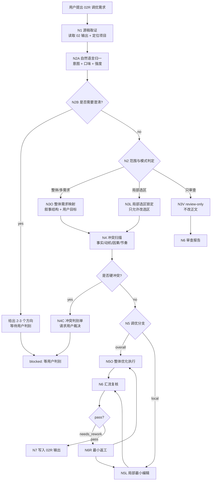
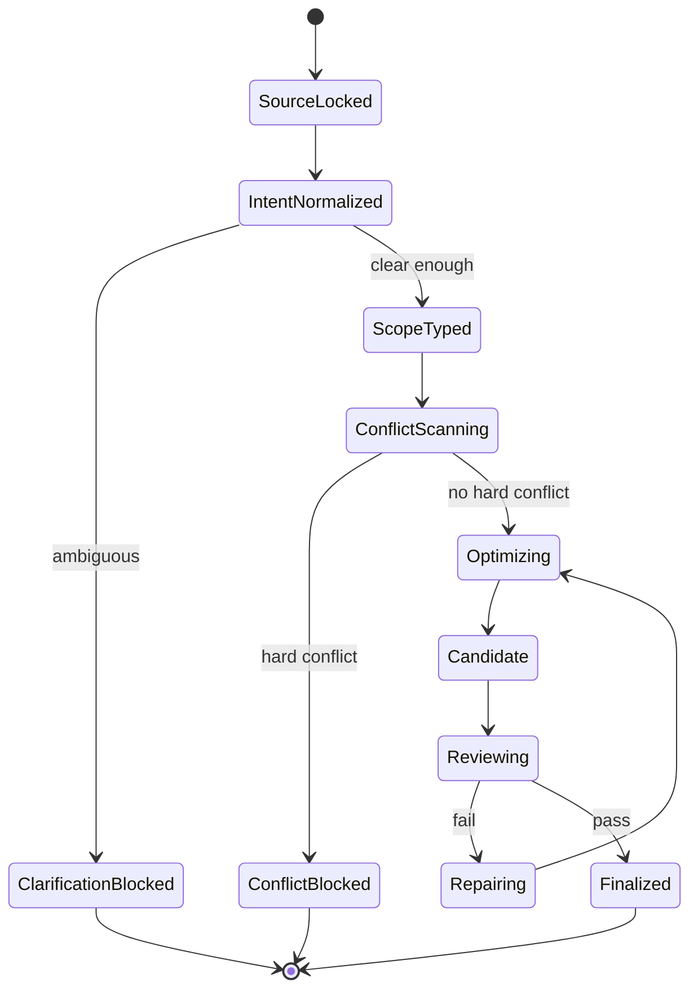
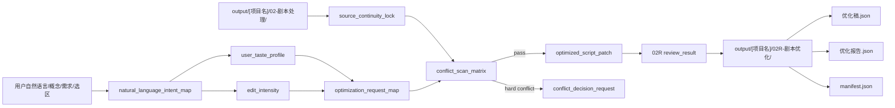
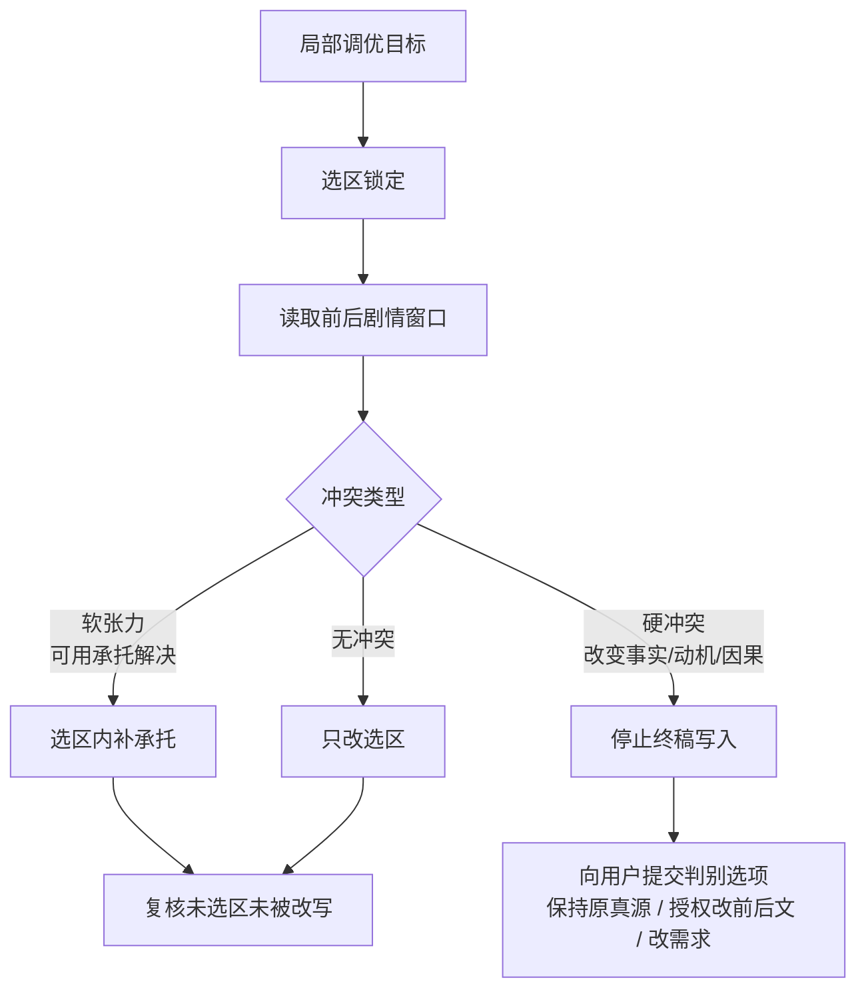

# 02R-剧本优化

`02R-剧本优化` 是 BYKJ AIGC 工作流中承接 `02-剧本处理` 输出产物的二次人工介入调优阶段。它不重新执行 `02-剧本处理`，而是在已有 `剧本处理稿.json`、`执行报告.json`、`manifest.json` 或用户指定片段的基础上，根据用户给出的概念、需求、局部目标或问题反馈进行最小必要优化。

canonical 输出目录固定为：

`output/[项目名]/02R-剧本优化/`

本阶段的核心原则：

- 整体调优：在满足基本叙事结构、人物动机、因果链和场景推进的前提下，最大程度满足用户需要。
- 局部调优：只调整用户选定部分；不得顺手重写未选区。
- 自然语言驱动：用户的口语化、模糊化、个人化表达必须先归一为可执行编辑变量、修改强度和临时偏好画像，再进入具体改稿。
- 冲突判别：当局部调优目标与前后剧情、人物状态、事实锁、对白锁或 `02-剧本处理` 真源冲突时，必须告知用户判别，不得擅自把冲突改写成终稿。
- LLM 主创：优化判断、剧本文字、导演/表演取舍必须由 LLM 直接完成；脚本只允许做读取、定位、diff、校验、manifest 回写等机械辅助。

## Context Loading Contract

- 每次调用 `$aigc-bykj-script-optimization`、`02R-剧本优化` 或本目录 `SKILL.md` 时，必须同时加载同目录 `CONTEXT.md`。
- 若本轮任务通过父级 `$aigc-bykj` 路由进入，必须先遵守父级 `SKILL.md + CONTEXT.md` 的阶段路由，再进入本阶段。
- 必须按需读取对应项目的 `output/[项目名]/02-剧本处理/` 产物；优先顺序为 `manifest.json`、`剧本处理稿.json`、`执行报告.json`、`episodes/`。
- 若用户绑定现有项目根，按需加载项目长期偏好、禁区、风格、人物/世界观材料；项目偏好不得覆盖用户本轮显式指令。
- 冲突优先级：用户显式请求 > 根 `AGENTS.md` > 父级 `aigc-bykj/SKILL.md` > `02R-剧本优化/SKILL.md` > `02-剧本处理/SKILL.md` > 项目级长期记忆/上下文 > 本 `CONTEXT.md` > `02-剧本处理/CONTEXT.md`。

## Business Requirement Analysis Contract

不得在未理解用户调优目标前直接改稿。执行前至少锁定：

| analysis_field | required judgment |
| --- | --- |
| `optimization_goal` | 用户想改善什么：概念落地、节奏、情绪、冲突、人物、对白交付、局部桥段、风格、可拍性或下游可用性 |
| `natural_language_intent` | 用户自然语言中的口味词、模糊词、情绪词、否定词和比较词分别指向哪些可执行编辑变量 |
| `optimization_scope` | `overall`、`concept_requirements`、`local_targeted`、`review_only`、`conflict_resolution` |
| `source_object` | 承接的 `02-剧本处理` 输出目录、单稿、集稿、场景、段落或用户粘贴片段 |
| `constraint_profile` | 对白是否锁定、事实是否锁定、是否允许增删桥段、是否允许改顺序、是否只允许局部编辑 |
| `clarification_need` | 用户需求是否模糊到会产生多种有效改法；若是，先给方向选择，不直接大改 |
| `user_taste_profile` | 本轮临时偏好画像：节奏、对白直白度、情绪强度、留白/解释比例、爽点/虐点/悬念偏好、禁用表达 |
| `edit_intensity` | `light_touch`、`medium_rework`、`heavy_rewrite`、`experimental_alt` 中哪一档被授权 |
| `narrative_risk` | 需求是否可能破坏前后因果、人物动机、信息释放、节奏、伏笔、结局或角色状态 |
| `success_criteria` | 优化后是否更符合用户需求，同时仍能被 `02-剧本处理` 的保真、可拍、可导、可演标准消费 |
| `step_strategy` | 默认使用混合型思行网络：先锁源和范围，再判型调优模式，中段执行整体或局部分支，后段统一冲突复核和写回 |

## Total Input Contract

Accepted input:

- 用户指定 `output/[项目名]/02-剧本处理/` 的完整输出，要求“优化剧本”“二次调优”“按这些要求改一下”。
- 用户粘贴一个概念、多个修改需求、局部片段、场景编号、章节/集号、对白段落或问题清单。
- 用户用个人自然语言提出调优，例如“更爽”“更高级”“这里不对味”“人物再狠一点”“情绪压住一点”“别这么直白”“留白更多”。
- 用户要求只 review 已有 `02-剧本处理` 输出，指出风险、冲突或可优化点。
- 用户要求在不改变整体剧情的前提下增强节奏、冲突、情绪、人物反应、导演可拍性或表演可演性。

Required input:

- 可读取的 `02-剧本处理` 输出，或用户粘贴的等价剧本处理稿片段。
- 可推断或声明的项目名。
- 明确或可推断的优化范围。

Reject or clarify when:

- 找不到 `02-剧本处理` 输出且用户也没有粘贴可优化文本。
- 用户要求局部改动，但目标选区无法定位。
- 用户只给出“优化一下”“更好看”“不对味”等低信息指令，且上下文无法唯一判定方向；此时先进入自然语言澄清门，给出 2-3 个候选方向。
- 用户要求局部改动且该目标与前后剧情硬冲突；此时进入 `conflict_resolution`，先输出冲突判别和用户选择项，不直接写终稿。
- 用户要求把二次优化变成重新改编小说、直接生成分集、资产、分镜、图像提示词或视频请求；这些应回到对应阶段。
- 用户要求脚本或模板代替 LLM 生成优化后的剧本正文。

## Mode Selection

| mode | trigger | editing policy | output behavior |
| --- | --- | --- | --- |
| `overall_tuning` | 用户要求整体优化、整体加强、整体按方向调一版 | 可跨场景调整节奏、承托、过渡和局部表达，但不得破坏基本叙事结构 | 输出完整优化稿、变更说明和复核报告 |
| `concept_requirements_tuning` | 用户给出一个概念或多条需求，未指定精确选区 | 先把需求映射到可执行编辑点，再只改必要位置 | 输出需求映射表、优化稿和未采纳原因 |
| `local_targeted_tuning` | 用户指定场景、段落、对白、字段或局部问题 | 只改选区；前后文只用于一致性检查，不主动重写 | 输出局部优化稿、替换片段和局部 diff 摘要 |
| `conflict_resolution` | 局部目标与前后剧情、事实锁或人物状态冲突 | 暂停终稿写入，生成冲突判别单和可选方案 | 等用户判别后再进入对应优化模式 |
| `review_only` | 用户只要求检查或指出优化建议 | 不改正文，只产出审查报告 | 输出 review verdict、fail code、建议优先级 |
| `repair_previous_02R` | 已有 `02R` 输出被指出问题 | 最小修复失败项，不重写无关内容 | 更新 `优化稿.json`、`优化报告.json`、`manifest.json` |

## Natural Language Driven Optimization Contract

用户个人自然语言是本阶段的一等输入，不得被简单当作“润色口味”。自然语言必须先通过 `intent normalization -> clarification gate -> taste profile -> intensity gate -> conflict map -> version comparison` 六步转译，再进入整体或局部改稿。

### Intent Normalization

| user phrase pattern | executable editing variables | risk check |
| --- | --- | --- |
| “更爽”“更燃”“更有爆点” | 冲突强度、兑现速度、反转密度、信息释放节奏、对手反应强度 | 不得新增未授权事件、能力、线索或结局 |
| “更高级”“别那么直白” | 减少解释、增加留白、用声音/空间/动作/道具承托主题 | 不得把关键因果藏到观众看不懂 |
| “人物更狠/更疯/更软/更冷” | 决策代价、行为策略、台词交付、身体反应、对手压力 | 检查人物前后状态和动机连续性 |
| “这段不对味”“不顺”“怪” | 先判定是节奏、动机、对白、情绪、信息差、风格或字段问题 | 不得在未定位问题时整体重写 |
| “情绪压住”“别煽情” | 降低情绪外放度、增加停顿/沉默/生理残留、减少解释句 | 不得削掉剧情必要情绪兑现 |
| “更细腻”“更有拉扯” | 增加策略变化、微动作、未说出口的信息、空间距离变化 | 不得拖慢用户要求的节奏 |
| “更短”“更快” | 压缩重复 beat、合并承托、加快信息释放、删冗余解释 | 不得删掉因果、动机或必要场景承接 |

`natural_language_intent_map` 必须记录：`raw_phrase / inferred_intent / editing_variable / confidence / risk / applied_status`。

### Ambiguity Clarification Gate

当自然语言需求低信息且存在多种有效改法时，不直接写终稿。默认给出 2-3 个方向让用户判别：

- `strong_conflict_version`：强化冲突、压迫、爽点和兑现。
- `subtle_emotion_version`：强化细腻情绪、留白、潜台词和余波。
- `rhythm_compression_version`：压缩拖沓、提高信息密度和转场效率。

若用户同时给出明确选区、明确风格、明确禁区和可判断的修改强度，可跳过澄清门，但必须在报告中说明跳过依据。

### Temporary Personal Taste Profile

自然语言调优必须建立本轮临时 `user_taste_profile`，但不得自动写入项目 `MEMORY.md`。只有用户明确说“记住”“以后都按这个”“这个项目统一这样”时，才按项目记忆规则写入项目根 `MEMORY.md`。

| profile_field | examples |
| --- | --- |
| `pace_preference` | 快节奏、慢压迫、先静后爆、密集反转 |
| `dialogue_directness` | 直给、克制、含蓄、锋利、少解释 |
| `emotion_intensity` | 压住、外放、冷、疯、狠、柔 |
| `subtext_ratio` | 多留白、多解释、半明半暗 |
| `payoff_preference` | 爽点、虐点、悬念、反高潮、低调兑现 |
| `forbidden_style` | 不要口号、不煽情、不鸡汤、不网感、不解释心理 |

### Edit Intensity Ladder

| intensity | allowed edits | requires explicit user authorization |
| --- | --- | --- |
| `light_touch` | 微调语气、节奏、动作承托、删少量解释，不改 beat | 否，模糊优化默认从此档开始 |
| `medium_rework` | 可重排局部 beat、加强承托、替换局部表达，不改事实和结局 | 用户需求能推断或用户明确允许 |
| `heavy_rewrite` | 大幅重写局部结构、增删桥段、改变信息释放顺序 | 是，必须明确授权 |
| `experimental_alt` | 生成备选版本，不覆盖原稿，可用于探索口味 | 是，输出为候选，不作为 canonical 替换 |

未授权时默认 `light_touch`；若用户说“大胆改”“重写这一段”“给我一个完全不同版本”，也只能升级到 `medium_rework` 或 `experimental_alt`，除非明确允许改变事实、顺序、对白或桥段。

### Natural Language Conflict Map

自然语言目标与剧情连续性冲突时按四类处理：

| conflict_type | handling |
| --- | --- |
| `selection_resolvable` | 可在选区内补承托解决，直接局部最小编辑 |
| `needs_prior_setup` | 需要改前文铺垫，进入 `N4C-CONFLICT` 请求范围升级 |
| `character_consistency_break` | 破坏人物状态、动机或关系连续性，进入 `N4C-CONFLICT` |
| `future_information_break` | 破坏后续信息释放、伏笔、悬念或结局，进入 `N4C-CONFLICT` |

### Version Comparison And Rollback

自然语言多轮调优必须保留可比较、可回退的表达：

- `original_excerpt_summary`：原段落功能摘要，不需要全文复制。
- `optimized_excerpt`：修改后段落或局部替换片段。
- `change_intent`：本次改动回应了哪条自然语言需求。
- `impact_scope`：影响选区、前后文、人物状态、信息释放或下游阶段的范围。
- `rollback_note`：若用户不喜欢，如何回到上一版或只撤销某类改动。

## Source Continuity Contract

`02R` 必须尊重 `02-剧本处理` 的单阶段真源：

- `02` 的事实、对白、人物关系、事件顺序、场景标题、章节/集划分标题默认继承为锁定真源。
- 除非用户明确授权非保真改写，`02R` 不改变结局、核心因果、人物关系结论、已给对白和关键线索。
- 用户授权的“整体调优”只表示可以优化表达、节奏、承托和局部结构，不等于允许自由重写剧情。
- 局部调优不得把未选区当作可编辑草稿；未选区只承担上下文校验和冲突检测。
- 对 `02` 中已存在的 fail code，应优先判定是继承问题还是本轮需求新增问题，避免把源层缺陷伪装成 `02R` 新失败。

## Topology Contract

本阶段采用混合型思行网络：`锁定源稿 -> 自然语言归一 -> 判定优化范围 -> 冲突扫描 -> 分支调优 -> 汇流复核 -> 写回`。其中整体调优和局部调优是互斥主分支，冲突判别可以阻断写回。



状态推进：



输入、证据和输出关系：



局部冲突路由：



## Thinking-Action Node Contract

每个节点必须同时完成判断、动作、证据和路由。节点不能只写“分析一下”。

| node_id | objective | actions | evidence | route_out | gate |
| --- | --- | --- | --- | --- | --- |
| `N1-SOURCE-LOCK` | 锁定项目名、`02` 输出、用户需求和输出目录 | 读取 `02` manifest/正文/报告，记录用户需求和授权边界 | `source_continuity_lock`、`input_lock` | `N2A-INTENT-NORMALIZE` | 源稿可读且 02R 输出目录明确 |
| `N2A-INTENT-NORMALIZE` | 将用户自然语言转成编辑变量 | 抽取口味词、模糊词、否定词、比较词，生成意图图谱、临时偏好画像和修改强度 | `natural_language_intent_map`、`user_taste_profile`、`edit_intensity` | `N2B-CLARIFY` 或 `N2-SCOPE-TYPE` | 自然语言已可执行，或明确需要澄清 |
| `N2B-CLARIFY` | 处理低信息或多解需求 | 给出 2-3 个候选调优方向，或要求用户选择强度/选区/禁区 | `clarification_options` | blocked 或 `N2-SCOPE-TYPE` | 需求不足时不得直接大改 |
| `N2-SCOPE-TYPE` | 判定整体、概念/多需求、局部、冲突或只审查模式 | 建立 `optimization_scope_profile`、`request_priority`、`selection_map` | `mode_profile`、`selection_locator` | `N3O`、`N3L`、`N3V` 或 `N4C` | 范围足以决定编辑权限 |
| `N3O-REQUIREMENT-MAP` | 把整体概念或多需求转成编辑点 | 拆解需求，映射到场景、字段、节奏、人物、冲突、导演/表演层 | `optimization_request_map` | `N4-CONFLICT-SCAN` | 每条需求都有采纳、转译或拒绝理由 |
| `N3L-SELECTION-LOCK` | 锁定局部选区和不可改区域 | 定位场景/段落/字段，读取前后剧情窗口，标出 edit boundary | `local_selection_lock`、`context_window_map` | `N4-CONFLICT-SCAN` | 选区明确且未选区只读 |
| `N3V-REVIEW-ONLY` | 只审查不改稿 | 按 Review Gate 和 Pass Table 生成问题清单、优先级和建议 | `review_only_result` | `N7-WRITEBACK` | 不产生正文改写 |
| `N4-CONFLICT-SCAN` | 判断用户目标与前后剧情是否冲突 | 检查事实锁、对白锁、人物状态、因果链、伏笔、信息释放和下游可用性 | `conflict_scan_matrix` | `N4C-CONFLICT` 或 `N5-OPTIMIZE` | 硬冲突不得进入终稿写回 |
| `N4C-CONFLICT` | 向用户提交判别选项 | 写明冲突点、影响范围、可选路径和推荐风险 | `conflict_decision_request` | blocked 或回 `N2-SCOPE-TYPE` | 用户未裁决前不得产出冲突终稿 |
| `N5O-OVERALL-OPTIMIZE` | 执行整体调优 | 在基本叙事结构内调整节奏、承托、场景转接、情绪递进、人物反应和可演性 | `overall_optimization_patch` | `N6-REVIEW` | 满足用户目标且不破坏叙事结构 |
| `N5L-LOCAL-OPTIMIZE` | 执行局部最小编辑 | 只改选区内文字或字段，必要时在选区内补承托 | `local_optimization_patch`、`local_diff_summary` | `N6-REVIEW` | 未选区未被改写 |
| `N6-REVIEW` | 汇流验收并定位最早责任节点 | 按五段式 Review Gate 和 Pass Table 检查候选稿 | `review_result` | `N6R-REPAIR` 或 `N7-WRITEBACK` | 阻断项清零 |
| `N6R-REPAIR` | 最小返工 | 只修 fail code 指向的问题，不顺手重写无关内容 | `repair_actions`、`review_again` | 回责任节点或 `N7-WRITEBACK` | 复审通过 |
| `N7-WRITEBACK` | 写入单一 02R 输出目录 | 生成/更新优化稿、报告、manifest；保留源稿回指 | `output_manifest` | complete | 输出齐备且路径正确 |

## Optimization Policies

### Overall Tuning Policy

整体调优必须同时满足：

- 基本叙事结构仍成立：开端/推进/转折/兑现或等价结构不能被需求打散。
- 因果链仍成立：新增承托只能解释或强化已有因果，不能偷偷新增关键原因。
- 人物动机仍成立：角色行为变化必须有前文压力、信息、关系或目标支撑。
- 用户需求最大化：在不破坏上面三项的前提下，优先满足用户的风格、节奏、情绪、概念和局部偏好。
- 不与下游冲突：优化稿仍能被 `03-智能分集`、`04-全局预设`、`05-资产提取` 和 `06-智能分镜` 消费。

### Concept / Multi-Requirement Policy

当用户给出概念或多条需求时：

1. 先通过 `N2A-INTENT-NORMALIZE` 把概念翻译成可执行编辑变量，例如节奏密度、信息释放、角色反应、冲突强度、台词交付、空间压力、道具承托、声音层次。
2. 对多需求建立优先级：用户明确排序 > 安全/真源约束 > 叙事结构 > 下游可用性 > 审美增强。
3. 对互相冲突的需求，不自行平均；必须在报告中标出取舍，必要时进入 `N4C-CONFLICT`。
4. 未采纳需求必须说明原因：越权、冲突、无选区、破坏叙事、超出阶段职责或需用户授权。

### Local Targeted Policy

局部调优必须遵守：

- 只改用户指定场景、段落、字段、对白段或片段。
- 前后剧情窗口只能用于一致性检查，不得主动改写。
- 可在选区内补一句或数句承托，使局部目标与前后文接上；不得越过选区扩写桥段。
- 若必须改前后文才能成立，视为硬冲突或范围升级请求，必须先告知用户判别。
- 对白默认锁定；除非用户明确要求改对白，不能改引号内文字。

### Conflict Decision Policy

硬冲突包括但不限于：

- 局部目标要求改变已锁定事实、事件结果、人物关系结论或关键线索。
- 局部目标要求角色做出与前后状态、动机、信息掌握明显矛盾的行为。
- 局部目标要求改变对白原文，但用户没有授权改对白。
- 局部目标要求提前释放、隐藏或删除影响后续剧情的信息。
- 选区内无法承托用户目标，必须改未选区才成立。

硬冲突输出固定为 `冲突判别单`，至少包含：

1. `冲突目标`
2. `冲突依据`
3. `影响范围`
4. `可选方案`
5. `推荐判别`
6. `等待用户裁决`

## Convergence Contract

候选优化稿只有同时满足以下条件才能写回：

- 已锁定 `02` 源稿和本轮用户需求。
- 已完成自然语言意图归一；若低信息多解，已进入澄清门而非直接改稿。
- 已明确模式、范围、选区和授权边界。
- 修改强度未超过用户授权；临时偏好画像只服务本轮，不自动写入项目记忆。
- 硬冲突已清零；存在硬冲突时只能输出冲突判别单。
- 整体调优保留基本叙事结构；局部调优未改写未选区。
- 所有用户需求都有 `accepted / transformed / rejected / conflict_blocked` 状态。
- `review_result.verdict` 为 `pass`；否则只能写入未完成或冲突状态，不得冒充终稿。

## Output Contract

### Required output

输出根目录固定为：

`output/[项目名]/02R-剧本优化/`

默认文件：

| output_id | path | purpose |
| --- | --- | --- |
| `OUTPUT-02R-MAIN` | `output/[项目名]/02R-剧本优化/优化稿.json` | 优化后的 canonical 正文或局部替换稿 |
| `OUTPUT-02R-REPORT` | `output/[项目名]/02R-剧本优化/优化报告.json` | 思考过程、需求映射、冲突判别、review、修复记录和风险 |
| `OUTPUT-02R-MANIFEST` | `output/[项目名]/02R-剧本优化/manifest.json` | 机械索引：输入、源稿、模式、范围、输出、状态 |
| `OUTPUT-02R-DIFF` | `output/[项目名]/02R-剧本优化/变更摘要.md` | 可选：局部或整体变更摘要，不替代正文 |

### Main draft structure

`优化稿.json` 至少包含：

1. frontmatter：`project_name`、`source_02_root`、`mode`、`scope`、`output_root`、`truth_policy`。
2. `# [项目名] 02R-剧本优化稿`
3. `## 优化范围`
4. `## 自然语言意图归一`
5. `## 优化正文` 或 `## 局部替换片段`
6. `## 版本对照与可回退说明`
7. `## 未改动范围说明`
8. 若进入冲突阻断，不输出伪终稿，只写 `## 冲突判别单`。

### Report structure

`优化报告.json` 必须至少包含：

1. `任务简报`
2. `思考过程`：简述业务分析、范围判型、为什么选择该调优分支、关键冲突和汇流依据；不得输出冗长原始推理草稿。
3. `02 源稿锁定`
4. `natural_language_intent_map`
5. `user_taste_profile`
6. `edit_intensity`
7. `optimization_request_map`
8. `selection_locator`
9. `conflict_scan_matrix`
10. `version_comparison`
11. `optimization_patch_summary`
12. `review_result`
13. `repair_actions`
14. `风险与例外`

### Manifest schema

`manifest.json` 必须是机械索引，不承载创作正文。

```yaml
project_name: ""
stage: "02R-剧本优化"
mode: "overall_tuning|concept_requirements_tuning|local_targeted_tuning|conflict_resolution|review_only|repair_previous_02R"
source_02_root: "output/[项目名]/02-剧本处理/"
source_items:
  - id: ""
    path: ""
    role: "main|report|manifest|episode|inline"
natural_language_intent:
  raw_phrases: []
  normalized_variables: []
  confidence: "high|medium|low"
  clarification_required: false
user_taste_profile:
  pace_preference: ""
  dialogue_directness: ""
  emotion_intensity: ""
  subtext_ratio: ""
  payoff_preference: ""
  forbidden_style: []
edit_intensity: "light_touch|medium_rework|heavy_rewrite|experimental_alt"
optimization_scope:
  type: "overall|local|review"
  locator: ""
output_root: "output/[项目名]/02R-剧本优化/"
outputs:
  main: "优化稿.json"
  report: "优化报告.json"
  diff_summary: "变更摘要.md"
status:
  verdict: "pass|needs_rework|clarification_blocked|conflict_blocked|blocked"
  fail_codes: []
  reviewed_at: ""
versioning:
  original_excerpt_summary: ""
  change_intent: ""
  impact_scope: ""
  rollback_note: ""
truth_policy:
  source_02_locked: true
  local_scope_locked: false
  dialogue_locked_by_default: true
  user_authorized_scope_expansion: false
```

## Boundary Guard

本阶段明确不做以下事情：

- 不重新执行 `02-剧本处理` 的小说到剧本完整投影；需要重做源稿时回 `02-剧本处理`。
- 不默认改写事实、对白、事件顺序、结局、人物关系或关键线索。
- 不把“更好看”“不对味”等自然语言直接当成大改授权。
- 不把本轮临时 `user_taste_profile` 自动写入项目记忆，除非用户明确要求长期记住。
- 不在局部调优中改写未选区。
- 不在硬冲突未获用户裁决时输出优化终稿。
- 不生成分集、全局预设、资产清单、分镜、图像提示词、视频提示词或 provider job。
- 不让脚本、模板或机械规则生成核心优化正文。

## SKILL.md Review Gate Configuration

本阶段所有核心合同都按五段式验收链执行：

`Review Question -> Review Gate -> Fail Code -> Rework Target -> Report Evidence`

| Review Question | Review Gate | Fail Code | Rework Target | Report Evidence |
| --- | --- | --- | --- | --- |
| 是否已读取或锁定可用的 `02-剧本处理` 源稿？ | 缺源稿且无粘贴片段则阻断 | `FAIL-02R-SOURCE` | `N1-SOURCE-LOCK` | `source_continuity_lock` |
| 项目名、输出目录和 02R canonical 路径是否明确？ | 缺任一项则阻断 | `FAIL-02R-OUTPUT-PATH` | `N1-SOURCE-LOCK` / `N7-WRITEBACK` | `output_manifest` |
| 用户自然语言是否已归一为可执行编辑变量？ | 未归一就直接改稿则返工 | `FAIL-02R-NL-INTENT` | `N2A-INTENT-NORMALIZE` | `natural_language_intent_map` |
| 低信息或多解需求是否已进入澄清门？ | 模糊需求直接大改则阻断 | `FAIL-02R-CLARIFICATION` | `N2B-CLARIFY` | `clarification_options` |
| 修改强度是否未超过用户授权？ | 未授权重写、增删桥段或覆盖原稿则阻断 | `FAIL-02R-INTENSITY` | `N2A-INTENT-NORMALIZE` / `N5O-OVERALL-OPTIMIZE` | `edit_intensity`、授权依据 |
| 临时用户偏好画像是否只服务本轮？ | 未经明确“记住”就写入项目记忆则阻断 | `FAIL-02R-TASTE-MEMORY` | `N2A-INTENT-NORMALIZE` | `user_taste_profile`、memory_write_authorization |
| 用户调优目标和范围是否已判型？ | 范围不清导致无法决定编辑权限则阻断 | `FAIL-02R-SCOPE` | `N2-SCOPE-TYPE` | `mode_profile`、`selection_locator` |
| 概念或多需求是否已转成可执行编辑点？ | 需求未映射就直接改稿则返工 | `FAIL-02R-REQUEST-MAP` | `N3O-REQUIREMENT-MAP` | `optimization_request_map` |
| 局部调优是否只改选区？ | 未授权改写未选区则阻断 | `FAIL-02R-LOCAL-SCOPE` | `N3L-SELECTION-LOCK` / `N5L-LOCAL-OPTIMIZE` | `local_selection_lock`、`local_diff_summary` |
| 局部目标是否与前后剧情或事实锁冲突？ | 硬冲突未告知用户则阻断 | `FAIL-02R-CONFLICT` | `N4C-CONFLICT` | `conflict_scan_matrix`、`conflict_decision_request` |
| 整体调优是否仍符合基本叙事结构？ | 因果、动机、信息释放或场景推进被破坏则返工 | `FAIL-02R-NARRATIVE` | `N5O-OVERALL-OPTIMIZE` | `narrative_integrity_check` |
| 用户需求是否被最大化满足且有取舍说明？ | 需求无状态、无采纳/拒绝理由则返工 | `FAIL-02R-USER-NEED` | `N3O-REQUIREMENT-MAP` / `N5O-OVERALL-OPTIMIZE` | `request_resolution_table` |
| 优化稿是否仍可拍、可导、可演？ | 回退成抽象说明、不可演心理或摄影越权则返工 | `FAIL-02R-PERFORMABILITY` | `N5O-OVERALL-OPTIMIZE` / `N5L-LOCAL-OPTIMIZE` | `performability_check` |
| 是否保留版本对照与可回退信息？ | 多轮自然语言调优无对照、无回退说明则返工 | `FAIL-02R-VERSIONING` | `N7-WRITEBACK` | `version_comparison`、`rollback_note` |
| 是否通过 review -> repair -> review-again 闭环？ | 阻断 fail code 未清零则不得写终稿 | `FAIL-02R-REVIEW` | `N6-REVIEW` / `N6R-REPAIR` | `review_result`、`repair_actions` |
| 报告是否包含思考过程、源稿锁定、冲突扫描和风险例外？ | 缺关键证据则返工 | `FAIL-02R-REPORT` | `N7-WRITEBACK` | `优化报告.json` |

## Pass Table

| pass_id | pass standard | fail code | rework entry |
| --- | --- | --- | --- |
| `PASS-02R-01` | `02` 源稿可读或用户已粘贴等价片段 | `FAIL-02R-SOURCE` | `N1-SOURCE-LOCK` |
| `PASS-02R-02` | 项目名和 `output/[项目名]/02R-剧本优化/` 路径明确 | `FAIL-02R-OUTPUT-PATH` | `N1-SOURCE-LOCK` / `N7-WRITEBACK` |
| `PASS-02R-03` | 自然语言需求已归一为可执行变量、临时偏好画像和修改强度 | `FAIL-02R-NL-INTENT` | `N2A-INTENT-NORMALIZE` |
| `PASS-02R-04` | 低信息或多解需求已澄清，或有跳过澄清门的证据 | `FAIL-02R-CLARIFICATION` | `N2B-CLARIFY` |
| `PASS-02R-05` | 修改强度未超过用户授权，临时偏好未越权写入长期记忆 | `FAIL-02R-INTENSITY` / `FAIL-02R-TASTE-MEMORY` | `N2A-INTENT-NORMALIZE` |
| `PASS-02R-06` | 模式、范围、选区和授权边界已锁定 | `FAIL-02R-SCOPE` | `N2-SCOPE-TYPE` |
| `PASS-02R-07` | 用户概念或多需求已映射为可执行编辑点并有优先级 | `FAIL-02R-REQUEST-MAP` | `N3O-REQUIREMENT-MAP` |
| `PASS-02R-08` | 局部调优只修改选区，未选区保持只读 | `FAIL-02R-LOCAL-SCOPE` | `N3L-SELECTION-LOCK` / `N5L-LOCAL-OPTIMIZE` |
| `PASS-02R-09` | 硬冲突已清零；未清零时已输出冲突判别单而非终稿 | `FAIL-02R-CONFLICT` | `N4C-CONFLICT` |
| `PASS-02R-10` | 整体调优不破坏基本叙事结构、因果链、人物动机和信息释放 | `FAIL-02R-NARRATIVE` | `N5O-OVERALL-OPTIMIZE` |
| `PASS-02R-11` | 优化结果最大程度满足用户需求，且取舍透明 | `FAIL-02R-USER-NEED` | `N3O-REQUIREMENT-MAP` / `N5O-OVERALL-OPTIMIZE` |
| `PASS-02R-12` | 优化稿仍可拍、可导、可演，并能被下游阶段消费 | `FAIL-02R-PERFORMABILITY` | `N5O-OVERALL-OPTIMIZE` / `N5L-LOCAL-OPTIMIZE` |
| `PASS-02R-13` | 版本对照、影响范围和可回退说明齐备 | `FAIL-02R-VERSIONING` | `N7-WRITEBACK` |
| `PASS-02R-14` | review/repair/review-again 闭环完成，阻断项清零 | `FAIL-02R-REVIEW` | `N6-REVIEW` |
| `PASS-02R-15` | `优化稿.json`、`优化报告.json`、`manifest.json` 齐备且报告证据完整 | `FAIL-02R-REPORT` | `N7-WRITEBACK` |

## Root-Cause Execution Contract

当 `02R` 输出失败时，必须按以下链路上溯：

`Symptom -> Direct Cause -> Responsible Node -> Source Stage / Boundary Rule -> AGENTS.md / LLM-first Rule`

常见归因：

- 找不到或误读 `02` 源稿：回 `N1-SOURCE-LOCK`。
- 用户自然语言没被吃透：回 `N2A-INTENT-NORMALIZE` 或 `N2B-CLARIFY`。
- 用户需求没被吃透：回 `N2-SCOPE-TYPE` 或 `N3O-REQUIREMENT-MAP`。
- 修改强度越权：回 `Edit Intensity Ladder` 和 `N2A-INTENT-NORMALIZE`。
- 临时偏好被误写入长期记忆：回 `Temporary Personal Taste Profile` 和项目记忆规则。
- 局部改动污染未选区：回 `N3L-SELECTION-LOCK` 和 `N5L-LOCAL-OPTIMIZE`。
- 局部目标与前后剧情冲突却直接改稿：回 `N4C-CONFLICT`，输出冲突判别单。
- 整体调优变成自由重写：回 `Source Continuity Contract` 和 `N5O-OVERALL-OPTIMIZE`。
- 优化稿不可拍、不可导、不可演：回 `N5O/N5L`，消费 `02-剧本处理` 的编剧、导演、表演标准。
- 脚本生成核心优化正文：回本合同和根 `AGENTS.md` 的 LLM-first 主创规则，撤回脚本主创结果。

## Completion Definition

本阶段完成必须同时满足：

- 已加载本 `SKILL.md + CONTEXT.md`。
- 已锁定 `02-剧本处理` 源稿或用户粘贴的等价片段。
- 已完成业务需求分析、自然语言意图归一、范围判型、冲突扫描和输出路径锁定。
- 低信息或多解需求已澄清；若未澄清，只能输出澄清选项。
- 修改强度、临时偏好画像、版本对照和可回退说明已记录。
- 整体调优保留基本叙事结构；局部调优未改写未选区。
- 若存在硬冲突，已输出 `冲突判别单` 并停止终稿写回。
- `优化报告.json` 包含 `思考过程`、需求映射、冲突扫描、review verdict、修复记录和风险例外。
- 所有阻断型 fail code 已清零；未清零时不得声明完成。
- 输出全部位于 `output/[项目名]/02R-剧本优化/`。
