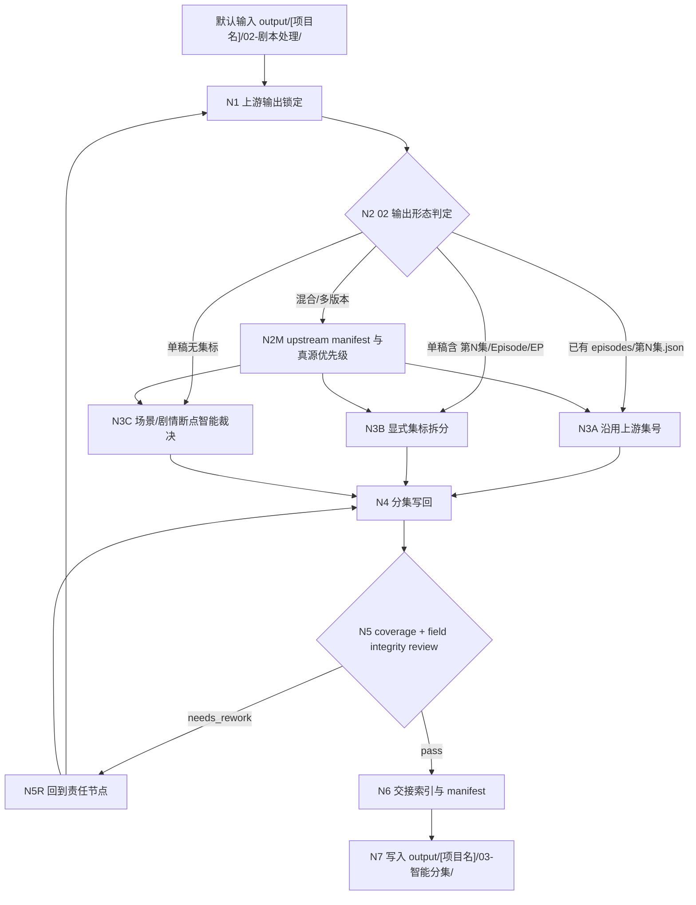
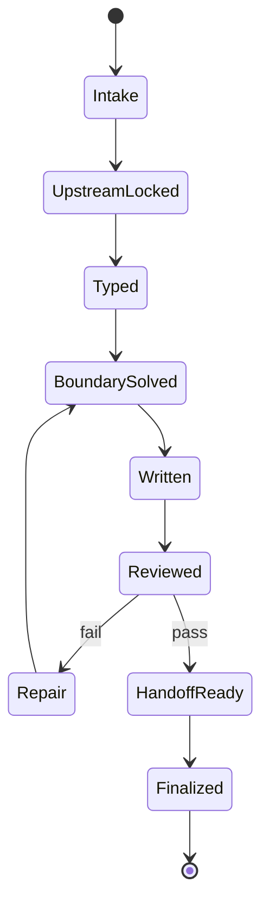
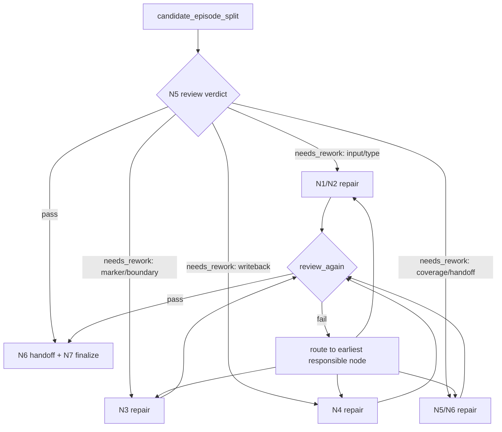

# 03-智能分集

`03-智能分集` 是 BYKJ AIGC 工作流的整合型单阶段 skill。它把原 `aigc/1-分集` 的源锁定、集标判定、边界裁决、覆盖审计和交接 manifest 能力收束到一个 `SKILL.md` 中，但业务对象已经从“小说原文”改为上游 `02-剧本处理` 的处理后剧本。

默认输入目录：

`output/[项目名]/02-剧本处理/`

唯一 canonical 输出目录：

`output/[项目名]/03-智能分集/`

本阶段不读取 `projects/aigc/<项目名>/源/` 作为默认正文真源，不写回 `projects/aigc/<项目名>/1-分集/`，也不把原 `aigc/1-分集` 的小说原文路径、章节一集误判或 runtime 输出规则带入 BYKJ `03`。

## Context Loading Contract

- 每次调用 `$aigc-bykj-episode-split`、`03-智能分集` 或本目录 `SKILL.md` 时，必须同时加载同目录 `CONTEXT.md`。
- 若本轮任务通过父级 `$aigc-bykj` 路由进入，必须先遵守父级 `SKILL.md + CONTEXT.md` 的阶段路由，再进入本阶段。
- 若项目已存在 `output/[项目名]/02-剧本处理/`，优先加载其中的 `manifest.json`、`剧本处理稿.json`、`episodes/第N集.json` 和 `执行报告.json`。
- 冲突优先级：用户显式请求 > 根 `AGENTS.md` > 父级 `aigc-bykj/SKILL.md` > 本 `SKILL.md` > 上游 `02-剧本处理` 输出 > 本 `CONTEXT.md` > 来源技能追溯材料。
- 核心分集边界判断必须由 LLM 直接完成；脚本只允许承担读取、排序、字数统计、覆盖校验、manifest 回写等机械辅助。

## Source Capability Integration

| source skill | 本阶段吸收的核心能力 | 本阶段不继承的运行时形态 |
| --- | --- | --- |
| `aigc/1-分集` | 输入真源锁定、可读文本扫描、集标识别、P1/P2/P3 边界策略、连续编号、覆盖审计、执行报告和 manifest 交接 | 不读取 `projects/aigc/<项目名>/源/` 为默认输入，不写 `projects/aigc/<项目名>/1-分集/第N集.md` |
| `aigc/1-分集/references/input-output-contract.md` | `第N集`/Episode/EP 为强集标，`第N章`/chapter/卷章节只做候选边界；分集报告必须可复查 | 不把“小说原文不得改写”机械等同于“剧本处理稿不能拆分为下游集稿”；本阶段保真对象是 `02` 处理后剧本 |
| `aigc/1-分集/steps/episode-split-workflow.md` | `source lock -> source order -> episode mark scan -> boundary solve -> writeback -> review` 思行网络 | 不沿用小说源排序规则作为唯一排序；优先消费 `02` manifest、剧本场景序、上游 episodes 顺序 |
| `aigc/1-分集/review/review-contract.md` | gate/fail/rework/evidence 五段式验收链 | fail code 改为 `FAIL-03-*`，返工节点改为 BYKJ `03` 本阶段节点 |

整合原则：

- `03` 的真源是 `02` 的处理后剧本，而不是小说原文、项目设定、父级路由文档或旧 AIGC runtime。
- 若 `02` 已有 `episodes/第N集.json`，默认沿用上游集号和边界，只做校验、索引和交接增强；不得按字数重切。
- 若 `02` 只有单个 `剧本处理稿.json`，先按原有 `第N集`、场景、章节、剧情转折和剧本字段完整性生成候选边界，再裁决为下游可消费的集稿。
- 分集不是改写剧本；不得重写对白、删减事实、补剧情、改场景顺序或生成分镜/资产/全局预设。
- 输出必须为下游 `04-全局预设`、`05-资产提取`、`06-智能分镜` 提供稳定集号、来源范围、场景范围、角色/场景/道具提示和风险标记。

## Reference Loading Guide

本阶段以单一 `SKILL.md` 为执行真源。来源技能的关键规则已经内化到 `Integrated Source Essence Bank`；只有遇到争议、需要查原始措辞、或 fail code 无法裁决时，才按下表读取原技能文件。

| need | traceback source | how to consume |
| --- | --- | --- |
| `aigc/1-分集` 原始输入输出规则 | `.agents/skills/aigc/1-分集/SKILL.md`、`references/input-output-contract.md` | 只消费源锁定、集标、边界、覆盖和报告规则，不继承旧输出路径 |
| 分集节点与回退拓扑 | `.agents/skills/aigc/1-分集/steps/episode-split-workflow.md` | 映射为本阶段 `N1` 到 `N7` 节点 |
| 集标类型判定 | `.agents/skills/aigc/1-分集/types/source-type-map.md` | 改写为 `02` 剧本类型画像：`upstream_episode`、`script_with_episode_marks`、`script_scene_sequence`、`mixed_02_output`、`blocked_02_output` |
| 分集审查问题 | `.agents/skills/aigc/1-分集/review/review-contract.md` | 改成 `FAIL-03-*` 并回接本阶段 review gate |
| 上游剧本处理字段与保真边界 | `.agents/skills/aigc-bykj/02-剧本处理/SKILL.md` | 用于确认 `02` 正文结构、字段完整性、可改/不可改边界 |

动态加载规则：

- 默认不预加载原 `aigc/1-分集` 的全部分区；本 `SKILL.md` 足以执行常规 BYKJ `03`。
- 上游 `02` 输出是强输入，不是参考资料；必须读取其 manifest 和正文索引。
- 原技能 `CONTEXT.md` 只用于识别失效模式，不允许覆盖本阶段输入对象和输出路径。

## Integrated Source Essence Bank

本节是原复杂多层级分集能力的单文档压缩层。执行 `03-智能分集` 时，优先按本节判断。

### A. 输入与真源精华

| essence_id | source essence | BYKJ-03 execution rule | blocking failure |
| --- | --- | --- | --- |
| `ESS-03-UPSTREAM-LOCK` | 分集前必须锁定唯一正文真源 | 默认输入是 `output/[项目名]/02-剧本处理/`；按 `manifest.json -> episodes/ -> 剧本处理稿.json -> 执行报告.json` 建立上游锁 | 读取小说源、项目设定或旧 runtime 替代 `02` 输出 |
| `ESS-03-READABLE-SCRIPT` | 只处理可审阅文本 | 只消费 `.md`、`.txt`、可抽取文本和 `manifest.json`；图片、视频、二进制必须先转文本 | 无可读 `02` 正文仍伪造分集 |
| `ESS-03-UPSTREAM-ORDER` | 多文件必须稳定排序 | 优先 `02` manifest outputs 顺序，其次 `episodes/第N集.json` 集号，其次 `剧本处理稿.json` 内标题/场景顺序 | 依赖文件系统随机顺序 |
| `ESS-03-PROCESSED-SCRIPT-FIDELITY` | 分集不改写内容真源 | 保留 `02` 已生成剧本字段、对白、场景顺序和事实；只新增集级 frontmatter、摘要、边界表和下游提示 | 重写对白、压缩剧情、改场景顺序 |

### B. 集标与边界精华

| essence_id | source essence | BYKJ-03 execution rule | evidence |
| --- | --- | --- | --- |
| `ESS-03-P1-UPSTREAM-EPISODE` | 原资料自带集数划分优先 | 若 `02/episodes/第N集.json` 存在，或正文内有稳定 `第N集`/Episode/EP，直接作为 P1 边界 | `episode_marker_map` |
| `ESS-03-CHAPTER-NOT-EPISODE` | 章节不是集数 | `第N章`、Chapter、卷章节、原小说标题只作为 P2 候选；不得机械一章一集 | `excluded_marker_map` |
| `ESS-03-SCENE-INTEGRITY` | 剧本场景块不可硬切 | 不在一个 `### 场景N`、对白轮次、长对白节拍或连续动作链中间断集 | `scene_integrity_check` |
| `ESS-03-NATURAL-BOUNDARY` | 无 P1 时用自然结构和戏剧断点 | 候选边界优先落在场景转出、冲突遗产、信息释放、时间/空间切换、终结画面或强悬念点 | `boundary_decision_table` |
| `ESS-03-LENGTH-WINDOW` | 字数窗是节奏约束，不是机械刀口 | 默认每集约 `2500-3000` 中文字剧本正文；因完整场景、强断点或用户指定时长可偏离并记录理由 | `episode_length_table` |
| `ESS-03-COVERAGE` | 所有上游正文都必须覆盖或说明跳过 | 每个上游场景/片段只能归属一个输出集；未覆盖、重复覆盖和跳过都必须记录 | `coverage_map` |

### C. 下游交接精华

| essence_id | source essence | BYKJ-03 execution rule | evidence |
| --- | --- | --- | --- |
| `ESS-03-HANDOFF` | 分集输出要服务下游阶段 | 每集补齐来源范围、场景范围、主要角色、主要场景、主要道具、情绪/视觉钩子和风险 | `handoff_index` |
| `ESS-03-REPORT-FIRST` | 分集必须可复查 | `执行报告.json` 必须记录思考过程、输入锁、集标、边界、字数、coverage、fail code 和返工入口 | `review_result` |
| `ESS-03-MANIFEST` | manifest 是机械索引 | `manifest.json` 记录输入、输出、状态、集号、来源范围；不承载创作正文 | `output_manifest` |
| `ESS-03-ONE-CANONICAL` | BYKJ `03` 只有一个 canonical 输出目录 | 只写 `output/[项目名]/03-智能分集/` | `output_root` |

## Business Requirement Analysis Contract

执行前必须先完成业务需求分析，不得直接套用小说分集模板。

| analysis_field | required judgment |
| --- | --- |
| `business_goal` | 用户要把 `02-剧本处理` 的处理后剧本拆成什么集级交付物 |
| `business_object` | 输入是 `02` 的单稿、上游 episodes、多文件输出、修复稿还是混合输出 |
| `constraint_profile` | 是否沿用上游集号、是否允许重切、目标字数/时长、下游阶段需求、覆盖风险 |
| `success_criteria` | 每集边界自然、剧本字段完整、上游正文全覆盖、输出可供 `04/05/06` 消费 |
| `topology_fit` | 复杂度主要来自上游输出判型、集标保护、剧本场景完整性、边界裁决和覆盖复审 |
| `step_strategy` | 默认使用混合型思行网络：前段锁定 `02` 输出，中段集标/边界分支，后段写回与 coverage 汇流 |

若项目名无法从用户请求、`02` 输出路径、`02` manifest 或正文标题推断，使用输入目录 basename；仍无法推断时使用 `未命名项目-YYYYMMDD-HHMM`，并在 `执行报告.json` 记录推断依据。

## Total Input Contract

Accepted input:

- 默认输入：`output/[项目名]/02-剧本处理/`。
- 用户显式指定某个 `02-剧本处理` 输出目录、`剧本处理稿.json`、`episodes/第N集.json`、`manifest.json` 或等价处理后剧本文件。
- 已有 `output/[项目名]/03-智能分集/` 输出，用户要求 review、repair、续跑或重切。

Required input:

- 可读取的 `02` 处理后剧本文本，至少包含 `剧本处理稿.json` 或 `episodes/` 中的逐集稿。
- 可推断或可声明的项目名。
- 输出根目录默认固定为 `output/[项目名]/03-智能分集/`。

Optional input:

- 目标集数、每集字数/时长、平台节奏、是否强制沿用上游集号、是否允许重切、下游阶段偏好。
- 用户指定的风险禁区、角色/世界观长期约束、需要优先保留的场景或尾钩。

Reject or clarify when:

- 找不到可读 `02` 输出，且用户没有提供处理后剧本文本。
- 用户要求从小说原文直接分集；应先路由到 `02-剧本处理` 或明确本轮只做旧 `aigc/1-分集`，不得伪装 BYKJ `03`。
- 用户要求在本阶段改写对白、重编剧情、补导演/表演正文或生成分镜/资产/全局预设。
- 目标目录已有正式产物，但无法判断本轮是覆盖、续跑、review 还是 repair。

## Mode Selection

| mode | trigger | output behavior |
| --- | --- | --- |
| `upstream_episode_passthrough` | `02/episodes/第N集.json` 已存在且边界可信 | 沿用上游集号，生成/刷新 `分集总表.md`、report、manifest 和必要 handoff 字段 |
| `explicit_episode_split` | `剧本处理稿.json` 内存在稳定 `第N集`、Episode、EP 集标 | 按原集标拆为 `episodes/第N集.json` |
| `script_scene_split` | 只有单稿，缺少 P1 集标 | 按场景、剧情转折、冲突遗产、终结画面和 `2500-3000` 字目标窗裁决 |
| `mixed_02_output` | 输入含单稿、episodes、report、manifest 或多个版本 | 先建立 `upstream_manifest` 和真源优先级，再分集 |
| `review_only` | 用户只要求检查已有 `03-智能分集` 输出 | 只写或更新 `执行报告.json`，不改集稿 |
| `repair` | 已有输出存在漏覆盖、重复覆盖、编号断裂、边界不自然或路径漂移 | 最小修复对应集稿、总表、report 或 manifest |

## Topology Contract

本阶段采用混合型思行网络：`02 输出锁定 -> 类型判定 -> 集标/边界裁决 -> 分集写回 -> 覆盖复审 -> 交接收束`。前段按上游输出形态分支，后段必须统一汇流到一个 canonical 输出目录。






## Thinking-Action Node Contract

每个节点必须同时完成判断、动作、证据和路由。

| node_id | objective | actions | evidence | route_out | gate |
| --- | --- | --- | --- | --- | --- |
| `N1-UPSTREAM-LOCK` | 锁定 `02` 输出和项目名 | 读取 `manifest.json`、`剧本处理稿.json`、`episodes/`、report；记录输出根和真源优先级 | `upstream_lock`、`project_name_basis` | `N2-TYPE` | 有可读 `02` 处理后剧本 |
| `N2-TYPE` | 判定上游输出形态 | 建立 `upstream_type_profile`、文件顺序、集标/章节/场景信号 | `upstream_manifest`、`type_profile` | `N3A/N3B/N3C` | 类型足以决定分集路线 |
| `N3A-PASSTHROUGH` | 沿用上游 episodes | 校验集号、顺序、覆盖、字段完整性，补下游交接字段 | `episode_passthrough_map` | `N4-WRITEBACK` | 上游 episodes 可信 |
| `N3B-EXPLICIT-MARK` | 按显式集标拆分 | 从单稿内提取 `第N集`/Episode/EP 边界，保留原边界 | `episode_marker_map` | `N4-WRITEBACK` | P1 集标稳定且覆盖完整 |
| `N3C-BOUNDARY-SOLVE` | 无集标时智能裁决边界 | 按场景完整性、冲突遗产、时间/空间切换、终结画面和字数窗裁决 | `boundary_decision_table` | `N4-WRITEBACK` | 不切断场景/对白/动作链 |
| `N4-WRITEBACK` | 写入分集产物 | 生成 `episodes/第N集.json`、`分集总表.md` 的候选稿 | `output_file_map` | `N5-REVIEW` | 编号连续、路径正确 |
| `N5-REVIEW` | 覆盖、保真和下游可用性复审 | 检查 coverage、重复/遗漏、字段完整性、集稿可消费性 | `coverage_map`、`review_result` | `N5R-REPAIR` 或 `N6-HANDOFF` | 阻断项清零 |
| `N5R-REPAIR` | 最小修复 | 只修 fail code 指向的问题，不改无关内容 | `repair_actions`、`review_again` | 回到责任节点 | 复审通过 |
| `N6-HANDOFF` | 生成下游交接索引 | 为每集建立角色、场景、道具、情绪钩子、风险和下游建议 | `handoff_index` | `N7-FINALIZE` | 下游 `04/05/06` 能消费 |
| `N7-FINALIZE` | 写入最终目录和 manifest | 写 `执行报告.json`、`manifest.json`，确认完成定义 | `output_manifest` | complete | 输出齐备且路径唯一 |

## Boundary Decision Rules

- P1 强边界：`02/episodes/第N集.json`、正文中稳定 `第N集`、`Episode N`、`EP N`、用户显式集数范围。
- P2 候选边界：`第N章`、Chapter、卷章节、场景组、时间/空间变化、冲突遗产、信息释放、终结画面、强悬念点。
- P3 节奏边界：无 P1/P2 足够信号时，默认每集约 `2500-3000` 中文字剧本正文，边界必须落在自然段、场景结束或动作链闭合处。
- 禁止边界：单个场景标题和其字段块中间、对白引号中间、长对白节拍中间、连续动作链中间、上游明确声明不可拆的段落中间。
- 若用户目标集数与自然边界冲突，优先保持剧本完整性；在报告中说明无法精准满足的原因。

## Output Contract

### Required output

输出根目录固定为：

`output/[项目名]/03-智能分集/`

默认文件：

| output_id | path | purpose |
| --- | --- | --- |
| `OUTPUT-03-INDEX` | `output/[项目名]/03-智能分集/分集总表.md` | 全部分集边界、来源范围、字数、下游交接索引 |
| `OUTPUT-03-REPORT` | `output/[项目名]/03-智能分集/执行报告.json` | 思考过程、输入锁、边界裁决、coverage、review、修复和风险 |
| `OUTPUT-03-MANIFEST` | `output/[项目名]/03-智能分集/manifest.json` | 机械索引：输入、输出、集号、状态、fail code |
| `OUTPUT-03-EPISODE` | `output/[项目名]/03-智能分集/episodes/第N集.json` | 每集处理后剧本切片与集级交接字段 |

目录结构：

```text
output/[项目名]/03-智能分集/
├── 分集总表.md
├── 执行报告.json
├── manifest.json
└── episodes/
    ├── 第1集.md
    └── 第N集.md
```

### Episode file structure

每个 `episodes/第N集.json` 必须至少包含：

1. frontmatter：`project_name`、`stage`、`episode_number`、`source_stage`、`source_range`、`split_mode`、`char_count`、`boundary_reason`。
2. `# 第N集`
3. `## 集级简表`：来源范围、主要场景、主要角色、主要道具、情绪/视觉钩子、下游风险。
4. `## 剧本正文`：从 `02` 保真切出的处理后剧本内容；不得重写对白、场景顺序和事实。
5. `## 下游交接`：给 `04/05/06` 的集级提示，只能来自本集正文，不新增剧情事实。

### Index structure

`分集总表.md` 必须至少包含：

- `任务简报`
- `输入来源`
- `分集策略`
- `分集边界表`
- `coverage_map`
- `handoff_index`
- `风险与例外`

### Report structure

`执行报告.json` 必须至少包含：

1. `任务简报`
2. `思考过程`：简述业务分析、上游输出判型、为何选择当前分集路线、关键边界和汇流取舍；不得输出冗长原始推理草稿。
3. `输入与真源锁定`
4. `episode_marker_map`
5. `boundary_decision_table`
6. `coverage_map`
7. `field_integrity_check`
8. `review_result`
9. `repair_actions`
10. `风险与例外`

### Manifest schema

`manifest.json` 必须是机械索引，不承载创作正文。

```yaml
project_name: ""
stage: "03-智能分集"
source_stage: "02-剧本处理"
mode: ""
input_root: "output/[项目名]/02-剧本处理/"
output_root: "output/[项目名]/03-智能分集/"
source_items:
  - id: ""
    path: ""
    type: ""
    priority: 1
episodes:
  - episode_number: 1
    path: "episodes/第1集.md"
    source_range: ""
    char_count: 0
    boundary_reason: ""
outputs:
  index: "分集总表.md"
  report: "执行报告.json"
  manifest: "manifest.json"
status:
  verdict: "pass|needs_rework|blocked"
  fail_codes: []
  reviewed_at: ""
```

## Stage-End Review-Repair Contract

每次生成候选分集后，必须在本阶段内部完成 review -> repair -> review-again 闭环。

1. `N4-WRITEBACK` 产物先视为 `candidate_episode_split`，不是终稿。
2. `N5-REVIEW` 按 `SKILL.md Review Gate Configuration` 和 `Pass Table` 逐项检查。
3. 若 verdict 为 `needs_rework`，必须执行 `N5R-REPAIR`，并定位最早责任节点：
   - 输入路径、项目名、上游输出缺失：回 `N1-UPSTREAM-LOCK`。
   - 上游类型、排序、集标误判：回 `N2-TYPE`。
   - P1 上游 episodes 或显式集标处理错误：回 `N3A/N3B`。
   - 无集标边界不自然、字数窗失衡、切断场景/对白：回 `N3C-BOUNDARY-SOLVE`。
   - 输出路径、编号、文件缺失：回 `N4-WRITEBACK`。
   - coverage、handoff、manifest 缺失：回 `N5/N6/N7`。
4. 修复只处理 fail code 指向的问题；不得借修复机会改写上游剧本正文。
5. 修复后必须执行 `review_again`；复审仍失败时继续最小修复循环，或在输入缺失、规则冲突、权限不可用时输出不可用说明。



## Boundary Guard

本阶段明确不做以下事情：

- 不从小说原文直接生成 BYKJ `03` 分集；缺 `02` 输出时应先进入 `02-剧本处理`。
- 不写回 `projects/aigc/<项目名>/1-分集/`。
- 不生成或修改 `02-剧本处理` 正文。
- 不新增剧情、对白、因果、角色动机、场景顺序或结局。
- 不生成全局预设、资产清单、分镜、镜头、图像提示词、视频提示词或 provider job。
- 不让脚本、模板或机械规则替代 LLM 边界裁决。

## SKILL.md Review Gate Configuration

本阶段所有核心合同都按五段式验收链执行：

`Review Question -> Review Gate -> Fail Code -> Rework Target -> Report Evidence`

| Review Question | Review Gate | Fail Code | Rework Target | Report Evidence |
| --- | --- | --- | --- | --- |
| 是否锁定 `output/[项目名]/02-剧本处理/` 或用户显式指定的处理后剧本为唯一上游真源？ | 缺可读 `02` 输出或误读小说源则阻断 | `FAIL-03-UPSTREAM-LOCK` | `N1-UPSTREAM-LOCK` | `upstream_lock`、`input_root` |
| 项目名和 `output/[项目名]/03-智能分集/` 是否明确？ | 缺项目名或路径漂移则阻断 | `FAIL-03-PROJECT-PATH` | `N1-UPSTREAM-LOCK` / `N7-FINALIZE` | `project_name_basis`、`output_manifest` |
| 是否正确判定 `02` 输出形态并建立稳定排序？ | 类型不明、排序不可复查则阻断 | `FAIL-03-TYPE-ORDER` | `N2-TYPE` | `type_profile`、`upstream_manifest` |
| `02` 已有 episodes 或显式 `第N集` 时，是否沿用上游边界且未按字数重切？ | 忽略 P1 上游集标则阻断 | `FAIL-03-P1-EPISODE` | `N3A-PASSTHROUGH` / `N3B-EXPLICIT-MARK` | `episode_marker_map` |
| `第N章`、Chapter、卷章节是否只作为候选边界，没有被机械当作一集？ | 章节一集误判则阻断 | `FAIL-03-CHAPTER-AS-EPISODE` | `N2-TYPE` / `N3C-BOUNDARY-SOLVE` | `excluded_marker_map`、`boundary_decision_table` |
| 无 P1 集标时，边界是否不切断场景、对白、长对白节拍和动作链？ | 任意硬切则阻断 | `FAIL-03-SCENE-INTEGRITY` | `N3C-BOUNDARY-SOLVE` | `scene_integrity_check` |
| 分集是否覆盖所有上游正文，且无重复覆盖？ | 漏覆盖或重复覆盖则阻断 | `FAIL-03-COVERAGE` | `N5-REVIEW` | `coverage_map` |
| 每集是否保留 `02` 剧本字段、事实、对白和场景顺序？ | 改写、删减、重排则阻断 | `FAIL-03-FIDELITY` | `N4-WRITEBACK` | `field_integrity_check`、抽样回指 |
| 输出是否只落到 `output/[项目名]/03-智能分集/` 且文件齐备？ | 路径漂移或文件缺失则阻断 | `FAIL-03-OUTPUT-PATH` | `N7-FINALIZE` | `output_file_map`、`output_manifest` |
| `执行报告.json` 是否包含思考过程、边界表、coverage、review 和返工入口？ | 报告不可复查则返工 | `FAIL-03-REPORT` | `N5-REVIEW` / `N7-FINALIZE` | `review_result`、`repair_actions` |
| 是否生成可供 `04/05/06` 消费的集级 handoff？ | 缺角色/场景/道具/风险交接则返工 | `FAIL-03-HANDOFF` | `N6-HANDOFF` | `handoff_index` |

## Pass Table

| pass_id | pass standard | fail code | rework entry |
| --- | --- | --- | --- |
| `PASS-03-01` | 可读 `02` 输出、项目名和输入根明确 | `FAIL-03-UPSTREAM-LOCK` | `N1-UPSTREAM-LOCK` |
| `PASS-03-02` | 输出根固定为 `output/[项目名]/03-智能分集/` | `FAIL-03-PROJECT-PATH` | `N1` / `N7` |
| `PASS-03-03` | 上游输出类型和排序可复查 | `FAIL-03-TYPE-ORDER` | `N2-TYPE` |
| `PASS-03-04` | P1 上游集标得到尊重 | `FAIL-03-P1-EPISODE` | `N3A/N3B` |
| `PASS-03-05` | 章节/场景只作为候选，未机械一章一集 | `FAIL-03-CHAPTER-AS-EPISODE` | `N3C` |
| `PASS-03-06` | 边界自然且不切断场景、对白或动作链 | `FAIL-03-SCENE-INTEGRITY` | `N3C` |
| `PASS-03-07` | 上游正文覆盖完整且无重复覆盖 | `FAIL-03-COVERAGE` | `N5-REVIEW` |
| `PASS-03-08` | 集稿保留 `02` 剧本事实、字段、对白和顺序 | `FAIL-03-FIDELITY` | `N4-WRITEBACK` |
| `PASS-03-09` | 分集总表、episodes、执行报告、manifest 齐备 | `FAIL-03-OUTPUT-PATH` | `N7-FINALIZE` |
| `PASS-03-10` | 报告和 handoff 足以支撑下游阶段 | `FAIL-03-REPORT` / `FAIL-03-HANDOFF` | `N6/N7` |

## Root-Cause Execution Contract

当输出失败时，必须按以下链路上溯：

`Symptom -> Direct Cause -> Responsible Node -> Source Capability Layer -> AGENTS.md / LLM-first Rule`

常见归因：

- 缺 `02` 输出仍分集：回 `N1-UPSTREAM-LOCK`，不得跳过上游阶段。
- 沿用小说源路径：回本合同和父级 BYKJ 路由，撤回旧 `aigc/1-分集` 输出口径。
- `第N章` 被当成 `第N集`：回 `N2/N3C`，把章节降级为候选边界。
- 分集硬切场景或对白：回 `N3C`，重选场景闭合点。
- 改写 `02` 正文：回 `N4-WRITEBACK`，恢复上游字段和对白。
- 输出路径漂移：回 `N7-FINALIZE`，只保留 `output/[项目名]/03-智能分集/`。
- 脚本生成核心分集判断：回本合同和根 `AGENTS.md` 的 LLM-first 主创规则，撤回脚本主创结果。

## Completion Definition

本阶段完成必须同时满足：

- 已加载本 `SKILL.md + CONTEXT.md`。
- 已完成业务需求分析、上游输出判型、输出路径锁定。
- `episodes/第N集.json` 编号连续，覆盖完整，无重复覆盖。
- 每集正文保留 `02` 的剧本事实、字段、对白和场景顺序。
- `分集总表.md`、`执行报告.json`、`manifest.json` 齐备。
- `执行报告.json` 包含 `思考过程`、边界证据、coverage、review verdict、修复记录和风险例外。
- 所有阻断型 fail code 已清零；未清零时不得声明完成。
- 输出全部位于 `output/[项目名]/03-智能分集/`。
