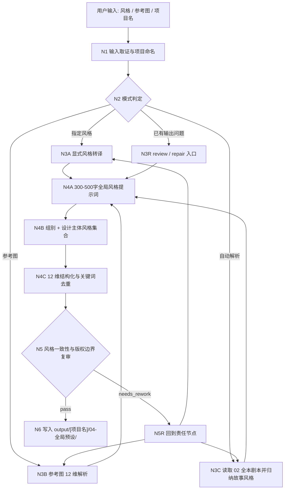
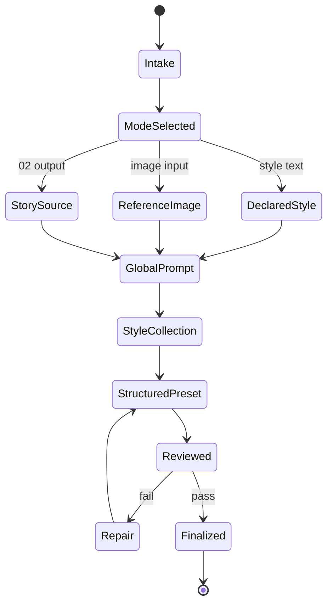
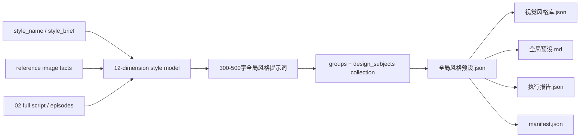

# 04-全局预设

`04-全局预设` 是 BYKJ AIGC 工作流的通用全局视觉风格预设阶段。它把用户指定风格、参考图风格解析、以及上游 `02-剧本处理` 全本剧本的故事源分析收束为同一套可复用的全局风格母稿、组别风格集合、设计主体风格集合与项目级风格 JSON。

默认上游输入目录：

`output/[项目名]/02-剧本处理/`

唯一 canonical 输出目录：

`output/[项目名]/04-全局预设/`

本阶段不改写 `02-剧本处理` 正文，不生成分镜、资产清单或视频任务；它只建立后续 `05-资产提取`、`06-智能分镜`、分组和图像生成阶段可消费的全局视觉风格真源。

## Context Loading Contract

- 每次调用 `$aigc-bykj-global-preset`、`04-全局预设` 或本目录 `SKILL.md` 时，必须同时加载同目录 `CONTEXT.md`。
- 若本轮任务通过父级 `$aigc-bykj` 路由进入，必须先遵守父级 `SKILL.md + CONTEXT.md` 的阶段路由，再进入本阶段。
- 若项目已存在 `output/[项目名]/02-剧本处理/`，自动解析模式必须优先加载其中的 `manifest.json`、`剧本处理稿.json`、`episodes/第N集.json` 和 `执行报告.json`。
- 若用户提供参考图，本阶段需要通过视觉能力直接观察图像；脚本只能承担读取、复制、索引、JSON 校验和 manifest 回写。
- 冲突优先级：用户显式请求 > 根 `AGENTS.md` > 父级 `aigc-bykj/SKILL.md` > 本 `SKILL.md` > 用户指定风格/参考图事实 > 上游 `02-剧本处理` 输出 > 本 `CONTEXT.md`。
- 核心风格判断、图像解析、故事审美归纳和提示词蒸馏必须由 LLM 直接完成；脚本不得替代 LLM 生成创作性风格正文或关键词。

## Business Requirement Analysis Contract

执行前必须先完成业务需求分析，不得直接套风格模板。

| analysis_field | required judgment |
| --- | --- |
| `business_goal` | 用户要建立哪种可复用全局视觉预设：显式风格、参考图还原、还是故事源自动归纳 |
| `business_object` | 输入是风格名称/描述、单张参考图、参考图目录、`02` 全本剧本输出，还是混合资料 |
| `constraint_profile` | 是否需要 1:1 还原、是否绑定项目、是否保存到 `视觉风格库.json`、是否允许艺术家/工作室命名、版权敏感边界 |
| `success_criteria` | 预设能稳定指导后续分组、设计主体、画面生成、资产提取和分镜阶段，并能被 `05/06` 消费 |
| `topology_fit` | 复杂度主要来自输入判型、图像 12 维解析、故事源归纳、300-500 字全局风格提示词、组别/设计主体集合、关键词去重和 JSON 汇流验收 |
| `step_strategy` | 默认使用混合型思行网络：先判型，三模式分支执行，再汇流为全局母稿 + 集合投影 + 统一 JSON |

若项目名无法从用户请求、参考图路径、`02` 输出路径或 `02` manifest 推断，使用输入文件 basename；仍无法推断时使用 `未命名项目-YYYYMMDD-HHMM`，并在 `执行报告.json` 记录推断依据。

## Total Input Contract

Accepted input:

- 用户直接指定风格名、风格短语、审美方向或制作限制，例如“赛博朋克霓虹都市”“水墨武侠”“90 年代港片胶片感”。
- 用户提供参考图路径、图片 URL、上传图片、Base64、二进制图片或图片文件夹。
- 用户要求自动解析项目风格，且存在可读取的 `output/[项目名]/02-剧本处理/` 全本剧本输出。
- 已有 `output/[项目名]/04-全局预设/` 输出，用户要求 review、repair、补充、重跑或合并。

Required input by mode:

- `declared_style_preset`：至少一个明确风格名或风格描述。
- `reference_image_parse`：至少一张可读取参考图；若为图片目录，按文件名稳定排序批量解析。
- `story_source_auto_parse`：可读取的 `02` 全本剧本输出，优先级为 `manifest.json -> episodes/ -> 剧本处理稿.json -> 执行报告.json`。

Optional input:

- 目标平台、画幅、时代背景、生成模型限制、负面风格禁区、参考艺术家/工作室、是否保存风格库。
- 项目级世界观、角色偏好、摄影偏好、色彩禁区、已有视觉预设。

Reject or clarify when:

- 用户要求参考图解析但没有可读取图像。
- 用户要求自动解析但缺少 `02-剧本处理` 输出，且没有粘贴全本剧本或等价故事源。
- 用户要求在本阶段改写剧情、重写剧本、生成分镜镜头、提取资产清单或提交图像生成任务。
- 用户要求以在世艺术家姓名作为核心可复制风格且未明确授权；应优先转译为视觉特征描述。

## Mode Selection

| mode | trigger | output behavior |
| --- | --- | --- |
| `declared_style_preset` | 用户指定预设风格、风格名或风格说明 | 将用户风格转成标准 12 维通用风格预设，补齐关键词、负面词和适用边界 |
| `reference_image_parse` | 用户提供一张或多张参考图 | 按视觉事实解析 12 维风格，完成单/多图权重、去污染、迁移边界和证据汇流；单图可直接输出 JSON，项目绑定时写入 `04-全局预设` |
| `story_source_auto_parse` | 用户要求自动解析，或只给项目名且已有 `02` 全本剧本 | 从 `02` 全本覆盖、组别候选、设计主体候选、情绪/材质/视觉母题和表演气质归纳风格，输出结构与参考图解析保持一致 |
| `review_only` | 用户只要求检查已有 `04-全局预设` 输出 | 只写或更新 `执行报告.json`，不改预设 JSON |
| `repair` | 已有输出存在字段缺失、关键词泛化、版权敏感、路径漂移或与故事源不一致 | 最小修复对应 JSON、风格库、报告或 manifest |

## Topology Contract

本阶段采用混合型思行网络：`输入取证 -> 模式判定 -> 三模式分支 -> 全局风格母稿 -> 组别/设计主体集合 -> 12 维风格汇流 -> JSON/库写回 -> 复审交接`。三种创作入口必须汇流到同一份输出 schema，不能形成三套互不兼容的预设真源。







## Thinking-Action Node Contract

每个节点必须同时完成判断、动作、证据和路由。

| node_id | objective | actions | evidence | route_out | gate |
| --- | --- | --- | --- | --- | --- |
| `N1-INTAKE` | 锁定输入、项目名、输出目录和权限 | 读取风格文本、图像路径、图片目录或 `02` 输出；记录保存意图和版权敏感边界 | `input_lock`、`project_name_basis`、`permission_profile` | `N2-MODE` | 输入可读且输出目录明确 |
| `N2-MODE` | 判定三种主模式或 review/repair | 建立 `mode_profile`、输入优先级和缺口标记 | `mode_decision`、`source_manifest` | `N3A/N3B/N3C/N3R` | 模式足以决定执行路线 |
| `N3A-DECLARED` | 把指定风格转成可执行预设 | 拆解风格名、媒介、时代、色彩、光影、材质、构图和禁区 | `declared_style_interpretation` | `N4A-GLOBAL-PROMPT` | 不空泛、不只复述用户词 |
| `N3B-IMAGE-PARSE` | 按视觉事实解析参考图 | 从 12 维度观察图像，建立单/多图权重、逐图证据、可迁移/不可迁移项和去污染决议 | `reference_image_evidence`、`reference_merge_decision`、`do_not_import` | `N4A-GLOBAL-PROMPT` | 解析基于图像事实，权重清楚，不复制主体或受保护表达 |
| `N3C-STORY-AUTO` | 从 `02` 全本剧本归纳故事风格 | 读取全本剧本，建立 coverage、场景/时代/情绪/材质/视觉母题、组别候选和设计主体候选映射 | `story_coverage_map`、`story_style_evidence`、`group_candidate_map`、`design_subject_candidate_map` | `N4A-GLOBAL-PROMPT` | 能覆盖全本并回指故事来源，不改写剧情 |
| `N4A-GLOBAL-PROMPT` | 写出 300-500 字全局风格提示词 | 按 `.agents/skills/aigc` 的 `north_star.yaml` 口径，写媒介属性、时代属性、光影逻辑、画面质感、场景化策略和禁区 | `global_style_prompt`、`north_star_alignment_evidence` | `N4B-COLLECTION` | 自然中文单段、300-500 字、包含媒介属性 |
| `N4B-COLLECTION` | 建立全局风格总集合 | 按组别和设计主体整理风格投影：组别服务分组/分镜，设计主体服务角色/场景/道具设计 | `global_style_collection`、`group_style_set`、`design_subject_style_set` | `N4C-STRUCTURE` | 集合覆盖关键组别和设计主体，不把候选冒充已完成资产清单 |
| `N4C-STRUCTURE` | 汇流为统一 JSON schema | 补齐 12 维 `dimensions`、英文 `keywords`、`negative_keywords`、去重和权重排序 | `style_schema_check`、`keyword_dedup_evidence` | `N5-REVIEW` | 字段齐全、关键词具体、顺序稳定 |
| `N5-REVIEW` | 风格一致性、版权和下游可用性复审 | 检查 12 维完整性、跨图像模型可理解性、在世艺术家敏感、故事一致性 | `review_result` | `N5R-REPAIR` 或 `N6-WRITEBACK` | 阻断项清零 |
| `N5R-REPAIR` | 最小修复 | 只修 fail code 指向的问题，不重写无关预设 | `repair_actions`、`review_again` | 回到责任节点 | 复审通过 |
| `N6-WRITEBACK` | 写入阶段输出 | 创建/更新 `全局风格预设.json`、`视觉风格库.json`、`全局预设.md`、报告和 manifest | `output_manifest` | complete | 输出路径和文件齐备 |

## Visual Style Parser Protocol

参考图解析与自动故事解析都必须输出同构 JSON。解析时以英文关键词为主，中文只用于 `name` 与 `description` 解释。

12 个必填维度：

| dimension key | required focus |
| --- | --- |
| `Art Style/Medium` | 艺术流派、媒介、画面生成类型，例如 `Digital Concept Art`、`Cel Shading`、`Oil Painting` |
| `Color Palette` | 主色、辅色、饱和度、对比度、色彩体系 |
| `Lighting/Atmosphere` | 光型、光源方向、体积光、雾气、氛围密度 |
| `Line Quality` | 线条、轮廓、边缘、笔触或无轮廓厚涂特征 |
| `Texture/Detail` | 胶片颗粒、噪点、材质肌理、皮肤/布料/金属/水汽细节 |
| `Composition/Perspective` | 构图、视角、镜头感、空间密度和透视 |
| `Mood/Emotion` | 情绪基调和观看心理 |
| `Era/Setting Reference` | 年代、地域、类型背景、世界观参照 |
| `Rendering Technique` | 渲染技术、引擎感、摄影/动画处理方式 |
| `Artist/Studio Style` | 艺术家、工作室、电影/动画传统或安全转译后的风格谱系 |
| `Visual Effects` | 色差、光晕、运动模糊、景深、Bloom、雨雪尘雾等 |
| `Negative Traits` | 应避免的视觉特征、错风格方向和质量缺陷 |

关键词规则：

- `keywords` 必须以英文风格关键词为主，权重高的词排在前面。
- 禁止堆砌无效质量词；`masterpiece`、`best quality` 只能作为尾部补充，不能替代核心风格词。
- 同义词去重；同一视觉事实只保留最可被模型理解的表达。
- 负面词必须服务风格控制，避免空泛否定。
- 若风格极度接近在世艺术家，优先用媒介、色彩、构图、光影、材质和时代特征描述，除非用户明确要求保留姓名。

## Reference Image Parse Contract

参考图模式必须从“图像事实”到“项目全局风格”完成可迁移抽取，而不是把单张图直接当作全片风格。

### Input Shape

| input type | handling rule |
| --- | --- |
| 单张参考图 | 直接观察 12 维视觉事实；若未绑定项目，可直接回复 JSON，并询问是否保存到 `视觉风格库.json` |
| 多张参考图 | 建立 `reference_image_set`，为每张图标注角色：`primary_style`、`secondary_style`、`detail_reference`、`negative_reference` |
| 图片文件夹 | 按文件名稳定排序；若文件名含 `main`、`primary`、`style`、`negative`、`detail` 等语义，写入权重依据 |
| 混合输入 | 用户显式指定 > 文件命名 > 图像内容一致性 > 执行者推断；推断必须写入报告 |

### Reference Merge Rules

多图汇流必须形成 `reference_merge_decision`：

| field | requirement |
| --- | --- |
| `primary_reference_ids` | 主风格图；决定媒介、色彩、光影、质感和整体情绪 |
| `secondary_reference_ids` | 辅助图；只补局部材质、空气、构图或场景化策略 |
| `negative_reference_ids` | 明确反例图；只进入 `negative_keywords` / `avoidance_rules` |
| `weight_rationale` | 说明为什么这张图权重更高，不能只按文件顺序 |
| `conflict_resolution` | 当图片间媒介、时代、色调、光影冲突时，必须单选主口径或拆为 `scene_variations` |

### Per-Image Evidence

每张图必须形成 `reference_image_evidence[]`：

| field | requirement |
| --- | --- |
| `image_id` | 稳定 ID，来自文件名、URL basename 或上传顺序 |
| `role` | `primary_style` / `secondary_style` / `detail_reference` / `negative_reference` |
| `visual_facts` | 可观察事实：媒介、色彩、光影、线条、材质、构图、情绪、时代、特效 |
| `transferable_traits` | 可迁移到项目全局风格的底层风格特征 |
| `non_transferable_traits` | 不应复制的主体身份、角色、具体构图、剧情动作、商标、版权角色或画面组合 |
| `dimension_evidence` | 12 维中每一维的图像证据 |

### Decontamination And Rights Boundary

参考图解析必须建立 `do_not_import`，默认禁止导入：

- 参考图中的具体人物身份、脸、服装专属造型、标志性角色、商标、版权物件。
- 参考图的完整构图、镜头顺序、场景物件组合和剧情动作。
- 与项目故事时代、媒介属性、世界观冲突的视觉元素。
- 未授权的在世艺术家姓名作为核心复制锚点。

可迁移的是底层风格语法：媒介属性、光影逻辑、色彩关系、材质处理、空气密度、构图倾向、情绪节奏和画面质感。

### Reference Mode Completion Gate

参考图模式只有同时满足以下条件才可汇流到 `N4A-GLOBAL-PROMPT`：

- 已读取并观察全部参考图，或明确记录无法读取的图像。
- 单图/多图权重和冲突处理已写入 `reference_merge_decision`。
- 每张有效图都有 `reference_image_evidence`。
- 已明确 `transferable_traits` 与 `do_not_import`。
- 汇流后的 `global_style_prompt` 不复制参考图主体身份、具体画面组合或版权表达。

## Global Style Concept Contract

本阶段的“全局风格”必须与 `.agents/skills/aigc` 中 `north_star.yaml` 的口径一致：它是指导整个作品全集各部分的总风格合同，是包含各个组别、各类设计主体的并集式风格底座，不是单一场景的氛围词，也不是所有主体都机械复用的交集前缀。

`global_style_prompt` 是本阶段最关键的输出字段：

- 必须是中文自然段，通常 `300-500` 字。
- 必须显式包含 `媒介属性`，例如真人、2D、3D、混合媒介、概念短片、竖屏短剧等。
- 必须准确说明不同场景类型匹配的光影、色彩、质感、摄影/画面语法和禁区。
- 必须能作为后续分组、设计主体、分镜和图像生成的共同母稿。
- 不得写入一次性剧情事实、单个分镜专属动作、单个角色外貌细节或单个道具造型细节。

`global_style_collection` 是全局风格的总集合结构：

| collection field | owner meaning | output rule |
| --- | --- | --- |
| `global_style_prompt` | 全片风格母稿 | 300-500 字中文自然段，对齐 `north_star.yaml` 的 `全局风格.全局风格提示词` |
| `group_style_set[]` | 组别风格投影 | 按场景类型、空间、时间、动作、光源、色彩、材质、空气和摄影策略，为后续分组/分镜提供可抽取的组级风格依据 |
| `design_subject_style_set.characters[]` | 角色设计主体风格 | 只给角色设计共享的时代、材质、服装、身体表现和禁区方向；不替代 `05/7-设计` 的角色清单与设计稿 |
| `design_subject_style_set.scenes[]` | 场景设计主体风格 | 给建筑、空间、自然环境、室内外材质和光色规则；不替代场景资产清单 |
| `design_subject_style_set.props[]` | 道具设计主体风格 | 给道具材质、磨损、反射、使用痕迹和时代规则；不替代道具资产清单 |
| `scene_variations[]` | 局部场景变体 | 只记录强差异场景的风格投影，不得覆盖全片母稿 |

当 `05-资产提取` 尚未执行时，设计主体集合只能标记为 `candidate_from_story_source`；它是给下游提取和设计的风格约束候选，不是已完成资产清单或设计稿。

## Story Source Auto Parse Contract

自动解析模式的对象是 `02-剧本处理` 的全本剧本输出，而不是原小说源或后续分集/资产结果。

读取优先级：

1. `output/[项目名]/02-剧本处理/manifest.json`
2. `output/[项目名]/02-剧本处理/episodes/第N集.json`
3. `output/[项目名]/02-剧本处理/剧本处理稿.json`
4. `output/[项目名]/02-剧本处理/执行报告.json`

分析重点：

- 故事时代、地域、社会阶层、空间功能、天气与自然景物。
- 反复出现的材质、色彩、声音、道具状态、身体动作和视觉母题。
- 关键场景的戏剧压力、情绪弧、表演外放度和画面密度。
- 上游 `02` 中的 `episode_visual_spine`、`visual_aesthetic_evidence`、`sound_design_directive` 与 `emotional_rhythm_map`。
- 若 `02` 输出缺少足够审美证据，可以从正文声画事实保守归纳，并在报告中标记 `inferred_from_story_source`。

### Full-Book Coverage Rules

自动解析必须建立 `story_coverage_map`，防止单个漂亮场景绑架全局风格。

| field | requirement |
| --- | --- |
| `source_scope` | 本轮读取了 `02` 的哪些文件、集、章节、场景范围 |
| `coverage_units[]` | 按集、章节、场景或 sequence 记录：`unit_id / title / source_path / scene_type / emotional_function / visual_evidence` |
| `covered_ratio` | 能估算时记录覆盖比例；不能估算时说明原因 |
| `excluded_units[]` | 未读取或不纳入风格判断的范围及理由 |
| `dominant_patterns` | 跨多个单位反复出现的时代、空间、材质、光影、情绪和母题 |
| `outlier_scenes` | 强烈但局部的场景，只能进入 `scene_variations`，不得覆盖全局母稿 |

### Group Candidate Map

自动解析必须从 `02` 剧本中提炼 `group_candidate_map`，给后续分组/分镜使用：

| field | requirement |
| --- | --- |
| `group_candidate_id` | 稳定候选 ID，例如 `G-CAND-RAIN-INN` |
| `scenario_type` | 室内/室外、夜景/日景、对话/追逐/群像/仪式/静物证据等 |
| `source_units` | 来源场景、集、章节或剧本字段 |
| `style_projection` | 当前组别可抽取的光影、色彩、材质、空气、摄影和禁区 |
| `confidence` | `high` / `medium` / `low`；证据不足时不得标 high |
| `handoff_note` | 给 `03/06` 或后续分组阶段的使用说明 |

`group_candidate_map` 是风格候选，不是最终分组结果；不得生成分镜编号或改写分组边界。

### Design Subject Candidate Map

自动解析必须从故事源中提炼 `design_subject_candidate_map`，给角色、场景、道具设计阶段使用：

| field | requirement |
| --- | --- |
| `subject_type` | `character` / `scene` / `prop` |
| `subject_candidate_id` | 稳定候选 ID，例如 `CAND-CHAR-001`、`CAND-SCENE-001` |
| `subject_name` | 候选名称；若只是类型集合，可用“江湖刀客类角色”等类型名 |
| `source_units` | 来源场景、集、章节或字段 |
| `style_projection` | 只给时代、材质、服装/空间/道具质感、身体表现、光色和禁区方向 |
| `confidence` | `high` / `medium` / `low` |
| `status` | 默认 `candidate_from_story_source`，不得写成已完成资产 |

`design_subject_candidate_map` 不替代 `05-资产提取` 或 `.agents/skills/aigc/7-设计` 的清单、设计和生成真源。

### Sparse Evidence Fallback

当 `02` 输出缺少导演美学字段、视觉主轴或风格证据时，必须保守退化：

- 优先从剧本正文的可见/可听事实归纳：空间、时间、天气、材质、动作、声音、身体状态和道具状态。
- 将相关字段标记为 `inferred_from_story_source`。
- 对无法证明的风格判断标记为 `low_confidence_style_inference`，不得写成确定事实。
- 不得为了补齐全局风格而引入故事中不存在的时代、媒介、场景、光源、材质或设计主体。

自动解析不得：

- 为了风格统一改写故事事实、对白、人物关系或场景顺序。
- 引入与故事时代、类型和场景气质冲突的风格，除非用户明确指定。
- 把单个漂亮场景误当作全片唯一风格；应区分 `global_style` 与 `scene_variations`。

## Output Contract

### Required output

输出根目录固定为：

`output/[项目名]/04-全局预设/`

默认文件：

| output_id | path | purpose |
| --- | --- | --- |
| `OUTPUT-04-PRESET` | `output/[项目名]/04-全局预设/全局风格预设.json` | 当前项目唯一 canonical 全局风格预设 JSON |
| `OUTPUT-04-LIBRARY` | `output/[项目名]/04-全局预设/视觉风格库.json` | 可复用风格库；单图独立模式可先询问是否保存 |
| `OUTPUT-04-MD` | `output/[项目名]/04-全局预设/全局预设.md` | 人类可读版预设、适用边界、场景变体和下游使用说明 |
| `OUTPUT-04-REPORT` | `output/[项目名]/04-全局预设/执行报告.json` | 思考过程、输入证据、12 维解析、review、修复和风险 |
| `OUTPUT-04-MANIFEST` | `output/[项目名]/04-全局预设/manifest.json` | 机械索引：输入、模式、输出、状态、fail code |

目录结构：

```text
output/[项目名]/04-全局预设/
├── 全局风格预设.json
├── 视觉风格库.json
├── 全局预设.md
├── 执行报告.json
└── manifest.json
```

### JSON schema

`全局风格预设.json` 和 `视觉风格库.json` 的单个风格对象必须保持以下结构，不得随意增减核心字段：

```json
{
  "id": "style_[unique_id]",
  "name": "[中文风格名]",
  "description": "[一句话风格描述]",
  "source_mode": "declared_style_preset|reference_image_parse|story_source_auto_parse",
  "source_evidence": {
    "project_name": "",
    "source_items": [],
    "story_basis": [],
    "reference_images": [],
    "reference_image_evidence": [],
    "reference_merge_decision": {},
    "do_not_import": [],
    "story_coverage_map": {},
    "group_candidate_map": [],
    "design_subject_candidate_map": [],
    "confidence_notes": []
  },
  "global_style_prompt": "[300-500字中文全局风格提示词]",
  "global_style_collection": {
    "medium_attribute": "",
    "era_attribute": "",
    "lighting_logic": "",
    "image_texture": "",
    "scenario_style_strategy": [],
    "avoidance_rules": [],
    "group_style_set": [
      {
        "group_id": "",
        "group_name": "",
        "scenario_type": "",
        "style_projection": "",
        "evidence": [],
        "confidence": "high|medium|low",
        "source": "reference_image|story_source|declared_style|mixed"
      }
    ],
    "design_subject_style_set": {
      "characters": [
        {
          "subject_id": "",
          "subject_name": "",
          "status": "candidate_from_story_source",
          "style_projection": "",
          "evidence": [],
          "confidence": "high|medium|low"
        }
      ],
      "scenes": [],
      "props": []
    }
  },
  "dimensions": {
    "Art Style/Medium": "",
    "Color Palette": "",
    "Lighting/Atmosphere": "",
    "Line Quality": "",
    "Texture/Detail": "",
    "Composition/Perspective": "",
    "Mood/Emotion": "",
    "Era/Setting Reference": "",
    "Rendering Technique": "",
    "Artist/Studio Style": "",
    "Visual Effects": "",
    "Negative Traits": ""
  },
  "keywords": [],
  "negative_keywords": [],
  "scene_variations": []
}
```

Compatibility note:

- 用户只要求“解析这张图”且未绑定项目时，可以直接回复上述 JSON 代码块，并询问是否保存到 `视觉风格库.json`。
- 用户提供图片文件夹、绑定 BYKJ 项目、或进入自动解析模式时，应直接写入阶段输出目录，不逐一确认。
- `视觉风格库.json` 可为数组；数组元素仍必须保持上述单个风格对象结构。

### Markdown report structure

`全局预设.md` 至少包含：

1. `# [项目名] 04-全局预设`
2. `## 全局风格提示词`：300-500 字中文自然段，必须包含媒介属性、场景化光影/色彩/质感/摄影策略和禁区。
3. `## 全局风格总集合`
4. `## 组别风格集合`
5. `## 设计主体风格集合`
6. `## 核心视觉预设`
7. `## Style Keywords`
8. `## Negative Keywords`
9. `## 12 维风格解析`
10. `## 场景变体`
11. `## 下游使用边界`

`执行报告.json` 至少包含：

1. `任务简报`
2. `思考过程`：简述业务分析、模式判定、为什么选择当前分支、如何汇流为统一 JSON；不得输出冗长原始推理草稿。
3. `输入与真源锁定`
4. `12 维解析证据`
5. `参考图证据与去污染决议`：仅参考图模式或混合模式必填。
6. `全本覆盖与故事源证据`：自动解析模式必填，包含 `story_coverage_map`。
7. `全局风格提示词证据`
8. `组别与设计主体集合证据`
9. `关键词去重与权重说明`
10. `版权敏感与负面词检查`
11. `review_result`
12. `repair_actions`
13. `风险与例外`

### Manifest schema

`manifest.json` 必须是机械索引，不承载创作正文。

```yaml
project_name: ""
stage: "04-全局预设"
mode: ""
source_items:
  - id: ""
    path_or_inline: ""
    type: ""
    title: ""
    priority: 1
output_root: "output/[项目名]/04-全局预设/"
outputs:
  preset: "全局风格预设.json"
  library: "视觉风格库.json"
  markdown: "全局预设.md"
  report: "执行报告.json"
status:
  verdict: "pass|needs_rework|blocked"
  fail_codes: []
  reviewed_at: ""
style_policy:
  english_keywords_first: true
  cross_model_compatible: true
  living_artist_name_guard: true
```

## Stage-End Review-Repair Contract

每次生成候选预设后，必须在本阶段内部完成 review -> repair -> review-again 闭环。

1. `N4C-STRUCTURE` 产物先视为 `candidate_global_preset`，不是终稿。
2. `N5-REVIEW` 按 `SKILL.md Review Gate Configuration` 和 `Pass Table` 逐项检查。
3. 若 verdict 为 `needs_rework`，必须执行 `N5R-REPAIR`，并定位最早责任节点：
   - 输入、项目名、路径或保存意图失败：回 `N1-INTAKE`。
   - 模式误判：回 `N2-MODE`。
   - 指定风格泛化或未转译：回 `N3A-DECLARED`。
   - 参考图解析臆测、维度缺失或未按视觉事实：回 `N3B-IMAGE-PARSE`。
   - 参考图多图权重、冲突处理、可迁移边界或去污染缺失：回 `N3B-IMAGE-PARSE`。
   - 故事源自动解析与 `02` 不一致：回 `N3C-STORY-AUTO`。
   - 自动解析缺全本覆盖、组别候选、设计主体候选或证据不足退化标记：回 `N3C-STORY-AUTO`。
   - 全局风格提示词缺失、过短过长或未对齐 `north_star.yaml` 口径：回 `N4A-GLOBAL-PROMPT`。
   - 组别或设计主体集合缺失、把候选当成资产清单、或集合无法被下游消费：回 `N4B-COLLECTION`。
   - JSON 字段、关键词、负面词或输出路径失败：回 `N4C-STRUCTURE` / `N6-WRITEBACK`。
4. 修复只处理 fail code 指向的问题；不得借修复机会重写无关预设、故事事实或上游剧本。
5. 修复后必须执行 `review_again`；复审仍失败时继续最小修复循环，或在输入缺失、规则冲突、权限不可用时输出不可用说明。

## Boundary Guard

本阶段明确不做以下事情：

- 不改写 `02-剧本处理` 的剧情事实、对白、事件顺序、人物关系或场景顺序。
- 不生成角色/场景/道具资产清单；这些交给 `05-资产提取`。
- 不生成分镜号、镜头运动、景别表、图像生成提示词序列或视频任务；这些交给 `06-智能分镜` 或图像/视频阶段。
- 不用脚本、模板或启发式拼接替代 LLM 的视觉风格判断。
- 不把参考图的主体身份、剧情内容或版权角色当作可复制资产；本阶段只抽取风格特征。
- 不把 `output/[项目名]/02-剧本处理/`、`03-智能分集/` 或旧 AIGC runtime 当作本阶段输出真源。

## SKILL.md Review Gate Configuration

本阶段所有核心合同都按五段式验收链执行：

`Review Question -> Review Gate -> Fail Code -> Rework Target -> Report Evidence`

| Review Question | Review Gate | Fail Code | Rework Target | Report Evidence |
| --- | --- | --- | --- | --- |
| 输入、项目名、模式和输出路径是否已锁定？ | 缺任一项则阻断 | `FAIL-04-INPUT` | `N1-INTAKE` | `input_lock`、`project_name_basis`、`mode_decision` |
| 是否正确选择三种主模式之一，或进入 review/repair？ | 模式误判导致错误解析则阻断 | `FAIL-04-MODE` | `N2-MODE` | `mode_profile`、`source_manifest` |
| 指定风格是否已转译为具体视觉语言？ | 只复述风格名或堆抽象词则返工 | `FAIL-04-DECLARED-STYLE` | `N3A-DECLARED` | `declared_style_interpretation` |
| 参考图解析是否覆盖 12 维并基于画面事实？ | 维度缺失、臆测剧情或关键词泛化则阻断 | `FAIL-04-IMAGE-PARSE` | `N3B-IMAGE-PARSE` | `reference_image_evidence`、`dimension_evidence` |
| 多张参考图是否有权重、冲突处理、可迁移边界和去污染决议？ | 多图直接平均、冲突未裁决、复制主体/构图/版权表达则阻断 | `FAIL-04-REF-MERGE` | `N3B-IMAGE-PARSE` | `reference_merge_decision`、`transferable_traits`、`do_not_import` |
| 自动解析是否以 `02` 全本剧本为对象？ | 读取原小说源、`03` 分集或凭空设定替代 `02` 则阻断 | `FAIL-04-STORY-SOURCE` | `N3C-STORY-AUTO` | `story_style_evidence`、`source_items` |
| 自动解析是否完成全本覆盖、组别候选、设计主体候选和证据不足退化？ | 单场景绑架全局、缺 coverage、候选冒充资产清单、低证据无标记则阻断 | `FAIL-04-STORY-COVERAGE` | `N3C-STORY-AUTO` | `story_coverage_map`、`group_candidate_map`、`design_subject_candidate_map`、`confidence_notes` |
| 是否输出 300-500 字中文 `global_style_prompt`，且对齐 `.agents/skills/aigc` 的全局风格概念？ | 缺失、字数不符、未含媒介属性、写成单场景氛围或对象细节则阻断 | `FAIL-04-GLOBAL-PROMPT` | `N4A-GLOBAL-PROMPT` | `global_style_prompt`、字数、`north_star_alignment_evidence` |
| 全局风格是否被建模为包含组别与设计主体的总集合？ | 只给单一风格前缀，缺 `group_style_set` 或 `design_subject_style_set`，或把候选冒充资产清单则阻断 | `FAIL-04-GLOBAL-COLLECTION` | `N4B-COLLECTION` | `global_style_collection`、组别/主体覆盖表、candidate 标记 |
| JSON 是否保持统一 schema 且 12 维字段齐全？ | 核心字段缺失、改名或增删导致下游不可消费则阻断 | `FAIL-04-SCHEMA` | `N4C-STRUCTURE` | `style_schema_check` |
| 英文关键词是否去重、具体、按权重排序且具有跨图像模型可理解性？ | 重复、空泛、质量词替代核心风格词则返工 | `FAIL-04-KEYWORDS` | `N4C-STRUCTURE` | `keyword_dedup_evidence` |
| 负面词是否服务风格控制？ | 负面词缺失、冲突或只写质量缺陷则返工 | `FAIL-04-NEGATIVE` | `N4C-STRUCTURE` | `negative_keyword_rationale` |
| 是否处理在世艺术家/工作室版权敏感边界？ | 未授权直接复制在世艺术家姓名作为核心风格则返工 | `FAIL-04-STYLE-RIGHTS` | `N5-REVIEW` | `living_artist_guard_result` |
| 输出是否只落到 `output/[项目名]/04-全局预设/`？ | 路径漂移或写入其他阶段真源则阻断 | `FAIL-04-OUTPUT-PATH` | `N6-WRITEBACK` | `output_manifest` |

## Pass Table

| pass_id | pass standard | fail code | rework entry |
| --- | --- | --- | --- |
| `PASS-04-01` | 输入可读、项目名和输出目录明确 | `FAIL-04-INPUT` | `N1-INTAKE` |
| `PASS-04-02` | 三种主模式或 review/repair 路线判定正确 | `FAIL-04-MODE` | `N2-MODE` |
| `PASS-04-03` | 指定风格被转译为具体视觉语言，或参考图/故事源证据充分 | `FAIL-04-DECLARED-STYLE` / `FAIL-04-IMAGE-PARSE` / `FAIL-04-STORY-SOURCE` | `N3A/N3B/N3C` |
| `PASS-04-04` | 参考图模式已完成逐图证据、权重合并、冲突处理、可迁移边界和去污染 | `FAIL-04-REF-MERGE` | `N3B-IMAGE-PARSE` |
| `PASS-04-05` | 自动解析模式已完成全本覆盖、组别候选、设计主体候选和证据不足退化标记 | `FAIL-04-STORY-COVERAGE` | `N3C-STORY-AUTO` |
| `PASS-04-06` | `global_style_prompt` 为 300-500 字中文自然段，包含媒介属性，并说明场景化光影、色彩、质感、摄影和禁区 | `FAIL-04-GLOBAL-PROMPT` | `N4A-GLOBAL-PROMPT` |
| `PASS-04-07` | `global_style_collection` 包含组别风格集合与设计主体风格集合，且候选主体不冒充下游资产清单 | `FAIL-04-GLOBAL-COLLECTION` | `N4B-COLLECTION` |
| `PASS-04-08` | 12 维风格字段齐全且不互相冲突 | `FAIL-04-SCHEMA` | `N4C-STRUCTURE` |
| `PASS-04-09` | 英文关键词具体、去重、权重排序并具备跨图像模型可理解性 | `FAIL-04-KEYWORDS` | `N4C-STRUCTURE` |
| `PASS-04-10` | 负面关键词可控制错风格、错媒介和质量缺陷 | `FAIL-04-NEGATIVE` | `N4C-STRUCTURE` |
| `PASS-04-11` | 艺术家/工作室引用符合用户授权和版权敏感边界 | `FAIL-04-STYLE-RIGHTS` | `N5-REVIEW` |
| `PASS-04-12` | 输出目录、JSON、风格库、Markdown、报告和 manifest 齐备 | `FAIL-04-OUTPUT-PATH` | `N6-WRITEBACK` |

## Root-Cause Execution Contract (Mandatory)

当输出失败时，必须按以下链路上溯：

`Symptom -> Direct Cause -> Responsible Node -> Source Mode Layer -> AGENTS.md / LLM-first Rule`

常见归因：

- 模式错判：回 `N2-MODE`，不要在错误分支里补救。
- 参考图解析空泛：回 `N3B-IMAGE-PARSE`，按 12 维重看画面事实。
- 参考图汇流污染：回 `N3B-IMAGE-PARSE`，补 `reference_merge_decision`、`transferable_traits` 和 `do_not_import`。
- 自动解析脱离故事：回 `N3C-STORY-AUTO`，重新读取 `02` 全本剧本证据。
- 自动解析被单场景绑架：回 `N3C-STORY-AUTO`，补 `story_coverage_map`、`group_candidate_map` 和 `design_subject_candidate_map`。
- 缺少 300-500 字全局风格提示词：回 `N4A-GLOBAL-PROMPT`，按 `north_star.yaml` 全局风格口径重写。
- 全局风格被误写成单一前缀：回 `N4B-COLLECTION`，补齐组别和设计主体总集合。
- 关键词堆砌或重复：回 `N4C-STRUCTURE`，按权重和模型可理解性去重。
- 在世艺术家风险：回 `N5-REVIEW`，转译为媒介、色彩、光影、构图和材质特征。
- 输出路径漂移：回 `N6-WRITEBACK`，只保留 `output/[项目名]/04-全局预设/`。

任何核心创作判断被脚本替代时，必须上溯到根 `AGENTS.md` 的 LLM-first 主创规则，并改回 `LLM 直出 canonical creative truth -> 脚本仅做校验/落盘/索引辅助`。

## Completion Definition

只有同时满足以下条件，才可声明本阶段完成：

- 已完成业务需求分析、输入模式判定和输出路径锁定。
- 三种主模式之一已被正确执行，并汇流到统一 JSON schema。
- 若为图片参考模式，已完成逐图证据、单/多图权重、冲突处理、可迁移边界和去污染审计。
- 若为自动解析模式，已完成 `02` 全本覆盖、组别候选、设计主体候选和证据不足退化标记。
- 已输出 300-500 字中文 `global_style_prompt`，且对齐 `.agents/skills/aigc` 的全局风格母稿概念。
- 已输出包含 `group_style_set` 与 `design_subject_style_set` 的全局风格总集合。
- `全局风格预设.json` 是当前项目唯一 canonical 风格预设。
- `视觉风格库.json`、`全局预设.md`、`执行报告.json`、`manifest.json` 已按需写入。
- `执行报告.json` 包含 `思考过程`、输入证据、12 维解析、关键词去重、版权敏感检查和 review verdict。
- 输出全部位于 `output/[项目名]/04-全局预设/`。
