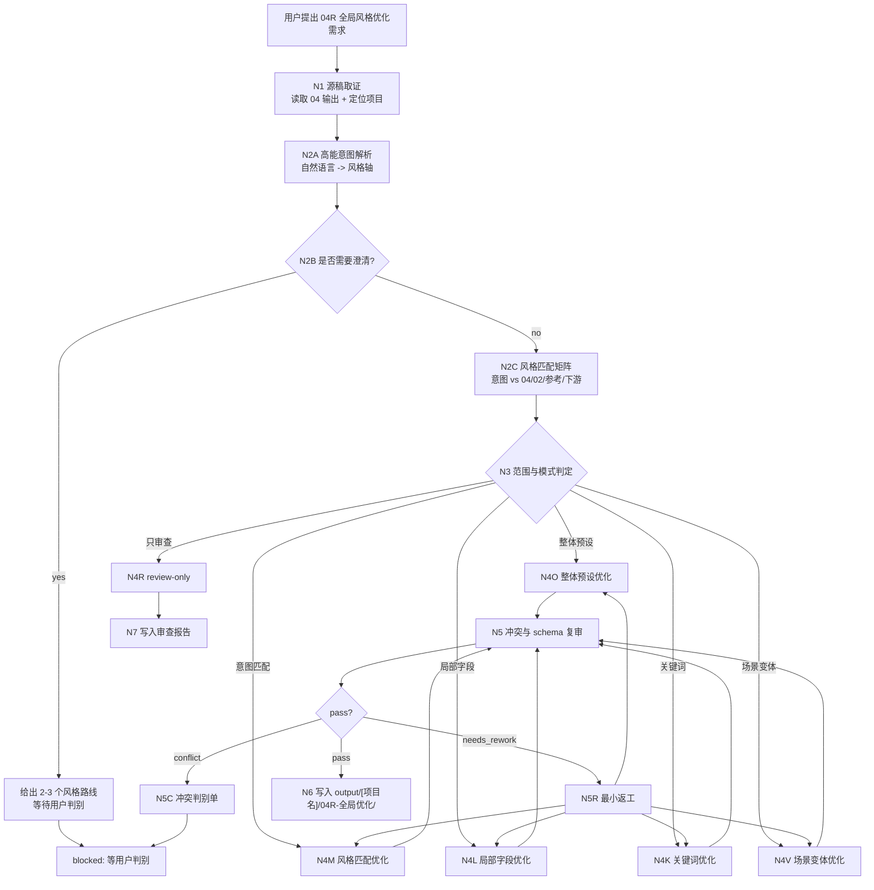
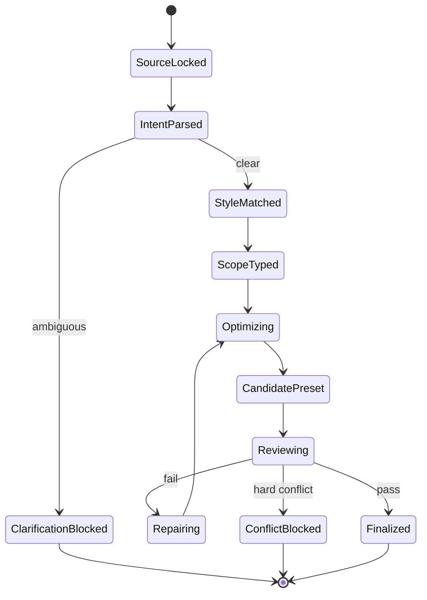
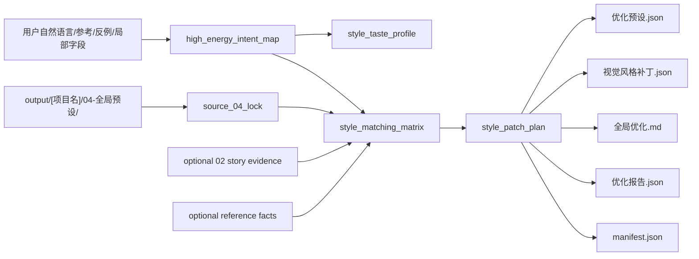
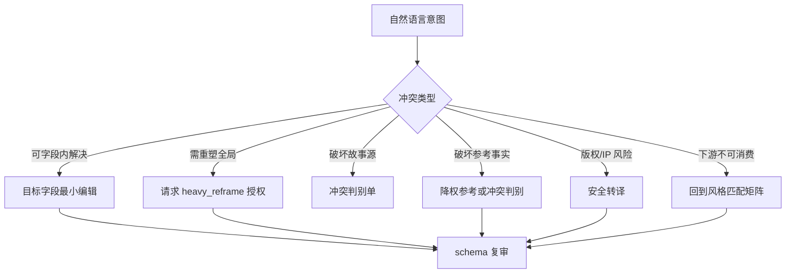

# 04R-全局优化

`04R-全局优化` 是 BYKJ AIGC 工作流中承接 `04-全局预设` 输出物的二次自然语言调优阶段。它不重新执行 `04-全局预设` 的完整生成流程，而是在已有 `全局风格预设.json`、`视觉风格库.json`、`全局预设.md`、`执行报告.json`、`manifest.json` 或用户粘贴的等价风格片段基础上，按照用户个人自然语言、审美意图、风格偏好、局部问题或下游反馈，对全局视觉预设进行高能意图解析、风格匹配和最小必要优化。

canonical 输出目录固定为：

`output/[项目名]/04R-全局优化/`

本阶段核心原则：

- 源稿承接：`04` 输出物是默认真源；`04R` 只做二次优化，不改写 `02` 剧本、不生成资产、不生成分镜。
- 自然语言驱动：用户的“更高级”“更暗黑”“更贵气”“别那么赛博”“像某种感觉但不要像某个 IP”等表达，必须先转成可执行风格变量和 12 维风格调整，再改 JSON 或文档。
- 高能意图解析：口味词、风格词、反感词、参考对象、情绪词、媒介词、年代词、禁区词都要被拆成 `intent -> style_axis -> target_field -> edit_intensity -> risk`。
- 风格匹配：每次优化必须判断用户意图与现有全局风格、故事源、参考图事实、12 维字段、英文关键词和下游阶段是否匹配。
- 局部调优只改选定字段或片段；整体调优可重排全局风格母稿、组别风格、设计主体集合和关键词，但不得破坏 `04` 的统一 schema。
- LLM 主创：意图解析、风格匹配、审美取舍、提示词蒸馏和视觉语言优化必须由 LLM 直接完成；脚本只做读取、diff、JSON 校验、排序、manifest 回写等机械辅助。

## Context Loading Contract

- 每次调用 `$aigc-bykj-global-preset-optimization`、`04R-全局优化` 或本目录 `SKILL.md` 时，必须同时加载同目录 `CONTEXT.md`。
- 若本轮任务通过父级 `$aigc-bykj` 路由进入，必须先遵守父级 `SKILL.md + CONTEXT.md` 的阶段路由，再进入本阶段。
- 必须按需读取 `output/[项目名]/04-全局预设/` 产物；优先顺序为 `manifest.json`、`全局风格预设.json`、`视觉风格库.json`、`全局预设.md`、`执行报告.json`。
- 若优化涉及故事贴合度，按需读取 `output/[项目名]/02-剧本处理/` 作为风格事实回指；只用于复核风格是否贴合故事，不得改写剧情。
- 若优化涉及参考图事实或图像风格匹配，应读取 `04` 报告中的图像证据；必要时重新观察用户提供的参考图，但不得复制主体身份、完整构图或版权表达。
- 冲突优先级：用户显式请求 > 根 `AGENTS.md` > 父级 `aigc-bykj/SKILL.md` > `04R-全局优化/SKILL.md` > `04-全局预设/SKILL.md` > 用户本轮自然语言意图 > `04` 输出物 > 上游 `02` 证据 > 本 `CONTEXT.md`。

## Business Requirement Analysis Contract

不得在未解析用户自然语言意图前直接改风格。执行前至少锁定：

| analysis_field | required judgment |
| --- | --- |
| `optimization_goal` | 用户要优化什么：全局风格母稿、12 维字段、英文关键词、负面词、场景变体、组别风格、设计主体风格、版权边界或下游可用性 |
| `source_object` | 承接的 `04-全局预设` 输出目录、JSON 对象、风格库条目、Markdown 片段、报告问题或用户粘贴片段 |
| `natural_language_intent` | 用户口味词、审美词、反感词、参考对象、情绪词和禁区词分别指向哪些风格轴 |
| `style_match_target` | 需要匹配的对象：用户口味、故事源、参考图、平台/模型、既有视觉预设、下游 05/06 使用场景 |
| `optimization_scope` | `overall_preset_tuning`、`intent_style_matching`、`local_field_tuning`、`keyword_tuning`、`scene_variation_tuning`、`review_only`、`conflict_resolution` |
| `constraint_profile` | 是否允许改风格名、是否允许改 global prompt、是否允许改关键词、是否允许调整 scene variations、是否绑定 `视觉风格库.json` |
| `edit_intensity` | `light_touch`、`medium_rework`、`heavy_reframe`、`experimental_alt` 中哪一档被授权 |
| `style_risk` | 是否会破坏故事贴合度、参考图事实、全局统一 schema、版权敏感边界、下游可消费性或用户禁区 |
| `success_criteria` | 优化后能更精准匹配用户自然语言意图，同时仍保持 12 维完整、关键词稳定、全局风格可复用、下游可消费 |
| `step_strategy` | 默认使用混合型思行网络：先锁 04 源稿，再自然语言解析和风格匹配，中段按整体/局部/关键词分支优化，后段统一 schema 复审和写回 |

## Total Input Contract

Accepted input:

- 用户指定 `output/[项目名]/04-全局预设/` 输出，要求“调一下全局风格”“优化这个预设”“风格不对”“关键词不准”。
- 用户用自然语言表达个人审美意图，例如“更高级一点”“更东方但别古装影楼”“更阴冷压迫”“少一点赛博味”“要有贵气但不要金灿灿”“像旧胶片但别脏”。
- 用户指定局部字段，例如 `global_style_prompt`、某个 12 维字段、`keywords`、`negative_keywords`、`scene_variations`、`group_style_set`、`design_subject_style_set`。
- 用户给出参考风格、参考图、竞品风格、反例、平台模型限制或下游反馈，要求对已有 `04` 预设进行匹配修正。
- 用户只要求 review 现有 `04` 输出，指出风格偏差、字段缺失、版权敏感、关键词泛化或下游不可用问题。

Required input:

- 可读取的 `04-全局预设` 输出，或用户粘贴的等价风格预设片段。
- 可推断或声明的项目名。
- 明确或可推断的优化目标、范围和授权强度。

Reject or clarify when:

- 找不到 `04-全局预设` 输出且用户也没有粘贴可优化文本。
- 用户要求局部调优但目标字段或片段无法定位。
- 用户自然语言低信息且可产生多种有效风格路线，例如只说“更好看”“高级一点”“不对味”；此时先进入澄清门，给出 2-3 个风格方向。
- 用户要求在本阶段生成角色/场景/道具资产清单、分镜、图像提示词序列或视频任务；这些应回到 `05/06` 或图像/视频阶段。
- 用户要求以在世艺术家姓名或受保护 IP 作为核心可复制风格且无授权；应转译为视觉特征或进入冲突判别。

## Mode Selection

| mode | trigger | editing policy | output behavior |
| --- | --- | --- | --- |
| `overall_preset_tuning` | 用户要求整体优化、重塑或统一全局视觉风格 | 可调整全局母稿、12 维、组别/主体集合、关键词和负面词，但不得破坏 schema | 输出完整优化预设、报告、manifest |
| `intent_style_matching` | 用户给出自然语言审美意图、参考对象、反例或平台风格要求 | 先解析意图，再做风格匹配矩阵，最后调整必要字段 | 输出意图解析、匹配矩阵、优化预设 |
| `local_field_tuning` | 用户指定某个字段、维度、关键词或场景变体 | 只改指定字段；上下文字段只用于一致性复核 | 输出局部替换片段、字段 diff 和风险 |
| `keyword_tuning` | 用户主要反馈关键词不准、负面词不稳、模型不吃词 | 只优化 `keywords`、`negative_keywords`、权重顺序和同义去重，必要时同步相关 12 维字段 | 输出关键词表、负面词说明和 JSON patch |
| `scene_variation_tuning` | 用户要求某类场景风格更匹配或局部变体更强 | 只优化 `scene_variations`、`group_style_set` 或相关策略，不覆盖全局母稿 | 输出变体策略、适用边界和下游说明 |
| `review_only` | 用户只要求检查现有 `04` 输出 | 不改预设，只输出审查报告 | 输出 verdict、fail code、建议优先级 |
| `conflict_resolution` | 用户目标与故事源、参考图事实、版权边界或全局 schema 冲突 | 暂停终稿写入，输出冲突判别单和可选方案 | 等用户裁决后再进入对应优化模式 |
| `repair_previous_04R` | 已有 `04R` 输出被指出问题 | 最小修复失败项，不重写无关字段 | 更新 `优化预设.json`、报告和 manifest |

## Natural Language Intent And Style Matching Contract

用户个人自然语言是本阶段一等输入。每次优化都必须先把自然语言压成可执行风格合同，再进行字段修改。

### High-Energy Intent Parser

`high_energy_intent_map` 必须记录：`raw_phrase / inferred_style_intent / style_axis / target_fields / edit_intensity / confidence / risk / applied_status`。

| user phrase pattern | style_axis | target_fields | risk check |
| --- | --- | --- | --- |
| “更高级”“更有质感” | 克制、材质、光影层次、构图秩序、关键词降噪 | `global_style_prompt`、`Texture/Detail`、`Lighting/Atmosphere`、`keywords` | 不得空泛写“高级感”，必须落到材质、光影、构图和媒介 |
| “更东方/更中式/更国风但别俗” | 时代、地域、材质、色彩克制、器物和空间秩序 | `Era/Setting Reference`、`Color Palette`、`design_subject_style_set`、`negative_keywords` | 不得滑向影楼、廉价古风或堆符号 |
| “更暗黑/更压迫/更冷” | 低照度、色温、空气密度、空间压迫、负面词 | `Lighting/Atmosphere`、`Mood/Emotion`、`Visual Effects`、`negative_keywords` | 不得牺牲主体可读性和下游资产识别 |
| “少一点赛博/别太科技” | 去除错媒介和错年代词，降低霓虹/金属/屏幕语言权重 | `keywords`、`negative_keywords`、`Era/Setting Reference` | 不得把必要世界观科技元素误删 |
| “更贵气但不要金灿灿” | 高级材质、低饱和金属、空间秩序、服装/道具质感 | `Color Palette`、`Texture/Detail`、`design_subject_style_set.props` | 不得只加 gold/luxury 等浅层词 |
| “像旧胶片但别脏” | 胶片颗粒、动态范围、色彩衰减、干净画质边界 | `Rendering Technique`、`Texture/Detail`、`negative_keywords` | 区分 filmic texture 与 low quality dirt |
| “更统一/更像一个项目” | 全局母稿、组别集合、主体集合之间的一致性 | `global_style_collection`、`scene_variations`、`keywords` | 不得抹平必要局部变体 |
| “这个风格不对味” | 先定位偏差来源：媒介、色彩、光影、材质、情绪、时代、关键词或版权锚点 | all relevant fields | 未定位前不得整体重写 |

### Ambiguity Clarification Gate

当用户自然语言低信息、多解或审美路线互斥时，不直接改终稿。默认输出 2-3 个候选方向：

- `premium_restraint_route`：降低噪音、强调材质、留白、秩序和克制光影。
- `high_contrast_genre_route`：强化类型辨识度、冲突色、戏剧光影和情绪压迫。
- `story_native_route`：回到 `02` 故事源，强化时代、地域、角色阶层、场景材质和视觉母题。

若用户已经提供明确参考、明确禁区、明确字段和修改强度，可跳过澄清门，但必须在报告中说明跳过依据。

### Temporary Style Taste Profile

本轮自然语言调优必须建立临时 `style_taste_profile`，但不得自动写入项目 `MEMORY.md`。只有用户明确说“记住”“以后都按这个”“这个项目统一这样”时，才按项目记忆规则写入项目根 `MEMORY.md`。

| profile_field | examples |
| --- | --- |
| `medium_preference` | 真人感、2D 动画、厚涂概念、胶片、写实 CG、混合媒介 |
| `color_preference` | 低饱和、冷暖对撞、墨色、旧胶片、霓虹、金属冷光 |
| `lighting_preference` | 低照度、自然光、硬侧光、体积雾、舞台感、街灯 |
| `texture_preference` | 颗粒、干净、潮湿、粗粝、丝绸、旧木、冷金属 |
| `composition_preference` | 留白、压迫构图、长焦、广角、对称、拥挤 |
| `avoidance_preference` | 不影楼、不廉价古风、不赛博、不脏、不塑料、不 AI 味 |
| `reference_alignment` | 要贴近的参考、只借用的局部、必须避开的反例 |

### Style Matching Matrix

风格匹配必须显式比较用户意图与现有预设：

| match_axis | compare target | pass condition |
| --- | --- | --- |
| `intent_to_global_prompt` | 用户意图 vs `global_style_prompt` | 母稿直接表达或稳定承托用户核心意图 |
| `intent_to_dimensions` | 用户意图 vs 12 维字段 | 每个关键意图至少落到 1-3 个维度 |
| `intent_to_keywords` | 用户意图 vs 英文关键词 | 关键词具体、去重、权重顺序正确 |
| `intent_to_negative` | 用户禁区 vs negative keywords | 反感词和错风格方向被明确排除 |
| `intent_to_story_source` | 用户意图 vs `02` 故事源 | 不破坏时代、地域、阶层、空间和情绪事实 |
| `intent_to_reference` | 用户意图 vs 参考图事实 | 不复制主体，且迁移底层风格语法 |
| `intent_to_downstream` | 用户意图 vs 05/06 消费 | 角色、场景、道具、分镜仍有可执行风格约束 |

### Edit Intensity Ladder

| intensity | allowed edits | requires explicit authorization |
| --- | --- | --- |
| `light_touch` | 微调描述、关键词排序、少量负面词、局部 12 维措辞 | 否，模糊优化默认从此档开始 |
| `medium_rework` | 重写局部字段、调整 global prompt 一部分、重排关键词、补 scene variations | 用户需求可推断或用户明确允许 |
| `heavy_reframe` | 重塑全局母稿、改风格名、重排 12 维口径、重建组别/主体集合 | 是，必须明确授权 |
| `experimental_alt` | 生成备选风格版本，不覆盖原预设 | 是，输出为候选，不作为 canonical 替换 |

未授权时默认 `light_touch`。用户说“大胆改”“完全换个感觉”时，也只能升级到 `medium_rework` 或 `experimental_alt`，除非明确授权重塑全局风格真源。

### Natural Language Conflict Map

| conflict_type | handling |
| --- | --- |
| `style_axis_resolvable` | 可通过目标字段内调整解决，直接最小编辑 |
| `needs_global_reframe` | 必须重塑全局母稿或风格名，进入授权确认 |
| `story_source_break` | 与 `02` 故事时代、地域、阶层、场景事实冲突，进入 `N4C-CONFLICT` |
| `reference_fact_break` | 与参考图可观察事实冲突，进入 `N4C-CONFLICT` 或降权参考 |
| `rights_boundary_break` | 涉及在世艺术家或受保护 IP 复制风险，进入 `N4C-CONFLICT` 或安全转译 |
| `downstream_break` | 优化后导致 05/06 无法消费，进入返工 |

### Version Comparison And Rollback

自然语言多轮调优必须保留可比较、可回退的表达：

- `original_preset_summary`：原预设功能摘要，不复制长 JSON。
- `optimized_preset_summary`：本轮改动后的风格变化。
- `change_intent`：回应了哪些用户自然语言意图。
- `field_patch_summary`：变动字段、关键词、负面词、场景变体和集合。
- `impact_scope`：影响全局母稿、局部字段、下游阶段或风格库的范围。
- `rollback_note`：如何回到上一版或撤销某一类风格调整。

## Source Continuity Contract

`04R` 必须尊重 `04-全局预设` 的单阶段真源：

- `04` 的 unified JSON schema、12 维字段、全局风格母稿、组别/设计主体集合、关键词和负面词结构默认继承。
- 除非用户明确授权 `heavy_reframe`，不得重塑全局风格真源、删除核心字段或改变输出 schema。
- 对 `04` 中已存在的 fail code，应先判断是源层缺陷还是本轮自然语言新增需求，避免把源层问题伪装成 `04R` 新失败。
- 用户指定的局部字段只允许局部优化；其他字段只做一致性复核，不主动改写。
- `04R` 输出必须回指 `04` 源稿，不能把 `02`、`03` 或旧 AIGC runtime 当作本阶段输出真源。

## Topology Contract

本阶段采用混合型思行网络：`04 源稿锁定 -> 自然语言意图解析 -> 风格匹配 -> 范围判型 -> 冲突扫描 -> 分支优化 -> schema 汇流复核 -> 写回`。









## Thinking-Action Node Contract

每个节点必须同时完成判断、动作、证据和路由。

| node_id | objective | actions | evidence | route_out | gate |
| --- | --- | --- | --- | --- | --- |
| `N1-SOURCE-LOCK` | 锁定项目名、`04` 输出、用户需求和输出目录 | 读取 `04` manifest/JSON/Markdown/报告，记录用户需求、源稿版本和授权边界 | `source_04_lock`、`input_lock`、`output_root` | `N2A-INTENT-PARSE` | 源稿可读且 04R 输出目录明确 |
| `N2A-INTENT-PARSE` | 高能解析用户自然语言为风格轴 | 抽取口味词、审美词、反感词、参考对象、媒介词、年代词和禁区词 | `high_energy_intent_map`、`style_taste_profile`、`edit_intensity` | `N2B-CLARIFY` 或 `N2C-STYLE-MATCH` | 意图已可执行，或明确需要澄清 |
| `N2B-CLARIFY` | 处理低信息或互斥风格需求 | 给出 2-3 个风格路线，或要求用户选择强度/字段/禁区 | `clarification_options` | blocked 或 `N2C-STYLE-MATCH` | 不清楚时不得直接重塑全局风格 |
| `N2C-STYLE-MATCH` | 建立用户意图与现有预设的匹配矩阵 | 对比 global prompt、12 维、关键词、负面词、故事源、参考图和下游消费 | `style_matching_matrix`、`mismatch_map` | `N3-SCOPE-TYPE` 或 `N5C-CONFLICT` | 每个关键意图有匹配/缺口/冲突结论 |
| `N3-SCOPE-TYPE` | 判定整体、局部、关键词、场景变体、review 或冲突模式 | 建立 `optimization_scope_profile`、`target_field_map`、`patch_permission` | `mode_profile`、`target_field_map` | `N4O/N4M/N4L/N4K/N4V/N4R` | 范围足以决定编辑权限 |
| `N4O-OVERALL-PRESET` | 整体优化全局预设 | 调整全局母稿、12 维、组别/主体集合、关键词和负面词 | `overall_preset_patch` | `N5-REVIEW` | 保持 schema 和故事/下游一致 |
| `N4M-STYLE-MATCHING` | 按意图匹配矩阵优化风格 | 补齐未匹配意图，移除错风格锚点，强化匹配字段 | `style_match_patch` | `N5-REVIEW` | 用户意图被字段化回应 |
| `N4L-LOCAL-FIELD` | 局部字段最小编辑 | 只改用户指定字段，其他字段只做一致性检查 | `local_field_patch`、`field_diff_summary` | `N5-REVIEW` | 未选字段不被改写 |
| `N4K-KEYWORDS` | 优化关键词和负面词 | 英文关键词去重、排序、权重修正，补负面词边界 | `keyword_patch`、`negative_keyword_rationale` | `N5-REVIEW` | 关键词具体、稳定、可被模型理解 |
| `N4V-SCENE-VARIATION` | 优化场景变体或组别风格 | 调整 `scene_variations`、`group_style_set` 和适用边界 | `scene_variation_patch` | `N5-REVIEW` | 不覆盖全局母稿 |
| `N4R-REVIEW-ONLY` | 只审查不改预设 | 按 Review Gate 和 Pass Table 生成问题清单、优先级和建议 | `review_only_result` | `N7-WRITEBACK` | 不产生预设改写 |
| `N5-REVIEW` | 汇流验收并定位最早责任节点 | 检查意图匹配、schema、12 维、关键词、故事贴合、版权、下游可用性 | `review_result` | `N5R-REPAIR`、`N5C-CONFLICT` 或 `N6-WRITEBACK` | 阻断项清零 |
| `N5R-REPAIR` | 最小返工 | 只修 fail code 指向的问题，不顺手重写无关字段 | `repair_actions`、`review_again` | 回责任节点或 `N6-WRITEBACK` | 复审通过 |
| `N5C-CONFLICT` | 输出冲突判别单 | 写明冲突点、影响范围、可选方案和推荐判别 | `conflict_decision_request` | blocked | 用户未裁决前不得写终稿 |
| `N6-WRITEBACK` | 写入 04R 输出目录 | 生成/更新优化 JSON、Markdown、报告、manifest、patch 摘要 | `output_manifest` | complete | 输出路径和文件齐备 |
| `N7-WRITEBACK` | 写入 review-only 输出 | 只写审查报告和 manifest，不写优化预设 | `review_output_manifest` | complete | 不冒充完成优化稿 |

## Optimization Policies

### Overall Preset Tuning Policy

整体优化必须同时满足：

- 保持 `04` 统一 JSON schema，不改核心字段名。
- `global_style_prompt` 仍为 300-500 字中文自然段，包含媒介属性、场景化光影/色彩/质感/摄影策略和禁区。
- 12 维字段完整，且与关键词、负面词、组别/主体集合互相一致。
- 用户意图最大化满足，但不得牺牲故事贴合、参考图事实、版权边界和下游可用性。
- 若用户要求彻底换风格，必须明确 `heavy_reframe` 或 `experimental_alt`；否则仅做保守优化。

### Local Field Tuning Policy

局部优化必须遵守：

- 只改用户指定字段，例如某个 dimension、`keywords`、`scene_variations` 或 `global_style_prompt` 指定段落。
- 其他字段只用于一致性复核，除非不同步会导致 schema 冲突或下游不可用。
- 若局部字段目标必然牵动全局母稿、关键词和负面词，必须报告范围升级理由。
- 未授权时不得同步覆盖 `视觉风格库.json` 的历史风格库条目。

### Keyword Tuning Policy

关键词优化必须遵守：

- 关键词以英文为主，按媒介/风格、色彩、光影、材质、构图、氛围、渲染/特效排序。
- 删除重复、空泛质量词和错风格锚点。
- 负面词必须对应用户反感词、错媒介、错时代、错质感、错光影或质量缺陷。
- 若用户中文自然语言无法稳定映射到英文词，必须在报告中解释转译依据。

### Style Rights And Reference Safety Policy

- 在世艺术家姓名、受保护 IP、标志性角色、完整构图和专属物件不得作为核心可复制锚点，除非用户明确授权且任务环境允许。
- 应优先转译为媒介、光影、构图、材质、色彩、年代和情绪语言。
- 参考对象中的主体身份、剧情动作、商标和专属造型默认进入 `do_not_import` 或 `negative_keywords`。

## Convergence Contract

候选优化预设只有同时满足以下条件才能写回：

- 已锁定 `04` 源稿和本轮用户自然语言意图。
- 已完成高能意图解析、临时风格偏好画像、修改强度判定和风格匹配矩阵。
- 低信息或多解需求已澄清；若未澄清，只能输出澄清选项。
- 硬冲突已清零；存在硬冲突时只能输出冲突判别单。
- 修改强度未超过用户授权；临时偏好画像不自动写入长期记忆。
- `global_style_preset` 仍保持统一 schema、12 维完整、关键词稳定、负面词有效。
- 每条用户关键意图都有 `matched / transformed / rejected / conflict_blocked` 状态。
- `review_result.verdict` 为 `pass`；否则只能写入未完成或冲突状态，不得冒充终稿。

## Output Contract

### Required output

输出根目录固定为：

`output/[项目名]/04R-全局优化/`

默认文件：

| output_id | path | purpose |
| --- | --- | --- |
| `OUTPUT-04R-PRESET` | `output/[项目名]/04R-全局优化/优化预设.json` | 优化后的 canonical 风格预设或候选补丁 |
| `OUTPUT-04R-LIBRARY-PATCH` | `output/[项目名]/04R-全局优化/视觉风格补丁.json` | 可选：对风格库的补丁建议，不默认覆盖原库 |
| `OUTPUT-04R-MD` | `output/[项目名]/04R-全局优化/全局优化.md` | 人类可读版优化说明、字段变化、风格匹配和下游使用边界 |
| `OUTPUT-04R-REPORT` | `output/[项目名]/04R-全局优化/优化报告.json` | 思考过程、意图解析、风格匹配、冲突、review、修复和风险 |
| `OUTPUT-04R-MANIFEST` | `output/[项目名]/04R-全局优化/manifest.json` | 机械索引：源稿、模式、范围、输出、状态、fail code |
| `OUTPUT-04R-DIFF` | `output/[项目名]/04R-全局优化/变更摘要.md` | 可选：字段级 diff 摘要，不替代 JSON |

### Optimized preset structure

`优化预设.json` 必须保持 `04` 的单个风格对象 schema，并额外允许在顶层增加 `optimization_meta`：

```json
{
  "optimization_meta": {
    "source_04_root": "output/[项目名]/04-全局预设/",
    "optimization_mode": "",
    "high_energy_intent_map": [],
    "style_matching_matrix": {},
    "edit_intensity": "",
    "versioning": {}
  }
}
```

除 `optimization_meta` 外，不得改名、删除或重排 `04` 核心 schema 的必填结构。

### Markdown structure

`全局优化.md` 至少包含：

1. `# [项目名] 04R-全局优化`
2. `## 优化范围`
3. `## 自然语言意图解析`
4. `## 风格匹配矩阵`
5. `## 优化后的全局风格提示词`
6. `## 字段级变更`
7. `## 关键词与负面词调整`
8. `## 场景变体与下游使用边界`
9. `## 版本对照与可回退说明`
10. 若进入冲突阻断，不输出伪终稿，只写 `## 冲突判别单`。

`优化报告.json` 必须至少包含：

1. `任务简报`
2. `思考过程`：简述业务分析、自然语言意图解析、风格匹配路线、分支选择、冲突与汇流依据；不得输出冗长原始推理草稿。
3. `04 源稿锁定`
4. `high_energy_intent_map`
5. `style_taste_profile`
6. `style_matching_matrix`
7. `target_field_map`
8. `field_patch_summary`
9. `keyword_patch`
10. `style_rights_guard_result`
11. `version_comparison`
12. `review_result`
13. `repair_actions`
14. `风险与例外`

### Manifest schema

`manifest.json` 必须是机械索引，不承载创作正文。

```yaml
project_name: ""
stage: "04R-全局优化"
mode: "overall_preset_tuning|intent_style_matching|local_field_tuning|keyword_tuning|scene_variation_tuning|review_only|conflict_resolution|repair_previous_04R"
source_04_root: "output/[项目名]/04-全局预设/"
source_items:
  - id: ""
    path: ""
    role: "preset|library|markdown|report|manifest|inline"
natural_language_intent:
  raw_phrases: []
  normalized_style_axes: []
  confidence: "high|medium|low"
  clarification_required: false
style_taste_profile:
  medium_preference: ""
  color_preference: ""
  lighting_preference: ""
  texture_preference: ""
  composition_preference: ""
  avoidance_preference: []
edit_intensity: "light_touch|medium_rework|heavy_reframe|experimental_alt"
optimization_scope:
  type: "overall|local|keyword|scene_variation|review"
  target_fields: []
output_root: "output/[项目名]/04R-全局优化/"
outputs:
  preset: "优化预设.json"
  library_patch: "视觉风格补丁.json"
  markdown: "全局优化.md"
  report: "优化报告.json"
  diff_summary: "变更摘要.md"
status:
  verdict: "pass|needs_rework|clarification_blocked|conflict_blocked|blocked"
  fail_codes: []
  reviewed_at: ""
versioning:
  original_preset_summary: ""
  optimized_preset_summary: ""
  change_intent: ""
  impact_scope: ""
  rollback_note: ""
style_policy:
  source_04_locked: true
  preserve_04_schema: true
  english_keywords_first: true
  living_artist_name_guard: true
  user_authorized_heavy_reframe: false
```

## Boundary Guard

本阶段明确不做以下事情：

- 不重新执行 `04-全局预设` 的完整生成流程；需要从风格名、参考图或故事源重建时回 `04-全局预设`。
- 不改写 `02-剧本处理` 的剧情事实、对白、事件顺序、人物关系或场景顺序。
- 不生成角色/场景/道具资产清单；这些交给 `05-资产提取`。
- 不生成分镜号、镜头运动、景别表、图像生成提示词序列或视频任务；这些交给 `06-智能分镜` 或图像/视频阶段。
- 不把“更高级”“不对味”等自然语言直接当成 `heavy_reframe` 授权。
- 不把本轮临时 `style_taste_profile` 自动写入项目记忆，除非用户明确要求长期记住。
- 不在局部字段调优中改写未选字段，除非不改会导致 schema 或下游消费断裂，并且报告说明原因。
- 不用脚本、模板或启发式拼接替代 LLM 的视觉风格判断。
- 不把参考对象的主体身份、剧情内容、受保护 IP、完整构图或在世艺术家姓名当作可复制资产。

## SKILL.md Review Gate Configuration

本阶段所有核心合同都按五段式验收链执行：

`Review Question -> Review Gate -> Fail Code -> Rework Target -> Report Evidence`

| Review Question | Review Gate | Fail Code | Rework Target | Report Evidence |
| --- | --- | --- | --- | --- |
| 是否已读取或锁定可用的 `04-全局预设` 源稿？ | 缺源稿且无粘贴片段则阻断 | `FAIL-04R-SOURCE` | `N1-SOURCE-LOCK` | `source_04_lock` |
| 项目名、输出目录和 04R canonical 路径是否明确？ | 缺任一项则阻断 | `FAIL-04R-OUTPUT-PATH` | `N1-SOURCE-LOCK` / `N6-WRITEBACK` | `output_manifest` |
| 用户自然语言是否已完成高能意图解析？ | 未解析就直接改字段则返工 | `FAIL-04R-INTENT` | `N2A-INTENT-PARSE` | `high_energy_intent_map` |
| 低信息或多解风格需求是否已进入澄清门？ | 模糊需求直接重塑全局风格则阻断 | `FAIL-04R-CLARIFICATION` | `N2B-CLARIFY` | `clarification_options` |
| 用户意图是否已与现有预设、故事源、参考事实和下游消费做匹配？ | 无匹配矩阵就改稿则返工 | `FAIL-04R-STYLE-MATCH` | `N2C-STYLE-MATCH` | `style_matching_matrix`、`mismatch_map` |
| 修改强度是否未超过用户授权？ | 未授权 `heavy_reframe` 或覆盖原库则阻断 | `FAIL-04R-INTENSITY` | `N2A-INTENT-PARSE` / `N3-SCOPE-TYPE` | `edit_intensity`、授权依据 |
| 临时风格偏好画像是否只服务本轮？ | 未经明确“记住”就写入项目记忆则阻断 | `FAIL-04R-TASTE-MEMORY` | `N2A-INTENT-PARSE` | `style_taste_profile`、memory_write_authorization |
| 优化范围、目标字段和授权边界是否已锁定？ | 范围不清导致无法决定编辑权限则阻断 | `FAIL-04R-SCOPE` | `N3-SCOPE-TYPE` | `mode_profile`、`target_field_map` |
| 局部字段调优是否只改选定字段？ | 未授权改写未选字段则阻断 | `FAIL-04R-LOCAL-SCOPE` | `N4L-LOCAL-FIELD` | `field_diff_summary` |
| 整体优化是否保持 `04` 统一 schema 和 12 维完整？ | 缺字段、改 schema、12 维冲突则阻断 | `FAIL-04R-SCHEMA` | `N4O-OVERALL-PRESET` / `N5-REVIEW` | `style_schema_check` |
| 关键词和负面词是否准确匹配用户意图且模型可理解？ | 重复、空泛、错权重或负面词无效则返工 | `FAIL-04R-KEYWORDS` | `N4K-KEYWORDS` | `keyword_patch`、`negative_keyword_rationale` |
| 场景变体优化是否不覆盖全局母稿？ | 局部变体反客为主则返工 | `FAIL-04R-SCENE-VARIATION` | `N4V-SCENE-VARIATION` | `scene_variation_patch` |
| 是否处理版权/IP/在世艺术家敏感边界？ | 风格匹配依赖不可复制锚点则阻断 | `FAIL-04R-STYLE-RIGHTS` | `N5-REVIEW` / `N5C-CONFLICT` | `style_rights_guard_result` |
| 优化结果是否仍能被 `05/06` 消费？ | 风格太抽象、字段断裂或下游不可执行则返工 | `FAIL-04R-DOWNSTREAM` | `N2C-STYLE-MATCH` / `N5-REVIEW` | `downstream_consumption_check` |
| 是否保留版本对照与可回退信息？ | 多轮自然语言调优无对照、无回退说明则返工 | `FAIL-04R-VERSIONING` | `N6-WRITEBACK` | `version_comparison`、`rollback_note` |
| 报告是否包含思考过程、意图解析、风格匹配和风险例外？ | 缺关键证据则返工 | `FAIL-04R-REPORT` | `N6-WRITEBACK` | `优化报告.json` |

## Pass Table

| pass_id | pass standard | fail code | rework entry |
| --- | --- | --- | --- |
| `PASS-04R-01` | `04` 源稿可读或用户已粘贴等价片段 | `FAIL-04R-SOURCE` | `N1-SOURCE-LOCK` |
| `PASS-04R-02` | 项目名和 `output/[项目名]/04R-全局优化/` 路径明确 | `FAIL-04R-OUTPUT-PATH` | `N1-SOURCE-LOCK` / `N6-WRITEBACK` |
| `PASS-04R-03` | 用户自然语言已解析为风格轴、目标字段、修改强度和风险 | `FAIL-04R-INTENT` | `N2A-INTENT-PARSE` |
| `PASS-04R-04` | 低信息或多解需求已澄清，或有跳过澄清门的证据 | `FAIL-04R-CLARIFICATION` | `N2B-CLARIFY` |
| `PASS-04R-05` | 风格匹配矩阵覆盖现有预设、故事源、参考事实、关键词、负面词和下游消费 | `FAIL-04R-STYLE-MATCH` | `N2C-STYLE-MATCH` |
| `PASS-04R-06` | 修改强度未超过用户授权，临时偏好未越权写入长期记忆 | `FAIL-04R-INTENSITY` / `FAIL-04R-TASTE-MEMORY` | `N2A-INTENT-PARSE` |
| `PASS-04R-07` | 模式、范围、目标字段和授权边界已锁定 | `FAIL-04R-SCOPE` | `N3-SCOPE-TYPE` |
| `PASS-04R-08` | 局部字段调优只修改目标字段，未选字段保持只读或有同步理由 | `FAIL-04R-LOCAL-SCOPE` | `N4L-LOCAL-FIELD` |
| `PASS-04R-09` | 整体优化保持 `04` schema、12 维完整、global prompt 合规 | `FAIL-04R-SCHEMA` | `N4O-OVERALL-PRESET` / `N5-REVIEW` |
| `PASS-04R-10` | 关键词和负面词具体、去重、权重正确、匹配用户禁区 | `FAIL-04R-KEYWORDS` | `N4K-KEYWORDS` |
| `PASS-04R-11` | 场景变体和组别风格不覆盖全局母稿，且能服务下游 | `FAIL-04R-SCENE-VARIATION` | `N4V-SCENE-VARIATION` |
| `PASS-04R-12` | 版权/IP/在世艺术家风险已安全转译或进入冲突判别 | `FAIL-04R-STYLE-RIGHTS` | `N5-REVIEW` |
| `PASS-04R-13` | 优化结果仍能被 `05-资产提取` 和 `06-智能分镜` 消费 | `FAIL-04R-DOWNSTREAM` | `N5-REVIEW` |
| `PASS-04R-14` | 版本对照、影响范围和可回退说明齐备 | `FAIL-04R-VERSIONING` | `N6-WRITEBACK` |
| `PASS-04R-15` | `优化预设.json`、`全局优化.md`、`优化报告.json`、`manifest.json` 齐备且报告证据完整 | `FAIL-04R-REPORT` | `N6-WRITEBACK` |

## Root-Cause Execution Contract

当 `04R` 输出失败时，必须按以下链路上溯：

`Symptom -> Direct Cause -> Responsible Node -> Source Stage / Boundary Rule -> AGENTS.md / LLM-first Rule`

常见归因：

- 找不到或误读 `04` 源稿：回 `N1-SOURCE-LOCK`。
- 用户自然语言没被吃透：回 `N2A-INTENT-PARSE` 或 `N2B-CLARIFY`。
- 风格匹配只凭主观感觉：回 `N2C-STYLE-MATCH`，补意图与字段、故事、参考、下游的矩阵。
- 修改强度越权：回 `Edit Intensity Ladder` 和 `N3-SCOPE-TYPE`。
- 临时偏好被误写入长期记忆：回 `Temporary Style Taste Profile` 和项目记忆规则。
- 局部字段调优污染未选字段：回 `N4L-LOCAL-FIELD`。
- 关键词调优堆词或错权重：回 `N4K-KEYWORDS`。
- 整体优化破坏 `04` schema：回 `N4O-OVERALL-PRESET` 和 `N5-REVIEW`。
- 用户目标与故事源、参考图事实、版权边界或下游消费冲突：回 `N5C-CONFLICT`，输出冲突判别单。
- 脚本生成核心风格正文或关键词：回本合同和根 `AGENTS.md` 的 LLM-first 主创规则，撤回脚本主创结果。

## Completion Definition

本阶段完成必须同时满足：

- 已加载本 `SKILL.md + CONTEXT.md`。
- 已锁定 `04-全局预设` 源稿或用户粘贴的等价风格片段。
- 已完成业务需求分析、高能自然语言意图解析、风格匹配矩阵、范围判型、输出路径锁定。
- 低信息或多解需求已澄清；若未澄清，只能输出澄清选项。
- 修改强度、临时风格偏好画像、版本对照和可回退说明已记录。
- 整体优化保持 `04` schema、12 维完整、global prompt 合规；局部优化未改写未选字段。
- 若存在硬冲突，已输出 `冲突判别单` 并停止终稿写回。
- `优化报告.json` 包含 `思考过程`、意图解析、风格匹配、review verdict、修复记录和风险例外。
- 所有阻断型 fail code 已清零；未清零时不得声明完成。
- 输出全部位于 `output/[项目名]/04R-全局优化/`。
