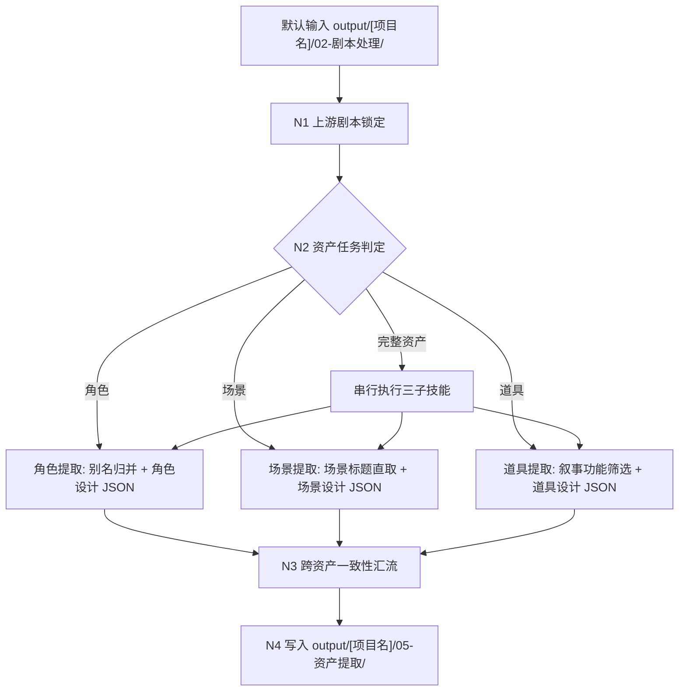
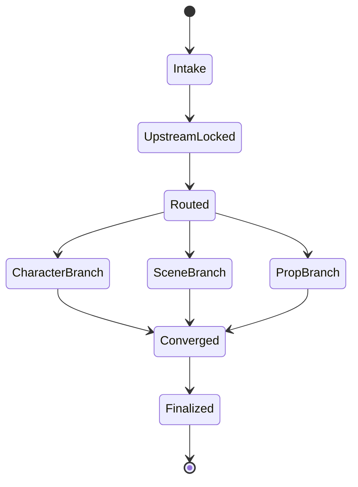
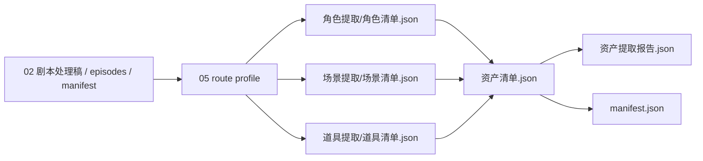

# 05-资产提取

`05-资产提取` 是 BYKJ AIGC 工作流的上游资产提取与设计规格父级导引 skill。它默认读取 `output/[项目名]/02-剧本处理/` 的格式化处理后剧本全本，并路由到角色、场景、道具三个子技能，完成“主体信息提取 -> 设计规格生成 -> JSON 交付”。

本父级只负责输入真源锁定、子技能分发、跨资产汇流和交接边界，不直接替代子技能执行提取判断。

默认输入目录：

`output/[项目名]/02-剧本处理/`

唯一 canonical 输出目录：

`output/[项目名]/05-资产提取/`

## Context Loading Contract

- 每次调用 `$aigc-bykj-asset-extraction`、`05-资产提取` 或本目录 `SKILL.md` 时，必须同时加载同目录 `CONTEXT.md`。
- 若本轮任务通过父级 `$aigc-bykj` 路由进入，必须先遵守父级 `SKILL.md + CONTEXT.md` 的阶段路由，再进入本阶段。
- 进入任一子技能时，必须继续加载对应子目录的 `SKILL.md + CONTEXT.md`。
- 默认输入真源是 `output/[项目名]/02-剧本处理/`，优先加载 `manifest.json -> episodes/ -> 剧本处理稿.json -> 执行报告.json`。
- 冲突优先级：用户显式请求 > 根 `AGENTS.md` > 父级 `aigc-bykj/SKILL.md` > 本 `SKILL.md` > 子技能 `SKILL.md` > 上游 `02-剧本处理` 输出 > 本 `CONTEXT.md` > 子技能 `CONTEXT.md`。
- 核心资产判定、别名合并、叙事功能判断、场景归类、角色/场景/道具设计细目和提示词蒸馏必须由 LLM 直接完成；脚本只允许承担读取、抽取、排序、去重校验、JSON/schema 校验和 manifest 回写等机械辅助。

## Stage Routing

| trigger | route | canonical output |
| --- | --- | --- |
| 用户要求提取角色、人物、出场者、阵营、关系或别名归并 | `角色提取/` | `output/[项目名]/05-资产提取/角色提取/` |
| 用户要求提取场景、地点、场景标题、空间清单或场景索引 | `场景提取/` | `output/[项目名]/05-资产提取/场景提取/` |
| 用户要求提取道具、关键物件、叙事道具、证据、武器、信物、设备 | `道具提取/` | `output/[项目名]/05-资产提取/道具提取/` |
| 用户要求完整资产提取或资产设计 | 依次执行 `角色提取 -> 场景提取 -> 道具提取`，最后汇总 JSON | `output/[项目名]/05-资产提取/资产清单.json` |
| 用户要求 review / repair 已有资产提取结果 | 命中对应子技能；不明时先做父级索引审查 | 原子技能目录最小修复 |

## Topology Contract

## Boundary

- `05` 不改写 `02` 剧本正文，不补剧情，不生成分镜，不提交图片或视频生成任务。
- 角色、场景、道具先作为资产候选被提取，再在同一 JSON 条目中生成设计规格；设计细目参考 `.agents/skills/aigc/7-设计/角色/2-设计`、`.agents/skills/aigc/7-设计/场景/2-设计`、`.agents/skills/aigc/7-设计/道具/2-设计` 的字段口径和画面约束。
- BYKJ `05` 的 canonical 交付格式是 JSON；不默认写入 `projects/aigc/<项目名>/7-设计/.../2-设计/` 的 Markdown 设计稿路径。
- 角色提取必须区分别名并合并同一角色。
- 场景提取默认可以直接汇总自剧本中的场景标题，并保留原标题证据。
- 道具提取只保留重要叙事功能道具；普通环境物、一次性装饰物和无叙事作用的小物件默认不进入主清单。

## Design Reference Contract

| asset type | reference skill | BYKJ JSON design adaptation |
| --- | --- | --- |
| 角色 | `.agents/skills/aigc/7-设计/角色/2-设计` | 提取后补 `design_spec`：身份压力、视觉驱动、角色外观、服装系统、摄影描述、英文提示词；固定为纯色背景全身定妆照 |
| 场景 | `.agents/skills/aigc/7-设计/场景/2-设计` | 提取后补 `design_spec`：research_brief、scene_design、cinematography、prompt_evidence_chain、英文提示词；固定为空镜且无人物 |
| 道具 | `.agents/skills/aigc/7-设计/道具/2-设计` | 提取后补 `design_spec`：研究证据链、物语、photography、prop_design、英文提示词；固定为纯色背景 45 度单道具完整全貌 |
| 全部 | 三个参考技能 | 只消费设计字段、画面约束、LLM-first 与 review gate 口径；不继承其 Markdown 输出路径 |

## Output / Handoff Contract

父级汇总输出必须包含 JSON：

- `资产清单.json`：角色、场景、道具三个子 JSON 的索引和交叉引用。
- `资产提取报告.json`：输入锁定、子技能完成状态、思考过程、阻断项、风险与例外。
- `manifest.json`：输入路径、子输出路径、生成时间、状态和下游交接信息。

子技能输出以各自 `SKILL.md` 的输出合同为准。

## Completion Definition

`05-资产提取` 只有在以下条件同时满足时才可标记 complete：

- 已锁定可读 `02-剧本处理` 输出，或明确报告缺失。
- 已按用户意图路由到正确子技能。
- 完整资产提取任务中，三个子技能均有 pass 或明确记录未执行原因。
- 子技能 JSON 中的每个主条目均包含提取字段和设计规格字段，或明确记录设计阻断原因。
- 汇总索引不制造第二真源，只指向子技能 canonical 输出。
