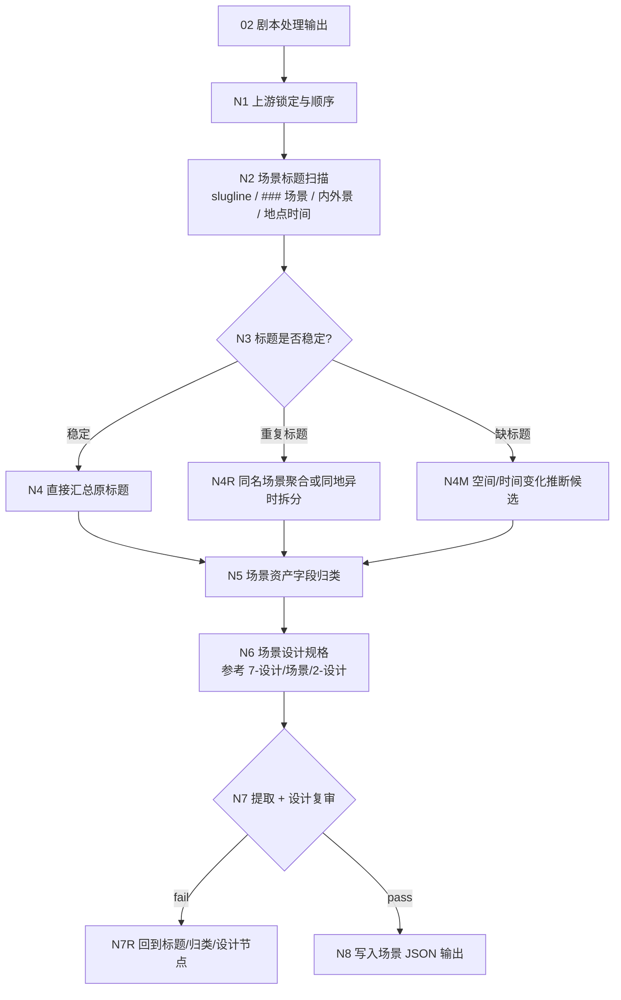
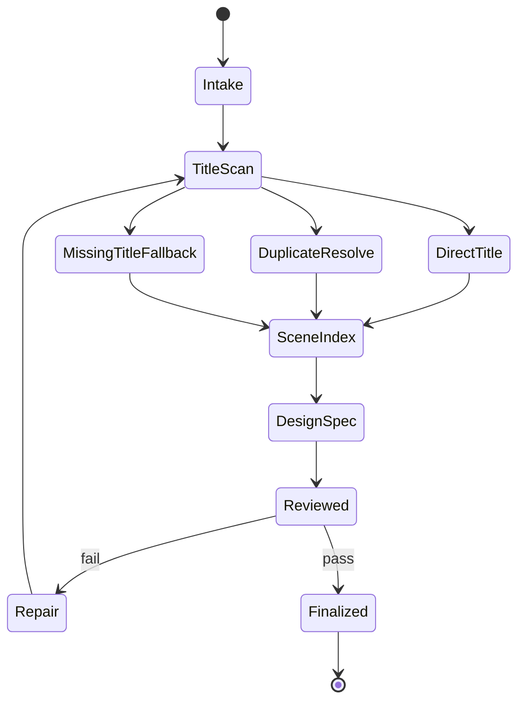
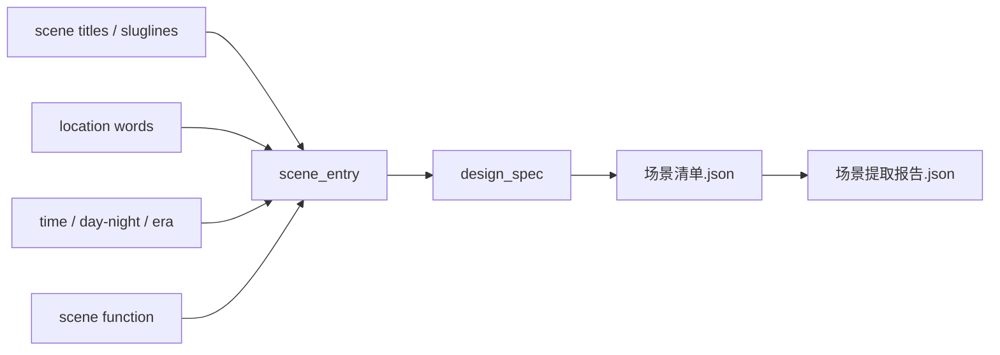

# 场景提取

`场景提取` 从 `output/[项目名]/02-剧本处理/` 的格式化处理后剧本全本中提取场景资产候选，并在同一 JSON 条目中生成场景设计规格。默认以剧本中的场景标题、slugline、空间/时间标题为主证据直接汇总，不重新发明场景名；设计细目参考 `.agents/skills/aigc/7-设计/场景/2-设计` 的场景设计口径。

canonical 输入目录：

`output/[项目名]/02-剧本处理/`

canonical 输出目录：

`output/[项目名]/05-资产提取/场景提取/`

## Context Loading Contract

- 每次调用 `$aigc-bykj-scene-extraction`、`场景提取` 或本目录 `SKILL.md` 时，必须同时加载同目录 `CONTEXT.md`。
- 若通过 `05-资产提取` 或 `$aigc-bykj` 路由进入，必须先遵守父级阶段路由，再进入本子技能。
- 默认读取 `02` 输出中的 `manifest.json -> episodes/ -> 剧本处理稿.json -> 执行报告.json`。
- 冲突优先级：用户显式请求 > 根 `AGENTS.md` > 父级 `aigc-bykj/SKILL.md` > `05-资产提取/SKILL.md` > 本 `SKILL.md` > 上游 `02-剧本处理` 输出 > 本 `CONTEXT.md`。
- 场景标题识别、同场景聚合、空间层级归类、缺失标题修复、场景空间设计、摄影设计和英文提示词蒸馏必须由 LLM 直接完成；脚本只允许承担读取、标题候选抽取、排序、JSON/schema 校验和 manifest 回写。

## Business Requirement Analysis Contract

执行前必须先完成业务需求分析，不得直接按自然段或剧情摘要虚构场景。

| analysis_field | required judgment |
| --- | --- |
| `business_goal` | 从处理后剧本中得到场景清单，并为每个 canonical 场景生成 JSON 设计规格 |
| `business_object` | 输入是单份 `剧本处理稿.json`、上游 `episodes/`、混合 `02` 输出还是已有场景清单 |
| `constraint_profile` | 是否必须保留原标题、是否合并重复标题、是否区分同地异时、是否输出 JSON |
| `success_criteria` | 场景条目可回指原标题和出现范围，空间/时间/功能归类清楚，不改写上游标题，设计规格可回指剧本证据 |
| `topology_fit` | 复杂度主要来自标题识别、重复标题聚合、同地异时拆分、标题缺失回退、跨集覆盖和场景设计规格汇流 |
| `step_strategy` | 使用主干串行 + 条件回退：先抽场景标题，再聚合归类，随后按场景设计参考口径生成 JSON 设计规格 |

## Total Input Contract

Accepted input:

- 默认输入：`output/[项目名]/02-剧本处理/`。
- 用户显式指定某个 `02` 输出目录、`剧本处理稿.json`、`episodes/第N集.json` 或等价格式化剧本文件。
- 已有 `output/[项目名]/05-资产提取/场景提取/` 输出，用户要求 review、repair、补场景或重建索引。

Reject or clarify when:

- 找不到可读 `02` 处理后剧本，且用户没有提供等价剧本文本。
- 用户要求在本阶段生成场景图片、视频、分镜镜头或新增剧情场景。
- 用户要求把剧情 beat、情绪段落或人物状态当作场景标题。

## Topology Contract







## Extraction Rules

### 1. 场景标题优先

以下文本信号默认作为场景主证据：

- `### 场景`、`场景一`、`第N场`、`SCENE N` 等明确场景标题。
- 标准 slugline：内/外、地点、时间、日/夜、季节、天气、空间功能。
- `02-剧本处理` 中由编剧阶段生成的空间/时间切换标题。

必须保留原标题或原 slugline 文本。可以新增 `normalized_name` 方便索引，但不得用规范名替代 `source_title`。

### 2. 重复标题处理

| situation | handling rule |
| --- | --- |
| 同一地点连续出现且时间不变 | 合并为同一 `scene_id`，记录多个出现片段 |
| 同一地点不同时间/天气/状态 | 保持同一 `location_key`，拆为不同 `scene_variant_id` |
| 同名但空间功能不同 | 保持分离，记录歧义 |
| 标题重复但剧情明确回到同一空间 | 合并，记录 first_seen / last_seen |

### 3. 缺标题回退

只有在 `02` 输出缺少明确场景标题时，才允许从以下变化推断候选场景：

- 地点变化、内外景变化、时间跳转、日夜变化、主要环境声变化。
- 角色进入全新空间、动作链离开原空间、场景功能发生明确切换。

推断场景必须标记 `source_title_type: inferred`，并在报告中说明推断依据。

## Scene Design Reference Rules

场景设计规格必须参考 `.agents/skills/aigc/7-设计/场景/2-设计` 的细目设计口径，但 BYKJ `05` 只输出 JSON，不默认生成 Markdown 设计稿。

必填设计子段必须镜像场景 `2-设计/templates/output-template.md`：

- `design_spec.fixed_visual_constraints`：对应「固定画面约束」。
- `design_spec.source_description`：对应「1. 名称 / 首次登场 / 原文描述」。
- `design_spec.research_brief`：对应「2. 研究考据 / Research Brief」，必须包含 `research_questions`、`source_posture`、`evidence_matrix`、`uncertainty_register`、`visual_translation`。
- `design_spec.story_poem`：对应「3. 物语」。
- `design_spec.deconstruction`：对应「4. 解构」，必须包含 `subject_id`、`scene_design`、`cinematography`。
- `design_spec.prompt_design`：对应「5. 提示词设计」，必须包含全局风格、建筑风格、主体 ID、时间地域引用、固定画面约束、prompt evidence chain 和英文整合提示词。
- `design_spec.review_verdict` 与 `design_spec.output_contract_alignment`：对应模板末尾复核和输出合同对齐。

固定画面约束：

- 默认是 `empty shot, no people, no human figures`。
- 不得出现人物、人体局部、剪影、倒影、人群或可识别人类存在。
- 负向约束使用自然语言，不使用 Midjourney `--no` 参数。

## Thinking-Action Node Contract

| node_id | objective | actions | evidence | route_out | gate |
| --- | --- | --- | --- | --- | --- |
| `N1-UPSTREAM-LOCK` | 锁定 `02` 输入和顺序 | 读取 manifest、episodes、剧本处理稿，记录项目名和文件顺序 | `upstream_lock`、`script_order` | `N2-TITLE-SCAN` | 有可读处理后剧本 |
| `N2-TITLE-SCAN` | 扫描场景标题 | 提取 slugline、场景标题、空间/时间标题和出现位置 | `scene_title_map` | `N3-TITLE-STABILITY` | 标题候选可回指 |
| `N3-TITLE-STABILITY` | 判断标题稳定性 | 识别稳定标题、重复标题、缺标题片段 | `title_stability_profile` | `N4/N4R/N4M` | 路由有依据 |
| `N4-DIRECT-SUMMARY` | 直接汇总原标题 | 按原顺序建立场景条目，保留 `source_title` | `direct_scene_index` | `N5-FIELDS` | 不改写原标题 |
| `N4R-DUPLICATE-RESOLVE` | 处理重复标题 | 判断合并、同地异时变体或保持分离 | `duplicate_resolution_table` | `N5-FIELDS` | 合并/拆分都有证据 |
| `N4M-MISSING-FALLBACK` | 缺标题回退推断 | 基于空间/时间变化建立候选，并标 `inferred` | `inferred_scene_table` | `N5-FIELDS` | 不把剧情 beat 当场景 |
| `N5-FIELDS` | 补齐场景资产字段 | 归类地点、时间、功能、氛围、关联角色/道具、下游备注 | `scene_profile_table` | `N6-DESIGN-SPEC` | 字段来自剧本证据 |
| `N6-DESIGN-SPEC` | 生成场景设计规格 | 按 `7-设计/场景/2-设计/templates/output-template.md` 镜像 JSON 子段，写研究考据、物语、解构、提示词、review verdict 和输出对齐 | `scene_design_spec_table` | `N7-REVIEW` | 设计不新增剧情场景，空镜约束正确，子段齐全 |
| `N7-REVIEW` | 复审覆盖、保真和设计 | 检查漏提、改标题、误合并、无证据推断、设计漂移、prompt 约束 | `review_result` | `N7R-REPAIR` 或 `N8-WRITEBACK` | 阻断项清零 |
| `N8-WRITEBACK` | 写入 JSON 输出 | 生成 `场景清单.json`、`场景提取报告.json`、`manifest.json` | `output_manifest` | complete | 路径正确且可下游消费 |

## Output Contract

输出目录必须使用：

`output/[项目名]/05-资产提取/场景提取/`

最低文件：

- `场景清单.json`：结构化场景数据。
- `场景提取报告.json`：输入锁定、思考过程、标题扫描、重复/缺失处理、设计依据、review 结果。
- `manifest.json`：输入和输出索引。

Markdown 只允许作为用户显式要求的派生视图，不是 canonical 输出。

`场景清单.json` 最低字段：

```json
{
  "project_name": "string",
  "source_stage": "02-剧本处理",
  "scenes": [
    {
      "scene_id": "scene-001",
      "source_title": "string",
      "normalized_name": "string",
      "source_title_type": "explicit|slugline|inferred",
      "location_key": "string",
      "time_profile": "string",
      "scene_function": "string",
      "first_seen": "string",
      "last_seen": "string",
      "source_evidence": ["episode/scene reference"],
      "related_characters": ["string"],
      "related_props": ["string"],
      "design_notes_from_script": ["string"],
      "design_spec": {
        "reference_skill": ".agents/skills/aigc/7-设计/场景/2-设计",
        "subject_id": "scene-001",
        "template_mapping": "7-设计/场景/2-设计/templates/output-template.md",
        "fixed_visual_constraints": {
          "frame_constraint": "pure empty shot / empty establishing space",
          "human_presence": "no people, no human figures, no body parts, no silhouettes, no reflections of people",
          "prompt_must_include": "empty shot, no people, no human figures"
        },
        "source_description": {
          "name": "string",
          "first_seen": "string",
          "original_description": "string"
        },
        "research_brief": {
          "research_questions": ["string"],
          "source_posture": {
            "project_source": ["string"],
            "user_source": ["string"],
            "common_knowledge": ["string"],
            "scene_inference": ["string"],
            "web_source": ["not_used|string"],
            "unresolved": ["string"]
          },
          "evidence_matrix": [
            {
              "claim": "string",
              "posture": "project_source|user_source|common_knowledge|scene_inference|web_source|unresolved",
              "design_impact": "string",
              "confidence": "high|medium|low"
            }
          ],
          "uncertainty_register": [
            {
              "uncertainty": "string",
              "risk": "string",
              "handling": "string"
            }
          ],
          "visual_translation": [
            {
              "evidence_or_inference": "string",
              "visible_design": "string",
              "prompt_token_target": "string"
            }
          ]
        },
        "story_poem": "string",
        "deconstruction": {
          "subject_id_line": "主体ID号：scene-001",
          "scene_design": {
            "style_backbone": "string",
            "design_type": "string",
            "master_typology_reference": "string",
            "concept_translation": "string",
            "style_detail": "string",
            "period_and_region": "string",
            "function": "string",
            "spatial_layout": "string",
            "space_type": "string",
            "material_detail": "string",
            "structural_detail": "string",
            "circulation_plan": "string",
            "color_theme": "string",
            "cultural_elements": {
              "symbolic_design": "string",
              "ornament_pattern": "string"
            },
            "interior_only": {
              "lighting_design": "string",
              "fixture_design": "string",
              "furniture_design": "string",
              "wall_decor": "string",
              "floor_material": "string"
            },
            "landscape_only": {
              "ecology_design": "string",
              "water_design": "string",
              "art_installation": "string"
            },
            "atmosphere": "string",
            "weather": "string",
            "season_and_time": "string"
          },
          "cinematography": {
            "shot_size": "string",
            "lens_type": "string",
            "camera_angle": "string",
            "composition_layout": "string",
            "composition_method": "string",
            "human_presence": "none, pure empty shot",
            "shape_sense": "string",
            "line_sense": "string",
            "tonal_sense": "string",
            "focus_sense": "string",
            "rhythm_sense": "string",
            "texture_and_surface": "string",
            "momentum": "string",
            "lighting_setup": {
              "key_light": "string",
              "fill_light": "string",
              "back_light": "string",
              "lighting_type": "string"
            },
            "color": {
              "hue": "string",
              "value": "string",
              "saturation": "string",
              "temperature": "string",
              "color_psychology": "string"
            },
            "camera_specifications": {
              "camera_body": "string",
              "aperture": "string",
              "shutter": "string",
              "iso": "string",
              "focal_length": "string",
              "resolution": "string"
            }
          }
        },
        "prompt_design": {
          "global_style_prompt_reference": "string",
          "architecture_style_reference": "string",
          "subject_id": "scene-001",
          "time_region_reference": "string",
          "fixed_visual_constraints": "pure empty shot, no people, no human figures, no silhouettes, no reflections of people",
          "prompt_evidence_chain": [
            {
              "prompt_token_group": "string",
              "evidence_source": "string",
              "visual_translation": "string",
              "uncertainty_handling": "string"
            }
          ],
          "period_region_tokens": ["string"],
          "english_prompt": "scene-001: ..."
        },
        "review_verdict": {
          "verdict": "pending|pass|needs_rework",
          "source_item": "string",
          "prompt_character_count": 0,
          "research_brief_status": "pending|pass|fail",
          "source_posture_status": "pending|pass|fail",
          "uncertainty_status": "pending|pass|fail",
          "prompt_evidence_chain_status": "pending|pass|fail",
          "fixed_visual_status": "pending|pass|fail",
          "notes": "string"
        },
        "output_contract_alignment": {
          "required_output": "single scene design spec in JSON",
          "output_format": "JSON object mirroring scene output template",
          "completion_gate": ["string"]
        }
      },
      "confidence": "high|medium|low"
    }
  ]
}
```

## SKILL.md Review Gate Configuration

| Review Question | Review Gate | Fail Code | Rework Target | Report Evidence |
| --- | --- | --- | --- | --- |
| 是否锁定了 `02-剧本处理` 输出？ | 未锁定则阻断 | `FAIL-05-SCENE-UPSTREAM` | `N1-UPSTREAM-LOCK` | `upstream_lock` |
| 是否优先从场景标题/slugline 提取？ | 跳过标题直接摘要则阻断 | `FAIL-05-SCENE-TITLE-SCAN` | `N2-TITLE-SCAN` | `scene_title_map` |
| 是否保留原标题？ | 改写或替换 `source_title` 则阻断 | `FAIL-05-SCENE-TITLE-FIDELITY` | `N4-DIRECT-SUMMARY` | `direct_scene_index` |
| 重复标题是否正确合并或拆分？ | 无证据合并/拆分则阻断 | `FAIL-05-SCENE-DUPLICATE` | `N4R-DUPLICATE-RESOLVE` | `duplicate_resolution_table` |
| 推断场景是否只用于缺标题片段？ | 有标题仍凭剧情 beat 另造场景则阻断 | `FAIL-05-SCENE-INFERRED` | `N4M-MISSING-FALLBACK` | `inferred_scene_table` |
| 输出是否可供下游场景设计消费？ | 缺 source_title、location_key、source_evidence 则阻断 | `FAIL-05-SCENE-OUTPUT` | `N5/N8` | `场景清单.json` schema check |
| 每个场景是否生成了模板子段镜像 JSON 设计规格？ | 缺 `fixed_visual_constraints/source_description/research_brief/story_poem/deconstruction/prompt_design/review_verdict/output_contract_alignment` 任一子段则阻断 | `FAIL-05-SCENE-DESIGN` | `N6-DESIGN-SPEC` | `scene_design_spec_table` |
| 场景画面约束是否符合纯空镜？ | prompt / cinematography 出现人物或人群则阻断 | `FAIL-05-SCENE-EMPTY-SHOT` | `N6-DESIGN-SPEC` | `场景清单.json.design_spec.prompt_design` |

## Completion Definition

本子技能只有在以下条件同时满足时才可 complete：

- `02` 全本覆盖范围明确。
- 所有明确场景标题或 slugline 已提取并保留原标题。
- 重复标题和同地异时情况已处理。
- 缺标题推断均标记为 `inferred` 并有依据。
- 每个 canonical 场景都有 `design_spec`，且按场景 `2-设计` 模板子段镜像展开，设计字段可回指剧本证据或明确标注推断边界。
- 输出为 JSON canonical 文件，不以 Markdown 清单或 Markdown 设计稿作为主真源。
- 输出文件齐备，并在执行报告中包含思考过程和风险例外。
