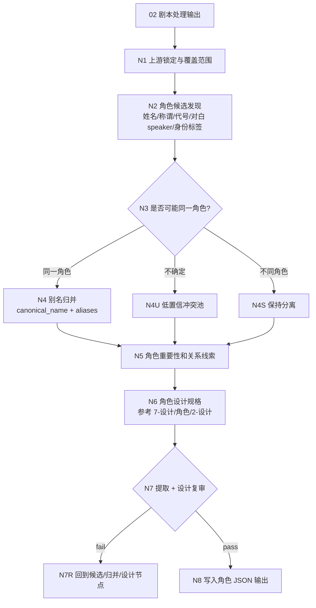
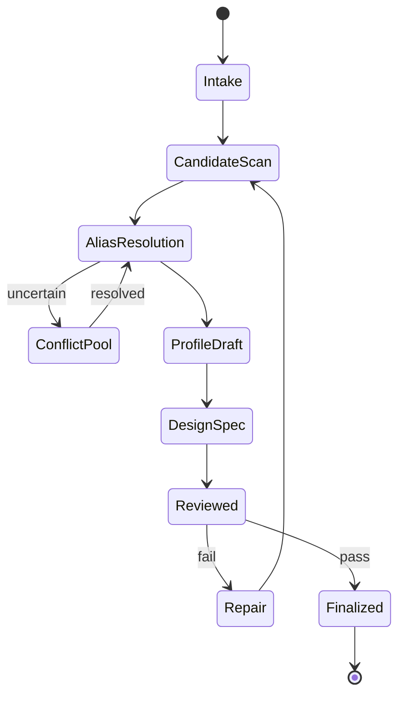
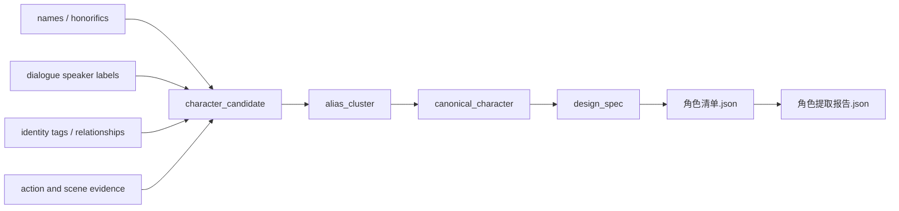

# 角色提取

`角色提取` 从 `output/[项目名]/02-剧本处理/` 的格式化处理后剧本全本中提取角色资产候选，并在同一 JSON 条目中生成角色设计规格。重点解决同一角色的姓名、称谓、代号、身份标签和对白归属别名归并问题，再参考 `.agents/skills/aigc/7-设计/角色/2-设计` 的细目口径完成可供后续生成消费的角色设计字段。

canonical 输入目录：

`output/[项目名]/02-剧本处理/`

canonical 输出目录：

`output/[项目名]/05-资产提取/角色提取/`

## Context Loading Contract

- 每次调用 `$aigc-bykj-character-extraction`、`角色提取` 或本目录 `SKILL.md` 时，必须同时加载同目录 `CONTEXT.md`。
- 若通过 `05-资产提取` 或 `$aigc-bykj` 路由进入，必须先遵守父级阶段路由，再进入本子技能。
- 默认读取 `02` 输出中的 `manifest.json -> episodes/ -> 剧本处理稿.json -> 执行报告.json`。
- 冲突优先级：用户显式请求 > 根 `AGENTS.md` > 父级 `aigc-bykj/SKILL.md` > `05-资产提取/SKILL.md` > 本 `SKILL.md` > 上游 `02-剧本处理` 输出 > 本 `CONTEXT.md`。
- 角色识别、别名归并、关系判断、角色重要性分级、角色外观/服装/摄影设计和英文提示词蒸馏必须由 LLM 直接完成；脚本只允许承担读取、候选抽取、频次统计、排序、JSON/schema 校验和 manifest 回写。

## Business Requirement Analysis Contract

执行前必须先完成业务需求分析，不得直接把所有人名堆成列表。

| analysis_field | required judgment |
| --- | --- |
| `business_goal` | 从处理后剧本中得到角色资产清单，并为每个 canonical 角色生成 JSON 设计规格 |
| `business_object` | 输入是单份 `剧本处理稿.json`、上游 `episodes/`、混合 `02` 输出还是已有角色清单 |
| `constraint_profile` | 是否需要严格合并别名、是否保留低置信候选、是否输出 JSON、是否只 review/repair |
| `success_criteria` | 同一角色只保留一个 canonical 条目，别名证据可追溯，角色重要性和出场范围清楚，设计规格可回指剧本证据 |
| `topology_fit` | 复杂度主要来自候选发现、别名归并、对白归属、关系线索、跨集一致性、低置信冲突和设计规格汇流 |
| `step_strategy` | 使用混合型思行网络：先锁定 `02` 全本，再候选抽取和别名归并，随后按角色设计参考口径生成 JSON 设计规格 |

## Total Input Contract

Accepted input:

- 默认输入：`output/[项目名]/02-剧本处理/`。
- 用户显式指定某个 `02` 输出目录、`剧本处理稿.json`、`episodes/第N集.json` 或等价格式化剧本文件。
- 已有 `output/[项目名]/05-资产提取/角色提取/` 输出，用户要求 review、repair、补别名或合并角色。

Reject or clarify when:

- 找不到可读 `02` 处理后剧本，且用户没有提供等价剧本文本。
- 用户要求在本阶段生成角色图片、角色海报、三视图图片或新增人物关系剧情。
- 用户要求删除或合并角色但未给证据，且上游剧本证据显示冲突。

## Topology Contract







## Extraction Rules

### 1. 候选来源

必须同时扫描以下信号：

- 人名、姓氏、全名、昵称、绰号、职务称谓、亲属称谓、组织身份、代号。
- 对白 speaker 标签、动作字段中的执行主体、表情特写主体、内心独白主体。
- 关系描述、阵营描述、出场场景、道具持有者和被他人称呼方式。

### 2. 别名合并规则

满足下列任一高置信条件时，默认合并为同一角色：

- 同一场景内称谓、姓名和对白 speaker 指向同一行动主体。
- 上下文明确写出“X 就是 Y”“X 被称为 Y”“Y 是 X 的代号/称呼/身份”。
- 亲属称谓或职务称谓在连续场景中稳定指向同一人，且没有竞争主体。
- 某别名只在该角色已出现的场景和关系网络中出现，行动/对白连续。

必须保持分离或进入低置信池：

- 同名不同人、同姓不同人、同职务多人、群体称谓不唯一。
- “父亲/母亲/队长/老板/医生”等称谓没有明确绑定姓名。
- 代号、面具身份、误认身份存在剧情悬念，提前合并会剧透或破坏上游事实。

### 3. 角色重要性分级

| level | criteria |
| --- | --- |
| `lead` | 贯穿多场/多集，拥有明确行动目标、关系变化或主观视角 |
| `major` | 推动关键事件、冲突、信息释放或情感转折 |
| `supporting` | 多次出现或承担稳定关系/场景功能 |
| `minor` | 短暂出现但有明确身份、对白或动作 |
| `group` | 群体、组织、无名队伍，不拆为个体 |

## Character Design Reference Rules

角色设计规格必须参考 `.agents/skills/aigc/7-设计/角色/2-设计` 的细目设计口径，但 BYKJ `05` 只输出 JSON，不默认生成 Markdown 设计稿。

必填设计子段必须镜像角色 `2-设计/templates/output-template.md`：

- `design_spec.fixed_visual_constraints`：对应「固定画面约束」。
- `design_spec.source_description`：对应「1. 名称 / 首次登场 / 原文描述」。
- `design_spec.research`：对应「2. 研究考据」，必须包含 `identity_evidence`、`occupation_class_evidence`、`region_era_evidence`、`costume_craft_evidence`、`body_posture_evidence`、`taboo_safety_constraints`、`uncertainty_notes`、`prompt_evidence_chain`。
- `design_spec.story_poem`：对应「3. 物语」。
- `design_spec.deconstruction`：对应「4. 解构」，必须包含 `subject_id`、`identity_story_pressure`、`visual_drivers`、`detailed_character_design`、`detailed_costume_design`、`cinematography`。
- `design_spec.prompt_design`：对应「5. 提示词设计」，必须包含全局风格引用、服装风格引用、主体 ID、固定画面约束、英文整合提示词。
- `design_spec.review_verdict`：对应「Review Verdict」。

固定画面约束：

- 默认是 `full-body costume fitting photo, solid color background, no scene environment`。
- 不得把角色置入剧情场景、街景、建筑、室内陈设、人群或复杂环境。
- 负向约束使用自然语言，不使用 Midjourney `--no` 参数。

## Thinking-Action Node Contract

| node_id | objective | actions | evidence | route_out | gate |
| --- | --- | --- | --- | --- | --- |
| `N1-UPSTREAM-LOCK` | 锁定 `02` 输入和覆盖范围 | 读取 manifest、episodes、剧本处理稿，记录项目名和文件顺序 | `upstream_lock`、`coverage_scope` | `N2-CANDIDATE-SCAN` | 有可读处理后剧本 |
| `N2-CANDIDATE-SCAN` | 发现所有角色候选 | 扫描姓名、称谓、speaker、动作主体、身份和关系信号 | `character_candidate_table` | `N3-ALIAS-TEST` | 候选来源可回指 |
| `N3-ALIAS-TEST` | 判断候选间是否同人 | 比较场景、对白、行动连续性、称谓绑定、关系网络 | `alias_evidence_map` | `N4-MERGE/N4U-CONFLICT/N4S-SPLIT` | 合并/分离都有证据 |
| `N4-MERGE` | 建立 canonical 角色条目 | 选择 canonical_name，记录 aliases、confidence、first_seen、last_seen | `alias_cluster_table` | `N5-PROFILE` | 同一角色只保留一个主条目 |
| `N4U-CONFLICT` | 保留低置信冲突 | 标注冲突原因、所需证据、暂不合并策略 | `uncertain_alias_pool` | `N5-PROFILE` | 不强行合并 |
| `N5-PROFILE` | 补齐角色资产字段 | 分级、出场范围、关系线索、视觉/表演线索、下游备注 | `character_profile_table` | `N6-DESIGN-SPEC` | 字段来自剧本证据 |
| `N6-DESIGN-SPEC` | 生成角色设计规格 | 按 `7-设计/角色/2-设计/templates/output-template.md` 镜像 JSON 子段，写研究考据、物语、解构、提示词和 review verdict | `character_design_spec_table` | `N7-REVIEW` | 设计不新增剧情事实，画面约束正确，子段齐全 |
| `N7-REVIEW` | 复审归并、覆盖和设计 | 检查漏提、误合并、重复角色、无证据字段、设计漂移、prompt 约束 | `review_result` | `N7R-REPAIR` 或 `N8-WRITEBACK` | 阻断项清零 |
| `N8-WRITEBACK` | 写入 JSON 输出 | 生成 `角色清单.json`、`角色提取报告.json`、`manifest.json` | `output_manifest` | complete | 路径正确且可下游消费 |

## Output Contract

输出目录必须使用：

`output/[项目名]/05-资产提取/角色提取/`

最低文件：

- `角色清单.json`：结构化角色数据。
- `角色提取报告.json`：输入锁定、思考过程、别名归并依据、设计依据、低置信池、review 结果。
- `manifest.json`：输入和输出索引。

Markdown 只允许作为用户显式要求的派生视图，不是 canonical 输出。

`角色清单.json` 最低字段：

```json
{
  "project_name": "string",
  "source_stage": "02-剧本处理",
  "characters": [
    {
      "character_id": "char-001",
      "canonical_name": "string",
      "aliases": ["string"],
      "importance": "lead|major|supporting|minor|group",
      "first_seen": "string",
      "last_seen": "string",
      "source_evidence": ["episode/scene/quote reference"],
      "relationship_hints": ["string"],
      "visual_or_performance_hints": ["string"],
      "design_spec": {
        "reference_skill": ".agents/skills/aigc/7-设计/角色/2-设计",
        "subject_id": "char-001",
        "template_mapping": "7-设计/角色/2-设计/templates/output-template.md",
        "fixed_visual_constraints": {
          "format": "full-body costume fitting photo",
          "background": "solid color background",
          "scene_placement": "no scene environment, no architecture, no street, no interior set, no props-heavy background",
          "prompt_must_include": "full-body costume fitting photo, solid color background, no scene environment"
        },
        "source_description": {
          "name": "string",
          "first_seen": "string",
          "original_description": "string"
        },
        "research": {
          "identity_evidence": {
            "evidence": "string",
            "design_decision": "string",
            "prompt_phrase": "string"
          },
          "occupation_class_evidence": {
            "evidence": "string",
            "design_decision": "string",
            "prompt_phrase": "string"
          },
          "region_era_evidence": {
            "evidence": "string",
            "design_decision": "string",
            "prompt_phrase": "string"
          },
          "costume_craft_evidence": {
            "evidence": "string",
            "design_decision": "string",
            "prompt_phrase": "string"
          },
          "body_posture_evidence": {
            "evidence": "string",
            "design_decision": "string",
            "prompt_phrase": "string"
          },
          "taboo_safety_constraints": {
            "project_taboos": ["string"],
            "cultural_identity_risks": ["string"],
            "visual_guardrails": ["full-body costume fitting photo", "solid color background", "no scene environment"]
          },
          "uncertainty_notes": {
            "confirmed_from_list": ["string"],
            "inferred_by_llm": ["string"],
            "needs_confirmation": ["string"],
            "confidence": "high|medium|low"
          },
          "prompt_evidence_chain": [
            {
              "evidence": "string",
              "design_decision": "string",
              "prompt_phrase": "string"
            }
          ]
        },
        "story_poem": "string",
        "deconstruction": {
          "subject_id_line": "主体ID号：char-001",
          "identity_story_pressure": {
            "identity_hook": "string",
            "narrative_tension": "string",
            "power_relationship_axis": "string",
            "differentiation_axes": ["string"]
          },
          "visual_drivers": {
            "style_backbone": "string",
            "character_style": "string",
            "reference": "string",
            "face_signature": "string",
            "hair_signature": "string",
            "silhouette_build": "string",
            "costume_system": "string",
            "accessories_continuity": "string",
            "design_guardrails": ["string"],
            "research_transfer": "string"
          },
          "detailed_character_design": {
            "reference": "string",
            "age": "string",
            "species_ethnicity": "string",
            "gender": "string",
            "occupation": "string",
            "face": {
              "makeup": "string",
              "face_shape": "string",
              "bone_structure": "string",
              "eyes": "string",
              "eyelashes": "string",
              "brows": "string",
              "nose": "string",
              "mouth": "string"
            },
            "hair": {
              "style": "string",
              "length": "string",
              "color": "string",
              "texture": "string",
              "hairline": "string",
              "temple_hair": "string"
            },
            "body": {
              "overall_style": "string",
              "height": "string",
              "weight": "string",
              "build": "string",
              "posture": "string",
              "proportion": "string",
              "upper_body": {
                "arms": "string",
                "fingers": "string"
              },
              "lower_body": {
                "legs": "string",
                "feet": "string"
              }
            },
            "personality": {
              "constellation": "string",
              "blood_type": "string",
              "spirit": "string",
              "emotional_profile": "string",
              "interests": "string",
              "inner_state": "string",
              "identity_core": "string"
            }
          },
          "detailed_costume_design": {
            "era": "string",
            "designer_brand_reference": "string",
            "styling_direction": "string",
            "cultural_elements": "string",
            "type": "string",
            "material_attribute": "string",
            "craft_logic": "string",
            "wear_aging_logic": "string",
            "wearing_details": {
              "head": "string",
              "upper_body": "string",
              "lower_body": "string",
              "footwear": "string"
            }
          },
          "cinematography": {
            "format": "full-body costume fitting photo",
            "shot_size": "full body",
            "background": "solid color background",
            "scene_placement": "no scene environment",
            "composition": "string",
            "camera_setup": "string",
            "midjourney_v8_parameters": "string"
          }
        },
        "prompt_design": {
          "global_style_prompt_reference": "string",
          "costume_style_reference": "string",
          "subject_id": "char-001",
          "fixed_visual_constraints": "full-body costume fitting photo, solid color background, no scene environment",
          "english_prompt": "char-001: ..."
        },
        "review_verdict": {
          "verdict": "pending|pass|needs_rework",
          "source_item": "string",
          "prompt_character_count": 0,
          "research_layer": {
            "identity": "pending|pass|fail",
            "occupation_class": "pending|pass|fail",
            "region_era": "pending|pass|fail",
            "costume_craft": "pending|pass|fail",
            "body_posture": "pending|pass|fail",
            "taboo_constraints": "pending|pass|fail",
            "uncertainty_notes": "pending|pass|fail",
            "prompt_evidence_chain": "pending|pass|fail"
          },
          "notes": "string"
        },
        "design_evidence": ["episode/scene reference"],
        "uncertainty_notes": ["string"]
      },
      "confidence": "high|medium|low",
      "notes": "string"
    }
  ],
  "uncertain_alias_pool": []
}
```

## SKILL.md Review Gate Configuration

| Review Question | Review Gate | Fail Code | Rework Target | Report Evidence |
| --- | --- | --- | --- | --- |
| 是否锁定了 `02-剧本处理` 输出而非旧源？ | 未锁定则阻断 | `FAIL-05-CHAR-UPSTREAM` | `N1-UPSTREAM-LOCK` | `upstream_lock` |
| 是否扫描了姓名、称谓、speaker 和动作主体？ | 任一关键来源缺失则阻断 | `FAIL-05-CHAR-CANDIDATE` | `N2-CANDIDATE-SCAN` | `character_candidate_table` |
| 同一角色是否完成别名合并？ | 明确同人仍重复则阻断 | `FAIL-05-CHAR-ALIAS-MERGE` | `N3/N4` | `alias_evidence_map` |
| 不确定别名是否进入低置信池而非强行合并？ | 无证据强合并则阻断 | `FAIL-05-CHAR-UNCERTAIN` | `N4U-CONFLICT` | `uncertain_alias_pool` |
| 输出是否可供下游设计消费？ | 缺 canonical_name、importance、source_evidence 则阻断 | `FAIL-05-CHAR-OUTPUT` | `N5/N8` | `角色清单.json` schema check |
| 每个角色是否生成了模板子段镜像 JSON 设计规格？ | 缺 `fixed_visual_constraints/source_description/research/story_poem/deconstruction/prompt_design/review_verdict` 任一子段则阻断 | `FAIL-05-CHAR-DESIGN` | `N6-DESIGN-SPEC` | `character_design_spec_table` |
| 角色画面约束是否符合定妆照？ | prompt / cinematography 进入剧情场景则阻断 | `FAIL-05-CHAR-FITTING-PHOTO` | `N6-DESIGN-SPEC` | `角色清单.json.design_spec.prompt_design` |

## Completion Definition

本子技能只有在以下条件同时满足时才可 complete：

- `02` 全本覆盖范围明确。
- 所有角色候选都有保留、合并、分离或低置信处理结果。
- 每个 canonical 角色都有来源证据和重要性分级。
- 同一角色不以多个主条目重复出现。
- 每个 canonical 角色都有 `design_spec`，且按角色 `2-设计` 模板子段镜像展开，设计字段可回指剧本证据或明确标注推断边界。
- 输出为 JSON canonical 文件，不以 Markdown 清单或 Markdown 设计稿作为主真源。
- 输出文件齐备，并在执行报告中包含思考过程和风险例外。
