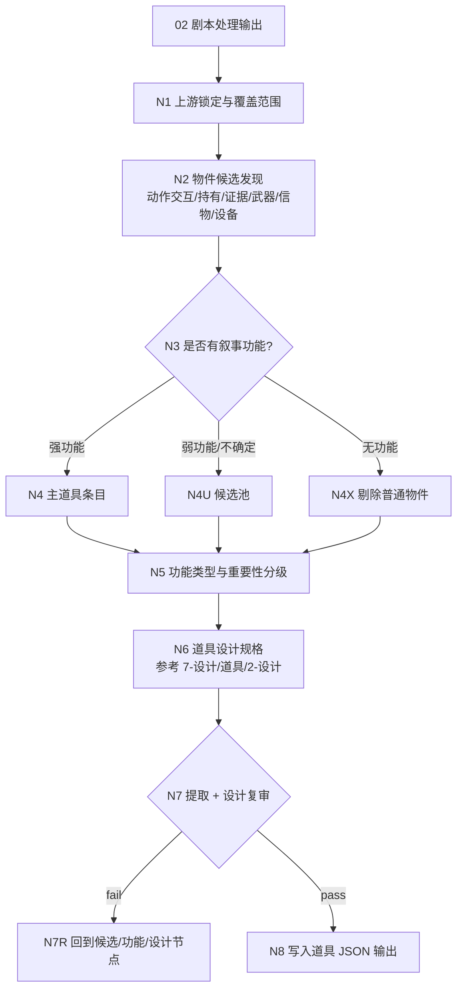
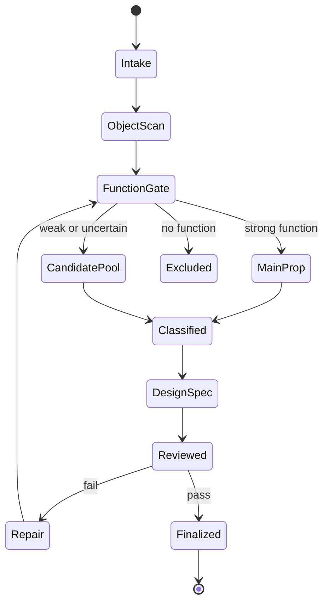
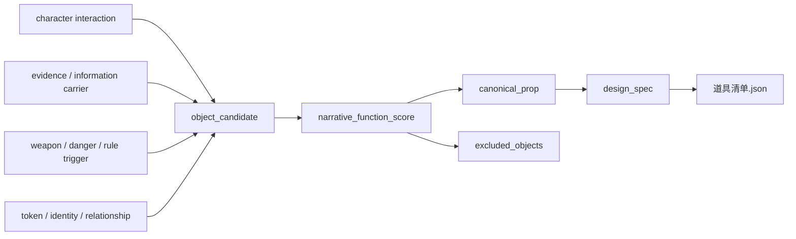

# 道具提取

`道具提取` 从 `output/[项目名]/02-剧本处理/` 的格式化处理后剧本全本中提取重要叙事功能道具，并在同一 JSON 条目中生成道具设计规格。它不提取所有物件，只保留对剧情、人物关系、信息释放、规则、危险、身份、仪式或镜头动作具有明确功能的道具资产候选；设计细目参考 `.agents/skills/aigc/7-设计/道具/2-设计` 的道具设计口径。

canonical 输入目录：

`output/[项目名]/02-剧本处理/`

canonical 输出目录：

`output/[项目名]/05-资产提取/道具提取/`

## Context Loading Contract

- 每次调用 `$aigc-bykj-prop-extraction`、`道具提取` 或本目录 `SKILL.md` 时，必须同时加载同目录 `CONTEXT.md`。
- 若通过 `05-资产提取` 或 `$aigc-bykj` 路由进入，必须先遵守父级阶段路由，再进入本子技能。
- 默认读取 `02` 输出中的 `manifest.json -> episodes/ -> 剧本处理稿.json -> 执行报告.json`。
- 冲突优先级：用户显式请求 > 根 `AGENTS.md` > 父级 `aigc-bykj/SKILL.md` > `05-资产提取/SKILL.md` > 本 `SKILL.md` > 上游 `02-剧本处理` 输出 > 本 `CONTEXT.md`。
- 道具候选判断、叙事功能评分、普通物件剔除、重要性分级、道具造型/摄影设计和英文提示词蒸馏必须由 LLM 直接完成；脚本只允许承担读取、候选抽取、频次统计、排序、JSON/schema 校验和 manifest 回写。

## Business Requirement Analysis Contract

执行前必须先完成业务需求分析，不得把剧本里出现的所有物件都列入道具清单。

| analysis_field | required judgment |
| --- | --- |
| `business_goal` | 从处理后剧本中得到关键叙事道具清单，并为每个主道具生成 JSON 设计规格 |
| `business_object` | 输入是单份 `剧本处理稿.json`、上游 `episodes/`、混合 `02` 输出还是已有道具清单 |
| `constraint_profile` | 是否只保留关键道具、是否允许低置信候选池、是否区分普通环境物和叙事道具 |
| `success_criteria` | 主清单只含有叙事功能的道具，剔除理由清楚，功能类型和首次/关键出现可回指，设计规格可回指剧本证据 |
| `topology_fit` | 复杂度主要来自候选发现、功能判断、普通物件剔除、复现/互动证据、跨集归并和道具设计规格汇流 |
| `step_strategy` | 使用条件树形思行网络：先发现物件候选，再过叙事功能门，随后按道具设计参考口径生成 JSON 设计规格 |

## Total Input Contract

Accepted input:

- 默认输入：`output/[项目名]/02-剧本处理/`。
- 用户显式指定某个 `02` 输出目录、`剧本处理稿.json`、`episodes/第N集.json` 或等价格式化剧本文件。
- 已有 `output/[项目名]/05-资产提取/道具提取/` 输出，用户要求 review、repair、补关键道具或压缩普通物件。

Reject or clarify when:

- 找不到可读 `02` 处理后剧本，且用户没有提供等价剧本文本。
- 用户要求在本阶段生成道具图片、三视图图片、视频或新增剧情道具。
- 用户要求“所有出现过的物品全部提取”为主清单；可提供 `excluded_objects` 附录，但主清单仍只保留叙事功能道具。

## Topology Contract







## Extraction Rules

### 1. 可进入主清单的叙事功能

道具必须至少满足一项强功能，才进入主清单：

| function_type | criteria |
| --- | --- |
| `evidence` | 承载线索、证据、真相、误导、记录、文件、照片、录音、信件、账本 |
| `plot_trigger` | 触发行动、冲突、追逐、交换、寻找、隐藏、破坏或剧情转折 |
| `rule_or_power` | 代表世界观规则、能力、禁忌、技术系统、仪式或组织权限 |
| `weapon_or_danger` | 造成威胁、伤害、防御、追杀、事故或危险升级 |
| `identity_token` | 标识身份、阶层、阵营、伪装、代号、血缘或社会关系 |
| `relationship_token` | 承载承诺、背叛、纪念、亲密、亏欠、遗愿或情感转折 |
| `repeated_interaction` | 多次出现并被角色操作、争夺、交接、藏匿、修复或毁坏 |
| `visual_anchor` | 成为关键画面、尾钩、高潮、悬念或下游设计必须保留的视觉锚点 |

### 2. 默认不进入主清单的普通物件

以下物件默认剔除，除非上游剧本明确赋予叙事功能：

- 普通桌椅、门窗、杯子、衣物、路灯、车辆、背景陈设。
- 只出现一次且无人交互、无信息、无关系、无危险、无镜头锚点的物件。
- 环境气氛的一部分，例如灰尘、雨水、杂物、家具材质。
- 只是动作用语承托的临时物件，例如“拿起一支笔”但笔不承载信息或后果。

剔除物可以进入 `excluded_objects`，但不得污染 `props` 主数组。

### 3. 叙事功能评分

| score | meaning |
| --- | --- |
| `5` | 核心道具；没有它剧情、真相、身份、规则或高潮会改变 |
| `4` | 关键道具；推动重要行动、关系或信息释放 |
| `3` | 有功能道具；明确被操作并承载局部叙事作用 |
| `2` | 弱功能候选；可能有用但证据不足，进入候选池 |
| `1` | 普通物件；只进剔除列表或不记录 |

主清单默认只收 `score >= 3`。

## Prop Design Reference Rules

道具设计规格必须参考 `.agents/skills/aigc/7-设计/道具/2-设计` 的细目设计口径，但 BYKJ `05` 只输出 JSON，不默认生成 Markdown 设计稿。

必填设计子段必须镜像道具 `2-设计/templates/output-template.md`：

- `design_spec.fixed_visual_constraints`：对应「固定画面约束」。
- `design_spec.source_description`：对应「1. 名称 / 首次登场 / 原文描述」。
- `design_spec.research`：对应「2. 研究考据」，必须包含 `research_evidence_chain` 与 `research_translation_checklist`。
- `design_spec.story_poem`：对应「3. 物语」。
- `design_spec.deconstruction`：对应「4. 解构」，必须包含 `subject_id`、`photography`、`prop_design`。
- `design_spec.prompt_design`：对应「5. 提示词设计」，必须包含全局风格、物品风格、主体 ID、固定画面约束、prompt evidence chain 和英文整合提示词。
- `design_spec.review_verdict` 与 `design_spec.output_contract_alignment`：对应模板末尾复核和输出合同对齐。

固定画面约束：

- 默认是 `full-view prop shot, 45-degree view, full prop in view, entire prop fully visible, uncropped full silhouette, prop only, solid color background, no people, no background elements, no scene environment`。
- 不得出现人物、手持、桌面环境、室内陈设、街景、局部特写、裁切特写或半截道具。
- 负向约束使用自然语言，不使用 Midjourney `--no` 参数。

## Thinking-Action Node Contract

| node_id | objective | actions | evidence | route_out | gate |
| --- | --- | --- | --- | --- | --- |
| `N1-UPSTREAM-LOCK` | 锁定 `02` 输入和覆盖范围 | 读取 manifest、episodes、剧本处理稿，记录项目名和文件顺序 | `upstream_lock`、`coverage_scope` | `N2-OBJECT-SCAN` | 有可读处理后剧本 |
| `N2-OBJECT-SCAN` | 发现物件候选 | 扫描动作交互、持有、交换、证据、武器、信物、设备、视觉锚点 | `object_candidate_table` | `N3-FUNCTION-GATE` | 候选来源可回指 |
| `N3-FUNCTION-GATE` | 判断叙事功能 | 按八类功能和评分标准判定主清单、候选池或剔除 | `narrative_function_matrix` | `N4/N4U/N4X` | 每个主道具有功能证据 |
| `N4-MAIN-PROP` | 建立 canonical 道具条目 | 选择 canonical_name，记录 aliases、holder、first_seen、key_scenes | `prop_entry_table` | `N5-CLASSIFY` | 主条目不重复 |
| `N4U-CANDIDATE` | 保留弱功能候选 | 标注缺失证据和后续复核条件 | `weak_prop_candidate_pool` | `N5-CLASSIFY` | 不把弱候选混入主清单 |
| `N4X-EXCLUDE` | 剔除普通物件 | 记录代表性剔除理由，必要时输出附录 | `excluded_objects` | `N5-CLASSIFY` | 普通物件不污染主清单 |
| `N5-CLASSIFY` | 补齐功能和重要性字段 | 标注 function_type、score、叙事作用、关联角色/场景、下游备注 | `prop_profile_table` | `N6-DESIGN-SPEC` | 字段来自剧本证据 |
| `N6-DESIGN-SPEC` | 生成道具设计规格 | 按 `7-设计/道具/2-设计/templates/output-template.md` 镜像 JSON 子段，写研究考据、物语、解构、提示词、review verdict 和输出对齐 | `prop_design_spec_table` | `N7-REVIEW` | 设计不新增剧情道具，完整全貌约束正确，子段齐全 |
| `N7-REVIEW` | 复审功能门、覆盖和设计 | 检查漏提关键道具、普通物件混入、无证据评分、重复道具、设计漂移、prompt 约束 | `review_result` | `N7R-REPAIR` 或 `N8-WRITEBACK` | 阻断项清零 |
| `N8-WRITEBACK` | 写入 JSON 输出 | 生成 `道具清单.json`、`道具提取报告.json`、`manifest.json` | `output_manifest` | complete | 路径正确且可下游消费 |

## Output Contract

输出目录必须使用：

`output/[项目名]/05-资产提取/道具提取/`

最低文件：

- `道具清单.json`：结构化道具数据。
- `道具提取报告.json`：输入锁定、思考过程、叙事功能门、设计依据、剔除理由、review 结果。
- `manifest.json`：输入和输出索引。

Markdown 只允许作为用户显式要求的派生视图，不是 canonical 输出。

`道具清单.json` 最低字段：

```json
{
  "project_name": "string",
  "source_stage": "02-剧本处理",
  "props": [
    {
      "prop_id": "prop-001",
      "canonical_name": "string",
      "aliases": ["string"],
      "function_type": ["evidence|plot_trigger|rule_or_power|weapon_or_danger|identity_token|relationship_token|repeated_interaction|visual_anchor"],
      "narrative_function_score": 3,
      "first_seen": "string",
      "key_scenes": ["string"],
      "holders_or_users": ["string"],
      "source_evidence": ["episode/scene/quote reference"],
      "design_notes_from_script": ["string"],
      "design_spec": {
        "reference_skill": ".agents/skills/aigc/7-设计/道具/2-设计",
        "subject_id": "prop-001",
        "template_mapping": "7-设计/道具/2-设计/templates/output-template.md",
        "fixed_visual_constraints": {
          "type": "full-view single prop shot",
          "camera_angle": "45-degree view",
          "framing": "full prop in view, entire prop fully visible, uncropped full silhouette, prop only",
          "background": "solid color background only, no background elements",
          "scene_placement": "no scene environment, no tabletop scene, no room set, no street, no hands holding the prop, no people",
          "prompt_must_include": "full-view prop shot, 45-degree view, full prop in view, entire prop fully visible, uncropped full silhouette, prop only, solid color background, no people, no background elements, no scene environment"
        },
        "source_description": {
          "name": "string",
          "first_seen": "string",
          "original_description": "string"
        },
        "research": {
          "research_evidence_chain": [
            {
              "source_cue": "string",
              "confidence": "confirmed|probable|inferred|uncertain",
              "visual_translation": "string",
              "design_lock_or_allow_variation": "string",
              "prompt_evidence_token": "string"
            }
          ],
          "research_translation_checklist": {
            "form": "string",
            "materials": "string",
            "craft": "string",
            "period": "string",
            "wear_marks": "string",
            "functional_logic": "string",
            "risk_uncertainty": "string"
          }
        },
        "story_poem": "string",
        "deconstruction": {
          "subject_id_line": "主体ID号：prop-001",
          "photography": {
            "type": "full-view single prop shot",
            "shot_size": "full object view",
            "camera_angle": "45-degree view",
            "framing": "full prop in view, entire prop fully visible, uncropped full silhouette, prop only",
            "background": "solid color background only, no background elements",
            "scene_placement": "no scene environment, no hands holding the prop, no people"
          },
          "prop_design": {
            "style_backbone": "string",
            "prop_type": "string",
            "design_inspiration": "string",
            "period_attribute": "string",
            "functionality": "string",
            "evidence_logic": "string",
            "shape_sense": "string",
            "line_sense": "string",
            "dimensional_layering": "string",
            "size": "string",
            "material_detail": "string",
            "texture_detail": "string",
            "decoration_detail": "string",
            "pattern_detail": "string",
            "art_elements": "string",
            "cultural_elements": "string",
            "ergonomics": "string"
          }
        },
        "prompt_design": {
          "global_style_prompt_reference": "string",
          "item_style_reference": "string",
          "subject_id": "prop-001",
          "fixed_visual_constraints": "full-view prop shot, 45-degree view, full prop in view, entire prop fully visible, uncropped full silhouette, prop only, solid color background, no people, no background elements, no scene environment",
          "prompt_evidence_chain": [
            {
              "prompt_token": "string",
              "evidence_source": "string",
              "reason": "string"
            }
          ],
          "english_prompt": "prop-001: ..."
        },
        "review_verdict": {
          "verdict": "pending|pass|needs_rework",
          "source_item": "string",
          "prompt_character_count": 0,
          "research_chain_status": "pending|pass|fail",
          "prompt_evidence_chain_status": "pending|pass|fail",
          "notes": "string"
        },
        "output_contract_alignment": {
          "required_output": "single prop design spec in JSON",
          "output_format": "JSON object mirroring prop output template",
          "completion_gate": ["string"]
        }
      },
      "confidence": "high|medium|low",
      "notes": "string"
    }
  ],
  "weak_prop_candidate_pool": [],
  "excluded_objects": []
}
```

## SKILL.md Review Gate Configuration

| Review Question | Review Gate | Fail Code | Rework Target | Report Evidence |
| --- | --- | --- | --- | --- |
| 是否锁定了 `02-剧本处理` 输出？ | 未锁定则阻断 | `FAIL-05-PROP-UPSTREAM` | `N1-UPSTREAM-LOCK` | `upstream_lock` |
| 是否扫描了交互、持有、证据、危险、信物和设备信号？ | 关键来源缺失则阻断 | `FAIL-05-PROP-CANDIDATE` | `N2-OBJECT-SCAN` | `object_candidate_table` |
| 主清单道具是否具备叙事功能？ | 无功能证据进入主清单则阻断 | `FAIL-05-PROP-FUNCTION` | `N3-FUNCTION-GATE` | `narrative_function_matrix` |
| 普通物件是否被剔除？ | 普通陈设污染主清单则阻断 | `FAIL-05-PROP-NOISE` | `N4X-EXCLUDE` | `excluded_objects` |
| 弱功能候选是否未混入主清单？ | score 低于 3 进入主清单则阻断 | `FAIL-05-PROP-WEAK` | `N4U-CANDIDATE` | `weak_prop_candidate_pool` |
| 输出是否可供下游道具设计消费？ | 缺 function_type、score、source_evidence 则阻断 | `FAIL-05-PROP-OUTPUT` | `N5/N8` | `道具清单.json` schema check |
| 每个主道具是否生成了模板子段镜像 JSON 设计规格？ | 缺 `fixed_visual_constraints/source_description/research/story_poem/deconstruction/prompt_design/review_verdict/output_contract_alignment` 任一子段则阻断 | `FAIL-05-PROP-DESIGN` | `N6-DESIGN-SPEC` | `prop_design_spec_table` |
| 道具画面约束是否符合完整全貌单道具？ | prompt / photography 出现人物、手持、桌面或裁切特写则阻断 | `FAIL-05-PROP-FULL-VIEW` | `N6-DESIGN-SPEC` | `道具清单.json.design_spec.prompt_design` |

## Completion Definition

本子技能只有在以下条件同时满足时才可 complete：

- `02` 全本覆盖范围明确。
- 主清单只包含 `narrative_function_score >= 3` 的道具。
- 每个主道具都有叙事功能类型、来源证据和关键出现位置。
- 弱功能候选和普通物件未污染主清单。
- 每个主道具都有 `design_spec`，且按道具 `2-设计` 模板子段镜像展开，设计字段可回指剧本证据或明确标注推断边界。
- 输出为 JSON canonical 文件，不以 Markdown 清单或 Markdown 设计稿作为主真源。
- 输出文件齐备，并在执行报告中包含思考过程和风险例外。
