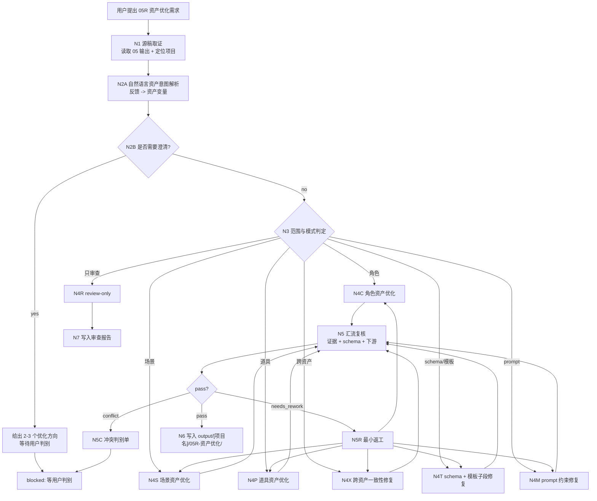
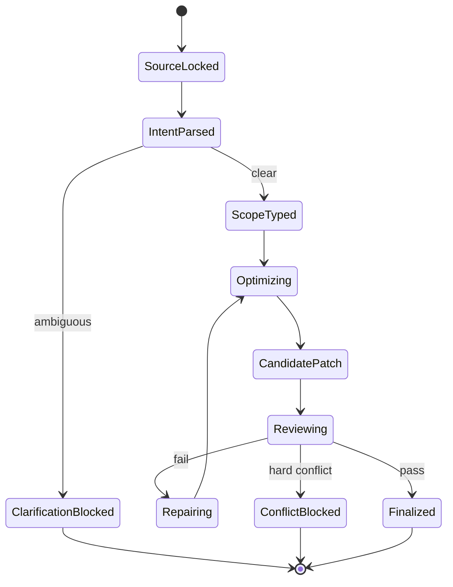
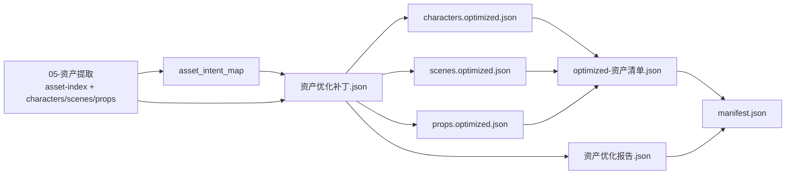

# 05R-资产优化

`05R-资产优化` 是 BYKJ AIGC 工作流中承接 `05-资产提取` JSON 产物的二次自然语言调优与结构修复阶段。它不重新执行 `05-资产提取`，也不重新阅读全本剧本做新一轮资产提取；它在已有角色、场景、道具及其 `design_spec` 的基础上，根据用户自然语言反馈、下游生成问题、schema 缺陷、跨资产冲突或模板字段缺失进行最小必要优化。

canonical 输出目录固定为：

`output/[项目名]/05R-资产优化/`

本阶段核心原则：

- 源稿承接：`05` 输出物是默认真源；`05R` 只优化、修复、对齐，不制造第二套资产事实。
- 自然语言驱动：用户的“角色太散”“道具太多”“场景不够可生成”“prompt 不稳”“模板字段缺失”等表达，必须先转成可执行资产优化变量，再改 JSON。
- 设计规格对齐：角色、场景、道具的 `design_spec` 必须继续匹配 `05-资产提取` 已对齐的 AIGC 7-设计模板子段，不得退化为压缩摘要。
- 跨资产一致性：角色引用、场景引用、道具归属、证据出处、视觉约束、prompt 关键词必须互相可追踪。
- LLM 主创：资产取舍、别名归并判断、叙事功能判断、设计修复、提示词蒸馏和自然语言意图解析必须由 LLM 直接完成；脚本只允许做读取、diff、JSON/schema 校验、排序、manifest 回写等机械辅助。

## Context Loading Contract

- 每次调用 `$aigc-bykj-asset-optimization`、`05R-资产优化` 或本目录 `SKILL.md` 时，必须同时加载同目录 `CONTEXT.md`。
- 若本轮任务通过父级 `$aigc-bykj` 路由进入，必须先遵守父级 `SKILL.md + CONTEXT.md` 的阶段路由，再进入本阶段。
- 必须按需读取 `output/[项目名]/05-资产提取/` 产物；优先顺序为 `manifest.json -> 资产清单.json -> 角色提取/角色清单.json -> 场景提取/场景清单.json -> 道具提取/道具清单.json -> *提取报告.json`。
- 若优化涉及设计规格模板字段，按需读取 `05-资产提取` 对应子技能 `SKILL.md + CONTEXT.md`；只用于字段对齐，不重新执行提取。
- 若优化涉及上游证据争议，最多回读 `output/[项目名]/02-剧本处理/` 作为证据核验；不得借此展开新一轮全量提取。
- 冲突优先级：用户显式请求 > 根 `AGENTS.md` > 父级 `aigc-bykj/SKILL.md` > 本 `SKILL.md` > `05-资产提取/SKILL.md` 与子技能 `SKILL.md` > `05` 输出 JSON > 上游 `02` 证据 > 本 `CONTEXT.md`。

## Business Requirement Analysis Contract (Mandatory)

不得在未解析用户优化目标前直接改资产 JSON。执行前至少锁定：

| analysis_field | required judgment |
| --- | --- |
| `optimization_goal` | 用户要优化什么：角色合并、场景归类、道具筛选、设计规格、prompt、schema、跨资产一致性、下游可生成性或只审查 |
| `source_object` | 承接的 `05-资产提取` 输出目录、具体 JSON、单个资产条目、报告问题或用户粘贴片段 |
| `natural_language_intent` | 用户口语反馈中的质量词、否定词、比较词和下游问题分别指向哪些资产字段或设计子段 |
| `optimization_scope` | `overall_asset_tuning`、`character_asset_tuning`、`scene_asset_tuning`、`prop_asset_tuning`、`cross_asset_alignment`、`schema_template_repair`、`prompt_constraint_repair`、`review_only`、`conflict_resolution`、`repair_previous_05R` |
| `constraint_profile` | 是否允许合并/删除资产、是否允许调整设计规格、是否允许改 prompt、是否允许只输出 patch、是否需要 full optimized JSON |
| `edit_intensity` | `light_touch`、`medium_rework`、`structural_repair`、`experimental_alt` 中哪一档被授权 |
| `evidence_policy` | 每项新增、删除、合并、降级、设计改写是否有 `05` 或 `02` 证据回指 |
| `asset_risk` | 是否可能误删叙事功能道具、误合并角色、破坏场景标题、引入无证据视觉设定或导致下游生成不可控 |
| `success_criteria` | 优化后更符合用户意图，同时保持 JSON schema、模板子段、证据链、跨资产引用和下游可消费性 |
| `step_strategy` | 默认使用混合型思行网络：锁 05 源稿，解析自然语言，判型分支优化，汇流一致性复核，写入 patch 与优化 JSON |

## Total Input Contract

Accepted input:

- 用户指定 `output/[项目名]/05-资产提取/` 输出，要求“优化资产”“修一下角色/场景/道具”“整理一下资产 JSON”。
- 用户反馈下游问题，例如“角色太散”“道具太多”“场景不够可生成”“prompt 太泛”“模板字段缺失”“角色和道具对不上”。
- 用户指定某个资产条目、字段、别名、场景标题、道具评分、`design_spec` 子段或 prompt 进行局部修复。
- 用户只要求 review 已有 `05` 输出，指出缺陷、冲突、可优化点或下游风险。
- 用户要求基于已有 `05R` 输出做二次修复。

Required input:

- 可读取的 `05-资产提取` 输出，或用户粘贴的等价 JSON 片段。
- 可推断或声明的项目名。
- 明确或可推断的优化目标、范围和授权强度。

Reject or clarify when:

- 找不到 `05-资产提取` 输出且用户也没有粘贴可优化 JSON。
- 用户要求“重新提取所有资产”但没有授权回到 `05-资产提取`。
- 用户要求新增没有 `05` 或 `02` 证据的角色、场景、道具或视觉事实。
- 用户局部目标会破坏角色身份、场景标题、叙事功能道具或跨资产引用，且无法用最小修复解决。
- 用户要求本阶段生成图片、分镜、视频任务或写入旧 AIGC 7-设计 Markdown runtime；这些应路由到对应生成阶段或显式派生任务。

## Mode Selection

| mode | trigger | editing policy | output behavior |
| --- | --- | --- | --- |
| `overall_asset_tuning` | 用户要求整体优化资产结果 | 可跨角色/场景/道具调整排序、去噪、引用、设计规格和 prompt，但不得新增无证据资产 | 输出完整 patch、优化索引、优化报告和 manifest |
| `character_asset_tuning` | 角色别名、合并、身份、关系、视觉设计或 prompt 有问题 | 只改角色 JSON；必要时同步道具/场景中的角色引用 | 输出 `characters.optimized.json` 与角色 patch |
| `scene_asset_tuning` | 场景标题、空间归类、生成约束、空镜设计或 prompt 有问题 | 默认保留剧本场景标题；只修归类、设计规格、引用和 prompt | 输出 `scenes.optimized.json` 与场景 patch |
| `prop_asset_tuning` | 道具太多/太少、叙事功能评分、归属、视觉设计或 prompt 有问题 | 只保留重要叙事功能道具；降级普通环境物而不是硬塞主清单 | 输出 `props.optimized.json` 与道具 patch |
| `cross_asset_alignment` | 角色、场景、道具之间引用不一致或证据链断裂 | 以 `05` 索引为中心修复 ID、引用、证据和归属关系 | 输出跨资产 alignment patch |
| `schema_template_repair` | JSON 不合法、字段缺失、`design_spec` 模板子段不完整 | 不改资产事实，优先补齐 schema 和模板子段 | 输出 schema repair patch 与校验报告 |
| `prompt_constraint_repair` | prompt 太泛、过度主观、缺画面约束或与设计不一致 | 只修 prompt 与 negative/constraint 字段，回指设计证据 | 输出 prompt repair patch |
| `review_only` | 用户只要求检查 | 不改 JSON，只输出审查报告 | 输出 verdict、fail code、建议优先级 |
| `conflict_resolution` | 用户目标与 `05`/`02` 证据、schema 或下游要求冲突 | 暂停终稿写入，输出冲突判别单和可选方案 | 等用户裁决后再进入对应模式 |
| `repair_previous_05R` | 已有 `05R` 输出被指出问题 | 最小修复失败项，不重写无关资产 | 更新 patch、优化 JSON、报告和 manifest |

## Natural Language Asset Optimization Contract

用户个人自然语言是本阶段一等输入。每次优化都必须先生成 `asset_intent_map`，再进入字段修改。

`asset_intent_map` 必须记录：`raw_phrase / inferred_asset_issue / target_asset_type / target_fields / edit_intensity / confidence / risk / applied_status`。

| user phrase pattern | executable asset variables | risk check |
| --- | --- | --- |
| “角色太散/像重复人物” | 别名归并、身份锚点、关系引用、主次角色层级 | 防止误合并同名不同人或功能不同角色 |
| “角色不够可生成/不够稳定” | `design_spec.fixed_visual_constraints`、外观、服装、摄影、prompt | 不得新增无证据身份或夸张造型 |
| “场景不够清楚/不够可生成” | 场景标题保留、空间层级、空镜约束、材质、光线、prompt | 不得改写剧本场景标题为新剧情地点 |
| “道具太多/太杂” | 叙事功能评分、证据强度、复现次数、因果作用、去噪降级 | 不得误删证据、信物、武器、设备、转折物 |
| “道具缺关键作用” | `narrative_function`、归属角色、出现位置、设计规格 | 不得把普通装饰物升级为关键道具 |
| “prompt 不稳/太泛” | 英文关键词、主体完整性、背景约束、镜头约束、negative | 不得与 `design_spec` 或全局风格冲突 |
| “模板字段缺失” | 三类资产 `design_spec` 子段完整性 | 只补字段和证据，不重写无关设计 |
| “资产之间对不上” | ID、别名、场景引用、道具归属、证据出处 | 修引用优先于改事实 |

### Edit Intensity Ladder

| intensity | allowed edits | requires explicit authorization |
| --- | --- | --- |
| `light_touch` | 修字段缺失、措辞、prompt、排序、引用、少量去重 | 否，模糊优化默认从此档开始 |
| `medium_rework` | 重写局部 `design_spec`、合并明显同一角色、降级低功能道具 | 用户需求可推断或明确允许 |
| `structural_repair` | 重建角色/场景/道具索引、批量修 ID 和跨资产引用 | 是，必须明确授权或存在 hard fail |
| `experimental_alt` | 输出备选优化方案，不覆盖 canonical | 是，输出为候选，不作为默认优化版 |

未授权时默认 `light_touch`。任何删除资产、合并角色、重排索引、结构修复都必须在报告中记录依据和回退说明。

### Conflict Map

| conflict_type | handling |
| --- | --- |
| `evidence_gap` | 缺少 `05` 或 `02` 证据，进入冲突判别或只输出建议 |
| `alias_merge_risk` | 角色合并证据不足，保留分离并添加 `possible_alias_of` |
| `prop_deletion_risk` | 道具可能承担叙事功能，先降级为 `secondary_prop` 而不是删除 |
| `scene_title_break` | 用户想改剧本场景标题，默认阻断并建议回到 `02R` |
| `template_schema_break` | 优化会破坏 JSON schema 或模板子段，必须返工 |
| `downstream_generation_break` | prompt 或设计导致图像/分镜不可消费，回到对应资产分支修复 |

## Source Continuity Contract

`05R` 必须尊重 `05-资产提取` 的单阶段真源：

- `05` 的资产 ID、证据出处、角色/场景/道具分类、`design_spec` 模板子段和 JSON schema 默认继承。
- 除非用户明确授权结构修复，不得批量重排 ID、删除主资产或改变三类资产的 canonical JSON 结构。
- 对 `05` 中已存在的 fail code，应先判断是源层缺陷还是本轮自然语言新增需求，避免把源层问题伪装成 `05R` 新失败。
- 局部优化只改选定资产或字段；其他资产只承担一致性复核和必要引用同步。
- 若发现必须重新提取才能解决的问题，应输出 `handoff_to_05` 建议，而不是在 `05R` 内伪造新提取结果。

## Topology Contract

本阶段采用混合型思行网络：`05 源稿锁定 -> 自然语言资产意图解析 -> 范围判型 -> 分支优化 -> 跨资产汇流复核 -> patch/optimized JSON 写回`。







## Thinking-Action Node Contract

| node | thinking duty | action duty | evidence | gate |
| --- | --- | --- | --- | --- |
| `N1-SOURCE-LOCK` | 判定项目、05 源稿、具体 JSON 和上游证据是否足够 | 读取 manifest、index、三类资产 JSON、报告 | `source_lock` | `PASS-05R-01` |
| `N2A-INTENT-PARSE` | 将用户自然语言映射到资产类型、字段、强度和风险 | 生成 `asset_intent_map` | `natural_language_analysis` | `PASS-05R-02` |
| `N2B-CLARIFY` | 判断低信息、多解或高风险需求是否需要用户裁决 | 输出候选方向或冲突问题 | `clarification_need` | `PASS-05R-03` |
| `N3-SCOPE-TYPE` | 判定优化模式、影响范围和授权强度 | 选择 mode、锁定目标对象 | `mode_selection` | `PASS-05R-04` |
| `N4-BRANCH-OPTIMIZE` | 根据模式做资产、设计规格、schema 或 prompt 优化判断 | 生成 patch 与候选优化 JSON | `candidate_patch` | `PASS-05R-05` |
| `N5-REVIEW` | 复核证据、schema、模板字段、跨资产引用和下游可消费性 | 生成 review verdict 与返工项 | `review_result` | `PASS-05R-06` |
| `N5R-REPAIR` | 最小修复 fail code，不扩张范围 | 更新 patch 或候选 JSON | `repair_actions` | `PASS-05R-07` |
| `N6-WRITEBACK` | 判定输出是 patch-only、full optimized JSON 还是 blocked | 写入 `05R` 输出目录 | `manifest` | `PASS-05R-08` |

## Output Contract

默认输出必须是 JSON-first，不以 Markdown 作为 canonical 真源。

Required outputs:

- `资产优化补丁.json`：本轮所有增删改、目标路径、证据、原因、风险和回退说明。
- `资产优化报告.json`：输入锁定、思考过程、自然语言意图映射、模式选择、review verdict、fail code、返工记录、阻断项。
- `manifest.json`：输入路径、源稿 hash 或路径、输出路径、生成时间、状态、下游交接信息。

Conditional outputs:

- `optimized-资产清单.json`：当本轮产生 full optimized JSON 时输出。
- `characters.optimized.json`：涉及角色资产优化时输出。
- `scenes.optimized.json`：涉及场景资产优化时输出。
- `props.optimized.json`：涉及道具资产优化时输出。
- `conflict-decision-request.json`：需要用户裁决时输出，不写 full optimized JSON。

`资产优化报告.json` 必须包含可审查的思考过程字段：

```json
{
  "thinking_process": {
    "source_lock_summary": "读取了哪些 05 源稿与上游证据",
    "intent_interpretation": "如何把用户自然语言转成资产优化变量",
    "mode_selection_reason": "为什么选择当前优化模式",
    "evidence_policy": "哪些改动有证据，哪些被阻断",
    "risk_review": "主要风险、冲突和返工处理",
    "handoff_decision": "输出给下游或回退到 05/02R 的理由"
  }
}
```

## Review Gate Configuration

| gate | review question | fail code | rework target | report evidence |
| --- | --- | --- | --- | --- |
| `PASS-05R-01` | 是否锁定可读取的 `05-资产提取` 源稿？ | `F05R-SOURCE-MISSING` | `N1-SOURCE-LOCK` | `source_lock` |
| `PASS-05R-02` | 用户自然语言是否已映射为资产类型、字段和强度？ | `F05R-INTENT-UNPARSED` | `N2A-INTENT-PARSE` | `asset_intent_map` |
| `PASS-05R-03` | 低信息或高风险需求是否已澄清或阻断？ | `F05R-CLARIFY-SKIPPED` | `N2B-CLARIFY` | `clarification_need` |
| `PASS-05R-04` | 优化范围、模式和授权强度是否明确？ | `F05R-SCOPE-DRIFT` | `N3-SCOPE-TYPE` | `mode_selection` |
| `PASS-05R-05` | patch 是否只改授权目标，且每项改动有证据或阻断理由？ | `F05R-PATCH-UNSUPPORTED` | `N4-BRANCH-OPTIMIZE` | `资产优化补丁.json` |
| `PASS-05R-06` | 角色、场景、道具是否保持跨资产引用一致？ | `F05R-CROSS-ASSET-BREAK` | `N5-REVIEW` | `cross_asset_alignment` |
| `PASS-05R-07` | `design_spec` 是否保留对应 AIGC 7-设计模板子段？ | `F05R-DESIGN-SLOT-MISSING` | `N4T-SCHEMA-TEMPLATE-REPAIR` | `template_slot_check` |
| `PASS-05R-08` | prompt 是否与设计规格、主体完整性和画面约束一致？ | `F05R-PROMPT-DRIFT` | `N4M-PROMPT-CONSTRAINT-REPAIR` | `prompt_constraint_review` |
| `PASS-05R-09` | JSON 是否合法且可被下游消费？ | `F05R-SCHEMA-INVALID` | `N5R-REPAIR` | `json_validation` |
| `PASS-05R-10` | 输出是否写入 `output/[项目名]/05R-资产优化/` 且回指 `05` 源稿？ | `F05R-WRITEBACK-MISPLACED` | `N6-WRITEBACK` | `manifest.json` |

## Root-Cause Execution Contract (Mandatory)

遇到失败不得只修表面 JSON。必须沿以下链路上溯并记录：

`Symptom -> Direct Asset Optimization Failure -> 05R Node / Gate -> 05 Source Contract -> BYKJ Parent Router -> AGENTS.md LLM-first / Skill 2.0 Contract`

常见根因处理：

- 若输出像重新提取，根因通常是 `Source Continuity Contract` 失效，回到 `N1-SOURCE-LOCK`。
- 若用户反馈被直接写成 prompt，根因通常是 `N2A-INTENT-PARSE` 缺失，补 `asset_intent_map`。
- 若资产越改越多，根因通常是证据政策失效，回到 `PASS-05R-05`。
- 若下游不可生成，根因通常是 `design_spec` 与 prompt 断裂，回到 `PASS-05R-07/08`。
- 若结构合法但语义冲突，根因通常是跨资产汇流不足，回到 `PASS-05R-06`。

## Completion Definition

`05R-资产优化` 只有在以下条件同时满足时才可标记 complete：

- 已锁定 `05-资产提取` 源稿，或明确输出缺失/阻断原因。
- 已解析用户自然语言并形成 `asset_intent_map`。
- 已选择正确优化模式和授权强度。
- 每项 JSON patch 均有目标路径、改动理由、证据回指、风险和回退说明。
- 未新增无证据角色、场景、道具或视觉事实。
- `design_spec` 模板子段、schema、跨资产引用和 prompt 约束通过 review gate。
- 输出写入 `output/[项目名]/05R-资产优化/`，并通过 manifest 回指 `05` 源稿与下游交接。
