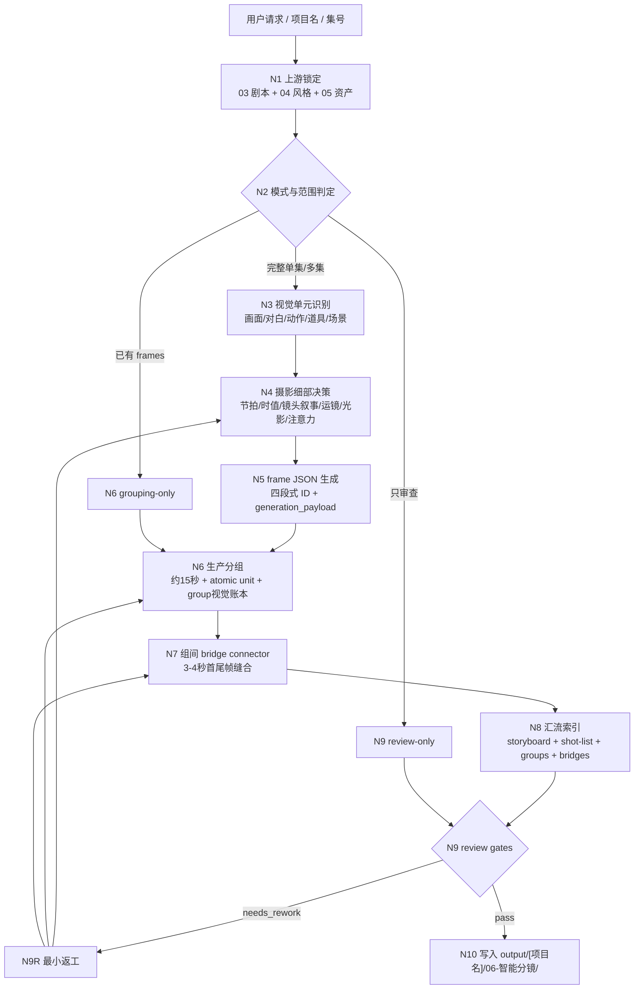
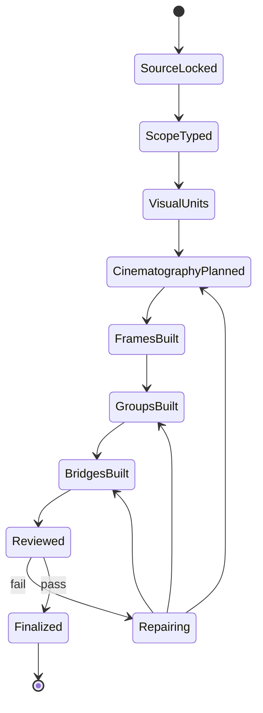
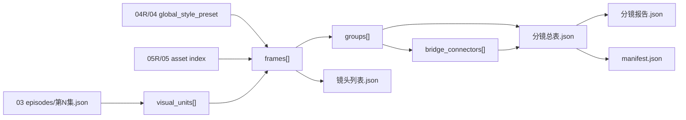

# 06-智能分镜

`06-智能分镜` 是 BYKJ AIGC 工作流的整合型分镜阶段。它承接 `03-智能分集` 的逐集剧本、`04/04R` 的全局视觉预设、`05/05R` 的角色/场景/道具资产 JSON，把原 AIGC 系列 `5-摄影` 的逐画面摄影细部模块与 `6-分组` 的生产分组细部模块收束为同一个 JSON-first 分镜交付。

默认上游输入：

- `output/[项目名]/03-智能分集/`
- `output/[项目名]/04R-全局优化/`，不存在时回退 `output/[项目名]/04-全局预设/`
- `output/[项目名]/05R-资产优化/`，不存在时回退 `output/[项目名]/05-资产提取/`

唯一 canonical 输出目录：

`output/[项目名]/06-智能分镜/`

本阶段不写回旧 AIGC runtime 的 `projects/aigc/<项目名>/5-摄影/` 或 `projects/aigc/<项目名>/6-分组/`。但输出规则必须完全同步原 AIGC `6-分组` 技能包：分镜组标题、场景标题行、定场镜头、画面构图、六个构图分区、画面属性、三项风格行、组内正文、组底统计、组间连接件字段、计数边界和 review 口径都必须与原 `6-分组` 规则等价。BYKJ 只改变承载路径和数据载体，不降低或改写 `6-分组` 的内容规则。

## Context Loading Contract

- 每次调用 `$aigc-bykj-smart-storyboard`、`06-智能分镜` 或本目录 `SKILL.md` 时，必须同时加载同目录 `CONTEXT.md`。
- 若本轮任务通过父级 `$aigc-bykj` 路由进入，必须先遵守父级 `SKILL.md + CONTEXT.md` 的阶段路由，再进入本阶段。
- 必须按需读取 `03-智能分集` 的 `manifest.json -> episodes/第N集.json -> 分集总表.md -> 执行报告.json`。
- 必须按需读取 `04R` 或 `04` 的 `manifest.json/yaml -> 全局风格预设.json -> 视觉风格库.json -> 全局预设.md -> 执行报告`；优先使用最新优化版。
- 必须按需读取 `05R` 或 `05` 的 `manifest.json -> optimized-资产清单.json/资产清单.json -> characters/scenes/props*.json -> report`；优先使用最新优化版。
- 若需要追溯旧摄影/分组细则，只按需读取 `.agents/skills/aigc/5-摄影/` 与 `.agents/skills/aigc/6-分组/` 的具体 references、steps、review、types 或 templates，不默认复制旧输出路径。
- 冲突优先级：用户显式请求 > 根 `AGENTS.md` > 父级 `aigc-bykj/SKILL.md` > 本 `SKILL.md` > `03/04/05` BYKJ 上游阶段输出 > 原 AIGC `5-摄影/6-分组` 参考细则 > 本 `CONTEXT.md`。
- 核心分镜、摄影、分组、连接件、提示词 payload 和审美判断必须由 LLM 直接完成；脚本只允许做读取、排序、时长累计、JSON/schema 校验、ID 检查、manifest 回写等机械辅助。

## Business Requirement Analysis Contract (Mandatory)

不得在未锁定上游和目标交付形态前直接生成分镜。执行前至少锁定：

| analysis_field | required judgment |
| --- | --- |
| `business_goal` | 用户要生成全剧/单集/局部场景的智能分镜，还是 review/repair 既有 `06` 输出 |
| `business_object` | 输入来自 `03` 逐集剧本、用户粘贴剧本片段、已有 `06` JSON、还是混合上游 |
| `upstream_profile` | `03` 集稿、`04/04R` 风格、`05/05R` 资产是否可读，哪些缺失，哪些可降级 |
| `cinematography_integration_scope` | 需要消费哪些 `5-摄影` 能力：视觉单元、节拍、时值、镜头叙事、运镜情绪、景深、光源、注意力、连续性、AI 视频稳定性、对白/高点/道具准入 |
| `grouping_integration_scope` | 需要消费哪些 `6-分组` 能力：约 15 秒组、18 秒硬上限、atomic unit、定场镜头、构图分区、画面属性、组间连接件、统计 |
| `constraint_profile` | 是否允许拆分场景、是否允许局部生成、目标平台时长、是否需要 bridge connectors、是否需要 prompt payload |
| `frame_id_policy` | 分镜 ID 必须使用四段式 `episode-scene-group-frame`，例如 `1-1-1-1` |
| `success_criteria` | 每个 frame 可拍、可画、可视频生成；每个 group 完全符合原 `6-分组` 组头/正文/统计规则；连接件完全符合原 `6-分组` 组间首尾帧连接件规则；JSON 可被下游消费 |
| `risk_profile` | 是否存在改写剧情、资产漂移、风格漂移、时长超限、动作断裂、道具滥用、对白模板化或 prompt 不稳定风险 |
| `step_strategy` | 默认使用混合型思行网络：锁上游 -> 摄影视觉单元 -> 镜头 frame -> 分组 -> bridge -> JSON/review 写回 |

## Source Capability Integration

| source capability | BYKJ `06` absorbed function | BYKJ `06` does not inherit |
| --- | --- | --- |
| `aigc/5-摄影` 画面匹配 | 从 `03` 剧本识别视觉单元、对白承托、动作链、微表情、道具显影和场景变化 | 不写 `分镜明细：` Markdown 块 |
| `aigc/5-摄影` 节拍/时值/密度曲线 | 为每个 visual unit 建立 `beat_map`、`shot_count_decision`、`duration_seconds` 和段落 `sequence_density_curve` | 不按固定 1/2 镜模板灌水 |
| `aigc/5-摄影` 摄影语法细部 | 内化景别、机位、景深、焦点、运镜速度曲线、光源叙事、注意力路径、连续性交出点 | 不输出参数清单腔或抽象摄影口号 |
| `aigc/5-摄影` AI 视频稳定性 | 每个 frame 形成 camera-first、方向参照、光线结果、表演微动态、主体完整性的 `generation_payload` | 不直接提交图像或视频任务 |
| `aigc/5-摄影` 保真与道具准入 | 镜头只强化观看路径，不新增剧情事实；普通无互动道具不得抢焦点 | 不把普通环境物升级为关键镜头 |
| `aigc/6-分组` 边界裁决 | 把 frames 组装为约 15 秒生产组，通常 12-18 秒，18 秒硬上限，atomic unit 不跨组；字数和对白只作辅助风险复核 | 不按字数、话题或情绪转折硬切 |
| `aigc/6-分组` 组头规则 | 每个 group 必须镜像原 `6-分组`：`## x-y-z`、当前场景标题行、`定场镜头：`、`画面构图：`、`左侧/中间/右侧/前景/中景/背景`、`画面属性：`、三项风格纯内容行 | 不输出旧组头 `角色：/场景：/道具：` 清单，不省略任一原规则字段 |
| `aigc/6-分组` 正文规则 | 组内正文必须保持原 `6-分组` 的“同步上游摄影稿原换行、不改写原有分镜明细/对白/场景顺序”的规则；在 BYKJ 中由 `group_body` 和 `frames` 共同承载 | 不把正文压缩成 frame 摘要 |
| `aigc/6-分组` 组间连接件 | 相邻 group 之间必须镜像原 `6-分组` 的独立连接件：`## <上一组ID>~<下一组ID>`、场景标题行、三项风格行、连接类型、连接方法、时长、变化过程、主体运动、运镜设计、透视适应、避免元素 | 不使用旧版 `入场画面/出场画面` 尾钩，不输出 `起点尾帧/目标首帧/连接件提示` |
| `aigc/6-分组` 组底统计 | 生成与原 fenced YAML 等价的 JSON `statistics_yaml_equivalent`：`字数统计`、`时长估算`、`角色`、`场景`、`道具`，并遵守原计数边界 | 不用简化 stats 取代原 YAML 规则 |

## Total Input Contract

Accepted input:

- 用户要求“分镜”“智能分镜”“镜头设计”“storyboard”“按剧本生成分镜组”“承接 05 资产生成分镜”。
- 用户指定 `output/[项目名]/03-智能分集/`、某个 `episodes/第N集.json`、`04/04R` 风格 JSON、`05/05R` 资产 JSON 或已有 `06` 输出。
- 用户要求 review 或 repair 已有 `06-智能分镜` 输出，例如 ID 断裂、镜头不可生成、组时长超限、连接件断裂、资产引用漂移。

Required input:

- 可读取的集级剧本真源，优先 `03-智能分集/episodes/第N集.json`；若没有 `03`，用户必须粘贴等价剧本片段或明确授权回退到 `02`。
- 可推断或声明的项目名。
- 对完整生产型分镜，必须有可用 `04/04R` 风格和 `05/05R` 资产；缺失时可生成 `draft_storyboard`，但必须标记风格/资产降级风险。

Reject or clarify when:

- 找不到可读剧本，且用户没有粘贴等价文本。
- 用户要求本阶段改写剧情、改对白、重排场景顺序、补剧情事实或新建无证据资产。
- 用户要求用脚本自动主创分镜、连接件或镜头提示词正文。
- 用户要求直接生成图片、视频或提交外部生成任务；这些应路由到后续图像/视频阶段。

## Mode Selection

| mode | trigger | output behavior |
| --- | --- | --- |
| `single_episode_storyboard` | 用户指定单集或单个 `第N集.md` | 输出该集 `storyboard-episode-N.json`、对应 groups、frames、bridges、report |
| `episode_range_storyboard` | 用户指定多个集号或范围 | 输出多集 JSON 和总索引 |
| `all_ready_episodes` | 未指定集号且 `03/episodes/` 多集可读 | 为全部可读集生成分镜 JSON |
| `scene_or_excerpt_storyboard` | 用户指定单场景、片段或粘贴文本 | 输出局部分镜 JSON，并标记非完整集产物 |
| `cinematography_only` | 用户只要镜头/摄影设计，不要生产分组 | 输出 frames JSON，不输出 full group package |
| `grouping_only` | 已有 frame 级分镜，用户只要分组/连接件 | 只执行 grouping 与 bridge 输出 |
| `review_only` | 用户只要求检查已有 `06` 输出 | 输出审查报告，不改 JSON |
| `repair` | 既有 `06` 输出存在错误 | 最小修复 frames、groups、bridges、report、manifest |

## Topology Contract







## Thinking-Action Node Contract

| node_id | objective | actions | evidence | gate |
| --- | --- | --- | --- | --- |
| `N1-SOURCE-LOCK` | 锁定 `03/04/05` 上游与项目名 | 读取剧本、风格、资产、已有 `06` 输出 | `source_lock` | `PASS-06-01` |
| `N2-SCOPE-TYPE` | 判定单集、多集、局部、只摄影、只分组、review 或 repair | 建立 `mode_profile`、目标集号、缺失降级策略 | `mode_selection` | `PASS-06-02` |
| `N3-VISUAL-UNIT` | 从剧本生成可拍视觉单元 | 识别场景、动作、对白承托、表演、道具、场景变化 | `visual_unit_map` | `PASS-06-03` |
| `N4-CINEMATOGRAPHY` | 整合 `5-摄影` 细部模块完成镜头决策 | 建立 beat、duration、camera、light、focus、attention、continuity、AI payload | `shot_design_plan` | `PASS-06-04` |
| `N5-FRAME-BUILD` | 生成 frame 级 JSON | 写入四段式 ID、源句、资产引用、摄影字段、生成 payload | `frames[]` | `PASS-06-05` |
| `N6-GROUP-BUILD` | 整合 `6-分组` 细部模块完成生产分组 | 按时长、atomic unit、场景和连续性生成 groups、定场镜头、构图分区、画面属性 | `groups[]` | `PASS-06-06` |
| `N7-BRIDGE` | 生成相邻组 3-4 秒连接件 | 设计同场景/跨场景 bridge、主体运动、运镜、透视适应和避免元素 | `bridge_connectors[]` | `PASS-06-07` |
| `N8-INDEX` | 汇流输出索引 | 生成 storyboard、shot-list、frame-index、group-index、bridge-index | `output_index` | `PASS-06-08` |
| `N9-REVIEW` | 复核保真、资产、风格、分镜、分组、连接和 JSON | 记录 verdict、fail code、返工节点 | `review_result` | `PASS-06-09` |
| `N10-WRITEBACK` | 写入 canonical 输出 | 写 JSON、report、manifest | `manifest` | `PASS-06-10` |

## JSON Output Schema Contract

Required outputs:

- `分镜总表.json`：项目级或本轮范围内的分镜总包，包含 episodes、scenes、groups、frames、bridges 的路径索引。
- `镜头列表.json`：所有 frame 的扁平清单，ID 固定为 `episode-scene-group-frame`。
- `生产组索引.json`：所有 production groups，ID 固定为 `episode-scene-group`。
- `桥接连接件.json`：相邻 group 的 3-4 秒连接件。
- `分镜报告.json`：输入锁定、思考过程、摄影细部、分组细部、review verdict、fail code、返工记录。
- `manifest.json`：输入路径、输出路径、生成时间、状态、下游交接信息。

Conditional outputs:

- `episodes/storyboard-episode-N.json`：单集完整分镜。
- `frames/frame-index.json`：需要图像/视频阶段逐帧消费时输出。
- `conflict-decision-request.json`：出现硬冲突、需要用户裁决时输出。

Frame object minimum:

```json
{
  "frame_id": "1-1-1-1",
  "episode": 1,
  "scene": 1,
  "group": 1,
  "frame": 1,
  "source": {
    "episode_path": "output/<project>/03-智能分集/episodes/第1集.md",
    "scene_title": "场景1：...",
    "source_excerpt": "保留可回指的画面/对白/动作证据"
  },
  "asset_refs": {
    "characters": [],
    "scene": "",
    "props": []
  },
  "shot_design": {
    "shot_function": "",
    "visible_subject": "",
    "action_phase": "",
    "duration_seconds": 2,
    "camera": {
      "shot_size": "",
      "angle": "",
      "movement": "",
      "movement_emotion": "",
      "focus_depth": ""
    },
    "composition": "",
    "lighting_result": "",
    "attention_path": "",
    "entry_action_anchor_exit_handoff": ""
  },
  "generation_payload": {
    "camera_first_prompt_zh": "",
    "camera_first_prompt_en": "",
    "negative_constraints": [],
    "direction_reference": "",
    "ai_video_stability_notes": []
  }
}
```

Group object minimum mirrors original `aigc/6-分组` output rules. JSON 字段名可以结构化，但内容、顺序约束、禁止项和计数边界必须与原 Markdown 分组稿等价。

```json
{
  "group_id": "1-1-1",
  "markdown_heading_equivalent": "## 1-1-1",
  "episode": 1,
  "scene": 1,
  "group": 1,
  "scene_title_line": "场景1：...",
  "duration_seconds": 15,
  "frame_ids": ["1-1-1-1"],
  "establishing_shot": "等价于原 6-分组的 `定场镜头：`，必须先建立场景身份、环境身份、氛围、光影、色彩和声音底色；第二组起必须增量复现上一组尾帧可见状态。",
  "composition_overview": "等价于原 `画面构图：`，概述主体布局逻辑和空间轴。",
  "composition_partition_ledger": {
    "左侧": "具体可见主体、环境锚点、遮挡、光影材质或空场压力；不得泛化占位。",
    "中间": "具体可见主体、姿态、朝向、视线、空间关系。",
    "右侧": "具体可见主体或真实环境锚点，与中间/左侧关系清楚。",
    "前景": "前景主体、遮挡、空间入口、关键道具或可见材质。",
    "中景": "中景动作链主关系、站位、身体状态、注意力落点。",
    "背景": "背景群体、固定锚点、光影色彩压迫或环境状态。"
  },
  "group_visual_tone_line": "等价于原 `画面属性：`，从组内镜头设计提炼构图布局、构图方式关键子维度、光源效果、色彩基调、关键摄影参数和观看位置。",
  "style_projection": {
    "global_style_line": "必须以固定前置词开头：视频生成的画面风格，光影和氛围与场景参照图保持一致。需要生成现场物理互动音效、氛围感音效、环境声、自然现象声、动作声，不要生成任何字幕，不要生成背景音乐。 后接当前组 300 字以内风格整理句。",
    "type_elements_line": "直引原 6-分组中的 `类型元素.类型元素提示词` 对应内容；BYKJ 中来源为 04/04R 等价字段。",
    "image_style_line": "直引原 6-分组中的 `细分风格.画面风格` 对应内容；BYKJ 中来源为 04/04R 等价字段。"
  },
  "group_body": {
    "source_sync_policy": "同步原 6-分组正文规则：保留上游摄影稿原换行，不改写字段、对白、原有分镜明细或场景顺序。",
    "body_units": []
  },
  "statistics_yaml_equivalent": {
    "字数统计": "0字",
    "时长估算": "约15秒",
    "角色": [],
    "场景": [],
    "道具": []
  },
  "count_boundary": {
    "word_count_includes": ["scene_title_line", "establishing_shot", "composition_overview", "composition_partition_ledger", "group_visual_tone_line", "group_body"],
    "word_count_excludes": ["markdown_heading_equivalent", "style_projection", "statistics_yaml_equivalent", "bridge_connectors"],
    "duration_includes": ["group_body.frames.duration_seconds"],
    "duration_excludes": ["scene_title_line", "establishing_shot", "composition_overview", "composition_partition_ledger", "group_visual_tone_line", "style_projection", "statistics_yaml_equivalent", "bridge_connectors"]
  }
}
```

Bridge object minimum mirrors original `aigc/6-分组` inter-group connector rules.

```json
{
  "bridge_id": "1-1-1~1-1-2",
  "markdown_heading_equivalent": "## 1-1-1~1-1-2",
  "from_group_id": "1-1-1",
  "to_group_id": "1-1-2",
  "scene_title_line": "同场景连接重复当前场景标题；跨场景连接写成 `场景标题A -> 场景标题B` 的等价内容。",
  "style_projection": {
    "global_style_line": "固定前置词 + 300 字以内连接件风格整理句。",
    "type_elements_line": "直引类型元素等价字段。",
    "image_style_line": "直引画面风格等价字段。"
  },
  "连接类型": "同场景连接|跨场景连接",
  "连接方法": "一句简要具体画面办法；不得只写依赖型/流动型/变形型/复合型/无连接。",
  "时长": "3-4秒",
  "变化过程": "只描述尾帧到首帧之间的连续变化过程，不复述端点画面。",
  "主体运动": "主体、锚定物、能量或环境元素的运动路径、速度、方向、遮挡和前中后景关系。",
  "运镜设计": "镜头运动、景别变化、机位高度、焦段感、轴线方向、焦点转移和节奏。",
  "透视适应": "景别、缩放、位置、角度如何随首尾帧自适应。",
  "避免元素": ["新剧情", "新人物", "新对白", "字幕", "背景音乐", "端点复述", "画面漂移", "错误物件"],
  "forbidden_fields": ["起点尾帧", "目标首帧", "分镜ID", "连接件提示", "入场画面", "出场画面"],
  "count_boundary": "不计入分镜组时长估算、字数统计、1680/1980 字数边界。"
}
```

## AIGC 6-分组 Rule Synchronization Contract

BYKJ `06` 的 group 与 bridge 输出规则必须完全同步原 AIGC `6-分组` 技能包。同步的是规则，不是旧输出路径。

必须同步的 group 规则：

- 每个分镜组等价于原 Markdown `## x-y-z` 分组标题。
- 标题后必须先有当前场景标题行；同场景连续组也必须重复场景标题。
- 场景标题行后必须有 `定场镜头：` 等价字段，先写场景身份、环境身份、氛围、光影、色彩和声音底色；第二组起必须增量添加上一组尾帧还原入场。
- `定场镜头` 后必须有 `画面构图：` 等价字段，并按固定顺序完整输出 `左侧/中间/右侧/前景/中景/背景` 六个构图分区。
- 每个构图分区必须落到具体可见主体、环境锚点、遮挡、光影材质或空场压力，不得使用泛化占位句。
- 不得在组头额外输出 `角色：/场景：/道具：` 清单；主体信息必须自然融入定场镜头和构图分区，短名单只留在组底统计等价字段。
- `画面属性：` 等价字段必须位于定场/构图之后、三项风格行之前，并从组内镜头设计提炼。
- 三项风格行必须是纯内容：第 1 行固定前置词 + 当前组 300 字以内全局风格整理句；第 2 行直引类型元素；第 3 行直引画面风格。BYKJ 来源为 `04/04R` 的等价字段，而不是 `north_star.yaml` 路径。
- 组内正文必须保留原 `6-分组` 的“同步上游摄影稿原换行、不改写上游正文”的规则；BYKJ 中若上游摄影稿由本阶段内部生成，则 `group_body` 必须保留等价的原始 frame / shot 文本顺序和完整镜头明细。
- 组底统计必须等价于原 fenced YAML：`字数统计`、`时长估算`、`角色`、`场景`、`道具` 五项不可省略；空列表写 `[]`。
- `字数统计`、`时长估算` 的计入/排除边界必须同步原 `statistics-yaml-contract.md`。

必须同步的 bridge 规则：

- 每对相邻分镜组之间必须有独立连接件，等价于原 `## <上一个分镜组ID>~<下一个分镜组ID>`。
- 连接件必须物理/索引夹在上一个 group 与下一个 group 之间；每集首组前和末组后不生成连接件。
- 连接件标题后必须先写场景标题行；同场景重复同一场景标题，跨场景写成两个场景标题的连接表达。
- 连接件也必须有三项风格行，且第 1 行使用同一个固定前置词并接 300 字以内连接件风格整理句。
- 必须包含 `连接类型`、`连接方法`、`时长`、`变化过程`、`主体运动`、`运镜设计`、`透视适应`、`避免元素`。
- `连接方法` 必须是具体画面办法，不得只写抽象分类名。
- 禁止输出 `起点尾帧`、`目标首帧`、`分镜ID`、`连接件提示`、`入场画面`、`出场画面`。
- 连接件不计入任一 group 的时长、字数或统计。

## Review Gate Configuration

| gate | review question | fail code | rework target | report evidence |
| --- | --- | --- | --- | --- |
| `PASS-06-01` | 是否锁定可读 `03` 剧本、`04` 风格和 `05` 资产，或明确降级？ | `F06-SOURCE-MISSING` | `N1-SOURCE-LOCK` | `source_lock` |
| `PASS-06-02` | 模式、范围、集号和输出形态是否明确？ | `F06-SCOPE-DRIFT` | `N2-SCOPE-TYPE` | `mode_selection` |
| `PASS-06-03` | 视觉单元是否覆盖可拍动作、对白承托、表演、场景和道具显影？ | `F06-VISUAL-UNIT-MISS` | `N3-VISUAL-UNIT` | `visual_unit_map` |
| `PASS-06-04` | 每个 frame 是否有非复述型摄影决策、时值、连续性和 AI 视频稳定 payload？ | `F06-CINE-INCOMPLETE` | `N4-CINEMATOGRAPHY` | `shot_design_plan` |
| `PASS-06-05` | frame ID 是否符合四段式 `episode-scene-group-frame` 且引用上游证据？ | `F06-FRAME-ID-BREAK` | `N5-FRAME-BUILD` | `镜头列表.json` |
| `PASS-06-06` | groups 是否接近 15 秒、atomic unit 不跨组、单组不超过 18 秒？ | `F06-GROUP-BOUNDARY-BREAK` | `N6-GROUP-BUILD` | `生产组索引.json` |
| `PASS-06-07` | 每个 group 是否完整同步原 `6-分组` 组头规则：场景标题、定场镜头、画面构图、六分区、画面属性、三项风格行？ | `F06-GROUP-RULE-MISSING` | `N6-GROUP-BUILD` | `group_rule_sync_check` |
| `PASS-06-08` | 每个 group 的正文与统计是否完整同步原 `6-分组`：正文保真、五项 YAML 等价字段、字数/时长计数边界？ | `F06-GROUP-STATS-BREAK` | `N6-GROUP-BUILD` | `statistics_yaml_equivalent` |
| `PASS-06-09` | 相邻 groups 是否完整同步原 `6-分组` 连接件规则，且不新增剧情？ | `F06-BRIDGE-RULE-BREAK` | `N7-BRIDGE` | `bridge_rule_sync_check` |
| `PASS-06-10` | 资产引用、场景标题、道具准入和全局风格是否与 `04/05` 一致？ | `F06-ASSET-STYLE-DRIFT` | `N4/N5/N6` | `asset_style_alignment` |
| `PASS-06-11` | JSON 是否合法、路径正确、manifest 回指上游并可供下游消费？ | `F06-WRITEBACK-INVALID` | `N10-WRITEBACK` | `manifest.json` |

## Root-Cause Execution Contract (Mandatory)

遇到失败不得只修表面字段。必须沿以下链路上溯并记录：

`Symptom -> Direct Storyboard Failure -> 06 Node / Gate -> Source AIGC 5-摄影 or 6-分组 Capability -> BYKJ 03/04/05 Upstream Contract -> AGENTS.md LLM-first / Skill 2.0 Contract`

常见根因：

- 分镜像画面复述：回到 `N4-CINEMATOGRAPHY`，补镜头叙事功能、运镜、光线、注意力和非复述检查。
- frame 不可视频生成：回到 AI 视频稳定 payload，补 camera-first、方向参照、光线结果和可见微动态。
- group 缺原 `6-分组` 组头字段：回到 `N6-GROUP-BUILD`，按原 `group-establishing-shot-contract.md`、`group-visual-tone-contract.md` 和输出模板补齐，不得用简化 JSON stats 代替。
- group 超 18 秒或计数边界错误：回到 `N6-GROUP-BUILD` 或上游 frame 时值；不得写例外放行，不得把组头/风格/连接件计入时长。
- bridge 像新剧情或字段缺失：回到 `N7-BRIDGE`，按原 `bridge-shot-contract.md` 只缝合上一组尾帧和下一组首帧。
- 角色/道具/场景漂移：回到 `05R/05` 资产索引或 `03` 剧本证据，不在 `06` 新造事实。
- 风格漂移：回到 `04R/04` 全局预设，不用随机风格词补画面。

## Output / Handoff Contract

`06` 完成后必须能交给后续图像/视频阶段：

- `镜头列表.json` 供图像阶段按 `frame_id` 生成分镜画面。
- `生产组索引.json` 供视频阶段按 `group_id` 组织约 15 秒生产单元；其 group 内容规则必须完全同步原 `6-分组`。
- `桥接连接件.json` 供视频阶段生成相邻组首尾帧连接件；其 connector 内容规则必须完全同步原 `6-分组`。
- `generation_payload` 必须保留中文和英文 camera-first prompt 草案，但不直接调用生成 API。
- `分镜报告.json` 必须包含思考过程：上游锁定、视觉单元判定、摄影细部整合、分组边界、连接件设计、review 与返工。

## Completion Definition

`06-智能分镜` 只有在以下条件同时满足时才可标记 complete：

- 已锁定可读剧本真源，并明确风格/资产来源或降级风险。
- 每个 frame 具有四段式 ID、源证据、资产引用、摄影决策、时值和生成 payload。
- 每个 group 具有稳定 ID、frame 列表、约 15 秒时长，并完整同步原 `6-分组` 的场景标题、定场镜头、画面构图、六分区、画面属性、三项风格行、正文保真和组底统计规则。
- 相邻 group 均有 bridge connector，且完整同步原 `6-分组` 的连接件字段、禁止字段和计数边界，除非本轮只生成单组或用户关闭连接件。
- 未改写剧情、对白、场景顺序或新造无证据资产。
- JSON 合法、manifest 完整、review gate 通过。
