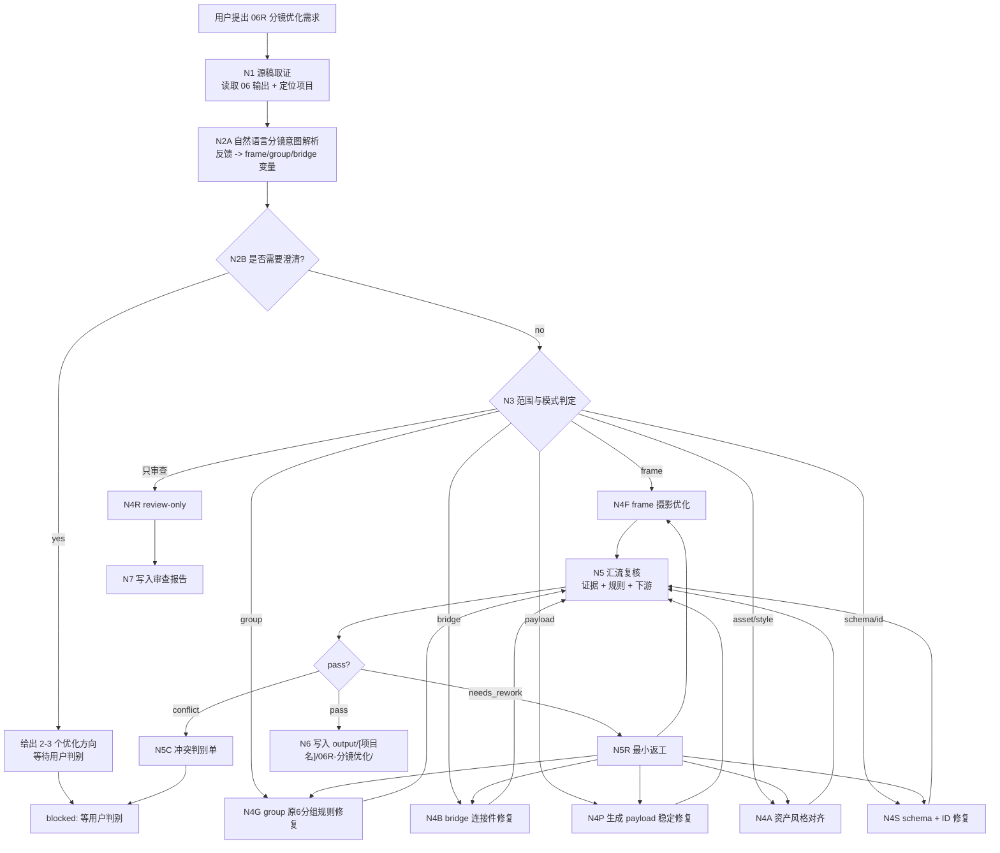
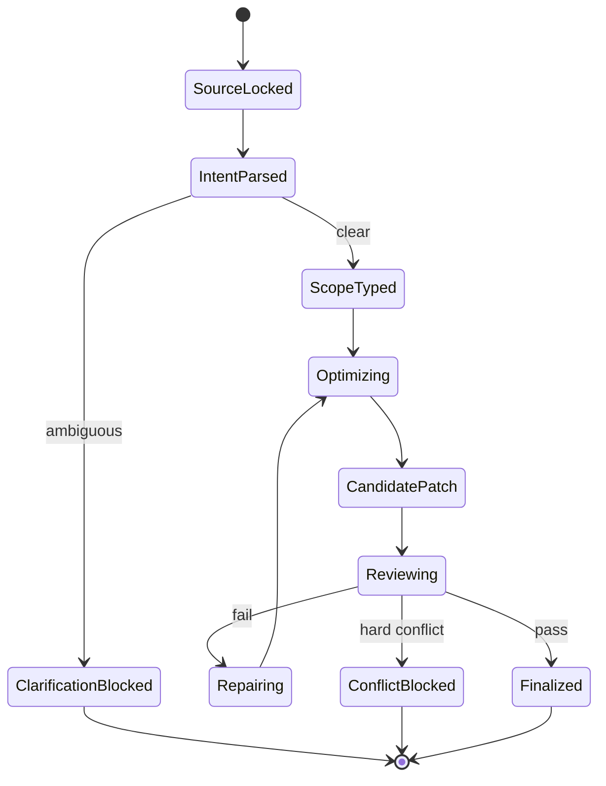
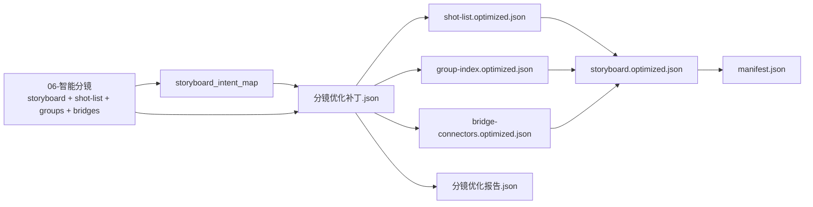

# 06R-分镜优化

`06R-分镜优化` 是 BYKJ AIGC 工作流中承接 `06-智能分镜` JSON 产物的二次自然语言调优、规则修复和下游稳定性优化阶段。它不重新执行 `06-智能分镜` 的完整分镜流程，而是在已有 `分镜总表.json`、`镜头列表.json`、`生产组索引.json`、`桥接连接件.json`、`分镜报告.json` 或用户粘贴片段基础上，按照用户反馈、下游生成问题、原 `6-分组` 规则同步问题、frame/group/bridge 结构错误或 payload 漂移进行最小必要优化。

canonical 输出目录固定为：

`output/[项目名]/06R-分镜优化/`

本阶段核心原则：

- 源稿承接：`06` 输出物是默认真源；`06R` 只做二次优化、修复和对齐，不重新分镜、不改写 `03/04/05` 上游事实。
- 自然语言驱动：用户的“镜头太平”“组切得不对”“连接件断”“不够可生成”“不符合 6-分组规则”“prompt 漂移”等反馈，必须先转成可执行分镜优化变量，再改 JSON。
- 规则同步修复：`06R` 必须继续维护 `06` 已声明的原 AIGC `6-分组` 输出规则同步，不得把 group/bridge/statistics 简化为摘要字段。
- 局部优先：用户指定 frame/group/bridge 时，只修目标对象和必要引用；不得顺手重写无关分镜。
- LLM 主创：镜头取舍、摄影修复、分组边界、连接件修复、prompt payload 蒸馏和自然语言意图解析必须由 LLM 直接完成；脚本只允许读取、diff、JSON/schema 校验、时长统计、ID 检查和 manifest 回写。

## Context Loading Contract

- 每次调用 `$aigc-bykj-storyboard-optimization`、`06R-分镜优化` 或本目录 `SKILL.md` 时，必须同时加载同目录 `CONTEXT.md`。
- 若本轮任务通过父级 `$aigc-bykj` 路由进入，必须先遵守父级 `SKILL.md + CONTEXT.md` 的阶段路由，再进入本阶段。
- 必须按需读取 `output/[项目名]/06-智能分镜/` 产物；优先顺序为 `manifest.json -> 分镜总表.json -> 镜头列表.json -> 生产组索引.json -> 桥接连接件.json -> 分镜报告.json -> episodes/ -> frames/`。
- 若优化涉及原 `6-分组` 规则同步，必须按需读取 `.agents/skills/aigc/6-分组/SKILL.md`、`templates/output-template.md`、`references/group-establishing-shot-contract.md`、`references/group-visual-tone-contract.md`、`references/bridge-shot-contract.md`、`references/statistics-yaml-contract.md`。
- 若优化涉及镜头语言、AI 视频稳定性、对白/高点/道具准入，必须按需读取 `.agents/skills/aigc/5-摄影` 对应 reference；只用于修复现有 frame，不重新执行完整摄影阶段。
- 若优化涉及资产或风格漂移，最多回读 `04R/04` 与 `05R/05` 输出作为证据核验；不得借此新造风格或资产。
- 冲突优先级：用户显式请求 > 根 `AGENTS.md` > 父级 `aigc-bykj/SKILL.md` > 本 `SKILL.md` > `06-智能分镜/SKILL.md` > `06` 输出 JSON > 原 AIGC `6-分组/5-摄影` 参考细则 > `03/04/05` 上游证据 > 本 `CONTEXT.md`。

## Business Requirement Analysis Contract (Mandatory)

不得在未解析用户优化目标前直接改分镜 JSON。执行前至少锁定：

| analysis_field | required judgment |
| --- | --- |
| `optimization_goal` | 用户要优化什么：frame 镜头、group 分组、bridge 连接件、原 `6-分组` 规则同步、资产/风格对齐、payload 稳定性、schema 或只审查 |
| `source_object` | 承接的 `06-智能分镜` 输出目录、具体 JSON、单个 frame/group/bridge、报告问题或用户粘贴片段 |
| `natural_language_intent` | 用户反馈中的质量词、否定词、比较词、平台问题和下游失败分别指向哪些分镜字段或规则门 |
| `optimization_scope` | `overall_storyboard_tuning`、`frame_cinematography_tuning`、`group_rule_repair`、`bridge_connector_repair`、`generation_payload_repair`、`asset_style_alignment`、`schema_id_repair`、`review_only`、`conflict_resolution`、`repair_previous_06R` |
| `constraint_profile` | 是否允许改 frame 时值、是否允许移动 frame 到其他 group、是否允许重写 bridge、是否必须保留原 `6-分组` 等价字段、是否只输出 patch |
| `edit_intensity` | `light_touch`、`medium_rework`、`structural_repair`、`experimental_alt` 中哪一档被授权 |
| `rule_sync_policy` | group/bridge/statistics 是否仍完整同步原 `6-分组` 规则；若用户要求简化，是否会破坏 `06` 真源合同 |
| `evidence_policy` | 每项改动是否回指 `06` 源稿、`03` 剧本、`04` 风格或 `05` 资产证据 |
| `storyboard_risk` | 是否可能改写剧情、打断动作链、破坏 group 时长、让 bridge 新增剧情、导致 prompt 不可生成或资产风格漂移 |
| `success_criteria` | 优化后更符合用户意图，同时保持 `06` schema、四段式 ID、原 `6-分组` 规则同步、资产/风格一致和下游可消费性 |
| `step_strategy` | 默认使用混合型思行网络：锁 06 源稿，解析自然语言，判型分支优化，汇流规则复核，写入 patch 与优化 JSON |

## Total Input Contract

Accepted input:

- 用户指定 `output/[项目名]/06-智能分镜/` 输出，要求“优化分镜”“修镜头”“修分组”“修连接件”“让它更可生成”。
- 用户反馈下游问题，例如“镜头太平”“prompt 不稳”“角色左右反了”“组间断裂”“道具抢戏”“组切太长”“不符合 6-分组规则”。
- 用户指定某个 `frame_id`、`group_id`、`bridge_id`、字段路径或 review fail code 进行局部修复。
- 用户只要求 review 已有 `06` 输出，指出缺陷、冲突、可优化点或下游风险。
- 用户要求基于已有 `06R` 输出做二次修复。

Required input:

- 可读取的 `06-智能分镜` 输出，或用户粘贴的等价 JSON 片段。
- 可推断或声明的项目名。
- 明确或可推断的优化目标、范围和授权强度。

Reject or clarify when:

- 找不到 `06-智能分镜` 输出且用户也没有粘贴可优化 JSON。
- 用户要求重新生成全部分镜但没有授权回到 `06-智能分镜`。
- 用户要求新增没有 `03/04/05/06` 证据的剧情、角色、场景、道具或视觉事实。
- 用户要求删除原 `6-分组` 等价规则字段；除非用户明确声明这是临时派生视图，否则 canonical `06R` 不得降级。
- 用户要求本阶段直接生成图片、视频或提交外部生成任务；这些应路由到后续图像/视频阶段。

## Mode Selection

| mode | trigger | editing policy | output behavior |
| --- | --- | --- | --- |
| `overall_storyboard_tuning` | 用户要求整体优化分镜结果 | 可跨 frames/groups/bridges 调整摄影、payload、边界和连接，但不得改写上游事实 | 输出 patch、优化索引、优化报告和 manifest |
| `frame_cinematography_tuning` | 镜头太平、复述、时值不准、动作/表演/对白承托不足 | 只改目标 frame 的 `shot_design` 和必要 payload；必要时同步 group 时长 | 输出 `shot-list.optimized.json` 与 frame patch |
| `group_rule_repair` | group 缺原 `6-分组` 字段、组头不完整、统计/计数错误、时长超限 | 完整修复场景标题、定场、构图、六分区、画面属性、三项风格、正文、统计和计数边界 | 输出 `group-index.optimized.json` 与 group patch |
| `bridge_connector_repair` | 连接件断裂、字段缺失、新剧情、复述端点或禁用字段残留 | 只修 bridge；必要时参考相邻 group 首尾帧，不改 group 正文 | 输出 `bridge-connectors.optimized.json` 与 bridge patch |
| `generation_payload_repair` | 图像/视频提示不稳、方向参照缺失、光线结果不清、主体漂移 | 修 `generation_payload`、negative、direction reference 和 AI 稳定说明 | 输出 payload repair patch |
| `asset_style_alignment` | 角色/道具/场景引用或风格投影与 `04/05` 不一致 | 只修引用、style projection 和证据字段；不新造资产/风格 | 输出 alignment patch |
| `schema_id_repair` | JSON 不合法、ID 断裂、索引关系错、manifest 漂移 | 不改创作内容，优先修 schema、ID、index、manifest | 输出 schema repair patch |
| `review_only` | 用户只要求检查 | 不改 JSON，只输出审查报告 | 输出 verdict、fail code、建议优先级 |
| `conflict_resolution` | 用户目标与上游事实、原 `6-分组` 规则、资产/风格或下游要求冲突 | 暂停终稿写入，输出冲突判别单和可选方案 | 等用户裁决后再进入对应模式 |
| `repair_previous_06R` | 已有 `06R` 输出被指出问题 | 最小修复失败项，不重写无关分镜 | 更新 patch、优化 JSON、报告和 manifest |

## Natural Language Storyboard Optimization Contract

用户个人自然语言是本阶段一等输入。每次优化都必须先生成 `storyboard_intent_map`，再进入字段修改。

`storyboard_intent_map` 必须记录：`raw_phrase / inferred_storyboard_issue / target_object_type / target_fields / edit_intensity / confidence / risk / applied_status`。

| user phrase pattern | executable storyboard variables | risk check |
| --- | --- | --- |
| “镜头太平/不电影” | `shot_function`、机位高度、前景遮挡、运镜路径、光线结果、注意力路径 | 不得随机炫技或新增剧情动作 |
| “像复述剧情” | 非复述检查、镜头叙事功能、camera-first payload | 删除源句事实后必须仍能读出摄影选择 |
| “组切得不对/太长/太碎” | group 时长、atomic unit、frame 移动、计数边界 | 不得拆断完整 visual unit；单组不得超过 18 秒 |
| “不符合 6-分组” | group/bridge/statistics 原规则同步 | 不得简化组头、统计或连接件字段 |
| “连接件断/跳了” | bridge 首尾帧关系、主体运动、运镜设计、透视适应 | 不得新增新剧情、新人物、新对白或复述端点 |
| “视频生成不稳” | `generation_payload`、方向参照、主体完整性、光线可见结果、negative | 不得只堆质量词或风格词 |
| “角色/道具/场景对不上” | `asset_refs`、group stats、style projection、source evidence | 不得新造资产；不确定时标记 unresolved_ref |
| “风格不统一” | style projection、04/04R 风格回指、group/bridge 风格行 | 不得脱离全局预设随机补词 |

### Edit Intensity Ladder

| intensity | allowed edits | requires explicit authorization |
| --- | --- | --- |
| `light_touch` | 修字段缺失、措辞、payload、negative、引用、统计、单个 bridge 小修 | 否，模糊优化默认从此档开始 |
| `medium_rework` | 重写局部 frame 摄影、group 定场/构图、bridge 过程，调整少量时值 | 用户需求可推断或明确允许 |
| `structural_repair` | 移动 frames、重建 group 边界、批量修 ID/index/bridge | 是，必须明确授权或存在 hard fail |
| `experimental_alt` | 输出备选优化方案，不覆盖 canonical | 是，输出为候选，不作为默认优化版 |

未授权时默认 `light_touch`。任何移动 frame、重建 group、删除 frame、重写 bridge 大段内容都必须在报告中记录依据和回退说明。

### Conflict Map

| conflict_type | handling |
| --- | --- |
| `source_fact_break` | 需求会改写 `03` 剧情、对白或场景顺序，进入冲突判别或回到 `02R/03` |
| `group_rule_break` | 需求要求删减原 `6-分组` 等价字段，默认阻断或输出派生视图，不改 canonical |
| `duration_overflow` | group 超 18 秒，必须移动完整 atomic unit 或回到 frame 时值修复 |
| `bridge_story_addition` | bridge 新增剧情、人物、对白或端点复述，回到 bridge 修复 |
| `asset_evidence_gap` | 资产引用无证据，标记 unresolved 或回到 `05R/05` |
| `style_source_break` | 风格优化脱离 `04R/04`，回到 style projection 修复 |

## Source Continuity Contract

`06R` 必须尊重 `06-智能分镜` 的单阶段真源：

- `06` 的 frame/group/bridge ID、源证据、资产引用、风格投影、group/bridge 规则同步和 JSON schema 默认继承。
- 除非用户明确授权 `structural_repair`，不得批量重排 frame、移动 group、删除 frame 或改变四段式 ID 体系。
- 对 `06` 中已存在的 fail code，应先判断是源层缺陷还是本轮自然语言新增需求，避免把源层问题伪装成 `06R` 新失败。
- 局部优化只改选定 frame/group/bridge 或字段；其他对象只承担一致性复核和必要引用同步。
- 若发现必须重新分镜才能解决的问题，应输出 `handoff_to_06` 建议，而不是在 `06R` 内伪造新分镜结果。

## Topology Contract

本阶段采用混合型思行网络：`06 源稿锁定 -> 自然语言分镜意图解析 -> 范围判型 -> 分支优化 -> 规则同步/下游复核 -> patch/optimized JSON 写回`。







## Thinking-Action Node Contract

| node | thinking duty | action duty | evidence | gate |
| --- | --- | --- | --- | --- |
| `N1-SOURCE-LOCK` | 判定项目、06 源稿、目标对象和上游证据是否足够 | 读取 manifest、storyboard、shot-list、group-index、bridge-connectors、report | `source_lock` | `PASS-06R-01` |
| `N2A-INTENT-PARSE` | 将用户自然语言映射到 frame/group/bridge/payload/schema 字段 | 生成 `storyboard_intent_map` | `natural_language_analysis` | `PASS-06R-02` |
| `N2B-CLARIFY` | 判断低信息、多解或高风险需求是否需要用户裁决 | 输出候选方向或冲突问题 | `clarification_need` | `PASS-06R-03` |
| `N3-SCOPE-TYPE` | 判定优化模式、影响范围和授权强度 | 选择 mode、锁定目标对象 | `mode_selection` | `PASS-06R-04` |
| `N4-BRANCH-OPTIMIZE` | 根据模式做 frame/group/bridge/payload/schema 修复 | 生成 patch 与候选优化 JSON | `candidate_patch` | `PASS-06R-05` |
| `N5-REVIEW` | 复核证据、四段式 ID、原 `6-分组` 规则同步、资产风格和下游可消费性 | 生成 review verdict 与返工项 | `review_result` | `PASS-06R-06` |
| `N5R-REPAIR` | 最小修复 fail code，不扩张范围 | 更新 patch 或候选 JSON | `repair_actions` | `PASS-06R-07` |
| `N6-WRITEBACK` | 判定输出是 patch-only、full optimized JSON 还是 blocked | 写入 `06R` 输出目录 | `manifest` | `PASS-06R-08` |

## Output Contract

默认输出必须是 JSON-first，不以 Markdown 作为 canonical 真源。

Required outputs:

- `分镜优化补丁.json`：本轮所有增删改、目标 JSON path、证据、原因、风险和回退说明。
- `分镜优化报告.json`：输入锁定、思考过程、自然语言意图映射、模式选择、review verdict、fail code、返工记录、阻断项。
- `manifest.json`：输入路径、源稿 hash 或路径、输出路径、生成时间、状态、下游交接信息。

Conditional outputs:

- `storyboard.optimized.json`：当本轮产生 full optimized JSON 时输出。
- `shot-list.optimized.json`：涉及 frame 摄影或 payload 优化时输出。
- `group-index.optimized.json`：涉及 group 规则、时长、统计或边界修复时输出。
- `bridge-connectors.optimized.json`：涉及 bridge 修复时输出。
- `conflict-decision-request.json`：需要用户裁决时输出，不写 full optimized JSON。

`分镜优化报告.json` 必须包含可审查的思考过程字段：

```json
{
  "thinking_process": {
    "source_lock_summary": "读取了哪些 06 源稿与上游证据",
    "intent_interpretation": "如何把用户自然语言转成分镜优化变量",
    "mode_selection_reason": "为什么选择当前优化模式",
    "rule_sync_review": "group/bridge/statistics 是否仍同步原 6-分组规则",
    "evidence_policy": "哪些改动有证据，哪些被阻断",
    "risk_review": "主要风险、冲突和返工处理",
    "handoff_decision": "输出给下游或回退到 06/05R/04R/03 的理由"
  }
}
```

## Review Gate Configuration

| gate | review question | fail code | rework target | report evidence |
| --- | --- | --- | --- | --- |
| `PASS-06R-01` | 是否锁定可读取的 `06-智能分镜` 源稿？ | `F06R-SOURCE-MISSING` | `N1-SOURCE-LOCK` | `source_lock` |
| `PASS-06R-02` | 用户自然语言是否已映射为目标对象、字段、强度和风险？ | `F06R-INTENT-UNPARSED` | `N2A-INTENT-PARSE` | `storyboard_intent_map` |
| `PASS-06R-03` | 低信息或高风险需求是否已澄清或阻断？ | `F06R-CLARIFY-SKIPPED` | `N2B-CLARIFY` | `clarification_need` |
| `PASS-06R-04` | 优化范围、模式和授权强度是否明确？ | `F06R-SCOPE-DRIFT` | `N3-SCOPE-TYPE` | `mode_selection` |
| `PASS-06R-05` | patch 是否只改授权目标，且每项改动有证据或阻断理由？ | `F06R-PATCH-UNSUPPORTED` | `N4-BRANCH-OPTIMIZE` | `分镜优化补丁.json` |
| `PASS-06R-06` | frame 是否仍保留四段式 ID、源证据、摄影决策和下游 payload？ | `F06R-FRAME-BREAK` | `N4F-FRAME-CINEMATOGRAPHY` | `shot-list.optimized.json` |
| `PASS-06R-07` | group 是否仍完整同步原 `6-分组` 组头、正文、统计和计数边界规则？ | `F06R-GROUP-RULE-BREAK` | `N4G-GROUP-RULE-REPAIR` | `group_rule_sync_check` |
| `PASS-06R-08` | bridge 是否仍完整同步原 `6-分组` 连接件字段、禁止字段和计数边界？ | `F06R-BRIDGE-RULE-BREAK` | `N4B-BRIDGE-CONNECTOR-REPAIR` | `bridge_rule_sync_check` |
| `PASS-06R-09` | 资产引用、场景标题、道具准入和风格投影是否与 `04/05/06` 一致？ | `F06R-ASSET-STYLE-DRIFT` | `N4A-ASSET-STYLE-ALIGNMENT` | `asset_style_alignment` |
| `PASS-06R-10` | JSON 是否合法、索引关系可解析、manifest 回指 `06` 源稿？ | `F06R-WRITEBACK-INVALID` | `N6-WRITEBACK` | `manifest.json` |

## Root-Cause Execution Contract (Mandatory)

遇到失败不得只修表面 JSON。必须沿以下链路上溯并记录：

`Symptom -> Direct Storyboard Optimization Failure -> 06R Node / Gate -> 06 Source Contract -> Source AIGC 5-摄影 or 6-分组 Capability -> BYKJ 03/04/05 Upstream Contract -> AGENTS.md LLM-first / Skill 2.0 Contract`

常见根因处理：

- 若输出像重新分镜，根因通常是 `Source Continuity Contract` 失效，回到 `N1-SOURCE-LOCK`。
- 若用户反馈被直接写成 prompt，根因通常是 `N2A-INTENT-PARSE` 缺失，补 `storyboard_intent_map`。
- 若 group 规则被简化，根因通常是原 `6-分组` 规则同步门缺失，回到 `PASS-06R-07`。
- 若 bridge 变成新剧情，根因通常是连接件边界失效，回到 `PASS-06R-08`。
- 若下游不可生成，根因通常是 frame 摄影决策与 `generation_payload` 断裂，回到 `PASS-06R-06`。
- 若结构合法但语义冲突，根因通常是资产/风格/上游证据对齐不足，回到 `PASS-06R-09`。

## Completion Definition

`06R-分镜优化` 只有在以下条件同时满足时才可标记 complete：

- 已锁定 `06-智能分镜` 源稿，或明确输出缺失/阻断原因。
- 已解析用户自然语言并形成 `storyboard_intent_map`。
- 已选择正确优化模式和授权强度。
- 每项 JSON patch 均有目标路径、改动理由、证据回指、风险和回退说明。
- 未新增无证据剧情、角色、场景、道具或风格事实。
- frame 四段式 ID、group 原 `6-分组` 规则同步、bridge 原连接件规则同步、资产/风格引用和 JSON schema 通过 review gate。
- 输出写入 `output/[项目名]/06R-分镜优化/`，并通过 manifest 回指 `06` 源稿与下游交接。
