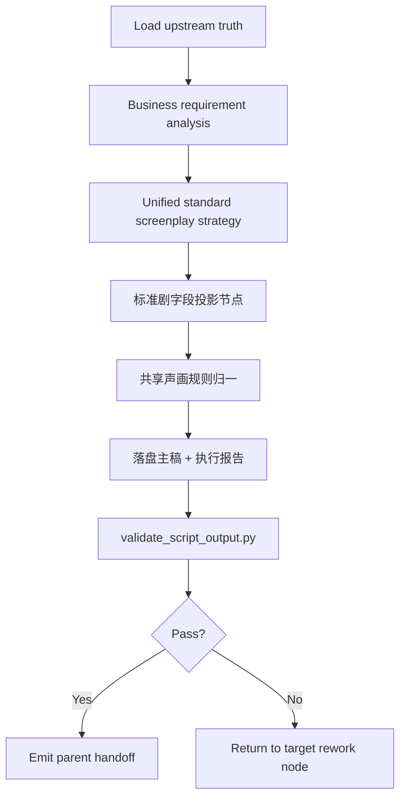
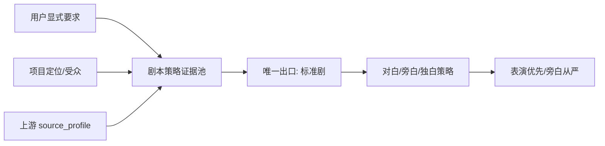
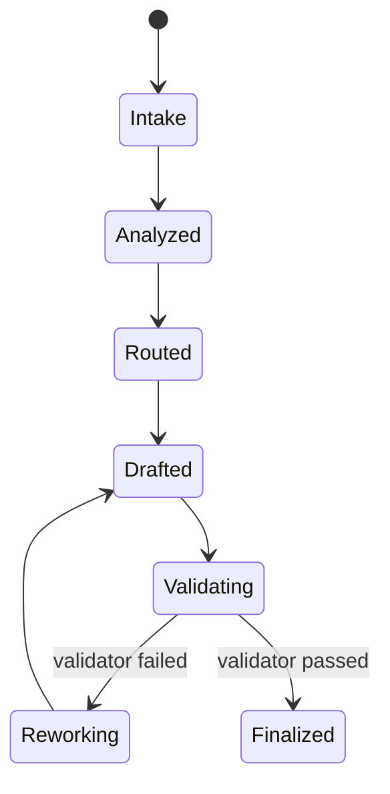
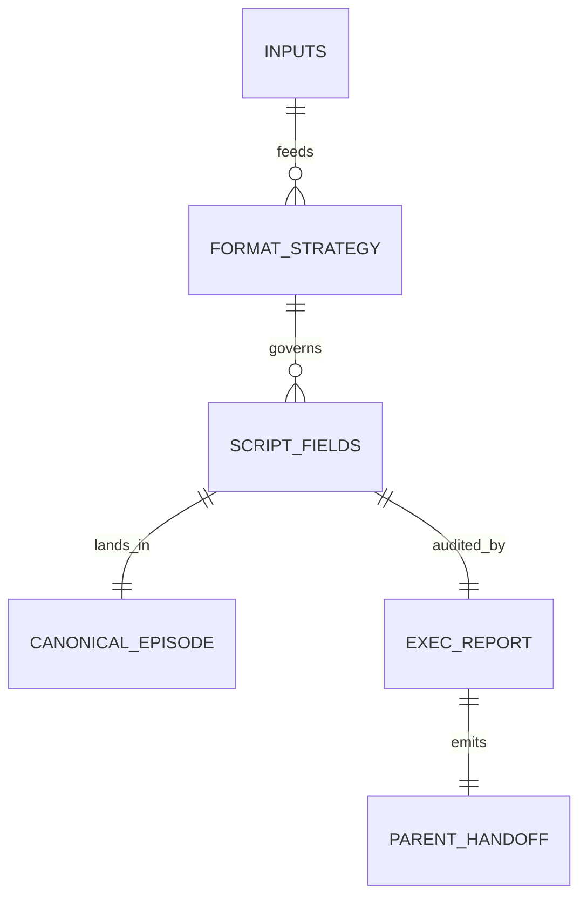

# aigc 2-剧本

> Fusion notice: 本文件已从旧 sibling `SKILL.md` 迁为 `aigc-planning` 的 `script_format` reference。文中“本技能”在当前包内均指 `2-剧本` 业务口径下的 `script_format` mode；运行入口统一由父级 `SKILL.md` 负责。
>
> Naming notice: 当前源层显示名为 `2-剧本`；历史 runtime 路径仍为 `projects/aigc/<项目名>/1-Planning/2-格式/`，内部 mode id 仍为 `script_format`。本次只调整表述口径，不改变执行规则、字段合同、目录路径或脚本接口。

## Context Loading Contract

- 每次调用本技能时，必须同时加载同目录 `CONTEXT.md` 作为预加载上下文。
- 若同目录 `CONTEXT.md` 缺失，应先补齐最小知识库骨架，或向用户明确报告阻塞；不得在未检查该上下文的情况下执行技能。
- 冲突优先级：用户显式请求 > 仓库/全局 `AGENTS.md` > 本 `SKILL.md` > 同目录 `CONTEXT.md`。

## 概述

`2-剧本` 是 `1-Planning` 下负责“逐集原文真源 -> 规划阶段 canonical 剧本主稿”的单技能真源。

本次口径固定为：

- 内容与机制继续全面继承历史 `2-格式` 配置与 `AIGC-ZEN-VOID/.agents/skills/aigc2026/1-编剧/2-对白·独白·旁白` 的高价值规则
- 但所有原本散落在旧规划组文档中的标准剧本主稿投影、对白/旁白/独白字段整理与 team/gating 规则，统一内化回本 `SKILL.md`
- `2-剧本` 不再依赖外部 planning agent 文档才能完成标准剧剧本策略、文本层规则选择、主稿落盘、validator 闭环与下游 handoff
- “标准剧 / 解说剧 / 双案对照”的输出区分已移除；当前唯一 canonical 出口为 `标准剧`

## Internal Capability Fusion Contract (Mandatory)

本技能采用知行合一的“单技能内化能力面”合同，不再把以下能力外包给独立 agent 文档：

| 内化能力面 | 原职责来源 | 当前收口位置 | 当前职责 |
| --- | --- | --- | --- |
| `标准剧本投影内核` | 旧 `格式判模.md / 标准剧.md` | 本 `SKILL.md` 的 `Unified Standard Format Contract` | 固定唯一出口为 `标准剧`，负责“原文保真、表演优先、旁白从严、独白适配”的字段纪律与文本整理 |
| `规划编排边界` | 旧 `team.md` | 本 `SKILL.md` 的 `Topology / Node / Handoff` | 固定谁负责裁决、谁负责写回、谁负责验证、谁负责下游交接 |
| `下游分组/节奏接口` | 旧 `分组.md / 节奏.md` 中与剧本交接有关部分 | 本 `SKILL.md` 的 `Downstream Interface Contract` | 只保留剧本对 `3-分组` 与节奏复核真正需要的交接字段，不越权执行下游阶段 |

硬规则：

1. `2-剧本` 必须能在不读取任何已废弃旧规划组文档的情况下完整执行。
2. 本技能只允许一个 canonical 写回 owner：`2-剧本` skill 本体。
3. 不再建立“格式判模 / 解说剧 / 双案对照”分支；用户提到讲述型、旁白主导或对照需求时，只能作为标准剧内部旁白/独白/执行报告策略记录，不得长出外部第二真源。
4. 分组与节奏只作为下游接口约束存在，不得重新反客为主占有本阶段写回权。

## Canonical Anchors

| 载体 | 位置 | 作用 |
| --- | --- | --- |
| 剧本主稿 | `projects/aigc/<项目名>/1-Planning/2-格式/第N集.md` | 规划阶段逐集 canonical 主稿；业务口径为 `2-剧本` |
| 总执行报告 | `projects/aigc/<项目名>/1-Planning/2-格式/执行报告.md` | 以 episode 区块记录全部已执行集的剧本策略、结构重排、validator 与返工结论 |
| 剧本策略证据 | `projects/aigc/<项目名>/1-Planning/2-格式/agents-plan/第N集.standard.md` | 可选证据，不与主稿竞争 |
| 上游逐集真源 | `projects/aigc/<项目名>/1-Planning/1-分集/第N集.md` | `1-分集` 产出的逐集原文真源 |
| 上游执行报告 | `projects/aigc/<项目名>/1-Planning/1-分集/执行报告.md` | coverage、`source_profile` 与边界证据 |
| 上游机读索引 | `projects/aigc/<项目名>/1-Planning/episode-split-plan.json` | 分集边界、`source_profile`、`bootstrap_output` |
| 共享校验器 | `.agents/skills/aigc/1-规划/scripts/validate_script_output.py` | 校验 `标准剧` 主稿结构与高频硬门禁 |

## Shared Preload Contract (Mandatory)

- 强制读取：`references/planning-io-contract.md`
- 强制读取：`.agents/skills/aigc/_shared/story-source-contract.md`
- 强制读取：`.agents/skills/aigc/_shared/project-runtime-layout.md`
- 强制读取：同目录 `CONTEXT.md`

硬规则：

1. 输入真源只能来自 `1-分集` 产物，不得回退到 `Story/` 做二次自由切分。
2. 本阶段不提前生成 `2-Global/*.md` 或 `3-Detail/第N集.json`。
3. 本阶段写回对象只有历史 runtime 路径 `2-格式/第N集.md` 与唯一 `2-格式/执行报告.md`；业务口径称为 `2-剧本`，不得为每集生成 `第N集-执行报告.md`。
4. 若要保留思行证据，只能写进 `agents-plan/` 侧车，不能伪装成主稿或第二份剧本。

## Visual Maps









## Business Requirement Analysis Contract

在进入任何正文改写之前，必须先锁定下列业务问题：

| business_slot | 必答问题 |
| --- | --- |
| `business_goal` | 当前标准剧本投影要服务什么：表演优先、旁白补信息、独白增强主观叙事，还是多方共用？ |
| `business_object` | 当前集的规划主稿要服务谁：`3-分组`、节奏复核、人工阅读、还是多方共用？ |
| `constraint_profile` | 是否存在对白冻结、旁白主体、内心独白、镜头语言预设、保序等硬约束？ |
| `risk_profile` | 当前最易出错的是原文删减、旁白过量、动作混入引号、还是声画错配？ |
| `success_criteria` | 本轮完成后，什么样的主稿可以直接交给 `3-分组` 而不需要二次猜结构？ |
| `non_goals` | 明确不做剧情改写、不做导演语法、不做下游分组/节奏执行 |

若这些问题未锁定，只能继续补分析，不得直接落盘正文。

## Total Input Contract

### Required Inputs

- `projects/aigc/<项目名>/1-Planning/1-分集/第N集.md`
- `projects/aigc/<项目名>/1-Planning/1-分集/执行报告.md`
- `projects/aigc/<项目名>/1-Planning/episode-split-plan.json`

### Optional Inputs

- `projects/aigc/<项目名>/0-Init/story-source-manifest.yaml`
- 用户显式指定的受众、旁白密度、对白保真、内心独白开关
- 父级已有 `validation-report.md`

### Forbidden Inputs

- 当前项目外部剧本文本
- 直接来自 `2-Global / 3-Detail` 的导演扩写结果
- 未登记的临时改写稿

## Topology Contract (Mandatory)

### Thinking-Action Node Contract

| node_id | objective | inputs | actions | evidence | route_out | gate |
| --- | --- | --- | --- | --- | --- | --- |
| `N1-intake` | 锁定上游真源与任务边界 | 上游逐集文稿、执行报告、机读索引、用户要求 | 读取输入、确认 episode 与输出路径 | 输入清单、边界卡 | `ok -> N2`, `fail -> stop` | 不允许直接汇流 |
| `N2-analyze` | 完成业务分析与风险识别 | `N1` 输出 | 提炼业务目标、受众、约束、风险、非目标 | business brief | `ok -> N3` | 不允许直接汇流 |
| `N3-route` | 锁定唯一标准剧本策略 | 用户信号、项目定位、`source_profile` | 统一归一为 `标准剧`，记录对白/旁白/独白策略 | 剧本策略摘要 | `standard -> N4S` | 不允许直接汇流 |
| `N4S-standard` | 生成标准剧结构草稿 | `N3`、上游正文 | 按标准剧规则整理场景、对白、旁白、独白、动作、画面 | standard patch | `ok -> N5` | 不允许直接汇流 |
| `N5-normalize` | 统一共享门禁 | standard patch | 应用原文保真、对白冻结、主体、双引号、动作剥离、声画配对、字数回填等共享规则 | canonical draft | `ok -> N6`, `fail -> N4S` | 通过后才可进入汇流 |
| `N6-writeback` | 写回主稿与总执行报告 | canonical draft | 落盘 `第N集.md`，并把该集裁决、validator 结果与 handoff 追加/更新到唯一 `执行报告.md`，可选 `agents-plan/` | 文件落盘证据 | `ok -> N7` | 通过后才可进入汇流 |
| `N7-validate` | 运行 validator 并返工 | 输出文件、上游文件 | 调 `validate_script_output.py`，收集失败码 | validator verdict | `pass -> N8`, `fail -> N4*/N5` | 通过后才可汇流 |
| `N8-handoff` | 生成父级 handoff | 执行报告、主稿、validator 结果 | 回传最小 patch / note / report | parent handoff | `done` | 最终汇流点 |

### Convergence Contract

- 只有 `N7-validate` 返回通过，才允许进入 `N8-handoff`
- 不允许生成解说剧或双案 canonical 主稿；任何旁白主导需求都回写为标准剧内部策略
- validator 失败时，必须回退到最小必要节点：
  - 剧本策略错：回退 `N3-route`
  - 标准剧字段规则错：回退 `N4S`
  - 共享门禁错：回退 `N5-normalize`
  - 纯写回/报告错：回退 `N6-writeback`

## Unified Standard Format Contract (Mandatory)

### 唯一出口规则

1. `2-剧本` 的唯一 canonical 剧本类型为 `标准剧`。
2. 用户显式要求“解说剧 / 旁白主导 / 非对白旁白化 / 讲述者视角”时，不切分支；只在标准剧内部提高旁白/独白策略权重，并在执行报告记录原因。
3. 用户显式要求“对照案 / 双案”时，不生成双主稿；可在执行报告给出策略对照摘要，但主稿仍只落 `标准剧`。
4. 未显式指定时，仍按标准剧保守默认值执行。
5. 任何旧命令、旧模板或旧 sidecar 的 `explainer/compare` 信号都必须归一为 `standard`。

### 剧本策略证据位

- `selected_variant`
- `format_signals`
- `dialogue_policy`
- `narration_policy`
- `inner_monologue_policy`
- `downstream_consumption_expectation`

## Standard Writing Contract (Mandatory)

### Shared Rules

1. `2-剧本` 是上游 `1-分集` 正文的影视剧本化结构投影，不得压缩、摘要、删减剧情事实或自由改写剧情因果；除新增 frontmatter、`【剧本正文】`、场景标题与字段标签外，必须完整承接上游原文信息量和顺序
2. 对白逐字保真，不做润色、删改、同义替换、语序重排
3. 原文中适合作为角色主观经验、感知、判断或内在压力的描写，可在不删改原意的前提下投影为 `独白（角色）` / `内心独白（角色）`，用于后续影视化叙事；这不是摘要许可
4. 对白/内心独白/旁白都必须显式带主体，正文使用中文双引号
5. 文本与声音条目必须就近配对同命题画面字段：`对白 -> 对白画面`、`独白/内心独白 -> 独白画面/内心独白画面`、`旁白 -> 旁白画面`、`音效 -> 音效画面`
6. 每个场景至少 1 条正式剧本画面字段；`动作画面` 只承载可拍摄的身体动作或空间运动，不得直接粘贴小说章节名、心理解释、背景说明、抽象判断或“没有人知道”一类叙述句
7. 引号内不得混入动作描写；动作全部下沉到 `*画面`
8. `总字数` 必须按最终 `【剧本正文】` 实算回填
9. `镜头语言预设` 仅可整理上游明确存在的运镜，不得脑补
10. 场景标题统一使用阿拉伯数字编号 + 好莱坞标准剧本 slugline，例如 `### 场景1：内景 永夜私立中学二年级A班教室 - 日` 或 `### 场景2：外景 学校操场 - 夜`，以便下游 `3-分组` 稳定解析组起始场景号。标题不得写成剧情摘要、动作 beat 或主题解释。
11. 同一集内完全相同的 slugline（`内景/外景 + 场所 + 日/夜` 完全一致）必须沿用同一个场景编号；不得因为规则宣告、角色入场、公告、能力觉醒等叙事 beat 变化而另起场景号。日/夜不同或真实地点/空间范围变化时，才可视为新场景。
12. 连续承接同一 slugline 时，只允许首次出现 `### 场景N：...` 标题；后续 beat 直接接正文，不得反复打印相同场景标题。
13. 必须按语境增设正式字段标题，允许但不限于：`环境描写`、`角色动作`、`动作画面`、`群像画面`、`表情特写`、`角色造型`、`道具特写`、`系统画面`、`规则显影`、`现实灾难画面`、`音效`、`音效画面`、`转场`、`心理反应`、`表演提示`、`镜头语言预设`
14. 各类“画面”字段允许剧本化改写，不必逐字遵照小说原文；改写目标是让画面可拍、可分组、可服务表演与调度，但不得删掉原文事实、改变事件顺序或把动作改成解释性旁白
15. 声画成组字段必须保持纯度：`对白/独白/旁白/音效` 只写可听见或可说出的文本/声音本体；对应 `*画面` 只写可见画面、表演、空间或承托，不重复解释声音文本，不把画面动作塞回声音行

### 字段标题分流规则

| 原文内容类型 | 优先字段 | 处理要求 |
| --- | --- | --- |
| 角色可见动作、位移、手部动作、姿态变化 | `角色动作` / `动作画面` | 改写成可拍摄的短句，避免“他意识到/他记起/他感觉”等小说内视 |
| 教室、走廊、光线、窗帘、空气压迫、空间状态 | `环境描写` | 服务氛围与后续美术，不混入人物心理解释 |
| 高跟鞋、铃声、苹果尖叫、机械提示、走廊异响 | `音效` + `音效画面` | `音效` 写声音来源、质感、节奏和空间方位；`音效画面` 写声音触发时的可见源头、人物反应、空间承托或不可见来源的画面处理 |
| 苹果、教鞭、课本、黑板文字、血字、白纸 | `道具特写` / `规则显影` | 让道具成为规则信息载体 |
| 天道系统、真理之眼、好感度、死亡通报 | `系统画面` / `规则显影` / `旁白（系统提示）` | 文字信息可由旁白承载，画面字段负责可视化呈现 |
| 群体反应、全班凝固、集体低头、哭声扩散 | `群像画面` | 用可见行为表达群体心理 |
| 角色主观判断、恐惧、推理、记忆回闪 | `独白` / `心理反应` / `表演提示` | 可转独白或表演提示；不要塞进 `动作画面` |
| 角色服装、色彩构成、危险气质、非动作造型信息 | `角色造型` / `表情特写` | 服务造型、美术和表演，不作为动作句处理 |
| 国运灾难、新闻碎片、现实世界同步后果 | `现实灾难画面` / `系统画面` | 作为短促压力插针，不挤占教室主叙事 |

### 标准剧规则

- 默认服务“表演优先、对白承载核心信息”
- 场景标题必须采用 `内景/外景 场所 - 日/夜` 的 slugline 形式；若同一场景需要表达直播分屏、系统公告或心理视野，应写入动作画面，不写进标题摘要。
- 场景编号表达真实拍摄场景，不表达段落 beat；同一教室、同一日景中的多段事件应保留同一场景号，分段任务交给 `3-分组` 的分镜组 ID。
- 同一 slugline 的连续正文必须合并在同一个场景标题下；不要用重复场景标题模拟段落分隔。
- 旁白只在信息若不显式说出会造成时空/知情误解时启用
- 内心独白仅在用户显式要求或心理推进缺口显著时启用
- 禁止把标准剧写成说明腔或旁白常开层；讲述型需求只能表现为必要旁白/独白字段，不形成新剧本变体

## Downstream Interface Contract (Mandatory)

`2-剧本` 只给 `3-分组` 与节奏复核提供可消费接口，不执行下游动作。

### 必须稳定交出的字段

- `selected_variant`
- `dialogue_policy`
- `narration_policy`
- `inner_monologue_policy`
- `scene_count`
- `source_profile`
- `bootstrap_output`
- `upstream_paths`

### 禁止越权内容

- 不直接给出 authoritative `group_count`
- 不直接给出 authoritative `estimated_duration_seconds`
- 不提前写 `节奏蓝图`
- 不把下游 reviewer 意见写进本阶段 canonical 主稿

## One-Shot Output Contract

### A. Canonical 剧本主稿

路径：

`projects/aigc/<项目名>/1-Planning/2-格式/第N集.md`

```markdown
---
项目名: <项目名>
集数: 第<n>集
剧本变体: 标准剧
source_type: <source_type>
coverage_scope: <coverage_scope>
split_scope: <incremental|full_season>
总字数: <当前正文实算值>
bootstrap_output: projects/aigc/<项目名>/2-Global/导演意图.md
upstream_source: projects/aigc/<项目名>/1-Planning/1-分集/第<n>集.md
---

【剧本正文】
### 场景1：内景 <场所> - <日|夜>
...
```

### B. 总执行报告

路径：

`projects/aigc/<项目名>/1-Planning/2-格式/执行报告.md`

报告结构：

- 顶层标题固定为 `# 1-Planning 2-剧本执行报告`
- 每个已执行 episode 使用 `## 第N集` 区块登记
- 未执行 episode 不补空区块

- `## 输入清单`
- `## 业务分析摘要`
- `## 剧本策略`
- `## 结构重排摘要`
- `## validator 结果`
- `## 父级 handoff`
- `## 验收结论与返工项`

在总报告内，上述固定区块应作为每个 `## 第N集` 下的局部二级/三级区块，或使用同等可解析标题。报告只允许一份，不得旁挂逐集执行报告。

### C. Parent Handoff Patch

最小返回字段：

- `episode_id`
- `selected_variant`
- `script_output_path`
- `scene_count`
- `dialogue_policy`
- `narration_policy`
- `inner_monologue_policy`
- `source_profile`
- `bootstrap_output`
- `upstream_paths`

## Variable Scenario Map (VSM)

### Variable Register

| var_id | 变量层级 | 观测信号 | 状态集合 | 检测方法 |
| --- | --- | --- | --- | --- |
| `V-FORMAT-SIGNAL` | 路由 | 用户/项目给出的剧本策略信号是否已归一到标准剧 | `standard/normalized/unknown` | 指令 + 项目定位读取 |
| `V-DIALOGUE-FREEZE` | 文本 | 对白是否逐字等同上游 | `pass/fail` | 上游引号文本比对 |
| `V-NARRATOR-CONSISTENCY` | 体裁 | 旁白主体是否一致 | `pass/fail` | 旁白主体扫描 |
| `V-INNER-MODE` | 体裁 | 是否适合将主观描写转为独白 | `allow/restrict` | 用户要求 + 原文叙事功能 |
| `V-VISUAL-PAIR` | 结构 | 文本条目是否就近配对 `*画面` | `pass/fail` | 邻接字段检查 |
| `V-ACTION-ISOLATION` | 文本 | 引号内是否夹带动作 | `pass/fail` | 正则扫描 |
| `V-WORDCOUNT-SYNC` | 收尾 | `总字数` 是否已回填 | `pass/fail` | 正文字数实算 |

### Scenario Table

| case_id | 触发谓词 | 默认策略 | 返工入口 |
| --- | --- | --- | --- |
| `C1-FORMAT-AMBIGUOUS` | `V-FORMAT-SIGNAL=unknown` | 回退 `标准剧` 并记录理由 | `N3-route` |
| `C2-DIALOGUE-DRIFT` | `V-DIALOGUE-FREEZE=fail` | 回滚对白到上游逐字文本 | `N4*/N5` |
| `C3-NARRATOR-DRIFT` | `V-NARRATOR-CONSISTENCY=fail` | 统一旁白主体 | `N4S/N5` |
| `C4-INNER-OVERUSE` | `V-INNER-MODE=restrict` 且独白过量 | 回收到动作画面或旁白字段 | `N4S/N5` |
| `C5-VISUAL-MISS` | `V-VISUAL-PAIR=fail` | 补齐或重排 `*画面` | `N5` |
| `C6-ACTION-MIXED` | `V-ACTION-ISOLATION=fail` | 动作下沉到画面字段 | `N5` |
| `C7-WORDCOUNT-STALE` | `V-WORDCOUNT-SYNC=fail` | 重算并回填 `总字数` | `N6/N7` |

## Quality And Audit Contract

### 评分矩阵

| 维度 | 指标 | 分值 |
| --- | --- | --- |
| 维度0: 契约遵循 | 是否遵守“统一标准剧本投影 + 单 owner 写回 + validator 闭环” | __/10 |
| 维度1 | 上游输入继承正确性 | __/10 |
| 维度2 | 剧本策略正确性 | __/10 |
| 维度3 | 场景结构完整性 | __/10 |
| 维度4 | 对白/旁白/独白格式合法性 | __/10 |
| 维度5 | 文本-画面同命题配对 | __/10 |
| 维度6 | 旁白密度与主体纪律 | __/10 |
| 维度7 | `source_profile + bootstrap_output` handoff 完整性 | __/10 |
| 维度8 | 验收与返工闭环 | __/10 |

## Field Master

| field_id | 输出位置/字段 | 内容要求 | 默认责任 Step | 质量维度 | 失败码 |
| --- | --- | --- | --- | --- | --- |
| `FIELD-SCRIPT-01` | 输入锚点 | 锁定 `1-分集` 逐集原文、执行报告与机读索引 | S1 | 输入真源一致性 | `FAIL-SCRIPT-01` |
| `FIELD-SCRIPT-02` | 业务分析 | 锁定业务目标、受众、约束、风险与非目标 | S2 | 任务理解完整性 | `FAIL-SCRIPT-02` |
| `FIELD-SCRIPT-03` | 剧本策略 | 锁定唯一标准剧出口与对白/旁白/独白策略 | S3 | 路由正确性 | `FAIL-SCRIPT-03` |
| `FIELD-SCRIPT-04` | 文本整形 | 按标准剧本规则生成结构化主稿草案 | S4 | 剧本执行稳定性 | `FAIL-SCRIPT-04` |
| `FIELD-SCRIPT-05` | 共享门禁 | 完成对白冻结、主体、双引号、动作剥离、声画配对、字数回填 | S5 | 结构稳定性 | `FAIL-SCRIPT-05` |
| `FIELD-SCRIPT-06` | 主稿落盘 | 写出 `2-剧本` 主稿（runtime: `2-格式/第N集.md`）与执行报告 | S6 | 输出完整性 | `FAIL-SCRIPT-06` |
| `FIELD-SCRIPT-07` | validator | 调脚本并收敛返工入口 | S7 | 质量门闭环 | `FAIL-SCRIPT-07` |
| `FIELD-SCRIPT-08` | 父级 handoff | 返回 `selected_variant=标准剧 + source_profile + bootstrap_output` patch | S8 | handoff 可消费性 | `FAIL-SCRIPT-08` |

## Thought Pass Map

| step_id | 聚焦字段 | 核心问题 | 生成动作 | 未达标信号 |
| --- | --- | --- | --- | --- |
| `S1` | `FIELD-SCRIPT-01` | 输入是否唯一且可追溯 | 读取并锁定上游输入 | 回退到 `Story/` 自由切分 |
| `S2` | `FIELD-SCRIPT-02` | 本轮究竟要解决什么剧本问题 | 输出 business brief | 直接跳过分析开始正文整理 |
| `S3` | `FIELD-SCRIPT-03` | 本轮标准剧内部策略如何定 | 记录剧本策略与归一原因 | 又生成解说剧或双案分支 |
| `S4` | `FIELD-SCRIPT-04` | 标准剧如何组织正文 | 生成标准剧草稿 | 把旧分支规则混写 |
| `S5` | `FIELD-SCRIPT-05` | 共享硬门禁是否全部满足 | 归一声画与剧本规则 | 只靠肉眼回放 |
| `S6` | `FIELD-SCRIPT-06` | canonical 主稿如何落盘 | 写主稿与执行报告 | 只返 note 不写文件 |
| `S7` | `FIELD-SCRIPT-07` | 输出是否通过质量门 | 跑 validator 并回退失败节点 | validator 失败仍宣告完成 |
| `S8` | `FIELD-SCRIPT-08` | 父级真正需要什么 | 生成最小 handoff patch | 漏掉 `bootstrap_output` 或策略字段 |

## Pass Table

| field_id | Pass Standard | Fail Code | Rework Entry |
| --- | --- | --- | --- |
| `FIELD-SCRIPT-01` | 输入只来自 `1-分集` 输出物 | `FAIL-SCRIPT-01` | `S1` |
| `FIELD-SCRIPT-02` | 业务目标、约束、风险与非目标明确 | `FAIL-SCRIPT-02` | `S2` |
| `FIELD-SCRIPT-03` | 唯一标准剧出口明确，剧本策略可追溯 | `FAIL-SCRIPT-03` | `S3` |
| `FIELD-SCRIPT-04` | 标准剧本规则与共享规则未混写 | `FAIL-SCRIPT-04` | `S4` |
| `FIELD-SCRIPT-05` | 对白冻结、主体、配对、动作剥离、字数回填全部达标 | `FAIL-SCRIPT-05` | `S5` |
| `FIELD-SCRIPT-06` | `第N集.md` 与执行报告都已落盘 | `FAIL-SCRIPT-06` | `S6` |
| `FIELD-SCRIPT-07` | validator 通过或失败项已明确返工 | `FAIL-SCRIPT-07` | `S7` |
| `FIELD-SCRIPT-08` | handoff 含 `selected_variant / source_profile / bootstrap_output` | `FAIL-SCRIPT-08` | `S8` |

## Root-Cause Execution Contract (Mandatory)

当 `2-剧本` 出现以下问题时，必须先修源层：

- 又把解说剧、双案对照或变体裁决重新拆回外部 agent 文档
- 绕过 `1-分集` 输出物直接重做自由切分
- 把下游分组/节奏判断提前写进本阶段主稿
- validator 缺少高频硬门禁，只能靠人工兜底

必经链路：

`Symptom -> Direct Technical Cause -> Rule Source -> Meta Rule Source -> Fix Landing Points`

优先检查：

- `Rule Source`
  - `.agents/skills/aigc/1-规划/references/script-format-contract.md`
  - `.agents/skills/aigc/1-规划/knowledge-base/script-format-heuristics.md`
  - `.agents/skills/aigc/1-规划/scripts/validate_script_output.py`
  - `.agents/skills/aigc/1-规划/references/planning-io-contract.md`
- `Meta Rule Source`
  - `AGENTS.md`
  - `.agents/skills/aigc/1-规划/SKILL.md`
  - `.agents/skills/aigc/_shared/project-runtime-layout.md`

面向用户的闭环固定返回：

1. root cause location
2. immediate fix
3. systemic prevention fix

## Completion Criteria

- 已建立单技能内化标准剧本投影与执行闭环，不再依赖任何已废弃旧规划组文档
- 已能从 `1-分集` 输出物生成 `2-剧本` 主稿（runtime: `2-格式/第N集.md`），并把全部已执行集汇总进唯一 `2-格式/执行报告.md`
- 已移除 `标准剧 / 解说剧 / 双案对照` 区分，唯一 canonical 主稿出口为 `标准剧`
- 已具备统一 validator、父级 handoff 与下游接口边界

## Skill 2.0 Fusion Enhancement

- 当前文件是 `aigc-planning` 单包内 `script_format` mode 的 reference 真源，不再是独立 `SKILL.md` 入口。
- 调用入口统一为 `.agents/skills/aigc/1-规划/SKILL.md` 与 `$aigc-planning`。
- 原 sibling `CONTEXT.md` 已迁入 `knowledge-base/script-format-heuristics.md`。
- 原 validator 已迁入 `scripts/validate_script_output.py`。
