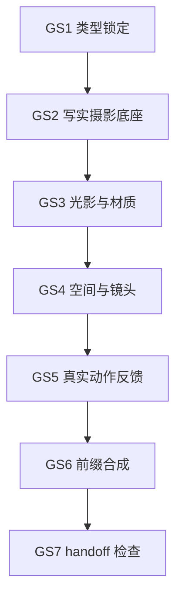

# 全局风格词生成流程

本文件细化 `N3-PROJECT-GLOBAL` 中 `global_style_engine` 的思行节点。它不替代 `references/思行网络.md`，只负责 `全局风格` 字段的生成与审计。

## Node Map

| node_id | 判断 | 动作 | 证据 | 输出 | gate |
| --- | --- | --- | --- | --- | --- |
| `GS1-STYLE-TYPE` | 项目是否属于真人古装影视默认基线 | 读取 `north_star / init_handoff / MEMORY.md / team.yaml`，必要时形成 `style_type_profile` | `style_type_note` | `style_type_profile` | 类型未明时不得直接套动画或游戏 CG 词 |
| `GS2-REALISM-LOCK` | 是否需要写实摄影底座 | 锁定真实摄影语法、高清电影级画质、真实人物与服饰质感 | `realism_evidence` | `realism_axis` | 不得出现赛璐璐、线稿、夸张残影 |
| `GS3-LIGHT-MATERIAL` | 光影与材质是否物理可信 | 写入场景动机光、物理照明、动态范围、真实材质反射 | `light_material_note` | `light_material_axis` | 不得写无来源神光或过曝辉光 |
| `GS4-SPACE-CAMERA` | 空间与镜头是否为高层约束 | 写入电影化纵深、权力关系调度、前中后景、克制稳定镜头语言 | `space_camera_note` | `space_camera_axis` | 不得写具体焦段、机位或推拉摇移参数 |
| `GS5-PHYSICAL-ACTION` | 动作反馈是否符合真实物理 | 写入动作反馈符合真实物理，并过滤动画化残影 | `physical_action_note` | `motion_axis` | 不得写粒子拖尾、速度线、非物理飘动 |
| `GS6-PREFIX-SYNTHESIS` | 是否可作为统一前缀继承 | 将上述轴线合成为 180-260 字左右的 `全局风格` | `candidate_prefix` | `project_global.全局风格` | 不得混入剧情摘要或工具参数 |
| `GS7-HANDOFF-CHECK` | 下游能否直接消费 | 同步到 `groups[].global.全局风格`，并记录验收 | `style_review_note` | `group_style_patch` | 未命中组不得被无 scope 覆盖 |

## Default Flow

## Patch Rules

1. `episode-bootstrap` 必须完整执行 `GS1-GS7`。
2. `incremental-patch` 若只修 `全局风格`，至少执行 `GS1 / GS6 / GS7`；若涉及媒介类型变化，必须完整执行。
3. legacy Markdown 不能重写风格判断；新执行只写按集 JSON。
4. 用户给出的全局风格最佳实践优先作为 `GS2-GS6` 的源规则，不交给脚本生成或启发式拼接。
