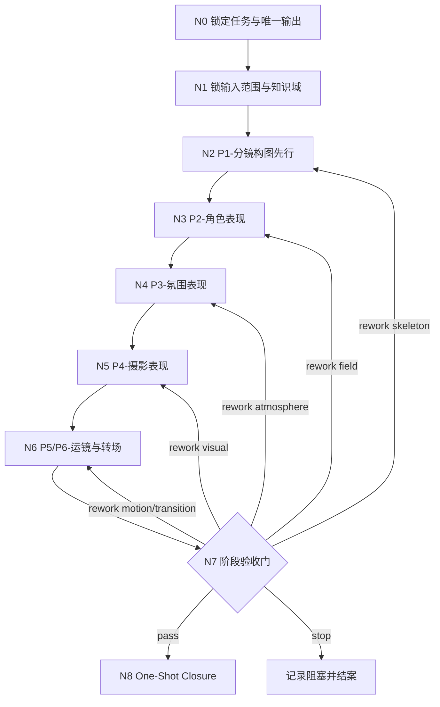
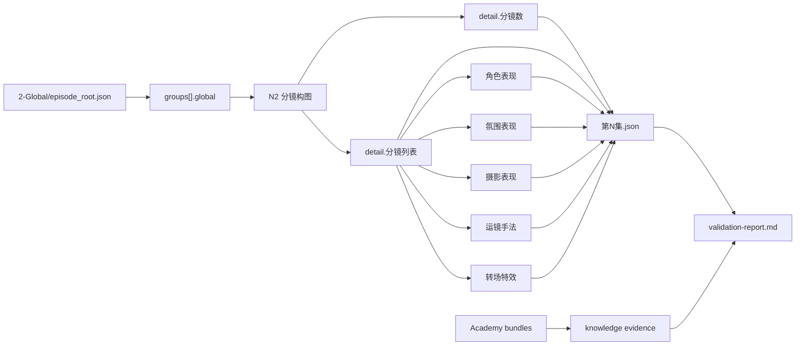
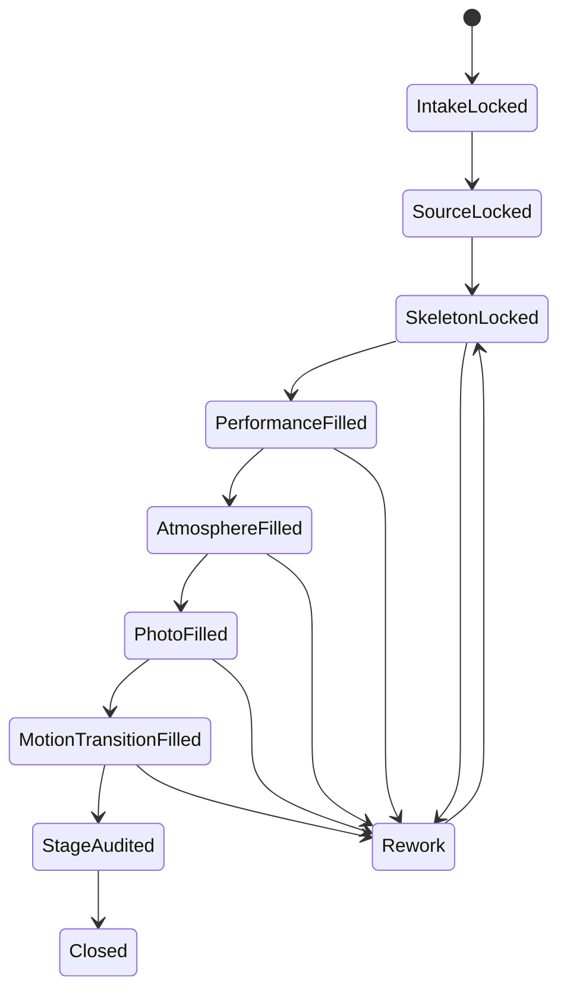

# aigc 3-Detail

`3-Detail` 是 `aigc` 主链的镜级细化阶段。它把 `2-Global` 的组级 seed root 收束为可被 `4-Design / 5-Image / 6-Video` 消费的唯一 detail root，并在同一轮写回阶段验收报告。

## Context Loading Contract

- 每次调用本技能时，必须同时加载同目录 `CONTEXT.md` 作为预加载上下文。
- 若当前任务已绑定 `projects/aigc/<项目名>/`，在执行字段写回前还必须读取项目根 `MEMORY.md`，并按任务相关性读取项目根 `CONTEXT/`。
- 本技能采用 Skill 2.0 动态引用结构：`SKILL.md` 只保留入口、路由、关键门禁、Root-Cause 上溯和 Output Contract；细则由 `references/`、`steps/`、`types/`、`review/`、`templates/`、`knowledge-base/` 与 `scripts/` 分担。
- 冲突优先级固定为：用户显式请求 > 根 `AGENTS.md` > `.agents/skills/aigc/SKILL.md` > 本 `SKILL.md` > 本技能分区文件 > 项目级 `MEMORY.md` > 项目级 `CONTEXT/` > 本 `CONTEXT.md`。

## Input Contract

### Accepted input

- 运行或修复 `3-Detail` 阶段，目标是生成、补全、局部 patch 或验收 `projects/aigc/<项目名>/3-Detail/第N集.json`。
- 从 `projects/aigc/<项目名>/2-Global/episode_root.json` 继续细化镜头、表演、氛围、摄影、运镜与转场。
- 只修局部 `episode_scope / group_scope / shot_scope / field_scope / closure_scope`，但仍需保持阶段报告闭环。

### Required input

- `projects/aigc/<项目名>/2-Global/episode_root.json`

### Optional input

- `projects/aigc/<项目名>/3-Detail/第N集.json`
- `projects/aigc/<项目名>/1-Planning/3-分组/第N集.md`
- `projects/aigc/<项目名>/team.yaml`
- 项目根 `MEMORY.md` 与 `CONTEXT/` 中和本集、本组、本轮 patch 直接相关的材料。

### Reject or clarify when

- 无法定位项目名、集数或 `2-Global/episode_root.json`。
- 用户要求跳过 `1-分镜构图` 直接写后序字段，且没有明确声明本轮只修已锁骨架后的局部字段。
- 用户要求脚本自动生成镜级正文、字段正文或创作判断。
- 目标实际属于 `2-Global` 重写、`4-Design` 设计、`5-Image` 图像提示词或 `6-Video` 视频生成。

## Mode Selection

| mode | 触发信号 | 最小入口 | 输出 |
| --- | --- | --- | --- |
| `first_write` | 目标集尚无 detail root | `N1 -> N8` | 新建 `第N集.json` 与 `validation-report.md` |
| `episode_patch` | 上游整集 seed 大幅变化 | `N1 -> N8` | 重建或全量 patch 整集 |
| `group_patch` | 只命中一个或多个分镜组 | `N2 -> N8` | 只 patch 命中组，保留未命中组 |
| `shot_patch` | 只命中单镜或少量镜头 | `N2` 或字段节点 | 只 patch 命中镜头 |
| `field_patch` | 只修后序字段 | `N3 / N4 / N5 / N6` | 不反向改骨架 |
| `closure_patch` | 只补验收报告或 closure | `N7 / N8` | 只更新 `validation-report.md` |

## Purpose & Scope

`3-Detail` 的业务对象是：

- canonical detail root：`projects/aigc/<项目名>/3-Detail/第N集.json`
- stage validation report：`projects/aigc/<项目名>/3-Detail/validation-report.md`

阶段目标固定为：

1. 结构先成立：固定先执行 `1-分镜构图`，先锁 `分镜数 + 分镜列表` 骨架。
2. 字段边界不串位：表演、氛围、摄影、运镜、转场都不能反向改骨架。
3. 学院派知识有效转译：知识包只增强判断，不替代字段写作。
4. 结果一次性收束：最终只向一个主 JSON 和一个阶段报告写回。

## LLM-First Creative Authorship Contract

- `3-Detail` 的镜级正文、分镜构图、角色表现、氛围表现、摄影表现、运镜手法、转场特效，均属于内容创作型输出，必须由 LLM 直接完成。
- `scripts/validate_stage_output.py`、`scripts/validate_node_packs.py`、`scripts/validate_creative_guidance.py` 只承担结构校验、引用校验、知识证据校验与审计护栏职责。
- 脚本不得生成、拼接、压缩扩写或模板灌写 canonical creative truth。
- `legacy/compat/` 仅保留迁移、投影、对照或校验用途，不拥有当前主链写回权。

## Reference Loading Guide

| 场景 | 读取文件 |
| --- | --- |
| 锁定共享真源、运行时路径和模板壳 | `.agents/skills/aigc/_shared/project-runtime-layout.md`、`.agents/skills/aigc/_shared/group_design_seed_contract.md`、`.agents/skills/aigc/3-Detail/_shared/episode_detail.json` |
| 确认字段载体、旧兼容边界和主链唯一输出 | `.agents/skills/aigc/3-Detail/_shared/branch-output-contract.md` |
| 确认节点包边界与旧 references 兼容入口 | `.agents/skills/aigc/3-Detail/_shared/node-pack-contract.md`、`references/思行网络.md`、`steps/detail-thinking-action-workflow.md` |
| 确认创作引导、路由偏置和 closure 写法 | `.agents/skills/aigc/3-Detail/_shared/creative-guidance-contract.md`、`references/路由画像.yaml`、`references/正反例.md`、`references/创作评审标尺.md`、`references/validation-report-closure-guide.md` |
| 锁字段对象、pass 顺序与写作细则 | `references/能力通道图谱.yaml`、`references/模板字段填写指南.md`、`references/编剧手册.md`、`references/镜头语言.md` |
| 做局部 patch 或返工重入 | `references/incremental-patch-playbook.md`、`types/type-map.md` |
| 接入电影学院派知识 | `references/电影学院派知识接线.md`、`knowledge-base/detail-heuristics.md`、外部 `knowledge-base/电影学院派/README.md` 与被当前 `type_profile` 命中的知识包 |
| 做阶段验收和质量审查 | `review/review-contract.md`、`scripts/validate_stage_output.py`、`scripts/validate_node_packs.py`、`scripts/validate_creative_guidance.py` |
| 渲染输出样板或检查 Output Contract 对齐 | `templates/output-template.md` |
| 查看产品侧入口元数据 | `agents/openai.yaml` |

## Shared Canonical Sources

- `.agents/skills/aigc/SKILL.md`
- `.agents/skills/aigc/CONTEXT.md`
- `.agents/skills/aigc/2-Global/SKILL.md`
- `.agents/skills/aigc/2-Global/_shared/episode_root.json`
- `.agents/skills/aigc/2-Global/_shared/IO_CONTRACT.md`
- `.agents/skills/aigc/_shared/project-runtime-layout.md`
- `.agents/skills/aigc/_shared/group_design_seed_contract.md`
- `.agents/skills/aigc/3-Detail/_shared/episode_detail.json`
- `.agents/skills/aigc/3-Detail/_shared/branch-output-contract.md`
- `.agents/skills/aigc/3-Detail/_shared/node-pack-contract.md`
- `.agents/skills/aigc/3-Detail/_shared/creative-guidance-contract.md`
- `.agents/skills/aigc/3-Detail/references/思行网络.md`
- `.agents/skills/aigc/3-Detail/steps/detail-thinking-action-workflow.md`
- `.agents/skills/aigc/3-Detail/review/review-contract.md`
- `.agents/skills/aigc/3-Detail/types/type-map.md`
- `.agents/skills/aigc/3-Detail/templates/output-template.md`
- `.agents/skills/aigc/3-Detail/knowledge-base/detail-heuristics.md`

## Business Requirement Analysis Contract (Mandatory)

| analysis_slot | 当前结论 |
| --- | --- |
| `business_goal` | 将 `2-Global/episode_root.json` 的组级 seed root 细化为镜级 detail root，并通过固定顺序把分镜数、镜级正文和镜级字段收束为单一真源。 |
| `business_object` | `projects/aigc/<项目名>/3-Detail/第N集.json` 与 `projects/aigc/<项目名>/3-Detail/validation-report.md`。 |
| `constraint_profile` | 上游不提供 shot-level 字段；本阶段必须自己决定镜头切分、镜级正文、主体锚定与所有镜级字段。 |
| `success_criteria` | 每个命中 group 具备 `detail.分镜数`、完整 `分镜列表`、每镜 canonical 字段，以及可复核的校验报告。 |
| `non_goals` | 不重写 `2-Global` 组级事实，不恢复旧子技能主链，不创建第二份思考 sidecar。 |
| `complexity_source` | 镜头切分、字段边界、跨字段连续性、学院派知识转译、艺术性与下游可消费性的同时成立。 |
| `topology_fit` | 串行主干 + 条件返工 + 单点汇流。 |
| `step_strategy` | `N0-N8` 思行节点显式承载“锁任务、锁输入、锁骨架、补字段、验收、收束”。 |

## Academy Knowledge Utilization Contract (Mandatory)

学院派知识库是按需加载的判断库，不是教材摘抄来源。

| pass_id | 首要问题 | 推荐知识域 | 输出落点 |
| --- | --- | --- | --- |
| `P1-分镜构图` | 该切几镜、空间与戏剧节拍是否清晰 | `导演手册`、`分镜脚本` | `分镜数 / 时间 / 剧本正文 / 主体锚定 / 分镜构图` |
| `P2-角色表现` | 人物为什么这样演、对白攻守如何外显 | `导演手册` | `角色表现` |
| `P3-氛围表现` | 空间如何施压、气息如何可见 | `导演手册`、`电影摄影` | `氛围表现` |
| `P4-摄影表现` | 光色质如何服务当前戏 | `电影摄影`、`分镜脚本` | `摄影表现` |
| `P5-运镜手法` | 镜头如何带观众看 | `导演手册`、`分镜脚本` | `运镜手法` |
| `P6-转场特效` | 哪里需要最小必要桥接 | `导演手册`、`分镜脚本` | `转场特效` |
| `P7-验收` | 知识是否真实回译到字段 | `references/创作评审标尺.md` | `validation-report.md` |

硬规则：

1. 先看当前组的戏剧问题，再选择最小知识包。
2. 知识最终必须写回为当前 JSON 字段对象语言。
3. `validation-report.md` 必须显式记录 `## Academy Knowledge Evidence`。

## Internal Capability Fusion Contract (Mandatory)

`3-Detail` 当前内部能力按根技能固定 pass 治理：

| pass_id | 固定顺序 | 写入重点 | 默认节点 |
| --- | --- | --- | --- |
| `P1` | `1-分镜构图` | `detail.分镜数`、每镜 `时间 / 剧本正文 / 主体锚定 / 分镜构图` | `N2` |
| `P2` | `2-角色表现` | `角色表现` | `N3` |
| `P3` | `3-氛围表现` | `氛围表现` | `N4` |
| `P4` | `4-摄影表现` | `摄影表现` | `N5` |
| `P5` | `5-运镜手法` | `运镜手法` | `N6` |
| `P6` | `6-转场特效` | `转场特效` | `N6` |
| `P7` | `7-验收` | `validation-report.md` | `N7-N8` |

后序 pass 不得反向改写 `P1` 已锁定的镜数、分镜 ID、时间、正文切分或主体锚定；若必须改，显式回退到 `N2`。

## Topology Contract

串行主干固定为：

`N0 -> N1 -> N2 -> N3 -> N4 -> N5 -> N6 -> N7 -> N8`

返工规则：

- `N1` 判 scope、patch 范围和 `knowledge_mode`。
- `N2` 锁骨架；若镜数、时间、正文切分点不稳，原地返工。
- `N3-N6` 任何字段越权、抽象化或反改骨架，都回指定节点。
- `N7` 给出 `pass | rework | stop`。
- `N8` 只做唯一 closure，不另起 sidecar。

## Mermaid Visual Contract

## Thinking-Action Node Contract

完整节点动作、证据、路由和 gate 的 owner 是 `steps/detail-thinking-action-workflow.md`。入口层只保留节点总表：

| node_id | 节点名 | 主责任 | 失败回退 |
| --- | --- | --- | --- |
| `N0` | 锁定任务与唯一输出 | 锁定当前任务与唯一输出 | 停止并回父级路由 |
| `N1` | 锁输入范围与知识域 | 锁 episode/group scope、patch scope 与知识域 | `N0` |
| `N2` | `P1-分镜构图` | 先锁镜数、时间、正文切分点、主体锚定与构图 | `N1` 或 `N2` |
| `N3` | `P2-角色表现` | 补每镜表演与人物压力 | `N2` 或 `N3` |
| `N4` | `P3-氛围表现` | 补每镜环境压强与空间层次 | `N2` 或 `N4` |
| `N5` | `P4-摄影表现` | 补每镜光色质与视觉重力 | `N2` 或 `N5` |
| `N6` | `P5/P6-运镜与转场` | 补运动路径和最小必要转场 | `N2`、`N5` 或 `N6` |
| `N7` | `P7-验收` | 运行 validator、写验证报告、判定 pass/rework/stop | 指定返工节点 |
| `N8` | One-Shot Closure | 写 closure 四段并收束本轮 | `N7` |

## Field Mapping

### Field Master

| field_id | 输出位置/字段 | 内容要求 | 默认责任节点 | 失败码 |
| --- | --- | --- | --- | --- |
| `FIELD-DETAIL-01` | `meta` | 项目、集数、组数、总时长正确 | `N1` | `FAIL-DETAIL-01` |
| `FIELD-DETAIL-02` | `groups[].global` | 组级 seed 与上游含义一致 | `N1` | `FAIL-DETAIL-02` |
| `FIELD-DETAIL-03` | `detail.分镜数` | 镜数与实际分镜列表一致 | `N2` | `FAIL-DETAIL-03` |
| `FIELD-DETAIL-04` | `时间 / 剧本正文 / 主体锚定 / 分镜构图` | 每镜骨架完整且可拍 | `N2` | `FAIL-DETAIL-04` |
| `FIELD-DETAIL-05` | `角色表现` | 人物能演、能看、能被镜头放大 | `N3` | `FAIL-DETAIL-05` |
| `FIELD-DETAIL-06` | `氛围表现` | 环境施压真实、有层次、有意境来源 | `N4` | `FAIL-DETAIL-06` |
| `FIELD-DETAIL-07` | `摄影表现` | 光影与质感服务既有骨架 | `N5` | `FAIL-DETAIL-07` |
| `FIELD-DETAIL-08` | `运镜手法 / 转场特效` | 运动和衔接有收益但不喧宾夺主 | `N6` | `FAIL-DETAIL-08` |
| `FIELD-DETAIL-09` | `validation-report.md` closure | `思考过程 / 关键证据 / 风险/例外 / 下一入口` 齐备 | `N8` | `FAIL-DETAIL-09` |

### Thought Pass Map

| step_id | 对应节点 | 聚焦字段 | 核心问题 | 生成动作 |
| --- | --- | --- | --- | --- |
| `S0` | `N0` | 输出合同 | 本轮是不是 detail root 细化任务 | 锁唯一输出 |
| `S1` | `N1` | `FIELD-DETAIL-01~02` | 补哪一集、哪些 group、是否启用知识包 | 锁输入与知识域 |
| `S2` | `N2` | `FIELD-DETAIL-03~04` | 这组该切几镜，每镜承接哪段正文 | 先搭 detail skeleton |
| `S3` | `N3` | `FIELD-DETAIL-05` | 角色为什么这么演 | 填 `角色表现` |
| `S4` | `N4` | `FIELD-DETAIL-06` | 压力和空气从哪里来 | 填 `氛围表现` |
| `S5` | `N5` | `FIELD-DETAIL-07` | 光影和质感如何服务这组戏 | 填 `摄影表现` |
| `S6` | `N6` | `FIELD-DETAIL-08` | 观众怎么被带着看、如何顺滑转入下一拍 | 填 `运镜手法 / 转场特效` |
| `S7` | `N7` | 验收字段 | 当前结果是否可被下游直接消费 | 跑 validator 并写 report |
| `S8` | `N8` | `FIELD-DETAIL-09` | 现在是否真的允许结案 | 写 closure 四段 |

### Pass Table

| field_id | Pass Standard | Fail Code | Rework Entry |
| --- | --- | --- | --- |
| `FIELD-DETAIL-01` | `meta` 完整、数值正确 | `FAIL-DETAIL-01` | `N1` |
| `FIELD-DETAIL-02` | `global` 与上游 seed 含义一致 | `FAIL-DETAIL-02` | `N1` |
| `FIELD-DETAIL-03` | `分镜数` 与 `分镜列表` 对齐 | `FAIL-DETAIL-03` | `N2` |
| `FIELD-DETAIL-04` | 镜级骨架完整且可拍 | `FAIL-DETAIL-04` | `N2` |
| `FIELD-DETAIL-05` | `角色表现` 可演且不越权 | `FAIL-DETAIL-05` | `N3` |
| `FIELD-DETAIL-06` | `氛围表现` 有环境承载与层次 | `FAIL-DETAIL-06` | `N4` |
| `FIELD-DETAIL-07` | `摄影表现` 服务既有骨架 | `FAIL-DETAIL-07` | `N5` |
| `FIELD-DETAIL-08` | `运镜手法 / 转场特效` 有收益且不过量 | `FAIL-DETAIL-08` | `N6` |
| `FIELD-DETAIL-09` | closure 包含思考过程、关键证据、风险/例外、下一入口 | `FAIL-DETAIL-09` | `N8` |

## One-Shot Output Contract (Mandatory)

### canonical 输出

- `projects/aigc/<项目名>/3-Detail/第N集.json`
- `projects/aigc/<项目名>/3-Detail/validation-report.md`

### `第N集.json` 最低要求

- 顶层结构必须与 `.agents/skills/aigc/3-Detail/_shared/episode_detail.json` 同构。
- 顶层必须具备 `meta` 与 `groups`。
- 每个 group 必须具备 `分镜组ID`、`global.剧本正文`、`global.全局风格 / 类型元素 / 导演意图`、`detail.分镜数`、`detail.分镜列表`。
- 每镜至少具备 `时间 / 剧本正文 / 主体锚定 / 分镜构图 / 运镜手法 / 角色表现 / 氛围表现 / 摄影表现 / 转场特效`。

### `validation-report.md` 最低要求

- `## Layered Trace`
- `## 已执行校验`
- `## Academy Knowledge Evidence`
- `## Thinking-Action Closure` 或兼容 `## Closure Triad`

## Academy Knowledge Evidence

阶段报告必须写明：

- `knowledge_mode: applied | unused_with_reason`
- `knowledge_domain`
- `selected_bundles`
- `applied_passes`
- `translation_targets`

`translation_targets` 必须回链到本轮实际写入的 field、shot 或 group scope。

## Root-Cause Execution Contract (Mandatory)

出现以下症状时，必须先修源层，而不是只补单次内容：

- 还没决定镜数就先写 `角色表现 / 摄影表现 / 运镜手法`。
- `分镜构图` 不是第一步，导致后续字段反向争夺镜数和正文切分点。
- `_shared/episode_detail.json` 的字段口径与 validator / consumer 不一致。
- 把 `剧本正文` 只留在组级，却没落到每镜。
- 把 `主体锚定` 写成抽象评语，而不是场景、角色或道具锚点。
- `validation-report.md` 只有知识证据，没有 `思考过程 / 关键证据 / 风险/例外 / 下一入口`。

固定上溯链：

`Symptom -> Direct Cause -> Rule Source -> Meta Rule Source -> Fix Landing Points`

默认排查顺序：

1. `N0-N2` 是否真的先锁任务、scope 和骨架。
2. `_shared/episode_detail.json` 是否与当前 detail root 同构。
3. `references/能力通道图谱.yaml` 的字段边界是否被遵守。
4. `references/模板字段填写指南.md` 的写作要求是否被跳过。
5. `review/review-contract.md` 是否能把失败定位回节点、字段或分区 owner。
6. `validation-report.md` 是否写出学院派知识证据与 closure 四段。
7. `scripts/validate_stage_output.py`、`scripts/validate_node_packs.py`、`scripts/validate_creative_guidance.py` 是否仍然只做机械校验。

## Output Contract

- Required output: 唯一 `3-Detail` detail root、阶段 `validation-report.md`，以及必要时的局部 patch 说明；技能包升级时则交付原地升级后的 Skill 2.0 包。
- Output format: `第N集.json` 使用 `.agents/skills/aigc/3-Detail/_shared/episode_detail.json` 的 `meta + groups[].global/detail` 结构；`validation-report.md` 使用 `templates/output-template.md` 的报告槽位；技能包文档使用 Markdown、YAML 与 Python validator。
- Output path: 运行时输出写入 `projects/aigc/<项目名>/3-Detail/`；技能合同、模板、review、types、steps、knowledge-base、scripts 与 agents 元数据留在 `.agents/skills/aigc/3-Detail/`。
- Naming convention: 分镜 ID 使用四段式 `episode-scene-group-frame`，例如 `1-1-1-1`；阶段主文件使用 `第N集.json`；阶段报告固定为 `validation-report.md`；技能包标准文件沿用 `SKILL.md`、`CONTEXT.md`、`README.md`、`CHANGELOG.md`。
- Completion gate: detail 运行任务必须通过 `python3 .agents/skills/aigc/3-Detail/scripts/validate_stage_output.py projects/aigc/<项目名>/3-Detail/第N集.json`，或在 `validation-report.md` 明确记录阻塞；技能包维护任务必须通过 Skill 2.0 结构校验与本地 `3-Detail` references / creative guidance 校验。
- Exception report: 若上层策略阻断默认 reviewer、provider 或 subagent 路径，必须说明阻断来源、原计划路径、实际降级路径与未真实启动的 reviewer。
