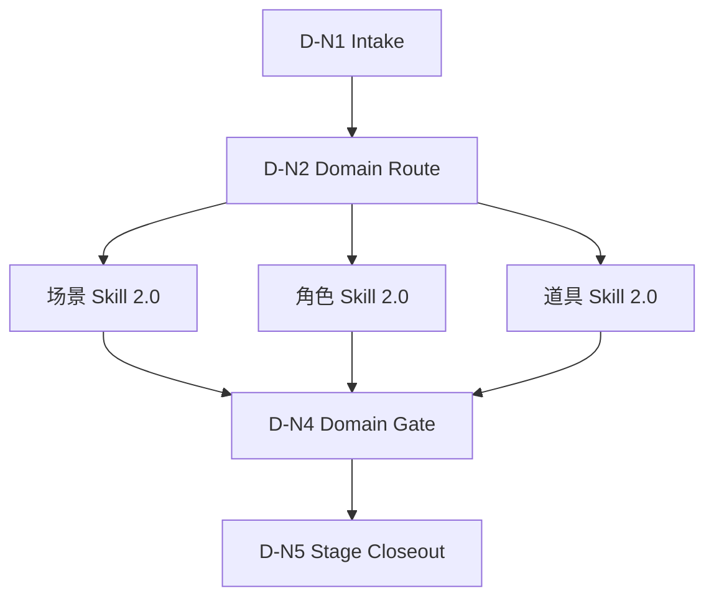

# 4-Design 思行网络

## Node Network

| node_id | input | action | output | gate |
| --- | --- | --- | --- | --- |
| `D-N1-INTAKE` | 用户请求、项目名、集数、候选输入文件 | 锁定项目根与 4-Design 输出根 | `design_scope` | `projects/aigc/<项目名>/4-Design/` 可定位或可创建 |
| `D-N2-DOMAIN` | `design_scope` | 判定命中 `场景 / 角色 / 道具` 域集合 | `domain_routes` | 至少一个 active 域 |
| `D-N3-DISPATCH` | `domain_routes` | 加载对应域级 `SKILL.md + CONTEXT.md` | `domain_execution_plan` | 不调度未命中域 |
| `D-N4-DOMAIN-GATE` | 域级输出 | 检查 `[域]清单.md + [主体名].md + [主体名].json` | `domain_verdicts` | 输出位于 4-Design 根 |
| `D-N5-CLOSEOUT` | `domain_verdicts` | 按需写阶段 `validation-report.md` | `stage_verdict` | 失败可回指具体域级 owner |

## Failure Routing

| symptom | route |
| --- | --- |
| 旧 tranche 路径仍被引用 | `D-N2-DOMAIN -> registry/routes/shared runtime 修复` |
| 域级包缺 Skill 2.0 分区 | `D-N3-DISPATCH -> skill-工作车间结构修复` |
| 输出不在 4-Design 根 | `D-N4-DOMAIN-GATE -> 对应域 SKILL.md Output Contract` |
| 设计模板或面板 JSON 漂移 | `D-N4-DOMAIN-GATE -> 对应域 templates/review` |

## Mermaid

