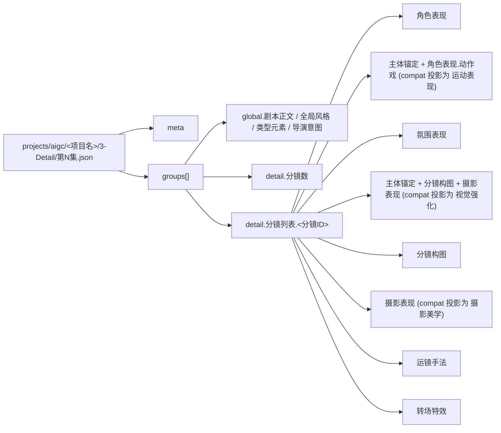

# 4-Design / 1-清单 Detail Output Consumption Contract

## Purpose

- 本文件是 `4-Design/{场景,角色,道具}` 消费 `3-Detail` canonical 输出的共享真源。
- 上游唯一业务真源固定为 `projects/aigc/<项目名>/3-Detail/第N集.json`。
- canonical 内容模板固定回指 `.agents/skills/aigc/3-Detail/_shared/episode_detail.json`。
- 若 leaf 仍需旧 consumer 语义，必须通过 `.agents/skills/aigc/_shared/detail_root_adapter.py` 从 canonical root 派生兼容投影。
- 下游 leaf 不得各自重新发明“角色/场景/道具/服装应该怎么读 `3-Detail`”的第二套解释。

## Canonical Upstream Shape

## Shared Rules

1. 第一真相固定为 canonical `meta + groups[].global/detail.分镜列表`，不再把 `final_output.main_content.分镜组列表[]` 当作业务真源。
2. 运行时若仍需旧 consumer 语义，只允许通过兼容投影读取 `组间设计 / 分镜切换 / 分镜明细[]`；该投影必须从 canonical detail root 派生，不得反向覆盖 canonical。
3. `groups[].global.剧本正文 / 全局风格 / 类型元素 / 导演意图` 是组级主证据；其中 `global.剧本正文` 用于角色、场景、道具的歧义解消，不得被镜级 fallback 反向改写。
4. `主体锚定` 是当前 detail root 的实体主锚；若兼容投影需要 `出场角色及穿搭 / 运动表现 / 视觉强化 / 摄影美学`，也必须优先从 `主体锚定 + 角色表现 + 分镜构图 + 摄影表现` 派生。
5. `detail.分镜列表` 的第一真相是当前 canonical 六类镜级字段：
   - `角色表现`
   - `氛围表现`
   - `分镜构图`
   - `摄影表现`
   - `运镜手法`
   - `转场特效`
   若为兼容旧 leaf 临时投影 `运动表现 / 视觉强化 / 摄影美学`，应显式标注它们是 derived helpers，而不是新的 canonical 字段。
6. legacy 字段如 `角色背景面 / 角色站位走位 / 道具及状态 / 分镜表现` 只作 fallback，不得盖过 canonical detail root。
   其中 `分镜表现` 视为 deprecated alias，必须具像、细致、可见，不得写抽象总结句。
7. 任何 leaf 若需要额外 heuristic，必须写回自己的 `references/` 或 `CONTEXT.md`，不得篡改本共享合同的 canonical 字段解释。

## Domain Consumption Matrix

| domain | primary_slots | support_slots | fallback_slots | forbidden_shortcuts | default_runtime_outputs |
| --- | --- | --- | --- | --- | --- |
| `角色` | `主体锚定.角色`、`分镜列表[].角色表现` | `global.剧本正文`、`分镜列表[].氛围表现`、compat `组间设计.出场角色及穿搭 / 运动表现 / 视觉强化` | `角色站位走位`、`角色背景面`、`分镜表现` | 只凭代词、无锚亲属称谓、纯背景描写臆造角色 | `4-Design/角色/1-清单/第N集/{角色清单.json,角色研究.json,role_design_bridge.json}` |
| `场景` | `分镜列表[].氛围表现`、`分镜列表[].分镜构图`、`分镜列表[].摄影表现` | `主体锚定.场景`、`分镜列表[].转场特效`、`global.导演意图`、`global.剧本正文`、compat `摄影美学 / 视觉强化 / 运动表现` | `角色背景面`、`分镜表现`、`时间段` | 把角色动作误写成场景描述；把无证据的研究设定升格成场景真相 | `4-Design/场景/1-清单/第N集/...` |
| `道具` | `主体锚定.道具`、`分镜列表[].角色表现` | `分镜列表[].分镜构图`、`分镜列表[].氛围表现`、`global.剧本正文`、compat `运动表现 / 视觉强化 / 道具及状态` | `分镜表现` | 把服装部件误当成独立道具 | `4-Design/道具/1-清单/第N集/...` |
| `服装` | compat `组间设计.出场角色及穿搭`、`主体锚定.角色`、`分镜列表[].角色表现` | compat `视觉强化 / 运动表现`、`分镜列表[].分镜构图` | `角色站位走位`、`分镜表现` | 把环境色光或道具材质误写进服装字段 | pending-migration；暂不声明 active runtime，不作为初始化预建目录 |

## Role-Specific Consumption Priority

| priority | source_slot | role use | note |
| --- | --- | --- | --- |
| P0 | `组间设计.出场角色及穿搭` | canonical 角色名、服装主锚、群组级出场摘要 | 优先抽取 `角色名-穿搭` 配对 |
| P1 | `detail.分镜列表[].角色表现`（compat: `分镜明细[].角色表现`） | 表演意图、对手关系、情绪兑现 | 角色主体性的首选镜级证据 |
| P2 | `detail.分镜列表[].角色表现 + 主体锚定`（compat: `分镜明细[].运动表现`） | 出场、走位、动作链、同镜角色关系 | role presence 与 blocking 的首选证据 |
| P3 | `detail.分镜列表[].主体锚定 + 分镜构图 + 摄影表现`（compat: `分镜明细[].视觉强化`） | 视觉识别锚点、镜头先看什么 | 服装与主体识别的强化证据 |
| P4 | `detail.分镜列表[].氛围表现`（compat: `分镜明细[].氛围表现`） | 角色所处场域、空间压力、材质支持 | 只在显式关涉角色时回收为人物证据 |
| P5 | `global.剧本正文` | unresolved alias、亲属关系、群像补充 | 仅用于回退，不反向覆盖结构化镜级事实 |

## Scene Consumption Priority

| priority | source_slot | scene use | note |
| --- | --- | --- | --- |
| P0 | `detail.分镜列表[].氛围表现`（compat: `分镜明细[].氛围表现`） | 空间类型、空气、温度、压迫、材质承载 | 场景设计的第一镜级真相 |
| P1 | `detail.分镜列表[].分镜构图`（compat: `分镜明细[].分镜构图`） | 观看关系、画面骨架、主体与背景组织 | 直接影响场景 framing |
| P2 | `detail.分镜列表[].摄影表现`（compat: `分镜明细[].摄影美学`） | 光影、色彩、质感方向 | 场景光感与表面行为真源 |
| P3 | `detail.分镜列表[].角色表现 + 主体锚定`（compat: `分镜明细[].运动表现`） | 人与空间的使用方式 | 只用来补场景被怎样“占用” |
| P4 | `detail.分镜列表[].转场特效`（compat: `分镜明细[].转场特效`） | 镜间连续性与组间衔接 | 只在需要镜间连续设计时使用 |
| P5 | legacy fallback | `角色背景面 / 分镜表现 / 摄影美学 / 时间段` | 仅限旧项目或过渡 leaf |

## Output Normalization Rules

1. 角色 leaf 必须同时产出：
   - `角色清单.json`
   - `角色研究.json`
   - `role_design_bridge.json`
2. 角色清单中的 `role_id` 必须稳定，并保持 `group_id[] / shot_id[]` 可追溯。
3. 当同一角色出现多套服装线索时，保留 `costume_variants[]`，不得被单一 canonical 名称压扁。
4. 群像主体允许 canonical 收束，但 `role_level` 必须保留 `群像角色` 语义，不得误当单人角色。
5. 若证据不足，允许输出 `unknown` 或 `needs_manual_review`，但不得臆造。

## Handoff Rule

- `4-Design/角色`、`场景`、`道具` 都应优先回链本文件。
- 其他 leaf 若后续扩建，应显式回链本文件，而不是平行复写字段消费规则。
- 若某叶子暂时仍依赖 legacy fallback，必须在本地 `CONTEXT.md` 或 `CHANGELOG.md` 明确标记迁移状态。
