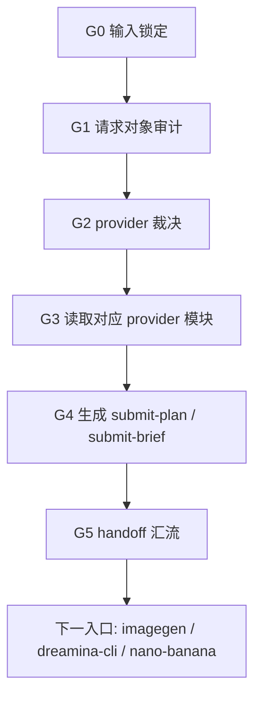
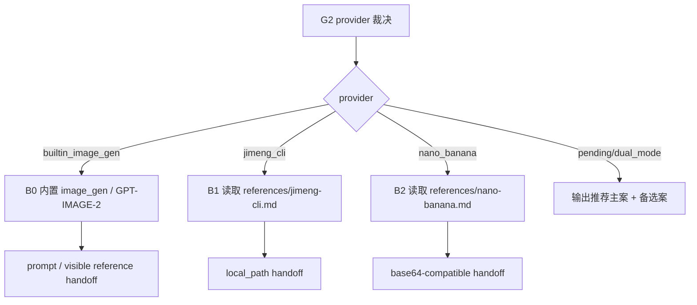
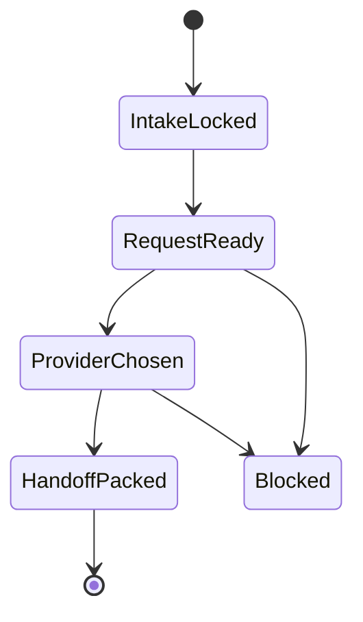

# aigc 5-Image / 3-图像生成

## Context Loading Contract

- 每次调用本技能时，必须同时加载同目录 `CONTEXT.md` 作为预加载上下文。
- 若同目录 `CONTEXT.md` 缺失，应先补齐最小知识库骨架，或向用户明确报告阻塞；不得在未检查该上下文的情况下执行技能。
- 冲突优先级：用户显式请求 > 仓库/全局 `AGENTS.md` > 本 `SKILL.md` > 同目录 `CONTEXT.md`。

## Mode Selection

- 当前任务属于 `原生创建 + 既有优化`：目录已存在但无执行合同，同时必须承接 `1-提示词蒸馏` 与 `2-参照引用` 的既有请求对象。
- `复杂链路的骨架 / 细则分层 = true`：provider-specific 提交流程下沉到 `references/`，主合同只保留总输入、总路由、总输出与汇流门。
- 本技能不直接替代外部 provider 技能，而是负责形成唯一 provider 路由与 handoff 包。

## 概述

`3-图像生成` 是 `5-Image` 阶段里承接“稳定请求对象 -> provider 选择 -> provider-ready 输入解析 -> submit-plan -> 下一入口”的叶子父技能。

它要先回答四件事：

1. 当前请求对象是否达到可提交状态
2. 本轮到底应该走内置 `image_gen`、`即梦 CLI` 还是 `NANO-banana`
3. 引用图片应当走内置可见引用、`local_path` 还是 `BASE64-compatible`
4. 下一入口是哪个 provider skill，而不是一句模糊的“去生成”

## Single Truth Boundary

### `3-图像生成` 拥有

- provider 选择机制
- `submit-plan.json` 与 `submit-brief.md` 的 canonical 生成入口
- provider 执行后的真实输出图像落盘路径合同
- provider-neutral -> provider-specific 的最后一层解析
- `builtin_image_gen / jimeng_cli / nano_banana` 多模式 handoff

### `3-图像生成` 不拥有

- 改写 `1-提示词蒸馏` prompt
- 重新做参照绑定
- 伪装已执行成功的图片生成结果
- 把外部 provider skill 的运行规则写成第二真源

## Shared Canonical Sources (Mandatory)

- `.agents/skills/aigc/SKILL.md`
- `.agents/skills/aigc/5-Image/1-提示词蒸馏/SKILL.md`
- `.agents/skills/aigc/5-Image/2-参照引用/SKILL.md`
- `.agents/skills/aigc/5-Image/_shared/image-generation-input.template.json`
- `$imagegen / built-in image_gen`
- `.agents/skills/cli/dreamina-cli/SKILL.md`
- `.agents/skills/api/anyfast/image/nano-banana/SKILL.md`
- `.agents/skills/aigc/_shared/image-generation-execution-contract.md`
- [references/builtin-imagegen.md](references/builtin-imagegen.md)
- [references/jimeng-cli.md](references/jimeng-cli.md)
- [references/nano-banana.md](references/nano-banana.md)

## Reference Module Selection Contract

### 固定模块

- 内置 Image Gen 模块：`references/builtin-imagegen.md`，默认 `GPT-IMAGE-2`
- `即梦 CLI` 模块：`references/jimeng-cli.md`
- `NANO-banana` 模块：`references/nano-banana.md`

### 选择机制

1. 用户显式指定 provider：直接命中对应模块；若指定内置 Image Gen，则锁定 `builtin_image_gen`
2. 输入 `meta.provider_mode` 已锁定：命中对应模块
3. 若仍是 `dual_mode / pending`：
   - 默认推荐内置 `image_gen`，模型口径为 `GPT-IMAGE-2`，不要求 API key
   - 需要本地路径直传、优先走 CLI 提交排队：推荐 `即梦 CLI`
   - 需要 BASE64-compatible 多图引用或走 Gemini/AnyFast API：推荐 `NANO-banana`
4. 若外部 provider 槽位仍是 `pending_encode` 且用户明确要求外部 provider，不自动猜最终 provider，只输出推荐主案 + 备选案；未指定时仍回到内置 Image Gen 默认路径

## Business Requirement Analysis Contract (Mandatory)

| analysis_slot | 当前结论 |
| --- | --- |
| `business_goal` | 把 `5-Image` 请求对象组织成可直接 handoff 给内置 `image_gen`、`即梦 CLI` 或 `NANO-banana` 的提交计划，而不是在生成时临场拼参数。 |
| `business_object` | `1-提示词蒸馏` 或 `2-参照引用` 产出的 `第N集.json`、provider 模块、共享输入模板。 |
| `constraint_profile` | provider 必须唯一；内置 `image_gen` 默认 `GPT-IMAGE-2` 且不走 API；`即梦 CLI` 只收本地路径；`NANO-banana` 最终走 BASE64-compatible；上游未解析好的引用不得越权硬补。 |
| `success_criteria` | 生成唯一 provider 结论、`submit-plan.json + submit-brief.md`、清晰的下一入口、可复核的 provider-specific 输入解析说明，以及与提交包同目录的输出图像路径。 |
| `non_goals` | 不直接执行 provider、不假装图片已生成、不重新绑定引用、不回头重写 prompt。 |
| `complexity_source` | 当前复杂度来自 provider 选择、双模式输入运输、上游请求兼容与 handoff 完整性。 |
| `topology_fit` | 采用“输入审计 -> provider 判型 -> provider-specific 解析 -> submit-plan 汇流”的串行主干，并在 provider 模块处分叉。 |
| `step_strategy` | 主合同只写总判型与 handoff，provider-specific 命令骨架与解析细节下沉到 references。 |

## Context Preload (Mandatory)

1. 根 `AGENTS.md`
2. `.agents/skills/aigc/SKILL.md + CONTEXT.md`
3. `.agents/skills/aigc/5-Image/SKILL.md + CONTEXT.md`
4. `.agents/skills/aigc/5-Image/1-提示词蒸馏/SKILL.md + CONTEXT.md`
5. `.agents/skills/aigc/5-Image/2-参照引用/SKILL.md + CONTEXT.md`
6. 本 `SKILL.md + CONTEXT.md`
7. `.agents/skills/aigc/5-Image/_shared/image-generation-input.template.json`
8. 命中的 `references/*.md`
9. `.agents/skills/aigc/_shared/image-generation-execution-contract.md`

## Canonical Inputs

- `projects/aigc/<项目名>/5-Image/分镜故事板/<第N集>/<第N集>.json`
- `projects/aigc/<项目名>/5-Image/分镜帧/<第N集>/<第N集>.json`
- `projects/aigc/<项目名>/5-Image/2-参照引用/<mode>/<source_tranche>/<第N集>/<第N集>.json`
- `.agents/skills/aigc/5-Image/_shared/image-generation-input.template.json`

## Canonical Landing

- 根目录：`projects/aigc/<项目名>/5-Image/3-图像生成/`
- provider 目录：`projects/aigc/<项目名>/5-Image/3-图像生成/<builtin_image_gen|jimeng_cli|nano_banana>/<source_tranche>/<第N集>/`
- 计划文件：`projects/aigc/<项目名>/5-Image/3-图像生成/<provider>/<source_tranche>/<第N集>/submit-plan.json`
- 简报文件：`projects/aigc/<项目名>/5-Image/3-图像生成/<provider>/<source_tranche>/<第N集>/submit-brief.md`
- 输出图像：`projects/aigc/<项目名>/5-Image/3-图像生成/<provider>/<source_tranche>/<第N集>/<image_id>.<ext>`

## Script Entrypoint

本技能的 canonical runner 为：

```bash
python3 .agents/skills/aigc/5-Image/3-图像生成/scripts/generate_submit_plan.py --help
python3 .agents/skills/aigc/5-Image/3-图像生成/scripts/generate_submit_plan.py \
  --project "<项目名>" \
  --episode 第N集 \
  --source-tranche 分镜帧 \
  --provider builtin_image_gen
```

若 `2-参照引用` 已严格执行但仍无可唯一绑定的本地图片，且当前轮次明确接受 prompt-only handoff，则必须显式传入：

```bash
python3 .agents/skills/aigc/5-Image/3-图像生成/scripts/generate_submit_plan.py \
  --project "<项目名>" \
  --episode 第N集 \
  --source-tranche 分镜帧 \
  --provider builtin_image_gen \
  --allow-prompt-only
```

## Output Image Path Contract (Mandatory)

`submit-plan.json` 必须把 provider 执行后的目标输出目录写成与 `submit-plan.json`、`submit-brief.md` 相同的 provider/source/episode 目录。

默认执行模式必须继承 `.agents/skills/aigc/_shared/image-generation-execution-contract.md`：内置 Image Gen 路径写明 `execution_mode=codex-builtin-imagegen`、`provider_skill=imagegen`、`default_model=GPT-IMAGE-2`、`max_concurrent=1`、request sidecar 与项目复制要求；外部 provider fallback 才写明后台批量并发字段。`3-图像生成` 完成只表示 handoff 包稳定，不表示 provider 已产图。

硬规则：

1. `output_dir` 必须等于 `projects/aigc/<项目名>/5-Image/3-图像生成/<provider>/<source_tranche>/<第N集>/`。
2. `expected_outputs[]` 或执行后回填的 `result_outputs[]` 中，所有本地图片路径都必须位于同一目录下；文件名可按 `group_id / shot_id / request_id / provider_task_id` 命名，但不得漂到阶段根、项目根、`Assets/` 或 provider cache。
3. provider 返回的远程 URL、task id、seed、原始响应只允许作为 metadata 或 sidecar 证据；canonical 图像文件必须下载、复制或规范化到本目录。
4. 若 provider 工具暂时无法指定输出目录，`3-图像生成` 的 handoff 必须要求执行层在领取结果后立即回填到同目录，并在 `submit-brief.md` 标明该回填动作。
5. 如需把成片图像另存到 `Assets/分镜画板/*` 供后续阶段复用，只能作为派生资产副本，并必须回链本目录的 canonical 输出图像。

## Readiness Gate

进入图像生成前必须确认：

1. 请求对象具备 `meta / prompt_style / model / prompt / prompt_char_count`
2. 若引用驱动，`reference_images / image_markers` 已存在且结构可解释
3. 若 `provider_mode=dual_mode`，必须先做 provider 选择，不得直接落计划
4. 若 `nano_banana` 槽位仍是 `pending_encode`，允许进入本层，但必须在 handoff 说明中写清“由 provider 执行前编码”
5. 若项目 `Assets/` 中存在可用图片，且用户或上游没有显式声明 `prompt_only / no_reference`，则空 `reference_images / image_markers` 只能判为 `unresolved`，必须先回 `2-参照引用` 执行保守匹配与严格审计，不得自动降级为 prompt-only。

## Topology Contract (Mandatory)

- 主干节点：
  - `G0 输入锁定`
  - `G1 请求对象审计`
  - `G2 provider 裁决`
  - `G3 provider-specific 输入解析`
  - `G4 submit-plan 生成`
  - `G5 handoff 汇流`
- 条件支路：
  - `B0 内置 Image Gen`
  - `B1 即梦 CLI 模块`
  - `B2 NANO-banana 模块`

## Visual Maps







## Thinking-Action Node Network

| node_id | objective | actions | evidence | route_out | gate |
| --- | --- | --- | --- | --- | --- |
| `G0-intake-lock` | 锁定 source request 与当前 provider 选择上下文 | 读取请求对象、用户要求与上游 provider_mode | `intake_note` | `G1` | 未锁 source request 不得继续 |
| `G1-request-audit` | 检查请求对象是否可提交 | 审计 prompt、引用字段、双模式骨架、来源路径 | `request_audit` | `G2` 或阻断 | 未就绪请求不得进入 provider |
| `G2-provider-route` | 选择唯一 provider 或给出推荐主案 | 按选择机制锁定 `builtin_image_gen`、`jimeng_cli` 或 `nano_banana` | `provider_decision` | `G3` 或推荐输出 | provider 不唯一不得写最终计划 |
| `G3-provider-resolve` | 解析 provider-specific 输入 | 读取命中模块，把引用解释成本地路径或 BASE64-compatible 说明 | `provider_resolution` | `G4` | 输入运输层未说清不得继续 |
| `G4-submit-pack` | 生成提交计划与简报 | 写 `submit-plan.json + submit-brief.md`，并锁定同目录 `output_dir / expected_outputs` | `submit_pack` | `G5` | 无计划文件或输出目录不得 handoff |
| `G5-handoff-converge` | 给出唯一下一入口 | 明确 handoff 到内置 `imagegen`、`dreamina-cli` 或 `nano-banana`，并声明对应执行参数 | `handoff_note` | `Done` | 只有本节点可结案 |

## Output Contract

最低交付：

1. `submit-plan.json`
2. `submit-brief.md`
3. provider 选择结论
4. 唯一下一入口
5. 与提交包同目录的 `output_dir / expected_outputs` 路径约束
6. 内置 Image Gen 路径记录 `execution_mode=codex-builtin-imagegen`、`provider_skill=imagegen`、`default_model=GPT-IMAGE-2`、`max_concurrent=1`；外部 provider fallback 记录后台批量并发字段与前台覆盖方式

硬规则：

1. 若 provider 为 `builtin_image_gen`，计划中必须写清内置 `image_gen`、`GPT-IMAGE-2`、项目复制回填路径与 `request_ready` 状态。
2. 若 provider 为 `jimeng_cli`，计划中引用输入必须是本地路径。
3. 若 provider 为 `nano_banana`，计划中必须写清 BASE64-compatible 解析策略。
4. 若 provider 仍未唯一，不能写最终 provider 计划，只能输出推荐主案与缺口。
5. 本层不得删除 provider-neutral 引用字段。
6. 本层不得把真实输出图像的 canonical 路径写到 `Assets/`、provider 临时缓存或其它阶段目录；输出图片必须与 `submit-plan.json`、`submit-brief.md` 同目录。
7. 本层不得在 `Assets/` 有可用图片且引用字段为空时自行补猜、静默忽略或直接提交；唯一合法路径是回到 `2-参照引用` 产出通过审计的绑定 JSON，除非本轮显式声明 `prompt_only / no_reference`。
8. 默认 submit-plan 不得写成 API / CLI provider 提交；除非用户显式要求 fallback，否则必须采用内置 Image Gen handoff，并把 `request_ready` 与最终产图成功区分开。

## Field Master

| field_id | 输出位置/字段 | 内容要求 | 默认责任 Step | 质量维度 | 失败码 |
| --- | --- | --- | --- | --- | --- |
| `FIELD-IMGGEN-ROOT-01` | `submit-brief.md / tranche 判定` | 说明当前任务为何属于图像生成提交前组织层 | `G0` | 边界清晰度 | `FAIL-IMGGEN-ROOT-01` |
| `FIELD-IMGGEN-INPUT-02` | `submit-plan.json / source_request` | 记录稳定请求对象来源、版本与 readiness verdict | `G1` | 输入可追溯性 | `FAIL-IMGGEN-INPUT-02` |
| `FIELD-IMGGEN-REF-03` | `submit-plan.json / input_mode + provider_input_resolution` | 区分 `reference_driven / prompt_only / unresolved` 并写清 provider-specific 解析 | `G1-G3` | 引用处理准确性 | `FAIL-IMGGEN-REF-03` |
| `FIELD-IMGGEN-PROVIDER-04` | `submit-plan.json / provider` | 锁定唯一 provider 或明确推荐主案 | `G2` | 路由准确性 | `FAIL-IMGGEN-PROVIDER-04` |
| `FIELD-IMGGEN-PACK-05` | `submit-plan.json + submit-brief.md` | 提交计划、输出目录、执行说明、返工入口完整 | `G4-G5` | handoff 完整性 | `FAIL-IMGGEN-PACK-05` |

## Thought Pass Map

| step_id | 聚焦字段 | 核心问题 | 生成动作 | 未达标信号 |
| --- | --- | --- | --- | --- |
| `G0` | `FIELD-IMGGEN-ROOT-01` | 当前任务是不是提交前组织层 | 锁定叶子边界与排除项 | 本层开始重写 prompt 或重绑引用 |
| `G1` | `FIELD-IMGGEN-INPUT-02` / `FIELD-IMGGEN-REF-03` | 当前请求对象是否可提交、引用状态是否明确 | 审计 source request 与 input_mode | 没有稳定请求对象却继续向下 |
| `G2-G3` | `FIELD-IMGGEN-PROVIDER-04` / `FIELD-IMGGEN-REF-03` | 应该交给哪个 provider、provider 如何消费引用 | 锁定 provider 与 provider-specific 输入解析 | provider 不唯一，或把 neutral 引用直接当 provider 私有字段 |
| `G4-G5` | `FIELD-IMGGEN-PACK-05` | handoff 包是否足以继续执行 | 生成 `submit-plan.json + submit-brief.md` 与唯一下一入口 | 只留口头说明，或缺 output_dir / rework entry |

## Pass Table

| field_id | Pass Standard | Fail Code | Rework Entry |
| --- | --- | --- | --- |
| `FIELD-IMGGEN-ROOT-01` | 叶子边界与排除项清楚 | `FAIL-IMGGEN-ROOT-01` | `G0` |
| `FIELD-IMGGEN-INPUT-02` | source request 可追溯且 readiness verdict 明确 | `FAIL-IMGGEN-INPUT-02` | `G1` |
| `FIELD-IMGGEN-REF-03` | `input_mode`、引用状态与 provider-specific 解析策略清楚 | `FAIL-IMGGEN-REF-03` | `G1-G3` |
| `FIELD-IMGGEN-PROVIDER-04` | provider 唯一或推荐主案明确 | `FAIL-IMGGEN-PROVIDER-04` | `G2` |
| `FIELD-IMGGEN-PACK-05` | `submit-plan.json + submit-brief.md` 可直接供下游 handoff | `FAIL-IMGGEN-PACK-05` | `G4-G5` |

## Root-Cause Execution Contract (Mandatory)

当出现以下症状时，先修本技能源层：

- `2-参照引用` 完成了，但 `3-图像生成` 仍不知道该走哪个 provider
- `Assets/` 中已有可用图片，但空引用请求仍被直接落成 provider 生成计划
- `即梦 CLI` handoff 里出现 URL 或 BASE64
- `NANO-banana` handoff 里没有 BASE64-compatible 策略
- provider 不唯一却仍然硬落最终计划
- 计划文件缺失下一入口或返工入口
- 输出图像路径漂到 `Assets/`、provider cache、阶段根或其它目录，导致提交包与结果文件分离
- submit-plan 缺默认后台批量并发参数，或把后台提交态写成最终产图成功

链路固定为：

`Symptom -> Direct Technical Cause -> Rule Source -> Meta Rule Source -> Fix Landing Points`

优先检查：

- `Rule Source`
  - `.agents/skills/aigc/5-Image/3-图像生成/SKILL.md`
  - `.agents/skills/aigc/5-Image/3-图像生成/CONTEXT.md`
  - `.agents/skills/aigc/5-Image/3-图像生成/references/jimeng-cli.md`
  - `.agents/skills/aigc/5-Image/3-图像生成/references/nano-banana.md`
  - `.agents/skills/aigc/_shared/image-generation-execution-contract.md`
- `Meta Rule Source`
  - `.agents/skills/aigc/5-Image/2-参照引用/SKILL.md`
  - `.agents/skills/aigc/SKILL.md`
  - 根 `AGENTS.md`
