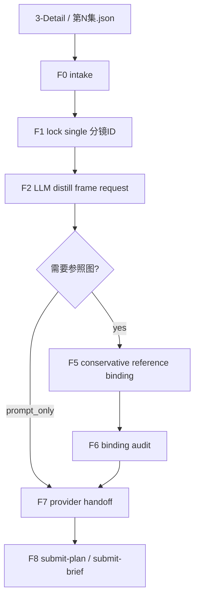
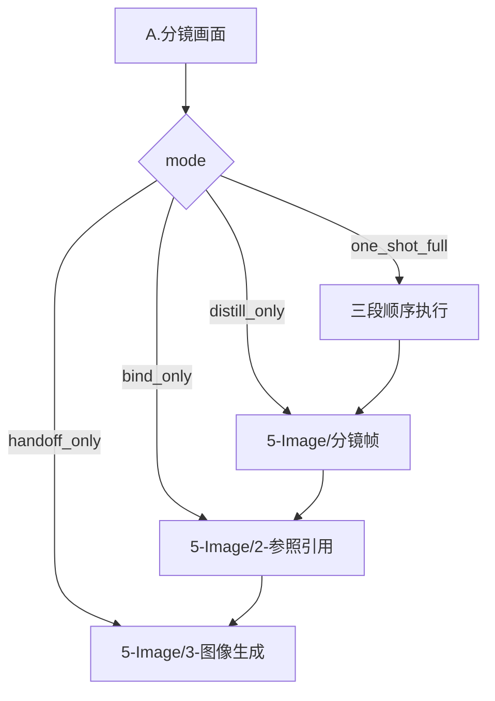

# aigc 5-Image / A.分镜画面

## Context Loading Contract

- 每次调用本技能时，必须同时加载同目录 `CONTEXT.md` 作为预加载上下文。
- 若同目录 `CONTEXT.md` 缺失，应先补齐最小知识库骨架，或明确报告阻塞；不得在未检查该上下文的情况下执行技能。
- 若当前任务已绑定 `projects/aigc/<项目名>/`，还必须先加载项目根 `MEMORY.md`，再按需加载项目根 `CONTEXT/` 中与图像阶段相关的上下文。
- 冲突优先级：用户显式请求 > 根 `AGENTS.md` > `.agents/skills/aigc/SKILL.md` > `.agents/skills/aigc/5-Image/SKILL.md` > 本 `SKILL.md` > `references/`、`steps/`、`types/`、`review/`、`templates/` > 项目级 `MEMORY.md` > 项目级 `CONTEXT/` > 同目录 `CONTEXT.md`。

## Input Contract

- Accepted input:
  - 用户要求围绕单一 `分镜ID` 完成“画面 / 单帧 / 分镜帧 / 关键帧”的端到端图像准备。
  - 从 `projects/aigc/<项目名>/3-Detail/第N集.json` 直接蒸馏出单帧 image-request JSON。
  - 从已有 `5-Image/分镜帧/第N集/第N集.json` 继续执行参照绑定或 provider handoff。
  - 修复单帧链路中 `prompt / reference_images / image_markers / submit-plan` 任一环的漂移。
- Required input:
  - `项目名` 与 `第N集`。
  - 以下二选一：唯一四段式 `分镜ID`，或已经存在且可追溯的单帧 request JSON。
  - 进入真实绑定时，必须能定位 `projects/aigc/<项目名>/Assets/` 或 `projects/aigc/<项目名>/4-Design/` 中的本地资产候选。
- Optional input:
  - `provider_mode`: `builtin_image_gen | jimeng_cli | nano_banana | dual_mode`。
  - `output_mode`: `json_only | full_trace`。
  - `prompt_only / no_reference` 显式覆盖。
  - 用户指定参考图、目标 provider、比例、尺寸或 handoff 约束。
- Reject or clarify when:
  - 目标是整组多格故事板，应进入 `B.分镜故事板` 或旧 `分镜故事板` 叶子。
  - 目标是漫画页、气泡文字、旁白框或漫画阅读节奏，应回接 repo-local `comic` workflow。
  - `3-Detail` 还不能通过 canonical detail root 锁定唯一分镜。
  - 用户要求脚本代替 LLM 生成单帧 prompt 正文。

## Positioning

`A.分镜画面` 是单帧画面的一站式融合技能包。它把原三个技能包的能力面收束为一个入口：

1. 原 `.agents/skills/aigc/5-Image/1-提示词蒸馏/分镜帧`
2. 原 `.agents/skills/aigc/5-Image/2-参照引用`
3. 原 `.agents/skills/aigc/5-Image/3-图像生成`

原三个技能包暂不移除，继续作为兼容入口、旧脚本载体和历史追溯源。本包不创建新的 runtime 真源，默认仍写入既有兼容落点：`5-Image/分镜帧/`、`5-Image/2-参照引用/`、`5-Image/3-图像生成/`。

## LLM-First Creative Authorship Contract

- 单帧 prompt 正文、组级设计块压缩、单镜融写行与画面审美裁决必须由 LLM 直接完成。
- `scripts/` 只能承担读取、投影、校验、dry-run、包装或 handoff 辅助，不得把脚本输出作为 canonical creative truth。
- 若调用旧 `分镜帧/scripts/generate_episode_packets.py`，只能用于兼容迁移或已有 LLM 真源的 JSON 投影；需要旧脚本主创时必须显式使用 legacy guard，且不得写回默认路径。

## Truth Ownership

### 本技能拥有

- 单一 `分镜ID -> 单帧请求 JSON -> 参照绑定三件套 -> submit-plan handoff` 的融合路由。
- 三段链路的同轮门禁、回退入口、写位归属和完成口径。
- 对旧三包语义的聚合裁决，以及新包内 `references/`、`steps/`、`types/`、`review/` 的动态引用。

### 本技能不拥有

- 改写 `3-Detail/第N集.json` 的导演事实。
- 直接替 provider 宣告图片已生成成功。
- 把 `Assets/` 或 provider cache 升级为图像阶段 canonical 输出真源。
- 删除或移动原三个技能包。

## Mode Selection

| mode | 触发信号 | 主要动作 |
| --- | --- | --- |
| `one_shot_full` | 有 `项目名 + 第N集 + 分镜ID`，且用户想端到端完成画面准备 | 蒸馏请求 JSON，按需绑定参照图，再生成 provider-ready handoff |
| `distill_only` | 只要求单帧 prompt / request JSON | 只执行 `F0-F4`，写 `5-Image/分镜帧/` |
| `bind_only` | 已有 request JSON，缺参照图绑定 | 只执行 `F5-F6`，写 `5-Image/2-参照引用/` |
| `handoff_only` | 已有稳定 request 或绑定 JSON，目标是生成提交包 | 只执行 `F7-F8`，写 `5-Image/3-图像生成/` |
| `repair` | 输出漂移、字段缺失、provider 不唯一或路径错位 | 从 `review/review-contract.md` 与 `CONTEXT.md` 定位返工节点 |

## Reference Loading Guide

| 场景 | 读取文件 |
| --- | --- |
| 理解融合边界、旧三包保留关系与 runtime 写位 | `references/fusion-boundary.md` |
| 从 `3-Detail` 蒸馏单帧 request JSON | `references/request-distillation.md`，该文件已完整消化旧 `分镜帧` 蒸馏方法 |
| 绑定或规范化本地参照图 | `references/reference-binding.md` |
| 生成 provider-ready submit plan | `references/generation-handoff.md` |
| 需要 provider 差异细则 | `references/provider-modules.md` |
| 追溯旧三包语义迁移 | `references/legacy-upgrade-migration-matrix.md` |
| 执行主流程、分支与汇流 | `steps/frame-image-workflow.md` |
| 判定输入类型、执行模式和 provider 模式 | `types/type-map.md` |
| 交付前审计与返工 | `review/review-contract.md` |
| 输出结构样板 | `templates/output-template.md` |
| 机械辅助入口说明 | `scripts/README.md` |
| 经验性避坑 | `knowledge-base/frame-image-heuristics.md` |
| 产品侧入口元数据 | `agents/openai.yaml` |

## Visual Maps

## Execution Contract

1. 锁定 mode、项目根、集号、`分镜ID` 或 source request。
2. 若从 `3-Detail` 开始，必须先通过 canonical `groups[].detail.分镜列表` 唯一锁镜。
3. 单帧 prompt 正文由 LLM 直接蒸馏，遵守 `references/request-distillation.md` 中完整消化后的固定英文前缀、组级设计块、单镜融写行、字段顺序、压缩等级和审计门。
4. 以共享 image-generation 模板填充 `meta / prompt_style / model / prompt / prompt_char_count`。
5. 若存在本地资产且未显式 `prompt_only / no_reference`，必须先执行保守参照绑定，不得直接提交 provider。
6. 参照绑定只允许写真实本地引用，歧义、泛词和子串命中必须进入报告，不得猜测绑定。
7. provider handoff 必须锁定唯一 provider；默认 `builtin_image_gen`，外部 provider 仅在用户或上游显式要求时作为 fallback。
8. `3-图像生成` 的完成口径是 handoff 包稳定，不是图片已生成成功。
9. 交付前读取 `review/review-contract.md`，按 `Field Mapping` 与 `Pass Table` 做汇流审计。

## Field Mapping

| field_id | owner | output_location | content_requirement | gate |
| --- | --- | --- | --- | --- |
| `FIELD-FRAMEIMG-01` | input lock | intake note / source request | 项目、集号、单一 `分镜ID` 或 source request 可唯一追溯 | 未唯一锁定不得进入蒸馏 |
| `FIELD-FRAMEIMG-02` | prompt distillation | `5-Image/分镜帧/<第N集>/<第N集>.json` | LLM 直出的固定前缀 + 组级设计块 + 单镜融写行，且模板骨架完整 | 不得脚本主创或整组摘要化 |
| `FIELD-FRAMEIMG-03` | reference binding | `5-Image/2-参照引用/<mode>/<source_tranche>/<第N集>/` | `reference_images / image_markers` 只含可解释本地引用，含 manifest 与 match report | 歧义未处理不得进入 handoff |
| `FIELD-FRAMEIMG-04` | provider handoff | `5-Image/3-图像生成/<provider>/<source_tranche>/<第N集>/` | `submit-plan.json + submit-brief.md` 锁唯一 provider、输出目录和下一入口 | provider 不唯一不得写最终计划 |
| `FIELD-FRAMEIMG-05` | convergence | 用户闭环说明 / optional manifest | 写明执行过哪些环、跳过原因、返工入口与验证证据 | 不得把 sidecar 当第二业务真源 |

## Thought Pass Map

| step_id | 聚焦字段 | 核心问题 | 生成动作 | 未达标信号 |
| --- | --- | --- | --- | --- |
| `F0` | `FIELD-FRAMEIMG-01` | 本轮从哪个输入层进入 | 锁 mode、项目根、集号、source request | 输入来源不清 |
| `F1-F4` | `FIELD-FRAMEIMG-02` | 单一分镜如何变成可生图请求 | 唯一锁镜、上下文打包、LLM 蒸馏 prompt、填共享模板并做蒸馏审计 | prompt 变成整组剧情、脚本主创或模板骨架缺失 |
| `F5-F6` | `FIELD-FRAMEIMG-03` | 哪些本地图片可安全绑定 | 保守绑定、写三件套、审计 | 泛词、子串或多义候选被直接绑定 |
| `F7-F8` | `FIELD-FRAMEIMG-04` | 该交给哪个 provider | 锁 provider，写 submit plan 与 brief | provider 不唯一或输出目录漂移 |
| `F9` | `FIELD-FRAMEIMG-05` | 三段如何汇流结案 | 写 handoff note、验证证据与返工入口 | 只有口头说明，无可复核文件 |

## Pass Table

| field_id | Pass Standard | Fail Code | Rework Entry |
| --- | --- | --- | --- |
| `FIELD-FRAMEIMG-01` | source request 或 `分镜ID` 唯一可追溯 | `FAIL-FRAMEIMG-INPUT` | `F0-F1` |
| `FIELD-FRAMEIMG-02` | request JSON 模板完整，prompt 满足单帧边界与 LLM 主创规则 | `FAIL-FRAMEIMG-PROMPT` | `F2-F4` |
| `FIELD-FRAMEIMG-03` | 绑定三件套能解释 bound / ambiguous / rejected 与 `next_entry` | `FAIL-FRAMEIMG-REF` | `F5-F6` |
| `FIELD-FRAMEIMG-04` | handoff 包含唯一 provider、`output_dir`、`expected_outputs` 与下一入口 | `FAIL-FRAMEIMG-HANDOFF` | `F7-F8` |
| `FIELD-FRAMEIMG-05` | 闭环说明能解释执行链、跳过链和验证链 | `FAIL-FRAMEIMG-CONVERGE` | `F9` |

## Root-Cause Execution Contract (Mandatory)

出现失败时必须沿以下链路追溯：

`Symptom -> Direct Technical Cause -> Section Owner -> Source Contract -> Meta Rule Source`

优先检查：

1. 输入与锁镜问题：`references/request-distillation.md`、`steps/frame-image-workflow.md`、`types/type-map.md`。
2. prompt 或模板漂移：优先检查已完整消化旧方法的 `references/request-distillation.md` 与 `steps/frame-image-workflow.md`，再用 `templates/output-template.md`、旧 `分镜帧/prompt-assembly-spec.md` 做兼容证据核对。
3. 参照绑定漂移：`references/reference-binding.md`、`references/provider-modules.md`、旧 `2-参照引用`。
4. provider handoff 漂移：`references/generation-handoff.md`、`references/provider-modules.md`、旧 `3-图像生成`。
5. 旧包融合遗漏：`references/legacy-upgrade-migration-matrix.md`。
6. 可复用失败模式：写回同目录 `CONTEXT.md`，稳定后再晋升到本文件或对应分区。

## Output Contract

- Required output: 根据 mode 产出一个或多个稳定业务工件：单帧 request JSON、参照绑定三件套、provider handoff 包，以及用户可读的执行闭环说明。
- Output format: Markdown 闭环说明 + JSON/Markdown 业务文件；request JSON、manifest、match report、submit-plan 与 submit-brief 均沿用既有三段链路格式。
- Output path: 默认沿用兼容 runtime 写位：`projects/aigc/<项目名>/5-Image/分镜帧/第N集/`、`projects/aigc/<项目名>/5-Image/2-参照引用/<mode>/<source_tranche>/第N集/`、`projects/aigc/<项目名>/5-Image/3-图像生成/<provider>/<source_tranche>/第N集/`。
- Naming convention: 集文件使用 `第N集.json`；manifest 固定 `_manifest.json`；参照报告固定 `match-report.md`；生成提交包固定 `submit-plan.json` 与 `submit-brief.md`；`分镜ID` 使用四段式 `episode-scene-group-frame`。
- Completion gate: 命中 mode 的所有 `Pass Table` 项通过；引用驱动任务必须通过参照绑定审计；handoff 任务必须锁定唯一 provider；本 Skill 2.0 包结构需通过 `validate_skill_2_0.py`。
