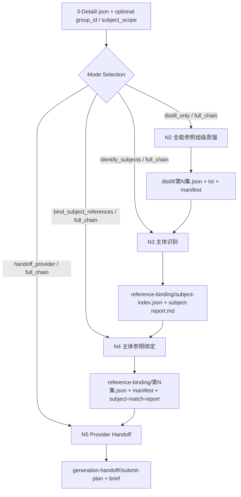
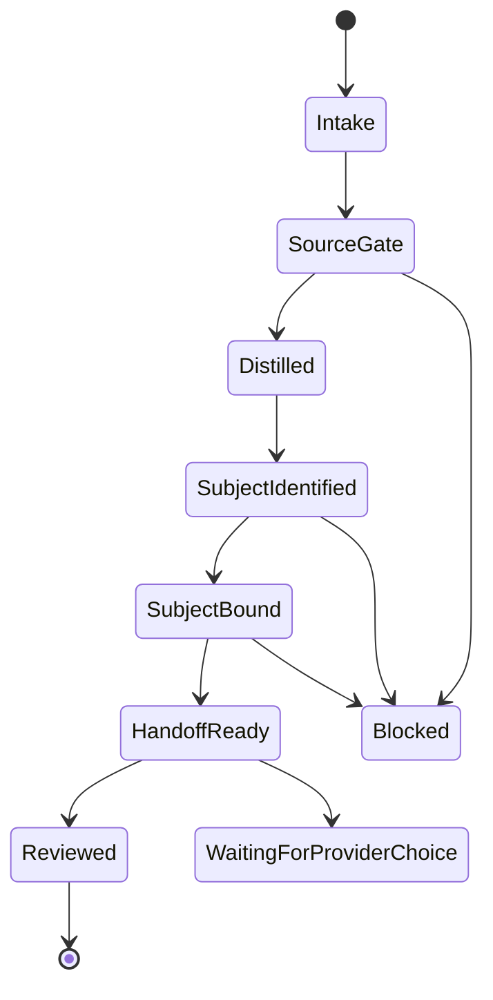

# aigc 6-Video / C.主体参照

`C.主体参照` 是 `6-Video` 阶段的主体识别向融合型 Skill 2.0 包。它把用户指定的旧链路三段能力收束到一个受治理入口内：

1. `1-提示词蒸馏/全能参照`
2. `2-参照引用`
3. `3-视频生成`

原三个技能包保留不删除；本包只建立新的主体参照融合入口、分区真源、输出合同和回接路径。

## Context Loading Contract

- 每次调用本技能时，必须同时加载同目录 `CONTEXT.md` 作为预加载上下文。
- 若同目录 `CONTEXT.md` 缺失，应先补齐最小知识库骨架，或明确报告阻塞；不得在未检查经验层的情况下执行。
- 若当前任务绑定 `projects/aigc/<项目名>/`，还必须先加载项目根 `MEMORY.md`，再按需读取项目根 `CONTEXT/` 中与视频阶段、主体设计或资产引用相关的上下文。
- 冲突优先级：用户显式请求 > 根 `AGENTS.md` / meta 规则 > `.agents/skills/aigc/SKILL.md` > `.agents/skills/aigc/6-Video/SKILL.md` > 本 `SKILL.md` > `references/` / `steps/` / `types/` / `review/` / `templates/` > `agents/openai.yaml` > 项目记忆与项目上下文 > 本 `CONTEXT.md`。
- 新的稳定失败模式、成功模式和可复用策略先写回本 `CONTEXT.md`；若升级为强制合同，再晋升到本 `SKILL.md` 或对应分区。

## Input Contract

Accepted input:

- 需要把 `projects/aigc/<项目名>/3-Detail/第N集.json` 中的分镜组、整集或一组目标，整理成可用于视频生成的主体参照包。
- 需要在同一技能入口内完成“全能参照 prompt/TXT 蒸馏 -> 主体识别与 `Assets/` 主体参照绑定 -> provider submit-plan/brief”三段串联。
- 需要优先围绕角色、服装、道具、场景和其他稳定视觉主体建立参照图字段，而不是围绕故事板或单帧画板建立第一绑定。
- 需要保留旧三段技能的语义，但希望新任务优先进入一个主体识别向融合包。
- 需要修复、复核或续跑 `C.主体参照` 的阶段产物。

Required input:

- `project_name`
- `episode_id`，例如 `第1集`
- canonical detail root：`projects/aigc/<项目名>/3-Detail/<episode_id>.json`
- 明确的执行目标：`distill_only`、`identify_subjects`、`bind_subject_references`、`handoff_provider`、`full_chain` 或 `compat_migration`

Optional input:

- `group_id` / `分镜组ID`；若未提供，可按 episode carrier 批量处理命中的组级请求。
- `subject_scope`，例如 `角色`、`服装`、`道具`、`场景`、`全部主体`
- provider 偏好，例如 `dreamina`、`vidu`、`veo`、`sora`、`seedance`、`kling`、`grok`
- 是否允许纯 prompt 路径：`prompt_only` / `no_reference`
- 已选定或待绑定的 `Assets/角色/`、`Assets/服装/`、`Assets/道具/`、`Assets/场景/` 或主体相关画面资产范围
- 既有旧链路产物路径，用作兼容迁移输入

Reject or reroute when:

- `3-Detail/<episode_id>.json` 尚未形成稳定 `meta + groups[].global/detail.分镜列表`。
- 当前任务明确要求分镜故事板或漫画画板作为第一参照，应进入 `B.分镜故事板参照`。
- 当前任务明确要求单一 `分镜ID` 的首帧或帧级画面参照，应进入 `A.分镜画面参照` 或 `1-提示词蒸馏/首帧参照`。
- 用户要求生成、挑选或重命名图片资产本体；本技能只绑定已存在的 `Assets/`。
- 任务已经是 provider 运行时提交、轮询、下载或报错排查；应进入对应 provider 技能或外部工具。

## LLM-First Creative Authorship Contract

- 组级视频 prompt、`第N集.txt` 主稿、主体参照 handoff 简报中的创作性描述，必须由 LLM 直接完成。
- 主体识别中的语义裁决，例如“哪个角色/服装/道具/场景是当前镜头可见主体”，必须由 LLM 根据 `3-Detail` 与项目资产语义判断；脚本只能辅助读取、枚举和校验。
- `scripts/` 只能承担读取、校验、投影、格式转换、路径审计、台账生成等机械辅助；不得用规则拼接替代提示词、主体锚定判断或审美压缩判断。
- 旧 `全能参照/scripts/generate_episode_packets.py` 与旧 `2-参照引用/scripts/bind_reference_assets.py` 只作为 legacy helper 来源，不得被本包重新设为默认主创执行器。
- 若临时复用旧脚本，必须显式说明它是兼容迁移或校验辅助，且不得把脚本输出视为 canonical creative truth。

## Mode Selection

| mode | 触发信号 | 主动作 | 输出范围 |
| --- | --- | --- | --- |
| `distill_only` | 只需从 `3-Detail` 生成组级视频请求对象和 TXT | 执行全能参照 prompt/TXT 蒸馏，不做主体绑定，不写 provider plan | `distill/` |
| `identify_subjects` | 已有 `3-Detail` 或请求对象，需要先抽出可见主体和资产候选 | 生成 `subject-index.json` 与主体识别报告 | `reference-binding/` |
| `bind_subject_references` | 已有稳定请求对象和主体索引，需要补 `reference_images / image_markers` | 执行角色/服装/道具/场景资产匹配、歧义阻断、引用字段重建 | `reference-binding/` |
| `handoff_provider` | 请求对象和引用状态已稳定，需要提交前组织 | 写 provider 路由、`submit-plan.json`、`submit-brief.md` | `generation-handoff/` |
| `full_chain` | 用户要求一次完成主体参照包 | 串行执行蒸馏、主体识别与绑定、生成交接；任一 gate 失败即停机 | 三段全部落盘 |
| `compat_migration` | 从旧三段链路迁移或补全缺件 | 读取旧产物，按本包结构投影并标明来源 | 对应缺失分区 |

## Reference Loading Guide

| 场景 | 读取文件 |
| --- | --- |
| 追踪旧三段内容如何融合进新包 | `references/source-fusion-map.md` |
| 执行全能参照 prompt/TXT 蒸馏 | `references/prompt-distillation-contract.md`、`references/shared-prompt-principles.md` |
| 执行主体识别与 `Assets/` 参照图绑定 | `references/subject-reference-binding-contract.md` |
| 组织 provider handoff | `references/provider-handoff-contract.md` |
| 判断 `distill_only / identify_subjects / bind_subject_references / handoff_provider / full_chain / compat_migration` | `types/type-map.md` |
| 执行串行主链与失败回路 | `steps/subject-reference-workflow.md` |
| 交付前审查 | `review/review-contract.md` |
| 复用经验与避坑 | `knowledge-base/video-subject-reference-heuristics.md` 与同目录 `CONTEXT.md` |
| 渲染输出 | `templates/output-template.md`、`templates/request-packet.template.json`、`templates/submit-plan.template.json` |
| 机械辅助 | `scripts/README.md` |
| 产品侧入口 | `agents/openai.yaml` |

## Visual Maps

## Execution Contract

1. 锁定项目根、集号、目标 `group_id` / `subject_scope`、执行模式与输出根，并完成旧 `全能参照` 的配置消化，形成 `omni_reference_digest`；不得只把旧技能路径当作来源占位。`omni_reference_digest` 至少覆盖：
   - `source_contracts`: 已对照 `1-提示词蒸馏/全能参照/SKILL.md + CONTEXT.md + prompt-assembly-spec.md`，并按需吸收父级共享 `6-Video/_shared/image-to-video-prompt-principles.md`，确认本融合包承接的是“分镜组 -> 1 条全能参照请求对象 + episode TXT/manifest”的组级蒸馏合同。
   - `input_gate`: `3-Detail/<episode>.json` 必须是 canonical detail root；compat projection 后 `metadata.document_phase=ready`；目标组能在 `final_output.main_content.分镜组列表` 中稳定命中；每组满足 `分镜组ID / 分镜切换 / 剧本正文 / 正文切分参考[] / 组间设计.全局风格 / 类型元素 / 导演意图 / 出场角色及穿搭 / 分镜明细[] / 正文回指.beat_refs / 时间段` 等输入门，且 `len(分镜明细[]) == 分镜切换`。
   - `prompt_assembly`: prompt 继承 `BC` 结构：一段 `全局风格 / 类型元素 / 导演意图 / 出场角色及穿搭 / 固定音频约束` 组级设计块，加每镜一行 `xx秒-xx秒｜分镜<组内序号>：` 融写结果；完整四段式 `分镜ID` 只留在结构化回链字段。
   - `txt_semantics`: `第N集.txt` 按“分镜组ID -> 全局风格/类型元素/导演意图 -> 分镜N，x-y秒 -> 剧本正文 -> 主体锚定 -> 分镜明细 -> 字数统计”组织；`剧本正文`、`主体锚定.场景/角色` 不得压缩，`主体锚定.道具` 只允许轻量压缩。
   - `compression_budget`: 继承 `G1/P0/P1/P2/P3` 与 `full / normal / tight / ultra` 预算策略；优先保留剧情桥段、主体动作/表演、景别、构图、运镜、速度、视角，先压缩 `P3`，再酌情收束 `P2`，不得为省字牺牲 `P0/P1`。
   - `subject_bridge`: 把 `主体锚定.角色 / 场景 / 道具`、`组间设计.出场角色及穿搭`、镜级动作/可见物和 `source_shot_ids` 记录为后续 `subject-index.json` 的候选证据，而不是在 `N3` 重新凭印象抽主体。
   - `artifact_shape`: `distill/` 段输出仍是 `第N集.json + 第N集.txt + _manifest.json` 三件套，保留 `reference_images / image_markers` provider-neutral 骨架；旧脚本只可做投影、校验和兼容迁移辅助。
2. 读取 `.agents/skills/aigc/SKILL.md + CONTEXT.md`、父级 `6-Video/SKILL.md + CONTEXT.md`、本 `SKILL.md + CONTEXT.md`，再按 `Reference Loading Guide` 加载分区。
3. 对 `3-Detail/<episode>.json` 做输入门检查：只消费稳定 canonical detail root，不把 compat projection 当第一真源。
4. 进入 `distill_only` 或 `full_chain` 时，由 LLM 主创生成组级 prompt/TXT；脚本只可做投影与校验。
5. 进入 `identify_subjects`、`bind_subject_references` 或 `full_chain` 时，先从 `主体锚定.角色 / 场景 / 道具`、`组间设计.出场角色及穿搭`、镜级动作与可见物中形成主体索引，再按 `Assets/角色/`、`Assets/服装/`、`Assets/道具/`、`Assets/场景/` 绑定真实文件。
6. 主体绑定必须保守：无匹配可跳过，歧义候选必须阻断，不得把故事板或单帧画板资产冒充主体资产。
7. 进入 `handoff_provider` 或 `full_chain` 时，先判定引用状态是 `reference_driven`、`prompt_only` 还是 `unresolved`；`unresolved` 必须回 `reference-binding`。
8. 每段产物都写入 `projects/aigc/<项目名>/6-Video/C.主体参照/<episode_id>/` 下的声明子目录。
9. 最终只给一个下一入口：provider skill、人工提交、回 `reference-binding`、回 `3-Detail` 或等待 provider 裁决。

## Field Mapping

### Field Master

| field_id | 输出位置/字段 | 内容要求 | 默认责任节点 | 质量维度 | 失败码 |
| --- | --- | --- | --- | --- | --- |
| `FIELD-SUBJREF-ROOT-01` | `mode / source_root / output_root / subject_scope / omni_reference_digest` | 锁定项目、集号、主体范围、模式与唯一输出根，并消化旧 `全能参照` 的输入门、prompt/TXT 语义、预算策略、主体证据桥和三件套形状 | `N1` | 路由清晰度与源语义吸收度 | `FAIL-SUBJREF-ROOT-01` |
| `FIELD-SUBJREF-DISTILL-02` | `distill/<episode>.json + txt + _manifest.json` | 全能参照 prompt/TXT 由 LLM 主创，覆盖目标分镜组全部镜头事实和主体锚定，不虚构引用 | `N2` | 蒸馏完整度 | `FAIL-SUBJREF-DISTILL-02` |
| `FIELD-SUBJREF-IDENTIFY-03` | `reference-binding/subject-index.json + subject-report.md` | 主体索引能回链角色、服装、道具、场景与来源镜头，区分主要/辅助/环境主体 | `N3` | 主体识别可信度 | `FAIL-SUBJREF-IDENTIFY-03` |
| `FIELD-SUBJREF-BIND-04` | `reference-binding/<episode>.json + subject-match-report.md` | `reference_images / image_markers` 只绑定真实 `Assets/` 主体路径，顺序稳定，不混入占位 | `N4` | 引用可信度 | `FAIL-SUBJREF-BIND-04` |
| `FIELD-SUBJREF-HANDOFF-05` | `generation-handoff/<provider>/submit-plan.json + submit-brief.md` | 明确 provider、`input_mode`、主体引用解析策略与唯一下一入口 | `N5` | 交接可执行性 | `FAIL-SUBJREF-HANDOFF-05` |
| `FIELD-SUBJREF-REVIEW-06` | `review verdict / final response` | 三段证据、失败回路、残余风险和降级路径齐备 | `N6` | 结案可复核性 | `FAIL-SUBJREF-REVIEW-06` |

### Thought Pass Map

| node_id | 聚焦字段 | 核心问题 | 生成动作 | 未达标信号 |
| --- | --- | --- | --- | --- |
| `N1` | `FIELD-SUBJREF-ROOT-01` | 当前任务是否应进入主体参照融合包，以及走哪种 mode | 锁定 project/episode/subject_scope/mode/source/output，并输出 `omni_reference_digest` | 多入口并列、输出根不清、旧全能参照配置未消化 |
| `N2` | `FIELD-SUBJREF-DISTILL-02` | 目标分镜组能否稳定转为全能参照视频请求对象 | LLM 生成 prompt/TXT，写三件套与追溯 manifest | 脚本主创、漏镜、字段标题泄露 |
| `N3` | `FIELD-SUBJREF-IDENTIFY-03` | 当前 episode/group 中哪些主体值得作为视频参照锚点 | 生成主体索引、主体类别、来源镜头和候选资产 token | 主体被臆造、无法回链、混淆角色/服装/道具/场景 |
| `N4` | `FIELD-SUBJREF-BIND-04` | 哪些主体资产能安全绑定到请求对象 | 扫描 `Assets/`、唯一匹配、重建 marker | 猜测性绑定、外部路径、占位残留 |
| `N5` | `FIELD-SUBJREF-HANDOFF-05` | 当前请求如何交给 provider | 写 submit plan/brief 与 provider-specific 主体引用解析策略 | 直接下命令、provider 槽位冒充能力 |
| `N6` | `FIELD-SUBJREF-REVIEW-06` | 三段是否能作为一个主体参照包结案 | 按 review gate 汇总 verdict、风险和下一入口 | 只有路径清单，没有失败回路 |

### Pass Table

| field_id | Pass Standard | Fail Code | Rework Entry |
| --- | --- | --- |
| `FIELD-SUBJREF-ROOT-01` | 项目、集号、subject scope、mode、source root、output root 与 `omni_reference_digest` 均明确 | `FAIL-SUBJREF-ROOT-01` | `N1` |
| `FIELD-SUBJREF-DISTILL-02` | prompt/TXT 完成目标分镜组的组级设计块、每镜融写行、主体锚定覆盖、`prompt_char_count`、JSON/TXT/manifest | `FAIL-SUBJREF-DISTILL-02` | `N2` |
| `FIELD-SUBJREF-IDENTIFY-03` | 主体索引不虚构，能回链来源镜头和上游主体锚定，并给出类别与优先级 | `FAIL-SUBJREF-IDENTIFY-03` | `N3` |
| `FIELD-SUBJREF-BIND-04` | 引用字段只含真实 `Assets/` 主体路径或明确空绑定；歧义阻断有报告 | `FAIL-SUBJREF-BIND-04` | `N4` |
| `FIELD-SUBJREF-HANDOFF-05` | `submit-plan.json` 和 `submit-brief.md` 都能支持唯一下一入口 | `FAIL-SUBJREF-HANDOFF-05` | `N5` |
| `FIELD-SUBJREF-REVIEW-06` | review verdict 为 `pass` 或 `pass_with_todo`，且 TODO 不阻断交付 | `FAIL-SUBJREF-REVIEW-06` | `N6` |

## Root-Cause Execution Contract (Mandatory)

当出现失败时，必须沿以下链路上溯：

`Symptom -> Direct Technical Cause -> Section Owner -> Source Contract -> Meta Rule Source`

优先检查：

1. Step 1 只锁定路径/模式，没有形成 `omni_reference_digest`：回本 `Execution Contract` Step 1、`references/source-fusion-map.md` 与 `steps/subject-reference-workflow.md#N1`。
2. prompt/TXT 由脚本主创、漏字段或不自然：回 `references/prompt-distillation-contract.md` 与 `steps/subject-reference-workflow.md#N2`。
3. 主体识别出现臆造、类别混淆或无法回链：回 `references/subject-reference-binding-contract.md` 与 `steps/subject-reference-workflow.md#N3`。
4. 引用绑定出现猜测、外部路径或占位残留：回 `references/subject-reference-binding-contract.md` 与 `steps/subject-reference-workflow.md#N4`。
5. 已有请求却直接跳 provider 命令：回 `references/provider-handoff-contract.md` 与 `steps/subject-reference-workflow.md#N5`。
6. 三段旧包迁入后语义丢失：回 `references/source-fusion-map.md`。
7. 质量门没有阻断：回 `review/review-contract.md`。
8. 同类经验可复用：写入本 `CONTEXT.md` 或 `knowledge-base/video-subject-reference-heuristics.md`。

Meta rule source:

- 根 `AGENTS.md`
- `.agents/skills/aigc/SKILL.md`
- `.agents/skills/aigc/6-Video/SKILL.md`
- `/Users/vincentlee/.codex/skills/meta/构建/技能/skill-工作车间/SKILL.md`

## Output Contract

Required output:

- 一个融合型主体参照包，至少包含当前 mode 对应的 canonical artifacts，并保留 `全能参照 + 2-参照引用 + 3-视频生成` 三段旧链路的来源映射。

Output format:

- Markdown 合同与报告、JSON 请求对象、主体索引 JSON、JSON manifest、provider `submit-plan.json`、Markdown `submit-brief.md` 与最终用户闭环摘要。

Output path:

- 技能包：`.agents/skills/aigc/6-Video/C.主体参照/`
- 项目运行时：`projects/aigc/<项目名>/6-Video/C.主体参照/<episode_id>/`
- 蒸馏段：`distill/<episode_id>.json`、`distill/<episode_id>.txt`、`distill/_manifest.json`
- 主体识别与绑定段：`reference-binding/subject-index.json`、`reference-binding/subject-report.md`、`reference-binding/<episode_id>.json`、`reference-binding/_manifest.json`、`reference-binding/subject-match-report.md`
- 生成交接段：`generation-handoff/<provider>/submit-plan.json`、`generation-handoff/<provider>/submit-brief.md`

Naming convention:

- skill frontmatter 使用 `aigc-video-subject-reference`。
- 技能目录保留用户指定名 `C.主体参照`。
- 运行时 episode 目录使用原始 `第N集` 命名；provider 目录使用小写 provider id。
- 不修改、移动或删除旧目录 `1-提示词蒸馏/全能参照`、`2-参照引用`、`3-视频生成`。

Completion gate:

- `scripts/skill_context_audit.py --strict` 不因本包新增文件失败。
- `/Users/vincentlee/.codex/skills/meta/构建/技能/skill-工作车间/scripts/validate_skill_2_0.py .agents/skills/aigc/6-Video/C.主体参照` 通过。
- 若注册为 AIGC governed leaf，`python3 scripts/aigc_skill_audit.py --strict` 至少不因本包结构、上下文、root-cause、Field Master、Thought Pass Map 或 Pass Table 失败。
- 若上层策略阻断默认 reviewer/subagent，必须报告降级来源与本地 review checklist 结果。
