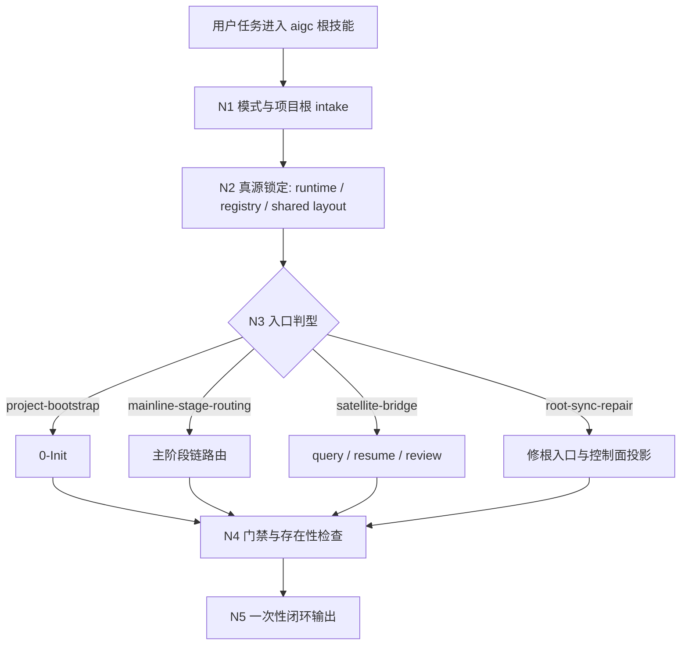
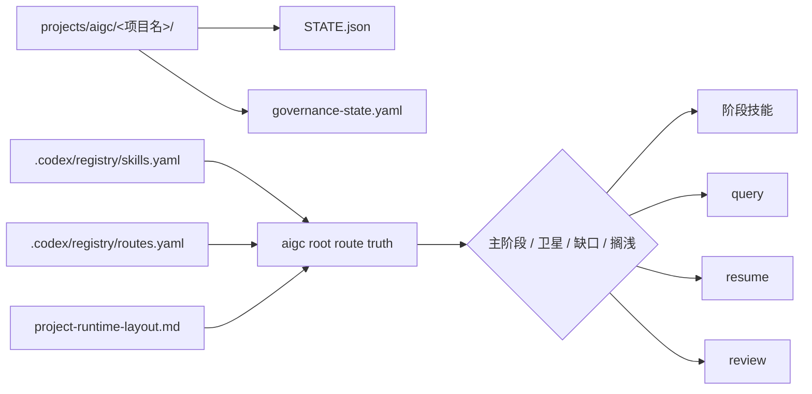
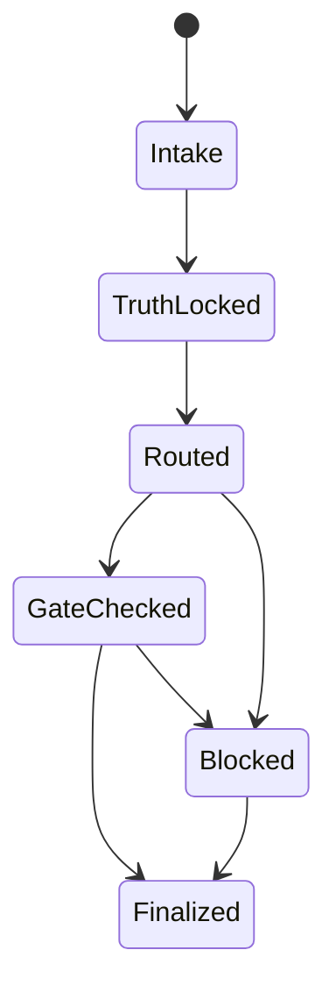
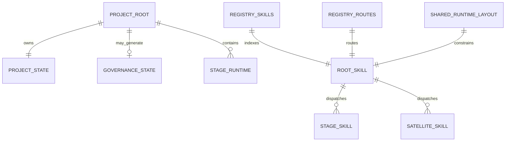

# aigc

## Context Loading Contract

- 每次调用本技能时，必须同时加载同目录 `CONTEXT.md` 作为预加载上下文。
- 若同目录 `CONTEXT.md` 缺失，应先补齐最小知识库骨架，或向用户明确报告阻塞；不得在未检查该上下文的情况下执行技能。
- 冲突优先级：用户显式请求 > 仓库/全局 `AGENTS.md` > 本 `SKILL.md` > 同目录 `CONTEXT.md`。

## 概述

`aigc` 是本仓库的核心多子技能组合总合同。

它不是某一个阶段的生产技能，而是整棵 `aigc/` 技能树的总入口、总路由与总闭环，负责把创作项目稳定挂到仓库级 harness 真源上。

它首先回答五件事：

1. 创作项目应该落在哪里
2. 当前应进入哪个阶段
3. 哪些阶段已经具备可执行合同
4. 三省六部分别在这棵树上挂到哪里
5. 任务完成后如何验收、续跑与学习回流

## 当前改造模式

- 当前 `aigc` 根技能已切换到 `bootstrap_compat` 改造窗口。
- 在这个窗口内，harness 对 `aigc` 根技能固定的真源只有四类：
  - `projects/aigc/<项目名>/` 项目 runtime 与根层治理工件
  - `.codex/registry/skills.yaml` / `.codex/registry/routes.yaml` 的根注册与路由入口
  - `query / resume / review` 三个根级卫星技能入口
  - 高风险任务的 `preflight-verdict` 与完成闭环的 `validation-report`
- 在这个窗口内，主阶段链、阶段状态表与子路径说明仍然可用，但它们默认视为“路由投影”，不是冻结的阶段内部 schema；后续重大改造可重写阶段内合同，只要不破坏上述根层真源。
- 若旧的阶段细节合同与当前重构目标冲突，优先保住项目 runtime、治理 carriers 与高风险 preflight / validation gate，再以目标阶段的当前显式本地合同为准。

## 使用场景

- 初始化一个新的 AIGC 创作项目
- 用户以自然语言要求“初始化影片 / 初始化电影 / 初始化影视 / 初始化视频项目 / 新建电影项目”，且目标媒介是 film/movie/video/影视工作流
- 对已初始化项目执行“回到初始化态重来”的重置式重新初始化
- 在 `projects/aigc/<项目名>/` 下推进影视创作主链
- 判断当前任务应该进入 `1-Planning`、`2-Global`、`3-Detail`、`4-Design`、`5-Image`、`6-Video` 的哪一个阶段
- 查询某个 AIGC 项目的 runtime 真源、阶段产物、编导根文件、设计/画面/视频资产与治理工件
- 续跑一个中断的创作项目
- 对某个阶段或整个项目执行门下省侧预审、验收、`validation-report.md` 更新与学习桥接
- 对齐阶段输出、项目状态与仓库级治理合同

媒介边界：若用户明确要求“初始化小说 / 初始化网文 / 新建书 / 新建长篇故事”，且目标不是影视化项目，应进入 `.agents/skills/story/0-Init/SKILL.md`，不得因“创作项目初始化”泛化命中本技能。

## Mode Selection

当前根技能默认按四种入口模式之一运行：

1. `project-bootstrap`
   - 当前任务要新建项目、回到初始化态、重建项目根治理骨架
2. `mainline-stage-routing`
   - 当前任务要把项目推进到 `0-Init -> 6-Video` 主链中的唯一下一入口
3. `satellite-bridge`
   - 当前任务本质是 `query / resume / review`，不应被伪装成主阶段执行
4. `root-sync-repair`
   - 当前任务要修根入口、registry、runtime layout 或治理投影漂移

选择规则：

- 只要用户目标是“从头起盘 / 重来 / 重置方向”，优先进入 `project-bootstrap`。
- 只要用户目标是“当前该进哪个阶段”，优先进入 `mainline-stage-routing`。
- 只要任务核心动作是“查询事实 / 恢复中断 / 做结构化审计与 review 聚合”，优先进入 `satellite-bridge`。
- 只要问题症状是“根入口说法和技能树、registry、runtime 不一致”，优先进入 `root-sync-repair`。

## Business Requirement Analysis Contract (Mandatory)

| analysis_slot | 当前结论 |
| --- | --- |
| `business_goal` | 用单一根 `SKILL.md` 统一治理 AIGC 项目的项目根判定、阶段路由、卫星桥接、治理挂载与一次性闭环，不让根入口退化为目录说明页。 |
| `business_object` | `projects/aigc/<项目名>/` runtime、项目根治理工件、`.codex/registry/skills.yaml`、`.codex/registry/routes.yaml`、`_shared/project-runtime-layout.md`、各阶段与卫星技能合同。 |
| `constraint_profile` | 当前处于 `bootstrap_compat`；根技能必须只给一个唯一下一入口；不得把 runtime 槽位误写成受治理技能目录；不得与各阶段争夺 canonical business truth；对 active stage 必须回链真实存在的阶段父级合同。 |
| `success_criteria` | 根入口能稳定回答“项目根在哪、当前模式是什么、唯一下一入口是什么、真源从哪读、若 blocked 原因是什么、闭环该写回哪里”，并且这些说法与 registry、runtime layout、真实磁盘结构一致。 |
| `non_goals` | 不替代任何阶段产物生成；不在根层重写子阶段细则；不把卫星技能并入主链；不发明第二套 runtime 或治理真源。 |
| `complexity_source` | 复杂度来自主阶段链、卫星技能、项目 runtime、registry 控制面、`bootstrap_compat` 窗口和搁浅阶段共存，而不是单一路由判断本身。 |
| `topology_fit` | 采用“串行 intake 主干 + 条件分流 + 汇流审计”的思行网络：先锁项目根与模式，再锁真源，再裁决主阶段/卫星/搁浅/缺口，最后一次性输出。 |
| `step_strategy` | 根技能只保留业务分析、真源锁定、分支路由、汇流审计与 one-shot output；阶段内执行细节下放给命中的阶段或卫星技能。 |

## Visual Maps

## 项目工作区与工件落点

### Canonical Project Root

- 创作项目根目录：`projects/aigc/<项目名>/`
- 项目级团队真源：`projects/aigc/<项目名>/team.yaml`
- 项目级创作记忆：`projects/aigc/<项目名>/MEMORY.md`
- 项目级共享附加上下文根：`projects/aigc/<项目名>/CONTEXT/`
- 项目级辅助资产库：`projects/aigc/<项目名>/Assets/`
- 项目运行时目录：`projects/aigc/<项目名>/`，并以此作为 AIGC 项目运行时唯一真源

### Canonical Stage Landing

- `projects/aigc/<项目名>/0-Init/`
- `projects/aigc/<项目名>/Original/`
- `projects/aigc/<项目名>/1-Planning/`
- `projects/aigc/<项目名>/2-Global/`
- `projects/aigc/<项目名>/3-Detail/`
- `projects/aigc/<项目名>/4-Design/`
- `projects/aigc/<项目名>/5-Image/`
- `projects/aigc/<项目名>/6-Video/`

说明：

- 技能阶段名仍沿用当前技能树口径，如 `1-Planning / 4-Design / 5-Image`。
- 项目 runtime 目录以 `.agents/skills/aigc/_shared/project-runtime-layout.md` 为唯一真源；当前 `4-Design` 不再回退到旧的 `主体/` 目录。
- `0-Init` 只预建 `0-Init/`、`Original/` 与项目根载体；上列下游阶段根是执行落点，不是初始化骨架。

### Canonical Runtime Artifacts

- 核心运行时工件：
  - `projects/aigc/<项目名>/STATE.json`
- 惰性治理工件：
  - `projects/aigc/<项目名>/governance-state.yaml`
  - `projects/aigc/<项目名>/mandate.yaml`
  - `projects/aigc/<项目名>/mission-brief.yaml`
  - `projects/aigc/<项目名>/route-plan.yaml`
  - `projects/aigc/<项目名>/preflight-verdict.yaml`
  - `projects/aigc/<项目名>/validation-report.md`
  - `projects/aigc/<项目名>/learning-record.md`

### Shared Runtime Source

- `.agents/skills/aigc/_shared/council-runtime/module-spec.md`
- `.agents/skills/aigc/_shared/project-runtime-layout.md`

### Quality Evidence Source

- 当前稳定质量证据以以下三类载体为准：
  - `scripts/aigc_skill_audit.py --strict`
  - 各阶段与项目根的 `validation-report.md`
  - `STATE.json + governance-state.yaml`
  - 代表性样本项目的即时 validator 结果与跨层对照结论
- 根级质评默认基于当前真实合同、样本项目与审计/validator 结果做即时分析，不要求预先维护固定评测任务 YAML。

## Internal Capability Fusion Contract (Mandatory)

| 能力面 | 当前 owner | 说明 |
| --- | --- | --- |
| 项目根判定 | `aigc/SKILL.md` | 锁定 `projects/aigc/<项目名>/` 与项目级治理工件 |
| 入口模式判型 | `aigc/SKILL.md` | 判断是 `bootstrap`、主链路由、卫星桥接还是根同步修复 |
| 主阶段链路由 | `aigc/SKILL.md` | 只负责给出唯一下一入口，不替代阶段执行 |
| 卫星桥接 | `aigc/SKILL.md` + `query/resume/review` | 根层判型，卫星技能执行局部合同 |
| runtime / registry / shared layout 对齐 | `aigc/SKILL.md` | 根层负责治理投影同步与缺口上报 |
| 业务真源执行 | 命中的阶段或卫星技能 | 根层不得抢写阶段 canonical 业务产物 |

硬规则：

1. 根技能只统筹，不直接替阶段写业务内容。
2. 子阶段是否可执行，以真实 `SKILL.md` / governed entry 为准，不以目录名为准。
3. 根层只拥有“唯一下一入口 + 根治理闭环”的 writeback 权，不拥有阶段业务真稿 writeback 权。

## 阶段路由

### 主阶段链

1. `0-Init`
   - 负责项目初始化、项目根目录建立、`north_star` 生成与基础运行时工件创建，并按 shared runtime layout 预建阶段根目录与 active child skeleton
2. `1-Planning`
   - 负责分集、格式、分组、节奏等规划合同，并在规划期登记 `bootstrap_output` 目标路径与 `source_profile` handoff
3. `2-Global`
   - 负责围绕 `.agents/skills/aigc/2-Global/_shared/episode_root.json` 直接填好 `projects/aigc/<项目名>/2-Global/episode_root.json`；阶段末段输出 `meta + project_global + groups[].global`，作为 `3-Detail` 的导演前置结构化合同
4. `3-Detail`
   - 负责围绕分镜组内颗粒度的明细设计；当前已收束为单技能知行合一根包，固定先执行 `1-分镜构图` 来决定镜数、镜级正文和镜级骨架，再在同一 `SKILL.md` 内按顺序补齐 `角色表现 / 氛围表现 / 摄影表现 / 运镜手法 / 转场特效`，并写入 `3-Detail/第N集.json`
5. `4-Design`
   - 负责场景、角色、服装、道具的清单、设计与面板阶段
6. `5-Image`
   - 已建阶段根合同；负责图像阶段父级路由、runtime 对齐、`A.分镜画面` 单帧融合入口与 `B.分镜故事板` 组级故事板融合入口；执行落点使用 `A-分镜帧 / B-分镜故事板`
7. `6-Video`
   - 负责视频生成前的设计/画面参照、分镜参照、主体参照与视频执行入口；当前已建融合入口为 `A.分镜画面参照`、`B.分镜故事板参照`、`C.主体参照`

### 根级卫星技能

- `query`
  - 根级事实查询卫星技能
  - 默认挂在尚书省执行侧，治理分域偏 `户部`
  - 负责围绕 `projects/aigc/<项目名>/` 读取项目状态、阶段产物、`3-Detail` 主文件、资产落点与治理工件，不改写业务真源
- `resume`
  - 根级续跑恢复卫星技能
  - 默认挂在尚书省执行侧，治理分域偏 `兵部`
  - 负责重建最后稳定入口、检查治理工件缺口、提出安全恢复方案，并把任务回接到根技能或目标阶段；不处理“主动回到初始化态重来”
- `review`
  - 根级 package-level 审计卫星技能
  - 默认挂在门下省执行侧，治理分域偏 `刑部`
  - 负责把 checkpoint / stage / package 三层审计收束为 `projects/aigc/<项目名>/review/**/*.review.json`，并给出唯一 review gate 与 repair route

卫星技能默认关系：

- 三个卫星技能与根 `aigc` 同根同级，不并入主阶段串行链。
- `query` 只拥有检索与证据综合权，不拥有项目或阶段内容真源改写权。
- `resume` 只拥有恢复裁决与回接权，不拥有伪造断点或跳过治理 gate 的权力。
- `review` 只拥有审计聚合、route 判定与 review packet 写回权，不拥有阶段 canonical 业务真稿写回权。

### 当前合同覆盖状态

| 阶段 | 目录存在 | 阶段合同状态 | 调度策略 |
| --- | --- | --- | --- |
| `0-Init` | 是 | 已建合同，脚本待补 | 允许显式初始化任务进入，按 `north_star + init_handoff + project-root runtime` 合同执行 |
| `1-Planning` | 是 | 已建阶段合同，`1-分集`、`2-格式`、`3-分组` active；`4-节奏` 已折叠进 `3-分组` 的 reviewer / gate 规则 | 默认 `1-分集 -> 2-格式 -> 3-分组`；只有命中节奏复核条件时才触发额外 gate |
| `2-Global` | 是 | 已建阶段合同，采用单技能内收模式，以 `.agents/skills/aigc/2-Global/_shared/episode_root.json` 为模板中心，在父 skill 内部直接填写项目级与组级导演 seed | 直接写入 `2-Global/episode_root.json` 与 `2-Global/validation-report.md`；旧 Markdown 仅允许作为 JSON 派生的兼容投影 |
| `3-Detail` | 是 | 已建阶段合同，采用单技能知行合一根包，固定 `分镜构图` 先行并直接围绕 `episode_detail.json` 填写 `meta + groups[].global/detail.分镜列表`；镜级骨架由 `时间 / 剧本正文 / 主体锚定 / 分镜构图` 构成 | 先进入 `.agents/skills/aigc/3-Detail/SKILL.md`，再按内部固定顺序与命中 scope 完成字段填写 |
| `4-Design` | 是 | 已建阶段父合同；当前 `1-清单/{场景,角色,道具}` 与 `2-设计/{场景,角色,道具}` 已迁回新路径，其余 tranche / leaf 仍处于 bootstrap-compatible migration | 可先进入 `1-清单` 或 `2-设计`，当前稳定命中 `场景 / 角色 / 道具`；其余 design tranche 按 source-layer 回迁状态再开放 |
| `5-Image` | 是 | 已建阶段合同，负责统一路由 `A.分镜画面`、`B.分镜故事板`、`1-提示词蒸馏`、`2-参照引用`、`3-图像生成`，其中 `A.分镜画面` 融合单帧端到端链路，`B.分镜故事板` 融合组级多格 storyboard 端到端链路，`1-提示词蒸馏` 再路由 `分镜故事板 / 分镜帧`；漫画页诉求回接 repo-local `comic` workflow | 先进入 `.agents/skills/aigc/5-Image/SKILL.md`；若是单一 `分镜ID` 的端到端画面准备，进入 `A.分镜画面`；若是单一 `分镜组ID` 的多格 storyboard 准备，进入 `B.分镜故事板`；否则按对象状态进入 `1-提示词蒸馏`、`2-参照引用` 或 `3-图像生成`；若对象是漫画页，则明确 reroute |
| `6-Video` | 是 | 已建阶段合同，`A.分镜画面参照`、`B.分镜故事板参照` 与 `C.主体参照` 为融合型 Skill 2.0 包；`1-提示词蒸馏/全能参照`、`1-提示词蒸馏/首帧参照`、`2-参照引用` 与 `3-视频生成` 继续可执行 | 明确命中“分镜画面参照 / 融合包 / full-chain”时路由到 `A.分镜画面参照`；明确命中“分镜故事板参照 / 组级融合包 / full-chain”时路由到 `B.分镜故事板参照`；明确命中“主体参照 / 主体识别向 / 角色服装道具场景参照 / full-chain”时路由到 `C.主体参照`；兼容任务仍可路由到 `1-提示词蒸馏/全能参照`、`1-提示词蒸馏/首帧参照`、`2-参照引用`、`3-视频生成`；`首尾帧参照`、`多图参照` 与其他扩展路径仍按状态检查 |
| `7-Cut` | 否 | 搁浅 | 当前不创建项目 runtime，不纳入主链执行；registry 保留 `shelved` 声明用于阻断旧路由 |

### 卫星技能覆盖状态

| 卫星技能 | 目录存在 | owner_office | 治理分域 | 合同状态 | 默认职责 |
| --- | --- | --- | --- | --- | --- |
| `query` | 是 | `shangshu` | `户部` | active | runtime / project / artifact / governance truth retrieval |
| `resume` | 是 | `shangshu` | `兵部` | active | interruption recovery / safe re-entry / governance artifact repair |
| `review` | 是 | `menxia` | `刑部` | active | checkpoint / stage / package review aggregation and repair routing |

### 子技能调度规则

- 根入口的逻辑主阶段链仍按 `0-Init -> 1-Planning -> 2-Global -> 3-Detail -> 4-Design -> 5-Image -> 6-Video` 判型。
- 阶段内部是否串行、并行、折叠或直达，必须以目标阶段 `SKILL.md` 的显式合同为准，不靠目录名自行推断。
- `1-Planning` 当前显式采用 `1-分集 -> 2-格式 -> 3-分组`，`4-节奏` 只作为 `3-分组` 内部 gate。
- `5-Image` 当前已建阶段根合同；根入口应先进入 `.agents/skills/aigc/5-Image/SKILL.md`，再由阶段父层路由到三个真实子入口。
- 若目标阶段或子技能还没有实质合同，必须报告缺口，而不是编造下游步骤

## Topology Contract (Mandatory)

### Topology Fit

根技能固定采用“一条串行主干 + 四类条件分流 + 一个汇流门”的知行合一拓扑：

- 串行主干：
  - `N1 intake`
  - `N2 truth lock`
  - `N3 route classify`
  - `N4 gate audit`
  - `N5 one-shot close`
- 条件分流：
  - `project-bootstrap`
  - `mainline-stage-routing`
  - `satellite-bridge`
  - `root-sync-repair`
- 汇流门：
  - 所有分支最终都必须回到 `N5`，统一给出唯一下一入口、blocker 或 closure triad

### Ordered / Unordered Rules

1. `N1 -> N2 -> N3 -> N4 -> N5` 固定串行，不得跳步。
2. `N3` 可分流，但一次只能命中一个主分支。
3. 根技能不在同一轮并发推荐多个主阶段或多个卫星入口。
4. 若某分支在 `N4` 发现 blocker，必须直接汇流到 `N5`，而不是继续猜下游。

## Thinking-Action Node Contract (Mandatory)

| node_id | objective | inputs | actions | evidence | route_out | gate |
| --- | --- | --- | --- | --- | --- | --- |
| `N1-intake` | 锁定项目根、任务目标与入口模式候选 | 用户请求、项目路径、现有 runtime | 判断是否有 `PROJECT_ROOT`、是否是起盘/主链/卫星/修根 | `intake_note` | `N2` | 未锁项目范围不得继续 |
| `N2-truth-lock` | 锁定根层真源与当前控制面 | `project_state`、`governance-state`、registry、shared layout | 读取并对齐 runtime、registry、layout、技能树存在性 | `truth_lock_note` | `N3` | 根层真源冲突时不得直接路由 |
| `N3-route-classify` | 给出唯一入口分类 | `N1/N2` 结论、阶段覆盖状态、卫星边界 | 裁决命中主阶段、卫星、搁浅、缺口或根修复路径 | `route_decision` | `N4` | 不得同时给多个主入口 |
| `N4-gate-audit` | 在进入下游前做存在性与门禁审计 | 命中入口、阶段合同、治理 gate | 校验阶段根/真实入口是否存在，是否缺 `mission-brief / route-plan / preflight` 等门 | `gate_verdict` | `N5` | blocker 未显式化不得结案 |
| `N5-one-shot-close` | 一次性收束为根层结论 | route verdict、gate verdict、项目根信息 | 输出唯一下一入口、blocker 或 closure triad，并声明写回位置 | `root_closure` | `done` | 只能在本节点结案 |

## Thinking-Action Network (Mandatory)

| node_id | thinking focus | action focus | fail signal | re-entry |
| --- | --- | --- | --- | --- |
| `N1-intake` | 当前任务本质是什么 | 锁项目根与模式候选 | 项目范围不清、入口模式混杂 | `N1-intake` |
| `N2-truth-lock` | 应该信哪一层真源 | 读 runtime / registry / shared layout | 根入口说法和真实结构冲突 | `N2-truth-lock` |
| `N3-route-classify` | 应该进入哪一个唯一入口 | 判主阶段 / 卫星 / 修根分支 | 同时抛多个候选 | `N3-route-classify` |
| `N4-gate-audit` | 当前入口是否合法且可执行 | 审合同存在性与治理门 | 缺根合同、缺 gate、搁浅误判 | `N4-gate-audit` |
| `N5-one-shot-close` | 怎样统一口径交付 | 写唯一下一入口与闭环 | 输出仍需用户自行再猜下一步 | `N3-route-classify` 或 `N4-gate-audit` |

## 三省六部挂载

### 三省

- 中书省
  - 总入口路由
  - 项目初始化起草
  - 阶段进入判定
  - `mandate / mission-brief / route-plan`
- 门下省
  - 阶段进入前预审
  - 审计与否决
  - `preflight-verdict / validation-report / root cause trace`
- 尚书省
  - 阶段执行调度
  - 项目状态与产物维护
  - `projects/aigc/<项目名>/` canonical runtime

### 六部

| 六部 | 在 `aigc` 根技能中的挂载 |
| --- | --- |
| 吏部 | `.codex/registry/skills.yaml`、`.codex/registry/routes.yaml` 对 `aigc` 的注册与路由 |
| 户部 | 根 `CONTEXT.md`、`projects/aigc/<项目名>/STATE.json` 与 `projects/aigc/<项目名>/governance-state.yaml`；必要时镜像到 `.codex/state/tasks/`；`query` 负责读取与综合证据 |
| 礼部 | `.codex/templates/harness/` 与项目级工件合同 |
| 兵部 | 主阶段链与子技能调度；`resume` 负责续跑与恢复回接 |
| 刑部 | 根验收闭环、阶段审计、包级 review 聚合与失败上溯；高风险任务通过 `preflight-verdict`、`validation-report` 与 `review/*.review.json` 落治理结论 |
| 工部 | `scripts/`、`.codex/evals/`、后续阶段工具链接入 |

## 强制工作流

1. 确认或创建 `projects/aigc/<项目名>/`
2. 在 `projects/aigc/<项目名>/` 中建立或读取运行时工件，并检查项目根 `team.yaml`、`STATE.json`、`governance-state.yaml` 是否存在。
3. 优先读取 `.agents/skills/aigc/_shared/project-runtime-layout.md`，锁定当前项目的 runtime 根目录映射。
4. 若后续进入 `2-Global / 3-Detail / 4-Design / 5-Image / 6-Video`，先加载 `.agents/skills/aigc/_shared/council-runtime/module-spec.md`。
5. 判断当前任务属于首次初始化、重置式重新初始化、规划、组间、明细、设计、图像、视频、后期，还是 `query / resume / review` 卫星诉求中的哪一类
6. 只推荐一个当前主入口阶段或卫星技能，不输出模糊候选列表
7. 若目标阶段既没有阶段根合同，也没有可回接的 governed entry，停止向下伪造，返回缺口与补建落点
8. 若目标阶段被标记为 `搁浅`，显式返回搁浅状态与恢复前置，不向下生成伪执行链
9. 若命中卫星技能，则先进入对应卫星技能，再按其合同回接根技能或目标阶段
10. 若目标阶段已有阶段根合同，则先进入阶段根；只有当阶段被显式声明为“无阶段父级的过渡入口”时，才允许直接进入真实子入口
11. 阶段或卫星动作完成后，把结果写回项目工作区根层运行时工件
12. 输出验收结论与下一步唯一推荐入口

## One-Shot Output Contract (Mandatory)

根技能每轮只允许产出一个 canonical final output，至少包含：

1. `project_root_verdict`
   - 当前命中的 `projects/aigc/<项目名>/`
2. `mode_verdict`
   - 本轮属于 `project-bootstrap / mainline-stage-routing / satellite-bridge / root-sync-repair`
3. `route_verdict`
   - 唯一下一入口，或唯一 blocker
4. `truth_sources`
   - 本轮判定实际依赖的根层真源
5. `closure_triad`
   - `root cause location`
   - `immediate fix`
   - `systemic prevention fix`

硬规则：

1. 不得同时给两个“都可以”的主入口。
2. 若本轮命中 blocker，最终输出的主结论必须是 blocker，而不是继续附带模糊路线图。
3. 根技能对用户的最终交付只能有一个收束口径，不得并列抛出多个未汇流半成品。

## 硬规则

1. `aigc` 根技能是总控面，不是替代各阶段产物的第二真源。
2. 创作项目的 canonical workspace 必须优先落在 `projects/aigc/<项目名>/`。
3. 当前 `bootstrap_compat` 模式下，不得把旧阶段细节合同当作冻结真源去阻断 `aigc` 系列重构；需要保留的是根 runtime、治理工件与高风险 preflight / validation gate。
4. 没有 `mission-brief` 与 `route-plan`，复杂任务不得直接跳入阶段执行。
5. 高风险任务没有 `preflight-verdict`，不得宣布进入正式执行。
6. 对尚未补齐或已搁浅的阶段，必须报告“待补合同/搁浅”，不得伪造其工作流。
7. 子技能经验优先写入最窄作用域；跨阶段经验再晋升到根 `CONTEXT.md`。
8. 对 `2-Global / 3-Detail / 4-Design / 5-Image / 6-Video`，若项目根 `team.yaml.enabled == true`，必须先交给共享 `council-runtime` 判定是否启用顾问团运行时。
9. 根级卫星技能不得冒充新的主阶段；`query` 读真源、`resume` 接续跑、`review` 做结构化审计聚合，各自边界必须显式保持。
10. 高风险任务的预审仍直接回根 `aigc`；但结构化 checkpoint / stage / package 审计可进入独立 `review` 卫星，并把 aggregate review packet 回写到 `projects/aigc/<项目名>/review/`。
11. `resume` 不得伪造断点状态、不得跳过 `mission-brief / route-plan / preflight-verdict` 等硬 gate；缺治理工件时优先回到根技能补齐。
12. `STATE.json` 是轻量起盘的默认治理入口；`governance-state.yaml` 负责按需补上的结构化断点、治理缺口与 query/resume 同步。两者不得各自演化成平行真源。
13. 用户若明确要求“回到初始化态 / 重新起盘 / 推翻当前方向重来”，根路由必须回 `0-Init`；不得把这类诉求误判为 `resume` 的续跑恢复。

## 完成标准

当一次 `aigc` 根技能任务结束时，至少应满足以下条件：

- 已锁定本轮 `mode_verdict`
- 已明确当前项目根目录
- 已明确当前唯一推荐阶段入口
- 已给出项目级工件落点
- 已说明目标阶段是否具备可执行合同
- 已返回三元闭环：
  - `root cause location`
  - `immediate fix`
  - `systemic prevention fix`

## Root-Cause Execution Contract (Mandatory)

当 `aigc` 技能树出现以下症状时，必须优先修根层合同，而不是直接在单个阶段做局部补丁：

- 目录已建但阶段路由混乱
- 子技能很多，但没有统一入口
- 项目输出散落在 `projects/aigc/<项目名>/` 之外
- 阶段合同为空却仍被当作可执行链路
- 项目可以运行，但无法验收、续跑或回流

必经链路：

`Symptom -> Direct Technical Cause -> Rule Source -> Meta Rule Source -> Fix Landing Points`

优先检查：

- `Rule Source`
  - `.agents/skills/aigc/SKILL.md`
  - `.agents/skills/aigc/CONTEXT.md`
  - 各阶段 `SKILL.md` / `CONTEXT.md`
  - `.codex/registry/skills.yaml`
  - `.codex/registry/routes.yaml`
- `Meta Rule Source`
  - 根 `AGENTS.md`
  - 三省六部制元技能

## Field Master

| field_id | 输出位置/字段 | 内容要求 | 默认责任 Node | 质量维度 | 失败码 |
| --- | --- | --- | --- | --- | --- |
| `FIELD-AIGC-INTAKE-01` | 根技能.模式与项目范围 | 明确本轮 mode 与项目范围 | `N1-intake` | 边界清晰度 | `FAIL-AIGC-INTAKE-01` |
| `FIELD-AIGC-TRUTH-02` | 根技能.真源锁定 | 明确 runtime、registry、shared layout 的当前真源组合 | `N2-truth-lock` | 真源一致性 | `FAIL-AIGC-TRUTH-02` |
| `FIELD-AIGC-ROUTE-03` | 根技能.唯一入口 | 给出主阶段链、卫星桥接或根修复的唯一下一入口 | `N3-route-classify` | 路由准确性 | `FAIL-AIGC-ROUTE-03` |
| `FIELD-AIGC-GATE-04` | 根技能.门禁 verdict | 说明入口是否存在、是否搁浅、是否缺治理 gate | `N4-gate-audit` | 门禁完整性 | `FAIL-AIGC-GATE-04` |
| `FIELD-AIGC-CLOSE-05` | 根技能.one-shot close | 明确 closure triad、写回位置与唯一最终口径 | `N5-one-shot-close` | 闭环完整性 | `FAIL-AIGC-CLOSE-05` |

## Thought Pass Map

| step_id | 聚焦字段 | 核心问题 | 生成动作 | 未达标信号 |
| --- | --- | --- | --- | --- |
| `N1` | `FIELD-AIGC-INTAKE-01` | 当前到底是起盘、主链、卫星还是修根 | 锁定 mode 与项目范围 | 任务边界模糊 |
| `N2` | `FIELD-AIGC-TRUTH-02` | 本轮应该信哪些真源 | 读取并对齐 runtime、registry、shared layout | 根层真源互相打架 |
| `N3` | `FIELD-AIGC-ROUTE-03` | 唯一下一入口是什么 | 给出唯一阶段/卫星/修根分支 | 同时抛多个候选 |
| `N4` | `FIELD-AIGC-GATE-04` | 这个入口现在能不能进 | 审计合同存在性与治理 gate | 入口不存在或 gate 缺失 |
| `N5` | `FIELD-AIGC-CLOSE-05` | 怎样一次性收束给用户 | 输出 closure triad 与唯一结论 | 结论仍需用户自行再猜 |

## Pass Table

| field_id | Pass Standard | Fail Code | Rework Entry |
| --- | --- | --- | --- |
| `FIELD-AIGC-INTAKE-01` | mode 与项目范围明确 | `FAIL-AIGC-INTAKE-01` | `N1` |
| `FIELD-AIGC-TRUTH-02` | runtime、registry、shared layout 口径一致 | `FAIL-AIGC-TRUTH-02` | `N2` |
| `FIELD-AIGC-ROUTE-03` | 唯一入口明确且不混层 | `FAIL-AIGC-ROUTE-03` | `N3` |
| `FIELD-AIGC-GATE-04` | blocker、搁浅、缺 gate 状态被明确声明 | `FAIL-AIGC-GATE-04` | `N4` |
| `FIELD-AIGC-CLOSE-05` | one-shot output 与 closure triad 完整 | `FAIL-AIGC-CLOSE-05` | `N5` |

## Context Preload (Mandatory)

加载顺序固定为：

1. 根 `AGENTS.md`
2. `.agents/skills/aigc/CONTEXT.md`
3. `.codex/registry/skills.yaml`
4. `.codex/registry/routes.yaml`
5. `.agents/skills/aigc/_shared/project-runtime-layout.md`
6. `.agents/skills/aigc/_shared/council-runtime/module-spec.md`（仅当后续命中 `2-Global / 3-Detail / 4-Design / 5-Image / 6-Video`）
7. `projects/aigc/<项目名>/MEMORY.md`（若存在）
8. `projects/aigc/<项目名>/CONTEXT/` 下与本轮任务相关的项目级上下文文件（若存在）
9. `projects/aigc/<项目名>/STATE.json`（若存在）
10. `projects/aigc/<项目名>/governance-state.yaml`（若存在）
11. 命中的阶段或卫星技能 `SKILL.md + CONTEXT.md`

冲突优先级固定为：用户显式请求 > `AGENTS.md` / 元规则 > 本 `SKILL.md` > 项目级 `MEMORY.md` > 项目级 `CONTEXT/` > 同目录 `CONTEXT.md`。
