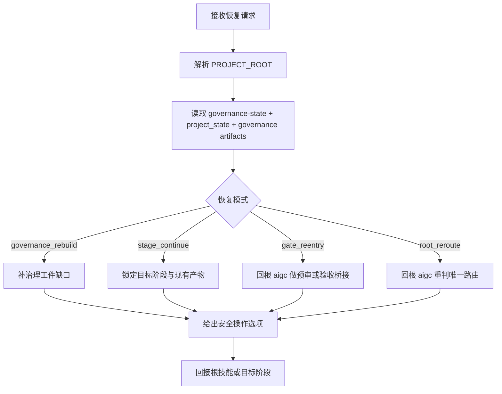

# aigc Resume

## Context Loading Contract

- 每次调用本技能时，必须同时加载同目录 `CONTEXT.md` 作为预加载上下文。
- 若同目录 `CONTEXT.md` 缺失，应先补齐最小知识库骨架，或向用户明确报告阻塞；不得在未检查该上下文的情况下执行技能。
- 冲突优先级：用户显式请求 > 仓库/全局 `AGENTS.md` > 本 `SKILL.md` > 同目录 `CONTEXT.md`。

## Purpose

- `resume/` 是 `aigc` 根目录下的续跑恢复卫星技能，不是新的主阶段。
- 它负责重建最后稳定入口、检查治理工件缺口、提出安全恢复方案，并把任务回接到根 `aigc` 或目标阶段。
- 当前仓库尚无 `aigc` 专用 `workflow_manager.py`，因此 `resume/` 的恢复判断以 `projects/aigc/<项目名>/` 下的核心初始化工件、`STATE.json`、可选的 `governance-state.yaml`、阶段产物与工作区证据为准，不伪造不存在的 tracked workflow。
- 用户若明确要求“回到初始化态重来 / 推翻当前方向重新起盘”，不属于 `resume/`；应回 `0-Init` 处理 `rebootstrap`。

## Stage Position

- 挂载位置：根 `aigc` 同级卫星技能。
- owner office：`shangshu`
- governance domain：`兵部`
- 默认回接：根 `aigc` 或目标阶段 skill。

| owns | avoids |
| --- | --- |
| 恢复模式判定、最后稳定入口重建、安全回接建议 | 伪造不存在的断点状态 |
| 治理工件缺口识别 | 默认给 destructive Git 建议 |
| 将恢复结果回接根技能或目标阶段 | 越权代替根 `aigc` 做高风险预审 / 验收裁决 |

## Supported Scope

| scope | support level | note |
| --- | --- | --- |
| 根治理工件缺口修复 | full | 支持从轻量初始化态补 `governance-state / mandate / brief / route / verdict / validation / learning` |
| `0-Init` 到 `6-Video` 的阶段续跑 | full | 以项目运行时与阶段产物证据为准 |
| `7-Cut` | blocked | 当前阶段处于 `搁浅`，只返回恢复前置 |
| 主动回退到初始化态 | reroute_only | 这不是续跑恢复；唯一主入口是 `0-Init` |
| 伪造 workflow state / 自动回滚 Git | forbidden | 明确禁止 |

## Workflow



## Project Root Guard

`resume/` 必须先确认真实 `PROJECT_ROOT`，否则所有续跑判断都不可靠。

允许的判定顺序：

1. 当前工作目录已经在 `projects/aigc/<项目名>/` 下。
2. 用户明确给出项目名。
3. `projects/` 下只有一个候选项目。
4. 多项目且用户未说明时，停止猜测，先回根 `aigc` 或直接询问项目名。

## Reference Loading

L1 必读：

- [workflow-resume.md](references/workflow-resume.md)
- [project-runtime-layout.md](../_shared/project-runtime-layout.md)

L2 按需：

- 需要解释治理链时，再读 [task-lifecycle.md](../../../../.codex/runbooks/task-lifecycle.md)
- 需要解释门下省 gate 时，再读 [office-governance-contract.md](../../../../.codex/templates/harness/office-governance-contract.md)

## Workflow Checklist

```text
恢复进度：
- [ ] Step 0: 解析 PROJECT_ROOT
- [ ] Step 1: 读取治理工件与 project_state
- [ ] Step 2: 判定恢复模式
- [ ] Step 3: 检查阶段产物与最新工作区证据
- [ ] Step 4: 给出安全恢复方案
- [ ] Step 5: 回接根技能、目标阶段或 review
```

## Step 0：解析 `PROJECT_ROOT`

优先确认：

- `STATE.json`
- `team.yaml`
- `0-Init/north_star.yaml`
- `0-Init/init_handoff.yaml`
- `0-Init/story-source-manifest.yaml`

若项目根无法锁定，不得继续推断“上次跑到哪”。

## Step 1：读取治理工件

推荐读取：

```bash
sed -n '1,220p' "$PROJECT_ROOT/STATE.json"
test -f "$PROJECT_ROOT/governance-state.yaml" && sed -n '1,220p' "$PROJECT_ROOT/governance-state.yaml"
test -f "$PROJECT_ROOT/mission-brief.yaml" && sed -n '1,220p' "$PROJECT_ROOT/mission-brief.yaml"
test -f "$PROJECT_ROOT/route-plan.yaml" && sed -n '1,220p' "$PROJECT_ROOT/route-plan.yaml"
test -f "$PROJECT_ROOT/preflight-verdict.yaml" && sed -n '1,220p' "$PROJECT_ROOT/preflight-verdict.yaml"
test -f "$PROJECT_ROOT/validation-report.md" && sed -n '1,220p' "$PROJECT_ROOT/validation-report.md"
git -C "$(git rev-parse --show-toplevel 2>/dev/null || pwd)" status --short
```

## Step 2：判定恢复模式

| mode | 触发条件 | 默认动作 |
| --- | --- | --- |
| `lightweight_init_continue` | 核心初始化工件齐全，但尚未生成结构化治理快照 | 回根 `aigc` 或低风险下一阶段继续；只有需要深治理时才补快照 |
| `governance_rebuild` | `STATE.json` 缺失、核心初始化工件缺失，或高风险恢复所需 gate 明显缺失 | 回根 `aigc` 补 `state / brief / route / verdict` |
| `stage_continue` | 阶段产物已存在，但验收闭环未完成 | 继续当前阶段或其直接下游 |
| `gate_reentry` | 内容产物已有，但需要预审或验收 | 回根 `aigc` |
| `init_rebootstrap_reroute` | 用户明确要求“回到初始化态重来 / 推翻方向重做” | 直接回 `0-Init`，不要按续跑逻辑硬接 |
| `root_reroute` | 当前阶段不清、阶段已搁浅或合同缺失 | 回根 `aigc` 重判唯一路由 |

## Step 3：检查阶段产物与工作区证据

常用读取入口：

```bash
find "$PROJECT_ROOT" -type f -mtime -3 | sort
rg --files "$PROJECT_ROOT/3-Detail" | rg '第[0-9]+集\\.json$'
rg --files "$PROJECT_ROOT/主体"
rg --files "$PROJECT_ROOT/5-Image"
rg --files "$PROJECT_ROOT/6-Video"
```

恢复时优先依赖：

- `STATE.json`
- 最近一轮 `route-plan.yaml`
- 对应阶段 runtime 目录中的真实产物
- `validation-report.md` 是否已写出

## Step 4：安全恢复方案

默认只给安全选项，不直接执行破坏性动作。

允许的建议：

- 回根 `aigc` 重新路由
- 回 `0-Init` 执行重置式重新初始化
- 回到某个已知阶段继续执行
- 回根 `aigc` 做 preflight 或验收桥接
- 先补治理工件，再继续内容阶段

若 `governance-state.yaml` 缺失但 `STATE.json` 与核心初始化工件齐全，默认先判为 `lightweight_init_continue`；只有当用户需要结构化断点、复杂多步恢复或 review bridge 时，才升级为 `governance_rebuild`。

禁止的默认动作：

- `git reset --hard`
- 假设存在某个 tag/commit 再硬回滚
- 在没有 `mission-brief / route-plan / preflight-verdict` 时直接重启高风险执行
- 把“主动回到初始化态重来”伪装成 `stage_continue` 或 `governance_rebuild`

## Step 5：回接

恢复结论必须说明唯一下一入口：

- 根 `aigc`
- 某个阶段 skill

不要同时给多个无序候选。

## Root-Cause Execution Contract (Mandatory)

当 `resume/` 出现以下问题时，必须先修源层：

- 把不存在的 workflow state 当真
- 只凭目录猜断点
- 缺治理工件时仍建议直接续跑
- 默认给出危险 Git 动作
- 把主动 `rebootstrap` 误判成普通续跑

必经链路：

`Symptom -> Direct Technical Cause -> Rule Source -> Meta Rule Source -> Fix Landing Points`

优先检查：

- `Rule Source`
  - `.agents/skills/aigc/resume/SKILL.md`
  - `.agents/skills/aigc/resume/references/workflow-resume.md`
  - `.agents/skills/aigc/_shared/project-runtime-layout.md`
- `Meta Rule Source`
  - `.agents/skills/aigc/SKILL.md`
  - 根 `AGENTS.md`
  - `.codex/runbooks/task-lifecycle.md`

## Context Preload (Mandatory)

- 每次调用本技能时，必须自动加载同目录 `CONTEXT.md`。
- 冲突优先级：用户显式请求 > 根 `AGENTS.md` > 根 `aigc/SKILL.md` > 本 `SKILL.md` > `CONTEXT.md`。
- 若本轮恢复暴露出新的失败模式，应先写入 `CONTEXT.md` 的 Type Map / Repair Playbook。
