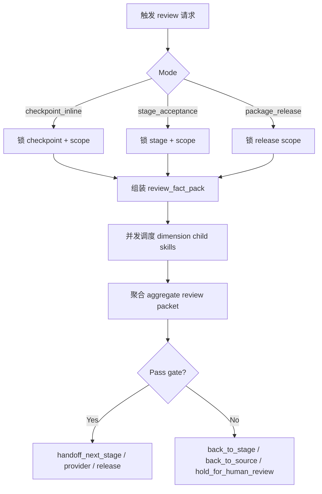
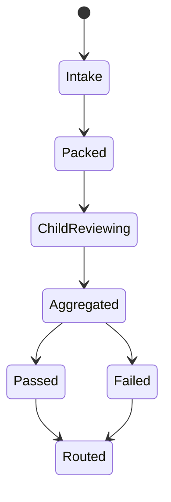

# aigc / review

## Context Loading Contract

- 每次调用本技能时，必须同时加载同目录 `CONTEXT.md`。
- 在进入任一子技能前，必须先回读本 `SKILL.md`、`_shared/review-root-contract.md`、`_shared/review-child-output-contract.md`、`_shared/review-dimension-registry.yaml`。
- 本技能是 `aigc` 的包级 review 卫星，不是新的主阶段；它只拥有审计聚合与 route 判定权，不拥有阶段业务真源写回权。

## Overview

`review` 是 `aigc` 当前缺失的技能包级审计父技能。

它不代替各阶段自己的 `validation-report.md`，而是把散落在 `1-Planning / 2-Global / 3-Detail / 4-Design / 5-Image / 6-Video` 里的 validator、handoff gate 与结构化审计需求，收束成一套统一的 review 体系：

1. 父层先锁当前 review mode、checkpoint、stage、scope 与事实包
2. registry 中命中的 child review skills 并发审查同一份 review fact pack
3. 子技能输出各自 `dimension_packet + dimension_report_ref`
4. 父层聚合为单一 review gate JSON
5. review 结果再决定是回退当前阶段、上溯 source contract、阻断 provider handoff，还是放行下一入口

一句话裁决：

- 子技能定义审计规范，不争夺总 gate
- 父层只认单一 aggregate review packet 作为 checkpoint / stage / package 级审计真源

## Mode Selection

本技能有三种主模式：

1. `checkpoint_inline`
   - 命中某个阶段节点刚写出 canonical 输出，需要在 handoff 前做一次结构化审计
2. `stage_acceptance`
   - 当前阶段已经有成套输出，需要对该阶段做一次 episode/stage 级总审计
3. `package_release`
   - 当前 episode 或项目准备进入跨阶段交付、provider 提交或对外宣告 ready，需要做跨阶段总审计

选择规则：

- 若用户或上游明确给了 `checkpoint_id`，优先进入 `checkpoint_inline`
- 若问题是“这一阶段现在能不能放行”，进入 `stage_acceptance`
- 若问题是“这一集/这一包现在能不能交出去”，进入 `package_release`

## Parent Positioning

### 父层拥有

- review mode / checkpoint / stage / scope 锁定
- `review_fact_pack` 组装与 covenant gate
- registry 命中的 review child skills 并发调度与聚合
- 唯一 `review_status / routing_decision / handoff_targets / rework_targets` 判定权
- `projects/aigc/<项目名>/review/` 下 aggregate review packet 的正式落盘

### 父层不拥有

- 直接修改任何阶段 canonical 文件
- 代替 `1-Planning ~ 6-Video` 自己写业务内容
- 把各维度 sidecar 变成第二份 parallel canonical truth
- 代替根 `aigc` 写 `preflight-verdict.yaml`

## Governed Child Skills

validator roster、checkpoint 覆盖、mode 权重、默认返工入口与 mandatory 规则，统一以 `./_shared/review-dimension-registry.yaml` 为准。

父层在这里不再手写第二张维度表，只保留两条约束：

- 当前 registry 落地的是六维审计：`规划与种子兑现 / 分镜执行连续性 / 设计对位 / 图像交付就绪 / 视频交付就绪 / 治理闭环`
- 父层只负责并发调度、聚合裁决与 route 判定，不接管子技能的维度内判据

## Execution Provider Contract

- 默认 provider：`code-reviewer`
- provider 解析真源：`.agents/skills/aigc/review/_shared/execution-provider.yaml`
- 默认执行方式：review child skills 定义 spec，`scripts/aigc_review_runner.py` 先写同轮 `review_fact_pack`，再按 `execution-provider.yaml -> $CODEX_HOME -> ~/.codex` 的顺序解析 `code-reviewer` 并对该 fact pack 做结构化审计
- 当前 repo 的 canonical runner：`scripts/aigc_review_runner.py`
- 汇流规则：
  - runner 必须先写 `*.review.fact-pack.json`
  - `code-reviewer` 的 JSON sidecar 与日志必须落到 aggregate packet 同级 `.code-reviewer/<scope>.review/`
  - child dimensions 再产出结构化 `dimension_packet + dimension_report_ref`
  - `review` 父层把 findings 与维度 verdict 汇流成 `issues / severity_counts / rework_targets / source_trace`
  - 聚合结论必须回写到 `projects/aigc/<项目名>/review/**/*.review.json`
  - 审后自动修复的当前定义是：自动写 `*.review.repair.json`，并在 `governance-state.yaml` 已存在时自动同步 `review_bridge + resume_contract.required_repairs`
  - 父层不得直接改写阶段业务 canonical truth；真正业务返工仍回到被路由命中的 stage / source owner

## Shared Canonical Sources

- `.agents/skills/aigc/SKILL.md`
- 当前 `SKILL.md + CONTEXT.md`
- `./_shared/review-root-contract.md`
- `./_shared/review-child-output-contract.md`
- `./_shared/review-dimension-registry.yaml`
- `./_shared/review-aggregate.template.json`
- `./_shared/review-dimension-report.template.md`
- `./_shared/review-fact-pack-spec.md`
- `./_shared/review-team-contract.md`
- `scripts/aigc_review_runner.py`

## Canonical Runtime

- checkpoint aggregate packets:
  - `projects/aigc/<项目名>/review/checkpoints/<checkpoint_id>/<scope_ref>.review.json`
- stage aggregate packets:
  - `projects/aigc/<项目名>/review/stages/<stage>/<scope_ref>.review.json`
- release aggregate packets:
  - `projects/aigc/<项目名>/review/releases/<scope_ref>.review.json`
- fact pack sidecars:
  - 与 aggregate packet 同级
  - 文件名固定为 `<scope_ref>.review.fact-pack.json`
- repair sidecars:
  - 与 aggregate packet 同级
  - 文件名固定为 `<scope_ref>.review.repair.json`
- review summary sidecars:
  - 与 aggregate packet 同级
  - 文件名固定为 `<scope_ref>.review.review.md`
- dimension sidecars:
  - 统一落在 aggregate packet 同级目录
  - 文件名以 `review-dimension-registry.yaml -> report_filename` 为准
- provider artifacts:
  - 统一落在 aggregate packet 同级 `.code-reviewer/<scope_ref>.review/`

## Business Requirement Analysis Contract

| analysis_slot | 当前结论 |
| --- | --- |
| `business_goal` | 为 `aigc` 建立统一的包级 review 机制，让阶段节点审计、阶段总验与跨阶段 release gate 都有单一真源和统一 route。 |
| `business_object` | `1-Planning ~ 6-Video` 的阶段输出、阶段 `validation-report.md`、项目根治理工件、现有 validators / audit scripts、`review_fact_pack`。 |
| `constraint_profile` | review 是卫星技能，不得冒充主阶段；child skills 只产出局部维度 verdict；aggregate packet 才有最终 gate 判定权；核心创作仍由阶段 skill 直写。 |
| `success_criteria` | 能稳定回答“当前在哪个审计点、要审哪些维度、阻断范围是什么、回退到哪一层、下游能否放行”，并把结论落到单一 review packet，同时自动写出 repair route 与治理桥接。 |
| `non_goals` | 不替代阶段业务生成；不把阶段 `validation-report.md` 删除或并吞；不把 review 子技能写成第二套主链。 |
| `complexity_source` | 复杂度来自多阶段、多媒介、多 handoff 节点与不同 scope 的聚合，而不是单一 validator 本身。 |
| `topology_fit` | 采用“checkpoint/stage/release intake -> fact pack -> parallel dimensions -> aggregate gate -> route handoff”的网状聚合结构。 |
| `step_strategy` | 父层只做 intake、pack、并发调度、聚合裁决与 one-shot output；维度判断下放 child skills。 |

## Visual Maps

```mermaid
flowchart LR
    A["1-Planning/3-分组"] --> B["planning-handoff-ready"]
    B --> C["2-Global"]
    C --> D["global-seed-ready"]
    D --> E["3-Detail"]
    E --> F["detail-episode-ready"]
    F --> G["4-Design"]
    G --> H["design-list-ready / design-truth-ready / design-panel-ready"]
    H --> I["5-Image"]
    I --> J["image-request-ready / image-reference-ready / image-handoff-ready"]
    J --> K["6-Video"]
    K --> L["video-request-ready / video-reference-ready / video-handoff-ready"]
    L --> M["package-release-ready"]
```

## Dispatch Order Contract

### 固定主干

1. `N1-REVIEW-INTAKE`
2. `N2-FACT-PACK`
3. `N3-PARALLEL-DIMENSIONS`
4. `N4-AGGREGATE-GATE`
5. `N5-ROUTE-HANDOFF`

### 并发规则

- 必须并发：
  - registry 当前命中的 mandatory review child skills
- 必须串行：
  - fact pack 组装
  - aggregate gate 判定
  - aggregate review packet 落盘
  - route / handoff 决策

## Field Master

| field_id | output_slot | requirement | owner_node | quality_dimension | fail_code |
| --- | --- | --- | --- | --- | --- |
| `FIELD-REVIEW-01` | review scope | mode、checkpoint、stage、scope_ref 必须唯一 | `N1-REVIEW-INTAKE` | scope clarity | `FAIL-REVIEW-01` |
| `FIELD-REVIEW-02` | review fact pack | 同一轮 child review 必须消费同一份 pack | `N2-FACT-PACK` | pack covenant | `FAIL-REVIEW-02` |
| `FIELD-REVIEW-03` | dimension dispatch | registry 当前 mandatory 维度必须全部命中 | `N3-PARALLEL-DIMENSIONS` | dispatch completeness | `FAIL-REVIEW-03` |
| `FIELD-REVIEW-04` | aggregate gate | 只有 aggregate packet 才有 `review_status / routing_decision` 判定权 | `N4-AGGREGATE-GATE` | gate authority | `FAIL-REVIEW-04` |
| `FIELD-REVIEW-05` | route handoff | 必须给出唯一回退或放行入口 | `N5-ROUTE-HANDOFF` | closure completeness | `FAIL-REVIEW-05` |

## Thinking-Action Network

| node_id | objective | inputs | actions | evidence | route_out | gate |
| --- | --- | --- | --- | --- | --- | --- |
| `N1-REVIEW-INTAKE` | 锁定 mode、checkpoint、stage、scope | 用户请求、上游 handoff、项目根 | 判定 `checkpoint_inline / stage_acceptance / package_release`，锁 scope_ref 与 aggregate 落点 | `review_scope_note` | `N2` | mode 与 scope 必须唯一 |
| `N2-FACT-PACK` | 组装同一份 `review_fact_pack` | 项目 runtime、阶段产物、validation carriers | 按 `_shared/review-fact-pack-spec.md` 组装 pack，先写 `*.review.fact-pack.json`；缺 required slice 则阻断 | `review_fact_pack + covenant_note` | `N3` 或阻断 | pack 缺 required slice 不得继续 |
| `N3-PARALLEL-DIMENSIONS` | 并发执行 registry 命中的维度审计 | `review_fact_pack`、registry、child skills | 先自动调 `code-reviewer`，再为命中的 child review skills 生成并收集 `dimension_packet + report_ref` | `dimension_packets + provider_sidecars` | `N4` | mandatory 维度不可缺失 |
| `N4-AGGREGATE-GATE` | 聚合唯一 review gate | `dimension_packets`、aggregate template | 计算 `review_status / severity_counts / routing_decision / handoff_targets / rework_targets` 并写 aggregate packet | `aggregate_review_packet` | `N5` | 只有本节点可写最终 gate |
| `N5-ROUTE-HANDOFF` | 统一下游路由口径 | aggregate packet、scope、当前阶段 | 决定回退当前阶段、上溯 source contract、阻断 provider、或放行下一入口；同步写 `*.review.repair.json`，并按需回写 `governance-state.yaml.review_bridge` | `review_route_note + repair_plan` | done | 只能在本节点结案 |

## Thought Pass Map

| step_id | focus | actions | evidence | route_out | rework_entry |
| --- | --- | --- | --- | --- | --- |
| `N1` | 锁 mode / checkpoint / stage / scope | 统一 intake 判型与 aggregate 落点 | `review_scope_note` | `N2` | `N1` |
| `N2` | 组装同一份 review fact pack | 锁 required refs 与 covenant gate | `review_fact_pack + covenant_note` | `N3` | `N2` |
| `N3` | 并发调度 registry 维度 | 生成 `dimension_packets + report_refs` | `dimension_packets` | `N4` | `N3` |
| `N4` | 聚合唯一 gate | 计算 `review_status / routing_decision / handoff_targets` | `aggregate_review_packet` | `N5` | `N4` |
| `N5` | 统一 route 与 handoff | 输出唯一 repair / handoff 决策 | `review_route_note` | done | `N5` |

## Pass Table

| field_id | pass_standard | fail_code | rework_entry |
| --- | --- | --- | --- |
| `FIELD-REVIEW-01` | mode、checkpoint、stage、scope_ref 唯一 | `FAIL-REVIEW-01` | `N1` |
| `FIELD-REVIEW-02` | review fact pack covenant 完整 | `FAIL-REVIEW-02` | `N2` |
| `FIELD-REVIEW-03` | mandatory child dimensions 全部命中 | `FAIL-REVIEW-03` | `N3` |
| `FIELD-REVIEW-04` | aggregate packet 拥有唯一 gate authority | `FAIL-REVIEW-04` | `N4` |
| `FIELD-REVIEW-05` | route / handoff 唯一且可执行 | `FAIL-REVIEW-05` | `N5` |

## Aggregate Gate Contract

- `review_status` 不以均分独裁，必须额外经过 severity / source / covenant gate：
  - `FAIL-COVENANT`
  - `FAIL-BLOCKING`
  - `PASS-WITH-WARNINGS`
  - `PASS`

### Routing Decision Contract

| routing_decision | 适用条件 | handoff_targets |
| --- | --- | --- |
| `back_to_stage_contract` | 问题主要落在当前阶段产物与本阶段节点 | 当前 stage / node / scope |
| `back_to_source_contract` | 问题主要来自上游真源、规划冲突或治理断链 | `0-Init / 1-Planning / 2-Global / 3-Detail` 等 source owner |
| `block_provider_handoff` | 请求已写出但引用、provider pack 或 continuity 仍不可信 | 当前 `5-Image / 6-Video` handoff node |
| `handoff_next_stage` | 当前 checkpoint/stage 已通过，可进入唯一下一入口 | 下一阶段或下一子路径 |
| `hold_for_human_review` | 自动审计无法稳定裁决，需人工复核 | 当前 aggregate packet + dimension sidecars |

## One-Shot Output Contract

父层最终只向运行时与下游交付一份 aggregate review packet，至少包含：

- `review_status`
- `review_mode`
- `checkpoint_id`
- `stage`
- `scope_ref`
- `selected_agents`
- `dimension_packets`
- `dimension_report_refs`
- `issues`
- `severity_counts`
- `critical_issues`
- `overall_score`
- `dimension_scores`
- `routing_decision`
- `handoff_targets`
- `rework_targets`
- `review_ref`
- `review_fact_pack_ref`
- `repair_plan_ref`
- `review_report_ref`
- `source_trace`
- `evidence_refs`
- `external_review`

补充说明：

- `repair_plan_ref` 是当前 `aigc/review` 自动修复闭环的正式载体。
- 这里的“自动修复”默认指自动回写 repair route 与治理桥接，不等于直接改写 stage canonical 业务文件。
- `thought_process`

## Root-Cause Execution Contract (Mandatory)

当 `aigc/review` 出现以下问题时，必须先修 review 真源而不是只改单个 sidecar：

- checkpoint 触发点与实际阶段节点脱节
- 不同 child dimensions 读取了不同 scope 或不同 pack
- aggregate packet 缺 `routing_decision / handoff_targets / rework_targets`
- review packet 与阶段 `validation-report.md` 争夺最终 gate

固定链路：

`Symptom -> Direct Technical Cause -> Rule Source -> Meta Rule Source -> Fix Landing Points`

## Completion Contract

- 当前轮 `review_fact_pack`、aggregate packet 与 dimension sidecars 已锁定并可追溯
- 聚合 packet 已能把问题回流到 stage / node / source owner
- 只有 aggregate review packet 才能把当前 scope 放行到下游阶段或 provider handoff
