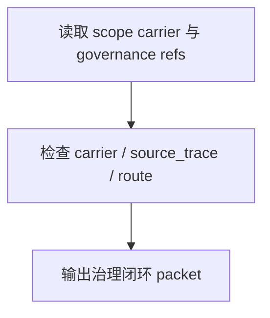

# review / 治理闭环

## Context Loading Contract

- 每次调用本技能时，必须同时加载同目录 `CONTEXT.md`。
- 必须回读父层 `review/SKILL.md`、`../_shared/review-root-contract.md`、`../_shared/review-child-output-contract.md`。

## Invocation Modes

- `checkpoint_inline`
- `stage_acceptance`
- `package_release`

## Parent Positioning

本 child 负责检查：

- 阶段 `validation-report.md` 是否与当前 scope 对位
- `STATE.json / governance-state.yaml / source_trace / handoff_targets` 是否稳定
- route 是否唯一，carrier 是否没有漂移

它不负责：

- 业务内容本身的创意优劣

## Output Contract

- `role_id`: `governance-closure-validator`
- `dimension_report_ref`: `治理闭环.md`
- 默认返工入口：
  - `validation-report`
  - `root-aigc`

## Visual Map

## Thinking-Action Network

| node_id | objective | actions | evidence | route_out | gate |
| --- | --- | --- | --- | --- | --- |
| `N1-GOV-READ` | 锁治理载体 | 读取 validation carriers、STATE、governance-state | `gov_note` | `N2` | carrier 明确 |
| `N2-CLOSURE-CHECK` | 检查闭环 | 审 route、source trace、handoff 是否唯一 | `closure_note` | `N3` | closure 成立 |
| `N3-PACKET-WRITE` | 输出维度 packet | 生成 `dimension_packet + report_ref` | `packet_note` | done | 只写本维度 |

## Lite Field Contract

| field_id | output_slot | pass_standard | fail_code | rework_entry |
| --- | --- | --- | --- | --- |
| `FIELD-GC-01` | carrier alignment | 当前 scope carrier 对位稳定 | `FAIL-GC-01` | `N2` |
| `FIELD-GC-02` | route uniqueness | route / handoff / source trace 唯一 | `FAIL-GC-02` | `N2` |
| `FIELD-GC-03` | dimension packet | 报告完整可聚合 | `FAIL-GC-03` | `N3` |

## Root-Cause Execution Contract (Mandatory)

若本维度失效，先修 carrier、route 与 source_trace 的真源关系，不要把治理漂移误判为业务质量问题。

## Completion Contract

- 已指出 carrier、route 或 source trace 问题
- 已给出回退到 `validation-report` 或根 `aigc` 的建议
