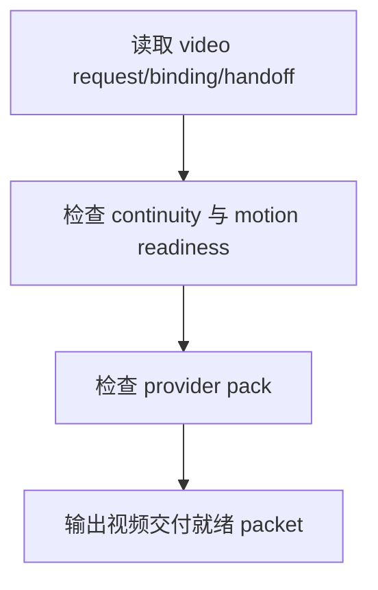

# review / 视频交付就绪

## Context Loading Contract

- 每次调用本技能时，必须同时加载同目录 `CONTEXT.md`。
- 必须回读父层 `review/SKILL.md`、`../_shared/review-root-contract.md`、`../_shared/review-child-output-contract.md`。

## Invocation Modes

- `checkpoint_inline`
- `stage_acceptance`
- `package_release`

## Parent Positioning

本 child 负责检查：

- `6-Video` 请求对象是否稳定
- 引用绑定是否可信
- provider handoff pack 是否完整
- motion / duration / continuity readiness 是否达到交付门

它不负责：

- 图像 provider 交付

## Output Contract

- `role_id`: `video-delivery-validator`
- `dimension_report_ref`: `视频交付就绪.md`
- 默认返工入口：
  - `6-Video/1-提示词蒸馏`
  - `6-Video/2-参照引用`
  - `6-Video/3-视频生成`

## Visual Map

## Thinking-Action Network

| node_id | objective | actions | evidence | route_out | gate |
| --- | --- | --- | --- | --- | --- |
| `N1-VIDEO-READ` | 锁视频链路输出 | 读取 request/binding/handoff refs | `video_note` | `N2` | scope 明确 |
| `N2-MOTION-CHECK` | 检查 continuity 与 motion readiness | 审 motion/duration/reference continuity | `motion_note` | `N3` | readiness 成立 |
| `N3-PROVIDER-CHECK` | 检查 handoff pack | 审 submit-plan / brief / output root | `provider_note` | `N4` | provider pack 成立 |
| `N4-PACKET-WRITE` | 输出维度 packet | 生成 `dimension_packet + report_ref` | `packet_note` | done | 只写本维度 |

## Lite Field Contract

| field_id | output_slot | pass_standard | fail_code | rework_entry |
| --- | --- | --- | --- | --- |
| `FIELD-VD-01` | motion readiness | motion/duration/reference readiness 稳定 | `FAIL-VD-01` | `N2` |
| `FIELD-VD-02` | provider pack | provider handoff 完整 | `FAIL-VD-02` | `N3` |
| `FIELD-VD-03` | dimension packet | 报告完整可聚合 | `FAIL-VD-03` | `N4` |

## Root-Cause Execution Contract (Mandatory)

若本维度失效，先修 `6-Video` 的 motion/duration/reference readiness 与 provider pack，不要把问题压成泛化“视频还不稳”。

## Completion Contract

- 已指出视频链路的 readiness 或 provider 问题
- 已给出回退到 `6-Video` 对应子路径的建议
