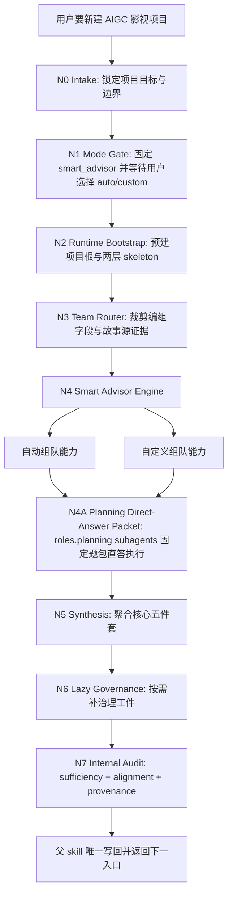
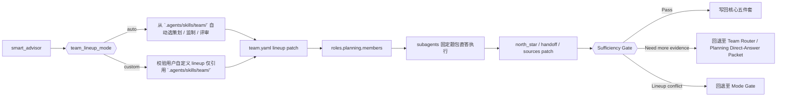
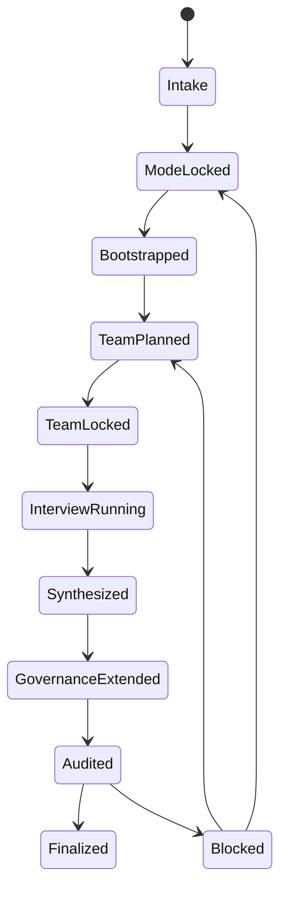
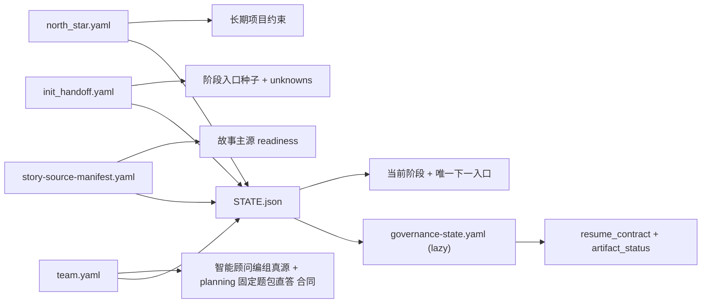

# aigc 0-Init

## Context Loading Contract

- 每次调用本技能时，必须同时加载同目录 `CONTEXT.md` 作为预加载上下文。
- 若同目录 `CONTEXT.md` 缺失，应先补齐最小知识库骨架，或向用户明确报告阻塞；不得在未检查该上下文的情况下执行技能。
- 冲突优先级：用户显式请求 > 仓库/全局 `AGENTS.md` > 本 `SKILL.md` > 同目录 `CONTEXT.md`。

## 概述

`0-Init` 是 `aigc` 技能树的项目立项层、初始化治理层、`north_star` 生成入口，以及“重置式重新初始化”入口。

当前合同采用单技能真源模式：

- 所有初始化能力都内收在本 `SKILL.md`
- `智能顾问模式 -> 自动组队 / 自定义组队 -> planning 固定题包直答 -> synthesis -> sufficiency audit` 都属于父 skill 的内部能力面
- 不再依赖任何外置初始组合同作为执行真源
- 最终只允许父 skill 写回 canonical 初始化工件

## 单一真源目录合同

- 本 `SKILL.md` 是 `0-Init` 的唯一规范真源。
- `CONTEXT.md` 只承载经验层知识库，不再存放模式合同或目录真源。
- `agents/openai.yaml` 只承载入口元数据，不得扩写执行规则。
- `CHANGELOG.md` 只承载迁移与结构变更索引，不参与默认运行时预加载。
- `templates/` 只保留本地模板真源；共享模板继续回指 `.agents/skills/aigc/_shared/`。
- `复杂链路的骨架 / 细则分层 = false`；单一 `智能顾问模式`、其编组子模式、planning 固定题包直答 与 gate 必须全部留在本 `SKILL.md`。
- 已删除旧的 `references/*-mode/module-spec.md` 迁移 stub；后续不得在本目录重建平行 mode reference 真源。

## When to Use

- 需要新建一个 AIGC 影视创作项目。
- 已初始化项目因重大方向错误、审美失真、结构失效或用户明确不满意，需要退回初始化态重新起盘。
- 需要在 `projects/aigc/<项目名>/` 下建立 `0-Init/` 与项目根初始化治理工件。
- 需要先锁定项目 `north_star`，再决定进入 `1-Planning`、`2-Global` 或其他后续阶段。
- 用户希望通过 `.agents/skills/team/` 下的顾问技能包来完成初始化，而不是直接走单人快速补全或旧式问卷。

## When Not to Use

- 项目已经有稳定的 `north_star.yaml`，只是在补某个阶段的局部细节。
- 当前任务本质上是续跑 `1-Planning` 之后的阶段，而不是项目起盘。
- 用户只是在查项目状态，不需要重新初始化。
- 用户要做的是“沿现有方向安全续跑 / 补断点 / 补治理工件”，而不是推翻当前方向重新起盘；这类诉求应进入 `resume/`。

## 业务需求分析合同

### business_goal

- 先锁定唯一 `智能顾问模式`，再让用户在 `自动组队 / 自定义组队` 间拍板。
- 让队伍选择范围严格限制在 `.agents/skills/team/`。
- 队伍锁定后，先按 `planning` 角色配置以真实 subagents 围绕既定题包执行直答，再综合产出核心五件套。
- 以 `north_star` 为主产物，而不是堆一批散乱访谈文档。
- 让问题方式按当前 `aigc` 阶段体系组织，输出也按当前 `projects/aigc/<项目名>/` 治理落点组织。
- 让编组、固定题包直答、充分性检查全部成为父 skill 的内部能力，而不是外置规则面。
- 当旧方向已经失效时，把项目安全降回 `0-Init`，而不是带着下游旧 seed 继续硬修。

### business_object

- `projects/aigc/<项目名>/0-Init/north_star.yaml`
- `projects/aigc/<项目名>/0-Init/init_handoff.yaml`
- `projects/aigc/<项目名>/0-Init/story-source-manifest.yaml`
- `projects/aigc/<项目名>/team.yaml`
- `projects/aigc/<项目名>/CHANGELOG.md`
- `projects/aigc/<项目名>/STATE.json`
- 按需补齐的 `governance-state.yaml` 与 HARNESS 治理载体

### constraint_profile

- 编组方式必须先锁定，再进入对应内部能力
- 初始化只产长期约束与阶段 seed，不提前拍死下游 canonical 真源
- 创作起盘默认走轻量治理，不强绑整套 HARNESS 载体
- 项目 runtime 目录必须服从 `.agents/skills/aigc/_shared/project-runtime-layout.md`
- 所有模式推理、问题裁剪与充分性检查都必须内收在当前 `SKILL.md`
- `回退到初始化态` 不是 Git 回滚；默认只重置项目 runtime 与治理工件，不依赖版本控制硬回退
- 未获用户显式授权，不删除 `Story/` 故事主源、原始素材、外部参考或其它不可再生资产
- 对已存在的下游阶段产物，默认采用 `archive_reset`，而不是无痕清空

### success_criteria

- 已明确项目根目录与唯一推荐下一阶段入口
- 已锁定 `init_mode == smart_advisor` 与 `team_lineup_mode`
- 核心五件套已经落盘
- 项目根 `CHANGELOG.md` 已创建，作为项目级时间序记录入口，但不承载 live route truth
- `north_star`、`init_handoff`、`story-source-manifest`、`team`、`project_state` 之间无双真源冲突
- `team.yaml` 已记录编组来源、选择范围与 planning 固定题包直答 subagents 合同
- planning 顾问团固定题包直答已真实执行，且未降级为本地顺序扮演
- 若惰性治理工件已生成，其推荐入口与根工件保持一致
- 若本轮属于重置式重新初始化，旧下游产物已按保留/归档/清退边界处理，且项目主入口已回到 `0-Init`

### topology_fit

- 主干是固定串行：模式锁定 -> runtime bootstrap -> 路由裁剪 -> 编组/直答执行 -> 聚合 -> 审计 -> 写回
- 分支只发生在 `team_lineup_mode` 命中的内部编组路径
- 汇流门固定在父 skill 的 `Sufficiency Gate` 与 `One-Shot Output Contract`

### non_goals

- 不在初始化阶段直接生成 `1-Planning` 之后的业务主稿
- 不允许出现平行的外置初始化规则真源
- 不把初始化写成无边界长问卷或会而不决的会议纪要

## Visual Maps









## Total Input Contract (Mandatory)

父 skill 必须在开始前锁定以下总输入，而不是边做边猜：

1. `global charter context`
   根 `AGENTS.md`、`.agents/skills/aigc/SKILL.md`、本目录 `CONTEXT.md`、`.agents/skills/aigc/_shared/*`、`.agents/skills/team/SKILL.md`、`.agents/skills/team/CONTEXT.md`
2. `task context`
   当前项目目标、用户偏好、约束、非目标、已知素材与项目名
3. `mode context`
   `init_mode`、`team_lineup_mode`、`mode_source`、`decision_owner`、`selector_scope_root`、`research_policy`、`rebootstrap_requested`、`reset_mode`、`reset_reason`
4. `template context`
   本地模板：`.agents/skills/aigc/0-Init/templates/north-star.template.yaml`、`.agents/skills/aigc/0-Init/templates/init-handoff.template.yaml`
   共享模板：`.agents/skills/aigc/_shared/council-runtime/team.template.yaml`、`.agents/skills/aigc/_shared/story-source-manifest.template.yaml`
5. `evidence context`
   现有 `projects/aigc/<项目名>/` 工件、故事源情况、来源分层、已有治理快照

硬规则：

1. 模式锁定前，允许做合同读取、模板核对与风险诊断；不得起草任何初始化主工件。
2. 内部编组 / 固定题包直答能力只消费当前轮次必需的最小上下文。
3. 已有 shared template / contract 时，优先回指，不复制第二份 schema。
4. `selector_scope_root` 固定为 `.agents/skills/team/`；任何编组项都不得越出该树。

## Internal Capability Fusion Contract (Mandatory)

`0-Init` 不再把编组、interview 和充分性审计外包给独立 agent 文档；以下能力全部内收为父 skill 的内部能力面：

| 能力面 | 作用 | 典型输出 | 何时触发 |
| --- | --- | --- | --- |
| `internal_router` | 裁剪本轮问题包、上下文包、字段优先级与禁问项 | `route_plan_patch`、`context_packet_plan` | 编组锁定后，进入任一内部能力前 |
| `team_auto_formation_engine` | 根据故事源、题材、约束与用户目标，先读取 `team/SKILL.md + team/CONTEXT.md` 的根级成员索引，再从 `.agents/skills/team/` 自动挑选顾问阵容 | `team_manifest_patch`、`selection_rationale`、`lineup_risk_note` | `team_lineup_mode == auto` |
| `team_custom_formation_engine` | 校验用户自定义顾问阵容是否只引用 `.agents/skills/team/`，并按角色落位 | `team_manifest_patch`、`custom_lineup_validation_note` | `team_lineup_mode == custom` |
| `planning_direct_answer_engine` | 以 `roles.planning.members` 为初始化顾问团，真实启动 subagents 执行固定题包直答 并压缩成可吸收 patch | `direct_answer_packet`、`north_star_patch`、`init_handoff_patch`、`sources_breakdown_patch`、`direct_answer_report` | `team.yaml` 已锁定后 |
| `rebootstrap_reset_engine` | 对已有项目执行“退回初始化态”的边界裁定，生成保留/归档/清退计划并把项目主入口降回 `0-Init` | `reset_scope_note`、`archive_plan`、`stale_scope_note` | `rebootstrap_requested == true` |
| `sufficiency_audit_engine` | 检查充分性、来源分层与下一步一致性 | `audit_report`、`alignment_note`、`blocking_note` | 聚合草案后、写回前 |

硬规则：

1. 这些能力面是当前 `SKILL.md` 的内部节点，不是外置真源。
2. 任何能力面都不得绕过父 skill 直接写 canonical 工件。
3. planning 固定题包直答 必须真实使用 subagents；若环境不可用或被上层策略阻断，本轮初始化应阻塞并报告，而不是降级为本地主 agent 顺序扮演。
4. 未来如新增编组子模式或直答 gate，必须直接扩写本 `SKILL.md` 的模式合同与节点网络，不得再长出平行外置 agent 合同。

## Thinking-Action Node Contract (Mandatory)

每个思行节点至少要定义以下字段：

| slot | 要求 |
| --- | --- |
| `node_id` | 稳定节点标识 |
| `objective` | 该节点要解决的判断/动作目标 |
| `inputs` | 进入该节点的输入与依赖 |
| `actions` | 该节点真正执行的动作 |
| `evidence` | 该节点留下的证据、产物或验证结果 |
| `route_out` | 成功、失败、分支时分别流向何处 |
| `gate` | 是否允许进入最终输出汇流 |

对于 `0-Init` 当前的单一 `智能顾问模式`，各节点还必须显式回答以下执行语义：

| slot | 要求 |
| --- | --- |
| `decision_lock` | 该节点锁定什么决策，例如 `team_lineup_mode`、`selector_scope_root`、`story_source_status` |
| `dispatch_contract` | 该节点是否会启动 subagents；若会，必须写明 owner role、roster 来源、是否允许降级 |
| `write_scope` | 该节点允许生成哪些 patch / note，禁止直接写哪些 canonical |
| `blocker_rule` | 该节点在什么条件下必须阻塞，而不是继续推断 |
| `reentry_rule` | 审计或上游信息变化后，应从哪个节点重新进入 |

### Node Semantics (Mandatory)

| node_id | decision_lock | dispatch_contract | write_scope | blocker_rule | reentry_rule |
| --- | --- | --- | --- | --- | --- |
| `N0-intake` | `project_scope`、`rebootstrap_requested` | 不启动 subagents | 只允许 `project_scope_note + reset_intent_note` | 无法判定是 `0-Init` 还是 `resume` 时必须阻塞到用户确认 | 若用户澄清任务性质，回到 `N0` |
| `N1-mode-gate` | `init_mode == smart_advisor`、`team_lineup_mode`、`decision_owner` | 不启动 subagents | 只允许 `mode_lock_note` 与元选项展示 | 用户未确认 `auto/custom` 时不得继续 | 若编组选择变化，回到 `N1` |
| `N2-runtime-bootstrap` | `project_root`、`canonical_runtime_layout` | 不启动 subagents | 只允许目录骨架与 `runtime_bootstrap_note` | runtime 路径与 shared layout 冲突时必须阻塞 | 若项目名或 runtime mapping 变化，回到 `N2` |
| `N3-internal-router` | `selector_scope_root`、`team_context_budget`、`story_source_status` | 不启动 subagents | 只允许 `route_plan_patch + context_packet_plan + team_context_packet` | 顾问候选越出 `.agents/skills/team/` 或故事源状态未标明时必须阻塞 | 若 team 候选或故事源补入，回到 `N3` |
| `N4-mode-engine` | `team.yaml` 编组初稿、`roles.planning.members` roster | 必须在 `planning_direct_answer_engine` 真实启动 subagents；owner 固定为 `roles.planning`，不允许本地顺序模拟降级 | 只允许 `team_manifest_patch`、`direct_answer_report`、`north_star_patch`、`init_handoff_patch` 等 patch，不允许直接跳过 synthesis 写主文件 | subagents 不可用、planning roster 为空、或 roster 非 `.agents/skills/team/` 成员时必须阻塞 | 若用户改队、故事源补入、或固定题包需要重跑，回到 `N3` 或 `N4` |
| `N5-synthesis` | `source-light/source-grounded`、`artifact_ownership_split` | 不启动新的 planning subagents；只消费已完成的直答 patch | 允许起草 `team / story-source / north_star / handoff / project_state`，禁止补写未命中编组路径的占位内容 | 若 patch provenance 不全或 team 还未锁定，不得综合 | 若直答 patch 或故事源状态变化，回到 `N4` 或 `N5` |
| `N6-lazy-governance` | `governance_trigger_set` | 不启动初始化顾问 subagents | 只允许补治理 sidecar，不改写五件套 business truth | 若治理需求不足，不得为了完整性硬补全部 carrier | 若治理触发条件变化，回到 `N6` |
| `N7-internal-audit` | `sufficiency_status`、`next_entry_truth` | 不启动 subagents；只做审计与回退裁决 | 只允许输出 `audit_report` 与回退路径裁决 | 任一关键字段来源不明、planning 固定题包直答未实跑、或下一入口不唯一时必须阻塞 | Fail 回 `N1/N3/N4/N5`，取决于缺口层级 |

## Topology Contract (Mandatory)

| node_id | objective | inputs | actions | evidence | route_out | gate |
| --- | --- | --- | --- | --- | --- | --- |
| `N0-intake` | 确认这是首次初始化、重置式重新初始化，还是续跑/局部补档 | 用户请求、项目路径、现有工件 | 识别任务性质、锁定项目名、作用域与是否命中 `rebootstrap` | `project_scope_note + reset_intent_note + task_entry_decision` | 到 `N1-mode-gate`；若属续跑则回 `resume/` 或根 `aigc` | 否 |
| `N1-mode-gate` | 锁定唯一 `init_mode == smart_advisor` 与 `team_lineup_mode` | 用户意图、编组信号、元选项卡 | 固定主模式，判定或发放 auto/custom 元选项卡，记录模式元数据 | `mode_lock_note + lineup_mode_decision` | 到 `N2-runtime-bootstrap`；编组冲突回自身 | 否 |
| `N2-runtime-bootstrap` | 锁定项目根与 runtime skeleton | 项目名、shared runtime layout | 预建项目根、阶段根目录与 active child skeleton | `runtime_bootstrap_note + canonical_path_check` | 到 `N3-internal-router` | 否 |
| `N3-internal-router` | 只保留本轮最需要的编组字段、故事源证据与题包缺口 | 已锁模式、当前缺口、上下文预算 | 产出 `route_plan_patch + context_packet_plan + team_context_packet` | `route_plan_patch + lineup_scope_check + story_source_state_note` | 到 `N4-mode-engine`；若模式未锁回 `N1` | 否 |
| `N4-mode-engine` | 锁定 team 编组并执行 planning 固定题包直答 | router packet、模板、用户证据、`.agents/skills/team/` 候选 | 命中 1 个编组能力并启动 `planning_direct_answer_engine`，产生 mode-specific patch | `team_manifest_patch + planning_subagent_roster + direct_answer_report + north_star_patch + init_handoff_patch + note` | 到 `N5-synthesis`；若编组越权或 subagents 不可用回 `N1` | 否 |
| `N5-synthesis` | 聚合核心五件套草案 | team patch、直答 patch、模板、shared contracts | 起草 `team / story-source / north_star / handoff / project_state` | `artifact_patch_set + provenance_merge_note` | 到 `N6-lazy-governance` | 条件通过 |
| `N6-lazy-governance` | 只在触发时补治理工件 | 核心五件套、治理触发条件 | 按需起草 `governance-state` 与 HARNESS carriers | `governance_patch_set + governance_trigger_note` | 到 `N7-internal-audit` | 条件通过 |
| `N7-internal-audit` | 审计充分性、来源、planning 固定题包直答 与下一步一致性 | 全部草案、审计规则、来源分层 | 执行内部充分性审计并判定可写回/补问/回退 | `audit_report + reentry_decision` | Pass 写回；Fail 回 `N1/N3/N4/N5` 的对应缺口层 | 是 |

### Ordered / Unordered Rules

- `N1 -> N2 -> N3 -> N4 -> N5 -> N6 -> N7` 固定为父 skill 主干。
- `N4-mode-engine` 只允许命中 1 个编组子路径：
  - `自动组队`
  - `自定义组队`
- `N4` 一旦锁定 `team.yaml`，必须先命中 `roles.planning.members` 的 `planning_direct_answer_engine`；监制与评审不抢占初始化首轮直答 owner。
- `planning_direct_answer_engine` 必须真实启动 subagents；`0-Init` 在此节点没有普通顺序模拟降级路径。
- 无论当前是固定串行、planning 固定题包直答 内并发还是单编组路径，都由父 skill 统一收束；只有显式用户确认节点才前台阻塞。

## Canonical Landing

### Project Root

- `projects/aigc/<项目名>/`
- `projects/aigc/<项目名>/0-Init/`
- `projects/aigc/<项目名>/Story/`
- `projects/aigc/<项目名>/Assets/`
- `projects/aigc/<项目名>/1-Planning/`
- `projects/aigc/<项目名>/2-Global/`
- `projects/aigc/<项目名>/3-Detail/`
- `projects/aigc/<项目名>/4-Design/`
- `projects/aigc/<项目名>/5-Image/`
- `projects/aigc/<项目名>/6-Video/`
- `projects/aigc/<项目名>/7-Cut/`

### Bootstrap Runtime Skeleton

初始化阶段默认预建两层目录骨架：

1. 阶段根目录：
   `0-Init / Story / 1-Planning / 2-Global / 3-Detail / 4-Design / 5-Image / 6-Video / 7-Cut`
2. 已建 active 子路径骨架：
   - `projects/aigc/<项目名>/Assets/角色/`
   - `projects/aigc/<项目名>/Assets/道具/`
   - `projects/aigc/<项目名>/Assets/场景/`
   - `projects/aigc/<项目名>/Assets/服装/`
   - `projects/aigc/<项目名>/Assets/分镜画板/分镜帧/`
   - `projects/aigc/<项目名>/Assets/分镜画板/分镜故事板/`
   - `projects/aigc/<项目名>/Assets/分镜画板/漫画/`
   - `projects/aigc/<项目名>/1-Planning/1-分集/`
   - `projects/aigc/<项目名>/1-Planning/2-格式/`
   - `projects/aigc/<项目名>/1-Planning/3-分组/`
   - `projects/aigc/<项目名>/3-Detail/水月/`
   - `projects/aigc/<项目名>/3-Detail/镜花/`
   - `projects/aigc/<项目名>/4-Design/场景/1-清单/`
   - `projects/aigc/<项目名>/4-Design/场景/2-设计/`
   - `projects/aigc/<项目名>/4-Design/场景/3-面板/`
   - `projects/aigc/<项目名>/4-Design/角色/1-清单/`
   - `projects/aigc/<项目名>/4-Design/角色/2-设计/`
   - `projects/aigc/<项目名>/4-Design/角色/3-面板/`
   - `projects/aigc/<项目名>/4-Design/道具/1-清单/`
   - `projects/aigc/<项目名>/4-Design/道具/2-设计/`
   - `projects/aigc/<项目名>/4-Design/道具/3-面板/`
   - `projects/aigc/<项目名>/5-Image/分镜故事板/`
   - `projects/aigc/<项目名>/5-Image/分镜帧/`
   - `projects/aigc/<项目名>/5-Image/漫画/`
   - `projects/aigc/<项目名>/5-Image/2-参照引用/`
   - `projects/aigc/<项目名>/5-Image/3-图像生成/`
   - `projects/aigc/<项目名>/6-Video/全能参照/`
   - `projects/aigc/<项目名>/6-Video/首帧参照/`
   - `projects/aigc/<项目名>/6-Video/生成任务/`

这里的“active 子路径骨架”特指 **项目 runtime 的 canonical landing**，不是技能树中的中间执行目录。

当前最容易误读的是：

- `Assets`
  - 它是项目级辅助资产库，不是阶段真源，也不参与 `project_state` 阶段推进判定
  - `角色 / 道具 / 场景 / 服装` 用于沉淀通用参考资产
  - `分镜画板/分镜帧 + 分镜故事板 + 漫画` 用于沉淀可复用画板资产，不替代 `5-Image` 的 canonical 输出
- `2-Global`
  - 技能树当前是单技能内化能力链，不以 sibling 子技能目录暴露 `全局风格 / 类型元素 / 导演意图`
  - runtime 只预建阶段根 `2-Global/`
  - 阶段执行后必须在根层写入 `全局风格.md`、`导演意图.md`、`全集类型元素.md`、`分组类型元素.md`
- `3-Detail`
  - 技能树 active 路径：`水月`、`镜花`
  - runtime 预建路径：`3-Detail/水月/`、`3-Detail/镜花/`
  - 这些目录只锁 sidecar landing，不代表已经生成任何 `field-patch.json`
- `4-Design`
  - 技能树当前目录口径：`1-清单`、`2-设计`、`3-面板`
  - runtime 预建路径：当前只预建 active leaf 对应的 `4-Design/场景|角色|道具/{1-清单,2-设计,3-面板}/`
  - `服装` 仍可作为项目级 `Assets/服装/` 资产沉淀类目保留，但 4-Design source leaf 尚未迁回 active 时，不预建 `4-Design/服装/*`
  - 不预建 `4-Design/1-清单/` 这类执行层 tranche 目录；它们属于技能树路由层，不是项目业务落盘层
- `5-Image`
  - 技能树 active 路径：`1-提示词蒸馏/分镜故事板`、`1-提示词蒸馏/分镜帧`、`1-提示词蒸馏/漫画`、`2-参照引用`、`3-图像生成`
  - runtime 预建路径：`5-Image/分镜故事板/`、`5-Image/分镜帧/`、`5-Image/漫画/`、`5-Image/2-参照引用/`、`5-Image/3-图像生成/`
  - `2-参照引用` 与 `3-图像生成` 在初始化时只预建稳定根目录；具体 `mode/provider/source_tranche/第N集/` 下钻目录由对应技能执行时创建
- `6-Video`
  - 技能树 active 路径：`1-提示词蒸馏/全能参照`、`1-提示词蒸馏/首帧参照`、`2-参照引用`、`3-视频生成`
  - runtime 预建路径：`6-Video/全能参照/`、`6-Video/首帧参照/`、`6-Video/2-参照引用/`、`6-Video/生成任务/`
  - `2-参照引用/` 在初始化时只预建稳定根目录；具体 `<模式>/第N集/` 下钻目录由对应技能执行时创建
  - `生成任务/` 是 `3-视频生成` 的业务语义落盘名，不是另一个独立技能

### Primary Artifacts

- 主文件：`projects/aigc/<项目名>/0-Init/north_star.yaml`
- 伴生 handoff：`projects/aigc/<项目名>/0-Init/init_handoff.yaml`
- 故事源登记：`projects/aigc/<项目名>/0-Init/story-source-manifest.yaml`
- runtime 布局真源：`.agents/skills/aigc/_shared/project-runtime-layout.md`
- 故事源合同真源：`.agents/skills/aigc/_shared/story-source-contract.md`

### Project Governance Artifacts

- 顾问团队真源：`projects/aigc/<项目名>/team.yaml`
- 项目级变更记录入口：`projects/aigc/<项目名>/CHANGELOG.md`
- 轻量项目状态入口：`projects/aigc/<项目名>/STATE.json`

硬规则：

1. `CHANGELOG.md` 是项目级时间序记录入口，初始化默认必须创建。
2. `CHANGELOG.md` 不承载 live route truth、断点治理或阶段验收结论；这些信息仍分别属于 `STATE.json`、`governance-state.yaml` 与各级 `validation-report.md`。
3. 后续阶段可继续追加 `CHANGELOG.md`，但不得把它演化为新的治理真源或状态本。

### Auxiliary Asset Library

- 资产库根：`projects/aigc/<项目名>/Assets/`
- 角色资产：`projects/aigc/<项目名>/Assets/角色/`
- 道具资产：`projects/aigc/<项目名>/Assets/道具/`
- 场景资产：`projects/aigc/<项目名>/Assets/场景/`
- 服装资产：`projects/aigc/<项目名>/Assets/服装/`
- 分镜画板资产：
  - `projects/aigc/<项目名>/Assets/分镜画板/分镜帧/`
  - `projects/aigc/<项目名>/Assets/分镜画板/分镜故事板/`
  - `projects/aigc/<项目名>/Assets/分镜画板/漫画/`

硬规则：

1. `Assets/` 只承载复用型参考资产与人工沉淀素材，不替代任何阶段 canonical 输出。
2. `Assets/分镜画板/分镜帧|分镜故事板|漫画` 与 `5-Image/分镜帧|分镜故事板|漫画` 不是同一层：前者是资产库，后者是阶段业务真源。
3. 初始化应预建这些资产目录，但不得因此推断相应阶段已经执行。

### Lazy Governance Artifacts

- `projects/aigc/<项目名>/governance-state.yaml`
- `projects/aigc/<项目名>/mandate.yaml`
- `projects/aigc/<项目名>/mission-brief.yaml`
- `projects/aigc/<项目名>/route-plan.yaml`
- `projects/aigc/<项目名>/preflight-verdict.yaml`
- `projects/aigc/<项目名>/validation-report.md`
- `projects/aigc/<项目名>/learning-record.md`

### Quality Evidence Source

- 当前稳定质量证据以以下载体为准：
  - `scripts/aigc_skill_audit.py --strict`
  - `projects/aigc/<项目名>/STATE.json`
  - `projects/aigc/<项目名>/governance-state.yaml`
  - `projects/aigc/<项目名>/validation-report.md`
  - 代表性项目初始化样本的即时读回、回刷与审计结果
- `0-Init` 的质评应直接基于当前 `north_star / init_handoff / project_state / governance-state`、模板边界与真实样本回读结果做即时分析，不要求维护固定评测任务 YAML。

## Init Truth Ownership Contract (Mandatory)

### `0-Init` 拥有

- 项目立项合同
- `north_star.yaml`
- `init_handoff.yaml`
- 初始化来源元数据
- 后续阶段入口种子
- 未决问题路由
- 初始化阶段的编组锁定、问题裁剪、interview 执行、充分性审计与 writeback 规则

### `0-Init` 首次生成但不独占

- `projects/aigc/<项目名>/team.yaml`
- `projects/aigc/<项目名>/CHANGELOG.md`
- `projects/aigc/<项目名>/0-Init/story-source-manifest.yaml`

### `0-Init` 不拥有

- `1-Planning` 的结构规划真源
- `2-Global` 的导演前置全局合同真源
- `3-Detail` 的视觉脚本真源
- `4-Design` 的角色 / 场景 / 道具 / 资产真源
- `5-Image` 的 prompt 包、一致性锚点与图像真源
- `6-Video` 的视频执行包真源
- `7-Cut` 的最终交付真源

## Rebootstrap Contract (Mandatory)

`0-Init` 除首次立项外，还拥有“重置式重新初始化（rebootstrap）”入口。

它用于：项目已经跑出初始化后工件甚至下游阶段产物，但用户明确要求“回到初始化态重来”“推翻当前方向重新起盘”“保留项目壳但重做北极星”。

它不用于：沿现有方向补断点、修治理工件、续跑同一套创作路线。后者应进入 `resume/`。

### Ownership Boundary

- `0-Init` 拥有：重判 `north_star`、重写 `init_handoff`、把项目主入口降回 `0-Init`、裁定保留/归档/清退边界、重新锁模。
- `resume/` 拥有：基于现有真源安全续跑、补治理缺口、重建最后稳定入口。
- 若诉求是“继续当前方向”，进 `resume/`；若诉求是“推翻当前方向重起”，进 `0-Init`。

### Reset Modes

| mode | 默认性 | 作用 | 默认保留 | 默认禁止 |
| --- | --- | --- | --- | --- |
| `refresh_reset` | 否 | 重写初始化核心工件，并将旧下游产物标记为 stale，文件暂留原位 | `Story/`、故事主源、原始素材、外部参考、已存下游文件 | 把旧下游输出继续当成新一轮默认输入 |
| `archive_reset` | 是 | 将旧下游派生产物与旧治理工件归档到 `projects/aigc/<项目名>/0-Init/rebootstrap-archive/<timestamp>/`，再重写初始化核心工件 | `Story/`、故事主源、原始素材、必要参考资产 | 无痕清空、直接覆写不可再生素材 |
| `purge_reset` | 否，且需用户显式授权 | 在完成保留/归档确认后，对指定派生产物执行清退 | `Story/`、故事主源、原始素材，除非用户明确要求连源一起废弃 | 未授权删除、把 Git 回滚当作项目重置 |

### Reset Preservation Contract

1. 默认保留 `projects/aigc/<项目名>/Story/` 与已登记故事主源；只有当用户明确指出“源故事本身也错了/要废弃”时，才允许改判来源真源。
2. 默认保留原始素材、参考图、外部调研与不可再生资产；重置针对的是“派生产物与阶段方向”，不是抹除原料。
3. `story-source-manifest.yaml` 默认保留并更新 readiness / note，不因重置而丢失故事源登记。
4. `1-Planning` 到 `7-Cut` 的派生产物、以及旧 `mission-brief / route-plan / preflight / validation / learning`，默认按 `archive_reset` 归档，不得继续作为 active truth。
5. `team.yaml` 仅在团队配置或顾问职责也需要重置时重写；否则允许保留。

### Reset Writeback Contract

1. 每次 `rebootstrap` 至少要重写：
   - `projects/aigc/<项目名>/0-Init/north_star.yaml`
   - `projects/aigc/<项目名>/0-Init/init_handoff.yaml`
   - `projects/aigc/<项目名>/STATE.json`
2. 若团队结构或会诊来源改变，应同步重写 `projects/aigc/<项目名>/team.yaml`。
3. `STATE.json` 必须把当前主入口降回 `0-Init`；在新一轮初始化通过 `Sufficiency Gate` 前，不得继续保留旧的下游推荐入口。
4. 若 `governance-state.yaml` 已存在或本轮按需生成，必须同步写入 `reset_bridge`，记录 `last_reset_at / reset_mode / reset_reason / preserved_paths / archived_paths / stale_paths`。
5. 旧的 `preflight-verdict.yaml`、`validation-report.md` 与 `learning-record.md` 不得在重置后继续充当当前有效 gate；要么归档，要么明确标记为旧周期证据。

### Reset Hard Rules

1. 用户明确要求“回到初始化态”时，唯一主入口是 `0-Init`，不是 `resume/`。
2. 默认 `reset_mode == archive_reset`；只有用户明确要求更轻或更猛，才切换到 `refresh_reset` 或 `purge_reset`。
3. 重置式重新初始化不等于 Git 回滚；不得默认使用 `git reset --hard`、`git checkout --` 或其他版本控制硬回退代替业务重置。
4. 新一轮 `rebootstrap` 仍必须重新经过 `N1-mode-gate` 重新锁定 `auto/custom`；不得沿用上一轮编组结果直接起草。
5. 重置完成后，旧周期的下游 seed 不得静默继续喂给 `1-Planning` 及以后阶段。

## Initialization Mode Contract (Mandatory)

### 单一主模式

| 模式 | 触发条件 | 执行形态 | 是否前台交互 | 队伍真源 | execution owner | subagents |
| --- | --- | --- | --- | --- | --- | --- |
| 智能顾问模式 | 所有 `0-Init` 首次初始化与重置式重新初始化 | 开场锁 `auto/custom`，再定队、再固定题包直答、再 synthesis | 是 | `projects/aigc/<项目名>/team.yaml` | `roles.planning` | 必须 |

### 组队子模式

| 子模式 | 用户动作 | 队伍来源 | 允许输入 | 典型输出 |
| --- | --- | --- | --- | --- |
| 自动组队 | 选择 `auto` | `0-Init` 先锁定 `策划 / 监制 / 评审` 三类治理角色，再从 `.agents/skills/team/` 按部门覆盖自动挑选大师 | 故事源、目标、约束、参考偏好、题材关键词 | `team_manifest_patch + selection_rationale + optional_todo_recommendation` |
| 自定义组队 | 选择 `custom` | 用户指定顾问阵容，`0-Init` 只做范围校验、治理角色落位与部门覆盖提醒 | 人物名、skill 路径、部门+人物组合；但都必须落在 `.agents/skills/team/` | `team_manifest_patch + custom_lineup_validation_note` |

### 单一元选项选择规则

1. `0-Init` 现只允许 `init_mode == smart_advisor`；旧的 `主创会诊模式 / 快速成案模式 / 自主问答模式` 全部失效。
2. 开场必须展示“初始化元选项卡”，让用户在 `自动组队 / 自定义组队` 间拍板；不得无确认自动锁 `team_lineup_mode`。
3. 若用户在自然语言中已明确要求“自动组队”或“我自己配队”，可直接据此锁定 `team_lineup_mode`，但仍要显式回显锁定结果。
4. `selector_scope_root` 固定为 `.agents/skills/team/`；任何不在该树下的顾问都不得进入 lineup。
5. 一旦编组锁定，只允许命中 1 个编组子路径；不得混跑 auto 与 custom。
6. `team.yaml` 必须记录本轮 `init_mode / team_lineup_mode / selector_scope_root / lineup_source`。

### 模式锁定闸门

1. 若用户尚未明确选择 `auto/custom`，必须先展示“初始化元选项卡”。
2. 仅有项目名、片名、题眼、单句概念或极简 brief，不足以自动视为用户已选择 `自动组队`。
3. 允许给出组队推荐，但推荐必须显式标注为 `pending_recommendation`，不得越权写成已锁定编组。
4. 模式锁定前，允许做合同读取、模板核对与风险诊断；不得起草任何初始化主工件。
5. 若会话在模式锁定前被打断，恢复时第一动作仍应是补发“初始化元选项卡”。

### 初始化元选项卡（唯一合法展示位）

```markdown
初始化元选项卡

1. 本次初始化方式（固定主模式）
A. 智能顾问模式

2. 队伍确定方式
A. 自动组队（推荐）
B. 自定义组队

3. 如果选 A
- 由 `0-Init` 先锁定 `策划 / 监制 / 评审` 的治理权属，再从 `.agents/skills/team/` 自动挑选具体大师
- 自动组队默认至少覆盖 `导演组 / 设计组 / 摄影组`
- 每个组允许 1 人以上；若题材需要，可再补 `小说组 / 演员组 / 武术组 / 美学组 / 动漫组`
- 若现有 roster 明显不足但当前仍可继续，会在 `todos/` 输出推荐文档，同时本轮仍按现有 roster 执行
- 编组结果会写入 `team.yaml`

4. 如果选 B
- 你可按 `策划 / 监制 / 评审` 指定，也可按 `部门 + 人物` 指定
- `策划 / 监制 / 评审` 可以是同一波人，也可以是不同的人
- 可提供人物名、skill 路径或“部门 + 人物”组合
- 所有候选都必须位于 `.agents/skills/team/`

5. 初始化 固定题包执行方式（固定）
- 先由 `roles.planning.members` 以真实 subagents 执行固定题包直答 初始化
- 若 subagents 不可用，本轮初始化停止并报告阻塞
```

## Team Manifest Contract (`team.yaml`，Mandatory)

`team.yaml` 是项目根下的顾问团布阵唯一真源：

- `projects/aigc/<项目名>/team.yaml`

它负责把“谁参与初始化会诊”升级为“谁以什么职责作用于哪些阶段、在哪个闸门发言、最终如何被后续阶段消费”。

### 必含初始化 provenance

`team.yaml` 至少必须承载以下初始化真源：

- `init_contract.init_mode == smart_advisor`
- `init_contract.team_lineup_mode == auto|custom`
- `init_contract.selector_scope_root == ".agents/skills/team/"`
- `runtime_policy.require_subagents_for_init_execution == true`
- `runtime_policy.init_execution_owner_role == planning`
- `roles.planning.init_execution.*`

硬规则：

1. `team.yaml` 不只是阶段顾问运行时，也必须是本轮初始化编组的唯一项目级真源。
2. 自动组队必须把自动挑选依据写进 `init_contract.auto_selection_notes`；至少包括治理角色归属、必选部门覆盖、黄金组合说明、可选部门取舍、已知短板与 `todos/` 补记路径。
3. 自定义组队必须把用户指定或裁定说明写进 `init_contract.custom_selection_notes`。
4. `roles.*.members` 只允许引用 `.agents/skills/team/` 下的 skill；不允许混入 `.codex/agents/`、外部 URL 或其他仓外路径。
5. `roles.planning.init_execution.kickoff_owner` 必须为 `true`，且 `requires_subagents` 必须为 `true`。
6. 自动组队的部门覆盖结果必须写进 `team_setup.required_departments`、`team_setup.optional_departments_considered`、`team_setup.department_lineup_notes` 与 `team_setup.recommendation_todo_paths`。
7. `策划 / 监制 / 评审` 可以复用同一批人，也可以拆成不同人；默认允许重叠，不允许默认强制互斥。
8. 若同一人同时承担多个治理角色，必须在 `team_setup.role_overlap_notes` 或对应 selection notes 里写清“同一人兼任哪些角色、为何兼任、在哪些阶段生效”。

### 治理角色权属与职能矩阵

| 角色 | 权属阶段 | 介入时机 | 核心职能 | 非权属说明 |
| --- | --- | --- | --- | --- |
| `策划` | `0-Init` | 初始化首轮固定题包直答、北极星综合前 | 收敛题材、故事核、情绪核、边界与阶段入口 seed；负责问题压缩、unknowns 裁剪、初始化编组理由说明 | 不拥有 `1-Planning` 及以后阶段的前置顾问权；后续阶段仅消费其在 `0-Init` 留下的 seed |
| `监制` | `2-Global`、`3-Detail`、`4-Design` | 阶段前置 advisory 与关键收束点 | `2-Global` 控制风格/类型/导演意图一致性；`3-Detail` 控制剧情执行、可拍性、节奏与资源感；`4-Design` 控制角色/场景/道具设计与前两阶段的连续性、生产可执行性 | 不抢 `0-Init` 的 kickoff owner，也不替代阶段 canonical 写回 |
| `评审` | `5-Image`、`6-Video` | 图像/视频阶段的阶段终稿与 `validation-report` 前后 | `5-Image` 核对提示词到出图的一致性、角色/场景 continuity、参考绑定与返工门槛；`6-Video` 核对首帧参照、镜头运动、时长节奏、跨镜 continuity、provider 风险与交付质量闸门 | 默认不参与前置发散创作；只做收口与否决判断 |

### 自动组队部门覆盖矩阵

| 部门 | 自动组队默认性 | 最低配置 | 主要承接 |
| --- | --- | --- | --- |
| `导演组` | 必选 | 至少 1 人，可多人 | 题材表达、导演意图、场面调度、叙事口径 |
| `设计组` | 必选 | 至少 1 人，可多人 | 世界观、角色/场景/道具设计、材料与造型系统 |
| `摄影组` | 必选 | 至少 1 人，可多人 | 光线、镜头距离、运动、机位语言、摄影质感 |
| `小说组` | 条件触发 | 0-多 | 复杂结构、文学改编、证词体、硬科幻等题材补强 |
| `演员组` | 条件触发 | 0-多 | 表演方案、角色气质、亲密/心理表演细化 |
| `武术组` | 条件触发 | 0-多 | 武侠、动作、威亚、打戏安全与动作设计 |
| `美学组` | 条件触发 | 0-多 | 东方美学、整体视觉概念、舞台/装置化气质 |
| `动漫组` | 条件触发 | 0-多 | 动漫、怪奇、机设、港漫、成人向动画等视觉取向 |

### Auto Lineup Selection Contract (Mandatory)

自动组队必须按“两层裁决”执行：

1. 先读取 `.agents/skills/team/SKILL.md + .agents/skills/team/CONTEXT.md` 的根级成员索引，用 `部门 -> 成员 -> 适配场景` 先做 shortlist，而不是直接全树深读。
2. 先锁治理角色权属：
   - `策划 -> 0-Init`
   - `监制 -> 2-Global / 3-Detail / 4-Design`
   - `评审 -> 5-Image / 6-Video`
3. 再按 `required_departments / optional_departments / scenario_tags` 从 `.agents/skills/team/` 内为这些治理角色挑选具体大师，优先覆盖 `导演组 / 设计组 / 摄影组` 三个必选组。
4. 三类治理角色的成员关系允许两种合法形态：
   - `同人复用`：同一批人覆盖多个治理角色
   - `分人治理`：不同的人分别承担不同治理角色

自动组队硬规则：

1. `导演组 / 设计组 / 摄影组` 是必选组；只要命中 `auto`，默认至少各选 1 人。
2. shortlisting 必须先在根索引层完成：必选组默认缩到 `1-3` 个候选，可选组默认缩到 `0-2` 个候选；只有 shortlisted 成员允许进入子技能深读。
3. 若根层成员索引缺失、明显过时、或与当前 `team/` 树不一致，必须先修 `.agents/skills/team/SKILL.md + CONTEXT.md`，不得继续盲扫。
4. 每个组允许多人，但必须写清多人的分工，不得只因“名气大”堆叠。
5. 不得默认把 `策划 / 监制 / 评审` 理解为三拨互斥成员；是否复用同人，应按题材匹配度、工作量与阶段跨度裁决。
6. `黄金组合` 不是固定名单，而是优先级规则：先找叙事/题材适配高、再看视觉与摄影语言互补、最后看资源与执行风险。
7. 若两个候选人高度同质，优先保留能补位另一必选组风格缺口的那一个。
8. 可选组只在题材、媒介、制作难点或用户显式要求触发时加入；默认不为“看起来豪华”而滥加。
9. 若同一位大师同时最适合承担 `策划 / 监制 / 评审` 中的多个角色，可以复用；但必须明确其主责角色与兼任角色，避免后续阶段读取时失真。
10. 自动组队理由必须至少回答：
   - 为什么这三个必选组是当前题材的最小闭环
   - 为什么这些人构成当前题材的黄金组合或近似黄金组合
   - 当前是“同人复用”还是“分人治理”，为什么
   - 为什么未加入某些可选组
   - 当前 roster 有哪些明显缺口
11. `selection_rationale` 必须能回溯到根层索引中的 `scenario_tags + candidate_shortlist`，而不是只写抽象审美判断。
12. 当当前题材明显需要仓内尚未配置的更优大师时：
   - 仍按现有 roster 完成本轮自动组队，不得阻塞当前初始化
   - 同时在 `todos/<项目名或task-id>-team-recommendation.md` 输出推荐文档
   - 文档至少包含：题材/任务背景、当前不足、推荐大师或部门、推荐理由、理想落点、当前为何先不改执行
   - 并把该文档路径写入 `team_setup.recommendation_todo_paths`

自动组队排序准则：

1. 题材与叙事核心匹配度
2. 必选组覆盖完整度
3. 同人复用或分人治理的合理性
4. 黄金组合互补度
5. 与当前制作约束的可执行性
6. 可选组增益是否足以覆盖复杂度成本

## Prompt Packet Contract (Mandatory)

初始化必须先由 `roles.planning.members` 围绕既定题包执行固定题包直答，再围绕当前 `aigc` 阶段体系组织，而不是沿用旧式单人问卷字段。

至少覆盖：

1. 项目名 / 工作名
2. 交付形态：短片、PV、预告、概念片、长片、剧集片段等
3. 核心故事核或情绪核
4. 目标受众 / 平台 / 使用场景
5. 风格参照与审美禁区
6. 制作约束：时长、资源、质量档位、工具链、时效
7. 当前最想优先推进的阶段
8. 必须保留的 IP 边界 / 内容边界

硬规则：

1. 第一轮题包由父技能固定，并交给 `planning` 顾问团并行直答后由父 skill 收束。
2. 只问当前最阻塞 `north_star` 或阶段入口种子的缺口。
3. 若问题更适合下游阶段收敛，直接写入 `unknowns`，不得硬问到底。
4. 问题必须服务当前技能包系列：`1-Planning -> 2-Global -> 3-Detail -> 4-Design -> 5-Image -> 6-Video -> 7-Cut`。

## North Star Contract (Mandatory)

起草 `north_star.yaml` 时必须读取：

- `.agents/skills/aigc/0-Init/templates/north-star.template.yaml`
- `.agents/skills/aigc/0-Init/templates/init-handoff.template.yaml`
- `.agents/skills/aigc/_shared/council-runtime/team.template.yaml`
- `.agents/skills/aigc/_shared/project-runtime-layout.md`

硬规则：

1. `north_star.yaml` 只承接长期有效、不应轻易漂移的项目总约束。
2. `init_handoff.yaml` 承接阶段入口种子、来源分层和未决问题。
3. 只在当前初始化会话有意义的信息，不应写进 `north_star.yaml`。
4. `north_star.yaml` 不拥有当前阶段路由、下一入口排序或 `rebootstrap` 过程痕迹；这些信息必须落到 `STATE.json`、按需生成的 `governance-state.yaml`，以及初始化当轮的 `init_handoff.yaml`。

## Stage Entry Ownership Contract (Mandatory)

`0-Init` 必须把“长期创作方向”与“当前阶段入口”拆成不同真源，不允许再把路由状态塞回 `north_star.yaml`。

硬规则：

1. 初始化完成当轮的 handoff 种子，写在 `init_handoff.yaml.project_contract.recommended_next_stage`。
2. 当前项目的 live route truth，写在 `STATE.json.recommended_next_stage / recommended_entry_path / recommended_next_step`。
3. 若 `governance-state.yaml` 已生成，则 `resume_contract.*` 是 `query / resume / review` 的结构化续跑真源。
4. `north_star.yaml` 不得出现 `stage_entry_contract`、`recommended_next_stage`、`stage_priority_order`、`rebootstrap_status` 等状态型字段。
5. 项目离开 `0-Init` 之后，`init_handoff.yaml` 只保留初始化时的入口 seed；后续阶段推进不得反向要求它承担 live current-stage truth。

## Adaptation & Pacing Seed Contract (Mandatory)

`0-Init` 必须显式决定“当前项目是否强调原作遵循，以及是否允许节奏级重排”。

硬规则：

1. `original_adherence` 为布尔字段。
2. 若用户未强调“贴原作 / 保原顺序 / 不改结构”，默认落盘 `original_adherence: false`。
3. `reorder_authorization` 必须给出动作口径。
4. `north_star.yaml` 只保留长期适配政策；`init_handoff.yaml` 承接本轮可执行节奏 seeds。

## Lazy Governance Contract (Mandatory)

### 核心必出工件

- `projects/aigc/<项目名>/0-Init/north_star.yaml`
- `projects/aigc/<项目名>/0-Init/init_handoff.yaml`
- `projects/aigc/<项目名>/0-Init/story-source-manifest.yaml`
- `projects/aigc/<项目名>/team.yaml`
- `projects/aigc/<项目名>/STATE.json`

### 惰性治理工件

- `projects/aigc/<项目名>/governance-state.yaml`
- `projects/aigc/<项目名>/mandate.yaml`
- `projects/aigc/<项目名>/mission-brief.yaml`
- `projects/aigc/<项目名>/route-plan.yaml`
- `projects/aigc/<项目名>/preflight-verdict.yaml`
- `projects/aigc/<项目名>/validation-report.md`
- `projects/aigc/<项目名>/learning-record.md`

触发条件：

1. 用户显式要求治理、审计、续跑、复核或复盘。
2. 任务即将进入复杂多步执行，需要 `mission-brief / route-plan` 承接。
3. 任务属于高风险执行，需要 `preflight-verdict.yaml`。
4. `query / resume / review` 需要结构化断点或验收桥接。
5. 本轮属于 `rebootstrap`，需要为卫星技能留下 reset trace。

若本轮属于 `rebootstrap`，且 `governance-state.yaml` 已存在或需要补建，则 `reset_bridge` 至少应记录：

- `last_reset_at`
- `reset_mode`
- `reset_reason`
- `preserved_paths`
- `archived_paths`
- `stale_paths`

## Story Source Manifest Contract (`story-source-manifest.yaml`，Mandatory)

`story-source-manifest.yaml` 是“项目故事主源是否已真正到位”的唯一登记真源：

- `projects/aigc/<项目名>/0-Init/story-source-manifest.yaml`

硬规则：

1. 无论当前是否已拿到小说原文/剧本原文，`0-Init` 都必须生成 `story-source-manifest.yaml`。
2. 只有 `primary_story_source` 才能决定正式进入条件；其他材料只能登记为 `development_briefs`。
3. 若 `primary_story_source.status != ready`，必须显式写出 `blocking_reason` 与 `required_user_action`。
4. 若主故事源只覆盖部分正文，必须显式区分“可增量规划”与“不可正式完成整季切分”。

## Story Source Completeness Gate (Mandatory)

`0-Init` 不要求“必须先有故事源才能初始化项目”，但必须区分两种初始化态：

1. `source-light bootstrap`
   - 条件：`primary_story_source.status != ready`
   - 允许：创建 runtime skeleton、`team.yaml`、`story-source-manifest.yaml`、轻量 `STATE.json`，以及只包含题材级/边界级约束的 `north_star.yaml`
   - 禁止：把具体剧情事件、人物关系、冲突机制、单集 key beats、场景池、对象池或世界规则细节写成既定事实
2. `source-grounded bootstrap`
   - 条件：已拿到实际主故事源正文，或至少拿到可覆盖当前规划范围的正式梗概
   - 允许：在 `init_handoff.yaml` 中生成与当前 coverage 对齐的 story-facing seeds，并将其标记为来自故事源

硬规则：

1. 当 `primary_story_source.status != ready` 时，`north_star.yaml` 只能写题材、气质、受众、制作边界与长期约束，不得发明剧情断言。
2. 当 `primary_story_source.status != ready` 时，`init_handoff.yaml` 的 story-facing 区块必须降级为 `unknowns / deferred_to_* / risk_notes`，而不是伪装成已验证 seeds。
3. 自动组队或自定义组队在缺故事源时，最多只能产出“概念级 seed”，不得把顾问或助手推断的剧情细节写成后续阶段默认输入。
4. 若用户明确要求“先别卡我，先起盘”，允许走 `source-light bootstrap`；但下一步动作必须显式包含补故事源或补正式梗概。

## Story Source Reconciliation Contract (Mandatory)

如果项目已在缺故事源状态下完成初始化，而后续又补入真实故事源，则必须先执行一次回刷对齐，再继续依赖这些初始化工件进入下游阶段。

回刷范围至少包括：

- `projects/aigc/<项目名>/0-Init/north_star.yaml`
- `projects/aigc/<项目名>/0-Init/init_handoff.yaml`
- `projects/aigc/<项目名>/STATE.json`

硬规则：

1. 后补故事源一旦进入 `Story/` 并登记到 manifest，所有 `assistant_inferred` 的剧情级字段都必须接受回刷。
2. 回刷优先级固定为：`story source user truth > user explicit confirmation > council_advised > assistant_inferred`。
3. 若旧的 `north_star / init_handoff` 含有与故事源冲突的剧情断言，必须先修这些工件，再进入 `1-Planning`、`2-Global` 或更下游阶段。
4. `STATE.json` 必须同步更新为当前真实 readiness，不得保留“故事源缺失”时期的过期入口建议。
5. 回刷动作属于源层维护，不应要求用户手工逐个改文件。

## Synthesis Contract (Mandatory)

1. 父 skill 只吸收本轮命中的 `route_plan_patch`、team formation patch、planning 固定题包直答 patch 与 `audit_report`。
2. 未命中的编组路径不得补空字段或占位输出。
3. 写回前必须做统一来源分层：
   - `user_confirmed`
   - `council_advised`
   - `assistant_inferred`
4. 必须把 `team_ref`、`sources_breakdown`、`planning 固定题包直答 provenance` 与唯一下一阶段入口同步写回到相关工件。
5. 若当前处于 `source-light bootstrap`，所有剧情级推断必须降级为 provisional note，不得提升为稳定 seed。
6. 若检测到“旧 seed 与新故事源冲突”，先进入 `Story Source Reconciliation Contract`，再做最终写回。
7. 若当前属于 `rebootstrap`，必须先消费 `reset_scope_note / archive_plan / stale_scope_note`，再允许旧项目目录里的残留工件参与任何引用。
8. `team.yaml` 必须先于 `north_star.yaml / init_handoff.yaml` 锁定，以便 planning 固定题包直答 provenance 成为后续工件的上游输入。

## Sufficiency Gate (Mandatory)

未过充分性闸门，不得宣布初始化完成。

最小充分条件：

- 已确定项目名与项目根目录
- 已锁定 `init_mode == smart_advisor`
- 已锁定 `team_lineup_mode`
- `team.yaml` 已生成
- `team.yaml` 已记录 `.agents/skills/team/` 作为唯一编组范围
- planning 顾问团固定题包直答已真实使用 subagents 执行
- `north_star.yaml` 已具备最小核心字段
- `init_handoff.yaml` 已具备阶段入口种子与 `unknowns`
- `story-source-manifest.yaml` 已生成并标明 readiness
- `STATE.json` 已能指向主工件与推荐下一阶段
- 若故事源缺失，所有剧情级字段都已降级为 `unknowns / deferred / risk_notes`
- 若故事源为后补输入，已完成一次初始化工件回刷
- 若本轮属于 `rebootstrap`，旧周期下游工件已按 `reset_mode` 完成保留/归档/清退，不再作为 active truth
- 若仍处于 `0-Init` 完成当轮，`init_handoff.yaml.project_contract.recommended_next_stage` 与 `STATE.json` 的下一步建议必须对齐
- 若惰性治理工件已生成，它们与 `STATE.json` 的下一步建议也必须对齐
- 已返回唯一推荐下一阶段入口

## One-Shot Output Contract (Mandatory)

最终只允许输出一次已收束的初始化结论，而不是并列抛出多个半成品。

最终输出至少应包含：

- 本轮锁定的 `init_mode`
- 本轮锁定的 `team_lineup_mode`
- planning 固定题包直答 是否使用 subagents，以及是否存在阻塞
- 核心五件套是否已齐
- 是否补了惰性治理工件
- 唯一推荐的下一阶段入口
- 闭环三元组：
  - `root cause location`
  - `immediate fix`
  - `systemic prevention fix`

## Execution Procedure

1. 确认或创建 `projects/aigc/<项目名>/`。
2. 读取根 `.agents/skills/aigc/SKILL.md`、本目录 `CONTEXT.md` 与 `.agents/skills/aigc/_shared/*`。
3. 先在 `N0-intake` 判定本轮属于首次初始化还是 `rebootstrap`；若属于续跑/补断点，则回 `resume/` 或根 `aigc`。
4. 若命中 `rebootstrap`，先锁定 `reset_mode + reset_reason`，生成 `reset_scope_note`，并处理旧下游工件的保留/归档/清退计划。
5. 固定 `init_mode = smart_advisor`；若用户尚未明确选择 `auto/custom`，发送一次初始化元选项卡并等待确认。未锁定前不得起草初始化主工件。
6. 按 `.agents/skills/aigc/_shared/project-runtime-layout.md` 预建项目根、阶段根目录、active child skeleton，并同步创建项目根 `CHANGELOG.md` 作为时间序记录入口。
7. 运行内部 `internal_router`，组装 `mission_brief_init`、`context_packet_plan`、`route_plan_patch` 与 `team_context_packet`。
8. 只命中 1 个编组能力：
   - `team_auto_formation_engine`
   - `team_custom_formation_engine`
9. 校验编组结果仅引用 `.agents/skills/team/`，并先起草项目根 `team.yaml`。
10. 读取模板与 shared contracts。
11. 以 `roles.planning.members` 为唯一首轮顾问团，真实启动 `planning_direct_answer_engine` 的 subagents；若 subagents 不可用，停止并报告阻塞。
12. 收集 planning 固定题包直答 patch，并生成 `story-source-manifest.yaml`。
13. 根据 manifest 进入 `source-light bootstrap` 或 `source-grounded bootstrap`，聚合 直答 patch，起草 `north_star.yaml`、`init_handoff.yaml` 与 `STATE.json`。
14. 若检测到“后补故事源”，先执行 `Story Source Reconciliation Contract`，再继续写回。
15. 若命中治理触发条件，再补 `governance-state.yaml`、`mandate.yaml`、`mission-brief.yaml`、`route-plan.yaml`、`preflight-verdict.yaml`、`validation-report.md` 与 `learning-record.md`。
16. 运行内部 `sufficiency_audit_engine` 对 sufficiency、alignment、trace 与 planning 固定题包直答 provenance 做统一检查。
17. 若通过审计，则落盘核心工件并返回唯一推荐阶段入口；若不通过，优先回退到 `N3` 或 `N1`。

## Completion Standard

- 已明确项目根目录
- 已明确 `智能顾问模式`
- 已明确 `自动组队` 或 `自定义组队`
- 已产出 `projects/aigc/<项目名>/team.yaml`
- `team.yaml` 已声明编组只来自 `.agents/skills/team/`
- 已产出 `projects/aigc/<项目名>/CHANGELOG.md`
- planning 顾问团已以真实 subagents 完成固定题包直答初始化
- 已产出 `projects/aigc/<项目名>/STATE.json`
- 已产出 `projects/aigc/<项目名>/0-Init/story-source-manifest.yaml`
- 已产出 `north_star.yaml`
- 已产出 `init_handoff.yaml`
- 已给出唯一推荐的下一阶段入口
- 若本轮属于 `rebootstrap`，旧周期下游产物已按 `reset_mode` 保留/归档/清退，且项目主入口已回到本轮初始化链
- 若本轮触发治理需求，相关惰性治理工件已补齐
- 已返回闭环三元组：
  - `root cause location`
  - `immediate fix`
  - `systemic prevention fix`

## Root-Cause Execution Contract (Mandatory)

当 `0-Init` 出现模式路由错误、问题越权、落盘漂移、主文件与 handoff 分工不清、项目根治理工件缺失等问题时，必须按下列链路上溯：

`Symptom -> Direct Technical Cause -> Rule Source -> Meta Rule Source -> Fix Landing Points`

优先检查：

- `Rule Source`
  - `.agents/skills/aigc/0-Init/SKILL.md`
  - `.agents/skills/aigc/0-Init/CONTEXT.md`
  - `.agents/skills/aigc/0-Init/templates/north-star.template.yaml`
  - `.agents/skills/aigc/0-Init/templates/init-handoff.template.yaml`
  - `.agents/skills/aigc/_shared/project-runtime-layout.md`
  - `.agents/skills/aigc/_shared/story-source-contract.md`
  - `scripts/aigc_skill_audit.py`
- `Meta Rule Source`
  - 根 `AGENTS.md`
  - `.agents/skills/aigc/SKILL.md`
  - `.codex/registry/routes.yaml`

硬规则：

1. 先修父 `SKILL.md` 的 topology / mode contract / audit gate，再修本次输出。
2. 若没有更高一层治理合同，必须明确说明 trace 停在 `Rule Source`。
3. 若未来新增编组子模式或直答 gate，必须直接扩写当前 `SKILL.md`，不得恢复外置初始组 agent 合同。

## Field Master

| field_id | 输出位置/字段 | 内容要求 | 默认责任 Node | 质量维度 | 失败码 |
| --- | --- | --- | --- | --- | --- |
| FIELD-INIT-01 | `north_star.yaml` | 锁定长期不应漂移的项目总约束，含 `adaptation_strategy` | N5 | north star 稳定性 | FAIL-INIT-01 |
| FIELD-INIT-02 | `init_handoff.yaml` | 提供阶段入口种子与 `unknowns` | N5 | handoff 清晰度 | FAIL-INIT-02 |
| FIELD-INIT-03 | 模式元数据与来源分层 | `init_mode / team_lineup_mode / mode_source / team_ref / sources_breakdown` 可追溯 | N1 / N3 | provenance 完整性 | FAIL-INIT-03 |
| FIELD-INIT-04 | `projects/aigc/<项目名>/team.yaml` | 顾问团队角色、初始化编组 provenance、planning 固定题包直答 与最终闸门明确 | N4 / N5 | 团队治理清晰度 | FAIL-INIT-04 |
| FIELD-INIT-05 | `projects/aigc/<项目名>/*.yaml|*.md` | 核心初始化工件、项目状态入口与项目级 `CHANGELOG.md` 齐全；惰性治理工件按触发条件补齐 | N2 / N5 / N6 | 落盘规范性 | FAIL-INIT-05 |
| FIELD-INIT-06 | 下一阶段建议 | 只推荐一个当前主入口阶段 | N7 | 路由确定性 | FAIL-INIT-06 |
| FIELD-INIT-07 | 内部模式拓扑与审计门 | 路由、单一智能顾问模式、自动/自定义编组、planning 固定题包直答 subagents 与充分性审计都内收到父 skill | N3 / N4 / N7 | 治理可执行性 | FAIL-INIT-07 |
| FIELD-INIT-08 | `rebootstrap` 边界与 trace | 重置诉求被正确识别，保留/归档/清退边界清晰，旧周期工件不再混入 active truth | N0 / N6 / N7 | 重置边界清晰度 | FAIL-INIT-08 |

## Thought Pass Map

| step_id | 聚焦字段 | 核心问题 | 生成动作 | 未达标信号 |
| --- | --- | --- | --- | --- |
| N0 | FIELD-INIT-08 | 本轮是首次初始化、重置式重新初始化，还是续跑诉求 | 锁定 `rebootstrap_requested / reset_mode / reset_reason` 与边界，并写 `task_entry_decision` | 把主动回炉误判为 `resume`，或直接清空故事主源 |
| N1 | FIELD-INIT-03 | `smart_advisor` 与 `auto/custom` 是否已锁定且来源可追溯 | 记录 `init_mode / team_lineup_mode / mode_source / decision_owner / research_policy / lineup_mode_decision` | 编组未锁就开始起草主工件 |
| N2 | FIELD-INIT-05 | 项目根、skeleton 与项目级 `CHANGELOG.md` 是否已按 shared truth 预建 | 建目录骨架、创建 `CHANGELOG.md` 并锁定 canonical landing，同时写 `canonical_path_check` | runtime 路径漂移、漏建 `CHANGELOG.md` 或沿用旧口径 |
| N3 | FIELD-INIT-03 / FIELD-INIT-07 | 当前该走 auto 还是 custom，编组与题包预算如何裁剪 | 产出 `route_plan_patch + context_packet_plan + team_context_packet + lineup_scope_check` | 路由能力散在外部真源、候选越权到 team 树外，或 story source 状态未标明 |
| N4 | FIELD-INIT-01 / FIELD-INIT-02 / FIELD-INIT-04 / FIELD-INIT-07 | 哪些编组与 planning 固定题包直答补料足以形成可吸收 patch | 产出 `team patch + planning_subagent_roster + 直答 patch + note / report` | patch 变成平行主稿、成员越权到 team 树外，planning roster 为空，或固定题包直答未走 subagents |
| N5 | FIELD-INIT-01 / FIELD-INIT-02 / FIELD-INIT-04 / FIELD-INIT-05 | 核心五件套如何分工写回 | 聚合 `team / story-source / north_star / handoff / project_state`，并写 `provenance_merge_note` | `north_star` 与 handoff 混层，team 不成编组真源，或 provenance 合流不完整 |
| N6 | FIELD-INIT-05 / FIELD-INIT-08 | 是否需要补惰性治理工件与 reset trace | 按触发条件补 `governance-state`、HARNESS carriers、`reset_bridge` 与 `governance_trigger_note` | 轻量起盘被全量治理阻塞，或重置后没有结构化 trace |
| N7 | FIELD-INIT-06 / FIELD-INIT-07 / FIELD-INIT-08 | 是否已满足充分性、planning 固定题包直答 provenance、下一步一致性与重置边界 | 审计、对齐、给唯一推荐入口，并写 `reentry_decision` | 多入口冲突、来源不明、固定题包直答未实跑 subagents，或旧周期工件仍混入 active truth |

## Pass Table

| field_id | Pass Standard | Fail Code | Rework Entry |
| --- | --- | --- | --- |
| FIELD-INIT-01 | `north_star.yaml` 只承接长期总约束，结构完整 | FAIL-INIT-01 | N4 / N5 |
| FIELD-INIT-02 | `init_handoff.yaml` 已含种子、`unknowns`、`sources` | FAIL-INIT-02 | N4 / N5 |
| FIELD-INIT-03 | 模式来源、编组来源、字段来源、`team_ref` 与 `lineup_mode_decision` 均可追溯 | FAIL-INIT-03 | N1 / N3 |
| FIELD-INIT-04 | 项目根 `team.yaml` 已明确三角色成员、初始化编组 provenance、planning 固定题包直答、`selector_scope_root` 与评审最终闸门 | FAIL-INIT-04 | N3 / N4 / N5 |
| FIELD-INIT-05 | `0-Init/`、项目根工件与 `CHANGELOG.md` 齐全且路径正确；惰性治理按需补齐 | FAIL-INIT-05 | N2 / N5 / N6 |
| FIELD-INIT-06 | 只返回一个当前主入口阶段 | FAIL-INIT-06 | N7 |
| FIELD-INIT-07 | 路由、单一智能顾问模式、自动/自定义编组、planning 固定题包直答 subagents、`planning_subagent_roster` 与充分性审计均内收到父 skill | FAIL-INIT-07 | N3 / N4 / N7 |
| FIELD-INIT-08 | `rebootstrap` 被正确识别并留痕；旧周期工件已按 reset contract 退场 | FAIL-INIT-08 | N0 / N6 / N7 |

## Context Preload (Mandatory)

- 每次调用本技能时，必须自动加载同目录 `CONTEXT.md`。
- 冲突优先级固定为：用户显式请求 > `AGENTS.md` / 元规则 > 本 `SKILL.md` > `CONTEXT.md`。
- 失败闭环与成功闭环都必须回写 `CONTEXT.md`。
