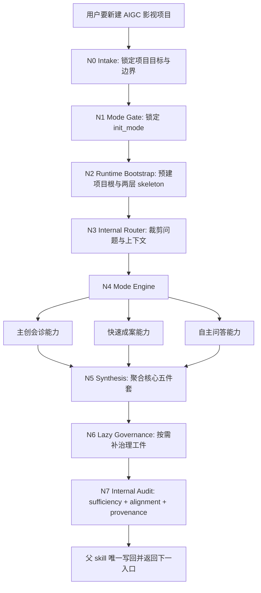
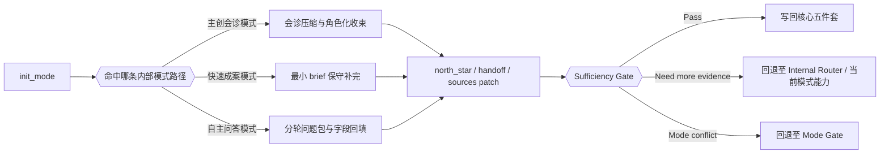
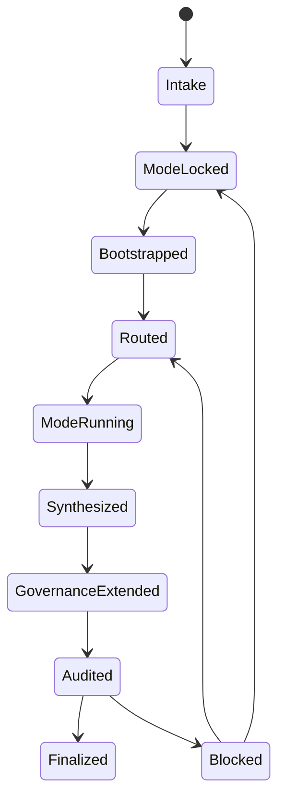
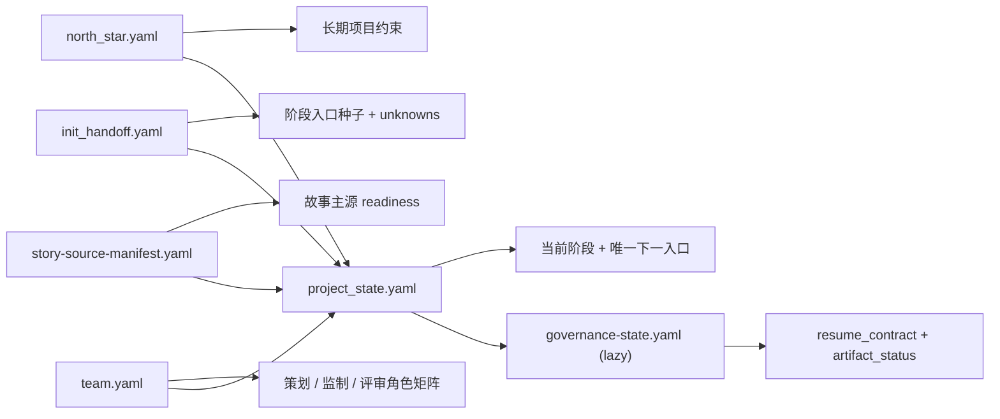

# aigc 0-Init

## 概述

`0-Init` 是 `aigc` 技能树的项目立项层、初始化治理层与 `north_star` 生成入口。

当前合同采用单技能真源模式：

- 所有初始化能力都内收在本 `SKILL.md`
- 模式路由、主创会诊、快速成案、自主问答、充分性审计都属于父 skill 的内部能力面
- 不再依赖任何外置初始组合同作为执行真源
- 最终只允许父 skill 写回 canonical 初始化工件

## When to Use

- 需要新建一个 AIGC 影视创作项目。
- 需要在 `projects/<项目名>/` 下建立 `0-Init/` 与项目根初始化治理工件。
- 需要先锁定项目 `north_star`，再决定进入 `1-Planning`、`2-Global` 或其他后续阶段。
- 用户希望采用多模式初始化，而不是默认单一路径问答。

## When Not to Use

- 项目已经有稳定的 `north_star.yaml`，只是在补某个阶段的局部细节。
- 当前任务本质上是续跑 `1-Planning` 之后的阶段，而不是项目起盘。
- 用户只是在查项目状态，不需要重新初始化。

## 业务需求分析合同

### business_goal

- 先锁定初始化模式，再沿单一路径收集最小充分信息。
- 以 `north_star` 为主产物，而不是堆一批散乱访谈文档。
- 让问题方式按当前 `aigc` 阶段体系组织，输出也按当前 `projects/<项目名>/` 治理落点组织。
- 让模式能力全部成为父 skill 的内部能力，而不是外置规则面。

### business_object

- `projects/<项目名>/0-Init/north_star.yaml`
- `projects/<项目名>/0-Init/init_handoff.yaml`
- `projects/<项目名>/0-Init/story-source-manifest.yaml`
- `projects/<项目名>/team.yaml`
- `projects/<项目名>/project_state.yaml`
- 按需补齐的 `governance-state.yaml` 与 HARNESS 治理载体

### constraint_profile

- 模式必须先锁定，再进入对应模式能力
- 初始化只产长期约束与阶段 seed，不提前拍死下游 canonical 真源
- 创作起盘默认走轻量治理，不强绑整套 HARNESS 载体
- 项目 runtime 目录必须服从 `.agents/skills/aigc/_shared/project-runtime-layout.md`
- 所有模式推理、问题裁剪与充分性检查都必须内收在当前 `SKILL.md`

### success_criteria

- 已明确项目根目录与唯一推荐下一阶段入口
- 已锁定 `init_mode`
- 核心五件套已经落盘
- `north_star`、`init_handoff`、`story-source-manifest`、`team`、`project_state` 之间无双真源冲突
- 若惰性治理工件已生成，其推荐入口与根工件保持一致

### topology_fit

- 主干是固定串行：模式锁定 -> runtime bootstrap -> 路由裁剪 -> 模式执行 -> 聚合 -> 审计 -> 写回
- 分支只发生在 `init_mode` 命中的内部模式路径
- 汇流门固定在父 skill 的 `Sufficiency Gate` 与 `One-Shot Output Contract`

### non_goals

- 不在初始化阶段直接生成 `1-Planning` 之后的业务主稿
- 不允许出现平行的外置初始化规则真源
- 不把初始化写成无边界长问卷或会而不决的会议纪要

## Visual Maps









## Total Input Contract (Mandatory)

父 skill 必须在开始前锁定以下总输入，而不是边做边猜：

1. `global charter context`
   根 `AGENTS.md`、`.agents/skills/aigc/SKILL.md`、本目录 `CONTEXT.md`、`.agents/skills/aigc/_shared/*`
2. `task context`
   当前项目目标、用户偏好、约束、非目标、已知素材与项目名
3. `mode context`
   `init_mode`、`mode_source`、`decision_owner`、`research_policy`
4. `template context`
   `north-star.template.yaml`、`init-handoff.template.yaml`、`team.template.yaml`、`story-source-manifest.template.yaml`
5. `evidence context`
   现有 `projects/<项目名>/` 工件、故事源情况、来源分层、已有治理快照

硬规则：

1. 模式锁定前，允许做合同读取、模板核对与风险诊断；不得起草任何初始化主工件。
2. 内部模式能力只消费当前轮次必需的最小上下文。
3. 已有 shared template / contract 时，优先回指，不复制第二份 schema。

## Internal Capability Fusion Contract (Mandatory)

`0-Init` 不再把路由、三种模式和充分性审计外包给独立 agent 文档；以下能力全部内收为父 skill 的内部能力面：

| 能力面 | 作用 | 典型输出 | 何时触发 |
| --- | --- | --- | --- |
| `internal_router` | 裁剪本轮问题包、上下文包、字段优先级与禁问项 | `route_plan_patch`、`context_packet_plan` | 模式锁定后，进入任一模式前 |
| `advisor_council_engine` | 将多角色顾问意见压缩成可吸收 patch，同时保留共识、分歧与拍板位 | `team_manifest_patch`、`north_star_patch`、`report` | `init_mode == 主创会诊模式` |
| `fast_draft_engine` | 从极简 brief 中保守提取高信息密度 seed | `north_star_patch`、`init_handoff_patch`、`risk_note` | `init_mode == 快速成案模式` |
| `autonomous_qa_engine` | 将初始化缺口组织成分轮问题包并做字段回填 | `question_pack`、`unknowns_patch`、`sources_breakdown_patch` | `init_mode == 自主问答模式` |
| `sufficiency_audit_engine` | 检查充分性、来源分层与下一步一致性 | `audit_report`、`alignment_note`、`blocking_note` | 聚合草案后、写回前 |

硬规则：

1. 这些能力面是当前 `SKILL.md` 的内部节点，不是外置真源。
2. 任何能力面都不得绕过父 skill 直接写 canonical 工件。
3. 未来如新增初始化模式，必须直接扩写本 `SKILL.md` 的模式合同与节点网络，不得再长出平行外置 agent 合同。

## Thinking-Action Node Contract (Mandatory)

每个思行节点至少要定义以下字段：

| slot | 要求 |
| --- | --- |
| `node_id` | 稳定节点标识 |
| `objective` | 该节点要解决的判断/动作目标 |
| `inputs` | 进入该节点的输入与依赖 |
| `actions` | 该节点真正执行的动作 |
| `evidence` | 该节点留下的证据、产物或验证结果 |
| `route_out` | 成功、失败、分支时分别流向何处 |
| `gate` | 是否允许进入最终输出汇流 |

## Topology Contract (Mandatory)

| node_id | objective | inputs | actions | evidence | route_out | gate |
| --- | --- | --- | --- | --- | --- | --- |
| `N0-intake` | 确认这是一次项目初始化而非续跑或局部补档 | 用户请求、项目路径、现有工件 | 识别任务性质、锁定项目名与作用域 | `project_scope_note` | 到 `N1-mode-gate`；若非初始化则回根 `aigc` | 否 |
| `N1-mode-gate` | 锁定唯一 `init_mode` | 用户意图、模式信号、元选项卡 | 判定或发放元选项卡，记录模式元数据 | `mode_lock_note` | 到 `N2-runtime-bootstrap`；模式冲突回自身 | 否 |
| `N2-runtime-bootstrap` | 锁定项目根与 runtime skeleton | 项目名、shared runtime layout | 预建项目根、阶段根目录与 active child skeleton | `runtime_bootstrap_note` | 到 `N3-internal-router` | 否 |
| `N3-internal-router` | 只保留本轮最需要的问题与字段缺口 | 已锁模式、当前缺口、上下文预算 | 产出 `route_plan_patch + context_packet_plan` | `route_plan_patch` | 到 `N4-mode-engine`；若模式未锁回 `N1` | 否 |
| `N4-mode-engine` | 沿唯一模式补齐核心 seed | router packet、模板、用户证据 | 命中 1 个内部模式能力，产生 mode-specific patch | `north_star_patch / init_handoff_patch / note / report` | 到 `N5-synthesis`；若模式越权回 `N1` | 否 |
| `N5-synthesis` | 聚合核心五件套草案 | mode patch、模板、shared contracts | 起草 `team / story-source / north_star / handoff / project_state` | 五件套草案 | 到 `N6-lazy-governance` | 条件通过 |
| `N6-lazy-governance` | 只在触发时补治理工件 | 核心五件套、治理触发条件 | 按需起草 `governance-state` 与 HARNESS carriers | `governance_patch_set` | 到 `N7-internal-audit` | 条件通过 |
| `N7-internal-audit` | 审计充分性、来源、下一步一致性 | 全部草案、审计规则、来源分层 | 执行内部充分性审计并判定可写回/补问/回退 | `audit_report` | Pass 写回；Fail 回 `N3` 或 `N1` | 是 |

### Ordered / Unordered Rules

- `N1 -> N2 -> N3 -> N4 -> N5 -> N6 -> N7` 固定为父 skill 主干。
- `N4-mode-engine` 只允许命中 1 个内部模式路径：
  - `主创会诊模式`
  - `快速成案模式`
  - `自主问答模式`
- `主创会诊模式` 内部若环境允许，可一顾问一线程；若不允许，降级为顺序会诊，但不改变 team 结构。
- 无论当前是固定串行、会诊内并发还是单模式路径，都由父 skill 统一收束；只有显式用户问答或确认节点才前台阻塞。

## Canonical Landing

### Project Root

- `projects/<项目名>/`
- `projects/<项目名>/0-Init/`
- `projects/<项目名>/Story/`
- `projects/<项目名>/1-Planning/`
- `projects/<项目名>/2-Global/`
- `projects/<项目名>/3-Detail/`
- `projects/<项目名>/4-Design/`
- `projects/<项目名>/5-Image/`
- `projects/<项目名>/6-Video/`
- `projects/<项目名>/7-Cut/`

### Bootstrap Runtime Skeleton

初始化阶段默认预建两层目录骨架：

1. 阶段根目录：
   `0-Init / Story / 1-Planning / 2-Global / 3-Detail / 4-Design / 5-Image / 6-Video / 7-Cut`
2. 已建 active 子路径骨架：
   - `projects/<项目名>/1-Planning/1-分集/`
   - `projects/<项目名>/1-Planning/2-剧本/`
   - `projects/<项目名>/1-Planning/3-分组/`
   - `projects/<项目名>/4-Design/场景/1-清单/`
   - `projects/<项目名>/4-Design/场景/2-设计/`
   - `projects/<项目名>/4-Design/场景/3-面板/`
   - `projects/<项目名>/4-Design/角色/1-清单/`
   - `projects/<项目名>/4-Design/角色/2-设计/`
   - `projects/<项目名>/4-Design/角色/3-面板/`
   - `projects/<项目名>/4-Design/服装/1-清单/`
   - `projects/<项目名>/4-Design/服装/2-设计/`
   - `projects/<项目名>/4-Design/服装/3-面板/`
   - `projects/<项目名>/4-Design/道具/1-清单/`
   - `projects/<项目名>/4-Design/道具/2-设计/`
   - `projects/<项目名>/4-Design/道具/3-面板/`
   - `projects/<项目名>/5-Image/分镜故事板/`
   - `projects/<项目名>/5-Image/分镜帧/`
   - `projects/<项目名>/5-Image/漫画/`
   - `projects/<项目名>/6-Video/全能参照/`
   - `projects/<项目名>/6-Video/首帧参照/`
   - `projects/<项目名>/6-Video/生成任务/`

这里的“active 子路径骨架”特指 **项目 runtime 的 canonical landing**，不是技能树中的中间执行目录。

当前最容易误读的是：

- `5-Image`
  - 技能树 active 路径：`1-提示词蒸馏/分镜故事板`、`1-提示词蒸馏/分镜帧`、`1-提示词蒸馏/漫画`
  - runtime 预建路径：`5-Image/分镜故事板/`、`5-Image/分镜帧/`、`5-Image/漫画/`
  - `2-图像生成` 目前不在默认预建列表中，因为共享真源尚未声明其稳定 runtime landing
- `6-Video`
  - 技能树 active 路径：`1-提示词蒸馏/全能参照`、`1-提示词蒸馏/首帧参照`、`2-视频生成`
  - runtime 预建路径：`6-Video/全能参照/`、`6-Video/首帧参照/`、`6-Video/生成任务/`
  - `生成任务/` 是 `2-视频生成` 的业务语义落盘名，不是另一个独立技能

### Primary Artifacts

- 主文件：`projects/<项目名>/0-Init/north_star.yaml`
- 伴生 handoff：`projects/<项目名>/0-Init/init_handoff.yaml`
- 故事源登记：`projects/<项目名>/0-Init/story-source-manifest.yaml`
- runtime 布局真源：`.agents/skills/aigc/_shared/project-runtime-layout.md`
- 故事源合同真源：`.agents/skills/aigc/_shared/story-source-contract.md`

### Project Governance Artifacts

- 顾问团队真源：`projects/<项目名>/team.yaml`
- 轻量项目状态入口：`projects/<项目名>/project_state.yaml`

### Lazy Governance Artifacts

- `projects/<项目名>/governance-state.yaml`
- `projects/<项目名>/mandate.yaml`
- `projects/<项目名>/mission-brief.yaml`
- `projects/<项目名>/route-plan.yaml`
- `projects/<项目名>/preflight-verdict.yaml`
- `projects/<项目名>/validation-report.md`
- `projects/<项目名>/learning-record.md`

## Init Truth Ownership Contract (Mandatory)

### `0-Init` 拥有

- 项目立项合同
- `north_star.yaml`
- `init_handoff.yaml`
- 初始化来源元数据
- 后续阶段入口种子
- 未决问题路由
- 初始化阶段的模式锁定、问题裁剪、模式执行、充分性审计与 writeback 规则

### `0-Init` 首次生成但不独占

- `projects/<项目名>/team.yaml`
- `projects/<项目名>/0-Init/story-source-manifest.yaml`

### `0-Init` 不拥有

- `1-Planning` 的结构规划真源
- `2-Global` 的导演前置全局合同真源
- `3-Detail` 的视觉脚本真源
- `4-Design` 的角色 / 场景 / 道具 / 资产真源
- `5-Image` 的 prompt 包、一致性锚点与图像真源
- `6-Video` 的视频执行包真源
- `7-Cut` 的最终交付真源

## Initialization Mode Contract (Mandatory)

### 单一模式入口总表

| 模式 | 触发条件 | 执行形态 | 是否进入问卷 | 能力落点 | 默认拍板者 |
| --- | --- | --- | --- | --- | --- |
| 主创会诊模式 | 用户点名要多位顾问 / agents / 主创一起参与 | 一次性会诊 + 协调综合 | 否 | 本 `SKILL.md` 内部 `advisor_council_engine` | 用户 |
| 快速成案模式 | 用户明确要“你直接来一版 / 少问 / 快速补全” | 一次性成案 + 确认卡 | 否 | 本 `SKILL.md` 内部 `fast_draft_engine` | 助手先拟，用户终审 |
| 自主问答模式 | 用户希望自己逐轮回答 | 分波次问答 + 结构化回填 | 是 | 本 `SKILL.md` 内部 `autonomous_qa_engine` | 用户 |

### 单一元选项选择规则

1. 若用户明确指定 `.codex/agents/**/*.md` 作为顾问素材，则强制进入 `主创会诊模式`。
2. 若用户表达“你直接补完 / 少问点 / 快速给一版”，进入 `快速成案模式`。
3. 其余情况的默认前台建议是 `自主问答模式`，但这只是初始化元选项卡的默认展示项，不等于自动锁定。
4. 若用户未显式选择，且输入也未触发强制路由信号，必须先展示初始化元选项卡并等待确认；不得把“推荐模式”直接写成 `mode_lock_note`。
5. 一旦模式锁定，只允许命中 1 个模式路径；不得混跑多个模式主路径。
6. `主创会诊模式` 与 `快速成案模式` 禁止回退成长问卷；最多允许 1 张阻塞/裁决卡。

### 模式锁定闸门

1. 若用户尚未明确选择模式，且输入也未触发强制路由信号，必须先展示“初始化元选项卡”。
2. 仅有项目名、片名、题眼、单句概念或极简 brief，不足以自动视为用户已选择 `快速成案模式`。
3. 允许给出模式推荐，但推荐必须显式标注为 `pending_recommendation`，不得越权写成已锁定模式，更不得推进到 `N2-runtime-bootstrap` 之后的起草节点。
4. 模式锁定前，允许做合同读取、模板核对与风险诊断；不得起草任何初始化主工件。
5. 若会话在模式锁定前被打断，恢复时第一动作仍应是补发“初始化元选项卡”。

### 初始化元选项卡（唯一合法展示位）

```markdown
初始化元选项卡

1. 本次初始化方式
A. 主创会诊模式
B. 快速成案模式
C. 自主问答模式（默认）

2. 如果选 A，顾问配置方式
A. 同一套顾问团贯穿三个角色
B. 按角色分别指定

3. 如果选 A，你可提供顾问路径（可多个）
示例：`.codex/agents/学院派/北京电影学院.md`

4. 如果选 B，是否允许按需联网校准概念或行业信息
A. 允许
B. 不允许

5. 最终拍板方式
A. 仍由我拍板
B. 你先综合，我只做最后确认
```

## Team Manifest Contract (`team.yaml`，Mandatory)

`team.yaml` 是项目根下的顾问团布阵唯一真源：

- `projects/<项目名>/team.yaml`

它负责把“谁参与初始化会诊”升级为“谁以什么职责作用于哪些阶段、在哪个闸门发言、最终如何被后续阶段消费”。

### 角色默认作用矩阵

| 角色 | 默认作用阶段 | 作用方式 |
| --- | --- | --- |
| `策划` | `1-Planning`、`4-Design` | 提供结构方向、对象池方向、种子裁剪建议 |
| `监制` | `2-Global`、`3-Detail` | 控制导演表达与脚本执行的一致性、可拍性、资源感 |
| `评审` | `1-Planning`、`2-Global`、`3-Detail`、`4-Design` 的最终验收闸门 | 只在阶段终稿或阶段级 `validation-report` 前后介入 |

## Question Framing Contract (Mandatory)

初始化问题方式必须围绕当前 `aigc` 阶段体系，而不是沿用网文问卷字段。

至少覆盖：

1. 项目名 / 工作名
2. 交付形态：短片、PV、预告、概念片、长片、剧集片段等
3. 核心故事核或情绪核
4. 目标受众 / 平台 / 使用场景
5. 风格参照与审美禁区
6. 制作约束：时长、资源、质量档位、工具链、时效
7. 当前最想优先推进的阶段
8. 必须保留的 IP 边界 / 内容边界

硬规则：

1. 只问当前最阻塞 `north_star` 或阶段入口种子的缺口。
2. 若问题更适合下游阶段收敛，直接写入 `unknowns`，不得硬问到底。
3. 问题必须服务当前技能包系列：`1-Planning -> 3-Detail -> 4-Design -> 5-Image -> 6-Video -> 7-Cut`。

## North Star Contract (Mandatory)

起草 `north_star.yaml` 时必须读取：

- `.agents/skills/aigc/0-Init/templates/north-star.template.yaml`
- `.agents/skills/aigc/0-Init/templates/init-handoff.template.yaml`
- `.agents/skills/aigc/_shared/council-runtime/team.template.yaml`
- `.agents/skills/aigc/_shared/project-runtime-layout.md`

硬规则：

1. `north_star.yaml` 只承接长期有效、不应轻易漂移的项目总约束。
2. `init_handoff.yaml` 承接阶段入口种子、来源分层和未决问题。
3. 只在当前初始化会话有意义的信息，不应写进 `north_star.yaml`。

## Adaptation & Pacing Seed Contract (Mandatory)

`0-Init` 必须显式决定“当前项目是否强调原作遵循，以及是否允许节奏级重排”。

硬规则：

1. `original_adherence` 为布尔字段。
2. 若用户未强调“贴原作 / 保原顺序 / 不改结构”，默认落盘 `original_adherence: false`。
3. `reorder_authorization` 必须给出动作口径。
4. `north_star.yaml` 只保留长期适配政策；`init_handoff.yaml` 承接本轮可执行节奏 seeds。

## Lazy Governance Contract (Mandatory)

### 核心必出工件

- `projects/<项目名>/0-Init/north_star.yaml`
- `projects/<项目名>/0-Init/init_handoff.yaml`
- `projects/<项目名>/0-Init/story-source-manifest.yaml`
- `projects/<项目名>/team.yaml`
- `projects/<项目名>/project_state.yaml`

### 惰性治理工件

- `projects/<项目名>/governance-state.yaml`
- `projects/<项目名>/mandate.yaml`
- `projects/<项目名>/mission-brief.yaml`
- `projects/<项目名>/route-plan.yaml`
- `projects/<项目名>/preflight-verdict.yaml`
- `projects/<项目名>/validation-report.md`
- `projects/<项目名>/learning-record.md`

触发条件：

1. 用户显式要求治理、审计、续跑、复核或复盘。
2. 任务即将进入复杂多步执行，需要 `mission-brief / route-plan` 承接。
3. 任务属于高风险执行，需要 `preflight-verdict.yaml`。
4. `query / resume / review` 需要结构化断点或验收桥接。

## Story Source Manifest Contract (`story-source-manifest.yaml`，Mandatory)

`story-source-manifest.yaml` 是“项目故事主源是否已真正到位”的唯一登记真源：

- `projects/<项目名>/0-Init/story-source-manifest.yaml`

硬规则：

1. 无论当前是否已拿到小说原文/剧本原文，`0-Init` 都必须生成 `story-source-manifest.yaml`。
2. 只有 `primary_story_source` 才能决定正式进入条件；其他材料只能登记为 `development_briefs`。
3. 若 `primary_story_source.status != ready`，必须显式写出 `blocking_reason` 与 `required_user_action`。
4. 若主故事源只覆盖部分正文，必须显式区分“可增量规划”与“不可正式完成整季切分”。

## Story Source Completeness Gate (Mandatory)

`0-Init` 不要求“必须先有故事源才能初始化项目”，但必须区分两种初始化态：

1. `source-light bootstrap`
   - 条件：`primary_story_source.status != ready`
   - 允许：创建 runtime skeleton、`team.yaml`、`story-source-manifest.yaml`、轻量 `project_state.yaml`，以及只包含题材级/边界级约束的 `north_star.yaml`
   - 禁止：把具体剧情事件、人物关系、冲突机制、单集 key beats、场景池、对象池或世界规则细节写成既定事实
2. `source-grounded bootstrap`
   - 条件：已拿到实际主故事源正文，或至少拿到可覆盖当前规划范围的正式梗概
   - 允许：在 `init_handoff.yaml` 中生成与当前 coverage 对齐的 story-facing seeds，并将其标记为来自故事源

硬规则：

1. 当 `primary_story_source.status != ready` 时，`north_star.yaml` 只能写题材、气质、受众、制作边界与长期约束，不得发明剧情断言。
2. 当 `primary_story_source.status != ready` 时，`init_handoff.yaml` 的 story-facing 区块必须降级为 `unknowns / deferred_to_* / risk_notes`，而不是伪装成已验证 seeds。
3. 快速成案模式在缺故事源时，最多只能产出“概念级 seed”，不得把助手推断的剧情细节写成后续阶段默认输入。
4. 若用户明确要求“先别卡我，先起盘”，允许走 `source-light bootstrap`；但下一步动作必须显式包含补故事源或补正式梗概。

## Story Source Reconciliation Contract (Mandatory)

如果项目已在缺故事源状态下完成初始化，而后续又补入真实故事源，则必须先执行一次回刷对齐，再继续依赖这些初始化工件进入下游阶段。

回刷范围至少包括：

- `projects/<项目名>/0-Init/north_star.yaml`
- `projects/<项目名>/0-Init/init_handoff.yaml`
- `projects/<项目名>/project_state.yaml`

硬规则：

1. 后补故事源一旦进入 `Story/` 并登记到 manifest，所有 `assistant_inferred` 的剧情级字段都必须接受回刷。
2. 回刷优先级固定为：`story source user truth > user explicit confirmation > council_advised > assistant_inferred`。
3. 若旧的 `north_star / init_handoff` 含有与故事源冲突的剧情断言，必须先修这些工件，再进入 `1-Planning`、`2-Global` 或更下游阶段。
4. `project_state.yaml` 必须同步更新为当前真实 readiness，不得保留“故事源缺失”时期的过期入口建议。
5. 回刷动作属于源层维护，不应要求用户手工逐个改文件。

## Synthesis Contract (Mandatory)

1. 父 skill 只吸收本轮命中的 `route_plan_patch`、模式 patch 与 `audit_report`。
2. 未命中的模式路径不得补空字段或占位输出。
3. 写回前必须做统一来源分层：
   - `user_confirmed`
   - `council_advised`
   - `assistant_inferred`
4. 必须把 `team_ref`、`sources_breakdown` 与唯一下一阶段入口同步写回到相关工件。
5. 若当前处于 `source-light bootstrap`，所有剧情级推断必须降级为 provisional note，不得提升为稳定 seed。
6. 若检测到“旧 seed 与新故事源冲突”，先进入 `Story Source Reconciliation Contract`，再做最终写回。

## Sufficiency Gate (Mandatory)

未过充分性闸门，不得宣布初始化完成。

最小充分条件：

- 已确定项目名与项目根目录
- 已锁定 `init_mode`
- `team.yaml` 已生成
- `north_star.yaml` 已具备最小核心字段
- `init_handoff.yaml` 已具备阶段入口种子与 `unknowns`
- `story-source-manifest.yaml` 已生成并标明 readiness
- `project_state.yaml` 已能指向主工件与推荐下一阶段
- 若故事源缺失，所有剧情级字段都已降级为 `unknowns / deferred / risk_notes`
- 若故事源为后补输入，已完成一次初始化工件回刷
- 若 `north_star.stage_entry_contract.stage_priority_order` 已存在，`project_state.yaml` 的下一步建议必须对齐
- 若惰性治理工件已生成，它们与 `project_state.yaml` 的下一步建议也必须对齐
- 已返回唯一推荐下一阶段入口

## One-Shot Output Contract (Mandatory)

最终只允许输出一次已收束的初始化结论，而不是并列抛出多个半成品。

最终输出至少应包含：

- 本轮锁定的 `init_mode`
- 核心五件套是否已齐
- 是否补了惰性治理工件
- 唯一推荐的下一阶段入口
- 闭环三元组：
  - `root cause location`
  - `immediate fix`
  - `systemic prevention fix`

## Execution Procedure

1. 确认或创建 `projects/<项目名>/`。
2. 读取根 `.agents/skills/aigc/SKILL.md`、本目录 `CONTEXT.md` 与 `.agents/skills/aigc/_shared/*`。
3. 若用户输入尚未触发强制路由信号，发送一次初始化元选项卡并等待确认；只有收到用户选择或命中强制路由信号后才能锁定模式。未锁定前不得起草初始化主工件。
4. 按 `.agents/skills/aigc/_shared/project-runtime-layout.md` 预建项目根、阶段根目录与 active child skeleton。
5. 运行内部 `internal_router`，组装 `mission_brief_init`、`context_packet_plan` 与 `route_plan_patch`。
6. 只命中 1 个内部模式能力：
   - `advisor_council_engine`
   - `fast_draft_engine`
   - `autonomous_qa_engine`
7. 读取模板与 shared contracts。
8. 起草项目根 `team.yaml`。
9. 生成 `story-source-manifest.yaml`。
10. 根据 manifest 进入 `source-light bootstrap` 或 `source-grounded bootstrap`，聚合模式 patch，起草 `north_star.yaml`、`init_handoff.yaml` 与 `project_state.yaml`。
11. 若检测到“后补故事源”，先执行 `Story Source Reconciliation Contract`，再继续写回。
12. 若命中治理触发条件，再补 `governance-state.yaml`、`mandate.yaml`、`mission-brief.yaml`、`route-plan.yaml`、`preflight-verdict.yaml`、`validation-report.md` 与 `learning-record.md`。
13. 运行内部 `sufficiency_audit_engine` 对 sufficiency、alignment、trace 做统一检查。
14. 若通过审计，则落盘核心工件并返回唯一推荐阶段入口；若不通过，优先回退到 `N3` 或 `N1`。

## Completion Standard

- 已明确项目根目录
- 已明确初始化模式
- 已产出 `projects/<项目名>/team.yaml`
- 已产出 `projects/<项目名>/project_state.yaml`
- 已产出 `projects/<项目名>/0-Init/story-source-manifest.yaml`
- 已产出 `north_star.yaml`
- 已产出 `init_handoff.yaml`
- 已给出唯一推荐的下一阶段入口
- 若本轮触发治理需求，相关惰性治理工件已补齐
- 已返回闭环三元组：
  - `root cause location`
  - `immediate fix`
  - `systemic prevention fix`

## Root-Cause Execution Contract (Mandatory)

当 `0-Init` 出现模式路由错误、问题越权、落盘漂移、主文件与 handoff 分工不清、项目根治理工件缺失等问题时，必须按下列链路上溯：

`Symptom -> Direct Technical Cause -> Rule Source -> Meta Rule Source -> Fix Landing Points`

优先检查：

- `Rule Source`
  - `.agents/skills/aigc/0-Init/SKILL.md`
  - `.agents/skills/aigc/0-Init/CONTEXT.md`
  - `.agents/skills/aigc/0-Init/templates/north-star.template.yaml`
  - `.agents/skills/aigc/0-Init/templates/init-handoff.template.yaml`
  - `.agents/skills/aigc/_shared/project-runtime-layout.md`
  - `.agents/skills/aigc/_shared/story-source-contract.md`
  - `scripts/aigc_skill_audit.py`
- `Meta Rule Source`
  - 根 `AGENTS.md`
  - `.agents/skills/aigc/SKILL.md`
  - `.codex/registry/routes.yaml`

硬规则：

1. 先修父 `SKILL.md` 的 topology / mode contract / audit gate，再修本次输出。
2. 若没有更高一层治理合同，必须明确说明 trace 停在 `Rule Source`。
3. 若未来新增初始化模式，必须直接扩写当前 `SKILL.md`，不得恢复外置初始组 agent 合同。

## Field Master

| field_id | 输出位置/字段 | 内容要求 | 默认责任 Node | 质量维度 | 失败码 |
| --- | --- | --- | --- | --- | --- |
| FIELD-INIT-01 | `north_star.yaml` | 锁定长期不应漂移的项目总约束，含 `adaptation_strategy` | N5 | north star 稳定性 | FAIL-INIT-01 |
| FIELD-INIT-02 | `init_handoff.yaml` | 提供阶段入口种子与 `unknowns` | N5 | handoff 清晰度 | FAIL-INIT-02 |
| FIELD-INIT-03 | 模式元数据与来源分层 | `init_mode / mode_source / team_ref / sources_breakdown` 可追溯 | N1 / N3 | provenance 完整性 | FAIL-INIT-03 |
| FIELD-INIT-04 | `projects/<项目名>/team.yaml` | 顾问团队角色、作用阶段与最终闸门明确 | N5 | 团队治理清晰度 | FAIL-INIT-04 |
| FIELD-INIT-05 | `projects/<项目名>/*.yaml|*.md` | 核心初始化工件与项目状态入口齐全；惰性治理工件按触发条件补齐 | N2 / N5 / N6 | 落盘规范性 | FAIL-INIT-05 |
| FIELD-INIT-06 | 下一阶段建议 | 只推荐一个当前主入口阶段 | N7 | 路由确定性 | FAIL-INIT-06 |
| FIELD-INIT-07 | 内部模式拓扑与审计门 | 路由、三种模式、充分性审计都内收到父 skill | N3 / N4 / N7 | 治理可执行性 | FAIL-INIT-07 |

## Thought Pass Map

| step_id | 聚焦字段 | 核心问题 | 生成动作 | 未达标信号 |
| --- | --- | --- | --- | --- |
| N1 | FIELD-INIT-03 | 模式是否已锁定且来源可追溯 | 记录 `init_mode / mode_source / decision_owner / research_policy` | 模式未锁就开始起草主工件 |
| N2 | FIELD-INIT-05 | 项目根与 skeleton 是否已按 shared truth 预建 | 建目录骨架并锁定 canonical landing | runtime 路径漂移或沿用旧口径 |
| N3 | FIELD-INIT-03 / FIELD-INIT-07 | 当前该走哪条模式路径，问题预算如何裁剪 | 产出 `route_plan_patch + context_packet_plan` | 路由能力散在外部真源或上下文过噪 |
| N4 | FIELD-INIT-01 / FIELD-INIT-02 | 哪些模式内补料足以形成可吸收 patch | 产出 mode-specific patch / note / report | patch 变成平行主稿或越权结论 |
| N5 | FIELD-INIT-01 / FIELD-INIT-02 / FIELD-INIT-04 / FIELD-INIT-05 | 核心五件套如何分工写回 | 聚合 `team / story-source / north_star / handoff / project_state` | `north_star` 与 handoff 混层，team 不成角色真源 |
| N6 | FIELD-INIT-05 | 是否需要补惰性治理工件 | 按触发条件补 `governance-state` 与 HARNESS carriers | 轻量起盘被全量治理阻塞或深治理需求未承接 |
| N7 | FIELD-INIT-06 / FIELD-INIT-07 | 是否已满足充分性与下一步一致性 | 审计、对齐、给唯一推荐入口 | 多入口冲突、来源不明、模式能力外置漂移 |

## Pass Table

| field_id | Pass Standard | Fail Code | Rework Entry |
| --- | --- | --- | --- |
| FIELD-INIT-01 | `north_star.yaml` 只承接长期总约束，结构完整 | FAIL-INIT-01 | N4 / N5 |
| FIELD-INIT-02 | `init_handoff.yaml` 已含种子、`unknowns`、`sources` | FAIL-INIT-02 | N4 / N5 |
| FIELD-INIT-03 | 模式来源、字段来源与 `team_ref` 均可追溯 | FAIL-INIT-03 | N1 / N3 |
| FIELD-INIT-04 | 项目根 `team.yaml` 已明确三角色成员、作用阶段与评审最终闸门 | FAIL-INIT-04 | N5 |
| FIELD-INIT-05 | `0-Init/` 与项目根工件齐全且路径正确；惰性治理按需补齐 | FAIL-INIT-05 | N2 / N5 / N6 |
| FIELD-INIT-06 | 只返回一个当前主入口阶段 | FAIL-INIT-06 | N7 |
| FIELD-INIT-07 | 路由、三种模式与充分性审计均内收到父 skill | FAIL-INIT-07 | N3 / N4 / N7 |

## Context Preload (Mandatory)

- 每次调用本技能时，必须自动加载同目录 `CONTEXT.md`。
- 冲突优先级固定为：用户显式请求 > `AGENTS.md` / 元规则 > 本 `SKILL.md` > `CONTEXT.md`。
- 失败闭环与成功闭环都必须回写 `CONTEXT.md`。
