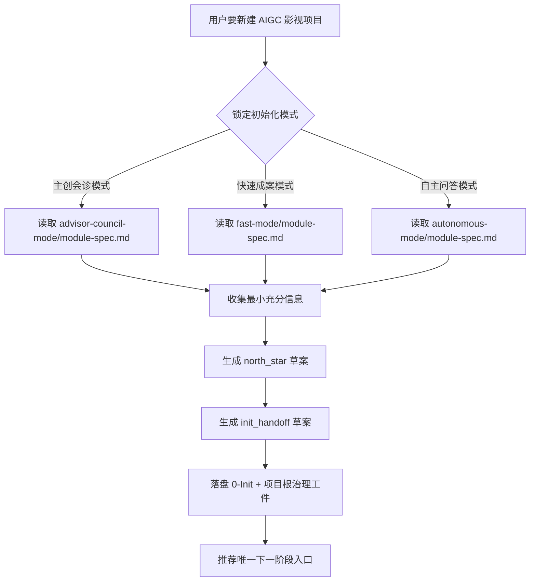
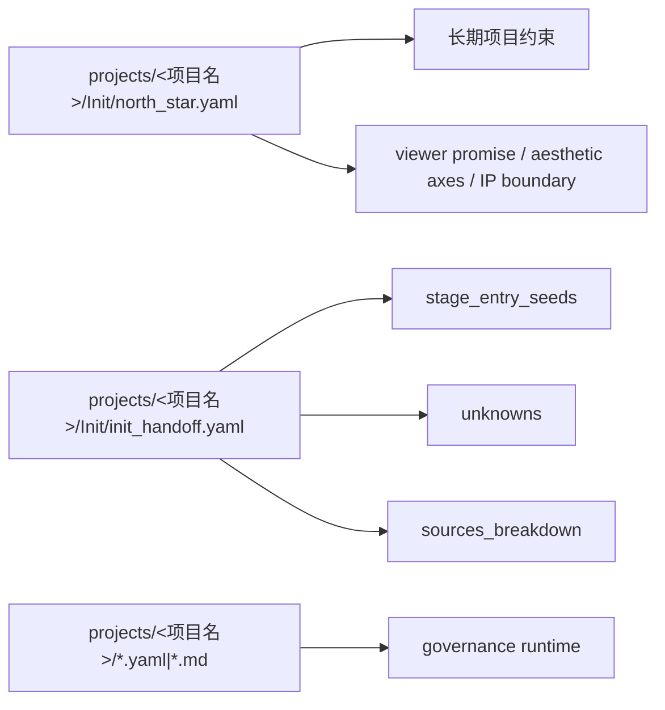

# aigc 0-Init

## 概述

`0-Init` 是 `aigc` 技能树的项目立项层、初始化治理层与 `north_star` 生成入口。

它不替代 `1-规划`、`2-组间`、`3-明细`、`4-主体`、`5-画面`、`6-视频`、`7-后期` 的阶段真源，而是负责把“这个影视项目到底要做什么、给谁看、长期不应漂移的约束是什么、当前应该先把哪些种子交给哪个阶段”收束到一个稳定起点。

当前阶段以合同执行为主，允许按模板手工落盘；后续如补脚本入口，必须服从本合同，而不是另起一套 schema。

## When to Use

- 需要新建一个 AIGC 影视创作项目。
- 需要在 `projects/<项目名>/` 下建立 `0-Init` 与项目根初始治理工件。
- 需要先锁定项目 `north_star`，再决定进入 `1-规划`、`2-组间` 或其他后续阶段。
- 用户希望采用多模式初始化，而不是默认单一路径问答。

## When Not to Use

- 项目已经有稳定的 `north_star.yaml`，只是在补某个阶段的局部细节。
- 当前任务本质上是续跑 `1-规划` 之后的阶段，而不是项目起盘。
- 用户只是在查项目状态，不需要重新初始化。

## 目标

- 先锁定初始化模式，再沿单一路径收集足够信息。
- 以 `north_star` 为主产物，而不是堆一批散乱访谈文档。
- 让问题方式按当前 `aigc` 阶段体系组织，输出也按当前 `projects/<项目名>/` 治理落点组织。
- 为后续阶段提供“足够开工”的入口种子，而不是越权替下游阶段做 canonical 裁决。

## Visual Maps





## Canonical Landing

### Project Root

- `projects/<项目名>/`
- `projects/<项目名>/Init/`
- `projects/<项目名>/1-规划/`
- `projects/<项目名>/编导/`
- `projects/<项目名>/4-主体/`
- `projects/<项目名>/5-画面/`
- `projects/<项目名>/视频/`
- `projects/<项目名>/后期/`

### Primary Artifacts

- 主文件：`projects/<项目名>/Init/north_star.yaml`
- 伴生 handoff：`projects/<项目名>/Init/init_handoff.yaml`
- 访谈摘要：`projects/<项目名>/Init/interview_summary.md`
- 确认卡：`projects/<项目名>/Init/confirmation_card.md`
- runtime 布局真源：`.agents/skills/aigc/_shared/project-runtime-layout.md`

### Project Governance Artifacts

- 顾问团队真源：`projects/<项目名>/team.yaml`

### Runtime Artifacts

- `projects/<项目名>/project_state.yaml`
- `projects/<项目名>/mandate.yaml`
- `projects/<项目名>/mission-brief.yaml`
- `projects/<项目名>/route-plan.yaml`
- `projects/<项目名>/preflight-verdict.yaml`
- `projects/<项目名>/validation-report.md`
- `projects/<项目名>/learning-record.md`

## Init Truth Ownership Contract (Mandatory)

### `0-Init` 拥有

- 项目立项合同
- `north_star.yaml`
- `init_handoff.yaml`
- 初始化来源元数据
- 后续阶段入口种子
- 未决问题路由

### `0-Init` 首次生成但不独占

- `projects/<项目名>/team.yaml`

说明：

1. `team.yaml` 的首次生成责任在 `0-Init`。
2. 但它的长期真源归属是项目级治理工件，不是 `Init/` 私有阶段资产。
3. `1-规划 / 2-组间 / 3-明细 / 4-主体` 后续都应直接读取项目根 `team.yaml`。

### `0-Init` 不拥有

- `1-规划` 的结构规划真源
- `2-组间` 的导演意图与风格 bible 真源
- `3-明细` 的视觉脚本真源
- `4-主体` 的角色 / 场景 / 道具 / 资产真源
- `5-画面` 的 prompt 包、一致性锚点与图像真源
- `6-视频` 的视频执行包真源
- `7-后期` 的最终交付真源

### Stage Seed Ownership

| 下游阶段 | `0-Init` 允许提供什么 | `0-Init` 不得提前拍死什么 |
| --- | --- | --- |
| `1-规划` | 片型、规模、时长带、受众、阶段优先级、叙事范围种子、`original_adherence`、重排授权种子 | 详细章节/场次/集数结构 |
| `2-组间` | 审美方向、导演参照、情绪曲线与观看方式种子 | 完整导演阐述、节奏蓝图与镜头原则真源 |
| `3-明细` | 关键桥段、叙事核、人物关系高层约束 | 完整视觉脚本与镜头拆写 |
| `4-主体` | 角色/场景/道具候选池与长期约束 | 具体主体卡、设定面板与物料真源 |
| `5-画面` | 镜头语气、表现级别、运动偏好与画面风格种子 | prompt 包、一致性锚点与图像真源 |
| `6-视频` | 质量档位、生成策略、模型路线种子 | 最终视频任务编排与执行 ledger |
| `7-后期` | 音乐/字幕/节奏/包装倾向种子 | 最终成片组织与交付规范 |

## North Star Contract (Mandatory)

`north_star.yaml` 是初始化主文件，也是 `0-Init` 的主要输出物。

起草时必须读取：

- `templates/north-star.template.yaml`
- `templates/init-handoff.template.yaml`
- `.agents/skills/aigc/_shared/council-runtime/team.template.yaml`
- `.agents/skills/aigc/_shared/project-runtime-layout.md`

硬规则：

1. `north_star.yaml` 只承接长期有效、不应轻易漂移的项目总约束。
2. `init_handoff.yaml` 承接阶段入口种子、来源分层和未决问题，不把整轮对话原样倒进去。
3. 若某信息只在当前初始化会话有意义，不应写进 `north_star.yaml`，而应进入 `interview_summary.md` 或 `project_state.yaml`。
4. 初始化可一次性预建 `Init / 1-规划 / 编导 / 4-主体 / 5-画面 / 视频 / 后期` 七个 runtime 根目录。

## Initialization Mode Contract (Mandatory)

### 单一模式入口总表

| 模式 | 触发条件 | 执行形态 | 是否进入问卷 | 模块真源 | 默认拍板者 |
| --- | --- | --- | --- | --- | --- |
| 主创会诊模式 | 用户点名要多位顾问 / agents / 主创一起参与 | 一次性会诊 + 协调综合 | 否 | `references/advisor-council-mode/module-spec.md` | 用户 |
| 快速成案模式 | 用户明确要“你直接来一版 / 少问 / 快速补全” | 一次性成案 + 确认卡 | 否 | `references/fast-mode/module-spec.md` | 助手先拟，用户终审 |
| 自主问答模式 | 用户希望自己逐轮回答 | 分波次问答 + 结构化回填 | 是 | `references/autonomous-mode/module-spec.md` | 用户 |

### 单一元选项选择规则

1. 若用户明确指定 `.codex/agents/**/*.md` 作为顾问，则强制进入 `主创会诊模式`。
2. 若用户表达“你直接补完 / 少问点 / 快速给一版”，进入 `快速成案模式`。
3. 其余情况默认进入 `自主问答模式`。
4. 一旦模式锁定，只加载该模式对应的 `module-spec.md` 作为主执行真源。
5. `主创会诊模式` 与 `快速成案模式` 禁止回退成长问卷；最多允许 1 张阻塞/裁决卡。
6. 模式元选项卡只能在本节出现一次，其他章节不得重写。

### 初始化元选项卡（唯一合法展示位）

```markdown
初始化元选项卡

1. 本次初始化方式
A. 主创会诊模式
B. 快速成案模式
C. 自主问答模式（默认）

2. 如果选 A，顾问配置方式
A. 同一套顾问团贯穿三个角色
B. 按角色分别指定

3. 如果选 A，你可提供顾问路径（可多个）
示例：`.codex/agents/学院派/北京电影学院.md`

4. 如果选 B，请按角色给顾问路径（可为空）
- 策划
- 监制
- 评审

5. 如果选 B，是否允许按需联网校准概念或行业信息
A. 允许
B. 不允许

6. 最终拍板方式
A. 仍由我拍板
B. 你先综合，我只做最后确认
```

### 模式元数据记录 Contract

模式锁定后，必须记录：

- `init_mode`
- `mode_source`
- `team_enabled`
- `team_ref`
- `team_setup.team_mode`
- `team_setup.shared_agents`
- `team_setup.roles.planning.members`
- `team_setup.roles.supervision.members`
- `team_setup.roles.review.members`
- `research_policy`
- `decision_owner`
- `sources_breakdown.user_confirmed`
- `sources_breakdown.council_advised`
- `sources_breakdown.assistant_inferred`

## Team Manifest Contract (`team.yaml`，Mandatory)

`team.yaml` 是项目根下的顾问团布阵唯一真源：

- `projects/<项目名>/team.yaml`

它负责把“谁参与初始化会诊”升级为“谁以什么职责作用于哪些阶段、在哪个闸门发言、最终如何被后续阶段消费”。

### `team.yaml` 必须承接

- `enabled`
- `team_setup.team_mode`
- `team_setup.shared_agents`
- `roles.planning`
- `roles.supervision`
- `roles.review`
- `decision_policy`
- `fallback_policy`

### 角色默认作用矩阵

| 角色 | 默认作用阶段 | 作用方式 | 真源引用 |
| --- | --- | --- | --- |
| `策划` | `1-规划`、`4-主体` | 提供结构方向、对象池方向、种子裁剪建议 | `.agents/skills/aigc/1-规划/SKILL.md`、`.agents/skills/aigc/4-主体/SKILL.md` |
| `监制` | `2-组间`、`3-明细` | 控制导演表达与脚本执行的一致性、可拍性、资源感 | `.agents/skills/aigc/2-组间/SKILL.md`、`.agents/skills/aigc/3-明细/SKILL.md` |
| `评审` | `1-规划`、`2-组间`、`3-明细`、`4-主体` 的最终验收闸门 | 只在阶段终稿或阶段级 `validation-report` 前后介入，负责 PASS/返工意见 | `.agents/skills/aigc/1-规划/SKILL.md`、`.agents/skills/aigc/2-组间/SKILL.md`、`.agents/skills/aigc/3-明细/SKILL.md`、`.agents/skills/aigc/4-主体/SKILL.md` |

### 硬规则

1. `team.yaml` 是顾问角色布阵的真源；`init_handoff.yaml` 只允许用 `team_ref` 回指，不得再静默复制完整团队 schema。
2. `team.yaml` 必须落在项目根，而不是 `0-Init/` 子目录。
3. 若用户选择“同一套顾问团贯穿三个角色”，必须把同一批 `shared_agents` 展开映射到 `策划 / 监制 / 评审` 三个角色，而不是只写一个平铺列表。
4. `评审` 不是前置策划角色，默认只作用于对应阶段的最终验收闸门：
   - `projects/<项目名>/1-规划/validation-report.md`
   - `projects/<项目名>/编导/validation-report.md`（适用于 `2-组间 / 3-明细`）
   - `projects/<项目名>/4-主体/validation-report.md`
5. 如果当前环境无法真实并发 subagents，也必须保留三角色结构，只把执行方式降级为顺序会诊。
6. 无论当前初始化模式是否启用顾问团，都应落盘 `projects/<项目名>/team.yaml`：
   - 启用顾问团时：`enabled: true`
   - 未启用或成员为空时：`enabled: false`

## Question Framing Contract (Mandatory)

初始化问题方式必须围绕当前 `aigc` 阶段体系，而不是沿用网文问卷字段。

### 核心合同卡（所有模式都要收集）

至少覆盖：

1. 项目名 / 工作名
2. 交付形态：短片、PV、预告、概念片、长片、剧集片段等
3. 核心故事核或情绪核
4. 目标受众 / 平台 /使用场景
5. 风格参照与审美禁区
6. 制作约束：时长、资源、质量档位、工具链、时效
7. 当前最想优先推进的阶段
8. 必须保留的 IP 边界 / 内容边界

### 条件模块卡（按缺口加载）

- `规划模块`
  - 结构规模、段落粒度、时长带、叙事范围
- `编导模块`
  - 导演参照、节奏、情绪波形、镜头语法偏好、`original_adherence`、重排授权
- `主体模块`
  - 角色、场景、道具、世界元素候选池
- `视频/后期模块`
  - 生成质量、视频路线、音乐/字幕/包装偏好

硬规则：

1. 只问当前最阻塞 `north_star` 或阶段入口种子的缺口。
2. 若问题更适合下游阶段收敛，直接写入 `unknowns`，不得硬问到底。
3. 问题必须服务当前技能包系列：`规划 -> 编导 -> 脚本 -> 主体 -> 分镜 -> 视频 -> 后期`。

## Adaptation & Pacing Seed Contract (Mandatory)

`0-Init` 必须显式决定“当前项目是否强调原作遵循，以及是否允许节奏级重排”。

### 长期字段真源

- `projects/<项目名>/Init/north_star.yaml`
  - `adaptation_strategy.original_adherence`
  - `adaptation_strategy.reorder_authorization`
  - `adaptation_strategy.pacing_intent`
  - `adaptation_strategy.pacing_non_goals`
  - `adaptation_strategy.peak_preferences`

### 阶段入口种子真源

- `projects/<项目名>/Init/init_handoff.yaml`
  - `stage_entry_seeds.directing_seed.original_adherence`
  - `stage_entry_seeds.directing_seed.reorder_authorization`
  - `stage_entry_seeds.directing_seed.pacing_preferences`
  - `stage_entry_seeds.directing_seed.pacing_focus`
  - `stage_entry_seeds.directing_seed.pacing_skip_reason`

### 硬规则

1. `original_adherence` 为布尔字段：
   - `true`：默认不进入 `1-规划/4-节奏`，分组后只保留原作节奏理解与最小 handoff。
   - `false`：允许 `1-规划/4-节奏` 基于分组容器做主驱动、峰值与节奏蓝图裁决。
2. 若用户未强调“贴原作 / 保原顺序 / 不改结构”，默认落盘 `original_adherence: false`，禁止把该决策留在口头层。
3. `reorder_authorization` 必须补一句动作口径，例如：
   - `preserve_sequence_only`
   - `allow_episode_recut`
   - `allow_local_reorder_only`
4. `north_star.yaml` 只保留长期适配政策；`init_handoff.yaml` 承接本轮对 `2-组间` 与 `3-明细` 的可执行节奏 seeds。
5. 若当前只知道“原作遵循=true”，但还不知道具体节奏偏好，依旧要先落布尔门，再把其余问题留进 `unknowns`。

## Advisor Council Contract (主创会诊模式，Mandatory)

1. 顾问来源默认是 `.codex/agents/**/*.md`。
2. 锁定本模式后，不进入完整问卷，只允许最终确认卡，必要时加 1 张裁决卡。
3. 顾问配置必须落到项目根 `team.yaml`，并以 `team_setup.team_mode` 记录是：
   - `same_lineup`
   - `per_role`
4. `same_lineup` 模式下，`shared_agents` 要同时映射到：
   - `roles.planning.members`
   - `roles.supervision.members`
   - `roles.review.members`
5. `per_role` 模式下，角色默认作用矩阵固定为：
   - `策划 -> 1-规划 / 4-主体`
   - `监制 -> 2-组间 / 3-明细`
   - `评审 -> 1-规划 / 2-组间 / 3-明细 / 4-主体` 的最终验收闸门
6. 若运行环境不能真实并发 subagents，允许降级为顺序读取 agent 文档并模拟会诊纪要，但必须显式说明降级。
7. 协调层必须输出：
   - `共识`
   - `关键分歧`
   - `建议采用方案`
   - `少数派高价值提醒`
8. 会诊结果确认后，必须同步起草项目根 `team.yaml`，让后续阶段知道该读取哪个角色团队，而不是只看初始化摘要。

## Fast Mode Contract (快速成案模式，Mandatory)

1. 允许用户只给一句话概念、若干风格词或一段简 brief。
2. 锁定本模式后，禁止回到完整问卷。
3. 助手可以一次性补完 `north_star` 草案与 `init_handoff` 草案，但必须把推断项标记为 `assistant_inferred`。
4. 若存在高后果分歧，只允许补 1 张阻塞卡。
5. 联网只用于时效信息、行业常识校准或用户明确要求的当前趋势，不得形成资料墙。

## Autonomous Mode Contract (自主问答模式，Mandatory)

1. 锁定本模式后，加载 `references/autonomous-mode/module-spec.md`。
2. 每轮建议 4-8 个问题，允许用户逐题回答、自由叙述或简写。
3. 每轮结束后，都要回填：
   - `已确认`
   - `助手推断`
   - `仍缺失`
   - `unknowns`
   - `建议下一轮或建议落盘`
4. 若用户中途说“你直接来一版”，允许切到 `快速成案模式`，并记录 `mode_source = switched_midway`。

## Sufficiency Gate (Mandatory)

未过充分性闸门，不得宣布初始化完成。

最小充分条件：

- 已确定项目名与项目根目录
- 已锁定 `init_mode`
- `north_star.yaml` 已具备最小核心字段
- `init_handoff.yaml` 已具备阶段入口种子与 `unknowns`
- `project_state.yaml` 已能指向主工件与推荐下一阶段
- 已返回唯一推荐下一阶段入口

## Execution Procedure

1. 确认或创建 `projects/<项目名>/`。
2. 读取根 `.agents/skills/aigc/SKILL.md` 与本目录 `CONTEXT.md`。
3. 发送一次初始化元选项卡并锁定模式。
4. 只加载对应模式的 `module-spec.md`。
5. 读取 `templates/north-star.template.yaml`、`templates/init-handoff.template.yaml` 与 `.agents/skills/aigc/_shared/council-runtime/team.template.yaml`。
6. 收集最小充分信息，先生成项目根 `team.yaml` 草案，锁定 `enabled + team_setup + roles`。
7. 生成 `north_star` 草案，并写入 `adaptation_strategy` 的长期节奏政策。
8. 生成 `init_handoff` 草案，明确 `team_ref + stage_entry_seeds + unknowns + sources_breakdown`，尤其补齐 `directing_seed.original_adherence` 与重排授权。
9. 起草 `mandate.yaml`、`mission-brief.yaml`、`route-plan.yaml` 与 `project_state.yaml`。
10. 同步生成 `preflight-verdict.yaml`、`validation-report.md`、`learning-record.md` 的初始化骨架。
11. 输出确认卡，通过后落盘全部工件。
12. 返回唯一推荐阶段入口。

## Completion Standard

- 已明确项目根目录
- 已明确初始化模式
- 已产出 `projects/<项目名>/team.yaml`
- 已产出 `north_star.yaml`
- 已产出 `init_handoff.yaml`
- 已产出项目根初始化治理工件
- 已给出唯一推荐的下一阶段入口
- 已返回闭环三元组：
  - `root cause location`
  - `immediate fix`
  - `systemic prevention fix`

## Root-Cause Execution Contract (Mandatory)

当 `0-Init` 出现模式路由错误、问题越权、落盘漂移、`north_star` 与 handoff 分工不清、项目根治理工件缺失等问题时，必须按下列链路上溯：

`Symptom -> Direct Technical Cause -> Rule Source -> Meta Rule Source -> Fix Landing Points`

优先检查：

- `Rule Source`
  - `.agents/skills/aigc/0-Init/SKILL.md`
  - `.agents/skills/aigc/0-Init/CONTEXT.md`
  - `references/*/module-spec.md`
  - `templates/north-star.template.yaml`
  - `templates/init-handoff.template.yaml`
  - `.agents/skills/aigc/_shared/council-runtime/team.template.yaml`
- `Meta Rule Source`
  - 根 `AGENTS.md`
  - `.agents/skills/aigc/SKILL.md`
  - `.codex/registry/routes.yaml`

硬规则：

1. 先修模式合同、模板真源或落盘约定，再修本次输出。
2. 若没有更高一层治理合同，必须明确说明 trace 停在 `Rule Source`。
3. 若未来新增脚本入口，模板与脚本必须共用同一份 schema 真源，禁止双真源漂移。

## Field Master

| field_id | 输出位置/字段 | 内容要求 | 默认责任 Step | 质量维度 | 失败码 |
| --- | --- | --- | --- | --- | --- |
| FIELD-INIT-01 | `north_star.yaml` | 锁定长期不应漂移的项目总约束，含 `adaptation_strategy` 的长期节奏政策 | S1 | north star 稳定性 | FAIL-INIT-01 |
| FIELD-INIT-02 | `init_handoff.yaml` | 提供面向阶段链的入口种子与 unknowns，含 `directing_seed.original_adherence` 等节奏门 | S2 | handoff 清晰度 | FAIL-INIT-02 |
| FIELD-INIT-03 | 模式元数据 | 初始化模式、来源分层与团队引用可追溯 | S3 | provenance 完整性 | FAIL-INIT-03 |
| FIELD-INIT-04 | `projects/<项目名>/team.yaml` | 顾问团队角色、作用阶段与最终闸门明确 | S4 | 团队治理清晰度 | FAIL-INIT-04 |
| FIELD-INIT-05 | `projects/<项目名>/*.yaml|*.md` | 初始化治理工件与项目状态入口齐全 | S5 | 落盘规范性 | FAIL-INIT-05 |
| FIELD-INIT-06 | 下一阶段建议 | 只推荐一个当前主入口阶段 | S6 | 路由确定性 | FAIL-INIT-06 |

## Thought Pass Map

| step_id | 聚焦字段 | 核心问题 | 生成动作 | 未达标信号 |
| --- | --- | --- | --- | --- |
| S1 | FIELD-INIT-01 | 哪些约束应进 `north_star` | 产出长期合同 | 把一次性聊天内容写进主文件 |
| S2 | FIELD-INIT-02 | 哪些内容应留在 handoff | 产出阶段种子与 unknowns | `north_star` 与 handoff 混层 |
| S3 | FIELD-INIT-03 | 来源、模式与团队引用是否可追溯 | 写入 mode/source/provenance/team_ref | 初始化后无法解释字段来自谁 |
| S4 | FIELD-INIT-04 | 顾问团是否被写成可续跑的角色团队 | 产出项目根 `team.yaml` | 只有顾问名字，没有职责与作用阶段 |
| S5 | FIELD-INIT-05 | 工件是否落到当前技能包系列标准路径 | 写项目根与 `0-Init` 目录 | 工件散落或沿用外仓路径 |
| S6 | FIELD-INIT-06 | 当前应进入哪个下一阶段 | 给唯一推荐入口 | 输出多个模糊候选 |

## Pass Table

| field_id | Pass Standard | Fail Code | Rework Entry |
| --- | --- | --- | --- |
| FIELD-INIT-01 | `north_star.yaml` 只承接长期总约束，结构完整 | FAIL-INIT-01 | S1 |
| FIELD-INIT-02 | `init_handoff.yaml` 已含种子、unknowns、sources | FAIL-INIT-02 | S2 |
| FIELD-INIT-03 | 模式来源、字段来源与 `team_ref` 均可追溯 | FAIL-INIT-03 | S3 |
| FIELD-INIT-04 | 项目根 `team.yaml` 已明确三角色成员、作用阶段与评审最终闸门 | FAIL-INIT-04 | S4 |
| FIELD-INIT-05 | `0-Init/` 与项目根工件齐全且路径正确 | FAIL-INIT-05 | S5 |
| FIELD-INIT-06 | 只返回一个当前主入口阶段 | FAIL-INIT-06 | S6 |

## Context Preload (Mandatory)

- 每次调用本技能时，必须自动加载同目录 `CONTEXT.md`。
- 冲突优先级固定为：用户显式请求 > `AGENTS.md` / 元规则 > 本 `SKILL.md` > `CONTEXT.md`。
- 失败闭环与成功闭环都必须回写 `CONTEXT.md`。
