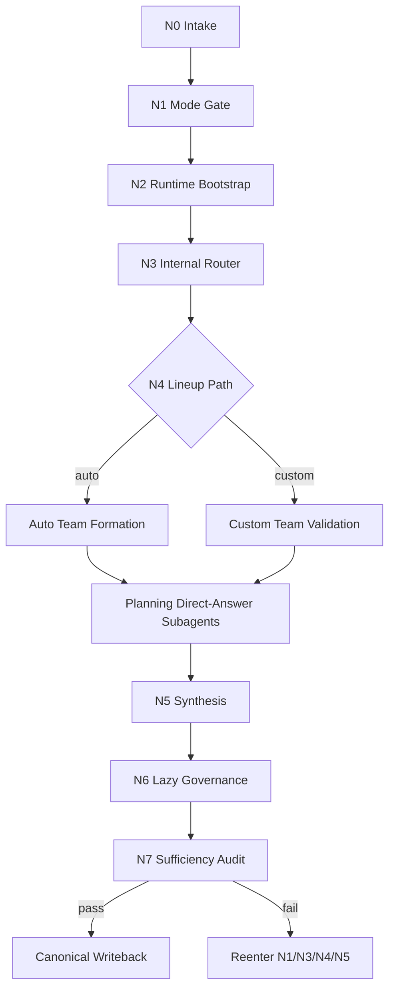

# aigc 0-初始化

`aigc-init` is the AIGC project kickoff and rebootstrap skill. It owns project initialization under `projects/aigc/<项目名>/`, locks `smart_advisor` as the only init mode, chooses exactly one lineup path (`auto` or `custom`), and synthesizes the initialization five-piece set after planning-role direct-answer packets.

This package now uses the Skill 2.0 dynamic-reference layout. `SKILL.md` is the entry, routing, gate, and output contract. Detailed rules live in `references/`, executable topology in `steps/`, quality gates in `review/`, type strategy in `types/`, reusable heuristics in `knowledge-base/`, templates in `templates/`, mechanical helpers in `scripts/`, and product metadata in `agents/`.

## Context Loading Contract

- 每次调用 `$aigc-init` 时，必须同时加载同目录 `CONTEXT.md`。
- 每次调用本技能时，必须同时识别并加载同目录 `types/` 中选中的类型包（单选或多选）。
- Every call to `$aigc-init` must load this `SKILL.md` and the same-directory `CONTEXT.md`.
- If the task is bound to `projects/aigc/<项目名>/`, load project `MEMORY.md` first, then relevant files under project `CONTEXT/`.
- Conflict order: user explicit request > root `AGENTS.md` / repository meta policy > this `SKILL.md` > referenced `references/`, `steps/`, `review/`, `types/`, `templates/` specs > `agents/openai.yaml` > project `MEMORY.md` > project `CONTEXT/` > same-directory `CONTEXT.md`.
- `CHANGELOG.md` is not runtime context unless migration history is needed.
- New reusable failures or stable tactics go to `CONTEXT.md` first; if they become mandatory, promote them to this entry contract or the correct reference partition.

## When to Use

- 用户以自然语言要求“初始化影片 / 初始化电影 / 初始化影视 / 初始化视频项目 / 新建电影项目 / 电影项目起盘”等媒介明确为 film/movie/video/影视工作流的初始化。
- Create a new AIGC film/video project under `projects/aigc/<项目名>/`.
- Reinitialize an existing AIGC project when the user wants to return to initialization state, rebuild the north star, or discard the active direction while preserving the project shell.
- Build `0-初始化/` through `7-视频/`, project `MEMORY.md`, project `CONTEXT/`, `源/`, `team.yaml`, `STATE.json`, and the core initialization artifacts.
- Lock a project-level `north_star` before entering `1-分集`, `2-编导`, or later AIGC stages.
- Use `.agents/skills/team/` advisors to form a planning-led initialization council.

## When Not to Use

- The project already has a stable `north_star.yaml` and the user only wants local repairs in a later stage.
- The task is a normal continuation, breakpoint recovery, governance repair, or status query; route to `aigc/resume` or the root `aigc` skill.
- The user asks to produce canonical deliverables for `1-Planning` through downstream stages; this skill may only seed those stages.
- The request is a Git rollback. Rebootstrap is a business reset, not `git reset`.
- 用户以自然语言要求“初始化小说 / 初始化网文 / 新建书 / story 项目起盘”，且没有明确要改编成影视项目；route to `.agents/skills/story/0-初始化/SKILL.md`.

## Input Contract (Mandatory)

`$aigc-init` must first decide whether the received input is enough to enter initialization, enough only for diagnosis, or should be routed elsewhere. The process after that decision is delegated to the referenced partitions.

| input slot | required shape | owner for detail |
| --- | --- | --- |
| `task_intent` | first initialization, rebootstrap, or clear request to lock a new project north star | `types/init-type-map.md`, `steps/init-workflow.md` |
| `project_identity` | project name, working title, or enough naming context to derive `projects/aigc/<项目名>/` | `references/scope-and-runtime.md` |
| `lineup_decision` | explicit `auto` or `custom`; if absent, stop at the option card | `references/mode-and-team-contract.md`, `templates/init-option-card.template.md` |
| `story_source_state` | ready, partial, missing, or intentionally deferred story source evidence | `references/artifacts-and-sources.md` |
| `creative_brief` | at least a story/emotional core, target form, audience/use case, constraints, or stated unknowns | `references/mode-and-team-contract.md` |
| `reset_context` | required only for rebootstrap: reset reason, preserve/archive/purge preference if not default | `references/rebootstrap-contract.md` |
| `existing_project_state` | required when the project already exists: current artifacts, source manifest, `STATE.json`, governance sidecars when present | `references/scope-and-runtime.md`, `references/rebootstrap-contract.md` |

Accepted input forms:

- a new project brief with a project name and explicit `auto/custom` lineup choice
- a project brief plus a request to show the initialization option card
- an existing project path plus a clear rebootstrap intent
- a source-light brief where story source is missing but the user accepts deferred story truth
- a source-grounded brief with source text or formal synopsis coverage

Reject or reroute:

- continuation, breakpoint repair, or status lookup -> `aigc/resume` or root `aigc`
- later-stage canonical production -> the relevant stage skill
- advisor lineup outside `.agents/skills/team/` -> reject until converted into a team skill
- unclear `auto/custom` decision -> show option card and stop before artifact drafting
- destructive source/asset deletion without explicit authorization -> block and ask for scope

## Output Contract (Mandatory)

`$aigc-init` has exactly one canonical business output: a project initialization state that can safely hand off to one next AIGC stage. It does not output parallel drafts from each advisor or hidden side truths.

### Required output

The required output is the initialized project state: project root carriers, `north_star.yaml`, `init_handoff.yaml`, `story-source-manifest.yaml`, `team.yaml`, `STATE.json`, and lazy governance sidecars only when triggered.

### Output format

The output format is a mixed artifact set: YAML for `north_star`, `init_handoff`, story source, team, and governance carriers; JSON for `STATE.json`; Markdown for project memory, changelog, context helper, validation or learning notes, and the final user-facing response.

### Output path

All canonical business outputs must land under `projects/aigc/<项目名>/`, with initialization-owned outputs under `projects/aigc/<项目名>/0-初始化/` and project-root carriers at the project root.

### Naming convention

Use the exact canonical names in the table below. Do not create alternate names such as `northstar.yaml`, `project-state.json`, `story_source.yaml`, or stage-local copies of project-root carriers.

### Completion gate

Completion requires the sufficiency gate in `review/init-review-gate.md`: one locked lineup mode, required artifacts present, source readiness represented honestly, planning direct-answer subagent provenance resolved or blocked, and exactly one next-stage recommendation.

Required canonical writeback after sufficiency passes:

| output | path | purpose | owner for detail |
| --- | --- | --- | --- |
| project root carriers | `projects/aigc/<项目名>/MEMORY.md`, `CHANGELOG.md`, `CONTEXT/`, `源/`, `STATE.json` | project memory, trace, context/source, live route truth | `references/scope-and-runtime.md` |
| north star | `projects/aigc/<项目名>/0-初始化/north_star.yaml` | long-lived creative and production constraints, including exact `全局风格 / 细分风格 / 类型元素 / 世界观` global design blocks | `references/artifacts-and-sources.md` |
| init handoff | `projects/aigc/<项目名>/0-初始化/init_handoff.yaml` | next-stage seeds, unknowns, source breakdown | `references/artifacts-and-sources.md` |
| story source manifest | `projects/aigc/<项目名>/0-初始化/story-source-manifest.yaml` | source readiness and coverage truth | `references/artifacts-and-sources.md` |
| team manifest | `projects/aigc/<项目名>/team.yaml` | lineup, roles, provenance, planning direct-answer trace | `references/mode-and-team-contract.md` |
| optional governance sidecars | `governance-state.yaml`, `mandate.yaml`, `mission-brief.yaml`, `route-plan.yaml`, `preflight-verdict.yaml`, `validation-report.md`, `learning-record.md` | only when trigger conditions apply | `references/artifacts-and-sources.md`, `review/init-review-gate.md` |

Template binding for these outputs is tracked in `templates/output-template-map.md`; the final user-facing answer uses `templates/output-template.md`; shared templates remain shared and are not copied into this package.

Final user-facing answer must state:

- locked `init_mode`
- locked `team_lineup_mode`
- whether planning direct-answer subagents ran or blocked
- core five-piece status: `north_star`, `init_handoff`, `story-source-manifest`, `team`, `STATE`
- lazy governance artifacts created, if any
- exact recommended next stage and path
- root-cause closeout triplet: `root cause location`, `immediate fix`, `systemic prevention fix`

Blocked output shape:

- If `auto/custom` is not locked, output only the option card and the missing decision.
- If planning subagents are unavailable during actual initialization, output the block reason and do not synthesize canonical artifacts.
- If source truth is missing, output source-light artifacts only and keep story facts in `unknowns`.
- If rebootstrap scope is unsafe, output the preservation conflict and do not delete or purge assets.

## Reference Loading Guide

Load only the partitions needed for the current node.

| Scenario | Load |
| --- | --- |
| Scope, project root, runtime skeleton, ownership boundaries | `references/scope-and-runtime.md` |
| Init mode, auto/custom lineup, team manifest, prompt packet | `references/mode-and-team-contract.md` |
| North star, handoff, story source, stage entry, lazy governance | `references/artifacts-and-sources.md` |
| Rebootstrap, archive/reset/purge boundaries, preservation rules | `references/rebootstrap-contract.md` |
| Node order, branching, subagent dispatch gates, write scopes | `steps/init-workflow.md` |
| Source-light/source-grounded/rebootstrap/custom-vs-auto classification | `types/init-type-map.md` |
| Sufficiency audit, pass table, review verdict, provider fallback | `review/init-review-gate.md` |
| Reusable tactics, source-layer pitfalls, runtime drift heuristics | `knowledge-base/init-heuristics.md` |
| Output templates and option card | `templates/` |
| Mechanical helper boundary and future helper notes | `scripts/README.md` |
| Product-side interface metadata | `agents/openai.yaml` |

## Mode Selection

| mode slot | allowed value | gate |
| --- | --- | --- |
| `init_mode` | `smart_advisor` only | Always fixed by this skill. |
| `team_lineup_mode` | `auto` or `custom` | Must be explicitly locked before drafting initialization artifacts. |
| `bootstrap_profile` | `source-light` or `source-grounded` | Determined by `story-source-manifest.yaml.primary_story_source.status`. |
| `reset_mode` | `archive_reset` default; `refresh_reset` or `purge_reset` by explicit scope | Used only when `rebootstrap_requested == true`. |

If the user has not clearly selected `auto` or `custom`, show the option card in `templates/init-option-card.template.md` and stop before artifact drafting.

## Internal Capability Fusion Contract (Mandatory)

`0-初始化` keeps routing, mode locking, lineup decision, planning direct-answer dispatch, synthesis, and sufficiency audit under the parent skill. Partition files expand the contract but do not become independent entry points.

- `0-初始化` 现只允许 `init_mode == smart_advisor`；旧的 `主创会诊模式 / 快速成案模式 / 自主问答模式` 全部失效。
- 开场必须展示“初始化元选项卡”，让用户在 `自动组队 / 自定义组队` 间拍板；不得无确认自动锁 `team_lineup_mode`。
- 固定 `init_mode = smart_advisor`；若用户尚未明确选择 `auto/custom`，发送一次初始化元选项卡并等待确认。
- `selector_scope_root` 固定为 `.agents/skills/team/`。
- planning 固定题包直答必须真实使用 subagents。
- 若 subagents 不可用，本轮初始化停止并报告阻塞。
- Parent skill alone performs final canonical writeback; advisors return local patches, not parallel main drafts.

## Core Workflow Index



This is an index only. Detailed node fields, branch rules, dispatch gates, and reentry logic live in `steps/init-workflow.md`.

## Execution Contract Index

1. Read root `.agents/skills/aigc/SKILL.md`, this `SKILL.md`, this `CONTEXT.md`, and the necessary shared AIGC contracts.
2. In `N0`, decide whether the request is first initialization, `rebootstrap`, or a resume/query task.
3. In `N1`, lock `init_mode == smart_advisor` and exactly one `team_lineup_mode`.
4. In `N2`, create the canonical project runtime skeleton, project `MEMORY.md`, `CONTEXT/`, and 同步创建项目根 `CHANGELOG.md` 作为时间序记录入口。
5. In `N3`, build a minimal route/context packet and lock `.agents/skills/team/` as the only advisor selector root.
6. In `N4`, form or validate the lineup, write a `team.yaml` patch, then run `roles.planning.members` direct-answer packets with real subagents.
7. In `N5`, synthesize only the patches produced by the actually selected path into `team.yaml`, `story-source-manifest.yaml`, `north_star.yaml`, `init_handoff.yaml`, and `STATE.json`.
8. In `N6`, create lazy governance artifacts only when triggered.
9. In `N7`, run the sufficiency gate from `review/init-review-gate.md`. If it fails, reenter the failed node rather than writing partial canonical truth.

This is the entry-level execution spine. Process details, type routing, and review criteria must be read from `steps/`, `types/`, `references/`, and `review/` rather than expanded here.

## Mandatory Gates

- `team_lineup_mode` must be locked before any canonical initialization artifact is drafted.
- `selector_scope_root` is always `.agents/skills/team/`.
- Auto lineup must first use the team root member/scenario index, then deep-read only shortlisted member skills.
- Custom lineup may only reference members under `.agents/skills/team/`.
- `team.yaml` is the project-level team manifest and must record init provenance, role ownership, and planning direct-answer provenance.
- Planning direct-answer execution is required for real initialization. If real subagents are unavailable or blocked, initialization execution is blocked; local sequential imitation is not a valid substitute.
- `source-light` projects may only write genre, tone, audience, production, and boundary constraints; story-level facts stay in `unknowns` or deferred notes.
- `source-grounded` projects may write story-facing seeds only within the coverage of the registered source.
- Rebootstrap defaults to `archive_reset`; never delete `源/`, source text, original assets, irreplaceable references, or legacy `Original/` without explicit user authorization.
- `north_star.yaml` owns durable project constraints and the exact global-design blocks `全局风格 / 细分风格 / 类型元素 / 世界观`; it never owns live route truth. Current route truth belongs to `STATE.json` and, when present, `governance-state.yaml`.
- `全局风格` must be a cross-design safe prompt prefix shared by image, character, scene, prop, and other design types. It may only contain `媒介属性 / 时代属性 / 光影逻辑 / 画面质感 / 避免出现 / 全局风格提示词`, and must not include single-domain payloads such as lens language, character material, scene composition, costume detail, or prop detail.
- `细分风格` owns domain-specific style guidance: `画面风格 / 服装风格 / 建筑风格 / 物品风格`.
- North-star style text defaults to Chinese. `全局风格提示词` is capped at 200 Chinese characters; `类型元素提示词` is capped at 30 Chinese characters; `画面风格` is capped at 70 Chinese characters; `服装风格 / 建筑风格 / 物品风格` are each capped at 100 Chinese characters.

## Bootstrap Runtime Markers (Mandatory)

Runtime bootstrap must create or verify the user-facing project skeleton below. The directories are readiness containers only; canonical business truth is still owned by the stage contracts and by the files that those stages later write.

```text
projects/aigc/<项目名>/
├── 0-初始化/
├── 1-分集/
├── 2-编导/
├── 3-摄影/
├── 4-分组/
├── 5-设计/
│   ├── 场景/
│   │   ├── 1-清单/
│   │   ├── 2-设计/
│   │   └── 3-生成/
│   ├── 道具/
│   │   ├── 1-清单/
│   │   ├── 2-设计/
│   │   └── 3-生成/
│   └── 角色/
│       ├── 1-清单/
│       ├── 2-设计/
│       └── 3-生成/
├── 6-图像/
├── 7-视频/
├── 源/
├── CONTEXT/
├── CHANGELOG.md
├── MEMORY.md
├── STATE.json
└── team.yaml
```

Story source marker: `源/` is the project-level source landing for new initialization. Historical `Original/` and `Story/` are legacy aliases and must be migrated or treated as compatibility inputs, not created by new initialization.

Downstream runtime naming marker: `6-图像/` and `7-视频/` are stage roots only at initialization time. Concrete image/video task subdirectories are created by their owning stages when execution begins.

Bootstrap runtime marker allowlist:

- `projects/aigc/<项目名>/1-分集/`
- `projects/aigc/<项目名>/2-编导/`
- `projects/aigc/<项目名>/3-摄影/`
- `projects/aigc/<项目名>/4-分组/`
- `projects/aigc/<项目名>/5-设计/`
- `projects/aigc/<项目名>/6-图像/`
- `projects/aigc/<项目名>/7-视频/`
- `projects/aigc/<项目名>/源/`
- `projects/aigc/<项目名>/CONTEXT/`

Forbidden bootstrap paths:

- legacy source aliases: `Original/`, `Story/`
- legacy English stages: `1-Planning/`, `2-Global/`, `3-Detail/`, `4-Design/`, `5-Image/`, `6-Video/`, `7-Cut/`
- stale Chinese numbering aliases: `1-规划/`, `2-全局/`, `3-编导/`, `4-摄影/`, `4-设计/`, `5-分组/`, `6-分组/`, `7-图像/`, `8-视频/`
- legacy project context aliases outside `projects/aigc/<项目名>/CONTEXT/`

Project-root success criterion: 项目根 `CHANGELOG.md` 已创建，作为项目级时间序记录入口，但不承载 live route truth。

## Story Source Completeness Gate (Mandatory)

`source-light bootstrap` applies when `primary_story_source.status != ready`; it may write production, tone, audience, and boundary constraints, but concrete plot facts must stay in `unknowns`, `deferred_to_*`, or `risk_notes`.

`source-grounded bootstrap` applies when source text or a formal synopsis covers the target range; story-facing seeds may be written only within coverage and with provenance.

Full details live in `references/artifacts-and-sources.md`.

## Story Source Reconciliation Contract (Mandatory)

If a project was initialized in source-light mode and a real story source later arrives, 必须先执行一次回刷对齐 before entering downstream stages.

Reconcile at least:

- `projects/aigc/<项目名>/0-初始化/north_star.yaml`
- `projects/aigc/<项目名>/0-初始化/init_handoff.yaml`
- `projects/aigc/<项目名>/STATE.json`

Priority is `story source user truth > user explicit confirmation > council_advised > assistant_inferred`.

## Stage Entry Ownership Contract (Mandatory)

- `init_handoff.yaml.project_contract.recommended_next_stage` owns the initialization-round handoff seed.
- `STATE.json.recommended_next_stage / recommended_entry_path / recommended_next_step` own live route truth.
- `governance-state.yaml.resume_contract.*`, when present, owns structured resume truth.
- `north_star.yaml` 不得出现 `stage_entry_contract`、`recommended_next_stage`、`stage_priority_order`、`rebootstrap_status` 等状态型字段。

## Root-Cause Execution Contract (Mandatory)

When initialization fails, trace:

`Symptom -> Direct Technical Cause -> Rule Source -> Meta Rule Source -> Fix Landing Points`

Priority repair targets:

| Failure area | First repair target |
| --- | --- |
| Mode lock, auto/custom ambiguity | `references/mode-and-team-contract.md` + `steps/init-workflow.md` |
| Runtime path drift or missing project root carrier | `references/scope-and-runtime.md` |
| Story-source readiness or source-light overclaim | `references/artifacts-and-sources.md` |
| Rebootstrap preservation or stale truth leakage | `references/rebootstrap-contract.md` |
| Node order, dispatch, write scope, or reentry drift | `steps/init-workflow.md` |
| Sufficiency, pass/fail routing, provider fallback | `review/init-review-gate.md` |
| Reusable pattern or failure memory | `CONTEXT.md` and `knowledge-base/init-heuristics.md` |

If a referenced shared contract is the source of truth, update the shared contract instead of duplicating it here.

## Field Mapping

| field_id | owner | canonical output | required gate |
| --- | --- | --- | --- |
| `FIELD-INIT-01` | `N5` | `0-初始化/north_star.yaml` | Long-term constraints only; no route truth. |
| `FIELD-INIT-01G` | `N5` | `0-初始化/north_star.yaml` | Exact global design blocks `全局风格 / 细分风格 / 类型元素 / 世界观` are present in north star. |
| `FIELD-INIT-02` | `N5` | `0-初始化/init_handoff.yaml` | Stage-entry seeds, unknowns, source breakdown. |
| `FIELD-INIT-03` | `N1/N3` | mode and provenance fields | `init_mode`, `team_lineup_mode`, source and decision owner are traceable. |
| `FIELD-INIT-04` | `N4/N5` | project `team.yaml` | Advisor paths stay under `.agents/skills/team/`; planning provenance recorded. |
| `FIELD-INIT-05` | `N2/N5/N6` | project root carriers and optional governance | Required root files exist; lazy carriers are trigger-based. |
| `FIELD-INIT-06` | `N7` | next-stage recommendation | Exactly one active next entry. |
| `FIELD-INIT-07` | `N3/N4/N7` | mode topology and subagent provenance | Router, lineup, direct-answer packets, and audit are internally consistent. |
| `FIELD-INIT-08` | `N0/N6/N7` | rebootstrap trace | Preservation, archive/stale paths, and reset route are explicit. |

Detailed pass standards and rework entries are in `review/init-review-gate.md`.

## Field Master

| field_id | output location | responsibility | fail code |
| --- | --- | --- | --- |
| `FIELD-INIT-01` | `north_star.yaml` | long-term project constraints | `FAIL-INIT-01` |
| `FIELD-INIT-01G` | `north_star.yaml` | exact global design blocks | `FAIL-INIT-01G` |
| `FIELD-INIT-02` | `init_handoff.yaml` | stage seeds and unknowns | `FAIL-INIT-02` |
| `FIELD-INIT-03` | mode/provenance fields | mode, lineup, source trace | `FAIL-INIT-03` |
| `FIELD-INIT-04` | `team.yaml` | advisor roles and planning provenance | `FAIL-INIT-04` |
| `FIELD-INIT-05` | project root carriers | runtime and governance path completeness | `FAIL-INIT-05` |
| `FIELD-INIT-06` | next-stage recommendation | one active entry | `FAIL-INIT-06` |
| `FIELD-INIT-07` | internal topology | route, lineup, subagent, audit consistency | `FAIL-INIT-07` |
| `FIELD-INIT-08` | reset trace | preserve/archive/stale scope | `FAIL-INIT-08` |

## Thought Pass Map

| step_id | focus | core question | action | fail signal |
| --- | --- | --- | --- | --- |
| `N0` | `FIELD-INIT-08` | first init, rebootstrap, or resume? | lock task type and reset intent | reset misread as resume, or source deletion |
| `N1` | `FIELD-INIT-03` | is `auto/custom` confirmed? | record mode and decision owner | artifact drafting before lock |
| `N2` | `FIELD-INIT-05` | are root carriers and skeleton ready? | create runtime roots and project support files | missing `CHANGELOG.md`, `MEMORY.md`, `STATE.json`, `team.yaml`, `源/`, or `CONTEXT/` |
| `N3` | `FIELD-INIT-03/07` | which lineup path and context packet? | create route and team context packets | advisor scope escapes team tree |
| `N4` | `FIELD-INIT-01/02/04/07` | does planning have enough direct-answer material? | run lineup path and planning subagents | local imitation or empty roster |
| `N5` | `FIELD-INIT-01/02/04/05` | can patches become the five-piece set? | synthesize with provenance | north star/handoff mixed |
| `N6` | `FIELD-INIT-05/08` | are lazy governance or reset traces needed? | write sidecars when triggered | full governance blocks a light start |
| `N7` | `FIELD-INIT-06/07/08` | does sufficiency pass? | audit and return one entry | multiple next entries or missing provenance |

## Pass Table

| field_id | pass standard | fail code | rework entry |
| --- | --- | --- | --- |
| `FIELD-INIT-01` | `north_star.yaml` only contains durable constraints and the exact global design blocks; it contains no live route truth | `FAIL-INIT-01` | `N4/N5` |
| `FIELD-INIT-01G` | `north_star.yaml` contains safe `全局风格` fields plus `细分风格 / 类型元素 / 世界观`; `全局风格` contains no cross-design pollution fields; style text is Chinese by default and respects the configured character caps | `FAIL-INIT-01G` | `N4/N5` |
| `FIELD-INIT-02` | `init_handoff.yaml` contains seeds, unknowns, and sources | `FAIL-INIT-02` | `N4/N5` |
| `FIELD-INIT-03` | mode and provenance are traceable | `FAIL-INIT-03` | `N1/N3` |
| `FIELD-INIT-04` | `team.yaml` records team scope and planning provenance | `FAIL-INIT-04` | `N3/N4/N5` |
| `FIELD-INIT-05` | root carriers and triggered governance artifacts are correct | `FAIL-INIT-05` | `N2/N5/N6` |
| `FIELD-INIT-06` | exactly one next stage is returned | `FAIL-INIT-06` | `N7` |
| `FIELD-INIT-07` | mode, lineup, subagents, and audit are internally consistent | `FAIL-INIT-07` | `N3/N4/N7` |
| `FIELD-INIT-08` | rebootstrap state is identified and old truth exits active flow | `FAIL-INIT-08` | `N0/N6/N7` |

## Maintenance Sync

For Skill 2.0 maintenance of this package, also keep `README.md`, `CHANGELOG.md`, `CONTEXT.md`, and `agents/openai.yaml` synchronized with any contract move.
