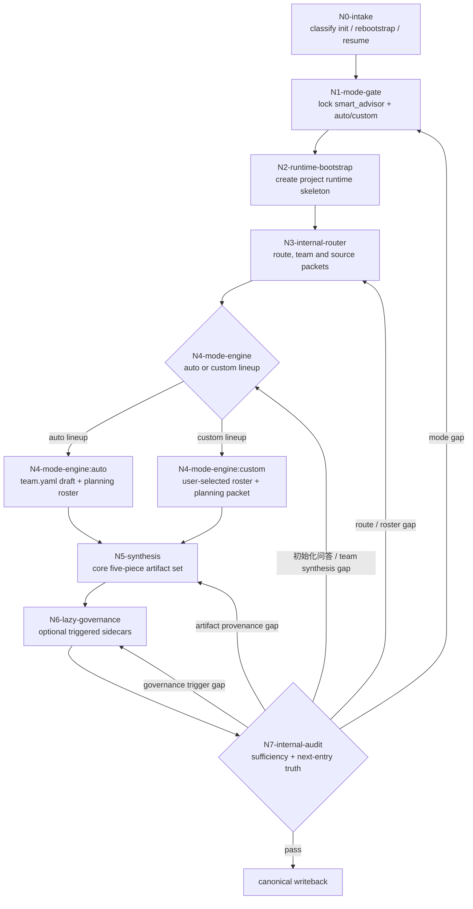

# Init Workflow

This file owns the thinking-action node network for `$aigc-init`.

## Topology Fit

The main topology is serial with one controlled branch:

`N0 -> N1 -> N2 -> N3 -> N4(auto|custom) -> N5 -> N6 -> N7`

Only `N4` branches. All branches converge before synthesis and audit.

## Mermaid Topology

## Node Schema

Each node must define:

| slot | meaning |
| --- | --- |
| `node_id` | stable node identifier |
| `objective` | judgment and action objective |
| `inputs` | context, files, upstream decisions |
| `actions` | actual work |
| `evidence` | artifact, note, command, or conclusion left behind |
| `route_out` | success, failure, branch, and reentry route |
| `gate` | whether final writeback may proceed |
| `decision_lock` | decisions fixed by this node |
| `dispatch_contract` | 顾问与复核流程 ownership and local checklist policy |
| `write_scope` | patches or files allowed |
| `blocker_rule` | when to stop |
| `reentry_rule` | where to return when upstream information changes |

## Node Semantics

| node_id | decision_lock | dispatch_contract | write_scope | blocker_rule | reentry_rule |
| --- | --- | --- | --- | --- | --- |
| `N0-intake` | `project_scope`, `rebootstrap_requested` | no 顾问与复核流程 | `project_scope_note`, `reset_intent_note`, `task_entry_decision` | stop if the task cannot be classified as init, rebootstrap, resume, or query | user clarification returns to `N0` |
| `N1-mode-gate` | `init_mode == smart_advisor`, `team_lineup_mode`, `decision_owner` | no 顾问与复核流程 | `mode_lock_note`, option card, `lineup_mode_decision` | stop until `auto/custom` is locked | lineup change returns to `N1` |
| `N2-runtime-bootstrap` | `project_root`, canonical runtime layout | no 顾问与复核流程 | directory skeleton, project `MEMORY.md`, project `CONTEXT/`, project `CHANGELOG.md`, `runtime_bootstrap_note` | stop if project path conflicts with shared layout | project name/layout change returns to `N2` |
| `N3-internal-router` | `selector_scope_root`, `team_context_budget`, `story_source_status` | no 顾问与复核流程 | `route_plan_patch`, `context_packet_plan`, `team_context_packet` | stop if candidate team members leave `.agents/skills/team/` or source state is unknown | new candidates/source data return to `N3` |
| `N4-mode-engine` | `team.yaml` draft, `roles.planning.members` roster | real 顾问与复核流程 required for `planning_direct_answer_engine`; no local imitation | `team_manifest_patch`, `selection_rationale`, `direct_answer_report`, `north_star_patch`, `init_handoff_patch`, `init_synthesis_patch` | stop if 顾问与复核流程 unavailable, roster empty, roster outside `.agents/skills/team/`, or requested post-init persona dispatch remains active | lineup/source/prompt changes return to `N3` or `N4` |
| `N5-synthesis` | `source-light/source-grounded`, artifact ownership split | no new planning 顾问与复核流程 and no creative-stage team persona dispatch | draft core five-piece set | stop if patch provenance is incomplete, team is not locked, or `team.yaml` lacks init-only synthesis policy | patch/source changes return to `N4` or `N5` |
| `N6-lazy-governance` | `governance_trigger_set`, optional `reset_bridge` | no init advisor 顾问与复核流程 | optional governance carriers only | do not create carriers for structural completeness alone | governance trigger changes return to `N6` |
| `N7-internal-audit` | `sufficiency_status`, `next_entry_truth` | no 顾问与复核流程 | `audit_report`, `reentry_decision`, final writeback approval | stop if source, team, 顾问与复核流程 provenance, or next-entry truth is incomplete | fail routes to `N1/N3/N4/N5/N6` by gap |

## Topology Contract

| node_id | objective | inputs | actions | evidence | route_out | gate |
| --- | --- | --- | --- | --- | --- | --- |
| `N0-intake` | classify first init, rebootstrap, or resume/query | user request, project path, existing artifacts | identify task nature and reset intent | `project_scope_note`, `reset_intent_note` | `N1`, or route to `resume/` | no |
| `N1-mode-gate` | lock `smart_advisor` and `auto/custom` | user intent, lineup signal, option card | record mode metadata or show option card | `mode_lock_note`, `lineup_mode_decision` | `N2`; conflict returns to `N1` | no |
| `N2-runtime-bootstrap` | create runtime skeleton | project name, shared runtime layout | create roots, active skeleton, `MEMORY.md`, `CONTEXT/`, `CHANGELOG.md` | `runtime_bootstrap_note`, path check | `N3` | no |
| `N3-internal-router` | reduce context to needed route/team/source packet | locked mode, current gaps, budget | build route and team context packets | `route_plan_patch`, scope check, source note | `N4`; missing mode returns to `N1` | no |
| `N4-mode-engine` | lock team and run planning direct-answer packet | router packet, templates, team candidates | run one lineup path, then planning direct-answer 顾问与复核流程 | team patch, roster, direct-answer report, init synthesis patch | `N5`; blocked returns to `N1/N3` | no |
| `N5-synthesis` | synthesize five-piece set | team patch, direct-answer patch, templates, shared contracts | draft team/source/north-star/handoff/state and compress team answers into frozen stage seeds | `artifact_patch_set`, provenance note, persona-dispatch disabled evidence | `N6` | conditional |
| `N6-lazy-governance` | add optional governance only when triggered | core five-piece, governance triggers | draft sidecars and reset bridge if needed | governance patch set, trigger note | `N7` | conditional |
| `N7-internal-audit` | verify sufficiency and next-entry alignment | all drafts, review rules, source layers | audit and decide writeback or reentry | `audit_report`, `reentry_decision` | writeback or reenter failed node | yes |

## Ordered And Unordered Rules

- `N1 -> N2 -> N3 -> N4 -> N5 -> N6 -> N7` is fixed.
- `N4` may choose exactly one subpath: auto lineup or custom lineup.
- After `team.yaml` is locked, `roles.planning.members` run the first direct-answer packet.
- `初始化专业顾问` and `初始化复核` do not replace the initialization planning owner.
- Parent skill performs final synthesis; advisor packets are initialization deltas, not parallel main drafts or creative-stage persona presets.
- New `team.yaml` writes must disable creative-stage team persona dispatch and expose only frozen `init_synthesis.stage_seed_summary` to later stages.
- Nodes that change route, ownership, or required fields must update `SKILL.md`, `review/init-review-gate.md`, and any relevant template in the same task.

## Reentry Rules

| finding | reentry |
| --- | --- |
| ambiguous `auto/custom` | `N1` |
| team member outside `.agents/skills/team/` | `N3` |
| active creative-stage team persona dispatch remains in `team.yaml` | `N4` then `N5` |
| planning roster empty or 顾问与复核流程 blocked | `N4` |
| provenance missing from artifact patches | `N5` |
| source-light story overclaim | `N5` plus `references/artifacts-and-sources.md` |
| reset trace missing | `N6` |
| multiple next entries | `N7` then `N5` |
