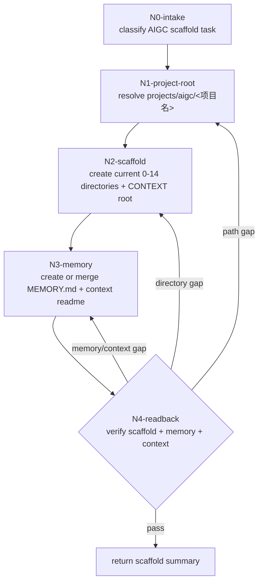

# Init Workflow

This file expands the scaffold-only workflow for `$aigc-init`.

## Topology Fit

The active topology is serial:

`N0 -> N1 -> N2 -> N3 -> N4`

No advisor lineup, team synthesis, north-star drafting, state routing, source manifest generation, or governance sidecar node participates in scaffold initialization.

## Mermaid Topology

## Node Schema

| slot | meaning |
| --- | --- |
| `node_id` | stable node identifier |
| `objective` | judgment and action objective |
| `inputs` | context, files, upstream decisions |
| `actions` | actual work |
| `evidence` | file, directory, command, or conclusion left behind |
| `route_out` | success, failure, and reentry route |
| `gate` | whether final response may proceed |
| `write_scope` | directories or files allowed |
| `blocker_rule` | when to stop |
| `reentry_rule` | where to return when upstream information changes |

## Node Semantics

| node_id | decision_lock | write_scope | blocker_rule | reentry_rule |
| --- | --- | --- | --- | --- |
| `N0-intake` | `task_type == scaffold_init` | none | stop if media is not AIGC film/video or task asks for stage output | user clarification returns to `N0` |
| `N1-project-root` | canonical `projects/aigc/<项目名>/` | none | stop if project name is absent or path escapes `projects/aigc/` | project name/path change returns to `N1` |
| `N2-scaffold` | active 0-14 directory allowlist plus project context root | missing scaffold directories and `CONTEXT/` only | stop if creation would overwrite a file where a directory is required | layout change returns to `N2` |
| `N3-memory` | project memory file and context readme | `MEMORY.md`, `CONTEXT/README.md` | stop if existing memory would be overwritten rather than merged | memory preference or context readme change returns to `N3` |
| `N4-readback` | scaffold pass/fail | none | fail if any active directory, `MEMORY.md`, or `CONTEXT/` is missing, or if this run created removed artifacts | fail routes to `N1/N2/N3` by gap |

## Topology Contract

| node_id | objective | inputs | actions | evidence | route_out | gate |
| --- | --- | --- | --- | --- | --- | --- |
| `N0-intake` | classify scaffold init, repair, or unsafe reset | user request | identify task nature and media | `task_entry_decision` | `N1`, reroute, or block | no |
| `N1-project-root` | resolve canonical root | project name/path | derive and validate `projects/aigc/<项目名>/` | `project_scope_note` | `N2`; conflict returns to `N1` | no |
| `N2-scaffold` | create current stage directories and project context root | root path, allowlist | create missing `0-初始化/` through `14-审片/` directories and `CONTEXT/` | directory readback | `N3` | no |
| `N3-memory` | create or update project memory and context readme | templates, user requirements, existing memory | write or merge `MEMORY.md`; write `CONTEXT/README.md` when missing | memory/context readback | `N4` | no |
| `N4-readback` | verify scaffold-only completion | directory list, memory file, context root, removed-output denylist | inspect expected/forbidden paths | final scaffold checklist | return summary or reenter failed node | yes |

## Ordered Rules

- `N0 -> N1 -> N2 -> N3 -> N4` is fixed.
- `N2` creates only directories, including `CONTEXT/`.
- `N3` writes only `MEMORY.md` and `CONTEXT/README.md`.
- Empty scaffold directories are not stage completion evidence.
- Do not create `north_star.yaml`, `init_handoff.yaml`, `story-source-manifest.yaml`, `team.yaml`, `STATE.json`, `CHANGELOG.md`, `源/`, or governance sidecars.

## Reentry Rules

| finding | reentry |
| --- | --- |
| missing project name | `N1` |
| path outside `projects/aigc/` | `N1` |
| file blocks a scaffold directory path | `N2` after user resolves conflict |
| missing or stale stage directory name | `N2` |
| `MEMORY.md` missing | `N3` |
| `CONTEXT/` or `CONTEXT/README.md` missing | `N2` for directory, then `N3` for readme |
| existing memory needs merge instead of overwrite | `N3` |
| removed artifact was created by this run | remove only that newly created artifact if safe, then `N4`; otherwise report blocked cleanup scope |
