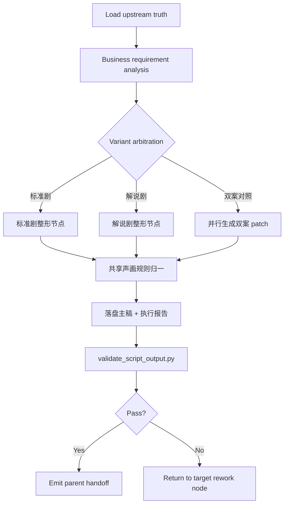
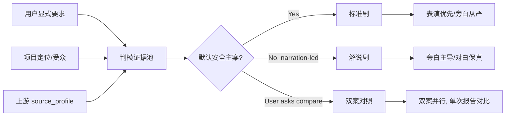
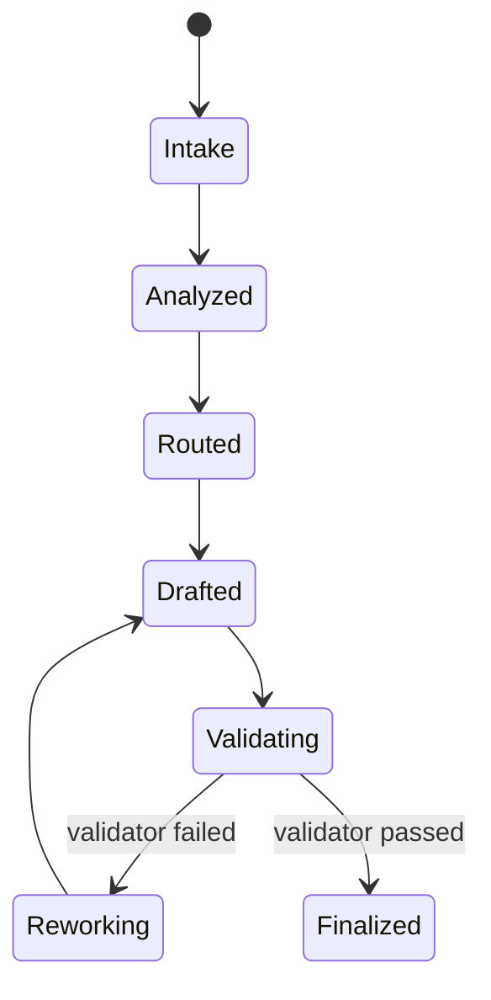
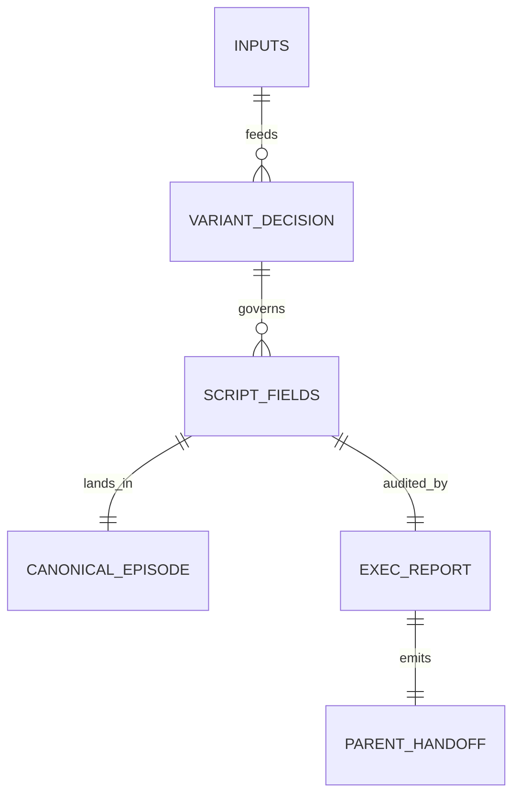

# aigc 2-格式

## Context Loading Contract

- 每次调用本技能时，必须同时加载同目录 `CONTEXT.md` 作为预加载上下文。
- 若同目录 `CONTEXT.md` 缺失，应先补齐最小知识库骨架，或向用户明确报告阻塞；不得在未检查该上下文的情况下执行技能。
- 冲突优先级：用户显式请求 > 仓库/全局 `AGENTS.md` > 本 `SKILL.md` > 同目录 `CONTEXT.md`。

## 概述

`2-格式` 是 `1-Planning` 下负责“逐集原文真源 -> 规划阶段 canonical 主稿”的单技能真源。

本次口径固定为：

- 内容与机制继续全面继承现有 `2-格式` 配置与 `AIGC-ZEN-VOID/.agents/skills/aigc2026/1-编剧/2-对白·独白·旁白` 的高价值规则
- 但所有原本散落在旧规划组文档中的格式判模、标准剧、解说剧与 team/gating 规则，统一内化回本 `SKILL.md`
- `2-格式` 不再依赖外部 planning agent 文档才能完成主变体裁决、文本层规则选择、主稿落盘、validator 闭环与下游 handoff

## Internal Capability Fusion Contract (Mandatory)

本技能采用知行合一的“单技能内化能力面”合同，不再把以下能力外包给独立 agent 文档：

| 内化能力面 | 原职责来源 | 当前收口位置 | 当前职责 |
| --- | --- | --- | --- |
| `格式判模内核` | 旧 `格式判模.md` | 本 `SKILL.md` 的 `Variant Arbitration Contract` | 基于项目定位、用户信号、上游证据决定 `标准剧 / 解说剧 / 双案对照` |
| `标准剧整形内核` | 旧 `标准剧.md` | 本 `SKILL.md` 的 `Variant Writing Contract` | 负责“表演优先、旁白从严”的字段纪律与文本整理 |
| `解说剧整形内核` | 旧 `解说剧.md` | 本 `SKILL.md` 的 `Variant Writing Contract` | 负责“旁白主导、对白保真”的字段纪律与文本整理 |
| `规划编排边界` | 旧 `team.md` | 本 `SKILL.md` 的 `Topology / Node / Handoff` | 固定谁负责裁决、谁负责写回、谁负责验证、谁负责下游交接 |
| `下游分组/节奏接口` | 旧 `分组.md / 节奏.md` 中与剧本交接有关部分 | 本 `SKILL.md` 的 `Downstream Interface Contract` | 只保留剧本对 `3-分组` 与节奏复核真正需要的交接字段，不越权执行下游阶段 |

硬规则：

1. `2-格式` 必须能在不读取任何已废弃旧规划组文档的情况下完整执行。
2. 本技能只允许一个 canonical 写回 owner：`2-格式` skill 本体。
3. 任何“格式判模 / 标准剧 / 解说剧”的差异都只能表现为内部节点差异，不得再长出外部第二真源。
4. 分组与节奏只作为下游接口约束存在，不得重新反客为主占有本阶段写回权。

## Canonical Anchors

| 载体 | 位置 | 作用 |
| --- | --- | --- |
| 剧本主稿 | `projects/aigc/<项目名>/1-Planning/2-格式/第N集.md` | 规划阶段逐集 canonical 主稿 |
| 单集执行报告 | `projects/aigc/<项目名>/1-Planning/2-格式/第N集-执行报告.md` | 记录变体裁决、结构重排、validator 与返工结论 |
| 变体决策证据 | `projects/aigc/<项目名>/1-Planning/2-格式/agents-plan/第N集.<variant>.md` | 可选证据，不与主稿竞争 |
| 上游逐集真源 | `projects/aigc/<项目名>/1-Planning/1-分集/第N集.md` | `1-分集` 产出的逐集原文真源 |
| 上游执行报告 | `projects/aigc/<项目名>/1-Planning/1-分集/执行报告.md` | coverage、`source_profile` 与边界证据 |
| 上游机读索引 | `projects/aigc/<项目名>/1-Planning/episode-split-plan.json` | 分集边界、`source_profile`、`bootstrap_output` |
| 共享校验器 | `.agents/skills/aigc/1-Planning/2-格式/scripts/validate_script_output.py` | 校验 `标准剧 / 解说剧` 主稿结构与高频硬门禁 |

## Shared Preload Contract (Mandatory)

- 强制读取：`../_shared/IO_CONTRACT.md`
- 强制读取：`.agents/skills/aigc/_shared/story-source-contract.md`
- 强制读取：`.agents/skills/aigc/_shared/project-runtime-layout.md`
- 强制读取：同目录 `CONTEXT.md`

硬规则：

1. 输入真源只能来自 `1-分集` 产物，不得回退到 `Story/` 做二次自由切分。
2. 本阶段不提前生成 `2-Global/*.md` 或 `3-Detail/第N集.json`。
3. 本阶段写回对象只有 `2-格式/第N集.md` 与 `第N集-执行报告.md`。
4. 若要保留思行证据，只能写进 `agents-plan/` 侧车，不能伪装成主稿或第二份剧本。

## Visual Maps









## Business Requirement Analysis Contract

在进入任何正文改写之前，必须先锁定下列业务问题：

| business_slot | 必答问题 |
| --- | --- |
| `business_goal` | 当前是要产出“表演优先剧本”还是“旁白主导解说稿”，或双案对照？ |
| `business_object` | 当前集的规划主稿要服务谁：`3-分组`、节奏复核、人工阅读、还是多方共用？ |
| `constraint_profile` | 是否存在对白冻结、旁白主体、内心独白、镜头语言预设、保序等硬约束？ |
| `risk_profile` | 当前最易出错的是变体误判、旁白过量、动作混入引号、还是声画错配？ |
| `success_criteria` | 本轮完成后，什么样的主稿可以直接交给 `3-分组` 而不需要二次猜结构？ |
| `non_goals` | 明确不做剧情改写、不做导演语法、不做下游分组/节奏执行 |

若这些问题未锁定，只能继续补分析，不得直接落盘正文。

## Total Input Contract

### Required Inputs

- `projects/aigc/<项目名>/1-Planning/1-分集/第N集.md`
- `projects/aigc/<项目名>/1-Planning/1-分集/执行报告.md`
- `projects/aigc/<项目名>/1-Planning/episode-split-plan.json`

### Optional Inputs

- `projects/aigc/<项目名>/0-Init/story-source-manifest.yaml`
- 用户显式指定的变体、受众、旁白密度、对白保真、内心独白开关
- 父级已有 `validation-report.md`

### Forbidden Inputs

- 当前项目外部剧本文本
- 直接来自 `2-Global / 3-Detail` 的导演扩写结果
- 未登记的临时改写稿

## Topology Contract (Mandatory)

### Thinking-Action Node Contract

| node_id | objective | inputs | actions | evidence | route_out | gate |
| --- | --- | --- | --- | --- | --- | --- |
| `N1-intake` | 锁定上游真源与任务边界 | 上游逐集文稿、执行报告、机读索引、用户要求 | 读取输入、确认 episode 与输出路径 | 输入清单、边界卡 | `ok -> N2`, `fail -> stop` | 不允许直接汇流 |
| `N2-analyze` | 完成业务分析与风险识别 | `N1` 输出 | 提炼业务目标、受众、约束、风险、非目标 | business brief | `ok -> N3` | 不允许直接汇流 |
| `N3-route` | 做唯一主变体或双案对照裁决 | 用户信号、项目定位、`source_profile` | 运行判模规则，锁定 `标准剧 / 解说剧 / compare` | 变体裁决摘要 | `standard -> N4S`, `explainer -> N4E`, `compare -> N4C` | 不允许直接汇流 |
| `N4S-standard` | 生成标准剧结构草稿 | `N3`、上游正文 | 按标准剧规则整理场景、对白、旁白、动作、画面 | standard patch | `ok -> N5` | 不允许直接汇流 |
| `N4E-explainer` | 生成解说剧结构草稿 | `N3`、上游正文 | 按解说剧规则整理旁白主导结构 | explainer patch | `ok -> N5` | 不允许直接汇流 |
| `N4C-compare` | 双案对照生成 | `N3`、上游正文 | 并行生成标准剧与解说剧 patch，并给对照摘要 | compare bundle | `ok -> N5` | 不允许直接汇流 |
| `N5-normalize` | 统一共享门禁 | 变体 patch | 应用对白冻结、主体、双引号、动作剥离、声画配对、字数回填等共享规则 | canonical draft | `ok -> N6`, `fail -> N4*` | 通过后才可进入汇流 |
| `N6-writeback` | 写回主稿与执行报告 | canonical draft | 落盘 `第N集.md`、`第N集-执行报告.md`、可选 `agents-plan/` | 文件落盘证据 | `ok -> N7` | 通过后才可进入汇流 |
| `N7-validate` | 运行 validator 并返工 | 输出文件、上游文件 | 调 `validate_script_output.py`，收集失败码 | validator verdict | `pass -> N8`, `fail -> N4*/N5` | 通过后才可汇流 |
| `N8-handoff` | 生成父级 handoff | 执行报告、主稿、validator 结果 | 回传最小 patch / note / report | parent handoff | `done` | 最终汇流点 |

### Convergence Contract

- 只有 `N7-validate` 返回通过，才允许进入 `N8-handoff`
- 双案对照只允许共享一份执行报告，不允许共享两份 canonical 主稿
- validator 失败时，必须回退到最小必要节点：
  - 变体判断错：回退 `N3-route`
  - 变体规则错：回退 `N4S/N4E/N4C`
  - 共享门禁错：回退 `N5-normalize`
  - 纯写回/报告错：回退 `N6-writeback`

## Variant Arbitration Contract (Mandatory)

### 主变体裁决规则

1. 用户显式要求“标准剧 / 表演优先 / 旁白节制”时，锁定 `标准剧`
2. 用户显式要求“解说剧 / 旁白主导 / 非对白旁白化 / 讲述者视角”时，锁定 `解说剧`
3. 用户显式要求“对照案 / 双案”时，进入 `compare`
4. 未显式指定时，按保守默认值回退 `标准剧`
5. 只有满足“下游更依赖讲述型消费”或“上游文本本身就是旁白主导表达”时，才允许从默认 `标准剧` 切到 `解说剧`

### 判模证据位

- `selected_variant`
- `variant_signals`
- `rejected_variants`
- `dialogue_policy`
- `narration_policy`
- `inner_monologue_policy`
- `downstream_consumption_expectation`

## Variant Writing Contract (Mandatory)

### Shared Rules

1. 对白逐字保真，不做润色、删改、同义替换、语序重排
2. 对白/内心独白/旁白都必须显式带主体，正文使用中文双引号
3. 文本条目必须就近配对 `对白画面 / 内心独白画面 / 旁白画面`
4. 每个场景至少 1 条 `动作画面：`
5. 引号内不得混入动作描写；动作全部下沉到 `*画面`
6. `总字数` 必须按最终 `【剧本正文】` 实算回填
7. `镜头语言预设` 仅可整理上游明确存在的运镜，不得脑补
8. 场景标题统一使用阿拉伯数字编号，例如 `### 场景1：...`，以便下游 `3-分组` 稳定解析组起始场景号

### 标准剧规则

- 默认服务“表演优先、对白承载核心信息”
- 旁白只在信息若不显式说出会造成时空/知情误解时启用
- 内心独白仅在用户显式要求或心理推进缺口显著时启用
- 禁止把标准剧写成解说腔、说明腔或旁白常开层

### 解说剧规则

- 默认服务“旁白主导、对白保真”
- 旁白主体默认统一为 `讲述者`
- 非对白叙述优先归入 `旁白` 或 `动作画面`，禁止裸叙述散文句
- 默认不启用 `内心独白`；只有显式要求时才开启
- 回忆/联想型 `旁白画面` 优先自然过渡，不写机械硬标签

## Downstream Interface Contract (Mandatory)

`2-格式` 只给 `3-分组` 与节奏复核提供可消费接口，不执行下游动作。

### 必须稳定交出的字段

- `selected_variant`
- `dialogue_policy`
- `narration_policy`
- `inner_monologue_policy`
- `scene_count`
- `source_profile`
- `bootstrap_output`
- `upstream_paths`

### 禁止越权内容

- 不直接给出 authoritative `group_count`
- 不直接给出 authoritative `estimated_duration_seconds`
- 不提前写 `节奏蓝图`
- 不把下游 reviewer 意见写进本阶段 canonical 主稿

## One-Shot Output Contract

### A. Canonical 剧本主稿

路径：

`projects/aigc/<项目名>/1-Planning/2-格式/第N集.md`

```markdown
---
项目名: <项目名>
集数: 第<n>集
剧本变体: <标准剧|解说剧>
source_type: <source_type>
coverage_scope: <coverage_scope>
split_scope: <incremental|full_season>
总字数: <当前正文实算值>
bootstrap_output: projects/aigc/<项目名>/2-Global/导演意图.md
upstream_source: projects/aigc/<项目名>/1-Planning/1-分集/第<n>集.md
---

【剧本正文】
### 场景1：<场景信息>
...
```

### B. 单集执行报告

路径：

`projects/aigc/<项目名>/1-Planning/2-格式/第N集-执行报告.md`

固定区块：

- `## 输入清单`
- `## 业务分析摘要`
- `## 变体裁决`
- `## 结构重排摘要`
- `## validator 结果`
- `## 父级 handoff`
- `## 验收结论与返工项`

### C. Parent Handoff Patch

最小返回字段：

- `episode_id`
- `selected_variant`
- `script_output_path`
- `scene_count`
- `dialogue_policy`
- `narration_policy`
- `inner_monologue_policy`
- `source_profile`
- `bootstrap_output`
- `upstream_paths`

## Variable Scenario Map (VSM)

### Variable Register

| var_id | 变量层级 | 观测信号 | 状态集合 | 检测方法 |
| --- | --- | --- | --- | --- |
| `V-VARIANT-SIGNAL` | 路由 | 用户/项目是否给出明确变体信号 | `standard/explainer/compare/unknown` | 指令 + 项目定位读取 |
| `V-DIALOGUE-FREEZE` | 文本 | 对白是否逐字等同上游 | `pass/fail` | 上游引号文本比对 |
| `V-NARRATOR-CONSISTENCY` | 体裁 | 旁白主体是否一致 | `pass/fail` | 旁白主体扫描 |
| `V-INNER-MODE` | 体裁 | 是否允许内心独白 | `allow/forbid` | 用户要求 + 变体规则 |
| `V-VISUAL-PAIR` | 结构 | 文本条目是否就近配对 `*画面` | `pass/fail` | 邻接字段检查 |
| `V-ACTION-ISOLATION` | 文本 | 引号内是否夹带动作 | `pass/fail` | 正则扫描 |
| `V-WORDCOUNT-SYNC` | 收尾 | `总字数` 是否已回填 | `pass/fail` | 正文字数实算 |

### Scenario Table

| case_id | 触发谓词 | 默认策略 | 返工入口 |
| --- | --- | --- | --- |
| `C1-VARIANT-AMBIGUOUS` | `V-VARIANT-SIGNAL=unknown` | 回退 `标准剧` 并记录理由 | `N3-route` |
| `C2-DIALOGUE-DRIFT` | `V-DIALOGUE-FREEZE=fail` | 回滚对白到上游逐字文本 | `N4*/N5` |
| `C3-NARRATOR-DRIFT` | `V-NARRATOR-CONSISTENCY=fail` | 统一旁白主体 | `N4E/N5` |
| `C4-INNER-OVERUSE` | `V-INNER-MODE=forbid` 且检测到独白 | 关闭独白层 | `N4E/N5` |
| `C5-VISUAL-MISS` | `V-VISUAL-PAIR=fail` | 补齐或重排 `*画面` | `N5` |
| `C6-ACTION-MIXED` | `V-ACTION-ISOLATION=fail` | 动作下沉到画面字段 | `N5` |
| `C7-WORDCOUNT-STALE` | `V-WORDCOUNT-SYNC=fail` | 重算并回填 `总字数` | `N6/N7` |

## Quality And Audit Contract

### 评分矩阵

| 维度 | 指标 | 分值 |
| --- | --- | --- |
| 维度0: 契约遵循 | 是否遵守“单技能内化判模 + 单 owner 写回 + validator 闭环” | __/10 |
| 维度1 | 上游输入继承正确性 | __/10 |
| 维度2 | 变体裁决正确性 | __/10 |
| 维度3 | 场景结构完整性 | __/10 |
| 维度4 | 对白/旁白/独白格式合法性 | __/10 |
| 维度5 | 文本-画面同命题配对 | __/10 |
| 维度6 | 旁白密度与主体纪律 | __/10 |
| 维度7 | `source_profile + bootstrap_output` handoff 完整性 | __/10 |
| 维度8 | 验收与返工闭环 | __/10 |

## Field Master

| field_id | 输出位置/字段 | 内容要求 | 默认责任 Step | 质量维度 | 失败码 |
| --- | --- | --- | --- | --- | --- |
| `FIELD-SCRIPT-01` | 输入锚点 | 锁定 `1-分集` 逐集原文、执行报告与机读索引 | S1 | 输入真源一致性 | `FAIL-SCRIPT-01` |
| `FIELD-SCRIPT-02` | 业务分析 | 锁定业务目标、受众、约束、风险与非目标 | S2 | 任务理解完整性 | `FAIL-SCRIPT-02` |
| `FIELD-SCRIPT-03` | 变体裁决 | 锁定唯一主变体或双案条件与理由 | S3 | 路由正确性 | `FAIL-SCRIPT-03` |
| `FIELD-SCRIPT-04` | 文本整形 | 按对应变体生成结构化主稿草案 | S4 | 变体执行稳定性 | `FAIL-SCRIPT-04` |
| `FIELD-SCRIPT-05` | 共享门禁 | 完成对白冻结、主体、双引号、动作剥离、声画配对、字数回填 | S5 | 结构稳定性 | `FAIL-SCRIPT-05` |
| `FIELD-SCRIPT-06` | 主稿落盘 | 写出 `2-格式/第N集.md` 与执行报告 | S6 | 输出完整性 | `FAIL-SCRIPT-06` |
| `FIELD-SCRIPT-07` | validator | 调脚本并收敛返工入口 | S7 | 质量门闭环 | `FAIL-SCRIPT-07` |
| `FIELD-SCRIPT-08` | 父级 handoff | 返回 `selected_variant + source_profile + bootstrap_output` patch | S8 | handoff 可消费性 | `FAIL-SCRIPT-08` |

## Thought Pass Map

| step_id | 聚焦字段 | 核心问题 | 生成动作 | 未达标信号 |
| --- | --- | --- | --- | --- |
| `S1` | `FIELD-SCRIPT-01` | 输入是否唯一且可追溯 | 读取并锁定上游输入 | 回退到 `Story/` 自由切分 |
| `S2` | `FIELD-SCRIPT-02` | 本轮究竟要解决什么剧本问题 | 输出 business brief | 直接跳过分析开始正文整理 |
| `S3` | `FIELD-SCRIPT-03` | 本轮该走哪个变体 | 裁决主变体并记录拒绝路径 | 双案并列但无裁决 |
| `S4` | `FIELD-SCRIPT-04` | 该变体如何组织正文 | 生成标准剧/解说剧/双案草稿 | 把变体规则混写 |
| `S5` | `FIELD-SCRIPT-05` | 共享硬门禁是否全部满足 | 归一声画与格式规则 | 只靠肉眼回放 |
| `S6` | `FIELD-SCRIPT-06` | canonical 主稿如何落盘 | 写主稿与执行报告 | 只返 note 不写文件 |
| `S7` | `FIELD-SCRIPT-07` | 输出是否通过质量门 | 跑 validator 并回退失败节点 | validator 失败仍宣告完成 |
| `S8` | `FIELD-SCRIPT-08` | 父级真正需要什么 | 生成最小 handoff patch | 漏掉 `bootstrap_output` 或策略字段 |

## Pass Table

| field_id | Pass Standard | Fail Code | Rework Entry |
| --- | --- | --- | --- |
| `FIELD-SCRIPT-01` | 输入只来自 `1-分集` 输出物 | `FAIL-SCRIPT-01` | `S1` |
| `FIELD-SCRIPT-02` | 业务目标、约束、风险与非目标明确 | `FAIL-SCRIPT-02` | `S2` |
| `FIELD-SCRIPT-03` | 主变体唯一，或双案条件明确且可追溯 | `FAIL-SCRIPT-03` | `S3` |
| `FIELD-SCRIPT-04` | 变体规则与共享规则未混写 | `FAIL-SCRIPT-04` | `S4` |
| `FIELD-SCRIPT-05` | 对白冻结、主体、配对、动作剥离、字数回填全部达标 | `FAIL-SCRIPT-05` | `S5` |
| `FIELD-SCRIPT-06` | `第N集.md` 与执行报告都已落盘 | `FAIL-SCRIPT-06` | `S6` |
| `FIELD-SCRIPT-07` | validator 通过或失败项已明确返工 | `FAIL-SCRIPT-07` | `S7` |
| `FIELD-SCRIPT-08` | handoff 含 `selected_variant / source_profile / bootstrap_output` | `FAIL-SCRIPT-08` | `S8` |

## Root-Cause Execution Contract (Mandatory)

当 `2-格式` 出现以下问题时，必须先修源层：

- 又把变体裁决、标准剧、解说剧重新拆回外部 agent 文档
- 绕过 `1-分集` 输出物直接重做自由切分
- 把下游分组/节奏判断提前写进本阶段主稿
- validator 缺少高频硬门禁，只能靠人工兜底

必经链路：

`Symptom -> Direct Technical Cause -> Rule Source -> Meta Rule Source -> Fix Landing Points`

优先检查：

- `Rule Source`
  - `.agents/skills/aigc/1-Planning/2-格式/SKILL.md`
  - `.agents/skills/aigc/1-Planning/2-格式/CONTEXT.md`
  - `.agents/skills/aigc/1-Planning/2-格式/scripts/validate_script_output.py`
  - `.agents/skills/aigc/1-Planning/_shared/IO_CONTRACT.md`
- `Meta Rule Source`
  - `AGENTS.md`
  - `.agents/skills/aigc/1-Planning/SKILL.md`
  - `.agents/skills/aigc/_shared/project-runtime-layout.md`

面向用户的闭环固定返回：

1. root cause location
2. immediate fix
3. systemic prevention fix

## Completion Criteria

- 已建立单技能内化判模/变体/执行闭环，不再依赖任何已废弃旧规划组文档
- 已能从 `1-分集` 输出物生成 `2-格式/第N集.md` 与 `第N集-执行报告.md`
- 已保留 `标准剧 / 解说剧` 两种变体能力，但它们只作为内部节点存在
- 已具备统一 validator、父级 handoff 与下游接口边界
