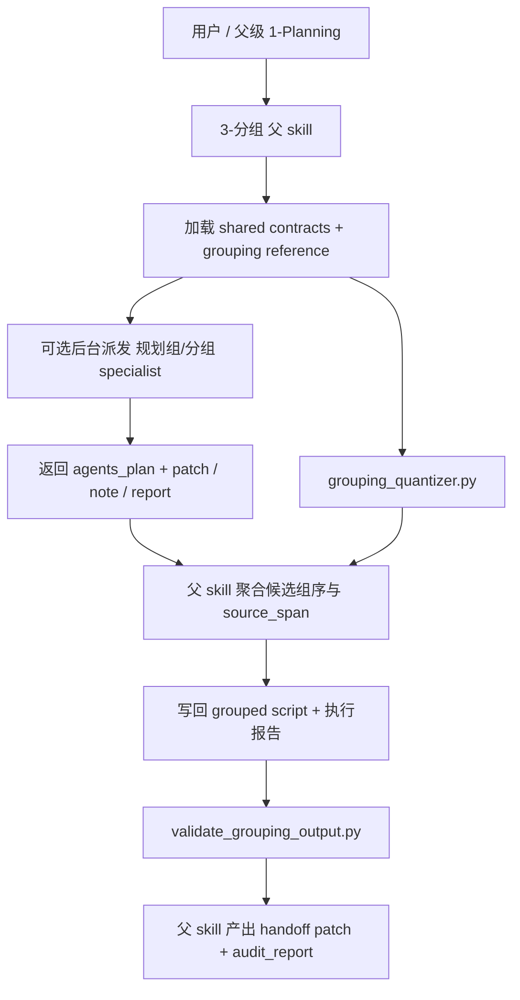
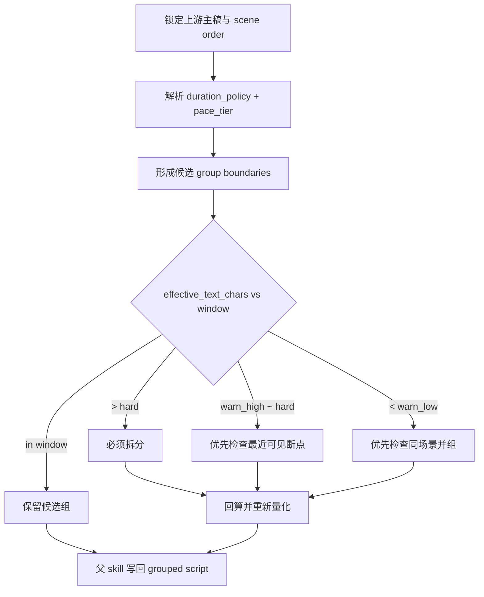
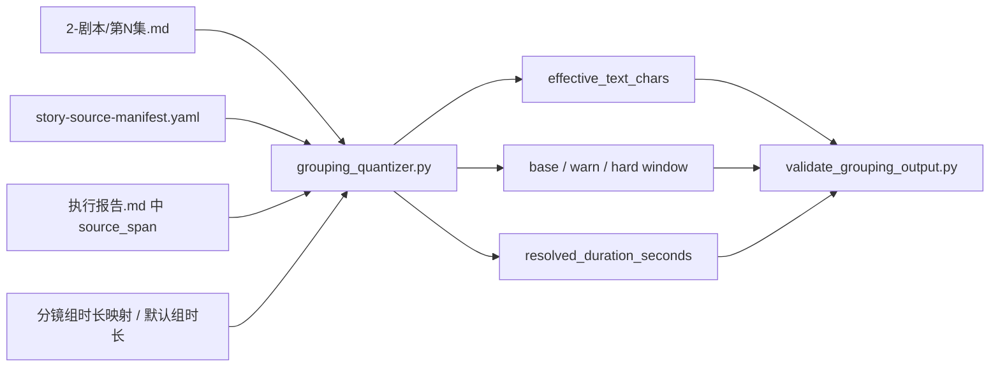

# aigc 3-分组

## Parent Positioning

`3-分组` 是 `1-Planning` 下的阶段级父 skill，不再把自己理解成“一个带 validator 的 leaf 说明书”。

本阶段采用 `skill-subagents` 的单父层治理结构：

- 父 skill 持有唯一总合同、方法论投影、上下文装配、量化脚本、canonical 写回、validator、audit 与 handoff
- 共享规划组 team 只提供调度入口与共享 handoff matrix，不拥有本阶段算法真源
- `规划组/分组.md` 只作为默认 specialist，返回 `agents_plan + patch / note / report`
- `3-分组` 不再新建本地 `team.md`、本地 reviewer 或本地 auditor；当前默认由父 skill 收束审计

这次重构后的结论固定为：

1. 保留共享 team：`.codex/agents/aigc/规划组/team.md`
2. 保留共享 specialist：`.codex/agents/aigc/规划组/分组.md`
3. 不新增本地 sibling subagents，因为当前并不存在足够稳定的多角色分叉收益
4. 若后续持续出现“锁轴继承 / source_span 回算 / handoff 一致性”高风险复发，再考虑为规划组补独立 `auditor`

## Skill / Subagent Governance Rule (Mandatory)

- 父 skill 独占：
  - `Trigger Contract`
  - `Topology Contract`
  - `Context Contract`
  - 场景顺序与时长策略投影
  - `scripts/grouping_quantizer.py` 计算真源
  - `第N集.md + 执行报告.md` 的 canonical 写回
  - `postprocess + validator + audit_report`
- 共享 planning team 只拥有：
  - 后台 subagents 调度入口
  - 共享角色注册
  - 共享 handoff matrix
- `分组` specialist 只拥有：
  - 边界建议
  - 锁轴/依赖/断点判断
  - `agents_plan + patch / note / report`
- 默认显式采用后台 subagents 模式；只有用户要求前台共创、或事实缺失需要即时人工裁决时才转前台阻塞

## Mandatory Canonical Sources

- 强制读取：`../_shared/IO_CONTRACT.md`
- 强制读取：`.agents/skills/aigc/_shared/story-source-contract.md`
- 强制读取：`.agents/skills/aigc/_shared/project-runtime-layout.md`
- 强制读取：`references/scene-order-duration-strategy.md`
- 强制读取：`.codex/agents/aigc/规划组/team.md`
- 强制读取：`.codex/agents/aigc/规划组/分组.md`

真源分工固定为：

- 本 `SKILL.md`：`3-分组` 的父层规范合同
- `references/scene-order-duration-strategy.md`：场景顺序与时长策略的完整方法论投影
- `scripts/grouping_quantizer.py`：量化计算真源
- `scripts/validate_grouping_output.py`：结构 + 量化一致性校验真源
- `templates/grouping-output.template.md`：grouped script 落盘骨架

## Visual Maps







## Trigger Contract

### When To Use

- 需要把 `projects/<项目名>/1-Planning/2-剧本/第N集.md` 收束为 grouped script
- 需要把组边界、组序、锁轴继承与量化字段交给 `2-Global`
- 需要在规划阶段先完成“是否该拆、能不能并、是否过载”的量化裁决
- 需要通过 shared planning team 的 `分组` specialist 获取边界建议，但仍由父 skill 统一落盘与校验

### When Not To Use

- 上游仍停留在 `Story/` 原文，还没有稳定的 `2-剧本/第N集.md`
- 当前任务已经进入导演分镜、帧级时间切分、镜头字段或转场特效
- 当前只想查询状态、续跑或验收，应进入 `query / resume / review`

## Topology Contract (Mandatory)

### Stage-Local Ownership

`3-分组` 的 stage-local 拓扑只由本 skill 持有，不由 shared team 重复定义：

1. 锁输入
2. 可选后台调用 `分组` specialist
3. 父 skill 聚合候选组边界
4. 父 skill 运行量化脚本
5. 父 skill 写回 grouped script 与执行报告
6. 父 skill 运行 validator 与 audit

### Default Routing

- 默认角色：`规划组/分组`
- 可选 reviewer：`规划组/节奏`

`节奏` 只在以下条件满足至少一项时才作为 reviewer 进入：

- 用户显式要求节奏校验或组内节奏预演
- 当前分组会直接影响后续节奏重排
- `group_load_score` 与量化门槛长期冲突，需要额外 reviewer 说明

### Background Subagents Mode

- 只要命中 `分组` specialist，默认后台派发
- 后台 subagent 不拥有写回权
- 父 skill 必须显式聚合 `selected_agents[]`
- 未命中的角色不得补空路径、补空报告、补默认 reasoning

### No Local Team Proliferation

本阶段不新建本地 `team.md`，原因固定为：

- 当前默认只有一个稳定 specialist，尚不足以证明本地多角色拆分收益
- `1-Planning` 已存在共享 planning team，可承接跨阶段 roster 与 handoff matrix
- 若为了“看起来完整”而在本地再复制一层 team，会违反 canonical source governance

## Context Contract (Mandatory)

### Loading Order

1. 根 `AGENTS.md`
2. `.agents/skills/aigc/SKILL.md + CONTEXT.md`
3. `.agents/skills/aigc/1-Planning/SKILL.md + CONTEXT.md`
4. 本 `SKILL.md + CONTEXT.md`
5. `.agents/skills/aigc/_shared/project-runtime-layout.md`
6. `.agents/skills/aigc/_shared/story-source-contract.md`
7. `.agents/skills/aigc/1-Planning/_shared/IO_CONTRACT.md`
8. `references/scene-order-duration-strategy.md`
9. `projects/<项目名>/0-Init/north_star.yaml`
10. `projects/<项目名>/0-Init/init_handoff.yaml`
11. `projects/<项目名>/0-Init/story-source-manifest.yaml`（若存在）
12. `projects/<项目名>/1-Planning/episode-split-plan.json`
13. `projects/<项目名>/1-Planning/2-剧本/第N集.md`
14. 命中 specialist 时，再加载 `.codex/agents/aigc/规划组/team.md + 分组.md`

### Four-Layer Context Model

1. `global charter context`
   - 根 `AGENTS.md`
   - `aigc` 根技能与 `1-Planning` 父技能
2. `task context`
   - 当前项目、当前集、用户要求、不可拆边界、组数偏好
3. `role context`
   - 仅传给 `分组` specialist 的局部上下文包
4. `evidence context`
   - `2-剧本/第N集.md`
   - `story-source-manifest.yaml`
   - `episode-split-plan.json`
   - 已存在的 `执行报告.md` 当前集区块

## Scene Order And Duration Strategy Projection (Mandatory Digest)

完整方法论以 `references/scene-order-duration-strategy.md` 为准；以下内容是本阶段必须执行的 digest，不得降级为“只在 reference 里提一下”。

### 1. 角色定位

- 本阶段只投影“如何量化判断该不该拆、能不能并、是否过载”
- 导演阶段的镜头化、场景标题、空间主键、主体抽取、分镜字段仍由下游承担
- 本阶段不继承导演字段本体，只继承判断机制

### 2. 继承原则

1. 先场景顺序，后组内切分
2. 先时长策略，后负载均衡
3. 先上游 preset/style，再用默认值

优先级固定为：

`用户自然语言 > 局部策略 > 全局策略 > 项目 preset > 默认 15 秒`

### 3. 场景类型字典

仅允许三类主类型：

- `室内`
- `室外`
- `野外`

归并规则：

- 历史 `水域 / 空域` -> `野外`
- 历史 `过渡连接空间` 默认 -> `室外`；若明确命中室内锚点则 -> `室内`

判定优先级：

`明确空间锚点 > 方位词 > 动作语义`

### 4. 节奏与字窗公式

| pace_tier | coefficient | 15秒 base | 15秒 warn | 15秒 hard |
| --- | --- | --- | --- | --- |
| `慢节奏` | `0.7` | `105` | `84-105` | `116` |
| `中节奏` | `1.0` | `150` | `120-150` | `165` |
| `快节奏` | `1.3` | `195` | `156-195` | `215` |

公式固定为：

- `base_text_window = duration_seconds * 10 * pace_coefficient`
- `warn_low = round(base_text_window * 0.8)`
- `warn_high = round(base_text_window * 1.0)`
- `hard_text_window = round(base_text_window * 1.1)`

### 5. 有效字数

若正文已字段化，按下表计算：

| field_type | 匹配规则 | 系数 |
| --- | --- | --- |
| `voice_text` | `对白(*) / 独白(*) / 内心独白(*) / 旁白(*) / 【旁白】` | `1.0` |
| `voice_visual` | `对白画面 / 独白画面 / 内心独白画面 / 旁白画面` | `0.0` |
| `action_visual` | `动作画面` 与未命中上述标题的段落 | `慢0.7 / 中0.5 / 快0.3` |

计算公式：

`effective_text_chars = Σ(去空白字数 × 字段系数)`

若当前阶段没有字段化正文，则允许使用：

- 原文可见字数近似值
- 场景单位数
- 转折点
- 强依赖

但必须在报告中标明“当前为规划估算，不是导演阶段精算”。

### 6. 混合源 / 分镜源的强制回算

当同时满足以下条件时，禁止继续手填估算：

- `primary_story_source.source_type in {storyboard_script, hybrid_story_text}`
- 当前组 `source_span` 可机读出镜号范围

硬规则：

1. `source_span` 必须保留可机读镜号范围，例如 `镜1-5`
2. validator 优先从 `story-source-manifest.yaml -> primary_story_source.path` 回算
3. 若回算值与产物填写值不一致，不得以“规划估算”为由继续通过
4. 只有主故事源不是上述两类，或当前组不能映射镜号范围时，才允许回退规划估算

### 7. 规划阶段必须落地的字段

集级：

- `scene_unit_count`
- `duration_policy`
- `pace_tier`
- `base_text_window`
- `warn_window`
- `hard_text_window`

组级：

- `estimated_duration_seconds`
- `effective_text_chars`
- `window_status`

### 8. 分组时间切分交接协议

当前阶段不直接产出帧级分镜表，但必须给下游保留可消费的组总时长真源。

硬规则：

1. 默认组总时长 `15秒`
2. 非均匀组时长必须显式写入：
   - `默认组时长`
   - `分镜组时长映射`
   - `时长偏离证据`
3. `分镜组时长映射` 只登记偏离默认值的组
4. `分镜组时长映射` 非空时，`时长偏离证据` 必须非空
5. `estimated_duration_seconds` 必须与 `分镜组时长映射 -> 默认组时长` 的解析结果一致

### 9. 规划阶段判定规则

1. `effective_text_chars > hard_text_window` -> 默认失败，必须拆
2. `warn_high < effective_text_chars <= hard_text_window` -> 优先检查最近可见结构断点
3. `effective_text_chars < warn_low` -> 优先检查同场景下一语义单元并组
4. `warn-low / warn-high / error` 只允许存在于候选分析，不允许直接作为正式 `window_status` 落盘
5. `hard_lock / soft_lock` 与量化 gate 冲突时，当前轮判失败并上溯请求显式豁免
6. 默认禁止跨场景凑时长；仅 `快切 / 闪回 / 记忆 / 蒙太奇微场景 / 极短过场` 例外
7. 尾组 `< 5 秒` 且存在前组时，默认并入前组，除非承担明确信息落点

### 10. 与负载分的关系

- `episode_load_score` 与 `group_load_score` 仅保留为规划摘要
- 它们不能覆盖以下硬门槛：
  - 场景顺序
  - 生效时长策略
  - 基准字窗与硬上限
  - 默认不跨场景凑时长
  - 尾组 `< 5 秒` 并组规则

## Script Contract (Mandatory)

### `scripts/grouping_quantizer.py`

职责固定为：

1. 从 grouped script 与执行报告解析 `group_id -> source_span`
2. 解析 `默认组时长 / 分镜组时长映射 / 时长偏离证据`
3. 解析 `pace_tier` 并计算：
   - `base_text_window`
   - `warn_low`
   - `warn_high`
   - `hard_text_window`
4. 按优先级解析组总时长：
   - `分镜组时长映射`
   - `默认组时长`
5. 计算 `effective_text_chars`
6. 当命中镜号范围且主故事源允许时，执行 story-source recompute
7. 输出可供 validator 直接消费的结构化结果

### `scripts/validate_grouping_output.py`

必须同时校验：

- grouped script 结构
- 三段式 `分镜组ID`
- frontmatter window 与 quantizer 一致
- `estimated_duration_seconds` 与 duration mapping 一致
- `effective_text_chars` 与 quantizer 一致或在规划估算容差内
- 混合源 / 分镜源命中镜号范围时的强制回算

### `scripts/postprocess_grouping_output.py`

本阶段默认后处理链为：

`postprocess -> validator`

不再生成默认 machine sidecar；计算逻辑直接由 `grouping_quantizer.py` 提供。

### Script Entry Examples

```bash
python3 .agents/skills/aigc/1-Planning/3-分组/scripts/grouping_quantizer.py \
  --input projects/<项目名>/1-Planning/3-分组/第1集.md --json

python3 .agents/skills/aigc/1-Planning/3-分组/scripts/validate_grouping_output.py \
  --input projects/<项目名>/1-Planning/3-分组/第1集.md
```

## Input Contract

### Required Inputs

- `projects/<项目名>/1-Planning/2-剧本/第N集.md`
- `projects/<项目名>/1-Planning/episode-split-plan.json`
- `projects/<项目名>/0-Init/north_star.yaml`
- `projects/<项目名>/0-Init/init_handoff.yaml`

### Optional Inputs

- `projects/<项目名>/0-Init/story-source-manifest.yaml`
- 用户显式指定的组数、组时长、不可拆模块、优先保留模块
- 既有 `projects/<项目名>/1-Planning/3-分组/执行报告.md`
- 父 skill 已稳定的格式判模结论

### Forbidden Inputs

- 与当前集无关的其他集正文
- 导演阶段镜头级产物
- 把 `development_briefs` 当作主故事源正文

## Handoff Contract (Mandatory)

### Parent -> Specialist

| artifact | 最小字段 |
| --- | --- |
| `mission_brief_grouping` | `project_name, episode_id, objective, hard_constraints, non_goals` |
| `subagent_brief_grouping` | `candidate_scope, user_override, lock_policy, requested_outputs` |
| `context_packet_grouping` | `2-剧本 path, scene anchors, preset locks, story-source summary` |

### Specialist -> Parent

| artifact | 最小字段 | 说明 |
| --- | --- | --- |
| `agents_plan_grouping` | `candidate_groups, rejected_options, boundary_logic` | 思考/规划证据 |
| `plan_patch_grouping` | `group_order, locked_anchor_ids, source_span_candidates` | 结构性 patch |
| `note_grouping` | `conflicts, unresolved_edges, exemption_request` | 局部说明 |
| `report_grouping` | `risk_flags, coverage_gap, downstream_impact` | 风险/返工 |

硬规则：

- specialist 不返回 authoritative `effective_text_chars`
- specialist 不返回最终 `estimated_duration_seconds`
- authoritative 数值计算只能由父 skill 的 quantizer 生成

### Parent -> 1-Planning

本技能返回给父 `1-Planning` 的最小 patch：

- `episode_id`
- `group_count`
- `group_order`
- `locked_anchor_ids`
- `duration_policy`
- `pace_tier`
- `bootstrap_output`
- `upstream_paths`
- `handoff_summary`

## Canonical Output Contract

### A. 分组主稿

路径：

`projects/<项目名>/1-Planning/3-分组/第N集.md`

必须遵守 `templates/grouping-output.template.md`，并至少包含：

- frontmatter
- `【分组正文】`
- 若干 `## 【episode-scene-group】 <分组名>`
- 保留上游 `### 场景N：...` 结构

frontmatter 必填：

- `项目名`
- `集数`
- `上游主稿`
- `bootstrap_output`
- `scene_unit_count`
- `duration_policy`
- `pace_tier`
- `base_text_window`
- `warn_window`
- `hard_text_window`
- `默认组时长`
- `分镜组时长映射`
- `时长偏离证据`
- `group_count`
- `report_ref`
- `generated_at`

### B. 执行报告

路径：

`projects/<项目名>/1-Planning/3-分组/执行报告.md`

每个 `分镜组ID` 至少登记：

- `source_span`
- `estimated_duration_seconds`
- `effective_text_chars`
- `window_status`
- `judgement_basis`

推荐补充：

- `calculation_mode`
- `recompute_source`

### C. Canonical Guardrails

1. `3-分组/第N集.md` 是 grouped script，不是第二份 `2-剧本`
2. 不默认生成 `.grouping.json`、`thinking/` 或其他平行真源
3. 三段式 `分镜组ID` 只表达 `集-场-组`
4. 四段式 `分镜ID` 保留给下游

## Execution Workflow

1. 锁定 `2-剧本/第N集.md` 为唯一上游主稿。
2. 读取 `episode-split-plan.json`、`north_star.yaml`、`init_handoff.yaml` 与 `story-source-manifest.yaml`。
3. 判定是否需要派发 shared `分组` specialist；若当前轮只是确定性写回，可跳过 subagent。
4. 若派发 specialist，默认后台执行，仅收集 `agents_plan + patch / note / report`。
5. 父 skill 根据：
   - 用户显式约束
   - `preset_registry` 锁轴
   - scene order
   - specialist 候选边界
   形成唯一候选组序。
6. 为每组生成三段式 `分镜组ID` 与 `source_span`。
7. 运行 `grouping_quantizer.py` 解析：
   - duration policy
   - pace tier
   - window fields
   - `effective_text_chars`
   - recompute mode
8. 按量化门槛裁决拆分 / 并组 / 保留。
9. 将通过的组边界写回 grouped script。
10. 更新唯一 `执行报告.md` 中当前集区块。
11. 运行 `postprocess_grouping_output.py --input <output>`。
12. 向父 `1-Planning` 返回最小 handoff patch 与 audit 结论。

## Quality And Audit Contract

### Score Matrix

| 维度 | 指标 | 分值 |
| --- | --- | --- |
| 维度0: 契约遵循 | 是否遵守“父 skill 写回 + shared team 调度 + specialist patch-only” | __/10 |
| 维度1 | scene order 是否保持上游顺序 | __/10 |
| 维度2 | 锁轴继承是否正确 | __/10 |
| 维度3 | 量化脚本是否真正参与裁决 | __/10 |
| 维度4 | 组边界是否可解释 | __/10 |
| 维度5 | grouped script 是否保真 | __/10 |
| 维度6 | 执行报告与 frontmatter 是否一致 | __/10 |
| 维度7 | handoff 是否可被 `2-Global` 消费 | __/10 |
| 维度8 | 返工入口与 layered trace 是否完整 | __/10 |

## Field Master

| field_id | 输出位置/字段 | 内容要求 | 默认责任 Step | 质量维度 | 失败码 |
| --- | --- | --- | --- | --- | --- |
| FIELD-GROUP-01 | 阶段治理定位 | 明确父 skill / shared team / specialist 三层边界 | S1 | 分层清晰度 | FAIL-GROUP-01 |
| FIELD-GROUP-02 | 拓扑与后台模式 | 明确 ordered path、后台 subagents、可选 reviewer 条件 | S2 | 编排可执行性 | FAIL-GROUP-02 |
| FIELD-GROUP-03 | 输入与真源 | 锁定 `2-剧本`、manifest、split plan 与 reference 真源 | S3 | 真源一致性 | FAIL-GROUP-03 |
| FIELD-GROUP-04 | 方法论投影 | digest 必须覆盖 scene order、duration、windows、recompute | S4 | 规则完整性 | FAIL-GROUP-04 |
| FIELD-GROUP-05 | 量化脚本 | `grouping_quantizer.py` 必须成为计算真源 | S5 | 计算可执行性 | FAIL-GROUP-05 |
| FIELD-GROUP-06 | grouped script 主稿 | 只在正文内插入组标题，保持正文保真 | S6 | 输出正确性 | FAIL-GROUP-06 |
| FIELD-GROUP-07 | 执行报告与 handoff | 组级报告字段、父级 patch 与 duration mapping 一致 | S7 | handoff 可消费性 | FAIL-GROUP-07 |
| FIELD-GROUP-08 | 审计闭环 | validator、triad closure、返工入口完整 | S8 | 审计完整性 | FAIL-GROUP-08 |
| FIELD-GROUP-09 | team/parent 联动 | `1-Planning` 与 shared team 已同步新的 stage-local ownership | S9 | 同步完整性 | FAIL-GROUP-09 |

## Thought Pass Map

| step_id | 聚焦字段 | 核心问题 | 生成动作 | 未达标信号 |
| --- | --- | --- | --- | --- |
| S1 | FIELD-GROUP-01 | 当前谁拥有本阶段真源与写回权 | 锁定父 skill / team / specialist 边界 | specialist 被写成第二主合同 |
| S2 | FIELD-GROUP-02 | 本轮是否派发 subagent、是否后台执行 | 写出 ordered path 与 reviewer 触发条件 | 写了 subagent 却没后台模式 |
| S3 | FIELD-GROUP-03 | 输入和 reference 真源是否唯一 | 锁 `2-剧本`、manifest、split plan、reference | 临时猜路径或跳过 manifest |
| S4 | FIELD-GROUP-04 | 方法论是否真的进入主合同 | 写 digest 与 hard rules | 只把方法塞进 reference |
| S5 | FIELD-GROUP-05 | 量化是否由脚本负责 | 接入 quantizer 与 recompute | 仍靠手填 `effective_text_chars` |
| S6 | FIELD-GROUP-06 | grouped script 如何落盘 | 插入三段式标题并保留正文 | 又写成摘要板 |
| S7 | FIELD-GROUP-07 | 执行报告与 handoff 如何对齐 | 固化组级字段与 parent patch | 报告只写描述不写指标 |
| S8 | FIELD-GROUP-08 | 如何验收与追因 | 运行 validator 并输出 triad | 只有通过/失败，没有 trace |
| S9 | FIELD-GROUP-09 | 父 skill 与 team 是否同步 | 回写 `1-Planning` 与 planning team | stage-local ownership 漂移 |

## Pass Table

| field_id | Pass Standard | Fail Code | Rework Entry |
| --- | --- | --- | --- |
| FIELD-GROUP-01 | 父 skill、shared team、specialist 的边界与写回权明确 | FAIL-GROUP-01 | S1 |
| FIELD-GROUP-02 | 默认后台 subagents 模式、ordered path 与 reviewer 触发条件明确 | FAIL-GROUP-02 | S2 |
| FIELD-GROUP-03 | 输入真源、reference 真源与输出真源不冲突 | FAIL-GROUP-03 | S3 |
| FIELD-GROUP-04 | 场景顺序与时长策略的核心规则已进入主合同 | FAIL-GROUP-04 | S4 |
| FIELD-GROUP-05 | 量化与回算由脚本执行，不再停留于手填说明 | FAIL-GROUP-05 | S5 |
| FIELD-GROUP-06 | grouped script 保持正文保真、标题三段式稳定 | FAIL-GROUP-06 | S6 |
| FIELD-GROUP-07 | 执行报告、duration mapping 与 parent handoff 一致 | FAIL-GROUP-07 | S7 |
| FIELD-GROUP-08 | validator、返工入口、triad closure 与 layered trace 完整 | FAIL-GROUP-08 | S8 |
| FIELD-GROUP-09 | 父 skill 与 shared team 已同步新的 stage-local ownership | FAIL-GROUP-09 | S9 |

## Root-Cause Execution Contract (Mandatory)

当出现以下问题时，必须先修源层：

- `3-分组` 又退化成“有一个分组 agent 的 leaf 说明书”
- shared team 抢写 stage-local topology
- `effective_text_chars` 回到手填
- 混合源 / 分镜源命中镜号范围却没做回算
- `group_load_score` 反向推翻硬门槛
- `3-分组` 又长出 sidecar 平行真源

必经链路：

`Symptom -> Direct Technical Cause -> Rule Source -> Meta Rule Source -> Fix Landing Points`

优先检查：

- `Rule Source`
  - `.agents/skills/aigc/1-Planning/3-分组/SKILL.md`
  - `references/scene-order-duration-strategy.md`
  - `scripts/grouping_quantizer.py`
  - `scripts/validate_grouping_output.py`
  - `templates/grouping-output.template.md`
  - `.codex/agents/aigc/规划组/team.md`
  - `.codex/agents/aigc/规划组/分组.md`
- `Meta Rule Source`
  - 根 `AGENTS.md`
  - `.agents/skills/aigc/1-Planning/SKILL.md`
  - `skill-subagents`

面向用户的闭环固定返回：

1. root cause location
2. immediate fix
3. systemic prevention fix

## Completion Criteria

- `3-分组` 已明确成为 stage-local parent skill，而不是单纯 leaf 说明书
- 已明确保留 shared planning team + `分组` specialist，不新增本地 team
- 核心方法论已进入 `SKILL.md` digest，并继续回链到完整 reference
- `grouping_quantizer.py` 已成为量化真源
- grouped script 与执行报告仍是唯一 canonical 输出
- parent / team / specialist 的 handoff 与 audit 边界已同步
- `postprocess + validator` 已能校验结构与量化一致性
