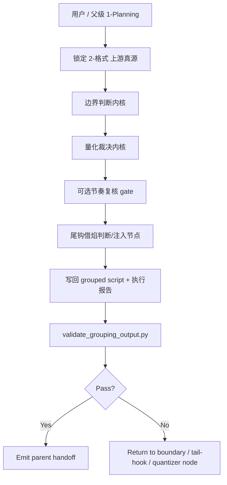
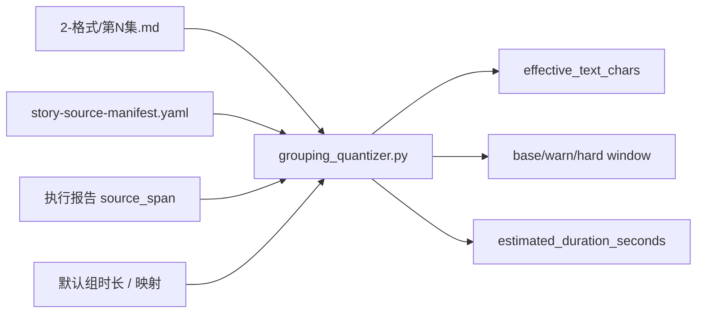
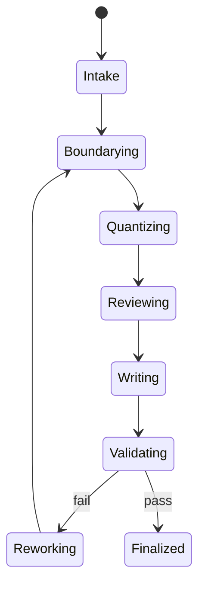

# aigc 3-分组

## Parent Positioning

`3-分组` 是 `1-Planning` 下的 stage-local parent skill。

当前固定口径：

- 本阶段父 skill 自己持有拓扑、量化、validator、写回与节奏复核 gate
- 不再依赖任何已废弃旧规划组的 team / specialist / reviewer 文档
- 若需要“specialist / reviewer”能力，只能以内化节点或局部证据卡存在，不再占有独立外部真源

## Internal Capability Fusion Contract (Mandatory)

| 内化能力面 | 当前 owner | 作用 |
| --- | --- | --- |
| `分组边界判断内核` | 本 `SKILL.md` | 形成候选组界、锁轴、断点与 `source_span` |
| `量化裁决内核` | `scripts/grouping_quantizer.py` + 本 `SKILL.md` | 计算 `effective_text_chars / window` 并决定拆并 |
| `节奏复核内核` | 本 `SKILL.md` | 仅在需要时给出保序/重排影响说明，不直接改写组边界真相 |
| `尾钩借焰内核` | 本 `SKILL.md` + `postprocess_grouping_output.py` | 在分组结果落定后，于非末组尾部以隐藏标记借入下一组开端的首个叙事拍点，形成预映衔接 |
| `主稿落盘与校验` | 本 `SKILL.md` + `validate_grouping_output.py` | 写回 grouped script 与执行报告并做出口门检 |

硬规则：

1. `3-分组` 必须能在不读取任何已废弃旧规划组文档的情况下独立执行。
2. authoritative 数值只允许来自 quantizer，不允许人工说明替代。
3. 节奏复核只做 reviewer gate，不抢占 grouped script 写回权。
4. `尾钩借焰` 只在分组结果落定后追加展示性预映，不改写本组 `source_span`、组序或 authoritative 量化结果。

## Mandatory Canonical Sources

- 强制读取：`../_shared/IO_CONTRACT.md`
- 强制读取：`.agents/skills/aigc/_shared/story-source-contract.md`
- 强制读取：`.agents/skills/aigc/_shared/project-runtime-layout.md`
- 强制读取：`references/scene-order-duration-strategy.md`

真源分工：

- 本 `SKILL.md`：`3-分组` 父层规范合同
- `references/scene-order-duration-strategy.md`：场景顺序与时长策略方法论
- `scripts/grouping_quantizer.py`：量化计算真源
- `scripts/validate_grouping_output.py`：结构 + 量化一致性校验真源
- `templates/grouping-output.template.md`：grouped script 落盘骨架

## Visual Maps







## Trigger Contract

### When To Use

- 需要把 `projects/aigc/<项目名>/1-Planning/2-格式/第N集.md` 收束为 grouped script
- 需要为 `2-Global` 准备组边界、量化字段与 handoff
- 需要先判断“该不该拆、能不能并、是否过载”

### When Not To Use

- 上游还没有稳定的 `2-格式/第N集.md`
- 当前任务已经进入导演分镜、帧级切分或镜头字段阶段

## Topology Contract (Mandatory)

### Stage-Local Ownership

1. 锁输入
2. 判断候选组边界
3. 运行量化裁决
4. 必要时进入节奏复核 gate
5. 写回 grouped script 与执行报告
6. 运行 validator 与 handoff

### Reviewer Gate

只有满足以下条件至少一项时，才进入内部节奏复核：

- 用户显式要求节奏校验或组内节奏预演
- 当前分组会直接影响后续节奏重排
- `group_load_score` 与量化门槛长期冲突，需要额外 reviewer 说明

## Thinking-Action Node Contract (Mandatory)

每个关键节点必须同时描述判断与动作，至少覆盖以下槽位：

| slot | 要求 |
| --- | --- |
| `node_id` | 稳定节点标识 |
| `objective` | 该节点要解决的判断/动作目标 |
| `inputs` | 进入该节点的输入与依赖 |
| `actions` | 该节点真正执行的动作 |
| `evidence` | 该节点留下的证据、产物或验证结果 |
| `route_out` | 成功、失败、分支时分别流向何处 |
| `gate` | 是否允许进入最终汇流 |

## Thinking-Action Node Network

| node_id | 对应 Step | 聚焦字段 | objective | actions | evidence | route_out | gate |
| --- | --- | --- | --- | --- | --- | --- | --- |
| `N1-INPUT-LOCK` | `S1` | `FIELD-GROUP-01` | 锁定唯一上游主稿与当前集范围 | 读取 `2-格式/第N集.md`、`episode-split-plan.json`、`north_star.yaml`、`init_handoff.yaml`、manifest | 输入清单、episode scope、上游锚点 | 成功 -> `N2`；输入漂移 -> 回到 `S1` | 输入真源唯一后方可继续 |
| `N2-BOUNDARY-SOLVE` | `S2` | `FIELD-GROUP-02` | 形成唯一候选组序、组界与 `source_span` | 识别场景顺序、结构断点、并组/拆组候选，排除无证据切口 | 组界表、`source_span`、边界说明 | 成功 -> `N3`；边界不稳 -> 回到 `S2` | 组界稳定后方可量化 |
| `N3-CANONICAL-QUANTIZE` | `S3` | `FIELD-GROUP-03` | 对当前候选分组执行 authoritative 量化 | 运行 quantizer 计算 `estimated_duration_seconds / base_text_window / effective_text_chars`，判断过载/过轻 | quantizer 数值、window verdict、返工信号 | 成功 -> `N4`；超载/失配 -> 回到 `S2/S3` | authoritative 数值形成后方可进入复核 |
| `N4-RHYTHM-REVIEW` | `S4` | `FIELD-GROUP-04` | 在必要时补充节奏 reviewer note | 仅在命中 reviewer gate 时补充节奏影响说明，不改写组界与量化真相 | reviewer note / skip 结论 | skip -> `N5`；review 完成 -> `N5` | reviewer 不能直接汇流 |
| `N5-TAIL-HOOK-DECIDE` | `S5` | `FIELD-GROUP-05` | 判断当前组在量化结果落定后是否允许进入 `尾钩借焰` | 检查是否非末组、下一组是否存在首个叙事拍点、是否应跳过尾钩 | tail-hook eligibility、跳过理由 | enable -> `N6`；skip -> `N7`；缺拍点 -> 回到 `S5` | 未通过门禁不得注入尾钩 |
| `N6-TAIL-HOOK-INJECT` | `S5` | `FIELD-GROUP-05` | 执行隐藏尾钩注入 | 通过 `postprocess_grouping_output.py` 注入隐藏标记，借入下一组首拍，但不回流 authoritative 量化 | 隐藏标记、借入正文、注入结果 | 成功 -> `N7`；注入失败 -> 回到 `S5` | 注入完成后方可写回 |
| `N7-WRITEBACK` | `S6` | `FIELD-GROUP-06` | 写回 grouped script 与执行报告 | 落盘 `第N集.md` 与 `执行报告.md`，确保报告只登记 canonical 量化结果 | 文件落盘证据、报告字段 | 成功 -> `N8`；结构或报告错 -> 回到 `S6` | 写回完成后方可验收 |
| `N8-QA-CONVERGENCE` | `S7` | `FIELD-GROUP-07` | 运行 validator 并收束返工入口 | 调 `validate_grouping_output.py` 校验结构、回指与量化一致性 | validator verdict、PASS/FAIL、返工入口 | pass -> `N9`；fail -> 对应返工节点 | 通过前不得进入 handoff |
| `N9-HANDOFF` | `S7` | `FIELD-GROUP-07` | 生成父级 handoff | 回传 grouped script、执行报告与最小 parent-consumable patch | handoff patch / report / note | `done` | 最终汇流点 |

## Convergence Contract (Mandatory)

只有同时满足以下条件，`3-分组` 才允许宣布完成：

1. `FIELD-GROUP-01` 到 `FIELD-GROUP-07` 全部已落位
2. `source_span`、组序与场景顺序一致
3. authoritative 量化结果只来自尾钩注入前的 canonical 分组正文
4. 若命中 `尾钩借焰`，则隐藏标记与借入正文已落盘，但不改变 canonical 量化结果
5. `第N集.md` 与 `执行报告.md` 已同时落盘
6. validator 已明确返回通过

若未满足：

- 输入问题 -> 回到 `N1-INPUT-LOCK`
- 组界问题 -> 回到 `N2-BOUNDARY-SOLVE`
- canonical 量化问题 -> 回到 `N3-CANONICAL-QUANTIZE`
- reviewer 越权或缺口 -> 回到 `N4-RHYTHM-REVIEW`
- 尾钩门禁/首拍问题 -> 回到 `N5-TAIL-HOOK-DECIDE`
- 尾钩注入问题 -> 回到 `N6-TAIL-HOOK-INJECT`
- 输出/报告问题 -> 回到 `N7-WRITEBACK`

## Context Contract (Mandatory)

### Loading Order

1. 根 `AGENTS.md`
2. `.agents/skills/aigc/SKILL.md + CONTEXT.md`
3. `.agents/skills/aigc/1-Planning/SKILL.md + CONTEXT.md`
4. 本 `SKILL.md + CONTEXT.md`
5. `.agents/skills/aigc/_shared/project-runtime-layout.md`
6. `.agents/skills/aigc/_shared/story-source-contract.md`
7. `.agents/skills/aigc/1-Planning/_shared/IO_CONTRACT.md`
8. `references/scene-order-duration-strategy.md`
9. `projects/aigc/<项目名>/0-Init/north_star.yaml`
10. `projects/aigc/<项目名>/0-Init/init_handoff.yaml`
11. `projects/aigc/<项目名>/0-Init/story-source-manifest.yaml`（若存在）
12. `projects/aigc/<项目名>/1-Planning/episode-split-plan.json`
13. `projects/aigc/<项目名>/1-Planning/2-格式/第N集.md`

## Scene Order And Duration Strategy Projection (Mandatory Digest)

完整方法论以 `references/scene-order-duration-strategy.md` 为准；本阶段必须执行的 digest：

1. 先锁定上游场景单位顺序，后裁决分镜组边界
2. 先时长策略，后负载均衡
3. 先上游 preset/style，再用默认值
4. 若无用户或上游显式时长证据，不得通过人为抬高 `分镜组时长映射` 来让既定叙事划分过窗；必须先拆/并组，再决定是否需要显式豁免
5. `effective_text_chars > hard_text_window` 默认失败，必须拆；若存在用户、上游或下游显式锁定的 `分镜组ID / 分镜ID`，必须先上溯请求豁免，不得静默改组
6. `effective_text_chars < warn_low` 只触发并组检查，不自动取消分镜组；若该组已被 `2-Global / 3-Detail` 固定镜数、beat 或四段式 `分镜ID` 消费，必须保留组界并在报告中登记锁定依据
7. 默认禁止跨物理场景链凑时长；相邻上游场景单位若仍属同一连续物理场景，可在保留原 `### 场景N` 标题的前提下并入同一分镜组
8. 尾组 `< 5 秒` 且存在前组时，默认并入前组，除非承担明确信息落点
9. 命中 `尾钩借焰` 时，只允许在分组结果落定后，于非末组尾部追加下一组开端的首个叙事拍点；该借入段落不参与本组字窗裁决

### Scene / Group Semantic Boundary

- `### 场景N：...` 是从 `2-格式/第N集.md` 继承的上游场景单位锚点；`3-分组` 只能原样搬运，不得改名、重编号或用分组标题替换。
- `## 【episode-scene-group】 <分组名>` 是分镜组边界；分组名描述本组节拍，不是新的场景标题。
- `分镜组ID` 第二段表示本组起始上游场景单位编号，第三段表示该起始场景单位内的分组序号；它不声明导演阶段的物理空间主键。
- 物理场景链只作为拆并判断证据进入 `judgement_basis`，不得反向改写 `### 场景N` 标题；真正的空间主键、场景类型和镜头化字段由后继导演/分镜阶段持有。

### Locked Group Boundary Precedence

- `分镜组ID` 是下游四段式 `分镜ID` 的前三段；一旦下游已生成 `分镜ID / beat_refs / 固定镜数 / 分镜明细`，该组界默认视为锁定边界。
- 锁定边界的优先级高于 `warn_low` 并组建议；不得为了让字窗更饱满而取消、合并或重编号已锁定分镜组。
- 若锁定边界与 `hard_text_window` 冲突，当前阶段必须失败并上溯请求显式豁免或下游重排授权；不得本地静默改写 `分镜组ID`。
- 回刷历史产物时，必须先扫描 `2-Global` 与 `3-Detail` 是否已有相同 `group_id` 或四段式 `分镜ID`，再决定是否允许并组。

## Script Contract (Mandatory)

### `scripts/grouping_quantizer.py`

职责固定为：

1. 从 grouped script 与执行报告解析 `group_id -> source_span`
2. 解析 `默认组时长 / 分镜组时长映射 / 时长偏离证据`
3. 计算 `base_text_window / warn_low / warn_high / hard_text_window`
4. 计算 `estimated_duration_seconds`
5. 计算 `effective_text_chars`
6. 当命中镜号范围且主故事源允许时，执行 story-source recompute
7. 量化阶段必须先排除 `尾钩借焰`，先对 canonical 分组正文完成 authoritative 裁决
8. `尾钩借焰` 只作为分组结果落定后的展示增强，不得回流修改 `effective_text_chars`

### `scripts/postprocess_grouping_output.py`

职责固定为：

1. 在分组结果落定后，为每个非末组自动追加 `尾钩借焰`
2. 借入内容只允许取下一组开端的首个叙事拍点：
   - `动作画面` 取单行
   - `对白/独白/内心独白/旁白` 取文本行，并尽量连带其紧随的 `*画面` 行
3. `尾钩借焰` 标记必须以隐藏注释显式回指下一组 `group_id`
4. 该区块默认位于组尾，可见输出只保留借入正文，不保留可见标题，也不参与量化

### `scripts/validate_grouping_output.py`

必须同时校验：

- grouped script 结构
- 三段式 `分镜组ID`
- 输出中的 `### 场景N：...` 必须能回读 `上游主稿` 并与 `2-格式` 的场景编号和标题逐项一致，不得由分组阶段生成第二套场景标题
- `尾钩借焰` 只能出现在非末组尾部，且必须显式回指下一组
- frontmatter window 与 quantizer 一致
- `estimated_duration_seconds / effective_text_chars` 与 quantizer 一致
- `effective_text_chars > hard_text_window` 必须失败；低于 `warn_low` 或高于 `warn_high` 的通过结果必须在 `judgement_basis` 写明拆并检查依据或锁定 `分镜组ID / 分镜ID` 证据
- mixed-source 命中镜号范围时的强制回算

## Input Contract

### Required Inputs

- `projects/aigc/<项目名>/1-Planning/2-格式/第N集.md`
- `projects/aigc/<项目名>/1-Planning/episode-split-plan.json`
- `projects/aigc/<项目名>/0-Init/north_star.yaml`
- `projects/aigc/<项目名>/0-Init/init_handoff.yaml`

### Optional Inputs

- `projects/aigc/<项目名>/0-Init/story-source-manifest.yaml`
- 用户显式指定的组数、组时长、不可拆模块、优先保留模块
- 既有 `projects/aigc/<项目名>/1-Planning/3-分组/执行报告.md`

## Canonical Output Contract

### A. 分组主稿

路径：

`projects/aigc/<项目名>/1-Planning/3-分组/第N集.md`

必须遵守 `templates/grouping-output.template.md`，并至少包含：

- frontmatter
- `【分组正文】`
- 若干 `## 【episode-scene-group】 <分组名>`
- 原样保留上游 `### 场景N：...` 结构；分组标题不得改写为场景标题
- 默认在非末组尾部追加以下隐藏可机读区块；仅在用户明确禁用时才跳过：

```md
<!-- tail-hook: from=<下一组ID> -->
<下一组开端的首个叙事拍点>
```

硬规则：

1. `尾钩借焰` 不改写本组 `source_span`
2. `尾钩借焰` 不得替代下一组自身开场
3. 末组不得追加 `尾钩借焰`
4. 每组最多一个 `尾钩借焰`
5. `尾钩借焰` 的可见正文只服务组间牵引，不参与最终字窗裁决

### B. 执行报告

路径：

`projects/aigc/<项目名>/1-Planning/3-分组/执行报告.md`

每个 `分镜组ID` 至少登记：

- `source_span`
- `estimated_duration_seconds`
- `effective_text_chars`
- `window_status`
- `judgement_basis`

## Execution Workflow

1. 锁定 `2-格式/第N集.md` 为唯一上游主稿。
2. 读取 `episode-split-plan.json`、`north_star.yaml`、`init_handoff.yaml` 与 `story-source-manifest.yaml`。
3. 形成唯一候选组序与组边界。
4. 运行 quantizer 得到 authoritative 数值。
5. 若满足 reviewer 条件，再追加节奏复核说明。
6. 在 authoritative 分组结果落定后，默认通过 `postprocess_grouping_output.py` 写入隐藏 `尾钩借焰` 标记；仅在明确禁用时才使用 `--skip-tail-hook` 跳过。
7. 写回 grouped script 与执行报告。
8. 运行 validator，失败则回退到边界、尾钩或量化节点。
9. 生成父级 handoff。

## Field Master

| field_id | 输出位置/字段 | 内容要求 | 默认责任 Step | 质量维度 | 失败码 |
| --- | --- | --- | --- | --- | --- |
| `FIELD-GROUP-01` | 输入锚点 | 锁定 `2-格式/第N集.md` 与相关索引 | `S1` | 输入真源一致性 | `FAIL-GROUP-01` |
| `FIELD-GROUP-02` | 候选组界 | 形成唯一候选组序、组界与 `source_span` | `S2` | 结构稳定性 | `FAIL-GROUP-02` |
| `FIELD-GROUP-03` | 量化裁决 | 通过 quantizer 得到 authoritative 数值 | `S3` | 量化正确性 | `FAIL-GROUP-03` |
| `FIELD-GROUP-04` | reviewer gate | 仅在需要时补节奏影响说明 | `S4` | 复核边界清晰度 | `FAIL-GROUP-04` |
| `FIELD-GROUP-05` | `尾钩借焰` | 仅在分组结果落定后，于非末组尾部追加下一组首拍预映 | `S5` | 组间牵引稳定性 | `FAIL-GROUP-05` |
| `FIELD-GROUP-06` | 主稿落盘 | 写 grouped script 与执行报告 | `S6` | 输出完整性 | `FAIL-GROUP-06` |
| `FIELD-GROUP-07` | validator | 运行结构/量化校验并收敛返工入口 | `S7` | 闭环完整性 | `FAIL-GROUP-07` |

## Thought Pass Map

| step_id | 聚焦字段 | 核心问题 | 生成动作 | 未达标信号 |
| --- | --- | --- | --- | --- |
| `S1` | `FIELD-GROUP-01` | 上游主稿是否唯一 | 锁定输入与当前集范围 | 直接读取非 `2-格式` 主稿 |
| `S2` | `FIELD-GROUP-02` | 组界如何成立 | 输出候选组界与 `source_span` | 只给抽象说明不落边界 |
| `S3` | `FIELD-GROUP-03` | 是否该拆/能并/是否过载 | 运行 quantizer | 继续手填说明性数字 |
| `S4` | `FIELD-GROUP-04` | 是否需要节奏 reviewer | 判断并补 reviewer note | 在默认场景滥开 reviewer |
| `S5` | `FIELD-GROUP-05` | 是否需要 `尾钩借焰` | 先做尾钩门禁判断，再执行隐藏注入 | 尾钩反向污染 authoritative 量化 |
| `S6` | `FIELD-GROUP-06` | grouped script 如何落盘 | 写 grouped script + 执行报告 | 只返摘要稿 |
| `S7` | `FIELD-GROUP-07` | 输出是否通过质量门 | 跑 validator 并返工 | validator 失败仍宣告完成 |

## Pass Table

| field_id | Pass Standard | Fail Code | Rework Entry |
| --- | --- | --- | --- |
| `FIELD-GROUP-01` | 输入只来自 `2-格式` 主稿 | `FAIL-GROUP-01` | `S1` |
| `FIELD-GROUP-02` | 组界、组序与 `source_span` 明确 | `FAIL-GROUP-02` | `S2` |
| `FIELD-GROUP-03` | authoritative 数值全部来自 quantizer | `FAIL-GROUP-03` | `S3` |
| `FIELD-GROUP-04` | reviewer gate 只在必要时触发 | `FAIL-GROUP-04` | `S4` |
| `FIELD-GROUP-05` | `尾钩借焰` 只出现在非末组尾部，显式回指下一组，且不改变 authoritative 数值 | `FAIL-GROUP-05` | `S5` |
| `FIELD-GROUP-06` | grouped script 与执行报告都已落盘 | `FAIL-GROUP-06` | `S6` |
| `FIELD-GROUP-07` | validator 通过或失败项已明确返工 | `FAIL-GROUP-07` | `S7` |

## Root-Cause Execution Contract (Mandatory)

当 `3-分组` 出现以下问题时，必须先修源层：

- 又回到外部 planning group specialist/reviewer 文档
- quantizer 与 validator 之间出现双重真相
- grouped script 退化成摘要说明稿
- reviewer 越权修改 authoritative 组边界

必经链路：

`Symptom -> Direct Technical Cause -> Rule Source -> Meta Rule Source -> Fix Landing Points`

优先检查：

- `Rule Source`
  - `.agents/skills/aigc/1-Planning/3-分组/SKILL.md`
  - `.agents/skills/aigc/1-Planning/3-分组/CONTEXT.md`
  - `.agents/skills/aigc/1-Planning/3-分组/references/scene-order-duration-strategy.md`
  - `.agents/skills/aigc/1-Planning/3-分组/scripts/grouping_quantizer.py`
  - `.agents/skills/aigc/1-Planning/3-分组/scripts/validate_grouping_output.py`
- `Meta Rule Source`
  - `AGENTS.md`
  - `.agents/skills/aigc/1-Planning/SKILL.md`
  - `.agents/skills/aigc/_shared/project-runtime-layout.md`

面向用户的闭环固定返回：

1. root cause location
2. immediate fix
3. systemic prevention fix

## Completion Criteria

- 已去除对已废弃旧规划组文档的运行依赖
- 已保留 grouped script + 执行报告 + quantizer + validator 闭环
- 已把节奏复核收回 reviewer gate，而非外部第二真源
