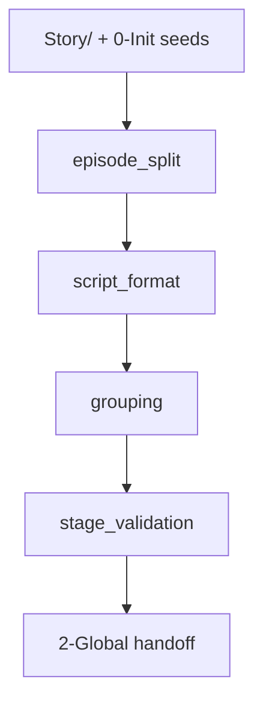
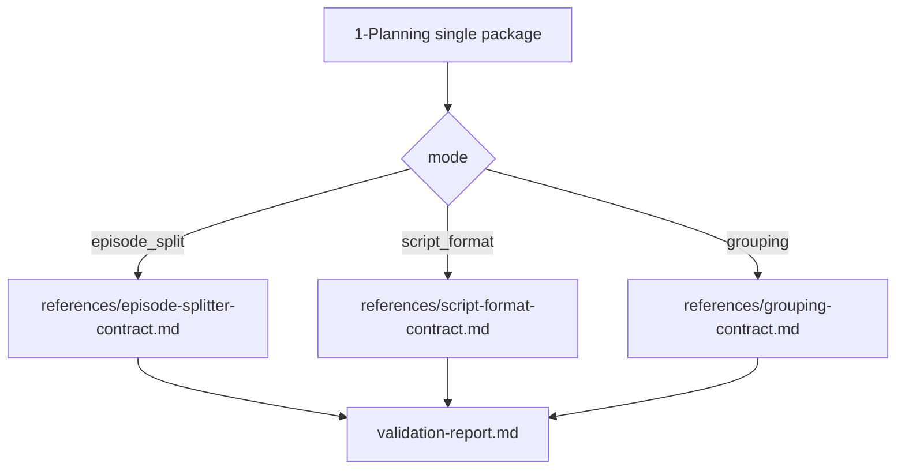

# aigc 1-Planning

## Context Loading Contract

- 每次调用本技能时，必须同时加载同目录 `CONTEXT.md` 作为预加载上下文。
- 若当前任务绑定 `projects/aigc/<项目名>/`，还必须先加载项目根 `MEMORY.md`，再按需加载项目根 `CONTEXT/` 中与规划阶段相关的上下文。
- 若同目录 `CONTEXT.md` 缺失，应先补齐最小知识库骨架，或向用户明确报告阻塞；不得在未检查该上下文的情况下执行技能。
- 冲突优先级：用户显式请求 > 仓库/全局 `AGENTS.md` > `.agents/skills/aigc/SKILL.md` > 本 `SKILL.md` > `references/`、`steps/`、`types/`、`review/` > 项目级 `MEMORY.md` > 项目级 `CONTEXT/` > 本 `CONTEXT.md` > `knowledge-base/`。

## Positioning

`1-Planning` 是 `aigc` 技能树在 `0-Init` 之后、`2-Global` 之前的规划阶段唯一 Skill 2.0 包。

本次融合后的稳定链路仍是：

`Story/ -> 分集模式 -> 格式模式 -> 分组模式 -> validation-report.md -> 2-Global`

硬规则：

1. `.agents/skills/aigc/1-Planning/1-分集`、`2-格式`、`3-分组` 不再作为独立 `SKILL.md` 包存在。
2. 原三包细则完整保留并增强在 `references/`：
   - `references/episode-splitter-contract.md`
   - `references/script-format-contract.md`
   - `references/grouping-contract.md`
3. 原三包经验层迁入 `knowledge-base/`，不再作为独立 sibling `CONTEXT.md`。
4. 原脚本与模板统一收归 `scripts/` 与 `templates/`，由本包单一入口调度。
5. 项目 runtime 输出目录不随技能包融合而合并，仍保留 `projects/aigc/<项目名>/1-Planning/1-分集/`、`2-格式/`、`3-分组/` 的业务落盘边界。

## Input Contract (Mandatory)

`1-Planning` 的入口只咬住“项目源、上游阶段种子、规划阶段已发生产物”。具体判断、拆分、格式化、分组过程全部导向 `references/`、`steps/`、`types/` 与 `review/`。

### Required Stage Inputs

| input_id | 输入位置 | 适用模式 | 作用 | 缺失处理 |
| --- | --- | --- | --- | --- |
| `INPUT-PLAN-ROOT` | `projects/aigc/<项目名>/` | all | 绑定项目 runtime 根 | 无项目根时不得写项目产物 |
| `INPUT-INIT-NORTH-STAR` | `projects/aigc/<项目名>/0-Init/north_star.yaml` | all project modes | 项目方向、范围和约束 | 缺失则进入 `repair` 或返回阻塞 |
| `INPUT-INIT-HANDOFF` | `projects/aigc/<项目名>/0-Init/init_handoff.yaml` | all project modes | 上游初始化 handoff | 缺失则进入 `repair` 或返回阻塞 |
| `INPUT-STORY-SOURCE` | `projects/aigc/<项目名>/Story/` | `episode_split`、`full_chain` | 故事正文与源材料 | 不得用治理文档替代正文 |
| `INPUT-STORY-MANIFEST` | `projects/aigc/<项目名>/0-Init/story-source-manifest.yaml` | `episode_split`、`full_chain` | 输入索引、readiness、`source_profile` | 可保守降级，但必须报告缺口 |
| `INPUT-SPLIT-SOURCE` | `projects/aigc/<项目名>/1-Planning/1-分集/第N集.md` | `script_format`、`full_chain` | 逐集原文真源 | 不得回退到 `Story/` 自由重切 |
| `INPUT-SPLIT-PLAN` | `projects/aigc/<项目名>/1-Planning/episode-split-plan.json` | `script_format`、`grouping`、`stage_validation` | 分集边界和 handoff 索引 | 缺失则回到 `episode_split` 或阻塞 |
| `INPUT-FORMATTED-SCRIPT` | `projects/aigc/<项目名>/1-Planning/2-格式/第N集.md` | `grouping`、`stage_validation` | 规划阶段逐集主稿 | 不得用 `1-分集` 或 `3-分组` 替代 |
| `INPUT-GROUPED-SCRIPT` | `projects/aigc/<项目名>/1-Planning/3-分组/第N集.md` | `stage_validation` | grouped script 与组边界证据 | 缺失则只验收已发生模式 |

### Input Precedence

1. 用户显式指定路径或范围优先。
2. 已存在的上游规划产物优先于重新读取更早源材料。
3. `story-source-manifest.yaml` 是输入索引与 readiness 证据，不替代故事正文。
4. `script_format` 只消费 `1-分集` 输出物；`grouping` 只消费 `2-格式` 主稿。
5. 未命中模式的输入不得被硬凑、补空或伪造成 ready。

## Output Contract (Mandatory)

`1-Planning` 的出口只咬住“规划阶段可交付产物 + 阶段验收 handoff”。每个输出只能由本包命中的 mode 写入；未执行 mode 不得出现在最终完成声明中。

### Required output

| output_id | 输出位置 | owner mode | 内容要求 | 下游消费者 |
| --- | --- | --- | --- | --- |
| `OUTPUT-SPLIT-SOURCE` | `projects/aigc/<项目名>/1-Planning/1-分集/第N集.md` | `episode_split` | 逐集原文真源，只切分不改写 | `script_format` |
| `OUTPUT-SPLIT-REPORT` | `projects/aigc/<项目名>/1-Planning/1-分集/执行报告.md` | `episode_split` | 输入清单、readiness、边界、coverage、返工入口 | 父级验收 |
| `OUTPUT-SPLIT-PLAN` | `projects/aigc/<项目名>/1-Planning/episode-split-plan.json` | `episode_split` | `source_profile`、`bootstrap_output`、边界索引 | `script_format`、`2-Global` |
| `OUTPUT-SCRIPT` | `projects/aigc/<项目名>/1-Planning/2-格式/第N集.md` | `script_format` | 规划阶段唯一逐集主稿 | `grouping` |
| `OUTPUT-SCRIPT-REPORT` | `projects/aigc/<项目名>/1-Planning/2-格式/执行报告.md` | `script_format` | 全部已执行集的变体裁决、validator、返工入口与 handoff；不得为每集另建执行报告 | 父级验收 |
| `OUTPUT-GROUPED-SCRIPT` | `projects/aigc/<项目名>/1-Planning/3-分组/第N集.md` | `grouping` | grouped script，三段式 `分镜组ID`，可含隐藏尾钩 | `2-Global` |
| `OUTPUT-GROUPING-REPORT` | `projects/aigc/<项目名>/1-Planning/3-分组/执行报告.md` | `grouping` | 组序、`source_span`、量化字段、`quantization_trace` | 父级验收、`2-Global` |
| `OUTPUT-VALIDATION` | `projects/aigc/<项目名>/1-Planning/validation-report.md` | `stage_validation` | 只聚合已执行有效产物、verdict、handoff 与返工入口 | `2-Global` |

### Output format

| output_id | format |
| --- | --- |
| `OUTPUT-SPLIT-SOURCE`、`OUTPUT-SCRIPT`、`OUTPUT-GROUPED-SCRIPT` | Markdown 正文主稿 |
| `OUTPUT-SPLIT-REPORT`、`OUTPUT-SCRIPT-REPORT`、`OUTPUT-GROUPING-REPORT`、`OUTPUT-VALIDATION` | Markdown 报告 |
| `OUTPUT-SPLIT-PLAN` | JSON 机读索引 |

### Output path

`Required output` 表中的输出位置即唯一 canonical output path；模板不得另造平行真源路径。

### Naming convention

逐集正文文件使用 `第N集.md`；`1-分集`、`2-格式`、`3-分组` 的执行报告均使用各自子目录下唯一 `执行报告.md`；分组标题使用三段式 `分镜组ID`，不得混入四段式分镜帧 ID。

### Completion gate

1. `OUTPUT-SCRIPT` 是规划阶段唯一逐集主稿；`OUTPUT-SPLIT-SOURCE` 是上游原文，`OUTPUT-GROUPED-SCRIPT` 是组级脚本，不互相竞争。
2. `OUTPUT-VALIDATION` 只登记真实发生的有效 patch，不补未调度 mode 的空字段。
3. `2-Global` 的默认入口是 `OUTPUT-GROUPED-SCRIPT + OUTPUT-GROUPING-REPORT`；若只完成部分规划，必须在 `OUTPUT-VALIDATION` 写明阻塞和下一步。
4. 任一输出未通过对应 validator 或 review gate，不得宣布该 mode 完成。

## Internal Capability Fusion Contract (Mandatory)

`1-Planning` 采用单包内多模式融合，不再把分集、格式、分组声明为三个可独立唤起的技能包。

| 能力面 | 当前 owner | 细则真源 | 说明 |
| --- | --- | --- | --- |
| 阶段入口判定 | 本 `SKILL.md` | `steps/planning-workflow.md` | 决定单点直达、全链规划或验收修复 |
| 分集执行 | 本 `SKILL.md` 的 `episode_split` 模式 | `references/episode-splitter-contract.md` | 生成逐集原文真源、机读索引与 handoff |
| 剧本判模与变体执行 | 本 `SKILL.md` 的 `script_format` 模式 | `references/script-format-contract.md` | 内化标准剧、解说剧、双案对照和 validator 闭环 |
| 分组与节奏复核 | 本 `SKILL.md` 的 `grouping` 模式 | `references/grouping-contract.md` | 内化组边界、量化、尾钩借焰与 reviewer gate |
| 阶段共享 I/O | `references/planning-io-contract.md` | `references/planning-io-contract.md` | 锁定 `Story -> 1-分集 -> 2-格式 -> 3-分组` 的项目 runtime 真源关系 |
| 场景顺序与时长策略 | `references/scene-order-duration-strategy.md` | `references/scene-order-duration-strategy.md` | 分组量化与拆并组方法论 |
| 质量门禁 | `review/planning-review-contract.md` | `review/planning-review-contract.md` | 结构审计、语义门禁、脚本边界与 handoff verdict |

## Reference Loading Guide

按任务命中动态加载，不要一次性读取全部细则。

| 场景 | 必读文件 |
| --- | --- |
| 任意规划任务 | `references/planning-io-contract.md`、`steps/planning-workflow.md` |
| 分集、故事源切分、机读索引 | `references/episode-splitter-contract.md`、`templates/episode-split-plan.template.json`、`knowledge-base/episode-splitter-heuristics.md` |
| 剧本格式化、标准剧、解说剧、双案对照 | `references/script-format-contract.md`、`templates/script-format-report.template.md`、`scripts/validate_script_output.py`、`knowledge-base/script-format-heuristics.md` |
| 分组、组边界、量化、尾钩借焰 | `references/grouping-contract.md`、`references/scene-order-duration-strategy.md`、`scripts/grouping_quantizer.py`、`scripts/postprocess_grouping_output.py`、`templates/grouping-output.template.md`、`templates/grouping-report.template.md`、`knowledge-base/grouping-heuristics.md` |
| 多模式路由、输入分型、返工分支 | `types/planning-type-map.md` |
| 阶段验收、review gate、交付判断 | `review/planning-review-contract.md` |
| 产品入口与默认提示 | `agents/openai.yaml` |
| 迁移追溯与旧三包去向 | `references/legacy-migration-matrix.md`、`CHANGELOG.md`、`TODO.md` |

## Mode Selection

| mode | 触发信号 | 入口输入 | 出口输出 | 过程细则 |
| --- | --- | --- | --- | --- |
| `episode_split` | 需要从 `Story/` 或 manifest 登记源生成逐集原文 | `INPUT-STORY-SOURCE`、`INPUT-STORY-MANIFEST` | `OUTPUT-SPLIT-SOURCE`、`OUTPUT-SPLIT-REPORT`、`OUTPUT-SPLIT-PLAN` | `references/episode-splitter-contract.md` |
| `script_format` | 需要从逐集原文生成规划阶段主稿 | `INPUT-SPLIT-SOURCE`、`INPUT-SPLIT-PLAN` | `OUTPUT-SCRIPT`、`OUTPUT-SCRIPT-REPORT` | `references/script-format-contract.md` |
| `grouping` | 需要把规划主稿切为 grouped script | `INPUT-FORMATTED-SCRIPT`、`INPUT-SPLIT-PLAN` | `OUTPUT-GROUPED-SCRIPT`、`OUTPUT-GROUPING-REPORT` | `references/grouping-contract.md` |
| `full_chain` | 用户要求执行/继续/完成 `1-Planning`，且未显式要求在某一 mode 停止 | `INPUT-STORY-SOURCE` 起步，或从最早缺口继续，按 mode 串行承接到 `grouping + stage_validation` | 三类 mode 输出与 `OUTPUT-VALIDATION` | `steps/planning-workflow.md` |
| `stage_validation` | 需要验收、返工定位或 handoff | 已存在的 planning outputs | `OUTPUT-VALIDATION` | `review/planning-review-contract.md` |
| `repair` | 引用断链、旧路径漂移、输出冲突 | 技能包结构、审计失败或项目产物缺口 | 最小修复 patch 与验证记录 | `references/legacy-migration-matrix.md` |

未命中的模式不得补空目录、补默认思维链、伪造全链完成或写入未发生的 handoff。若用户只是宽泛要求“执行/继续 `.agents/skills/aigc/1-Planning`”，且没有显式说“只做分集/只做格式/先停在分组前”，则三步子路径只是内部处理边界，不是用户交互断点；应一气呵成执行 `full_chain` 到阶段验收。

## Endpoint Anchors

| 载体 | 位置 | 作用 |
| --- | --- | --- |
| 分集真源 | `projects/aigc/<项目名>/1-Planning/1-分集/第N集.md` | 分集模式的逐集原文真源 |
| 分集机读索引 | `projects/aigc/<项目名>/1-Planning/episode-split-plan.json` | coverage、`source_profile`、`bootstrap_output` |
| 规划主稿 | `projects/aigc/<项目名>/1-Planning/2-格式/第N集.md` | 规划阶段唯一逐集主稿 |
| 规划主稿执行报告 | `projects/aigc/<项目名>/1-Planning/2-格式/执行报告.md` | 全部已执行集的变体裁决、validator、返工入口 |
| 分组主稿 | `projects/aigc/<项目名>/1-Planning/3-分组/第N集.md` | grouped script，带三段式 `分镜组ID` |
| 分组执行报告 | `projects/aigc/<项目名>/1-Planning/3-分组/执行报告.md` | 分组量化、组序、handoff 证据 |
| 阶段验收 | `projects/aigc/<项目名>/1-Planning/validation-report.md` | 规划阶段验收、返工与 `2-Global` handoff |

## Visual Maps

## Process Delegation Contract

`SKILL.md` 不展开中段过程，只规定入口、出口、路由和门禁。

| 过程问题 | 读取位置 |
| --- | --- |
| 具体节点、分支、汇流与返工 | `steps/planning-workflow.md` |
| 模式判型与输入分型 | `types/planning-type-map.md` |
| 分集细则 | `references/episode-splitter-contract.md` |
| 格式细则 | `references/script-format-contract.md` |
| 分组细则 | `references/grouping-contract.md`、`references/scene-order-duration-strategy.md` |
| 质量审计与 verdict | `review/planning-review-contract.md` |
| 可复用经验与失败打法 | `CONTEXT.md`、`knowledge-base/` |

内容创作型正文、剧本、边界裁决、组界判断和提示性总结必须由 LLM 直接完成；`scripts/` 只承担 validator、量化、模板渲染、postprocess 等机械辅助。

## Script And Template Contract

| 路径 | 职责 |
| --- | --- |
| `scripts/validate_script_output.py` | 校验 `2-格式` 标准剧/解说剧结构、对白冻结、声画配对与字数回填 |
| `scripts/grouping_quantizer.py` | 计算 `3-分组` authoritative 字窗、时长、`effective_text_chars` 与 `quantization_trace` |
| `scripts/postprocess_grouping_output.py` | 在分组结果落定后追加隐藏 `尾钩借焰` 并串联报告渲染与 validator |
| `scripts/render_grouping_report.py` | 按 `templates/grouping-report.template.md` 回写唯一 `执行报告.md` |
| `scripts/validate_grouping_output.py` | 校验 grouped script、三段式组 ID、场景继承、尾钩、量化与报告一致性 |
| `templates/episode-split-plan.template.json` | 分集机读索引模板 |
| `templates/grouping-output.template.md` | grouped script 落盘模板 |
| `templates/grouping-report.template.md` | 分组执行报告模板 |

脚本不得生成核心创作正文、不得替代 LLM 做分集/变体/组界审美与叙事判断。

## Field Mapping

### Field Master

| field_id | 输出位置/字段 | 内容要求 | 默认责任 Step | 质量维度 | 失败码 |
| --- | --- | --- | --- | --- | --- |
| `FIELD-PLAN-01` | 阶段定位 | 明确 `1-Planning` 是唯一规划 Skill 2.0 包 | `S1` | 边界清晰度 | `FAIL-PLAN-01` |
| `FIELD-PLAN-02` | 模式路由 | 明确本轮命中的 mode、输入和非目标 | `S2` | 路由完整性 | `FAIL-PLAN-02` |
| `FIELD-PLAN-03` | 分集输出 | 分集真源、索引、执行报告和 handoff 一致 | `S3` | 分集可追溯性 | `FAIL-PLAN-03` |
| `FIELD-PLAN-04` | 格式输出 | 主稿、变体裁决、validator 与 handoff 一致 | `S4` | 剧本结构稳定性 | `FAIL-PLAN-04` |
| `FIELD-PLAN-05` | 分组输出 | grouped script、量化报告、尾钩和 validator 一致 | `S5` | 分组量化稳定性 | `FAIL-PLAN-05` |
| `FIELD-PLAN-06` | 阶段验收 | `validation-report.md` 只聚合已执行有效产物 | `S6` | 闭环完整性 | `FAIL-PLAN-06` |
| `FIELD-PLAN-07` | 引用治理 | 旧三包路径不再作为 skill 真源出现 | `S7` | 结构一致性 | `FAIL-PLAN-07` |

### Thought Pass Map

| step_id | 聚焦字段 | 核心问题 | 生成动作 | 未达标信号 |
| --- | --- | --- | --- | --- |
| `S1` | `FIELD-PLAN-01` | 当前是否属于规划阶段 | 锁定 stage 边界和项目 runtime | 把规划写成导演或明细阶段 |
| `S2` | `FIELD-PLAN-02` | 本轮该执行哪个 mode | 写出 route reason 与读取的 reference | 多模式并列但无裁决 |
| `S3` | `FIELD-PLAN-03` | 故事源能否切分 | 执行分集模式或返回缺口 | readiness blocked 仍写正式分集 |
| `S4` | `FIELD-PLAN-04` | 主稿应采用哪种剧本变体 | 执行格式模式并运行 validator | 跳过判模直接改写正文 |
| `S5` | `FIELD-PLAN-05` | 组界能否通过量化 | 执行分组模式并运行 quantizer/validator | 用人工说明替代量化 |
| `S6` | `FIELD-PLAN-06` | 阶段是否能 handoff | 聚合有效 patch 写验收 | 未执行模式被补空完成 |
| `S7` | `FIELD-PLAN-07` | 包结构是否仍单一 | 扫描旧 skill 路径和引用 | 旧子包 `SKILL.md` 复活 |

### Pass Table

| field_id | Pass Standard | Fail Code | Rework Entry |
| --- | --- | --- | --- |
| `FIELD-PLAN-01` | 阶段边界、单包职责与 runtime 子路径关系明确 | `FAIL-PLAN-01` | `S1` |
| `FIELD-PLAN-02` | mode selection、单点直达与全链规则明确 | `FAIL-PLAN-02` | `S2` |
| `FIELD-PLAN-03` | 分集产物与 `episode-split-plan.json` 一致 | `FAIL-PLAN-03` | `S3` |
| `FIELD-PLAN-04` | `2-格式/第N集.md` 与唯一 `2-格式/执行报告.md` 通过对应 validator 或有明确返工入口 | `FAIL-PLAN-04` | `S4` |
| `FIELD-PLAN-05` | `3-分组/第N集.md` 与 `执行报告.md` 通过量化一致性校验 | `FAIL-PLAN-05` | `S5` |
| `FIELD-PLAN-06` | `validation-report.md` 只承载已发生的有效 patch、verdict 与 handoff | `FAIL-PLAN-06` | `S6` |
| `FIELD-PLAN-07` | 全仓不存在旧子技能入口断链，旧细则均可追到 `references/` | `FAIL-PLAN-07` | `S7` |

## Root-Cause Execution Contract (Mandatory)

当规划阶段出现以下问题时，必须先修源层而不是补临时说明：

- 旧 `1-分集 / 2-格式 / 3-分组` 子包 `SKILL.md` 被重新创建或引用为入口
- `references/` 中的原细则无法追溯到迁移矩阵
- `Story -> 1-分集 -> 2-格式 -> 3-分组` 项目 runtime 真源关系混写
- 脚本、模板、报告或 validator 仍指向旧子技能包路径
- 内容创作判断被脚本代替

必经链路：

`Symptom -> Direct Technical Cause -> Section Owner -> Source Contract -> Meta Rule Source -> Fix Landing Points`

优先检查：

- `Section Owner`
  - `SKILL.md`
  - `references/planning-io-contract.md`
  - `references/episode-splitter-contract.md`
  - `references/script-format-contract.md`
  - `references/grouping-contract.md`
  - `steps/planning-workflow.md`
  - `types/planning-type-map.md`
  - `review/planning-review-contract.md`
  - `knowledge-base/`
  - `scripts/`
  - `templates/`
  - `agents/openai.yaml`
- `Meta Rule Source`
  - `AGENTS.md`
  - `.agents/skills/aigc/SKILL.md`
  - `.agents/skills/aigc/_shared/project-runtime-layout.md`
  - `.agents/skills/aigc/_shared/story-source-contract.md`

面向用户的闭环固定返回：

1. root cause location
2. immediate fix
3. systemic prevention fix

## Completion Criteria

- `.agents/skills/aigc/1-Planning` 已具备完整 Skill 2.0 目录结构。
- 原 `1-分集 / 2-格式 / 3-分组` 细则均已保留并增强于 `references/`。
- 旧子技能入口不再作为 `SKILL.md` 包存在。
- 父包 `SKILL.md` 只承担入口、路由、动态引用、关键门禁和输出合同。
- `scripts/`、`templates/`、`agents/openai.yaml`、`README.md`、`TODO.md`、`CONTEXT.md` 与审计脚本均已同步。
