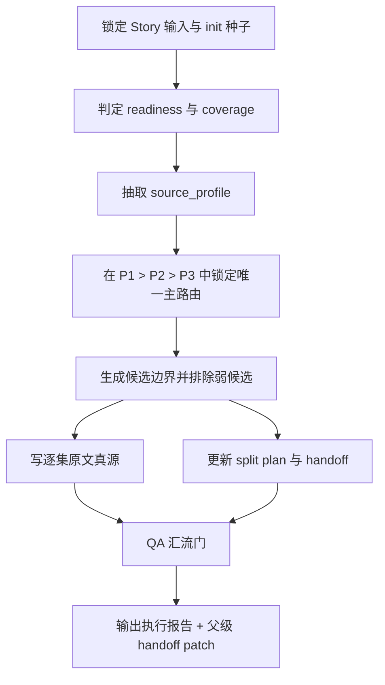
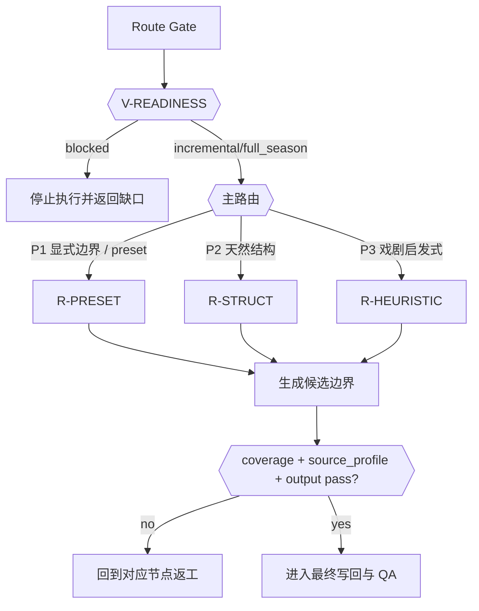
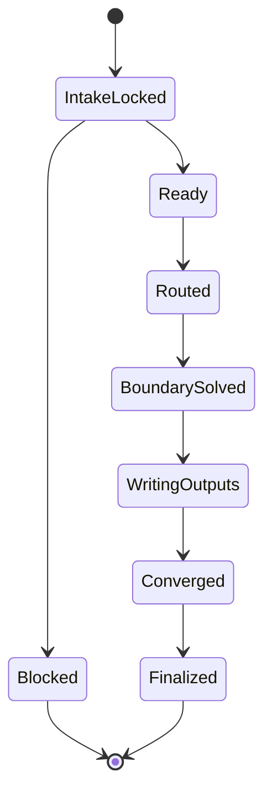
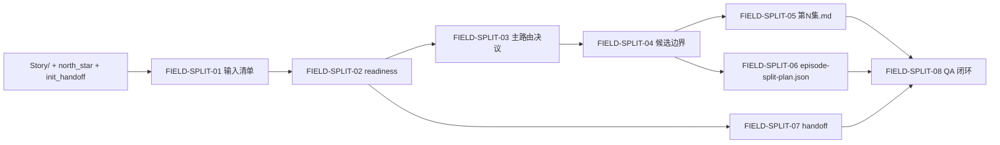

# aigc 1-分集

> Fusion notice: 本文件已从旧 sibling `SKILL.md` 迁为 `aigc-planning` 的 `episode_split` reference。文中“本技能”在当前包内均指 `episode_split` mode；运行入口统一由父级 `SKILL.md` 负责。

## Context Loading Contract

- 每次调用本技能时，必须同时加载同目录 `CONTEXT.md` 作为预加载上下文。
- 若同目录 `CONTEXT.md` 缺失，应先补齐最小知识库骨架，或向用户明确报告阻塞；不得在未检查该上下文的情况下执行技能。
- 冲突优先级：用户显式请求 > 仓库/全局 `AGENTS.md` > 本 `SKILL.md` > 同目录 `CONTEXT.md`。

## 概述

`1-分集` 是 `1-Planning` 单包内的 `episode_split` mode，负责把 `projects/aigc/<项目名>/Story/` 相关内容收束成逐集原文真源，并为 `2-格式` 与下游 `2-Global` 生成稳定 handoff。旧版 direct leaf skill 的完整执行细则在本文件中保留为 mode contract。

本技能在内容与机制上继承当前 DREAMER 规划链既有配置：

- 默认输入根仍是 `projects/aigc/<项目名>/Story/`
- canonical 输出仍落在 `projects/aigc/<项目名>/1-Planning/1-分集/第N集.md`
- 机读索引仍固定为 `projects/aigc/<项目名>/1-Planning/episode-split-plan.json`
- 执行报告仍固定为 `projects/aigc/<项目名>/1-Planning/1-分集/执行报告.md`
- `P1 > P2 > P3`、VSM、字段主表、QA、`source_profile + bootstrap_output` handoff 仍为现行真源

本轮重编排只改变合同表达方式，不改变业务边界：将“分集判断”改写为同一 `SKILL.md` 内的思行网络，使业务分析、执行步骤、汇流门禁与最终输出收束到单一真源。

## Skill Execution Rule (Mandatory)

`1-分集` 直接由本包 `episode_split` mode 完成执行闭环，不再经过规划组 `分集` subagent 投影，也不再作为独立 sibling `SKILL.md` 入口。

- `episode_split` mode 负责输入读取、边界裁决、`1-分集/第N集.md` 落盘、索引更新、执行报告汇总与校验
- 父 `1-Planning` 只消费本 mode 返回的 handoff patch，不再维护一份平行的分集 agent 合同
- 不得为 `1-分集` 再生成第二份 sibling skill、team、thinking sidecar 或并列执行真源

## Business Requirement Analysis Contract (Mandatory)

在进入分集步骤前，先锁定本技能的业务问题，而不是直接套用默认 step。

| analysis_slot | 当前结论 |
| --- | --- |
| `business_goal` | 把故事主源切成可供 `2-格式` 与 `2-Global` 承接的逐集原文真源，并保留可追溯边界证据 |
| `business_object` | `projects/aigc/<项目名>/Story/` 下的故事正文、manifest 索引与 init 种子 |
| `constraint_profile` | 只切分不改写；不得越权创建 `2-Global/*.md` 或 `3-Detail/第N集.json`；必须保留 `source_profile` |
| `success_criteria` | 输入范围可追溯、主路由唯一、边界有证据、逐集原文真源/机读索引/handoff 完整、QA 可回查 |
| `non_goals` | 不做剧本改写、镜头结构化、导演 JSON 生成、节奏重排 |
| `complexity_source` | 输入 readiness 判定、`P1>P2>P3` 路由选择、边界证据生成、机读索引与 handoff 收束 |
| `topology_fit` | 前段串行锁定输入与 readiness，中段条件分支选择主路由，后段并行收束正文/索引/handoff，最终统一 QA 汇流 |
| `step_strategy` | 采用“串行主干 + 条件分支 + 收束汇流”的单技能思行网络，而不是纯线性清单或额外 subagent |

## Context Preload (Mandatory)

加载顺序固定为：

1. 根 `AGENTS.md`
2. `.agents/skills/aigc/SKILL.md + CONTEXT.md`
3. `.agents/skills/aigc/1-Planning/SKILL.md + CONTEXT.md`
4. 本 `SKILL.md + CONTEXT.md`
5. `.agents/skills/aigc/1-Planning/references/planning-io-contract.md`
6. `.agents/skills/aigc/_shared/story-source-contract.md`
7. `.agents/skills/aigc/_shared/project-runtime-layout.md`
8. `projects/aigc/<项目名>/0-Init/north_star.yaml`
9. `projects/aigc/<项目名>/0-Init/init_handoff.yaml`
10. `projects/aigc/<项目名>/Story/` 相关内容
11. `projects/aigc/<项目名>/0-Init/story-source-manifest.yaml`（若存在）
12. `templates/episode-split-plan.template.json`

## Shared Canonical Sources (Mandatory)

- 强制读取：`references/planning-io-contract.md`
- 强制读取：`.agents/skills/aigc/_shared/story-source-contract.md`
- 强制读取：`.agents/skills/aigc/_shared/project-runtime-layout.md`
- 强制读取：`templates/episode-split-plan.template.json`

硬规则：

1. 默认输入根必须是 `projects/aigc/<项目名>/Story/`。
2. 不得创建 `projects/aigc/<项目名>/2-Global/*.md` 或 `projects/aigc/<项目名>/3-Detail/第N集.json`。
3. 不得把分镜/运镜/转场语言清洗成纯小说叙述；本阶段只切分，不改写。
4. 必须把 `source_profile` 从 manifest 延续给父级规划 handoff。
5. 思行裁决摘要只能压缩进 `执行报告.md` 与用户闭环，不得旁挂第二份 reasoning 真源。

## Total Input Contract

### 必需输入

- `projects/aigc/<项目名>/Story/` 相关内容
- `projects/aigc/<项目名>/0-Init/north_star.yaml`
- `projects/aigc/<项目名>/0-Init/init_handoff.yaml`

### 可选输入

- `projects/aigc/<项目名>/0-Init/story-source-manifest.yaml`
  - 若存在，作为索引、`coverage_scope` 与 `source_profile` 证据优先消费
- `projects/aigc/<项目名>/Story/` 下已在 manifest 登记的 `development_briefs`
  - 仅当 `readiness` 明确允许“开发式/增量分集”时，作为边界辅证输入
  - 只可用于补全标题、概要、coverage 与 episode boundary reasoning
  - 不得抬升为 `primary_story_source`
- 用户显式指定的增量范围
- `projects/aigc/<项目名>/team.yaml` 与共享 `council-runtime`
  - 仅在规划阶段启用顾问团时读取

### 禁止输入

- 与故事正文无关的治理工件、执行案、提案或说明文档
- 与当前项目无关的其他故事库文本
- 任何要求本阶段直接输出导演或 detail 阶段真源的额外指令

例外说明：

- 如果执行案 / 提案 / 结构蓝图已经被 `story-source-manifest.yaml` 显式登记为当前项目的 `development_briefs`，且 `readiness` 结论是“可以开发式/增量分集”，则这些材料不再视为“无关输入”，但仍只拥有辅证地位。
- 辅证地位不等于正文真源：不得据此宣称整季正文 ready，不得覆盖 `primary_story_source` 的权属。

### 输入处理原则

1. 用户显式指定路径或范围时，用户指定优先。
2. 用户未指定时，只能从 `projects/aigc/<项目名>/Story/` 扫描有效正文。
3. manifest 只承担索引与证据，不替代故事正文主源。
4. 若 manifest 显式登记了 `development_briefs` 且当前是 `incremental`，可把这些 brief 作为“开发式分集”的辅证输入，但必须在执行报告和 `episode-split-plan.json` 中显式保留 coverage 缺口。
5. readiness 未通过时，不得假装继续正式分集。

## Visual Maps









## Topology Contract (Mandatory)

### Topology Fit

本技能采用 `混合型思行网络`：

1. 串行主干：
   - 锁输入
   - 判 readiness
   - 抽 `source_profile`
2. 条件分支：
   - 在 `P1 > P2 > P3` 中选择唯一主路由
3. 收束汇流：
   - 逐集真源写回
   - 机读索引更新
   - 父级 handoff 生成
   - QA 汇流

### Route Priority (Mandatory)

`P1 显式边界 > P2 源文本天然结构 > P3 戏剧启发式`

- `P1`：用户显式指定范围、manifest 已登记的锁轴/预设锚点、或 init 种子里明确给出的集边界
- `P2`：章节/幕/场/seq/镜头组等天然结构边界
- `P3`：在 `P1/P2` 不足时，以冲突闭环、悬念点、代价显现点与覆盖窗口做启发式切分

### Variable Register

| var_id | 观测信号 | 状态集合 | 检测方法 | 优先级 |
| --- | --- | --- | --- | --- |
| V-READINESS | 是否允许进入分集 | `blocked/incremental/full_season/unknown` | 读取 manifest 或用户显式范围 | P0 |
| V-SOURCE-TYPE | 主故事源类型 | `novel/script/storyboard/oral/hybrid` | 读取 `primary_story_source.source_type` | P0 |
| V-PRESET-LOCK | 是否存在预设锁轴 | `none/soft/hard` | 读取 `locked_preset_axes + preset_registry` | P0 |
| V-STRUCT-SIGNAL | 天然结构清晰度 | `clear/partial/chaotic` | 标题、场次、镜头块匹配 | P1 |
| V-COVERAGE | 当前覆盖范围 | `local/full` | 读取 `coverage_scope + split_scope` | P0 |

### Scenario Table

| case_id | 触发谓词 | 主策略 | fallback |
| --- | --- | --- | --- |
| C1-BLOCKED | `V-READINESS=blocked` | 停机并返回缺口 | 无 |
| C2-LOCKED | `V-PRESET-LOCK in {soft,hard}` | 优先按显式锚点切分 | C3-STRUCT |
| C3-STRUCT | `V-STRUCT-SIGNAL=clear` | 沿天然结构切分 | C4-HEURISTIC |
| C4-HEURISTIC | `V-STRUCT-SIGNAL in {partial,chaotic}` | 用戏剧启发式补位 | 手工澄清 |

## Thinking-Action Node Contract (Mandatory)

每个关键节点必须同时描述判断与动作，至少覆盖以下槽位：

| slot | 要求 |
| --- | --- |
| `node_id` | 稳定节点标识 |
| `objective` | 该节点要解决的判断/动作目标 |
| `inputs` | 进入该节点的输入与依赖 |
| `actions` | 该节点真正执行的动作 |
| `evidence` | 该节点留下的证据、产物或验证结果 |
| `route_out` | 成功、失败、分支时分别流向何处 |
| `gate` | 是否允许进入最终汇流 |

## Thinking-Action Node Network

| node_id | 对应 Step | 聚焦字段 | objective | actions | evidence | route_out | gate |
| --- | --- | --- | --- | --- | --- | --- | --- |
| N1-INPUT-LOCK | S1 | `FIELD-SPLIT-01` | 锁定唯一故事输入范围 | 读取 `Story/`、`north_star`、`init_handoff`、manifest | 输入清单、coverage 范围 | 成功 -> N2；输入漂移 -> 返工 S1 | 输入真源唯一后方可继续 |
| N2-READINESS-GATE | S2 | `FIELD-SPLIT-02` | 判断是否允许正式分集 | 解析 readiness 与 split_scope | blocked / incremental / full_season 结论 | blocked -> 结束；可执行 -> N3 | blocked 不得进入写回 |
| N3-SOURCE-PROFILE | S3 | `FIELD-SPLIT-07` | 保留 `source_profile` 与上下游约束 | 从 manifest 或保守推断抽取 `source_type / preset_retention_mode / detail_expansion_mode / locked_preset_axes / preset_registry` | `source_profile` 草案 | 成功 -> N4；缺口 -> 回到 S1/S2 | handoff 字段成形后方可裁路 |
| N4-ROUTE-SELECT | S4 | `FIELD-SPLIT-03` | 在 `P1>P2>P3` 中锁定唯一主路由 | 基于 VSM 与 route priority 选择 R-PRESET / R-STRUCT / R-HEURISTIC | 主路由决议、放弃理由 | 成功 -> N5；冲突 -> 回到 S2-S4 | 主路由唯一才可求边界 |
| N5-BOUNDARY-SOLVE | S5 | `FIELD-SPLIT-04` | 生成边界并排除弱候选 | 形成候选边界、排除理由、coverage 边界 | 候选边界表、boundary_summary | 成功 -> N6/N7；弱边界 -> 回到 S4/S5 | 必须有结构或戏剧证据 |
| N6-EPISODE-WRITEBACK | S6 | `FIELD-SPLIT-05` | 把边界切成逐集原文真源 | 生成 `1-分集/第N集.md` 与执行报告正文区块 | 逐集原文真源、报告区块 | 成功 -> N8；结构错误 -> 回到 S5/S6 | 正文文件结构合法 |
| N7-INDEX-HANDOFF | S7 | `FIELD-SPLIT-06` `FIELD-SPLIT-07` | 更新机读索引并产出父级 patch | 读取模板、更新 `episode-split-plan.json`、生成 handoff patch | 索引、`source_profile + bootstrap_output + upstream_paths` | 成功 -> N8；字段缺失 -> 回到 S3/S5/S7 | 索引与 handoff 一致 |
| N8-QA-CONVERGENCE | S8 | `FIELD-SPLIT-08` | 收束全部证据并给出完成或阻塞结论 | 校验 coverage、顺序、输出结构、handoff、失败码 | `执行报告.md`、PASS/FAIL、返工入口 | pass -> Final；fail -> 对应返工节点 | 仅当字段和输出全部达标时允许结案 |

## Convergence Contract (Mandatory)

只有同时满足以下条件，`1-分集` 才允许宣布完成：

1. `FIELD-SPLIT-01` 到 `FIELD-SPLIT-08` 全部已落位
2. `V-READINESS` 不是 `blocked`
3. 主路由唯一且遵守 `P1>P2>P3`
4. 候选边界具备结构或戏剧证据
5. `第N集.md`、`episode-split-plan.json`、`source_profile + bootstrap_output` handoff 一致
6. 若 `第N集.md` 含 frontmatter、边界说明或包装区块，则 `【剧本正文】` 后的正文区必须完整覆盖被采纳边界，不得出现头尾截断
7. `执行报告.md` 已写明验收结论、失败码与返工入口

若未满足：

- 输入/coverage 问题 -> 回到 `N1-INPUT-LOCK`
- readiness 问题 -> 回到 `N2-READINESS-GATE`
- route/boundary 问题 -> 回到 `N4-ROUTE-SELECT` 或 `N5-BOUNDARY-SOLVE`
- 输出/handoff 问题 -> 回到 `N6-EPISODE-WRITEBACK` 或 `N7-INDEX-HANDOFF`

## One-Shot Output Contract (Mandatory)

`1-分集` 的一次性输出不是多个平行半成品，而是同一 bundle 内的四类 canonical 结果：

### A. 逐集原文真源（Mandatory）

`projects/aigc/<项目名>/1-Planning/1-分集/第N集.md`

```markdown
---
项目名: <项目名>
集数: 第<n>集
源类型: <source_type>
coverage_scope: <coverage_scope>
split_scope: <incremental|full_season>
bootstrap_output: projects/aigc/<项目名>/2-Global/导演意图.md
---

【剧本正文】
<该集切分后的原文>
```

### B. 全剧集执行报告（Mandatory）

`projects/aigc/<项目名>/1-Planning/1-分集/执行报告.md`

默认区块：

```markdown
# 分集执行报告

## 输入清单
## Readiness 判定
## 主路由决议
## 候选边界
## 覆盖率校验
## source_profile handoff
## 验收结论与返工项
```

规则：

- 思行裁决摘要应压缩进 `主路由决议 / 候选边界 / 验收结论与返工项`
- 不额外挂第二份思考过程 sidecar

### C. 机读索引（Mandatory）

`projects/aigc/<项目名>/1-Planning/episode-split-plan.json`

- 必须读取 `templates/episode-split-plan.template.json`
- 仅记录分集边界、覆盖范围、`source_profile` 与 `bootstrap_output`
- 不替代逐集剧本主稿

### D. 父级 handoff patch（Mandatory）

本技能返回给父 `1-Planning` 的最小 patch 必须包含：

- `episode_id`
- `coverage_scope`
- `split_scope`
- `source_profile`
- `bootstrap_output`
- `boundary_summary`
- `upstream_paths`

## Quality And Audit Contract

### 评分矩阵

| 维度 | 指标 | 分值 |
| --- | --- | --- |
| 维度0: 契约遵循 | 是否遵守 manifest-first、只切分不改写、只登记 handoff 不建编导根文件 | __/10 |
| 维度1 | readiness 判定正确性 | __/10 |
| 维度2 | 主路由正确性（`P1>P2>P3`） | __/10 |
| 维度3 | 边界叙事价值与结构证据 | __/10 |
| 维度4 | 覆盖率与顺序一致性 | __/10 |
| 维度5 | `source_profile` 继承完整性 | __/10 |
| 维度6 | `bootstrap_output` handoff 正确性 | __/10 |
| 维度7 | 输出结构完整性 | __/10 |

### 字段主表

| field_id | 输出位置/字段 | 内容要求 | 默认责任 Step | 质量维度 | 失败码 |
| --- | --- | --- | --- | --- | --- |
| FIELD-SPLIT-01 | 输入清单 | 列出 `projects/aigc/<项目名>/Story/` 命中内容与有效覆盖范围 | S1 | 输入真源一致性 | FAIL-SPLIT-01 |
| FIELD-SPLIT-02 | readiness 判定 | 明确 blocked / incremental / full_season / unknown | S2 | readiness 正确性 | FAIL-SPLIT-02 |
| FIELD-SPLIT-03 | 主路由决议 | 明确 `P1/P2/P3` 的唯一主路由与放弃理由 | S4 | 路由正确性 | FAIL-SPLIT-03 |
| FIELD-SPLIT-04 | 候选边界 | 给出边界证据与被排除候选 | S5 | 边界价值 | FAIL-SPLIT-04 |
| FIELD-SPLIT-05 | 原文真源文件 | 输出 `1-Planning/1-分集/第N集.md` | S6 | 输出完整性 | FAIL-SPLIT-05 |
| FIELD-SPLIT-06 | 机读索引 | 更新 `episode-split-plan.json` | S7 | 机读一致性 | FAIL-SPLIT-06 |
| FIELD-SPLIT-07 | 父级 handoff | 产出 `source_profile + bootstrap_output` patch | S3/S7 | handoff 可消费性 | FAIL-SPLIT-07 |
| FIELD-SPLIT-08 | QA 闭环 | 写验收结论、失败码与返工入口 | S8 | 闭环完整性 | FAIL-SPLIT-08 |

### Thought Pass Map

| step_id | 聚焦字段 | 核心问题 | 生成动作 | 未达标信号 |
| --- | --- | --- | --- | --- |
| S1 | FIELD-SPLIT-01 | 输入范围是否唯一且可追溯 | 读取 `Story/` 与 manifest（若有） | 临时猜路径 |
| S2 | FIELD-SPLIT-02 | 当前能否进入分集 | 判定 blocked / incremental / full_season | 忽略 readiness |
| S3 | FIELD-SPLIT-07 | 上下游约束是什么 | 解析并保留 `source_profile` | handoff 字段不全 |
| S4 | FIELD-SPLIT-03 | 应走哪个主路由 | 在 `P1>P2>P3` 中锁定唯一主路由 | 多路并列无裁决 |
| S5 | FIELD-SPLIT-04 | 哪些切点成立 | 生成候选边界与排除理由 | 只有字数切分，没有证据 |
| S6 | FIELD-SPLIT-05 | 如何落逐集原文真源 | 写 `1-Planning/1-分集/第N集.md` 与报告 | 直接写到下游剧本主稿 |
| S7 | FIELD-SPLIT-06 / 07 | 如何保留机读索引并交接父级 | 读取模板更新索引并输出 handoff | 漏掉模板或关键字段 |
| S8 | FIELD-SPLIT-08 | 如何证明完成或阻塞 | 写 QA、失败码与返工入口 | 只有结果没有闭环 |

### Pass Table

| field_id | Pass Standard | Fail Code | Rework Entry |
| --- | --- | --- | --- |
| FIELD-SPLIT-01 | 输入来自 `Story/`，且 coverage 可追溯 | FAIL-SPLIT-01 | S1 |
| FIELD-SPLIT-02 | readiness 判定与 manifest 或用户显式范围一致 | FAIL-SPLIT-02 | S2 |
| FIELD-SPLIT-03 | 主路由唯一且遵守 `P1>P2>P3` | FAIL-SPLIT-03 | S4 |
| FIELD-SPLIT-04 | 候选边界具备结构或戏剧证据 | FAIL-SPLIT-04 | S5 |
| FIELD-SPLIT-05 | `1-Planning/1-分集/第N集.md` 结构合法，且 `【剧本正文】` 后正文区完整覆盖被采纳源片段 | FAIL-SPLIT-05 | S6 |
| FIELD-SPLIT-06 | `episode-split-plan.json` 与逐集主稿一致 | FAIL-SPLIT-06 | S7 |
| FIELD-SPLIT-07 | handoff 含 `source_profile` 与 `bootstrap_output` | FAIL-SPLIT-07 | S3/S7 |
| FIELD-SPLIT-08 | QA 含失败码、返工入口与 triad closure | FAIL-SPLIT-08 | S8 |

## Root-Cause Execution Contract (Mandatory)

当分集出现以下问题时，必须先修源层：

- 读错 `projects/aigc/<项目名>/Story/` 输入范围
- 把非故事正文材料当主故事源
- 忽略 storyboard / hybrid 文本中的预设锁轴
- 直接从 `1-分集` 创建 `2-Global/*.md` 或 `3-Detail/第N集.json`
- 只改标题或步骤顺序，却没有把业务分析、节点动作、汇流门和输出收束保持同源

必经链路：

`Symptom -> Direct Technical Cause -> Rule Source -> Meta Rule Source -> Fix Landing Points`

优先检查：

- `Rule Source`
  - `.agents/skills/aigc/1-Planning/references/episode-splitter-contract.md`
  - `.agents/skills/aigc/1-Planning/knowledge-base/episode-splitter-heuristics.md`
  - `references/planning-io-contract.md`
  - `.agents/skills/aigc/_shared/story-source-contract.md`
  - `templates/episode-split-plan.template.json`
- `Meta Rule Source`
  - `AGENTS.md`
  - `.agents/skills/aigc/SKILL.md`
  - `.agents/skills/aigc/1-Planning/SKILL.md`
  - `.agents/skills/aigc/_shared/project-runtime-layout.md`

面向用户的闭环固定返回：

1. root cause location
2. immediate fix
3. systemic prevention fix

## Completion Criteria

- 已从 `projects/aigc/<项目名>/Story/` 锁定输入范围，并在 manifest 存在时完成索引对齐。
- 已完成 business requirement analysis，并明确当前拓扑为何是“串行主干 + 条件分支 + 汇流”。
- 已产出 `projects/aigc/<项目名>/1-Planning/1-分集/第N集.md`、全剧集执行报告与机读索引。
- 已形成可供父 skill 聚合的 `source_profile + bootstrap_output` handoff。
- 已完成 QA，并能明确说明本轮是 blocked / incremental / full_season。
- 不存在平行 team、平行 reasoning sidecar 或第二份分集真源。

## Skill 2.0 Fusion Enhancement

- 当前文件是 `aigc-planning` 单包内 `episode_split` mode 的 reference 真源，不再是独立 `SKILL.md` 入口。
- 调用入口统一为 `.agents/skills/aigc/1-Planning/SKILL.md` 与 `$aigc-planning`。
- 原 sibling `CONTEXT.md` 已迁入 `knowledge-base/episode-splitter-heuristics.md`。
- 原模板已迁入 `templates/episode-split-plan.template.json`。
