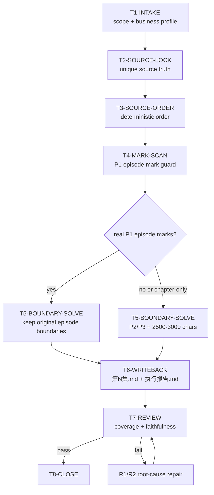

# aigc 1-分集

技能包 ID: `$aigc-episode-split`

`1-分集` 负责把小说原文资料切成 AIGC 视频项目逐集原文真源。它只做输入真源锁定、集数/章节信号判定、原文边界裁决、逐集落盘和覆盖复核；不做剧本改写、分镜设计、角色设计、导演阐释或正文润色。

## Core Task Contract

| contract_slot | rule |
| --- | --- |
| `business_goal` | 将用户指定或项目默认的小说原文稳定切分为可交给后续 AIGC 阶段使用的逐集原文文件。 |
| `business_object` | `.md`、`.txt`、可稳定抽取文本的文档、多文件章节正文、合并小说正文。 |
| `canonical_input` | 用户显式路径优先；否则使用 `projects/aigc/<项目名>/源/`。 |
| `canonical_output` | `projects/aigc/<项目名>/1-分集/第N集.md` 与 `projects/aigc/<项目名>/1-分集/执行报告.md`。 |
| `non_goals` | 不改写正文、不扩写剧情、不剧本化、不分镜化、不把设定案或治理文档当正文真源。 |
| `llm_first_boundary` | 分集边界裁决由 LLM 直接完成；脚本只允许做读取、统计、排序、diff、覆盖审计、格式检查等机械辅助；脚本、映射表、规则模板、关键词锚点替换或固定句式轮换批量生成边界理由，直接 fail。 |

## Context Loading Contract

1. 每次调用本技能时，必须加载本 `SKILL.md` 和同目录 `CONTEXT.md`。
2. 每次调用本技能时，必须同时加载同目录 `CONTEXT.md`。
3. 若任务绑定 `projects/aigc/<项目名>/`，必须先加载项目根 `MEMORY.md`，再加载项目根 `CONTEXT/` 中与分集相关的文件。
4. 按 `Module Trigger Matrix` 加载授权模块；不得因为模块目录存在而自动全量读取。
5. `knowledge-base/` 只承载人工资料与经验参考，不承载自动学习真源。
6. 冲突优先级：用户显式请求 > 根 `AGENTS.md` / 共享治理合同 > 本 `SKILL.md` > 本 `Module Loading Matrix` 授权模块 > 项目级 `MEMORY.md` > 项目级 `CONTEXT/` > 本 `CONTEXT.md`。

## Runtime Spine Contract

本技能的最小合格路径是：

`T1-INTAKE -> T2-SOURCE-LOCK -> T3-SOURCE-ORDER -> T4-MARK-SCAN -> T5-BOUNDARY-SOLVE -> T6-WRITEBACK -> T7-REVIEW -> T8-CLOSE`

硬门槛：

- `第N集`、`Episode N`、`EP N` 或上下文明显为连载单元的 `第N话` 才能触发原生集标路径。
- 章节不等于集数；`第N章`、`Chapter N`、卷、章、节、小节和 story 项目章节文件名只能作为候选边界，不得触发“一章一集”。
- 没有 P1 原生集标时，默认每集约 2500-3000 中文字，允许为自然段、章节小节或强戏剧断点小幅偏离，但必须写明理由。
- 输出目录已有 `第N集.md` 时，先判断续跑、修复或覆盖；破坏性覆盖未授权时停止。

## Input Contract

| input_slot | requirement | stop_or_rework |
| --- | --- | --- |
| `project_root` | 能定位 `projects/aigc/<项目名>/`，或用户给出可写输出目标。 | 无法定位且无法推断输出项目时，只输出切分计划，不落盘。 |
| `source_path` | 用户显式指定路径优先；否则读取项目 `源/`。 | 找不到可读正文时停止并报告 `FAIL-SPLIT-01`。 |
| `source_format` | 支持 `.md`、`.txt`、可稳定抽取文本的文档；图片/扫描件必须先转文本。 | 乱码、二进制或权限不可读时停止并报告 `FAIL-SPLIT-01A`。 |
| `existing_output` | 识别目标目录是否已有正式产物。 | 无法判断覆盖、续跑或修复语义时停止澄清。 |
| `project_memory` | 只提供偏好、禁区、设定和补充事实。 | 除非用户明确指定，不得抬升为小说正文真源。 |

## Business Requirement Analysis Contract

| field | requirement | evidence | fail_code |
| --- | --- | --- | --- |
| `business_goal` | 稳定生成逐集原文真源，服务后续编导、分镜和视频链路。 | 用户请求、项目根、源材料清单、输出目录。 | `FAIL-BUSINESS-GOAL` |
| `business_object` | 小说正文与章节/集数结构，而不是设定、报告或治理文档。 | 文件类型、正文抽样、标题/段落结构。 | `FAIL-BUSINESS-OBJECT` |
| `constraint_profile` | 原文保真、路径唯一、编号连续、LLM-first 边界裁决、脚本不得主创。 | 根规则、本技能合同、报告字段。 | `FAIL-BUSINESS-CONSTRAINT` |
| `success_criteria` | 输入清单、边界表、逐集文件、覆盖报告和复核 gate 均可追溯。 | `执行报告.md`、输出文件清单、抽样 diff。 | `FAIL-BUSINESS-SUCCESS` |
| `complexity_source` | 复杂度来自源类型分流、多文件排序、章/集误判、边界裁决和覆盖复核。 | `source_type`、排序证据、边界理由。 | `FAIL-BUSINESS-COMPLEXITY` |
| `topology_fit` | 先锁真源，再排序，再判定原生集标，随后边界裁决、落盘、复核；该拓扑能隔离源误用、章/集误判和输出覆盖三类高风险。 | 节点表、Mermaid 图、review gate。 | `FAIL-TOPOLOGY-FIT` |

## Mode Selection

| mode | trigger | route | output |
| --- | --- | --- | --- |
| `source_scan` | 需要识别项目或用户指定小说原文 | `T1,T2,T3,T8` | 输入清单、可读性判断、排序依据 |
| `explicit_episode_split` | 原资料自带真实 P1 集标，且不是章节/卷/节结构 | `T1,T2,T3,T4,T5,T6,T7,T8` | 按原集标落盘为 `第N集.md` |
| `length_based_split` | 原资料没有真实 P1 集标 | `T1,T2,T3,T4,T5,T6,T7,T8` | 按 P2/P3 边界与 2500-3000 字目标窗落盘 |
| `repair` | 输出缺失、编号断裂、源路径漂移、覆盖不完整或复核失败 | `T1,R1,R2,T7,T8` | 最小修复 patch 与更新后的执行报告 |
| `review` | 用户只要求验收已有分集产物 | `T1,V1,T8` | findings、fail code、返工目标 |

## Type Routing Matrix

| input_type | signal | route_to | required_nodes | module_load | fail_code |
| --- | --- | --- | --- | --- | --- |
| `explicit_episode` | 稳定 `第N集`、`Episode N`、`EP N` 或真实连载单元 `第N话` | `explicit_episode_split` | `T1,T2,T3,T4,T5,T6,T7,T8` | `types/type-map.md`, `types/source-type-map.md`, `references/input-output-contract.md`, `review/review-contract.md`, `templates/episode-output.template.md` | `FAIL-SPLIT-02` |
| `chaptered_novel` | 只有 `第N章`、chapter、卷、章、节或 story 章节文件名 | `length_based_split` | `T1,T2,T3,T4,T5,T6,T7,T8` | `types/type-map.md`, `types/source-type-map.md`, `references/input-output-contract.md`, `knowledge-base/episode-split-heuristics.md`, `review/review-contract.md`, `templates/episode-output.template.md` | `FAIL-SPLIT-02A` |
| `plain_novel` | 连续正文，缺少标题或编号 | `length_based_split` | `T1,T2,T3,T4,T5,T6,T7,T8` | `types/type-map.md`, `types/source-type-map.md`, `references/input-output-contract.md`, `knowledge-base/episode-split-heuristics.md`, `review/review-contract.md`, `templates/episode-output.template.md` | `FAIL-SPLIT-03` |
| `mixed_source` | 多文件、多版本或正文夹杂设定 | `source_scan` 或 `length_based_split` | `T1,T2,T3,T4,T5,T7,T8` | `types/type-map.md`, `types/source-type-map.md`, `references/input-output-contract.md`, `review/review-contract.md` | `FAIL-SPLIT-01` |
| `blocked_source` | 无正文、乱码、图片、扫描件或权限不可读 | `blocked` | `T1,T2,T8` | `types/type-map.md`, `types/source-type-map.md` | `FAIL-SPLIT-01A` |

## Thinking-Action Node Map

| node_id | objective | actions | evidence | route_out | gate |
| --- | --- | --- | --- | --- | --- |
| `T1-INTAKE` | 锁定任务范围、项目根、模式和注意力锚点 | 识别用户显式路径、项目名、输出目录、是否为 review/repair；形成 `business_profile` | 项目根、用户源路径、目标输出目录、模式判断 | `T2` / `R1` / `V1` | 输入缺少项目和输出目标时不落盘；业务目标/对象/成功标准不清回到本节点 |
| `T2-SOURCE-LOCK` | 锁定唯一小说原文真源 | 按用户显式路径 > 项目 `源/` > 用户明确要求的旧路径 fallback 选源；排除 `MEMORY.md`、`CONTEXT/`、设定案和治理文档 | 至少 1 份输入清单、真源路径、被排除资料说明 | `T3` | 无可读正文或真源多头时停止，`FAIL-SPLIT-01` |
| `T3-SOURCE-ORDER` | 建立稳定阅读顺序 | 对多文件按自然数字文件名、正文内章节号、标题顺序排序；记录排序依据 | 文件顺序表、可读性判断、排序规则 | `T4` | 排序不可复查或来源不可读时 `FAIL-SPLIT-01A` |
| `T4-MARK-SCAN` | 判定源材料是否自带真实集数划分 | 扫描 P1 集标；同时列出被排除的 `第N章`、chapter、卷/章/节信号 | P1 集标列表、章节信号排除列表、`source_type` | `T5` | 把章节当集标时 `FAIL-SPLIT-02A`；忽略真实 P1 集标时 `FAIL-SPLIT-02` |
| `T5-BOUNDARY-SOLVE` | 生成分集边界表 | P1 按原集标；否则用 P2 自然结构和 P3 2500-3000 字目标窗裁决边界 | 每集起止位置、字数、边界理由、偏离说明、anti_mechanical_boundary_audit | `T6` | 每集必须有来源范围；无 P1 时不得机械一章一集；不得用模板句、关键词锚点替换或固定句式伪造差异化边界理由；断句/对白/关键动作被切断时 `FAIL-SPLIT-03` |
| `T6-WRITEBACK` | 写入逐集原文与执行报告 | 生成 `第N集.md`；正文保持原文；更新 `执行报告.md` | 输出文件清单、编号检查、报告路径、正文保真抽查或 diff | `T7` | 编号不连续、路径错误、正文改写或覆盖未授权时 `FAIL-SPLIT-04` |
| `T7-REVIEW` | 验收覆盖、边界、路径和保真 | 执行 review gates；检查报告字段、覆盖状态、返工入口 | gate 结果、coverage 表、fail code 或 pass evidence | `T8` / `R1` | 8 个 gate 必须全过；失败按 fail code 返回对应节点 |
| `T8-CLOSE` | 汇流交付 | 输出最终说明、已写文件、未覆盖原因、残余风险和下一阶段入口 | final report、执行报告摘要 | done | 只允许一个 final output；不得留下平行真源 |
| `R1-ROOT-CAUSE` | 对失败产物做根因上溯 | 将症状追到真源锁定、类型判定、边界裁决、写回或报告字段 | `Symptom -> Direct Cause -> Skill Contract Source -> AGENTS.md` | `R2` | 不得只补说明而不修 source artifact |
| `R2-SYNC` | 同步修复受影响产物 | 修 `第N集.md`、`执行报告.md`、必要模块引用或技能合同 | 最小 patch、更新后的 gate evidence | `T7` | 受影响引用必须同步，覆盖仍需授权 |
| `V1-REVIEW` | 只审查已有产物 | 读取已有分集文件和报告，跑 review gates | findings、fail code、返工目标 | `T8` / `R1` | findings 必须有路径和证据 |

## Thought Pass Map

本节仅为仓库审计兼容层提供 pass 映射，不维护第二流程；执行节点真源仍是 `Thinking-Action Node Map`。

| pass_id | bound_nodes | pass_focus | pass_evidence |
| --- | --- | --- | --- |
| `PASS-SOURCE` | `T1,T2,T3` | 项目根、唯一正文真源、可读性和确定性排序 | 输入清单、排序表、排除说明 |
| `PASS-BOUNDARY` | `T4,T5` | P1 集标识别、章节信号排除、P2/P3 边界裁决 | 集标列表、章节排除列表、边界表 |
| `PASS-WRITEBACK` | `T6` | canonical 路径、连续编号、正文保真 | 输出清单、编号检查、diff 或抽查 |
| `PASS-REVIEW` | `T7,T8,R1,R2,V1` | review gate、fail code、返工目标和最终汇流 | gate 结果、coverage 表、final report |

## Visual Maps

## Module Loading Matrix

| module | load_when | authority | forbidden_use | rework_target |
| --- | --- | --- | --- | --- |
| `types/type-map.md` | 每次调用本技能时 | 类型包索引；指向可加载 source type 包 | 不得替代主节点、模式选择或输出合同 | `T4-MARK-SCAN` |
| `types/source-type-map.md` | 每次需要判定源材料类型时 | 定义 `explicit_episode`、`chaptered_novel`、`plain_novel`、`mixed_source`、`blocked_source` | 不得自行决定输出路径或分集边界 | `T4-MARK-SCAN` |
| `references/input-output-contract.md` | 需要展开输入优先级、边界策略或报告字段时 | 展开源优先级、P1/P2/P3 边界和执行报告要求 | 不得新增主入口、节点或第二输出路径 | `T2-SOURCE-LOCK` / `T5-BOUNDARY-SOLVE` / `T6-WRITEBACK` |
| `review/review-contract.md` | review、repair 或交付前验收时 | 提供可执行 review gates、fail codes 和返工目标 | 不得替代 `Convergence Contract` 或自称通过 | `T7-REVIEW` |
| `templates/episode-output.template.md` | 写入逐集正文时 | 投影单集 Markdown 格式 | 不得改写正文、另立命名或添加剧情说明 | `T6-WRITEBACK` |
| `templates/output-template.md` | 需要通用输出模板兼容时 | 提供旧模板兼容参考 | 不得覆盖 canonical `第N集.md` 格式 | `T6-WRITEBACK` |
| `knowledge-base/episode-split-heuristics.md` | 无 P1 集标、边界困难、多文件排序风险时 | 提供经验性启发 | 不得作为规则真源或自动学习落点 | `T5-BOUNDARY-SOLVE` |
| `scripts/README.md` | 需要脚本辅助或验证脚本边界时 | 限定脚本只能做机械读取、统计、校验、diff、报告辅助 | 不得让脚本生成创作性边界裁决或改写正文 | `T6-WRITEBACK` / `T7-REVIEW` |
| `agents/openai.yaml` | 产品入口或索引元数据检查时 | 提供入口显示名、描述和默认 prompt | 不得改写运行合同 | `T1-INTAKE` |

## Module Trigger Matrix

| trigger | module_load | load_stage | return_gate |
| --- | --- | --- | --- |
| 每次调用 `$aigc-episode-split` | `types/type-map.md`, `types/source-type-map.md` | `T1` before `T4` | `GATE-SPLIT-02-P1-EPISODE-MARK` |
| 用户指定源路径或项目默认 `源/` | `references/input-output-contract.md` | `T2` | `GATE-SPLIT-01-SOURCE-LOCK` |
| 多文件、多章节或 mixed source | `types/source-type-map.md`, `references/input-output-contract.md` | `T3` | `GATE-SPLIT-01A-SOURCE-ORDER` |
| 无 P1 集标或只有章节结构 | `knowledge-base/episode-split-heuristics.md`, `references/input-output-contract.md` | `T5` | `GATE-SPLIT-03-BOUNDARY-SOLVE` |
| 写入单集文件 | `templates/episode-output.template.md` | `T6` | `GATE-SPLIT-04-EPISODE-WRITEBACK` |
| review、repair 或交付前 | `review/review-contract.md` | `T7` | `GATE-SPLIT-05-REPORT-COVERAGE` |
| `FAIL-SPLIT-01` / `FAIL-SPLIT-01A` | `types/source-type-map.md`, `references/input-output-contract.md` | `R1` | `GATE-SPLIT-01-SOURCE-LOCK` |
| `FAIL-SPLIT-02` / `FAIL-SPLIT-02A` / `FAIL-SPLIT-03` | `types/source-type-map.md`, `references/input-output-contract.md`, `knowledge-base/episode-split-heuristics.md` | `R1` | `GATE-SPLIT-03-BOUNDARY-SOLVE` |
| `FAIL-SPLIT-04` / `FAIL-SPLIT-05` | `templates/episode-output.template.md`, `review/review-contract.md` | `R2` | `GATE-SPLIT-04-EPISODE-WRITEBACK` |

## Quantifiable Execution Criteria Contract

| criteria_slot | execution_rule | landing_node | fail_code |
| --- | --- | --- | --- |
| `action_scope` | 覆盖用户源路径或项目 `源/` 下所有可读正文文件；多文件必须列出 100% 输入顺序。 | `T2,T3` | `FAIL-QUANT-ACTION-SCOPE` |
| `evidence_count` | 至少保留输入清单、源类型判定、边界表、输出文件清单、coverage 表 5 类证据。 | `T2-T7` | `FAIL-QUANT-EVIDENCE` |
| `pass_threshold` | 8 个 review gates 全部通过；`第N集.md` 编号从 1 连续；coverage 不允许无解释遗漏；`GATE-SPLIT-06-ANTI-MECHANICAL-BOUNDARY` 阻断项为 0。 | `T7` | `FAIL-QUANT-THRESHOLD` |
| `length_window` | 无 P1 集标时每集目标 2500-3000 中文字；偏离必须有自然段、章节小节、悬念点或用户指令证据。 | `T5` | `FAIL-SPLIT-03` |
| `retry_limit` | 同一 fail code 连续返工 2 次仍失败时，停止并报告阻塞原因、已试 patch 和需要用户确认的信息。 | `R1,R2` | `FAIL-QUANT-RETRY` |
| `fallback_evidence` | 无法做完整 diff 时，至少抽查每集开头/中段/结尾各 1 处正文保真证据。 | `T6,T7` | `FAIL-QUANT-FALLBACK` |

## Convergence Contract

| convergence_point | pass_condition | fail_condition | rework_target | evidence |
| --- | --- | --- | --- | --- |
| `CV-SOURCE` | 唯一正文真源锁定，且输入顺序可复查。 | 真源多头、误用设定/CONTEXT、不可读或排序漂移。 | `T2` / `T3` | 输入清单、排序表、排除说明 |
| `CV-BOUNDARY` | P1 集标被尊重；无 P1 时 P2/P3 边界有字数和戏剧断点证据，且每集边界理由不是模板句轮换。 | 忽略 P1、把章节当集、机械截断正文、用规则模板或锚点替换伪造边界差异。 | `T4` / `T5` | 集标列表、章节排除列表、边界表、anti_mechanical_boundary_audit |
| `CV-WRITEBACK` | 所有 `第N集.md` 写入 canonical 目录，编号连续，正文未改写。 | 路径错误、编号断裂、正文改写或覆盖未授权。 | `T6` | 输出清单、保真抽查、diff |
| `CV-REPORT` | `执行报告.md` 可复查输入、模式、每集范围、字数、coverage 和返工入口。 | 报告缺字段、coverage 无解释遗漏、返工入口不定位集数。 | `T7` | 报告字段与 gate 结果 |

## Review Gate Binding

| review_question | review_gate | fail_code | rework_target | report_evidence |
| --- | --- | --- | --- | --- |
| 是否锁定唯一小说原文真源，且未把 `MEMORY.md`、`CONTEXT/`、设定案或治理文件抬升为正文真源？ | `GATE-SPLIT-01-SOURCE-LOCK` | `FAIL-SPLIT-01` | `T2-SOURCE-LOCK` | 输入路径、fallback 说明、文件清单、真源排除说明 |
| 多文件或多章节来源是否可读，并已建立可复查的确定性顺序？ | `GATE-SPLIT-01A-SOURCE-ORDER` | `FAIL-SPLIT-01A` | `T3-SOURCE-ORDER` | 可读性判断、排序依据、输入文件顺序表 |
| 源资料存在真实 P1 集标时，是否按原资料进入 `explicit_episode_split`，没有按字数重切？ | `GATE-SPLIT-02-P1-EPISODE-MARK` | `FAIL-SPLIT-02` | `T4-MARK-SCAN` / `T5-BOUNDARY-SOLVE` | 集标列表、每集原始边界、切分模式 |
| 章节、卷、节、chapter 或 story 文件名是否只作为 P2 候选，没有被当作 AIGC 原生集标或一章一集规则？ | `GATE-SPLIT-02A-CHAPTER-NOT-EPISODE` | `FAIL-SPLIT-02A` | `T4-MARK-SCAN` / `T5-BOUNDARY-SOLVE` | 被排除章节信号、P2/P3 裁决说明、非一章一集证据 |
| 无 P1 集标时，边界是否结合自然结构、戏剧断点和 2500-3000 字目标窗？ | `GATE-SPLIT-03-BOUNDARY-SOLVE` | `FAIL-SPLIT-03` | `T5-BOUNDARY-SOLVE` | 每集字数、起止段落、边界理由、偏离说明 |
| 逐集文件是否写入 canonical 目录、编号连续、正文保真？ | `GATE-SPLIT-04-EPISODE-WRITEBACK` | `FAIL-SPLIT-04` | `T6-WRITEBACK` | 输出文件清单、编号检查、正文保真抽查或 diff |
| `执行报告.md` 是否足以复查输入、边界、字数、覆盖状态、跳过原因和具体返工入口？ | `GATE-SPLIT-05-REPORT-COVERAGE` | `FAIL-SPLIT-05` | `T7-REVIEW` | 边界表、coverage 表、跳过原因、返工入口 |
| 分集边界和理由是否由 LLM 基于原文结构裁决，而非脚本、映射表、规则模板、关键词锚点替换或固定句式轮换批量生成？ | `GATE-SPLIT-06-ANTI-MECHANICAL-BOUNDARY` | `FAIL-SPLIT-06` | `T5-BOUNDARY-SOLVE` | `anti_mechanical_boundary_audit`、非模板化边界理由样本 |

## Output Contract

### Required Output

| output_id | canonical_path | requirement |
| --- | --- | --- |
| `OUTPUT-EPISODE-SOURCE` | `projects/aigc/<项目名>/1-分集/第N集.md` | `N` 使用连续阿拉伯数字，从 1 开始；正文只承载该集原文，可有最小标题/frontmatter。 |
| `OUTPUT-SPLIT-REPORT` | `projects/aigc/<项目名>/1-分集/执行报告.md` | 记录输入路径、文件清单、切分模式、每集来源范围、字数、边界理由、覆盖状态和返工入口。 |

### Naming Rules

- 逐集正文文件命名为 `第N集.md`。
- 执行报告命名为 `执行报告.md`。
- 不创建 `第N话.md`、`Episode N.md`、`第N集-执行报告.md` 等平行命名。

### Completion Gate

- 已确认输入真源和源类型。
- 已说明是否存在原生集数划分。
- 所有源正文均被覆盖，或明确列出未覆盖原因。
- `第N集.md` 文件编号连续且正文未改写。
- `执行报告.md` 能复查每集边界、字数和来源范围。
- `review/review-contract.md` 的 8 个 gates 全部通过，或 final 明确列出失败 gate 和返工目标。

## Field Mapping

| field_id | output_or_evidence | requirement | fail_code |
| --- | --- | --- | --- |
| `FIELD-SPLIT-01` | 输入清单 | 记录用户指定路径或项目默认 `源/`、文件顺序、可读性 | `FAIL-SPLIT-01` |
| `FIELD-SPLIT-01A` | 排序依据 | 多文件时记录自然数字排序、正文内章节号或标题顺序 | `FAIL-SPLIT-01A` |
| `FIELD-SPLIT-02` | 切分模式 | 明确 `explicit_episode_split` 或 `length_based_split` | `FAIL-SPLIT-02` |
| `FIELD-SPLIT-02A` | 章节排除证据 | 章节/卷/节只作为 P2 候选，未触发 P1 | `FAIL-SPLIT-02A` |
| `FIELD-SPLIT-03` | 边界表 | 每集起止位置、来源标题/章节/段落证据、字数和理由 | `FAIL-SPLIT-03` |
| `FIELD-SPLIT-04` | `第N集.md` | 编号连续、内容完整、未改写原文 | `FAIL-SPLIT-04` |
| `FIELD-SPLIT-05` | `执行报告.md` | 输入、模式、字数、coverage、返工入口完整 | `FAIL-SPLIT-05` |
| `FIELD-SPLIT-06` | `anti_mechanical_boundary_audit` | 边界理由逐集不同且能回指原文结构、段落张力或戏剧断点，不是模板句、锚点替换或固定句式轮换 | `FAIL-SPLIT-06` |

## Checkpoint Contract

| checkpoint_id | trigger | required_action | pass_evidence | fail_code |
| --- | --- | --- | --- | --- |
| `CHK-SCOPE` | 覆盖已有 `第N集.md`、迁移旧输出、删除或重命名分集产物 | 先确认覆盖语义或证明用户已授权本范围 | 影响文件清单、覆盖/续跑/修复判断 | `FAIL-CHECKPOINT-SCOPE` |
| `CHK-SEMANTIC` | 定稿源类型、P1/P2/P3 边界、偏离字数窗理由 | 检查业务画像、边界证据和 review gate 返工入口 | `source_type`、边界表、topology fit | `FAIL-CHECKPOINT-SEMANTIC` |
| `CHK-VALIDATION` | review gate、diff、coverage 或编号检查失败 | 停止交付，按 fail code 回到节点 | gate 输出、失败码、返工目标 | `FAIL-CHECKPOINT-VALIDATION` |
| `CHK-EVAL` | 用户要求达尔文评分、优化或回归评估 | 使用 `test-prompts.json` 做 dry-run 或真实回归 | prompt ids、expected 摘要、eval_mode | `FAIL-CHECKPOINT-EVAL` |

## Attention Concentration Protocol

| protocol_id | protocol | requirement | rework_entry |
| --- | --- | --- | --- |
| `ATTE-SPLIT-01` | 注意力锚点 | 当前锚点始终是“原文真源 -> 源类型 -> 边界表 -> 逐集文件 -> 执行报告 -> review gate”。 | `T1-INTAKE` |
| `ATTE-SPLIT-02` | 注意力转移 | objective 完成后看 actions；actions 完成后看 evidence；evidence 不足转 gate；gate 失败转 fail code 节点。 | `Thinking-Action Node Map` |
| `ATTE-SPLIT-03` | 漂移检测 | 出现改写正文、把章节当集、读取设定当正文、只写报告不落盘、模块另立规则、输出路径分裂时判定漂移。 | `Review Gate Binding` |
| `ATTE-SPLIT-04` | 再集中 | 回到最近有效节点，不继续扩写当前局部文本；最终报告说明漂移信号和收束依据。 | `R1-ROOT-CAUSE` / `R2-SYNC` |

## Multi-Subskill Continuous Workflow

本技能没有必须串行调度的子技能包；主链节点由本 `SKILL.md` 持有。卫星或旁路技能不自动并入分集主链，只有用户或父级明确命中查询、恢复、复核、桥接等旁路职责时，才加载对应 `SKILL.md + CONTEXT.md`，其结果必须回接到本技能的 review gate。

## Evaluation Prompt Contract

`test-prompts.json` 是本技能的最小回归评估资产。

| eval_rule | requirement |
| --- | --- |
| `minimum_count` | 至少 3 条 prompt；当前覆盖 source scan、explicit episode split、chaptered novel split、repair/review。 |
| `schema` | 每条必须包含 `id`、`prompt`、`expected`，不得保留 TODO。 |
| `eval_mode` | 无真实项目素材时使用 `dry_run`，报告 prompt ids、预期行为和未执行真实落盘的原因。 |
| `rework` | 新增模式、fail code、输出门或模块触发组合时，必须同步补充或修改测试 prompt。 |

## Script And Metadata Contract

| path | role |
| --- | --- |
| `scripts/README.md` | 说明脚本只能承担机械辅助，不能替代 LLM 分集判断 |
| `agents/openai.yaml` | 提供产品侧入口元数据，默认提示必须显式提到 `$aigc-episode-split` |
| `test-prompts.json` | 覆盖 source_scan、explicit episode、chaptered novel、repair/review 的回归评估 prompts |

## Root-Cause Execution Contract

出现以下问题时，必须先修源层合同或输出边界，而不是补临时说明：

- 把 `CONTEXT/`、设定案、治理文档误当小说原文真源。
- 原资料已有 `第N集` 等明确划分，却又按 2500-3000 字重切。
- 把 story 的 `第N章`、chapter 文件或章节标题误判为 AIGC 原生 `第N集` 标记。
- 用脚本、映射表、规则模板、关键词锚点替换或固定句式轮换批量生成分集边界理由。
- 输出写到 `1-Planning`、`1-规划`、`Original`、`源` 或其他平行目录。
- 脚本替代 LLM 做分集边界创作判断。

必经链路：`Symptom -> Direct Cause -> Skill Contract Source -> AGENTS.md LLM-first / Skill 2.0 Rule`。

## Learning / Context Writeback

- 单项目偏好、禁区、特殊口味写入项目根 `MEMORY.md`。
- 项目共享事实和本项目补充材料写入项目根 `CONTEXT/`。
- 分集技能的可复用失败模式、修复策略和启发写入本目录 `CONTEXT.md`。
- 详细执行时间线、迁移过程和结构调整写入 `CHANGELOG.md` 或 `reports/`，不写入 `CONTEXT.md`。
