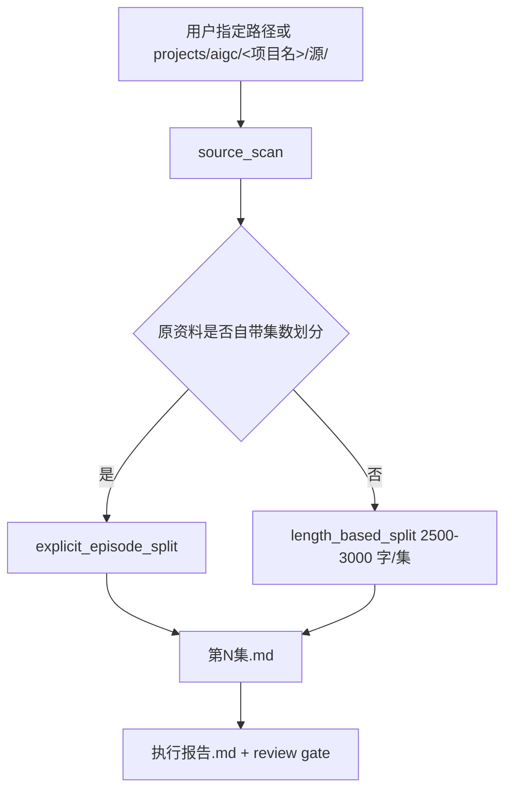
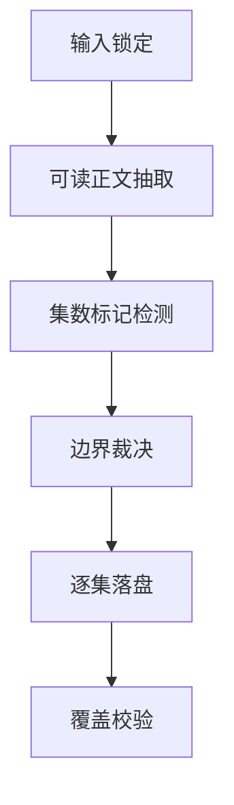

# aigc 1-分集

## Context Loading Contract

- 每次调用本技能时，必须同时加载同目录 `CONTEXT.md` 作为预加载上下文。
- 若当前任务绑定 `projects/aigc/<项目名>/`，还必须先加载项目根 `MEMORY.md`，再按需加载项目根 `CONTEXT/` 中与分集相关的上下文文件。
- 若同目录 `CONTEXT.md` 缺失，应先补齐最小知识库骨架，或显式报告该缺口；不得在未检查上下文的情况下执行分集。
- 冲突优先级：用户显式请求 > 根 `AGENTS.md` / meta 规则 > 本 `SKILL.md` > `references/` / `steps/` / `types/` / `review/` > 项目级 `MEMORY.md` > 项目级 `CONTEXT/` > 本 `CONTEXT.md`。

## Positioning

`1-分集` 负责把小说原文资料切成逐集原文真源，只做边界裁决和原文分段，不做剧本改写、分镜设计、角色设计或导演阐释。

默认输入是：

- `projects/aigc/<项目名>/源/`

也允许用户显式指定任意其他小说原文资料路径。用户显式路径优先于项目默认 `源/`。

唯一 canonical 输出是：

- `projects/aigc/<项目名>/1-分集/第N集.md`

## Mode Selection

| mode | 触发信号 | 输入 | 输出 |
| --- | --- | --- | --- |
| `source_scan` | 需要识别项目或用户指定小说原文 | 用户显式路径，或 `projects/aigc/<项目名>/源/` | 输入清单与可读性判断 |
| `explicit_episode_split` | 原资料自带明确集数划分 | 原文中的 `第N集`、`Episode N`、`第N话` 等显式集标 | 按原集标落盘为 `第N集.md` |
| `length_based_split` | 原资料没有自带集数划分 | 连续小说正文、章节正文或合并原文 | 默认每集约 2500-3000 字，兼顾自然段、章节小节和戏剧断点 |
| `repair` | 输出缺失、编号断裂、源路径漂移或覆盖不完整 | 已有分集产物与源材料 | 最小修复 patch 与执行报告 |

## Reference Loading Guide

| 场景 | 必读文件 |
| --- | --- |
| 任意分集任务 | `references/input-output-contract.md`、`steps/episode-split-workflow.md` |
| 判断源材料是否自带集数 | `types/source-type-map.md` |
| 默认 2500-3000 字切分 | `references/input-output-contract.md`、`knowledge-base/episode-split-heuristics.md` |
| 验收输出与覆盖 | `review/review-contract.md` |
| 输出模板 | `templates/episode-output.template.md` |
| 脚本辅助边界 | `scripts/README.md` |
| 产品入口元数据 | `agents/openai.yaml` |

## Input Contract

1. 用户显式指定小说原文路径时，以用户路径为唯一正文真源。
2. 用户未指定路径但任务绑定项目时，默认读取 `projects/aigc/<项目名>/源/`。
3. 可读取 `.md`、`.txt`、`.docx` 转文本后内容、按章节拆分的多文件正文；二进制或图片型来源必须先转成可审阅文本。
4. 项目 `MEMORY.md` 与 `CONTEXT/` 只提供偏好、禁区、设定和补充事实；除非用户明确指定其中某个文件就是小说原文，否则不得把它们抬升为正文真源。
5. 若源材料已有明确集数划分，必须以原划分为准，不得按字数重切。

## Output Contract

### Required output

1. 逐集正文文件固定写入 `projects/aigc/<项目名>/1-分集/第N集.md`。
2. `N` 使用连续阿拉伯数字，从 1 开始；若源资料自带编号不连续，应保留原编号证据并在执行报告中说明映射。
3. 每个 `第N集.md` 只承载该集对应原文内容，可添加最小 YAML frontmatter 或标题，但不得改写小说正文。
4. 若按默认字数切分，每集目标 2500-3000 中文字；为保留自然段、章节小节或强戏剧断点，可小幅偏离，但必须记录理由。
5. 分集完成后应生成或更新 `projects/aigc/<项目名>/1-分集/执行报告.md`，记录输入路径、切分模式、每集范围、字数、覆盖状态和返工入口。

### Output format

| output_id | format |
| --- | --- |
| `OUTPUT-EPISODE-SOURCE` | Markdown 原文正文 |
| `OUTPUT-SPLIT-REPORT` | Markdown 执行报告 |

### Output path

| output_id | canonical path |
| --- | --- |
| `OUTPUT-EPISODE-SOURCE` | `projects/aigc/<项目名>/1-分集/第N集.md` |
| `OUTPUT-SPLIT-REPORT` | `projects/aigc/<项目名>/1-分集/执行报告.md` |

### Naming convention

- 逐集正文文件命名为 `第N集.md`。
- 执行报告命名为 `执行报告.md`。
- 不创建 `第N话.md`、`Episode N.md`、`第N集-执行报告.md` 等平行命名。

### Completion gate

- 已确认输入真源。
- 已说明是否存在原生集数划分。
- 所有源正文均被覆盖，或明确列出未覆盖原因。
- `第N集.md` 文件编号连续且正文未改写。
- `执行报告.md` 能复查每集边界、字数和来源范围。

## Visual Maps

## Execution Rules

- 核心分集判断由 LLM 直接完成；脚本只允许做读取、统计、校验、格式转换和覆盖审计等机械辅助。
- 分集是原文真源整理，不得在本阶段扩写、删改、润色、剧本化或重新安排剧情。
- 如果单个章节短于 2500 字但结尾是强断点，可单独成集；如果自然段在 3000 字附近尚未闭合，可延后到下一个自然断点。
- 源材料含多个文件时，先按文件名、章节号、正文内标题建立稳定顺序，再切分；不得依赖操作系统未排序结果。
- 输出目录已有 `第N集.md` 时，应先判断是续跑、修复还是覆盖；覆盖前必须确认源范围和目标编号。

## Script And Metadata Contract

| path | role |
| --- | --- |
| `scripts/README.md` | 说明脚本只能承担机械辅助，不能替代 LLM 分集判断 |
| `agents/openai.yaml` | 提供产品侧入口元数据，默认提示必须显式提到 `$aigc-episode-split` |

## Field Mapping

| field_id | 输出/证据 | 内容要求 | 失败码 |
| --- | --- | --- | --- |
| `FIELD-SPLIT-01` | 输入清单 | 记录用户指定路径或项目默认 `源/`、文件顺序、可读性 | `FAIL-SPLIT-01` |
| `FIELD-SPLIT-02` | 切分模式 | 明确 `explicit_episode_split` 或 `length_based_split` | `FAIL-SPLIT-02` |
| `FIELD-SPLIT-03` | 边界表 | 每集起止位置、来源标题/章节/段落证据 | `FAIL-SPLIT-03` |
| `FIELD-SPLIT-04` | `第N集.md` | 编号连续、内容完整、未改写原文 | `FAIL-SPLIT-04` |
| `FIELD-SPLIT-05` | `执行报告.md` | 输入、模式、字数、coverage、返工入口完整 | `FAIL-SPLIT-05` |

## Root-Cause Execution Contract (Mandatory)

出现以下问题时，必须先修源层合同或输出边界，而不是补临时说明：

- 把 `CONTEXT/`、设定案、治理文档误当小说原文真源。
- 原资料已有 `第N集` 等明确划分，却又按 2500-3000 字重切。
- 输出写到 `1-Planning`、`1-规划`、`Original`、`源` 或其他平行目录，绕过 `projects/aigc/<项目名>/1-分集/第N集.md`。
- 脚本替代 LLM 做分集边界创作判断。

必经链路：`Symptom -> Direct Cause -> Skill Contract Source -> AGENTS.md LLM-first / Skill 2.0 Rule`。
