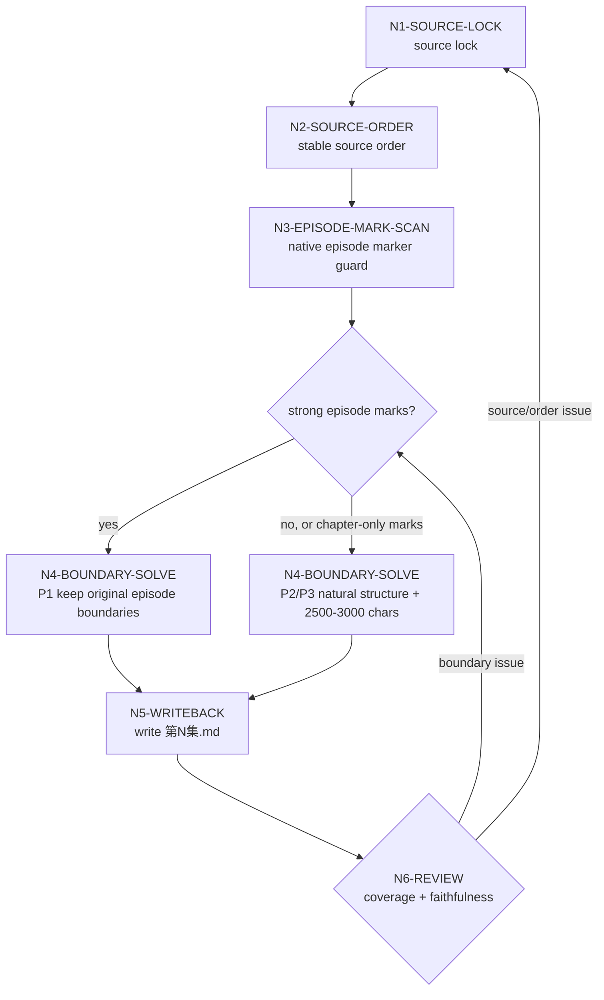

# Episode Split Workflow

## Thinking-Action Network

| node_id | objective | actions | evidence | gate |
| --- | --- | --- | --- | --- |
| `N1-SOURCE-LOCK` | 锁定唯一小说原文真源 | 读取用户显式路径；若无，则定位 `projects/aigc/<项目名>/源/` | 输入路径、文件清单 | 没有可读正文则停止 |
| `N2-SOURCE-ORDER` | 建立稳定阅读顺序 | 按文件名数字、章节号、标题和正文顺序排序 | 排序依据 | 顺序可复查后继续 |
| `N3-EPISODE-MARK-SCAN` | 判断是否自带集数划分 | 扫描 `第N集` / `Episode N` / `第N话` 等强信号，并排除 `第N章`、chapter、卷/章/节等小说结构信号 | 集标列表与排除列表 | 只有真实集数强信号才进入 P1 |
| `N4-BOUNDARY-SOLVE` | 生成分集边界 | P1 按原集标；否则 P2/P3 结合自然结构和 2500-3000 字目标窗 | 边界表 | 每集有来源范围 |
| `N5-WRITEBACK` | 写入逐集原文 | 生成 `第N集.md`，保留原文 | 输出文件清单 | 编号连续后继续 |
| `N6-REVIEW` | 验收覆盖与保真 | 检查覆盖、字数、边界、未改写 | 执行报告 | 失败则回到对应节点 |

## Branch Rules

## Stop Conditions

- 找不到项目根且用户未指定源路径。
- 源路径存在但没有可读小说正文。
- 源资料疑似残缺，无法保证覆盖连续性。
- 目标目录已有正式产物，但无法判断本轮是覆盖、续跑还是修复。

## Native Episode Marker Guard

- `第N集`、`Episode N`、`EP N`、上下文明确为连载单元的 `第N话` 才能触发 P1。
- `第N章`、`Chapter N`、卷/章/节、小节和 story 项目章节文件名只能作为 P2 候选边界证据。
- 章节不等于集数；章节编号不能触发 P1。
- 若输入只有 story 章节结构，默认进入 P2/P3，不得把章节数直接当作 AIGC 集数。
