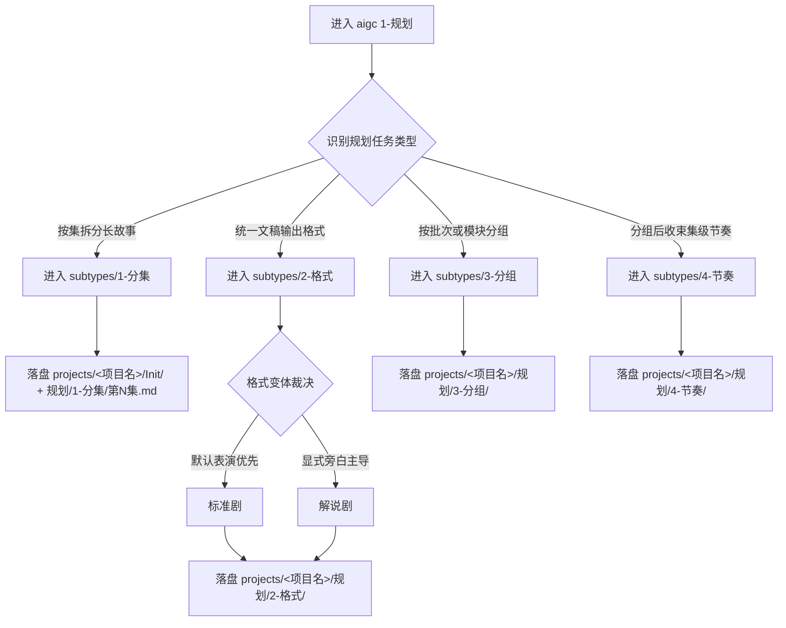
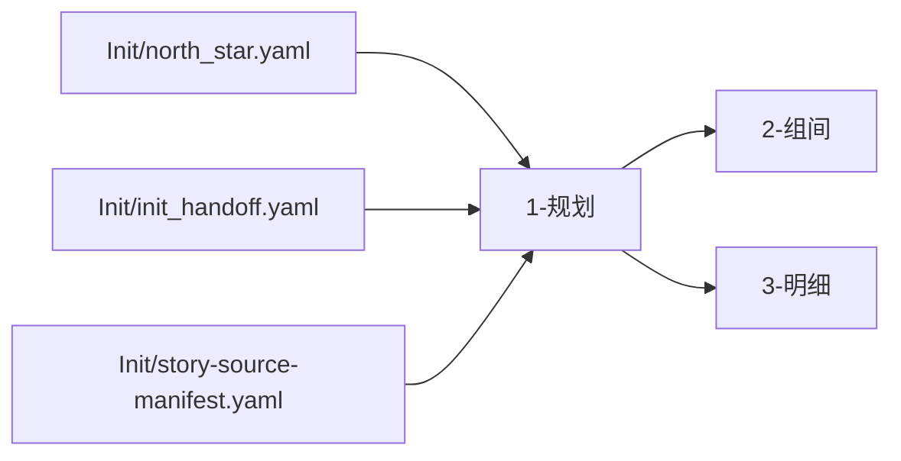

# aigc 1-规划

## Skill Package Layout（对齐最新创作型规范）

- 主合同真源：`SKILL.md`
- 经验层：`CONTEXT.md`
- 标准细则模块层：`references/`
  - `references/chain-of-thought.md`
  - `references/execution-flow.md`
  - `references/type-strategies.md`
  - `references/output-template.md`

硬规则：

1. `SKILL.md` 负责阶段边界、硬门槛、唯一子路径路由与闭环。
2. 根技能级字段系统、流程蓝图、双来源类型矩阵与输出写位细则统一下沉到 `references/`。
3. 若后续规则继续升级，优先修改对应 `references/*.md`，不要在多个文档里平行复制长细则。

## 概述

`1-规划` 是 `aigc` 技能树的结构规划阶段真源。

它负责把 `0-Init` 提供的项目级种子，收束成后续 `2-组间`、`3-明细` 可直接消费的结构化规划结果。当前阶段的 canonical 子路径包括：

1. `1-分集`
2. `2-格式`
3. `3-分组`
4. `4-节奏`

当用户直接进入父级 `1-规划` 而不是点名某个子技能时，默认执行链为：

1. `1-分集`
2. `2-格式`
3. `3-分组`
4. `4-节奏`（默认不选，仅在用户显式强调时追加）

本阶段先回答四件事：

1. 这个项目需要什么层级的结构规划
2. 当前是进入父级全链串行，还是只进入某个规划子路径
3. 规划结果应该如何汇总成单集主稿
4. 规划结果应该落到哪里，如何验收并交给下游

## When to Use

- 需要在 `projects/<项目名>/规划/` 下生成规划阶段产物与阶段验收，并在 `Init/` 写出分集真源与后续 bootstrap 目标路径。
- 需要先做分集规划，再进入编导、脚本或分镜阶段。
- 需要判断当前规划任务属于 `分集 / 格式 / 分组 / 节奏` 中的哪一类。
- 需要把 `0-Init` 的项目种子收束为更具体但仍属规划层的结构合同。

## When Not to Use

- 项目还没有稳定的 `north_star` 或 `init_handoff`，应先回到 `0-Init`。
- 当前任务已经是导演意图、风格 bible、视觉脚本或主体设定，应进入后续阶段。
- 用户只想查看项目状态，而不是新建或重构规划产物。

## 阶段职责边界

### `1-规划` 拥有

- 分集规划合同
- 输出格式规划合同
- 内容分组/批次规划合同
- 分组后节奏规划合同
- `projects/<项目名>/规划/` 下的阶段产物与验证报告
- `1-分集` 写入的 `Init/` 分集真源、可读 sidecar 与后续 bootstrap 目标路径

### `1-规划` 不拥有

- `2-组间` 的导演意图与风格真源
- `3-明细` 的镜头化脚本真源
- `4-主体` 的角色/场景/道具真源
- `5-画面` 的画面 prompt 包与图像真源

## Visual Maps

## Reference Modules (Mandatory)

`aigc 1-规划/SKILL.md` 只保留主合同、边界、门禁与回链；专项细则以下列模块为真源：

- `references/chain-of-thought.md`
- `references/execution-flow.md`
- `references/type-strategies.md`
- `references/output-template.md`

硬规则：

1. 根 `SKILL.md` 仍是唯一主合同；`references/` 是模块化细则承载层，不是并行第二真源。
2. 若字段、流程、来源类型策略或输出写位需要升级，优先回写对应 `references/*.md`。
3. `1-规划` 的双来源上游处理以 `references/type-strategies.md` 为唯一根级类型矩阵真源。

## Canonical Landing

- 阶段根目录：`projects/<项目名>/规划/`
- 规划阶段单集主稿：`projects/<项目名>/规划/第N集.md`
- 项目故事目录：`projects/<项目名>/故事/`
- 故事源登记真源：`projects/<项目名>/Init/story-source-manifest.yaml`
- 阶段验证报告：`projects/<项目名>/规划/validation-report.md`
- `1-分集` 主产物：`projects/<项目名>/Init/episode-split-plan.json`
- `1-分集` 执行报告：默认降为按需 sidecar，不属于父级全链默认交付
- 编导根文件首次创建责任：`2-组间` 首次进入且缺文件时自动初始化
- `2-格式 / 3-分组 / 4-节奏` 的 canonical 产物统一落在 `projects/<项目名>/规划/`

## Shared Planning Master Contract (Mandatory)

`projects/<项目名>/规划/第N集.md` 是 `1-规划` 父技能的单集规划主稿，也是规划阶段对下游暴露的唯一集级业务真源。

执行规则：

1. 当用户进入父级 `1-规划` 且未点名单个子技能时，父级必须按 `1-分集 -> 2-格式 -> 3-分组` 串行执行，并在完成后汇总写回 `projects/<项目名>/规划/第N集.md`。
2. `4-节奏` 默认不自动执行；仅当用户显式强调“做节奏/节奏重排/七步节奏蓝图”等诉求时，才作为第 4 步追加，并把结果 patch 进同一份 `规划/第N集.md`。
3. 子技能产物仍可保留在各自目录中，但其角色是局部 sidecar、证据层或子路径真源，不得冒充规划阶段最终对下游的唯一主稿。
4. `2-组间`、`3-明细` 以及后续旁路技能，默认优先消费 `projects/<项目名>/规划/第N集.md`；只有在需要回查子路径证据时，才下钻到 `Init/`、`规划/2-格式/`、`规划/3-分组/`、`规划/4-节奏/`。
5. 若本轮只直达单个子技能而未执行父级汇总，不得伪称“规划阶段主稿已完成”；此时最多只完成该子路径局部产物。
6. 当 `source_type in {storyboard_script, hybrid_story_text}` 且 `locked_preset_axes` 包含 `scene_boundary` 时，主稿必须显式投影 `source_profile`，并将 `场景号` 绑定到连续时空单元；`镜号 / 锚点 / 组号` 必须单独保留，不得把镜号或组号直接升格为新场景号。
7. 若同一连续时空被多个组级锚点连续继承，允许写成 `场景X（续）`；不得因为组切分或镜号递增而伪造新的场景编号。
8. 父级写入 `projects/<项目名>/规划/validation-report.md` 之前，必须先确认所有已执行子路径的本地 validator / gate 已通过；任何一个已执行子路径仍处于 FAIL、strict gate 未过、或 validator 非零退出时，阶段级结论只能写返工/阻塞，不得写 `PASS`。

## Council Runtime Contract (Mandatory)

进入 `1-规划` 或其可直达子技能时，必须先读取：

- `projects/<项目名>/team.yaml`
- `.agents/skills/aigc/_shared/council-runtime/module-spec.md`

执行规则：

1. 若 `team.yaml` 不存在、`enabled != true`、或全部成员为空，走普通路径。
2. 若启用且 `roles.planning.members` 非空，先以 subagents 模式调用 `策划` 顾问团，获取结构规划与对象池方向建议。
3. 主代理整合 `策划` 顾问意见后，再产出本轮规划草案与阶段产物。
4. 在 `projects/<项目名>/规划/validation-report.md` 写作前后，若 `roles.review.members` 非空，则调用 `评审` 顾问团给出 PASS/返工意见。
5. 无论顾问团是否启用，最终 canonical 写回权都保留给主代理。
6. 若运行环境不能真实并发 subagents，允许降级为顺序读取 agent 文档并模拟顾问纪要，但必须显式说明降级。

## Story Source Gate (Mandatory)

进入 `1-规划` 或其子路径前，必须先读取：

- `projects/<项目名>/Init/story-source-manifest.yaml`
- `.agents/skills/aigc/_shared/story-source-contract.md`

执行规则：

1. 若当前任务目标不是 `1-分集`，但故事主源缺失，允许继续进入不依赖完整原文的子路径，例如 `2-格式`。
2. 若当前任务目标是 `1-分集`，只要 `readiness.can_enter_episode_split == true`，就允许按已覆盖故事源进入增量执行。
3. 若 `readiness.can_finalize_full_season_episode_split != true`，必须将本轮结果标记为“增量/局部规划”，不得冒充整季正式分集完成。
4. 若 manifest 缺失或 `can_enter_episode_split != true`，必须输出标准“故事源补充卡”，不得让用户自行猜测该补什么。
5. 执行案、大纲、角色设定文档默认只能视为 `development_briefs`，除非用户明确授权其作为分集主故事源。

## Story Source Mode And Preset Handoff (Mandatory)

`1-规划` 不再默认把上游只理解成“小说原文”。根技能必须先判定故事主源属于哪一类，再决定如何交给 `3-明细`：

1. 详细类型矩阵以 `references/type-strategies.md` 为准。
2. 当 `primary_story_source.source_type == storyboard_script` 时，现有场次边界、镜头顺序、关键运镜/转场钩子默认视为上游预设证据，而不是待清洗噪音。
3. 进入 `1-分集` 或完成父级规划时，必须把 `source_type / preset_retention_mode / detail_expansion_mode / locked_preset_axes` 写回共享 handoff，供 `2-组间` 首次建根时写入 `metadata.source_profile`。
4. `3-明细` 若读到 `metadata.source_profile.preset_retention_mode in {preserve_and_extend, preserve_only}`，默认只能顺着预设扩写，不得推翻已锁定轴。
5. 若用户明确授权重写 storyboard 预设，必须先更新 manifest 或阶段验收报告，再允许下游放开。

## 子路径路由矩阵

| 子路径 | 默认调度 | 当前状态 | 触发条件 | 主产物落点 | 备注 |
| --- | --- | --- | --- | --- | --- |
| `1-分集` | 串行第 1 步 | 已建合同 | 需要把长故事、剧本原文或混合分镜文本按集切分，且 `story-source-manifest.yaml` 已放行 | `projects/<项目名>/Init/` + `projects/<项目名>/规划/1-分集/第N集.md` | 负责提供集边界、本地可读 sidecar、以及供 `2-组间` 未来建根的 `bootstrap_output` 目标路径 |
| `2-格式` | 串行第 2 步 | 已建父子合同 | 需要统一文档模板、文本层级、场景标题与变体格式 | `projects/<项目名>/规划/2-格式/` | 先进入父技能，再在 `标准剧/解说剧` 间唯一裁决；结果需回写到父级 `规划/第N集.md` |
| `3-分组` | 串行第 3 步 | 已建合同 | 需要按章节、任务批次、镜头包或制作波次做结构分组 | `projects/<项目名>/规划/3-分组/第N集.md` | 集粒度沿用 `1-分集`，仅在集内执行分组；结果需汇总进父级主稿 |
| `4-节奏` | 显式追加第 4 步 | 已建合同 | 需要在分组结果上收束主驱动、七步、峰值与节奏重排边界 | `projects/<项目名>/规划/4-节奏/第N集.md` | 默认不选；仅在用户显式要求且 `original_adherence=false` 时进入，并 patch 回父级主稿 |

硬规则：

1. 当执行父级 `1-规划` 全链时，子路径目录带数字前缀，默认按升序串行。
2. `2-格式` 已具备父子合同；正式执行时必须在 `标准剧/解说剧` 间输出唯一主变体。
3. `4-节奏` 默认不进入，即使目录存在且具备合同，也不得因为“还有一个子路径没跑”就自动补跑。
4. 不得因为目录存在或参考仓已有相似能力，就伪造当前子路径的执行细节。

## Mandatory Workflow

1. 读取 `projects/<项目名>/team.yaml`，并按需加载 `.agents/skills/aigc/_shared/council-runtime/module-spec.md`。
2. 读取 `projects/<项目名>/Init/north_star.yaml`、`projects/<项目名>/Init/init_handoff.yaml` 与 `projects/<项目名>/Init/story-source-manifest.yaml`。
3. 依据 `references/type-strategies.md` 先判定 `source_mode`、`preset_retention_mode` 与 `detail_expansion_mode`。
4. 若顾问团启用且 `roles.planning.members` 非空，先调用 `策划` 顾问团，再进入阶段路由。
5. 判断当前请求属于“父级全链规划”还是 `1-分集`、`2-格式`、`3-分组`、`4-节奏` 中的单子路径直达。
6. 若命中父级全链规划，默认按 `1-分集 -> 2-格式 -> 3-分组` 执行；`4-节奏` 仅在用户显式要求时追加。
7. 若链上包含 `1-分集`，先检查 `story-source-manifest.yaml` 是否放行；未放行则返回标准补充提示；若仅部分放行，则进入增量规划并写清覆盖边界。
8. 若链上包含 `2-格式`，必须在 `标准剧/解说剧` 间完成唯一变体裁决。
9. 若链上包含 `4-节奏`，先确认 `3-分组` 结果已稳定，且 `Init.original_adherence=false`。
10. 若目标子路径合同缺失，停止向下伪造，返回缺口与补建落点。
11. 若目标子路径合同存在，则进入对应子技能执行。
12. 当已执行子路径声明了本地 validator / gate 时，父级必须先运行并读取其结果；例如命中 `3-分组` 时，必须先运行 `python3 .agents/skills/aigc/1-规划/subtypes/3-分组/scripts/validate_grouping.py --input "projects/<项目名>/规划/3-分组"`。
13. 只有当所有已执行子路径都通过各自 gate 后，父级才允许把有效结果聚合写回 `projects/<项目名>/规划/第N集.md`；未执行的子路径不得补空占位。
14. 父级全链默认保留 `规划/第N集.md`、`规划/validation-report.md`、`规划/1-分集/第N集.md` 与必要结构账本；解释性子路径报告默认按需生成。
15. 在阶段级 `validation-report.md` 前后按需调用 `评审` 顾问团。
16. 将阶段级验收结论落到 `projects/<项目名>/规划/validation-report.md`；若命中 `1-分集`，同时在 `Init/` 写分集真源，并登记后续 `2-组间` 建根所需的 `bootstrap_output` 目标路径与 `source_profile` handoff。
17. 返回唯一推荐的下一阶段入口，而不是模糊候选集合。

## Root-Cause Execution Contract (Mandatory)

当出现以下症状时，必须先修 `1-规划` 的源层合同，而不是只补单次规划结果：

- `1-规划` 目录存在，但父级没有路由合同
- 某个规划子路径已补内容，但从父级看不出何时进入
- 子技能各自落盘成功，但父级没有 `projects/<项目名>/规划/第N集.md` 规划主稿
- 规划产物落点漂移到 `projects/<项目名>/规划/` 之外
- `0-Init` 的种子无法映射到规划阶段
- 规划阶段越权替下游阶段拍死导演、脚本或主体真源

必经链路：

`Symptom -> Direct Technical Cause -> Rule Source -> Meta Rule Source -> Fix Landing Points`

优先检查：

- `Rule Source`
  - `.agents/skills/aigc/1-规划/SKILL.md`
  - `.agents/skills/aigc/1-规划/CONTEXT.md`
  - `.agents/skills/aigc/1-规划/subtypes/*/SKILL.md`
  - `.agents/skills/aigc/1-规划/subtypes/2-格式/subtypes/*/SKILL.md`
- `Meta Rule Source`
  - `.agents/skills/aigc/SKILL.md`
  - 根 `AGENTS.md`

## Field Master

| field_id | 输出位置/字段 | 内容要求 | 默认责任 Step | 质量维度 | 失败码 |
| --- | --- | --- | --- | --- | --- |
| FIELD-PLAN-ROOT-01 | 阶段定位 | 明确 `1-规划` 是结构规划阶段，而不是编导/脚本替身 | S1 | 阶段边界清晰度 | FAIL-PLAN-ROOT-01 |
| FIELD-PLAN-ROUTE-02 | 子路径路由矩阵 | 明确 `分集 / 格式 / 分组 / 节奏` 的进入条件、状态与落点 | S2 | 路由完整性 | FAIL-PLAN-ROUTE-02 |
| FIELD-PLAN-LAND-03 | Canonical Landing | 锁定 `projects/<项目名>/规划/` 及各子路径产物落点 | S3 | 落点一致性 | FAIL-PLAN-LAND-03 |
| FIELD-PLAN-CLOSE-04 | 阶段闭环 | 说明验收、缺口报告和下一阶段唯一入口 | S4 | 闭环可执行性 | FAIL-PLAN-CLOSE-04 |
| FIELD-PLAN-SRC-05 | 来源类型与预设交接 | 锁定双来源类型判定、预设保护模式与 `3-明细` handoff | S5 | 类型化处理完整性 | FAIL-PLAN-SRC-05 |
| FIELD-PLAN-MASTER-06 | 规划主稿聚合 | 将已执行子路径结果汇总到 `projects/<项目名>/规划/第N集.md`，并声明 `4-节奏` 默认跳过策略 | S6 | 单一主稿完整性 | FAIL-PLAN-MASTER-06 |

## Thought Pass Map

| step_id | 聚焦字段 | 核心问题 | 生成动作 | 未达标信号 |
| --- | --- | --- | --- | --- |
| S1 | FIELD-PLAN-ROOT-01 | `1-规划` 到底负责什么 | 锁定阶段边界与上下游关系 | 把规划写成编导或脚本说明 |
| S2 | FIELD-PLAN-ROUTE-02 | 当前任务应进入哪个子路径 | 明确四个子路径的路由矩阵与状态 | 只有目录，没有进入条件 |
| S3 | FIELD-PLAN-LAND-03 | 规划结果落到哪里 | 固定阶段根目录与各子路径落点 | 产物路径漂移 |
| S4 | FIELD-PLAN-CLOSE-04 | 阶段如何结案并交接 | 固定验收、缺口报告、下一阶段推荐 | 任务完成但无法续跑 |
| S5 | FIELD-PLAN-SRC-05 | 当前是小说原文型还是分镜脚本型上游 | 锁定 `source_mode -> preset_retention -> detail_expansion` | 分镜脚本预设点没有正式交接链 |
| S6 | FIELD-PLAN-MASTER-06 | 父级有没有把已执行子路径汇总成单集主稿 | 写回 `projects/<项目名>/规划/第N集.md` 并登记跳过的可选子路径 | 子技能产物分散、下游无核心入口 |

## Pass Table

| field_id | Pass Standard | Fail Code | Rework Entry |
| --- | --- | --- | --- |
| FIELD-PLAN-ROOT-01 | 阶段边界清晰且不越权 | FAIL-PLAN-ROOT-01 | S1 |
| FIELD-PLAN-ROUTE-02 | 子路径进入条件、状态、落点完整 | FAIL-PLAN-ROUTE-02 | S2 |
| FIELD-PLAN-LAND-03 | 所有规划产物路径一致 | FAIL-PLAN-LAND-03 | S3 |
| FIELD-PLAN-CLOSE-04 | 有缺口报告、验收与唯一下一入口 | FAIL-PLAN-CLOSE-04 | S4 |
| FIELD-PLAN-SRC-05 | 双来源类型与预设保护链已落到 manifest 与编导根文件 | FAIL-PLAN-SRC-05 | S5 |
| FIELD-PLAN-MASTER-06 | `projects/<项目名>/规划/第N集.md` 已成为规划阶段唯一集级主稿 | FAIL-PLAN-MASTER-06 | S6 |

## Context Preload (Mandatory)

- 每次调用本技能时，必须自动加载同目录 `CONTEXT.md`。
- 需要细化字段系统、流程蓝图、类型矩阵与输出写位时，继续加载本目录 `references/*.md`。
- 若进入具体子路径，继续加载对应 `subtypes/<子路径>/SKILL.md` 与 `CONTEXT.md`。
- 若项目根 `team.yaml.enabled == true`，继续加载 `.agents/skills/aigc/_shared/council-runtime/module-spec.md`。
- 优先级遵循：用户显式请求 > 根 `AGENTS.md` > `.agents/skills/aigc/SKILL.md` > 本 `SKILL.md` > 本 `CONTEXT.md`。
