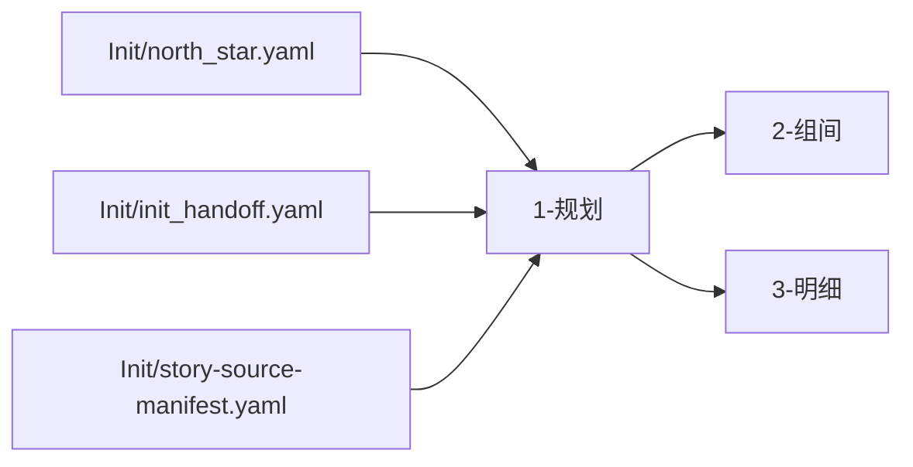

# aigc 1-规划

## 概述

`1-规划` 是 `aigc` 技能树的结构规划阶段真源。

它负责把 `0-Init` 提供的项目级种子，收束成后续 `2-组间`、`3-明细` 可直接消费的结构化规划结果。当前阶段的 canonical 子路径包括：

1. `1-分集`
2. `2-格式`
3. `3-分组`
4. `4-节奏`

本阶段先回答三件事：

1. 这个项目需要什么层级的结构规划
2. 当前应进入哪个规划子路径
3. 规划结果应该落到哪里，如何验收并交给下游

## When to Use

- 需要在 `projects/<项目名>/规划/` 下生成规划阶段产物与阶段验收，并按需写出 `Init/` bootstrap 产物。
- 需要先做分集规划，再进入编导、脚本或分镜阶段。
- 需要判断当前规划任务属于 `分集 / 格式 / 分组 / 节奏` 中的哪一类。
- 需要把 `0-Init` 的项目种子收束为更具体但仍属规划层的结构合同。

## When Not to Use

- 项目还没有稳定的 `north_star` 或 `init_handoff`，应先回到 `0-Init`。
- 当前任务已经是导演意图、风格 bible、视觉脚本或主体设定，应进入后续阶段。
- 用户只想查看项目状态，而不是新建或重构规划产物。

## 阶段职责边界

### `1-规划` 拥有

- 分集规划合同
- 输出格式规划合同
- 内容分组/批次规划合同
- 分组后节奏规划合同
- `projects/<项目名>/规划/` 下的阶段产物与验证报告
- `1-分集` 写入的 `Init/` bootstrap 产物与 `编导/第N集.json` 初始根文件

### `1-规划` 不拥有

- `2-组间` 的导演意图与风格真源
- `3-明细` 的镜头化脚本真源
- `4-主体` 的角色/场景/道具真源
- `5-画面` 的画面 prompt 包与图像真源

## Visual Maps

## Canonical Landing

- 阶段根目录：`projects/<项目名>/规划/`
- 项目故事目录：`projects/<项目名>/故事/`
- 故事源登记真源：`projects/<项目名>/Init/story-source-manifest.yaml`
- 阶段验证报告：`projects/<项目名>/规划/validation-report.md`
- `1-分集` bootstrap 主产物：`projects/<项目名>/Init/episode-split-plan.json`
- `1-分集` bootstrap 执行报告：`projects/<项目名>/Init/episode-split-report.md`
- 编导根文件初始化落点：`projects/<项目名>/编导/第N集.json`
- `2-格式 / 3-分组 / 4-节奏` 的 canonical 产物统一落在 `projects/<项目名>/规划/`

## Council Runtime Contract (Mandatory)

进入 `1-规划` 或其可直达子技能时，必须先读取：

- `projects/<项目名>/team.yaml`
- `.agents/skills/aigc/_shared/council-runtime/module-spec.md`

执行规则：

1. 若 `team.yaml` 不存在、`enabled != true`、或全部成员为空，走普通路径。
2. 若启用且 `roles.planning.members` 非空，先以 subagents 模式调用 `策划` 顾问团，获取结构规划与对象池方向建议。
3. 主代理整合 `策划` 顾问意见后，再产出本轮规划草案与阶段产物。
4. 在 `projects/<项目名>/规划/validation-report.md` 写作前后，若 `roles.review.members` 非空，则调用 `评审` 顾问团给出 PASS/返工意见。
5. 无论顾问团是否启用，最终 canonical 写回权都保留给主代理。
6. 若运行环境不能真实并发 subagents，允许降级为顺序读取 agent 文档并模拟顾问纪要，但必须显式说明降级。

## Story Source Gate (Mandatory)

进入 `1-规划` 或其子路径前，必须先读取：

- `projects/<项目名>/Init/story-source-manifest.yaml`
- `.agents/skills/aigc/_shared/story-source-contract.md`

执行规则：

1. 若当前任务目标不是 `1-分集`，但故事主源缺失，允许继续进入不依赖完整原文的子路径，例如 `2-格式`。
2. 若当前任务目标是 `1-分集`，只要 `readiness.can_enter_episode_split == true`，就允许按已覆盖故事源进入增量执行。
3. 若 `readiness.can_finalize_full_season_episode_split != true`，必须将本轮结果标记为“增量/局部规划”，不得冒充整季正式分集完成。
4. 若 manifest 缺失或 `can_enter_episode_split != true`，必须输出标准“故事源补充卡”，不得让用户自行猜测该补什么。
5. 执行案、大纲、角色设定文档默认只能视为 `development_briefs`，除非用户明确授权其作为分集主故事源。

## 子路径路由矩阵

| 子路径 | 默认调度 | 当前状态 | 触发条件 | 主产物落点 | 备注 |
| --- | --- | --- | --- | --- | --- |
| `1-分集` | 串行第 1 步 | 已建合同 | 需要把长故事、剧本原文或混合分镜文本按集切分，且 `story-source-manifest.yaml` 已放行 | `projects/<项目名>/Init/` + `projects/<项目名>/编导/第N集.json` | 例外型 bootstrap 子路径；负责首次创建编导根文件 |
| `2-格式` | 串行第 2 步 | 已建父子合同 | 需要统一文档模板、文本层级、场景标题与变体格式 | `projects/<项目名>/规划/2-格式/` | 先进入父技能，再在 `标准剧/解说剧` 间唯一裁决 |
| `3-分组` | 串行第 3 步 | 已建合同 | 需要按章节、任务批次、镜头包或制作波次做结构分组 | `projects/<项目名>/规划/3-分组/第N集.md` | 集粒度沿用 `1-分集`，仅在集内执行分组 |
| `4-节奏` | 串行第 4 步 | 已建合同 | 需要在分组结果上收束主驱动、七步、峰值与节奏重排边界 | `projects/<项目名>/规划/4-节奏/第N集.md` | 仅在 `original_adherence=false` 且 `3-分组` 稳定时进入 |

硬规则：

1. 子路径目录带数字前缀，默认按升序串行。
2. `2-格式` 已具备父子合同；正式执行时必须在 `标准剧/解说剧` 间输出唯一主变体。
3. 不得因为目录存在或参考仓已有相似能力，就伪造当前子路径的执行细节。

## Mandatory Workflow

1. 读取 `projects/<项目名>/team.yaml`，并按需加载 `.agents/skills/aigc/_shared/council-runtime/module-spec.md`。
2. 读取 `projects/<项目名>/Init/north_star.yaml`、`projects/<项目名>/Init/init_handoff.yaml` 与 `projects/<项目名>/Init/story-source-manifest.yaml`。
3. 若顾问团启用且 `roles.planning.members` 非空，先调用 `策划` 顾问团，再进入阶段路由。
4. 判断当前请求属于 `1-分集`、`2-格式`、`3-分组`、`4-节奏` 中哪一个唯一主入口。
5. 若目标是 `1-分集`，先检查 `story-source-manifest.yaml` 是否放行；未放行则返回标准补充提示；若仅部分放行，则进入增量规划并写清覆盖边界。
6. 若目标是 `2-格式`，先进入父技能，再在 `标准剧/解说剧` 间完成唯一变体裁决。
7. 若目标是 `4-节奏`，先确认 `3-分组` 结果已稳定，且 `Init.original_adherence=false`。
8. 若目标子路径合同缺失，停止向下伪造，返回缺口与补建落点。
9. 若目标子路径合同存在，则进入对应子技能执行。
10. 在阶段级 `validation-report.md` 前后按需调用 `评审` 顾问团。
11. 将阶段级验收结论落到 `projects/<项目名>/规划/validation-report.md`；若命中 `1-分集`，同时在 `Init/` 写 bootstrap 产物，并首次创建 `projects/<项目名>/编导/第N集.json`。
12. 返回唯一推荐的下一阶段入口，而不是模糊候选集合。

## Root-Cause Execution Contract (Mandatory)

当出现以下症状时，必须先修 `1-规划` 的源层合同，而不是只补单次规划结果：

- `1-规划` 目录存在，但父级没有路由合同
- 某个规划子路径已补内容，但从父级看不出何时进入
- 规划产物落点漂移到 `projects/<项目名>/规划/` 之外
- `0-Init` 的种子无法映射到规划阶段
- 规划阶段越权替下游阶段拍死导演、脚本或主体真源

必经链路：

`Symptom -> Direct Technical Cause -> Rule Source -> Meta Rule Source -> Fix Landing Points`

优先检查：

- `Rule Source`
  - `.agents/skills/aigc/1-规划/SKILL.md`
  - `.agents/skills/aigc/1-规划/CONTEXT.md`
  - `.agents/skills/aigc/1-规划/subtypes/*/SKILL.md`
  - `.agents/skills/aigc/1-规划/subtypes/2-格式/subtypes/*/SKILL.md`
- `Meta Rule Source`
  - `.agents/skills/aigc/SKILL.md`
  - 根 `AGENTS.md`

## Field Master

| field_id | 输出位置/字段 | 内容要求 | 默认责任 Step | 质量维度 | 失败码 |
| --- | --- | --- | --- | --- | --- |
| FIELD-PLAN-ROOT-01 | 阶段定位 | 明确 `1-规划` 是结构规划阶段，而不是编导/脚本替身 | S1 | 阶段边界清晰度 | FAIL-PLAN-ROOT-01 |
| FIELD-PLAN-ROUTE-02 | 子路径路由矩阵 | 明确 `分集 / 格式 / 分组` 的进入条件、状态与落点 | S2 | 路由完整性 | FAIL-PLAN-ROUTE-02 |
| FIELD-PLAN-LAND-03 | Canonical Landing | 锁定 `projects/<项目名>/规划/` 及各子路径产物落点 | S3 | 落点一致性 | FAIL-PLAN-LAND-03 |
| FIELD-PLAN-CLOSE-04 | 阶段闭环 | 说明验收、缺口报告和下一阶段唯一入口 | S4 | 闭环可执行性 | FAIL-PLAN-CLOSE-04 |

## Thought Pass Map

| step_id | 聚焦字段 | 核心问题 | 生成动作 | 未达标信号 |
| --- | --- | --- | --- | --- |
| S1 | FIELD-PLAN-ROOT-01 | `1-规划` 到底负责什么 | 锁定阶段边界与上下游关系 | 把规划写成编导或脚本说明 |
| S2 | FIELD-PLAN-ROUTE-02 | 当前任务应进入哪个子路径 | 明确三个子路径的路由矩阵与状态 | 只有目录，没有进入条件 |
| S3 | FIELD-PLAN-LAND-03 | 规划结果落到哪里 | 固定阶段根目录与各子路径落点 | 产物路径漂移 |
| S4 | FIELD-PLAN-CLOSE-04 | 阶段如何结案并交接 | 固定验收、缺口报告、下一阶段推荐 | 任务完成但无法续跑 |

## Pass Table

| field_id | Pass Standard | Fail Code | Rework Entry |
| --- | --- | --- | --- |
| FIELD-PLAN-ROOT-01 | 阶段边界清晰且不越权 | FAIL-PLAN-ROOT-01 | S1 |
| FIELD-PLAN-ROUTE-02 | 子路径进入条件、状态、落点完整 | FAIL-PLAN-ROUTE-02 | S2 |
| FIELD-PLAN-LAND-03 | 所有规划产物路径一致 | FAIL-PLAN-LAND-03 | S3 |
| FIELD-PLAN-CLOSE-04 | 有缺口报告、验收与唯一下一入口 | FAIL-PLAN-CLOSE-04 | S4 |

## Context Preload (Mandatory)

- 每次调用本技能时，必须自动加载同目录 `CONTEXT.md`。
- 若进入具体子路径，继续加载对应 `subtypes/<子路径>/SKILL.md` 与 `CONTEXT.md`。
- 若项目根 `team.yaml.enabled == true`，继续加载 `.agents/skills/aigc/_shared/council-runtime/module-spec.md`。
- 优先级遵循：用户显式请求 > 根 `AGENTS.md` > `.agents/skills/aigc/SKILL.md` > 本 `SKILL.md` > 本 `CONTEXT.md`。
