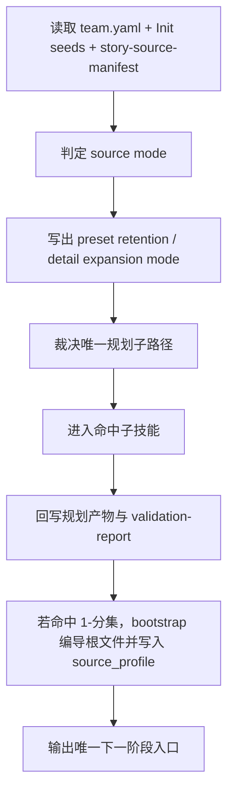

# aigc 1-规划 / Execution Flow

本文件承载 `aigc 1-规划` 根技能的执行流程细则与 source-mode 交接规则。

## 主流程

## Phase / Tranche

| phase_id | 核心动作 | 最低输出 | 失败回退 |
| --- | --- | --- | --- |
| P0 | 读取 `team.yaml`、`north_star.yaml`、`init_handoff.yaml`、`story-source-manifest.yaml` | 输入清单与缺口 | 缺关键输入则暂停 |
| P1 | 依据 `references/type-strategies.md` 判定 `source_mode` | `source_mode verdict` | 信号冲突则进入 unknown 路由 |
| P2 | 锁定 `preset_retention_mode` 与 `detail_expansion_mode` | 预设保护卡 | 保护范围不清则回退 `story-source-manifest.yaml` |
| P3 | 裁决唯一规划子路径 | route decision | 子路径前提不满足则停止向下伪造 |
| P4 | 调用命中子技能执行 | 子路径产物 | 子路径合同缺失则先补合同 |
| P5 | 写阶段级 `validation-report.md` 与交接结论 | 验收结论 | 验收失败则回到命中子技能 |
| P6 | 若命中 `1-分集`，为 `第N集.json` 写入 `metadata.source_profile` | bootstrap root file | 写位缺失则回修 shared schema/template |

## Source-Mode Writeback Rules

1. `story-source-manifest.yaml` 是来源类型判定真源。
2. `references/type-strategies.md` 负责把 `source_type -> planning strategy -> preset retention -> detail expansion` 压成稳定矩阵。
3. 若命中 `1-分集`，必须把以下字段写入每个 bootstrap `projects/<项目名>/编导/第N集.json` 的 `metadata.source_profile`：
   - `source_type`
   - `preset_retention_mode`
   - `detail_expansion_mode`
   - `locked_preset_axes`
   - `preset_registry`
4. 若当前任务未命中 `1-分集`，但已经需要为后续阶段定规则，必须至少在 `projects/<项目名>/规划/validation-report.md` 写出 `source_mode verdict`，不得留成隐含假设。

## Storyboard-Script Safety Gate

当 `primary_story_source.source_type == storyboard_script` 时：

1. 现有场次边界、镜头顺序、运镜意图、转场钩子默认视为“上游预设证据”。
2. `1-规划` 允许顺着这些预设做集级/组级收束，但不得为了追求整齐节奏主动清洗掉它们。
3. `3-明细` 默认只允许“preserve and extend”，不得把已锁定的预设轴重写成第二套镜头逻辑。
4. 若用户明确授权推翻预设，必须先回写 manifest 或阶段验收报告，再让下游放开。
5. 若 storyboard 预设本身较粗，允许在 `preset_registry` 中把锚点登记为 `soft_lock + single_anchor_multi_shot`，为 `1-分镜表现` 的一锚多镜展开预留合法入口。
