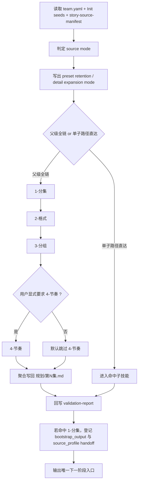

# aigc 1-规划 / Execution Flow

本文件承载 `aigc 1-规划` 根技能的执行流程细则与 source-mode 交接规则。

## 主流程

## Phase / Tranche

| phase_id | 核心动作 | 最低输出 | 失败回退 |
| --- | --- | --- | --- |
| P0 | 读取 `team.yaml`、`north_star.yaml`、`init_handoff.yaml`、`story-source-manifest.yaml` | 输入清单与缺口 | 缺关键输入则暂停 |
| P1 | 依据 `references/type-strategies.md` 判定 `source_mode` | `source_mode verdict` | 信号冲突则进入 unknown 路由 |
| P2 | 锁定 `preset_retention_mode` 与 `detail_expansion_mode` | 预设保护卡 | 保护范围不清则回退 `story-source-manifest.yaml` |
| P3 | 判定本轮是父级全链还是单子路径直达 | route decision | 路由不清则回到用户请求与根技能合同 |
| P4 | 若为父级全链，按 `1-分集 -> 2-格式 -> 3-分组` 串行执行 | 子路径结果 | 任一步缺合同则先补合同 |
| P5 | 仅当用户显式要求时追加 `4-节奏` | 节奏 patch 或默认跳过记录 | 未显式要求则不得自动补跑 |
| P6 | 把已执行子路径结果聚合写回 `projects/<项目名>/规划/第N集.md` | 单集规划主稿 | 聚合缺位则不得宣称规划阶段完成 |
| P7 | 写阶段级 `validation-report.md` 与交接结论 | 验收结论 | 验收失败则回到相关子路径或聚合层 |
| P8 | 若本轮包含 `1-分集`，登记未来 `bootstrap_output` 与 `source_profile` handoff | planning handoff | 写位缺失则回修 shared contract/template |

## Source-Mode Writeback Rules

1. `story-source-manifest.yaml` 是来源类型判定真源。
2. `references/type-strategies.md` 负责把 `source_type -> planning strategy -> preset retention -> detail expansion` 压成稳定矩阵。
3. 若命中 `1-分集`，必须先把以下字段写入规划 handoff，并供 `2-组间` 首次创建 `projects/<项目名>/编导/第N集.json` 时写入 `metadata.source_profile`：
   - `source_type`
   - `preset_retention_mode`
   - `detail_expansion_mode`
   - `locked_preset_axes`
   - `preset_registry`
4. 若当前任务未命中 `1-分集`，但已经需要为后续阶段定规则，必须至少在 `projects/<项目名>/规划/validation-report.md` 写出 `source_mode verdict`，不得留成隐含假设。

## Parent Aggregation Rules

1. 父级全链模式下，`projects/<项目名>/规划/第N集.md` 必须成为最终集级规划主稿。
2. `1-分集` 提供 `集边界 + 主事件 + bootstrap_output 目标路径`，`2-格式` 提供 `scene-first draft + 主变体 + 格式边界`，`3-分组` 提供 `分组计划表 + 组级容器 + compact projection source`。
3. `4-节奏` 若被显式执行，其结果只能作为 patch 叠加进同一份主稿；不得再生成第二份父级总稿。
4. 父级全链模式默认不保留各子路径报告；除非用户显式要求调试/复核，否则这些解释性报告应视为可删除 sidecar。
5. 若本轮只执行了单个子路径，则允许只落局部 sidecar，但必须在 `validation-report.md` 标记“父级主稿未完成”。
6. 若当前集命中 `storyboard_script` 或 `hybrid_story_text`，聚合后的主稿必须在正文前显式写出 `source_type / preset_retention_mode / detail_expansion_mode / locked_preset_axes / inherited anchors`。
7. 若 `locked_preset_axes` 包含 `scene_boundary`，主稿中的 `场景号` 只能按连续时空编号；`镜号` 与 `锚点` 作为独立证据字段显式保留，不得按镜号逐条改写成新的场景号。
8. 父级聚合不能只把 `2-格式/第N集.md` 原样复制后补 `## Gxx` 标题；至少要把 `3-分组` 的 `组目标 / 结构锚点 / 交接约束` 投影进每个组标题下。

## Storyboard-Script Safety Gate

当 `primary_story_source.source_type == storyboard_script` 时：

1. 现有场次边界、镜头顺序、运镜意图、转场钩子默认视为“上游预设证据”。
2. `1-规划` 允许顺着这些预设做集级/组级收束，但不得为了追求整齐节奏主动清洗掉它们。
3. `3-明细` 默认只允许“preserve and extend”，不得把已锁定的预设轴重写成第二套镜头逻辑。
4. 若用户明确授权推翻预设，必须先回写 manifest 或阶段验收报告，再让下游放开。
5. 若 storyboard 预设本身较粗，允许在 `preset_registry` 中把锚点登记为 `soft_lock + single_anchor_multi_shot`，为 `1-分镜表现` 的一锚多镜展开预留合法入口。
