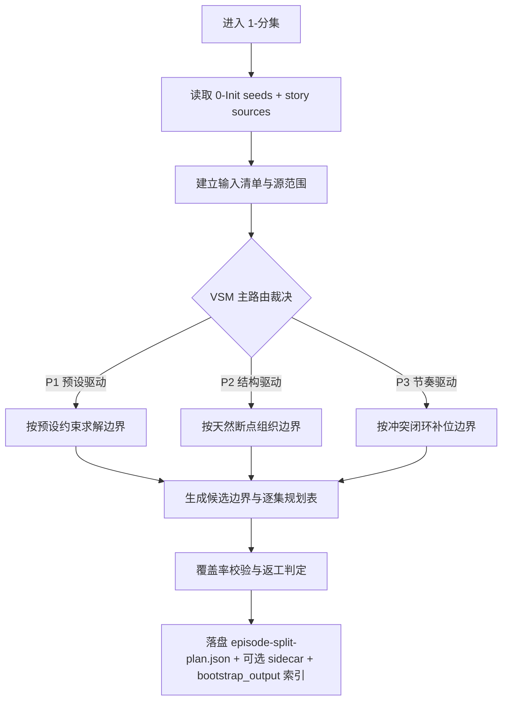
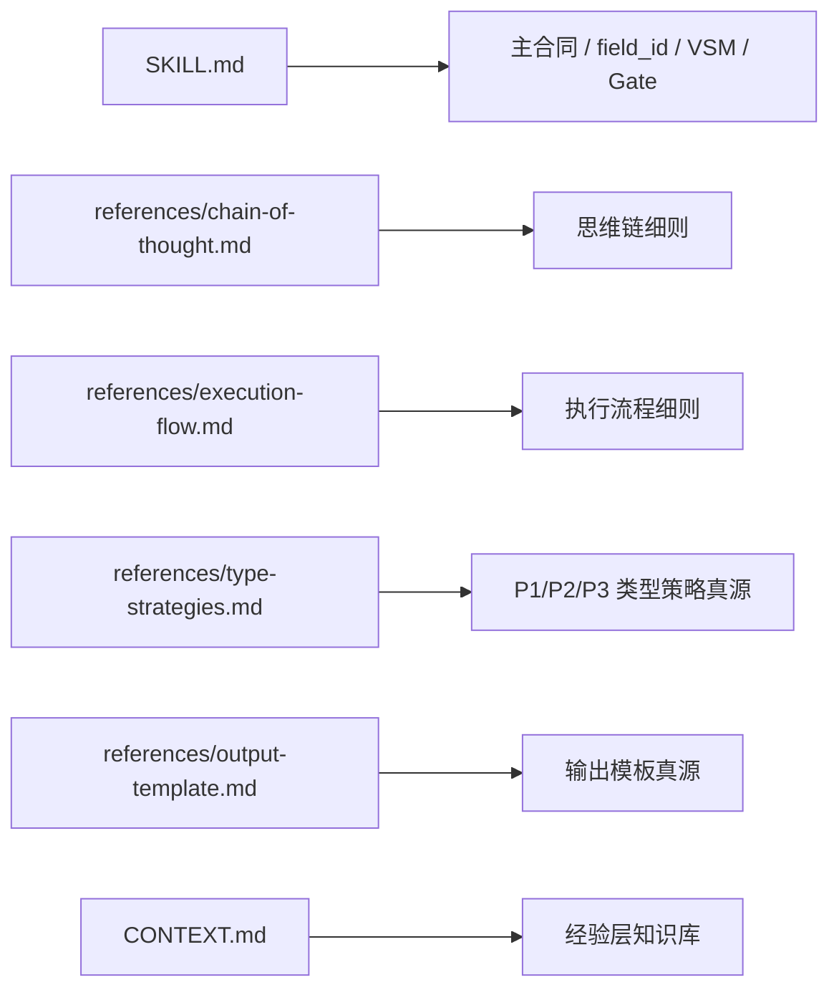

# aigc 1-规划 / 1-分集

## 概述

`1-分集` 负责把项目故事源切成规划阶段可直接消费的逐集文档，并为后续 `1-规划/4-节奏`、`2-组间`、`3-明细`、`5-画面` 提供稳定的集级入口与未来建根目标路径。

本子技能现在按 `skill-内容输出型` 的最新规范重构为：

- `SKILL.md` 只保留主合同、字段门禁、VSM 路由与闭环规则。
- `references/` 作为核心细则模块层，承载思维链、执行流程、类型策略与输出模板真源。
- `CONTEXT.md` 只承载经验层知识库与里程碑案例，不再和主合同竞争真源。

## When to Use

- 需要把长篇小说、剧本原文、口述故事或混合分镜文本拆成逐集规划文件。
- 需要在 `projects/<项目名>/Init/` 下生成分集规划主文件、执行报告与可选索引，并为后续 `2-组间` 预留 `bootstrap_output` 目标路径。
- 需要先判断该故事应按预设、天然结构还是节奏冲突来切集。
- 需要把分集边界证据、覆盖率和返工入口一起固化，而不是只给逐集正文。

## When Not to Use

- 当前任务是导演意图、风格 bible、视觉脚本或镜头化改写。
- 源文本仍缺失严重，无法形成最小输入清单。
- 用户只要一句话概览，不需要逐集文档和证据侧车。

## 核心约束

### 工匠级契约 (继承自 skill-内容输出型)

- 继承真源：`/Users/vincentlee/.codex/skills/meta/构建/技能/skill-内容输出型/SKILL.md`
- 本技能不得把“分集”退化成固定字数切段或模板填空。
- 每个边界都必须能回答：为什么切在这里，而不是前后相邻位置。
- 任何候选边界若没有结构证据、冲突闭环、悬念点或预设约束支撑，视为不成立。

### Root-Cause 执行契约

- 继承真源：根 `AGENTS.md` 的 `Root-Cause First`、`Canonical Source Governance`、`Root-Cause Learning Loop`。
- 出现以下症状时，必须优先修源层合同，而不是只补本轮分集结果：
  - 分集边界混乱且无法解释
  - `episode-split-plan.json` 漏集、重集、顺序错乱或 `bootstrap_output` 目标路径缺失
  - 路由细则漂移成多份平行真相
  - 父级 `1-规划` 看不出何时进入 `1-分集`
  - 混合剧本文本被误判为“必须先清洗”
- 必经链路：
  - `Symptom -> Direct Technical Cause -> Rule Source -> Meta Rule Source -> Fix Landing Points`
- 优先检查：
  - `Rule Source`
    - `.agents/skills/aigc/1-规划/subtypes/1-分集/SKILL.md`
    - `.agents/skills/aigc/1-规划/subtypes/1-分集/references/*.md`
    - `.agents/skills/aigc/1-规划/subtypes/1-分集/CONTEXT.md`
    - `.agents/skills/aigc/1-规划/SKILL.md`
  - `Meta Rule Source`
    - `.agents/skills/aigc/SKILL.md`
    - 根 `AGENTS.md`

### 自评偏差声明

- LLM 容易把“读起来顺”误当成“可执行边界成立”，因此必须先锁证据，再谈节奏规划。
- LLM 容易把“字数接近”误当成“分集均衡”，因此覆盖率校验必须晚于候选边界裁决、早于落盘。
- 当预设、结构、节奏三者同时存在时，默认风险是偷换主路由；必须显式写明唯一主策略与放弃其他主策略的理由。

## 子技能边界

### `1-分集` 拥有

- 故事源输入清单
- 分集主路由裁决
- 候选边界与逐集规划表
- 逐集正文切分结果
- 覆盖率校验与验收结论

### `1-分集` 不拥有

- 导演意图、风格 bible、镜头原则
- 角色设定、主体面板与美术资产真源
- 集内二次分组、格式变体裁决或 shot-by-shot 改写
- 上游已有场次、镜头、运镜描述的清洗、剥离或小说化改写

## Visual Maps





## 输入来源

### 必需输入

- `projects/<项目名>/Init/north_star.yaml`
- `projects/<项目名>/Init/init_handoff.yaml`
- `projects/<项目名>/Init/story-source-manifest.yaml`
- 用户指定的故事主源文件，或当前项目工作区内已明确的故事源集合

### 合法故事源类型

- 小说原文
- 剧本原文
- 分镜脚本
- 口述故事整理稿
- 带场次、镜头或运镜提示的混合剧本文本
- 多文件拼接的章节式故事材料

### 输入处理原则

1. 本阶段只做“按集切分与证据落盘”，不负责清洗、改写或剥离上游已有的场次、镜头、运镜描述。
2. 若输入已是分镜脚本或混合剧本，现有场次、镜头组、运镜提示、视角切换、时间跳转都视为原文证据的一部分，可同时服务边界判断与 `【剧本正文】` 保留。
3. 用户显式指定的集数、边界或禁拆剧情包，优先级高于默认推断。
4. 只有当下游明确要求标准剧本化或分镜结构化时，才在后续阶段处理这些镜头语言；本阶段不得擅自改写为纯小说叙述。

## Story Source Readiness Gate

进入 `1-分集` 前必须读取：

- `projects/<项目名>/Init/story-source-manifest.yaml`
- `.agents/skills/aigc/_shared/story-source-contract.md`

硬规则：

1. 只有当 `primary_story_source.status == ready` 且 `readiness.can_enter_episode_split == true` 时，才允许进入分集执行。
2. 若 `readiness.can_finalize_full_season_episode_split != true`，本轮只能按 `coverage_scope` 做增量/局部分集，且必须显式写出缺口与未覆盖范围。
3. `development_briefs` 默认只能作为辅助理解，不得直接冒充主故事源。
4. 若 manifest 表示阻塞，必须先返回“故事源补充卡”，不得直接开始切文。
5. 若用户明确授权“仅凭现有 brief 做开发式分集”，必须把该授权写回 `story-source-manifest.yaml` 后再执行。

### 故事源补充卡（唯一合法提示）

```markdown
故事源补充卡

当前还不能正式进入 `1-规划/1-分集`，因为缺少可覆盖分集边界的主故事源。

请补充：

1. 主故事源类型：小说原文 / 剧本原文 / 分镜脚本 / 口述故事整理稿 / 其他
2. 文件路径：请优先放到 `projects/<项目名>/故事/`
3. 覆盖范围：全文 / 前N章 / 指定段落
4. 是否允许仅凭现有执行案或大纲做“开发式分集”：是 / 否
```

## 变量场景识别与策略映射

### VSM 复杂度声明

- 当前复杂度：`中等`
- 判定依据：
  - 核心变量为 `预设约束 / 结构可用性 / 节奏密度 / 覆盖率风险`
  - 存在互斥主路由与可回退次策略
  - 需要唯一主策略、显式回退和 unknown 默认路由

### 变量登记表（Variable Register）

| var_id | 变量层级 | 观测信号 | 状态集合 | 检测方法 | 优先级 |
| --- | --- | --- | --- | --- | --- |
| VAR-EPS-01 | 结构 | 用户、`north_star`、`init_handoff` 是否已给出总集数/硬边界 | `explicit / partial / none` | 读取种子文件与用户指令 | 高 |
| VAR-EPS-02 | 结构 | 源文本是否存在章/场/幕/seq/镜头组等天然断点 | `strong / weak / none` | 输入清单扫描与结构标注 | 高 |
| VAR-EPS-03 | 叙事 | 文本冲突单位、悬念点、代价显现点密度 | `low / medium / high` | 候选边界扫描 | 中 |
| VAR-EPS-04 | 技术 | 源文本累计与分集累计是否一致 | `clean / risk / fail` | 覆盖率比对 | 最高 |

### 情况判定表（Scenario Table）

| case_id | 触发谓词 | 置信度阈值 | 互斥关系 | 可并发关系 |
| --- | --- | --- | --- | --- |
| CASE-EPS-P1 | `VAR-EPS-01 in {explicit, partial}` 且能形成唯一规模约束 | >= 0.8 | 与 `CASE-EPS-P2`、`CASE-EPS-P3` 互斥为主路由 | 可借 `P2/P3` 做边界求解辅助 |
| CASE-EPS-P2 | `VAR-EPS-01 == none` 且 `VAR-EPS-02 == strong` | >= 0.75 | 与 `CASE-EPS-P1`、`CASE-EPS-P3` 互斥为主路由 | 可借 `P3` 做微调 |
| CASE-EPS-P3 | `VAR-EPS-01 == none` 且 `VAR-EPS-02 in {weak, none}` | >= 0.7 | 与 `CASE-EPS-P1`、`CASE-EPS-P2` 互斥为主路由 | 不并发其他主策略 |
| CASE-EPS-UNK | 以上条件都不足以形成唯一主裁决 | < 0.7 | 不进入分集执行 | 仅允许暂停或人工澄清 |

### 策略映射矩阵（Case->Strategy Map）

| case_id | strategy_id | 执行步骤 | 质量门禁 | fallback_strategy_id | 升级条件 |
| --- | --- | --- | --- | --- | --- |
| CASE-EPS-P1 | STRAT-EPS-P1 | 先锁总集数/硬边界，再求解局部切点 | 边界不得违反预设约束 | STRAT-EPS-P2 | 预设互相冲突或只剩模糊愿景 |
| CASE-EPS-P2 | STRAT-EPS-P2 | 先列结构清单，再做合并/拆分 | 必须保留结构证据链 | STRAT-EPS-P3 | 两轮微调后仍无法形成可交接分集表 |
| CASE-EPS-P3 | STRAT-EPS-P3 | 先拼冲突闭环，再用字数窗口微调 | 禁止按字数机械切分 | STRAT-EPS-ESCALATE | 两轮补位仍无法解释边界 |
| CASE-EPS-UNK | STRAT-EPS-PAUSE | 停止切文，输出缺口与澄清请求 | 不得伪造主路由 | STRAT-EPS-PAUSE | 直到得到新输入 |

### 路由与回退卡（Routing Card）

| 判定顺序 | 冲突解消规则 | unknown 默认路由 | 失败重试上限 | 停止条件 |
| --- | --- | --- | --- | --- |
| `P1 -> P2 -> P3` | 用户显式要求 > `0-Init` 预设 > 源文本结构 > 节奏补位 | `暂停澄清` | 同一主策略最多 2 轮重试 | 无法形成唯一主路由、覆盖率失败、或边界无法解释 |

详细类型策略、样例与回退细则以 `references/type-strategies.md` 为唯一真源。

## Canonical Landing

- 规划落点：`projects/<项目名>/Init/`
- 项目故事目录：`projects/<项目名>/故事/`
- 分集规划主文件：`projects/<项目名>/Init/episode-split-plan.json`
- 证据侧车：`projects/<项目名>/Init/episode-split-report.md`
- 可选索引：`projects/<项目名>/Init/episode-index.json`
- 本地可读侧车：`projects/<项目名>/规划/1-分集/第N集.md`
- 后续编导根文件目标路径：`projects/<项目名>/编导/第N集.json`

## Core Reference Modules

| 模块 | canonical source | 用途 |
| --- | --- | --- |
| 思维链细则 | `references/chain-of-thought.md` | 记录 `think-think` 路由后的启发式工作链、三向三重与字段落盘门禁 |
| 执行流程细则 | `references/execution-flow.md` | 记录 `step-by-step` 路由后的原子单元、tranche、fallback 与 Mermaid 细则 |
| 类型策略细则 | `references/type-strategies.md` | 作为 `P1/P2/P3` 与 unknown 默认路由的唯一策略真源 |
| 输出模板细则 | `references/output-template.md` | 作为 `deconstruct-elements` 路由后的 JSON 骨架、Markdown 投影与固定槽位真源 |

硬规则：

1. 需要升级思维链、流程、路由策略或输出模板时，优先修改对应 reference，不在主 `SKILL.md` 平行重写长细则。
2. 主 `SKILL.md` 只保留主合同、field gate、VSM 与验收规则。
3. `references/` 是核心细则模块层，不是可选参考阅读。

## 任务流程

本节只保留主流程摘要；详细流程蓝图、tranche、回退与停止条件以 `step-by-step` 路由结果 `references/execution-flow.md` 为准。

1. 读取上层 `1-规划` 合同、`Init` 种子、`story-source-manifest.yaml` 与故事源集合。
2. 先检查故事源 readiness；若未放行，返回“故事源补充卡”并停止执行；若仅具备局部覆盖，则进入增量分集模式。
3. 建立输入清单，确认故事源范围、顺序与累计字数。
4. 按 `P1 -> P2 -> P3` 唯一主路由裁决。
5. 加载 `references/type-strategies.md` 中对应策略细则。
6. 生成候选边界与逐集规划表。
7. 执行覆盖率校验与边界可解释性检查。
8. 按 `references/output-template.md` 落盘 `episode-split-plan.json`、`episode-split-report.md`、可选索引，以及 `projects/<项目名>/规划/1-分集/第N集.md` 本地可读 sidecar。
9. 为每一集登记未来 `bootstrap_output` 目标路径与 `source_profile` handoff，供 `2-组间` 首次建根时自动消费。
10. 输出 PASS/FAIL、失败码、返工入口与下一阶段建议；若当前只完成局部分集，必须显式注明“非整季正式完成”。

## 输出结构规范

本节只保留输出契约摘要；详细骨架、固定段、Markdown 投影与 JSON 字段以 `deconstruct-elements` 路由结果 `references/output-template.md` 为准。

- 默认采用 `JSON-first` 设计，主规划文件以 JSON 为 canonical；编导根文件不在本阶段默认落盘。
- canonical 顶层骨架必须可回指：
  - `schema_version`
  - `meta`
  - `content`
  - `gate_summary`
  - `execution_notes`

### 统一字段主表

| field_id | 类型(type) | JSON路径 | 输出位置/字段 | 内容要求 | 证据来源 | 默认责任Step | 质量维度 | 失败码 |
| --- | --- | --- | --- | --- | --- | --- | --- | --- |
| FIELD-EPS-CTX-01 | CTX | `meta.inputs[]` | `episode-split-report.md / 输入清单` | 列出全部输入文件、顺序、范围与累计字数 | `0-Init` 种子、源文件扫描 | S1 | 输入覆盖率 | FAIL-EPS-INPUT |
| FIELD-EPS-CTX-02 | CTX | `meta.route.primary` | `episode-split-report.md / 路由决议` | 明确最终主路由、放弃其他主策略的原因与已加载 reference | VSM 裁决与策略细则 | S2 | 路由正确性 | FAIL-EPS-ROUTE |
| FIELD-EPS-STR-01 | STR | `content.boundary_candidates[]` | `episode-split-report.md / 候选边界` | 给出候选切点、结构证据、冲突闭环与排除理由 | 原文结构、冲突单位、预设约束 | S3 | 边界可解释性 | FAIL-EPS-BOUNDARY |
| FIELD-EPS-STR-02 | STR | `content.episodes[]` | `episode-split-report.md / 分集规划表` | 给出每集范围、主事件、边界理由、字数与主张力 | 候选边界收窄结果 | S4 | 连续性与节奏均衡 | FAIL-EPS-PLAN |
| FIELD-EPS-CST-01 | CST | `gate_summary.coverage` | `episode-split-report.md / 覆盖率校验` | 对比源文累计与分集累计，标出缺文、重文或越界 | 输入清单与分集草案 | S5 | 覆盖率与一致性 | FAIL-EPS-COVERAGE |
| FIELD-EPS-MAT-01 | MAT | `content.episodes[].bootstrap_output` | `episode-split-plan.json / bootstrap_output` | 为每一集登记后续 `2-组间` 首次建根的目标路径，不在本阶段提前创建文件 | 最终边界版本 + runtime layout contract | S6 | 输出结构完整性 | FAIL-EPS-FILES |
| FIELD-EPS-CST-02 | CST | `gate_summary.verdict` | `episode-split-report.md / 验收结论与返工项` | 给出 PASS/FAIL、失败码、返工入口与下一阶段建议 | 全字段校验结果 | S7 | 闭环完整性 | FAIL-EPS-QA |

### 构成主义类型分布

| type_prefix | 字段数 | 占比 | 代表字段 |
| --- | --- | --- | --- |
| CTX | 2 | 28.6% | `FIELD-EPS-CTX-01`, `FIELD-EPS-CTX-02` |
| STR | 2 | 28.6% | `FIELD-EPS-STR-01`, `FIELD-EPS-STR-02` |
| CST | 2 | 28.6% | `FIELD-EPS-CST-01`, `FIELD-EPS-CST-02` |
| MAT | 1 | 14.2% | `FIELD-EPS-MAT-01` |

## 超级思维链规范

本节只保留正式标准摘要；详细启发式工作链与设计快照以 `think-think` 路由结果 `references/chain-of-thought.md` 为准。

### 三向三重自省流

- 当前技能轴名：
  - `方向轴`：叙事方向，先裁定边界应该围绕哪类成立证据收窄
  - `成立轴`：合理成立，判断当前切点是否真的满足预设、结构或冲突闭环
  - `优选轴`：节奏优选，在多个成立切点中选更利于集尾张力与后续交接的答案
- 三层收敛：
  - `粗裁决 / Base Range`：先圈定主路由与候选边界簇
  - `细裁决 / Range Narrowing`：排除不成立或解释力不足的切点
  - `离散裁决 / Final Selection`：在成立解中选定最终分集表与集尾落点

层内自省必须回答：

- 为什么是这个结果？
- 如果不是这个结果，会不会有更好的答案？

每层都必须显式写出：

- `方向轴判断`
- `成立轴判断`
- `优选轴判断`

字段落盘门禁：

1. 每一层都要说明本层服务哪些 `field_id`。
2. 每一层都要说明本层收窄了什么候选空间。
3. 最终层必须明确：`最终采用候选 -> 对应 field_id -> 具体落盘位置/字段 -> 采用理由 -> 被排除候选不成立原因`。

### 标准链路

| step_id | 聚焦字段(field_id) | 核心问题 | 生成动作 | 未达标信号 |
| --- | --- | --- | --- | --- |
| S1 | FIELD-EPS-CTX-01 | 输入到底有哪些、顺序如何、累计多少 | 扫描故事源并生成输入清单 | 输入缺漏、范围不明、累计无法对齐 |
| S2 | FIELD-EPS-CTX-02 | 应采用哪条唯一主路由 | 按 VSM 裁决主策略并回指对应 reference | 未判路由就开始切文 |
| S3 | FIELD-EPS-STR-01 | 哪些切点具备真实叙事价值 | 生成候选边界与排除理由 | 只按字数均分或只凭感觉切段 |
| S4 | FIELD-EPS-STR-02 | 分集草案是否连续、可交接 | 形成逐集规划表并微调边界 | 集间断裂、主事件失焦 |
| S5 | FIELD-EPS-CST-01 | 是否完整覆盖原文且无重文 | 执行输入累计 vs 分集累计校验 | 覆盖率失败、顺序错乱 |
| S6 | FIELD-EPS-MAT-01 | 是否能稳定落盘 canonical 分集真源 | 写入 `episode-split-plan.json` 并登记 `bootstrap_output` 目标路径 | 分集真源缺字段、bootstrap 输出缺失 |
| S7 | FIELD-EPS-CST-02 | 是否可以结案 | 输出 PASS/FAIL、失败码与返工入口 | 结果不可追溯、下一入口不明 |
| S8 | FIELD-EPS-CST-02 | 是否满足阶段级交接价值 | 追加下一阶段建议并确认不越权 | 把分集写成导演或脚本说明 |

### 弹性裁剪

- 标准链路允许在 `8-15` 个 step 内扩展。
- 当项目规模更大时，可在 `S3-S5` 内增加局部 discovery step，但不得删除 `S1/S2/S5/S7` 这四个闭环支点。

### 禁止模式

- 把 `P3` 理解成按字数机械切段。
- 在 `P1` 已成立时跳过预设，自行重算总集数。
- 把结构清单省略成“我大概读了一遍，感觉这里该切”。
- 让思维链只剩抽象偏好，落不到具体 `field_id`。

## 质量评估与闭环验证

### 维度0: 契约遵循

- 任何输出若违反主路由唯一性、覆盖率闭环或边界可解释性，直接判定 `FAIL-COVENANT`。
- 一票否决规则：
  - 主路由不唯一
  - 覆盖率校验失败
  - `episode-split-plan.json` 顺序错乱、缺集或 bootstrap 输出缺失
  - 证据侧车缺失

### 字段通过表

| field_id | 质量维度 | 通过标准 | 失败码 | 返工入口 |
| --- | --- | --- | --- | --- |
| FIELD-EPS-CTX-01 | 输入覆盖率 | 输入文件、顺序、范围与累计字数完整可追溯 | FAIL-EPS-INPUT | S1 |
| FIELD-EPS-CTX-02 | 路由正确性 | 主路由唯一，且已回指所加载细则模块 | FAIL-EPS-ROUTE | S2 |
| FIELD-EPS-STR-01 | 边界可解释性 | 每个候选切点都具备预设/结构/冲突证据之一 | FAIL-EPS-BOUNDARY | S3 |
| FIELD-EPS-STR-02 | 连续性与节奏均衡 | 分集表连续、每集主事件清晰且可交接 | FAIL-EPS-PLAN | S4 |
| FIELD-EPS-CST-01 | 覆盖率与一致性 | 源文累计与分集累计一致，无缺文重文越界 | FAIL-EPS-COVERAGE | S5 |
| FIELD-EPS-MAT-01 | 输出结构完整性 | 每集文件头部、正文与命名完整 | FAIL-EPS-FILES | S6 |
| FIELD-EPS-CST-02 | 闭环完整性 | 有 PASS/FAIL、失败码、返工入口与下一阶段建议 | FAIL-EPS-QA | S7 |

## Council Runtime Inheritance (Mandatory)

`1-分集` 不单独定义顾问团运行时，而是强制继承上层 `1-规划` 的 `Council Runtime Contract`。

执行规则：

1. 直接进入本叶子技能时，仍必须先读取 `projects/<项目名>/team.yaml` 与 `.agents/skills/aigc/_shared/council-runtime/module-spec.md`。
2. 若顾问团启用，则由 `策划` 先对分集边界、集级规模与结构粒度给出前置建议。
3. 阶段级 `projects/<项目名>/规划/validation-report.md` 前后若命中 `评审`，仍按 `1-规划` 根技能的闸门执行。
4. 本叶子技能只产出局部分集结论，不夺取主代理的阶段 canonical 写回权。

## SKILL vs CONTEXT Placement Matrix

| 载体 | 当前技能中的职责 | 应放内容 | 不应放内容 |
| --- | --- | --- | --- |
| `SKILL.md` | 主合同 / field gate / VSM / QA | 触发条件、主流程、VSM、字段主表、Root-Cause、完成标准 | 里程碑案例、长篇样例、策略长细则 |
| `CONTEXT.md` | 经验层知识库 | Type Map、Repair Playbook、Reusable Heuristics、Case Log | 新的硬规则、与主合同竞争的第二真源 |
| `references/` | 核心细则模块层 | `chain-of-thought`、`execution-flow`、`type-strategies`、`output-template` | 经验流水账、平行版完整技能说明 |

## 完成标准

- 已明确故事源范围与输入累计
- 已锁定唯一主路由 `P1/P2/P3`
- 已加载并遵守对应细则模块
- 已形成候选边界与逐集规划表
- 已完成覆盖率校验
- 已落盘 `episode-split-plan.json`、`projects/<项目名>/规划/1-分集/第N集.md`，并登记未来 `bootstrap_output` 目标路径与其他必要 sidecar
- 已给出 PASS/FAIL、返工入口与下一阶段建议

## Context Preload (Mandatory)

- 执行前先加载上层 `.agents/skills/aigc/1-规划/SKILL.md` 与 `CONTEXT.md`。
- 再加载本 `SKILL.md`、本地 `CONTEXT.md` 与四个 `references/*.md` 模块。
- 优先级遵循：用户显式请求 > 根 `AGENTS.md` > `.agents/skills/aigc/SKILL.md` > 上层 `1-规划/SKILL.md` > 本 `SKILL.md` > 各级 `CONTEXT.md`。
