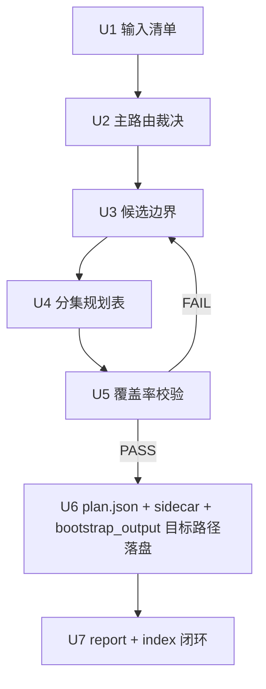
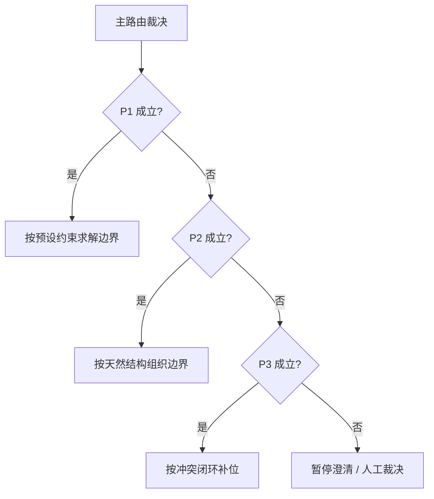

# Execution Flow

Canonical module for `1-分集` execution flow.

- upstream router: `step-by-step`
- target skill: `.agents/skills/aigc/1-规划/subtypes/1-分集`
- mode: `流程优化设计`

## 任务终局

把故事主源稳定切成可交接的逐集边界与本地 sidecar，并给出一份可追溯的分集执行报告与 `bootstrap_output` 目标路径，使父级 `1-规划`、后续 `2-格式/3-分组`、以及下游 `2-组间`、`3-明细` 都能直接消费。

## 原子单元登记表

| unit_id | 终点变化 | 输入 | 输出 | 验证点 | 返工入口 |
| --- | --- | --- | --- | --- | --- |
| U1-input-register | 锁定输入范围与累计字数 | `0-Init` 种子、故事源文件 | 输入清单 | 文件、顺序、字数齐全，且混合剧本/分镜输入未被误判为待清洗文本 | 重新扫描源文件 |
| U2-route-arbitration | 锁定唯一主路由 | 输入清单、种子约束 | 主路由决议 | `P1/P2/P3` 唯一 | 回到 VSM 判定 |
| U3-boundary-candidates | 产出候选边界集 | 主路由、文本结构/冲突证据 | 候选边界表 | 候选切点可解释 | 回到对应策略模块 |
| U4-episode-plan | 形成逐集规划草案 | 候选边界表 | 分集规划草案 | 连续、可交接 | 回到边界收窄 |
| U5-coverage-gate | 验证覆盖率 | 输入清单、分集规划表 | 覆盖率结论 | 无缺文重文越界 | 回到 U3/U4 |
| U6-file-landing | 落盘分集真源与 sidecar | 通过的分集规划表 | `Init/episode-split-plan.json` + `规划/1-分集/第N集.md` | 规划真源、sidecar 与 `bootstrap_output` 目标路径齐全，且 sidecar 未擅自剥离上游场次/镜头/运镜描述 | 回到输出模板 |
| U7-report-close | 形成闭环报告与索引 | 全部前置结果 | `Init/episode-split-report.md` + `Init/episode-index.json` | 有失败码、返工入口与集索引 | 回到对应失败步骤 |

## 依赖 / 写集 / 编排仲裁

| unit_id | 依赖 | 写集 | 默认编排 | 说明 |
| --- | --- | --- | --- | --- |
| U1-input-register | 无 | `Init/episode-split-report.md` 输入清单段 | 串行 | 后续全依赖它 |
| U2-route-arbitration | U1 | `Init/episode-split-report.md` 路由决议段 | 串行 | 主路由必须先定 |
| U3-boundary-candidates | U2 | `Init/episode-split-report.md` 候选边界段 | 串行 | 共享同一边界合同 |
| U4-episode-plan | U3 | `Init/episode-split-report.md` 分集规划段 | 串行 | 基于候选边界收窄 |
| U5-coverage-gate | U4 | `Init/episode-split-report.md` 覆盖率校验段 | 串行 | 不通过则不得落盘 |
| U6-file-landing | U5 | `Init/episode-split-plan.json` + `规划/1-分集/第N集.md` | 条件执行 | 只有 U5 通过才继续 |
| U7-report-close | U6 | `Init/episode-split-report.md` 验收段 + `Init/episode-index.json` | 条件执行 | 需要汇总最终结论 |

## Tranche 设计

| tranche | 包含单元 | 类型 | 停止条件 |
| --- | --- | --- | --- |
| T1-诊断 | `U1-U2` | 纯串行 | 输入或主路由不成立即停止 |
| T2-边界设计 | `U3-U4` | 纯串行 | 边界不可解释即停止 |
| T3-验收落盘 | `U5-U7` | 条件串行 | 覆盖率失败则阻断后续 |

## Routing / Fallback / Stop

| 场景 | 默认动作 | fallback | stop condition |
| --- | --- | --- | --- |
| `P1` 预设冲突 | 停止切文 | 回到 `P2` 或人工裁决 | 无法形成唯一总集数 |
| 输入含分镜/混合剧本描述 | 保留原文证据继续分集 | 仅记录输入类型，不做清洗改写 | 仅当下游另行明确要求标准剧本化或分镜结构化 |
| `P2` 结构不稳 | 降级到 `P3` | 记录放弃结构主路由原因 | 两轮合并/拆分后仍不可解释 |
| `P3` 节奏补位失败 | 标记 `FAIL-EPS-BOUNDARY` | 人工复核或补上游种子 | 两轮补位仍无成立边界 |
| 覆盖率失败 | 阻断落盘 | 回到 `U3/U4` | 缺文、重文、越界仍存在 |

## Mermaid

