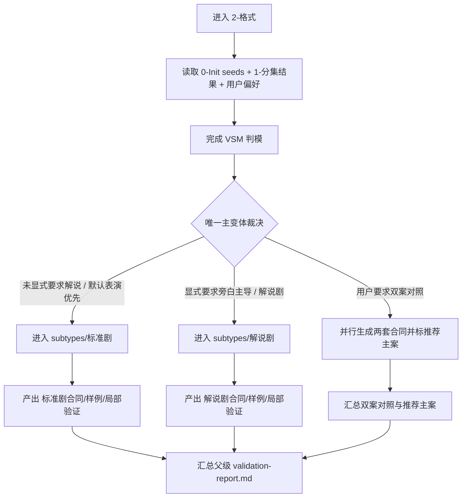
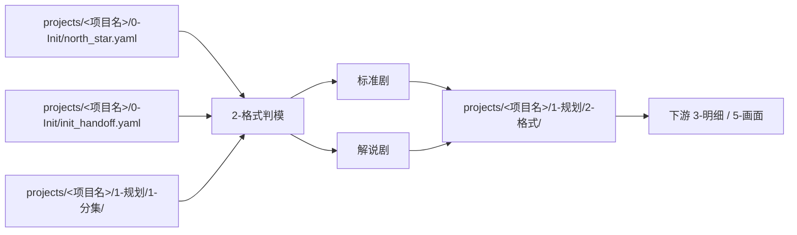

# aigc 1-规划 / 2-格式

## 概述

`2-格式` 是 `1-规划` 阶段里负责“文稿格式真源”的父技能。

它只负责三件事：

1. 识别当前项目需要哪一种文稿格式变体
2. 把格式合同、样例骨架与验收方式锁成规划层真源
3. 把唯一主变体交接给后续 `3-明细` 与 `5-画面`

它不直接代写整集正文，也不替下游阶段发明表现细节。

## When to Use

- 需要先决定项目后续剧本文稿采用哪一种结构化格式。
- 需要在 `标准剧 / 解说剧` 两种文本组织方式之间做唯一裁决。
- 需要把场景标题、文本字段、画面字段、字数同步和验证门禁提前写成规划合同。
- 需要为后续 `3-明细`、`5-画面` 提供统一消费接口，而不是每一集临时发明格式。

## When Not to Use

- 当前任务是直接写某一集正文，而不是规划文稿格式。
- 只是做单次排版美化，不需要形成可复用的项目级格式合同。
- 项目还缺少 `0-Init` 的基本种子，无法判断叙事型态和下游消费方式。

## 父技能边界

### `2-格式` 拥有

- 变体判定
- 文稿格式合同
- 字段模板与最小示例
- 结构化验证清单
- 向下游阶段的格式交接说明

### `2-格式` 不拥有

- 逐场景对白、独白、旁白正文创作
- 导演意图、视听风格或镜头语法真源
- 项目分组/批次规划

## Reference Modules (Mandatory)

`2-格式/SKILL.md` 只保留主合同、边界、路由、字段门禁与闭环；专项细则以下列模块为真源：

- `references/chain-of-thought.md`
- `references/execution-flow.md`
- `references/type-strategies.md`
- `references/output-template.md`

硬规则：

1. 详细执行链、回退链、VSM 四件套与模板骨架以下列 `references/` 文件为主。
2. 主 `SKILL.md` 只保留摘要、入口、硬门槛与回链，不再平行复制完整细则。
3. 子技能 `标准剧 / 解说剧` 必须各自继承同样的“主合同 + references”结构。

## Visual Maps

## Canonical Landing

- 父级根目录：`projects/<项目名>/1-规划/2-格式/`
- 父级总报告：`projects/<项目名>/1-规划/2-格式/validation-report.md`
- 标准剧合同：`projects/<项目名>/1-规划/2-格式/标准剧/格式合同.md`
- 标准剧样例：`projects/<项目名>/1-规划/2-格式/标准剧/格式样例.md`
- 解说剧合同：`projects/<项目名>/1-规划/2-格式/解说剧/格式合同.md`
- 解说剧样例：`projects/<项目名>/1-规划/2-格式/解说剧/格式样例.md`

## 输入合同

- `projects/<项目名>/0-Init/north_star.yaml`
- `projects/<项目名>/0-Init/init_handoff.yaml`
- `projects/<项目名>/1-规划/1-分集/` 下的逐集文档或分集执行报告
- 项目预设中的叙事类型、受众、平台时长、消费节奏说明
- 用户提供的参考文稿或既有项目格式样例

## VSM Complexity (Mandatory)

- complexity_level: `medium`
- 判定依据：存在 `叙事主通道`、`解说显式信号`、`下游消费方式`、`输入完整度` 四类变量，且存在互斥主变体与双案对照回退。
- 完整 VSM 四件套真源：`references/type-strategies.md`

## 核心约束（Mandatory）

1. 先判变体，再写格式合同。
2. 没有显式“解说剧 / 旁白主导”信号时，默认进入 `标准剧`。
3. `标准剧` 与 `解说剧` 正式落盘时默认互斥，只能输出唯一主变体。
4. 若用户明确要求“两套格式都做对照”，允许并行生成，但必须显式标注推荐主变体。
5. 参考仓只继承能力结构，不继承旧路径；所有产物必须重写到当前 `projects/<项目名>/1-规划/2-格式/`。

## Mandatory Workflow

执行摘要如下；详细 phase、fallback 与局部验证顺序见 `references/execution-flow.md`：

1. 读取 `0-Init` 种子、`1-分集` 结果与用户要求，确认任务属于“格式规划”。
2. 依据 `references/type-strategies.md` 完成变量识别、情况判定与唯一主变体裁决。
3. 路由到 `标准剧` 或 `解说剧` 子技能，生成对应的格式合同、格式样例与局部验证。
4. 在父级 `validation-report.md` 汇总采用理由、放弃原因、风险与下游交接说明。
5. 返回唯一推荐入口；若双案对照，则返回“推荐主案 + 备选案”的明确关系。

## Council Runtime Inheritance (Mandatory)

`2-格式` 不单独定义顾问团运行时，而是强制继承上层 `1-规划` 的 `Council Runtime Contract`。

执行规则：

1. 进入本父技能或其变体子技能前，先遵守 `1-规划` 根技能对项目根 `team.yaml` 的读取规则。
2. 若顾问团启用，则由 `策划` 先对格式变体裁决与下游消费方式给建议。
3. 父级 `validation-report.md` 前后若命中 `评审`，仍按 `1-规划` 根技能的阶段级闸门执行。
4. 本父技能与其变体子技能都不夺取主代理的 canonical 写回权。

## 输出合同摘要

主模板真源位于 `references/output-template.md`。父技能至少应稳定产出：

- `validation-report.md`
- 主变体选择结论
- 合同摘要与样例入口
- 放弃另一变体的原因
- 下游交接说明与返工入口

## Field Master

| field_id | 输出位置/字段 | 内容要求 | 证据来源 | 默认责任 Step | 质量维度 | 失败码 |
| --- | --- | --- | --- | --- | --- | --- |
| FIELD-FMT-VARIANT-01 | `validation-report.md / 变体裁决` | 唯一裁决为 `标准剧` 或 `解说剧`，并说明理由 | 用户要求、项目预设、`0-Init` 种子 | S1 | 判模准确性 | FAIL-FMT-VARIANT |
| FIELD-FMT-CONTRACT-02 | `<变体>/格式合同.md` | 写明场景标题、字段层级、文本层边界与使用门禁 | 参考仓能力 + 当前项目约束 | S2 | 合同完整性 | FAIL-FMT-CONTRACT |
| FIELD-FMT-SAMPLE-03 | `<变体>/格式样例.md` | 提供最小可消费样例，供下游直接对齐 | 选定变体合同 | S3 | 可消费性 | FAIL-FMT-SAMPLE |
| FIELD-FMT-VALIDATE-04 | `validation-report.md / 验收结论` | 给出结构检查项、失败码与返工入口 | 合同与样例对照检查 | S4 | 验证闭环 | FAIL-FMT-VALIDATE |
| FIELD-FMT-HANDOFF-05 | `validation-report.md / 下游交接说明` | 说明下游按何格式继续执行，以及哪些边界不在本阶段解决 | 父子技能结论 | S5 | 交接清晰度 | FAIL-FMT-HANDOFF |

## Thought Pass Map

| step_id | 聚焦字段 | 核心问题 | 生成动作 | 未达标信号 |
| --- | --- | --- | --- | --- |
| S1 | FIELD-FMT-VARIANT-01 | 现有信号支持哪一种主变体 | 锁定唯一主变体并说明原因 | 标准/解说边界模糊 |
| S2 | FIELD-FMT-CONTRACT-02 | 该变体的格式合同该交给下游什么真源 | 产出可执行格式合同摘要并回链子技能 | 只有风格描述，没有字段规则 |
| S3 | FIELD-FMT-SAMPLE-03 | 下游如何一眼理解该格式 | 确认最小样例已由子技能产出 | 样例不能直接指导写作 |
| S4 | FIELD-FMT-VALIDATE-04 | 如何知道合同可用 | 写验证清单、失败码与回退链 | 只能凭主观感觉验收 |
| S5 | FIELD-FMT-HANDOFF-05 | 如何把结果交给下游 | 产出明确交接说明 | 下游不知道按什么格式续跑 |

## Pass Table

| field_id | Pass Standard | Fail Code | Rework Entry |
| --- | --- | --- | --- |
| FIELD-FMT-VARIANT-01 | 主变体唯一且理由清楚 | FAIL-FMT-VARIANT | S1 |
| FIELD-FMT-CONTRACT-02 | 字段、门禁、边界完整 | FAIL-FMT-CONTRACT | S2 |
| FIELD-FMT-SAMPLE-03 | 样例能直接示范写法 | FAIL-FMT-SAMPLE | S3 |
| FIELD-FMT-VALIDATE-04 | 有验收项、失败码和返工入口 | FAIL-FMT-VALIDATE | S4 |
| FIELD-FMT-HANDOFF-05 | 下游入口与边界清楚 | FAIL-FMT-HANDOFF | S5 |

## Root-Cause Execution Contract (Mandatory)

当出现以下症状时，必须先修 `2-格式` 父子合同，而不是只补某一份样例文稿：

- 标准剧与解说剧的边界说不清
- 子变体已经存在，但父级看不出何时进入哪个变体
- 参考仓的“正文改写技能”被直接照搬成规划技能
- 下游每一集都重新发明字段名和场景标题格式

必经链路：

`Symptom -> Direct Technical Cause -> Rule Source -> Meta Rule Source -> Fix Landing Points`

优先检查：

- `Rule Source`
  - `.agents/skills/aigc/1-规划/subtypes/2-格式/SKILL.md`
  - `.agents/skills/aigc/1-规划/subtypes/2-格式/CONTEXT.md`
  - `.agents/skills/aigc/1-规划/subtypes/2-格式/subtypes/*/SKILL.md`
  - `.agents/skills/aigc/1-规划/SKILL.md`
- `Meta Rule Source`
  - `.agents/skills/aigc/SKILL.md`
  - 根 `AGENTS.md`

## 完成标准

- 已锁定唯一主变体
- 已产出对应变体的 `格式合同.md`
- 已产出对应变体的 `格式样例.md`
- 已汇总父级 `validation-report.md`
- 已给出下游唯一推荐入口

## Context Preload (Mandatory)

- 执行前先加载上层 `.agents/skills/aigc/1-规划/SKILL.md` 与 `CONTEXT.md`。
- 再加载本 `SKILL.md` 与本地 `CONTEXT.md`。
- 进入具体变体时，继续加载 `subtypes/<变体>/SKILL.md` 与 `CONTEXT.md`。
- 需要细化思维链、执行流、VSM 或模板时，继续加载本目录下对应 `references/*.md`。
- 若项目根 `team.yaml.enabled == true`，继承上层 `1-规划` 的顾问团运行时，不在本层重复定义第二套规则。
- 优先级遵循：用户显式请求 > 根 `AGENTS.md` > `.agents/skills/aigc/SKILL.md` > 上层 `1-规划/SKILL.md` > 本 `SKILL.md` > 各级 `CONTEXT.md`。
