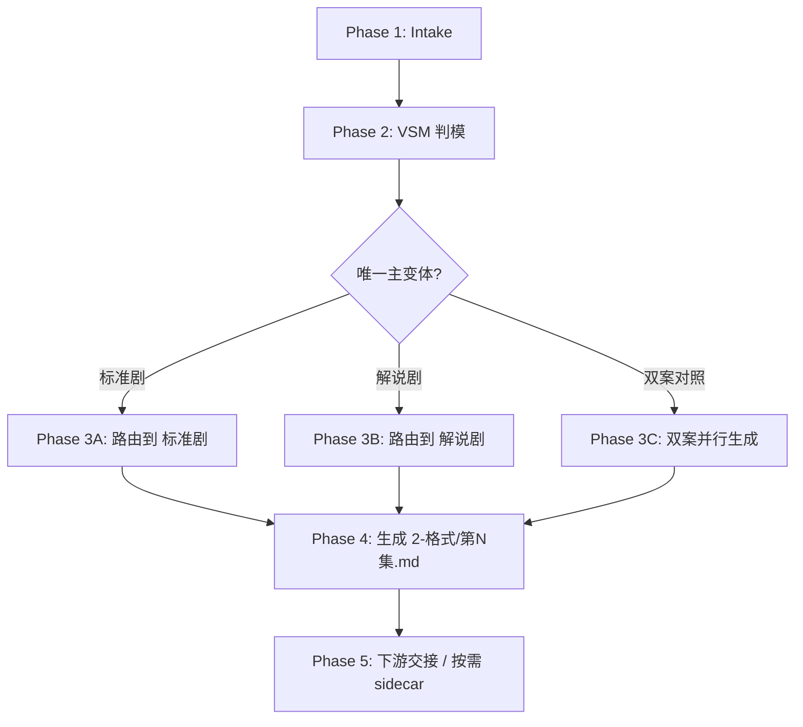

# 2-格式 / Execution Flow

本文件承载 `2-格式` 父技能的执行流程真源。

## Phase Flow

## Atomic Steps

1. 校验输入是否足以支持“格式规划”。
2. 读取 `0-Init`、`1-分集` 与用户显式要求。
3. 依照 `type-strategies.md` 完成变量登记与情况判定。
4. 产出唯一主变体结论；若双案对照，则同时标注推荐主案。
5. 读取 `story-source-manifest.yaml` 或 `metadata.source_profile`，先锁定本集的 `source_type`、`preset_retention_mode` 与场景编号粒度。
6. 若命中 `storyboard_script / hybrid_story_text + scene_boundary lock`，则在正文顶部显式写出来源画像，并把 `镜号范围 / 锚点继承` 作为独立字段保留。
7. 若上游含明确镜头语言或可解析场景块标题，先锁定“优先保留镜头语言 + 优先复用原场景结构”的特别处理，不得退回普通叙事源补齐模式。
8. 进入目标子技能，按被选变体为原文添加 `场景标题 + 字段标题`，并生成 `projects/<项目名>/规划/2-格式/第N集.md`；对分镜源应优先整理既有 `*画面` 与 `镜头语言预设`，而不是默认补造新画面。
9. 若无调试/复核要求，不默认保留项目级合同、样例、验证报告。
10. 父级只保留必要的变体结论与下游入口。
11. 返回唯一推荐入口。

## Fallback Rules

- 缺少 `0-Init` 或 `1-分集` 关键种子：暂停格式规划，回到上游补种子。
- 判模信号矛盾：优先遵循用户显式要求；若用户未定，则默认 `标准剧` 并在报告中说明。
- 用户要求双案对照：允许双开，但不允许省略推荐主案。
- 子技能只给合同不给结果稿：视为未完成，返工入口回到该子技能的模板层。
- 若执行结果对原文做了压缩、同义改写或重述：视为未完成，返工入口回到当前变体模板层，按“仅附加字段标题”重做。

## Validation Checklist

- 是否存在唯一主变体结论
- 是否给出放弃另一变体的原因
- 是否已经产出 `2-格式/第N集.md`
- 是否只附加了字段标题，而未改动原文措辞
- 若命中混合源/分镜源，是否显式写出来源画像与 `镜号范围 / 锚点继承`
- 若命中分镜源且上游已有镜头语言，是否优先保留并紧跟相关 `*画面` 字段整理
- 若命中分镜源，是否以规范化整理既有结构为主，而不是把已有分镜表达再补成第二套画面
- 场景标题是否优先复用了分镜脚本已有结构，而不是脱离上游重概括
- 是否保持 scene-first draft，且未提前写入 `## G01 / G02 ...` 组容器
- 是否给出下游唯一入口
- 是否明确返工回路
