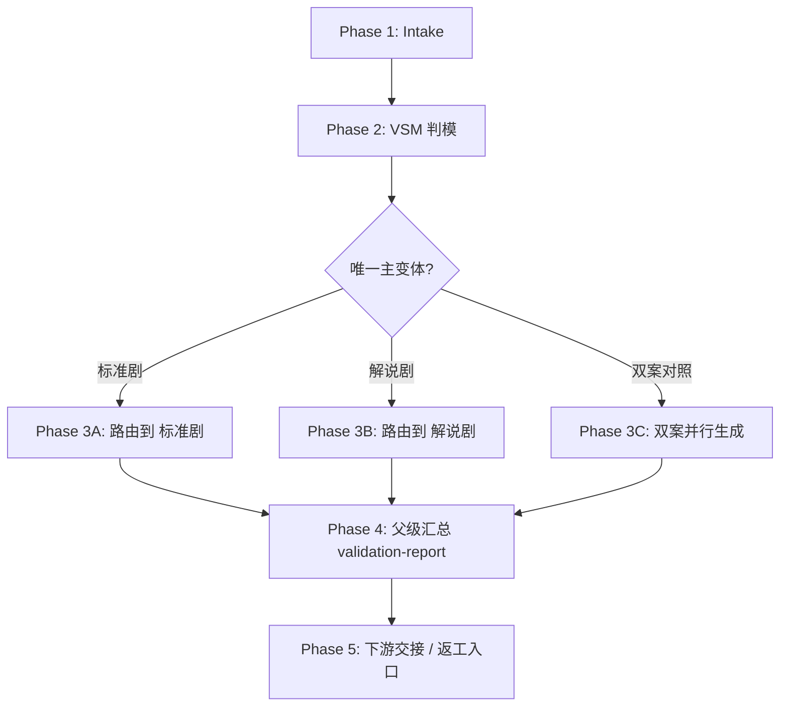

# 2-格式 / Execution Flow

本文件承载 `2-格式` 父技能的执行流程真源。

## Phase Flow

## Atomic Steps

1. 校验输入是否足以支持“格式规划”。
2. 读取 `0-Init`、`1-分集` 与用户显式要求。
3. 依照 `type-strategies.md` 完成变量登记与情况判定。
4. 产出唯一主变体结论；若双案对照，则同时标注推荐主案。
5. 进入目标子技能，等待子技能交回：
   - `格式合同.md`
   - `格式样例.md`
   - `validation-report.md`
6. 父级汇总整体报告，写明采用理由、放弃理由、下游入口与风险。
7. 返回唯一推荐入口。

## Fallback Rules

- 缺少 `0-Init` 或 `1-分集` 关键种子：暂停格式规划，回到上游补种子。
- 判模信号矛盾：优先遵循用户显式要求；若用户未定，则默认 `标准剧` 并在报告中说明。
- 用户要求双案对照：允许双开，但不允许省略推荐主案。
- 子技能只给合同不给样例：视为未完成，返工入口回到该子技能的模板层。

## Validation Checklist

- 是否存在唯一主变体结论
- 是否给出放弃另一变体的原因
- 是否已经回链到子技能产物
- 是否给出下游唯一入口
- 是否明确返工回路
