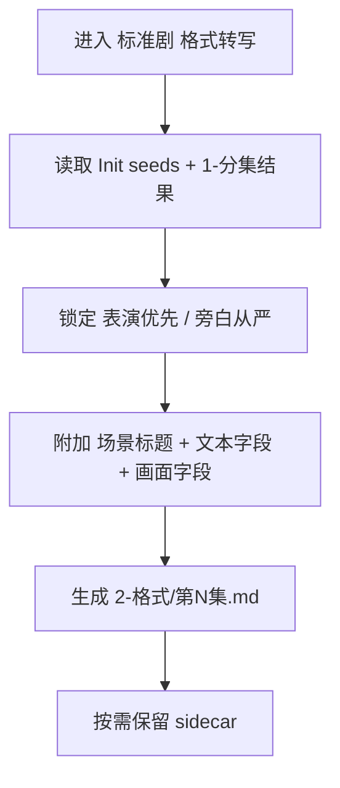
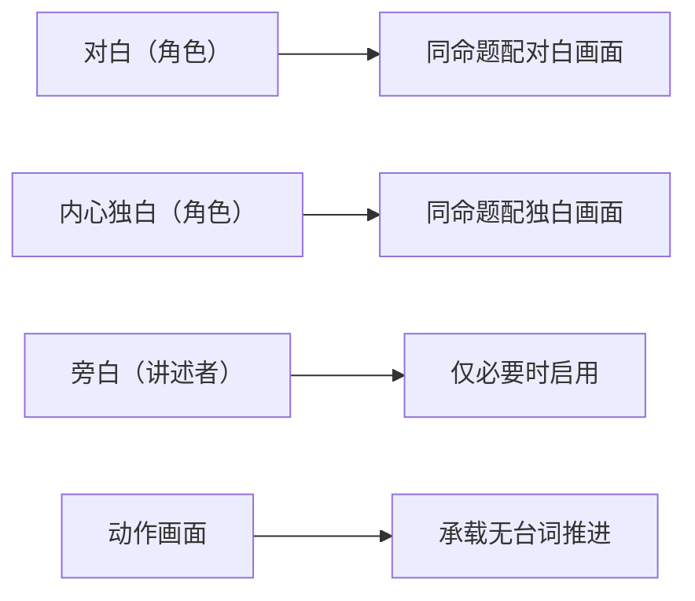

# aigc 1-规划 / 2-格式 / 标准剧

## 概述

`标准剧` 是 `2-格式` 下的默认格式变体。

它负责在不改动原文措辞的前提下，把已确定集内容整理成“表演优先、旁白从严”的标准剧结果稿，并确保字段边界与场景骨架稳定可读。

它不新增故事事实，也不承担解说剧式旁白主导职责。

## When to Use

- 项目默认走剧情表演驱动，而不是解说主导。
- 需要为后续剧本文稿规划 `对白 / 内心独白 / 旁白 / 动作画面` 的结构边界。
- 需要提前锁定“能演不念、能拍不说”的文本层使用原则。
- 用户没有显式要求“解说剧 / 旁白主导”。

## When Not to Use

- 用户明确要求高旁白密度、解说腔或旁白主导消费方式。
- 当前任务不是基于已定集内容做格式化转写。
- 项目还没完成基本分集，无法判断该格式如何承接逐集文稿。

## 变体边界

### `标准剧` 拥有

- 标准剧结果稿
- 场景标题与场景骨架
- 旁白节制门禁
- 对白、内心独白、画面字段的正文落位

### `标准剧` 不拥有

- 逐场景台词润色或重写
- 最终导演/分镜级空间调度
- 解说剧式旁白主导方案

## Reference Modules (Mandatory)

`标准剧/SKILL.md` 只保留局部合同、门槛与字段主表；专项细则以下列模块为真源：

- `references/chain-of-thought.md`
- `references/execution-flow.md`
- `references/type-strategies.md`
- `references/output-template.md`

## Visual Maps

## Canonical Landing

- 变体运行时结果：`projects/<项目名>/规划/2-格式/第N集.md`
- 变体说明性 sidecar：仅在调试/复核时按需保留

## VSM Complexity (Mandatory)

- complexity_level: `medium`
- 判定依据：需要同时处理 `旁白启用阈值`、`内心独白是否必要`、`样例复杂度` 三类变量。
- 完整 VSM 四件套真源：`references/type-strategies.md`

## 核心聚焦（Mandatory）

1. 标准剧默认“表演优先、旁白从严”。
2. 允许规划 `对白 / 内心独白 / 旁白 / 动作画面` 四层，但 `旁白` 不是默认常开层。
3. 场景标题默认按 `### 场景X：<场景信息>` 组织；若同一连续时空跨组续写，允许使用 `场景X（续）`。
4. 任何文本层一旦启用，都应规划对应的同命题 `*画面` 字段。
5. 规划层只定义格式与门禁，不直接代写该集完整正文。
6. 默认执行模式为“原文保真 + 字段标题附加”；不得把原文改写成摘要、剧本化重述或润色版正文。
7. 若当前集来自 `storyboard_script / hybrid_story_text`，则应优先保留上游已明确写出的镜头语言，并把既有分镜表达整理成规范字段；不得把 storyboard source 当成待补齐的空白画面稿。

## 核心约束（Mandatory）

1. 默认分支:
   - 用户未显式要求 `解说剧` 时，标准剧是 `2-格式` 的默认主变体。
2. 旁白节制:
   - 合同必须明确“允许整场景零旁白”。
   - 如果 `动作画面`、`对白`、`内心独白` 已足以表达信息，不应再规划重复 `旁白`。
3. 主体明确:
   - 若规划启用 `对白 / 内心独白 / 旁白`，其样例格式都必须带主体。
   - `旁白` 若启用，主体统一规划为 `讲述者`。
4. 动作剥离:
   - 动作信息应规划进 `动作画面` 或对应 `*画面`，不应混入引号正文。
5. 规划边界:
   - 本技能产物是“格式合同 + 样例 + 验收”，不是逐集正片正文。
6. 若当前集来自 `storyboard_script` 或 `hybrid_story_text`，且上游锁定了 `scene_boundary`，则 `场景号` 只能绑定连续时空单元；`镜号范围 / 锚点继承` 必须显式写在场景标题下，不得把镜号逐条改写成新场景号。
7. 若上游分镜脚本明确写出了运镜或镜头提示，`镜头语言预设` 从可选字段提升为优先保留字段；其内容只能整理上游已写出的提示，并必须紧跟相关 `*画面` 条目。
8. 对分镜脚本来源，画面处理策略默认是“规范化整理既有结构”，而不是普通叙事源下的补齐型写法。
9. 场景标题若可从分镜脚本已有场次/镜头块稳定提取，必须优先复用上游结构证据，不得先抹平再重新概括。

## 输出合同摘要

详细模板真源位于 `references/output-template.md`。本变体至少应稳定产出：

- `projects/<项目名>/规划/2-格式/第N集.md`

## Field Master

| field_id | 输出位置/字段 | 内容要求 | 证据来源 | 默认责任 Step | 质量维度 | 失败码 |
| --- | --- | --- | --- | --- | --- | --- |
| FIELD-STD-VARIANT-01 | `第N集.md / 文稿格式` | 明确标准剧是表演优先、旁白从严的结果稿分支 | 用户要求、`Init` 种子 | S1 | 变体定位清晰度 | FAIL-STD-VARIANT |
| FIELD-STD-SCENE-02 | `第N集.md / 场景标题规范` | 固定 `### 场景X：<场景信息>` 骨架；连续时空续写时允许 `场景X（续）`，并显式保留 `镜号范围 / 锚点继承` | 参考仓高价值结构 + 上游 source_profile | S2 | 结构一致性 | FAIL-STD-SCENE |
| FIELD-STD-FIELDS-03 | `第N集.md / 正文字段` | 明确文本层与画面层的正文落位，且正文保持原文措辞 | 参考仓字段模式 | S3 | 字段完整性 | FAIL-STD-FIELDS |
| FIELD-STD-RESTRAINT-04 | `第N集.md / 转写门槛` | 明确零旁白可接受、动作剥离、同命题配对 | 标准剧体裁边界 | S4 | 体裁约束准确性 | FAIL-STD-RESTRAINT |
| FIELD-STD-CAMERA-05 | `第N集.md / 镜头语言预设` | 分镜源下优先保留上游明确镜头提示，紧跟相关 `*画面` 条目，禁止脑补新增 | 分镜脚本原镜头语言、source_profile | S5 | 运镜保真度 | FAIL-STD-CAMERA |

## Thought Pass Map

| step_id | 聚焦字段 | 核心问题 | 生成动作 | 未达标信号 |
| --- | --- | --- | --- | --- |
| S1 | FIELD-STD-VARIANT-01 | 为什么这里是标准剧 | 锁定表演优先的变体定位 | 跟解说剧边界混用 |
| S2 | FIELD-STD-SCENE-02 | 场景骨架如何统一 | 固定场景标题规范 | 每集标题格式漂移 |
| S3 | FIELD-STD-FIELDS-03 | 允许哪些字段 | 写出文本层与画面层骨架，并把原文原样挂到对应字段 | 字段名仍靠临场发挥，或原文被改写 |
| S4 | FIELD-STD-RESTRAINT-04 | 哪些规则必须收紧 | 固化旁白节制与动作剥离 | 旁白被当成默认层 |
| S5 | FIELD-STD-CAMERA-05 | 上游镜头语言如何保真投影 | 锁定 `镜头语言预设` 的条件启用与邻接规则 | 凭空新增镜头语言或挂错位置 |
| S6 | FIELD-STD-SAMPLE-05 | 下游如何直接照写 | 产出最小样例 | 样例无法指导续写 |

## Pass Table

| field_id | Pass Standard | Fail Code | Rework Entry |
| --- | --- | --- | --- |
| FIELD-STD-VARIANT-01 | 变体定位清楚，不混入解说剧语义 | FAIL-STD-VARIANT | S1 |
| FIELD-STD-SCENE-02 | 场景标题规范明确统一 | FAIL-STD-SCENE | S2 |
| FIELD-STD-FIELDS-03 | 允许字段和主体格式完整，且原文未被改写 | FAIL-STD-FIELDS | S3 |
| FIELD-STD-RESTRAINT-04 | 旁白节制、动作剥离、配对规则清楚 | FAIL-STD-RESTRAINT | S4 |
| FIELD-STD-CAMERA-05 | 分镜源下镜头语言已优先保留，且只整理上游明确提示 | FAIL-STD-CAMERA | S5 |

## Council Runtime Inheritance (Mandatory)

`标准剧` 不单独定义顾问团运行时，而是强制继承 `1-规划` 根技能与 `2-格式` 父技能的顾问团合同。

执行规则：

1. 直接进入本叶子技能时，仍必须先读取 `projects/<项目名>/team.yaml` 与 `.agents/skills/aigc/_shared/council-runtime/module-spec.md`。
2. 若顾问团启用，则由 `策划` 先对标准剧格式选择、表演承载边界与下游消费方式提供前置建议。
3. 父级与阶段级 `validation-report.md` 前后若命中 `评审`，仍分别按 `2-格式` 与 `1-规划` 既有闸门执行。
4. 本叶子技能不夺取主代理的 canonical 写回权。

## Root-Cause Execution Contract (Mandatory)

当出现以下症状时，必须优先修本子技能的源层合同，而不是只补某一页格式样例：

- 标准剧样例写成了解说腔
- 旁白虽然未被要求，却在格式合同里变成默认层
- 只有字段名，没有体裁边界和硬门槛
- 当前仓规划技能直接复制了参考仓的“正文改写”职责

必经链路：

`Symptom -> Direct Technical Cause -> Rule Source -> Meta Rule Source -> Fix Landing Points`

优先检查：

- `Rule Source`
  - `.agents/skills/aigc/1-规划/subtypes/2-格式/subtypes/标准剧/SKILL.md`
  - `.agents/skills/aigc/1-规划/subtypes/2-格式/subtypes/标准剧/CONTEXT.md`
  - `.agents/skills/aigc/1-规划/subtypes/2-格式/SKILL.md`
- `Meta Rule Source`
  - `.agents/skills/aigc/1-规划/SKILL.md`
  - `.agents/skills/aigc/SKILL.md`
  - 根 `AGENTS.md`

## 完成标准

- 已写清标准剧的变体定位
- 已给出场景标题和允许字段正文落位
- 已写清旁白节制与动作剥离门禁
- 已产出可直接阅读的标准剧结果稿
- 已给出可交给下游的格式真源

## Context Preload (Mandatory)

- 执行前先加载 `.agents/skills/aigc/1-规划/SKILL.md` 与 `CONTEXT.md`。
- 再加载 `.agents/skills/aigc/1-规划/subtypes/2-格式/SKILL.md` 与 `CONTEXT.md`。
- 最后加载本 `SKILL.md` 与本地 `CONTEXT.md`。
- 需要细化局部思维链、执行流、类型策略与模板时，继续加载本目录 `references/*.md`。
- 优先级遵循：用户显式请求 > 根 `AGENTS.md` > `.agents/skills/aigc/SKILL.md` > 上层 `1-规划/SKILL.md` > 父级 `2-格式/SKILL.md` > 本 `SKILL.md` > 各级 `CONTEXT.md`。
