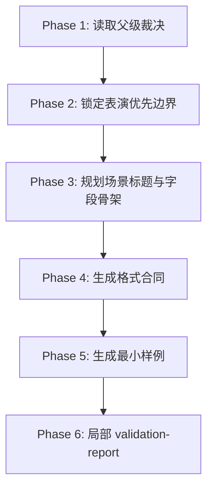

# 标准剧 / Execution Flow

本文件是 `标准剧` 的局部执行流程真源。

## Phase Flow

## Atomic Steps

1. 读取父级裁决与上游种子。
2. 确认本轮不需要解说剧式旁白主导。
3. 写 `格式合同.md`：
   - 变体定位
   - 场景标题规范
   - 允许字段
   - 硬门槛
4. 写 `格式样例.md`，至少体现动作画面与对白配合。
5. 写 `validation-report.md`，说明是否满足“表演优先、旁白从严”。

## Fallback

- 发现高旁白密度要求：回到父级重新判模。
- 样例只能靠旁白解释：回到 `Pass 2` 重做字段承载分配。
- 字段缺少 `*画面` 配对：回到 `Pass 3` 补齐。
